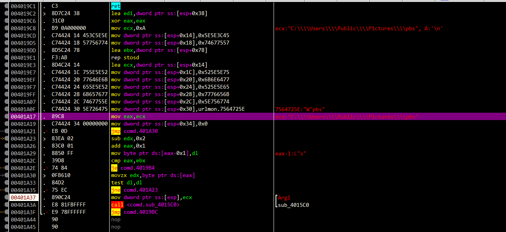

# 背景介绍

APT-C-35（肚脑虫），也称Donot，是一个来自于南亚的境外APT组织，其主要针对巴基斯坦及周边国家地区的政府机构进行网络间谍活动，以窃取敏感信息为主。该组织的攻击活动最早可追溯到2016年，近年来该组织活动频繁，不断被数个国内外安全团队持续追踪和披露。

近期，360高级威胁研究院在日常威胁狩猎中多次发现APT-C-35（肚脑虫）组织的攻击活动。在本轮攻击行动中，该组织依然采用宏文档作为恶意载体，从自身释放恶意载荷并执行，通过层层下载的方式加载远控模块，从而实现窃密行动，并且整个过程的恶意代码均带有数字签名信息。

# 载荷投递

| 文件名称 | trix.xls                         |
| -------- | -------------------------------- |
| 文件大小 | 2.95 MB                          |
| MD5      | 828174ee0a9f25eaad48957ced66b81d |

alt+F11打开宏加密了 用vbs_password工具过一下

看到里面这么多东西 80十进制 十六进制是50 判断是rar头文件 50 4B

直接判定此时是写入数据

​	

接着创建三个计划任务，运行指定的文件，以此实现驻留。

## pbs.bat

我们来看生成文件夹 pbs.bat文件 他作用就是解压缩 comd.zip  删除计划任务

## My_Drive计划任务

My_Drive任务就是执行解压后的恶意文件，从而开启完整攻击。

# 攻击组件分析

## comd.exe

我们看看这个解压缩后的文件 发现虽然有数字签名 可能是过期了 此时不可用

分别从地址http://blogs.libraryutilitis.live/vrhkdkjrajksrjkaskdoneS/rbjhrkjahsrjejka下载得到pbs PE文件和从地址http://blogs.libraryutilitis.live/nrasjkhrsjkdrhkdfjkB/klrjajlrjklrkljaklrjklasklf下载得到pbs.bat

，该批处理文件的功能是将pbs改名为creep.exe并执行，同时又由于pbs.bat是Pls_SSL计划任务的执行文件，从而以此实现了creep.exe的驻留。

此时下载失败 网站应该是挂了 去微步拿一个

## creep.exe

该文件与上一阶段具有相同的数字签名信息， 也是一个Downloader,主要完成下载功能，解密出地址https://blogs.libraryutilitis.live/hkjnlkhfshjkls2/nrjukurjhajrjh并下载为%USERPROFILE%Servicing\Packages\Hyper\mnps.exe

这个exe没有获取到样本

