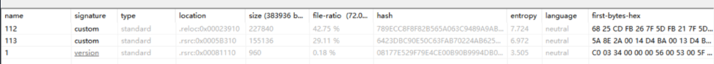
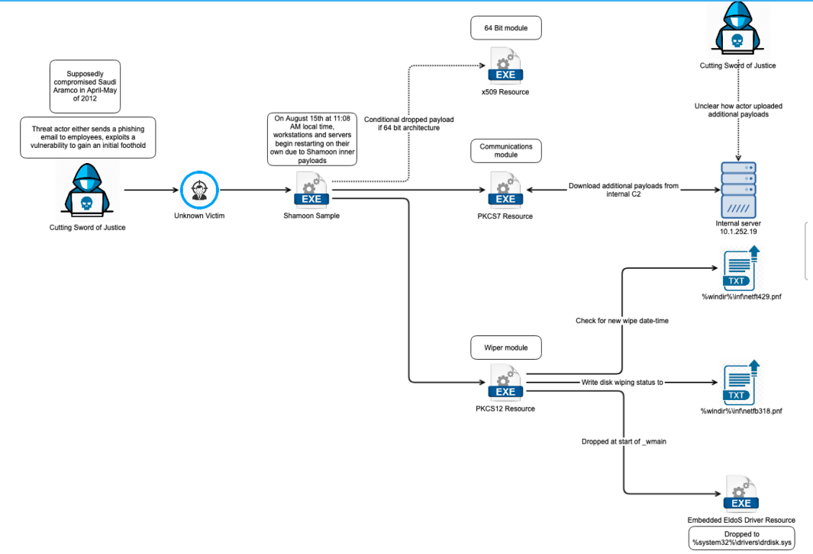

# 简述

Shamoon 恶意软件的第一个已知目标是沙特阿拉伯国家石油公司Aramco和卡塔尔天然气公司Rasgas，虽然他们是一家私人控股公司，但据估计该公司的价值在 1-3 万亿美元之间。目前尚不清楚 Shamoon 是如何进入目标公司系统的。一些报道称，这是通过[Acunetix 漏洞扫描程序](https://www.acunetix.com/vulnerability-scanner/)、网络钓鱼电子邮件，甚至是员工插入机器的恶意 USB。推测是威胁者在 2012 年 4 月或 5 月左右进入网络，并在接下来的几个月中横向移动并试图访问域控制器。

# 样本分析

## 主模块

### pe文件解析

可以看到主模块含有三个资源，直接查看资源没有看到相关的文件格式，应该是解密释放

### Wmian函数分析

### 资源解密

# 总结

样本运行后创建名为wow32服务，并创建自己到%WINDIR%\System32 目录下名trksvr.exe，之后检查创建状态，通过服务入口函数实施后续行为，之后解密释放两个资源，第一个资源是PKCS7:113，与位于沙特阿美公司环境中的服务器通信，通过c2在%WINDIR%\inf\netft429.pnf中创建一个文件并写入一个新的引爆时间以供其他模块使用，之后主模块读取WINDIR%\inf\netft429.pnf并获取当前系统时间，通过判断系统时间是否为和\\inf\\netft429.pnf文件读取“引爆时间”来判断释放解密另一个资源PKCS12:112。它使用从 %WINDIR%\System32 文件夹中的硬编码列表中获取的名称维护保存到磁盘的编码可执行文件。该模块负责 Shamoon 的破坏性功能，并在目标时间到来时执行。破坏性模块带有资源 READONE :101。这是一个编码驱动程序，它以 %WINDIR%\System32\Drivers\DRDISK.SYS 的形式保存到磁盘，并借助命令行在破坏性模块执行的初始阶段运行：破坏性模块选择性地破坏文件。结果，在 %WINDIR%\System32 文件夹中创建了两个文件 ?f1.inf 和 ?f2.inf，其中包含要填充垃圾的完整路径的文件名。垃圾构成燃烧的美国国旗的 JPEG 图片的片段

或者硬编码判断在2012年8月15日8时“引爆”程序，进行删除主机引导扇区、删除主机文件等破坏行为，

并最后恶意软件会运行 ?shutdown -r -f -t 2 命令行，

# 攻击链路图

# IOCs

| IOC VALUE                                                    | RATIONALE                                                    |
| :----------------------------------------------------------- | :----------------------------------------------------------- |
| MD5:0B69DAD14A1E6A4D53D0D097A4AE7049                         | 主函数                                                       |
|                                                              |                                                              |
|                                                              |                                                              |
| http://10.1.252.19/ajax_modal/modal/data.asp?mydata=&uid=&state=CurrentMilliseconds | URL scheme and hardcoded IP for internal C2                  |
| http://home/ajax_modal/modal/data.asp?mydata=&uid=&state=CurrentMilliseconds | URL scheme and hardcoded IP for internal C2                  |
| %windir%\inf\netft429.pnf                                    | Hardcoded file path for new detonation date                  |
| %windir%\inf\netfb318.pnf                                    | Hardcoded file path for wiping completion status             |
| %system32%\drivers\drdisk.sys                                | Hardcoded file path for the EldoS wiping driver to be written to |
| c:\windows\temp\out17626867.txt                              | Path contained within the Shamoon dropper                    |
| \\System32\\cmd.exe /c \"ping -n 30 127.0.0.1 >nul && sc config TrkSvr binpath= system32\\trksrv.exe && ping -n 10 127.0.0.1 >nul && sc start TrkSvr \" | Hardcoded command used by Shamoon to start a service         |
| trksrv.exe                                                   | x509 dropped filename                                        |
| %WINDIR%\Temp\filer.exe                                      | File received and executed from the internal C2              |
| f2.inf                                                       | Data gathered from PKCS12 resource                           |
| f1.inf                                                       |                                                              |

