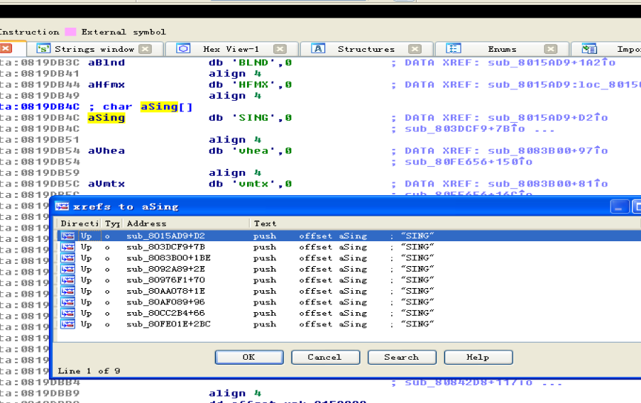
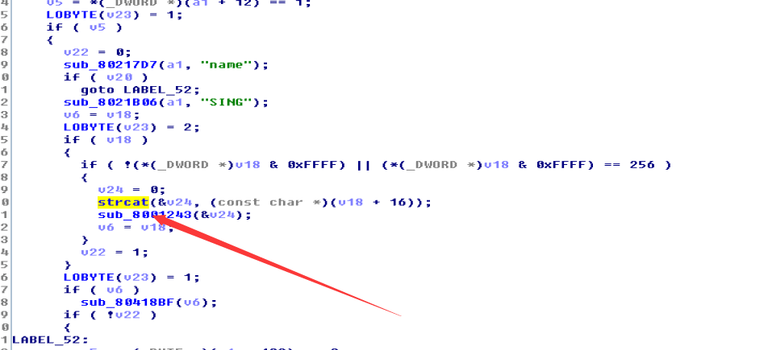
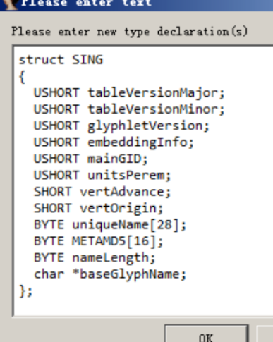

# 前言

该漏洞是Adobe Reader和Acrobat中的CoolType.dll库在解析字体文件SING表中的uniqueName项时存在的栈溢出漏洞。

# 环境搭建

操作系统 Windows XPX86 SP3 简体中文版 

漏洞软件 Adobe Reader 版本号： 9.3.4 

# 漏洞复现过程

网上随便下载一个Adobe Reader 版本对得上 然后去它下载的文件夹里搜索 CoolType.dll

用ida 打开搜索SING字符串 然后交叉引用



在第二项那里 看到strcat 函数所以大概率应该就是这里存在漏洞了




上面的代码已经做了部分处理和注释，这里用到一个技巧，就是按Shift+F1，打开LocalTypes窗口，再按Insert，插入C语言写的结构体SING，然后修改变量类型为SING，这样比较方便分析。



4.1格式分析
4.1.1 TableEntry结构在官方文档中的定义如下:


	

```
Typedef struct_SING

{

Char tag[4];   //SING字符串

ULONG checkSum;    //校验和

ULONG offset;  //相对文件偏移

ULONG length;  //数据长度

}
```

在该样本中,SING表的形态

```
Char tag[4];    //53 49 4E 47

ULONG checkSum; //D9 BC C8 B5

ULONG offset;  //00 00 01 1C


```

根据上图可以看出,在TableEntry结构入口处偏移0x11c,就是SING表的真实数据,其长度为0x1DDF。然后再偏移0x10就是uniqueName域了。

### 4.1.3 uniqueName域

在执行strcat函数后,会将SING表的内容部分拷贝至ebp的地址,直到遇到NULL,在我调试时,该地址为0x0012e454,但是该地址并不固定。根据下图,可以看出在exp触发后ebp的地址内所存储的,正是SING表的真实数据。
