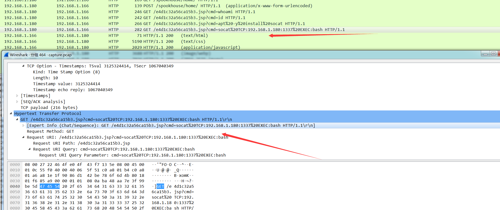
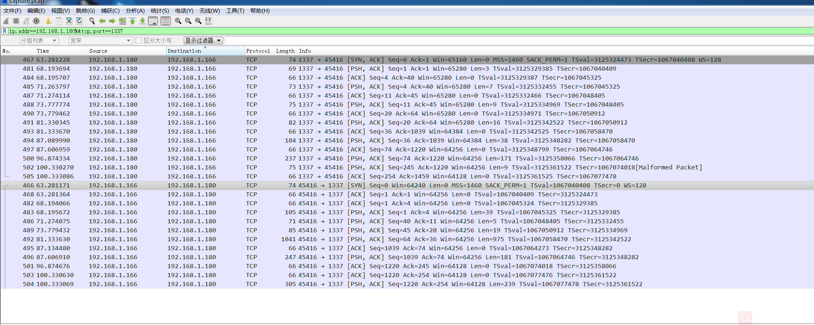
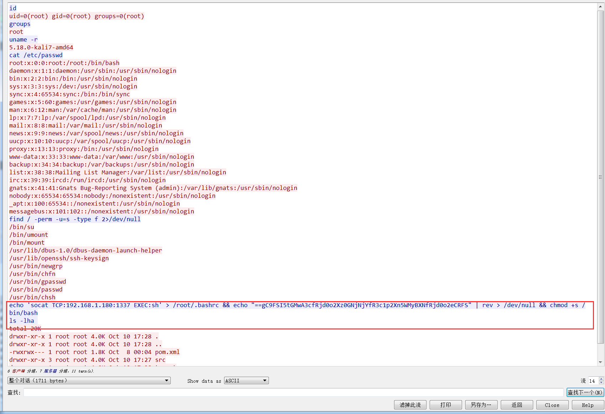
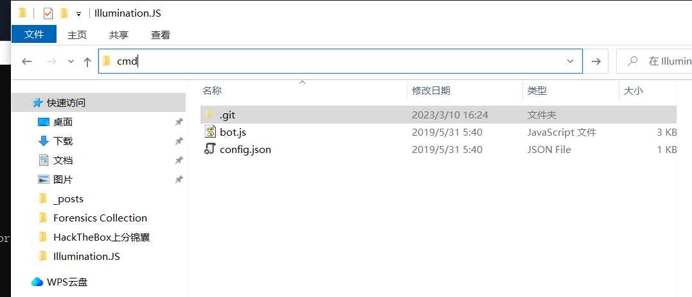
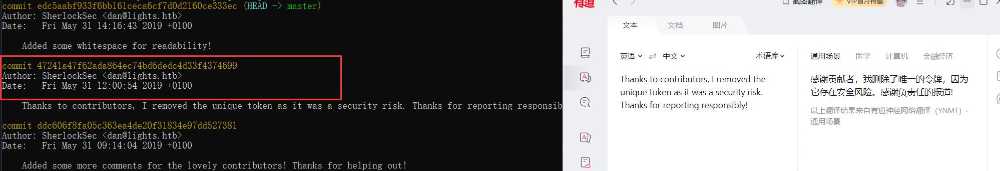
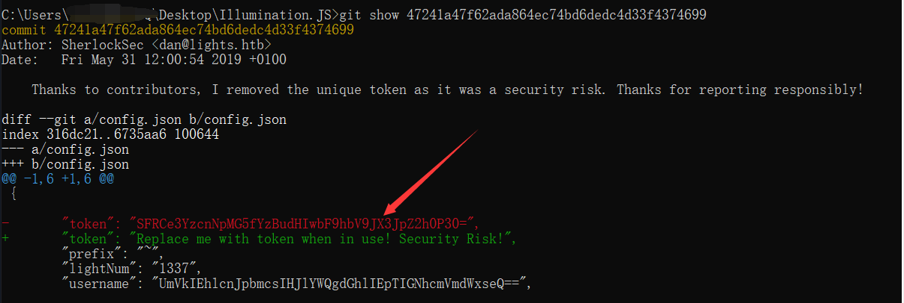
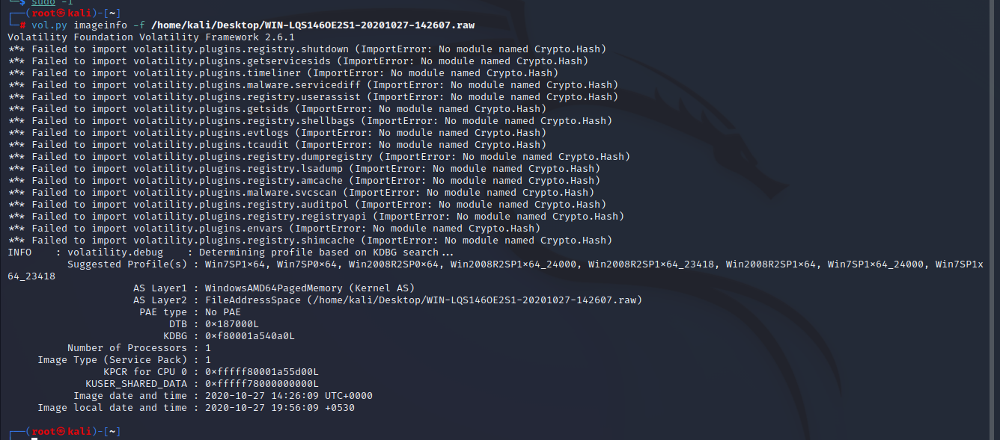
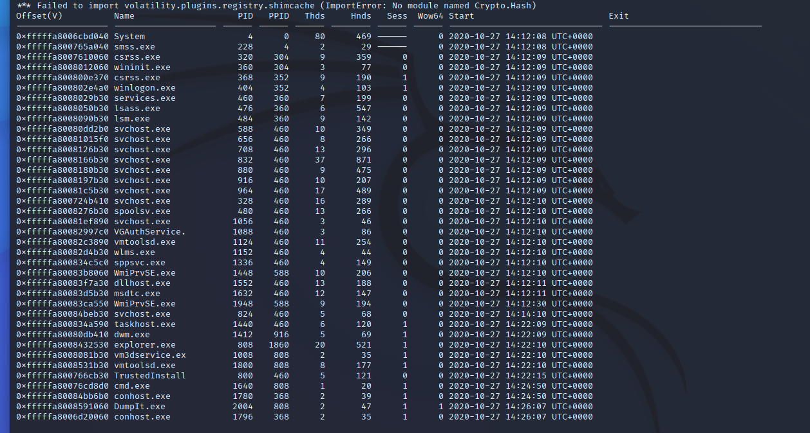
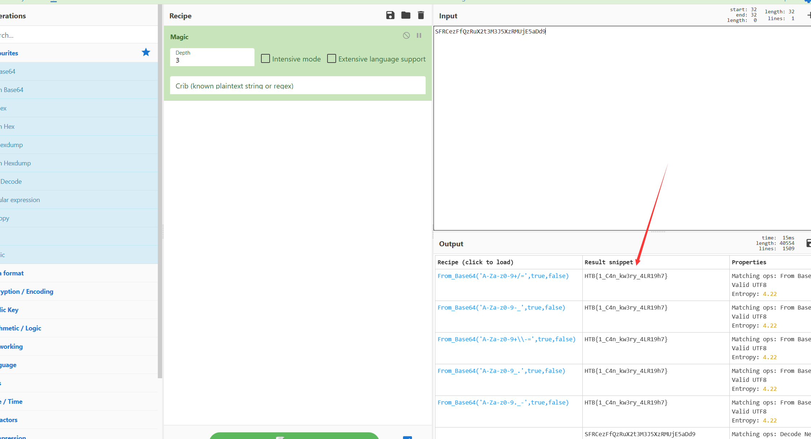

下载之后是一个pacp 流量包


打开我直接搜http


然后看到许多访问目标网站资源并且带cmd命令，这一看就有问题





我去搜了一下socat是什么意思

*Socat*命令可以比作与TCP和UDP协议绑定的netcat 实用程序。

Socat 的主要特点就是在两个数据流之间建立通道，且支持众多协议和链接方式。


好 看一眼 他要建立通道

有ip 有端口 直接搜

ip.addr==192.168.1.180&&tcp.port==1337



关联到tcp流，从第一个开始追踪，右键




看起来像base64 但是等号在前面  

我们看后面的代码被管道传输到rev命令去进行反转了

> 管道 ( `|`) 允许您将一个命令的输出重定向到另一个命令。


再让他运行一遍就变正了


```
echo "==gC9FSI5tGMwA3cfRjd0o2Xz0GNjNjYfR3c1p2Xn5WMyBXNfRjd0o2eCRFS" | rev | base64 -d
```

> `-d`该命令使用的标志用于`base64`解密数据。


# Illumination


打开看代码 一点问题也没有  

后来发现不是代码 和配置文件 要看日志 要看他修改了啥 毕竟那个config里面有提示

修改过了 

那我实在不会 就去看答案 上面写git  

我一搜 git log意思是查看提交修改日志

git diff （查看比较某文件修改内容，不同之处） 




直接git log




然后

```
git show 

//对于提交，它显示日志消息和文本差异。 
```



# Chase

https://josh-vr.medium.com/hackthebox-chase-forensics-challenge-writeup-eebf72d6051f

# 

# Export

## 在 SANS SIFT 工作站中使用 Volatility 进行内存取证

# 概括

Export 是他们的取证列表中的一项 HackTheBox 挑战。对于这个挑战，我得到了一个`.raw`文件，该文件是系统的内存转储，在该文件中进行了内存取证以弄清楚在创建转储期间发生了什么。通过使用内存取证工具 Volatility，我能够获得有关我看到`cmd.exe`正在使用的系统上运行的进程的信息。围绕使用命令行完成的操作进行进一步分析，找到了该标志。

# 进行内存取证

## 什么是内存取证？

内存取证与更传统的取证不同，在传统取证中，分析师会获得一个持久性数据设备，例如硬盘驱动器、SSD 或 USB 记忆棒。在内存取证中，分析师将对易失性内存进行取证分析——包含在机器正常使用期间可能被替换或丢失的数据的内存，如 RAM。

## 什么是波动率？

对于这个挑战，我使用了内存取证工具Volatility来做分析。Volatility 是一个用 python 编写的开源工具，它已经在[SANS SIFT 工作站](https://digital-forensics.sans.org/community/downloads)中安装和配置，SANS SIFT工作站是一个 Ubuntu 虚拟机，其中包含已经预装的开源数字取证和事件响应工具。易失性用于帮助检索存储在计算机易失性内存中的有用信息，例如正在运行的进程、DLL 信息和文件的修改时间戳。

## 分析

在我完成查找标志的方法之前，这里是我使用的两个波动率备忘单：

- [SANS 内存取证备忘单 v2.0](https://digital-forensics.sans.org/media/volatility-memory-forensics-cheat-sheet.pdf)
- [Volatility Foundation 的 Volatility Cheat Sheet v2.4](https://downloads.volatilityfoundation.org/releases/2.4/CheatSheet_v2.4.pdf)

一般来说，所有的波动率指令都是以下形式：

```
vol.py -f <memory file> --profile=<profile> <plugin>
```

所以对于这个挑战，我得到了一个`.raw`文件，它是系统的内存文件（转储）。此文件格式与 Volatility 兼容。这`profile`是操作系统，以便 Volatility 可以更准确地收集基于操作系统的信息。最后，`plugin`将要检查的内容（例如，`dlllist`插件将列出所有已加载的 DLL）。

因此，先决条件是找到要使用的配置文件，为此我执行了命令`vol.py imageinfo -f <file>`。



结果，top `Suggested Profile`is`Win7SP1x64`这意味着有问题的系统很可能是 Windows 7 SP1 64 位系统。现在配置文件已经确定，我可以在以后的命令中使用它。所以我运行的每个波动率命令都是这种格式：


```
vol.py pslist --profile=Win7SP1x64 -f /home/kali/Desktop/WIN-LQS146OE2S1-20201027-142607.raw  
```




出现一堆进程，我们来观察一下，下面有一个cmd命令


```
为此，插件正在cmdscan执行命令
vol.py -f /home/kali/Desktop/WIN-LQS146OE2S1-20201027-142607.raw --profile=Win7SP1x64 cmdscan 
以查看命令历史记录：
```

出东西了 

http%3A%2F%2Fbit.ly%2FSFRCe1cxTmQwd3NfZjByM05zMUNTXzNIP30%3D.ps1  解码一下

这个网站牛逼

https://gchq.github.io/CyberChef/

 解密就有

# Insider

题目提供了一个Firefox浏览器的数据目录，该目录保存了浏览器使用者的书签、密码和其他用户数据的位置。用户在 Firefox 中所做的所有更改，例如主页、使用的工具栏、安装的扩展程序、保存的密码和书签，都存储在一个特殊的文件夹 `Profiles`。 你找一下

firefox保存的密码肯定是加密过的。我们可以通过一个开源工具[firefox_decrypt](https://github.com/unode/firefox_decrypt) 来解密firefox中保存的密码。

运行

```
python /home/kali/Desktop/firefox_decrypt-master/firefox_decrypt.py /home/kali/Desktop/2542z9mo.default-release 
```

出来了

# Persistence

kali里面 file命令 看看是个注册表文件

https://github.com/keydet89/RegRipper3.0 下载 注册表分析软件

然后你知道 持久化 路径 肯定带run 然后就上上面那个网站解密



# Logger

