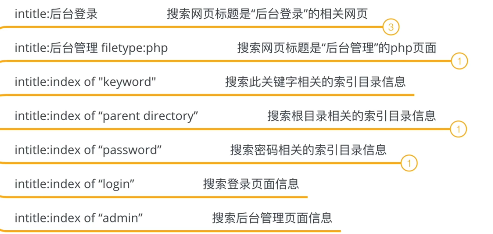
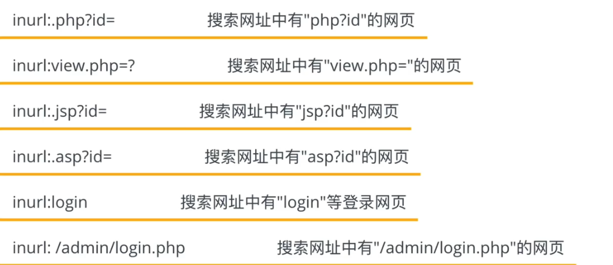
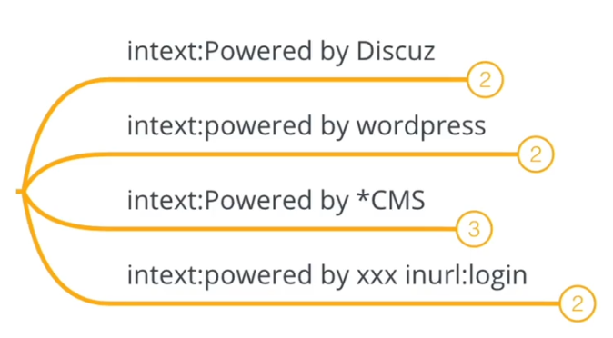

# Google Hacking语法

## 准确搜索

 简单有效的方法就是在关键词上加上*双引号*“”, 这样搜索引擎只会返回和关键词完全吻合的搜索结果.
在不加双引号的情况下,有的时候, 两个词中间加一个空格, 它会分别搜索两个词, 可能返回的结果不是我们想要的结果.  

## 排除关键词 

 *想要排除百度百科*   如图,如果想要的不是自己想要的结果, 可以使用 *-* 这个减号即可对指定内容进行排除.

 

## **用 OR (或)逻辑进行搜索** 

 在默认搜索下, 搜索引擎会反馈所有和查询词汇相关的结果, 如果通过*OR* 或者是|搜索, 可以得到和两个关键词分别相关的结果, 而不仅仅是和两个关键词都同时相关的结果. 

## **同义词搜索 ~** 

 在未能准确判断关键词的情况下，你可以通过 *~* 进行同义词搜索。 

## **站内搜索** 

 在输入框输入 *site: 网址 关键字* 就会在输入的网址内进行站内关键字搜索 

 

## **善用 \* 星号** 

 搜索是可以使用 *星号填补缺失的部分. 

## **在两个数值之间进行搜索** 

用加号 +  比如说

 

## **在网页标题, 链接和主体中搜索关键词** 

  如果是想匹配标题关键字是 *intitle:* ,

如果想匹配网址链接 *inurl:* .

, 如果是主体的话是 *intext:* 就是正文  

## **搜索相关网站** 

 使用*related: 网址* 就会得到这个网址相关的结果. 

## 搜索指定文件类型

filetype 或ext 搜索指定文件类型

