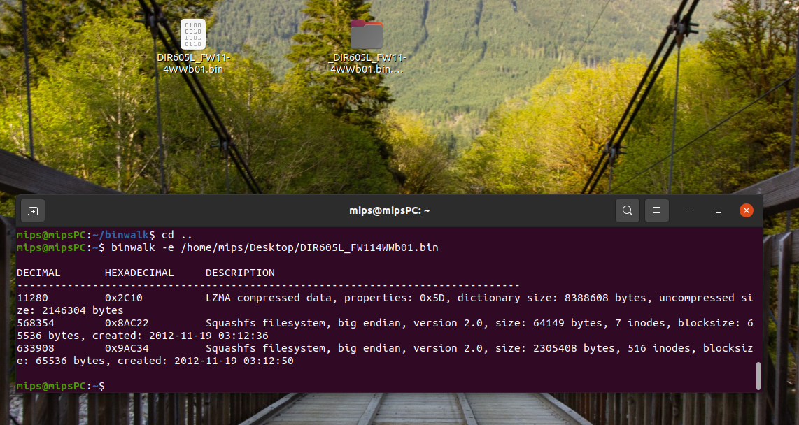
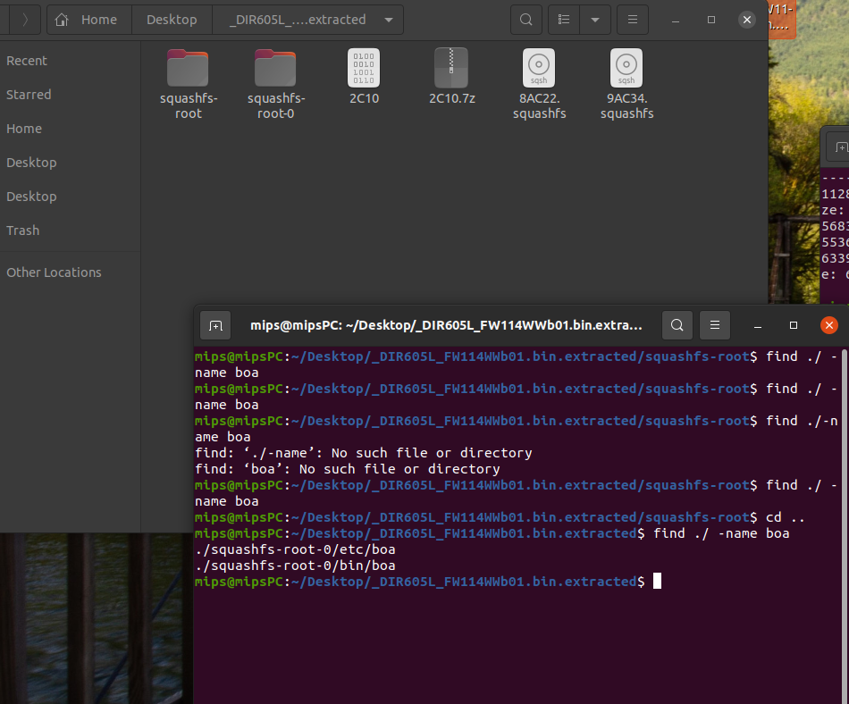
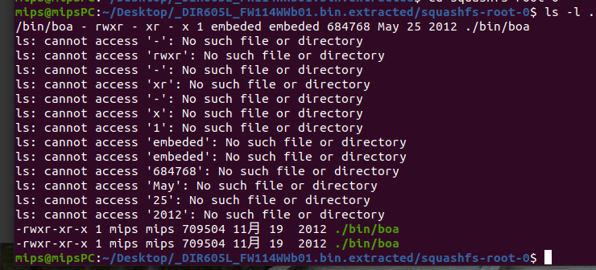

# 环境

不废话，先搭环境，

## qemu 的介绍

QEMU 是一个面向完整 PC 系统的开源仿真器。

除了仿真处理器外，QEMU 还允许仿真所有必要的子系统，如连网硬件和视频硬件。

它还允许实现高级概念上的仿真（如对称多处理系统（多达 255 个 CPU）和其他处理器架构（如 ARM 和 PowerPC）。

qemu 虚拟机的搭建就是在 Vm Ubuntu 虚拟机下**再使用 qemu 来搭建一个 mips 系统的虚拟机，将路由器系统固件放在里面运行。**

## python

sudo apt-get install python2.7

## binwalk 安装

```
sudo apt-get install binwalk
或者
sudo git clone https://github.com/devttys0/binwalk.git
```

## sasquatch SquashFS 安装

```
sudo apt-get install zlib1g-dev liblzma-dev liblzo2-dev
sudo git clone https://github.com/devttys0/sasquatch
cd sasquatch && sudo make && sudo make install
```

## qemu 的安装

这个网上的安装教程很多，安装过程中也不会出现什么太多的问题

```
sudo apt-get install qemu
```


## binwalk简单使用

进入mydink官网，https://tw.mydlink.com/download# 下载路由器DIR-605型号

binwalk -e 就是提取文件，关于命令，此处不过多叙述orz



在提取的文件根目录中搜索 目标web服务器程序boa 命令为./bin/boa





