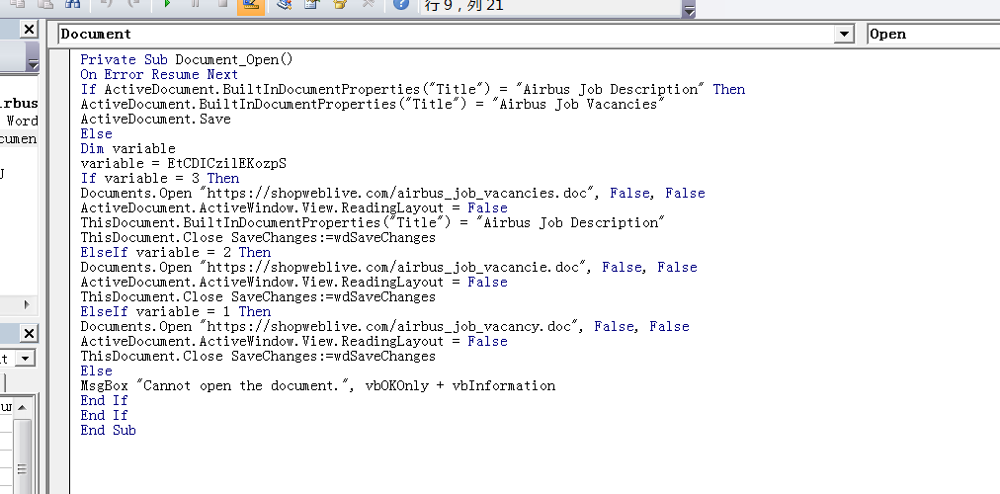
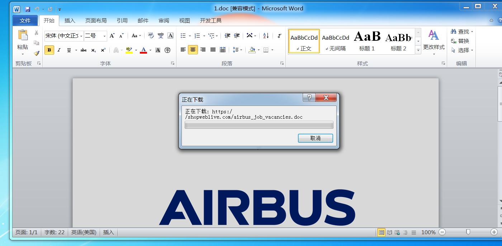
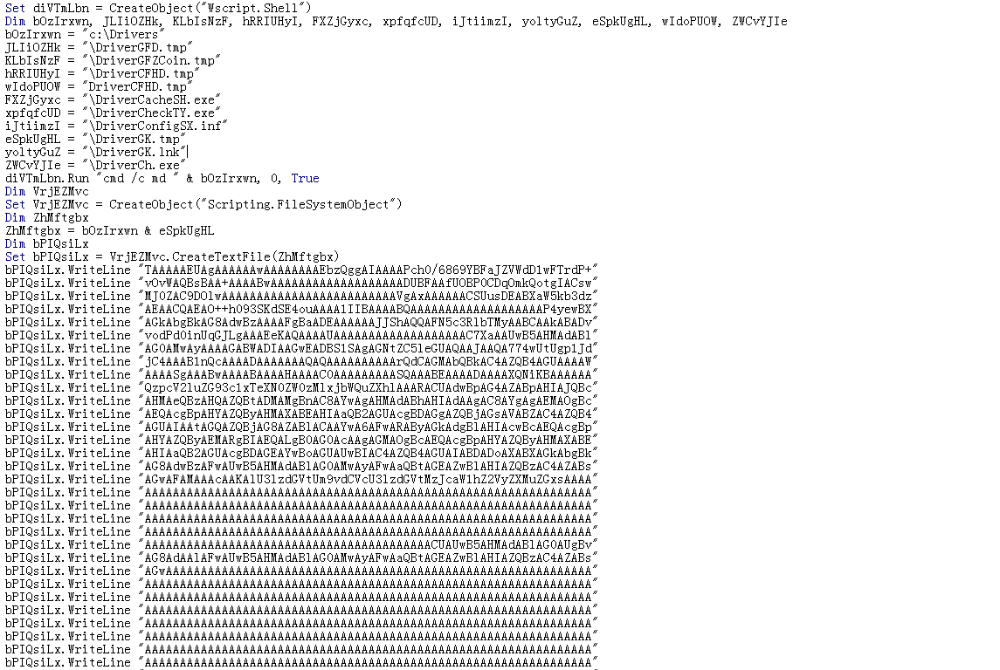
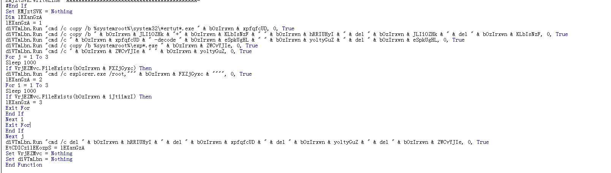
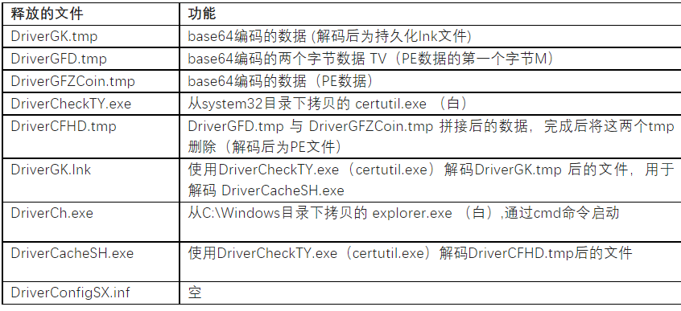
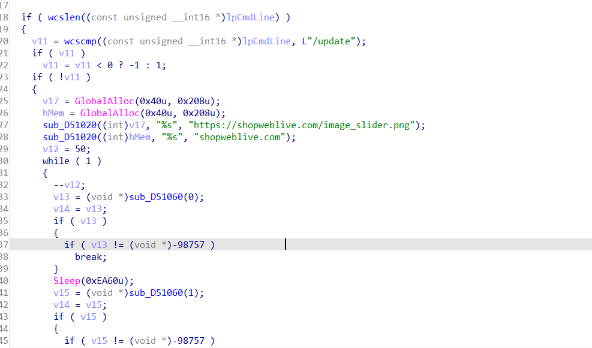

# 简介

  Lazarus(APT-C-26)集团是朝鲜半岛非常活跃的APT组织之一，该组织长期对韩国、美国、印度等国家进行渗透攻击，长期以数字货币、金融行业、航空航天行业等为攻击目标。此外还对全球的金融机构进行攻击，堪称全球金融机构的最大威胁，该组织最早的攻击活动可以追溯到2007年。]

## 诱饵文档

MD5:4fb3bd661331b10fbd01e5f3e72f476c

打开之后不慌，不用直接点击启用宏，先看看宏代码，如果能看到的话，这里我们看到的是他会对当前文档进行一个判断名字是否为，airbus开头，如果是就保持，如不是就打开url下载doc

点击启用宏

点击开启宏发现他有点卡 然后显示正在下载文件，这里服务器崩了 并不清楚下载的宏文件，因为后续打开有宏代码，猜测是诱饵文档

点击完了之后我们看第二段宏代码

开始一堆字符串，然后有api去创建文件，下面是赋值，一看就猜测是base64，根据base64特性去解密

恶意宏将内置的base64编码的数据写入以上文件，经过一系列的拼接、解码，最终通过启动lnk文件 DriverGK.lnk 来解码最终的载荷 DriverCacheSH.exe ，宏代码会判断系统位数来释放不同版本载荷。

以上的活动执行完后，通过 cmd命令 “cmd.exe /c explorer.exe /root,"c:\Drivers\DriverCacheSH.exe” ，以资源管理器视图打开最后的载荷 DriverCacheSH.exe，攻击者通过层层解码、间接运行的方式执行最终载荷，在一定程度上也规避了一些安全产品的检测。

## DriverCasheSH

我们再来看看他最后生成的载荷

程序带有update参数运行会运行下载图片

没有update则会创建 计划服务

图片没有下载下来所以就无法获取后续内容
