# PE

PE 文件格式把可执行文件分成若干个数据节（section），不同的资源被存放在不同的节中。
一个典型的 PE 文件中包含的节如下。
.text 由编译器产生，存放着二进制的机器代码，也是我们反汇编和调试的对象。
.data 初始化的数据块，如宏定义、全局变量、静态变量等。
.idata 可执行文件所使用的动态链接库等外来函数与文件的信息。
.rsrc 存放程序的资源，如图标、菜单等。
除此以外，还可能出现的节包括“.reloc”、“.edata”、“.tls”、“.rdata”等。
题外话：如果是正常编译出的标准 PE 文件，其节信息往往是大致相同的。但这些
section 的名字只是为了方便人的记忆与使用，使用 Microsoft Visual C++中的编译指示
符#pragma dat a_seg()可以把代码中的任意部分编译到 PE 的任意节中，节名也可以自
己定义。如果可执行文件经过了“加壳”处理，PE 的节信息就会变得非常“古怪”。
在 Crack 和反病毒分析中需要经常处理这类古怪的 PE 文件。

## 虚拟内存
我们都知道源码通过编译器，生成汇编，再链接成 可执行文件 

**那系统如何知道去哪里找可执行文件的代码**

我们都知道不可以直接 mov cs，ax，只能在二进制代码段前面加上CS地址，这样系统才知道搬到这个代码段，那系统如何知道 cs段呢 那么就需要在前面加上 .code 

文件格式由此诞生，格式的作用就是如何运行该程序**，操作系统定义一个规范，编译器按照这个规范去定义这个格式，**这个格式谁来生成？ 是链接器，因为编译出来是obj文件 ，obj文件不能运行， 链接出来才是exe文件，这就是最早的DOS MZ文件格式，*告诉系统如何运行程序*

以寻找CS段为例，文件格式会告诉操作系统cs这么大个段在哪，操作系统去找 找到了

会把地址给CS寄存器，然后把代码放到这个内存里去

**为什么这么设计 **?

比如我A程序放到一个地址运行，那B程序不可以进来，因为这个地址被人占用了，如果分段来 我就可以把B程序放到另一个段 


 我们讲PE的文件格式（32位操作系统，兼容16位，所以前面的会有一个DOS

兼容所有操作系统，**所有你会发现有很多看起来没用的东西**）

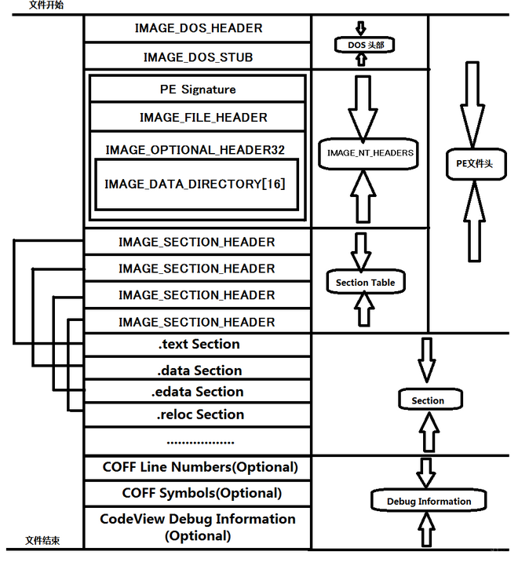

 **PE文件是由许许多多的结构体组成的，程序在运行时就会通过这些结构快速定位到PE文件的各种资源，其结构大致如图所示，从上到下依次是Dos头、Nt头、节表、节区和调试信息(可选)。其中Dos头、Nt头和节表在本文中统称为PE文件头(因为SizeOfHeaders就是这三个头的总大小)、节区则称为节,所以也可以说PE文件是由PE文件头和节组成。**

**
 　　PE文件头保存着整个PE文件的索引信息，可以帮助PE装载器定位资源，而节则保存着整个PE文件的所有资源。正因为如此，所以存在着这样的说法：头是节的描述，节是头的具体化。** 


*首先在winhex把文件变小，帮助我们学习pe*

*我们写一个简单的helloworld 链接为exe文件，这样它的文件比较小*

- ```assembly
  - .386
  - .model flat, stdcall
  - option casemap:none
  - include windows.inc
  - include kernel32.inc
  - include user32.inc
  - includelib kernel32.lib
  - includelib user32.lib
  - .const
  - ​    SHOW_MSG db "Hello World!", 0
  - ​    SHOW_TITLE db "51asm", 0
  - .code
  - START:
  - ​    invoke MessageBox,NULL, offset SHOW_MSG, offset SHOW_TITLE, MB_OK
  - ​    ret
  - end START
  ```

- 每个段 在文件存储中最少是200 不够200凑200 所有我们让他段少一个 少一个常量区 但是编译的时候常量区还是生成，

- 所以我们告诉编译器图中两段合并因为他们内存属性一样，代码可读可执行我们找到link link里面有合并段的命令 ，最后 变成一个节了 

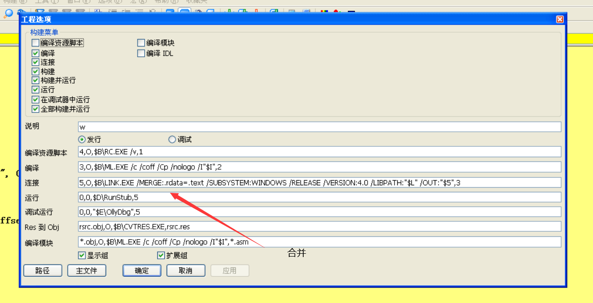*文件还能不能再小一点 *

 winhex后面很多0 因为要文件对齐 ，这个注意修改节表里面的文件对齐值，一般是对齐200 这样会造成很多0，你修改对齐值小一点 比如说4，这样就可以删除那些0，并且不报错

 对齐值也有选项 ，这里就是设置为4

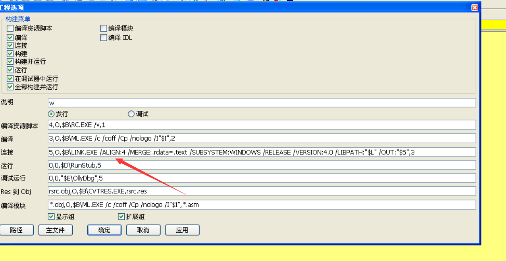

## DOS头

**在此我们先讲一下DOS头结构，算一下一共是64字节，也就是4行**

```c
typedef struct _IMAGE_DOS_HEADER {      // DOS .EXE header
    WORD   e_magic;                     // Magic number 所有PE文件的前两个字节都是MZ
    WORD   e_cblp;                     *  Bytes on last page of file  这就是最后一页
        软件运行要多大内存就等于，文件几个扇区*512+这个里面的大小，因为并不是刚好整数扇区的大小
    WORD   e_cp;                       * Pages in file  文件几个扇区 一个扇区512KB
    WORD   e_crlc;                      // Relocations
    WORD   e_cparhdr;                   // Size of header in paragraphs
    WORD   e_minalloc;                  // Minimum extra paragraphs needed
    WORD   e_maxalloc;                  // Maximum extra paragraphs needed
    WORD   e_ss;                        // Initial (relative) SS value
    WORD   e_sp;                        // Initial SP value
    WORD   e_csum;                      // Checksum
    WORD   e_ip;                        // Initial IP value
    WORD   e_cs;                        // Initial (relative) CS value
    WORD   e_lfarlc;                    // File address of relocation table
    WORD   e_ovno;                      // Overlay number
    WORD   e_res[4];                    // Reserved words
    WORD   e_oemid;                     // OEM identifier (for e_oeminfo)
    WORD   e_oeminfo;                   // OEM information; e_oemid specific
    WORD   e_res2[10];                  // Reserved words
    LONG   e_lfanew;                    // File address of new exe header
     //LONG类型4个字节                              这里就是最后一个字段 指向我们新版本的地址，新版本操作系统读这个字段拿到新的格式，老版本不会读。它保存着IMAGE_NT_HEADERS32这个结构体在PE文件中的偏移地址
  } IMAGE_DOS_HEADER, *PIMAGE_DOS_HEADER;
```

我们写一个程序 打开它 可以看到 64个字节刚好是4行 从第四行到3c位置指向的位置是dos块 

 **在`IMAGE_DOS_HEADER`结构体后面紧跟着就是`IMAGE_DOS_STUB`程序，它是运行在`MS-DOS`下的可执行程序，当可执行文件运行于`MS-DOS`下时，这个程序会打印`This program cannot be run in DOS mode`这条消息。用户可以自己更改该程序，MS-DOS程序当前是可有可无的，如果你想使文件大小尽可能的小可以省掉MS-DOS程序，同时把前面的参数都清0。** 

对于16位操作系统来说 DOS块的位置是汇编代码 

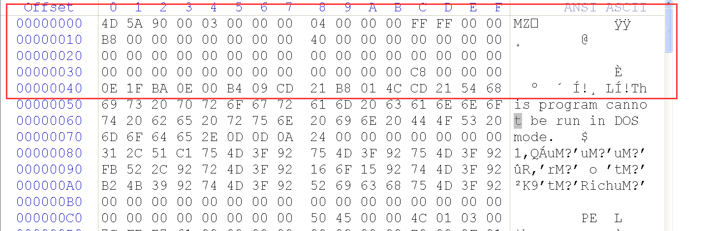

**可以看到*这个文件所需要的内存大小为3*512+90，我们dos系统里面 申请内存一次要申请512个字节 如果你要整型计算还要计算余数  不如这样算，就算读一个字节 也是拿512 多余的丢掉 速度是一样的

 我们DOS的最后一个字段为C8，可以看到C8的位置就是PE字母

## PE头

### NT头

```c
typedef struct _IMAGE_NT_HEADERS64 {
    DWORD Signature;    这个就是开头的PE字符
    IMAGE_FILE_HEADER FileHeader;
    IMAGE_OPTIONAL_HEADER64 OptionalHeader;
} IMAGE_NT_HEADERS64, *PIMAGE_NT_HEADERS64;
```

### 文件头：IMAGE_FILE_HEADER FileHeader;

```c
typedef struct _IMAGE_FILE_HEADER {
    WORD    Machine;        //机器号  改了没多大用，发挥空间小
    WORD    NumberOfSections;   *节区的数量 windows加载程序时会将节区的最大数量限制为96个。
    DWORD   TimeDateStamp;  //时间戳，这个程序的编译时间，可以改 不可信
    DWORD   PointerToSymbolTable;  //符号表地址
    DWORD   NumberOfSymbols;     //符号表数量
    WORD    SizeOfOptionalHeader;  
    *选项头大小  从IMAGE_OPTIONAL_HEADER的起始位置加上SizeOfOptionalHeader（选项头大小）的值的位置开始才是IMAGE_SECTION_HEADER（节表的位置）
        
    WORD    Characteristics; //决定选项头如何解析它描述了PE文件的一些属性信息，比如是否可执行，是否是一个动态连接库等。该值可以是一个也可以是多个值的和
} IMAGE_FILE_HEADER, *PIMAGE_FILE_HEADER;
```

#### Machine 

可以看到machine位 0x014c 那么机器就是I386 

```
#define IMAGE_FILE_MACHINE_UNKNOWN           0
#define IMAGE_FILE_MACHINE_TARGET_HOST       0x0001  // Useful for indicating we want to interact with the host and not a WoW guest.
#define IMAGE_FILE_MACHINE_I386              0x014c  // Intel 386.
#define IMAGE_FILE_MACHINE_R3000             0x0162  // MIPS little-endian, 0x160 big-endian
·········
```

####  Characteristics 的具体定义

我们Characteristics 的位置 winhex里的值是 0x10F   就是

0001 0000 1111      下面的表来查  例如  第二位有数据  那么就是#define IMAGE_FILE_EXECUTABLE_IMAGE 说明这个程序是可执行文件

```
#define IMAGE_SIZEOF_FILE_HEADER             20

#define IMAGE_FILE_RELOCS_STRIPPED           0x0001  // Relocation info stripped from file.
#define IMAGE_FILE_EXECUTABLE_IMAGE          0x0002  // File is executable  (i.e. no unresolved external references).
#define IMAGE_FILE_LINE_NUMS_STRIPPED        0x0004  // Line nunbers stripped from file.
#define IMAGE_FILE_LOCAL_SYMS_STRIPPED       0x0008  // Local symbols stripped from file.
#define IMAGE_FILE_AGGRESIVE_WS_TRIM         0x0010  // Aggressively trim working set
#define IMAGE_FILE_LARGE_ADDRESS_AWARE       0x0020  // App can handle >2gb addresses
#define IMAGE_FILE_BYTES_REVERSED_LO         0x0080  // Bytes of machine word are reversed.
#define IMAGE_FILE_32BIT_MACHINE             0x0100  // 32 bit word machine.
#define IMAGE_FILE_DEBUG_STRIPPED            0x0200  // Debugging info stripped from file in .DBG file
#define IMAGE_FILE_REMOVABLE_RUN_FROM_SWAP   0x0400  // If Image is on removable media, copy and run from the swap file.
#define IMAGE_FILE_NET_RUN_FROM_SWAP         0x0800  // If Image is on Net, copy and run from the swap file.
#define IMAGE_FILE_SYSTEM                    0x1000  // System File.
#define IMAGE_FILE_DLL                       0x2000  // File is a DLL.
#define IMAGE_FILE_UP_SYSTEM_ONLY            0x4000  // File should only be run on a UP machine
#define IMAGE_FILE_BYTES_REVERSED_HI         0x8000  // Bytes of machine word are reversed.


```

文件头大小为20个字节，也就是说 从PE开始往下数一行半来到 选项头

### 选项头： IMAGE_OPTIONAL_HEADER64 OptionalHeader;

```c
IMAGE_NT_OPTIONAL_HDR32_MAGIC      
IMAGE_NT_OPTIONAL_HDR64_MAGIC      
IMAGE_ROM_OPTIONAL_HDR_MAGIC         
```

- 选项头有三种，但是不管是32 64位 还是第三个 前面的两个字节还是一样的 都是 word magic 从后面开始就不一样了，你可以去VS里找，ROm这个是嵌入式平台 
-  ** 这个option这个头 就是用file 哪个文件头开始数一行半 **

```c
typedef struct _IMAGE_OPTIONAL_HEADER {
    WORD    Magic;      010B是32位  020B是64位

    BYTE    MajorLinkerVersion;  //链接器的主版本  一个字节 参考
    BYTE    MinorLinkerVersion;  //链接器的副版本   一个字节 参考
    DWORD   SizeOfCode;         // 总的 代码段的大小 参考   od就是读这个字段来反汇编的 
     DWORD   SizeOfInitializedData;    // 初始化数据段大小     参考
    DWORD   SizeOfUninitializedData;   //未初始化数据段大小 参考
    DWORD   AddressOfEntryPoint;   
    *入口地址  可以利用他注入代码  是option段开头的三行半，就是从PE开始数这里把入口点弄为0地址 很多反汇编程序看到入口为0 就不反汇编了 dll入口地址就是0
        
    DWORD   BaseOfCode;  //代码建议装载地址
    DWORD   BaseOfData; // 数据建议装载地址
    DWORD   ImageBase;  
    *模块建议装载地址 （重要，通常能满足，系统第一个加载的模块就是主模块）原来的值为4000你如果改这个值为5000 ，二进制代码还是认为模块地址是4000  这就代表字符串全错了，所有地址全错，因为许多地方都会用到这个4000地址，你可以把它全修了也可以

    DWORD   SectionAlignment;     
    *内存对齐值      在入口地址下面
    在入口地址下面  假设文件对齐值是200个字节，那么这200个字节搬到内存0x1000的位置，紧挨着的200个字节会被搬到2000的位置
    
     DWORD   FileAlignment;  *文件对齐值    
    *如果代码对齐200 不到200 补为200 超过两百补400，这里文件大小在winhex里左侧的大小

    WORD    MajorOperatingSystemVersion;// 操作系统主版本  参考
    WORD    MinorOperatingSystemVersion;   // 操作系统次版本  参考
    WORD    MajorImageVersion; ///镜像主版本 参考
    WORD    MinorImageVersion; // 副版本 参考
    WORD    MajorSubsystemVersion;  子系统主版本   内存对齐值下面  不能乱改
    WORD    MinorSubsystemVersion;  子系统副版本   不能乱改
    DWORD   Win32VersionValue; //没用
    DWORD   SizeOfImage;
    * pe镜像内存大小 重要  软件加载到内存一共要耗费多少内存  如果你的内存和文件对不上 直接当你是无效的pe     
    DWORD   SizeOfHeaders;  
    *头的大小 从pe开始数6行一个DWORD的位置
        
    DWORD   CheckSum;   //没卵用  驱动会检测 子系统主版本下面
    WORD    Subsystem;    //子系统    
    WORD    DllCharacteristics;
    *  这个字段有标志位 4代表开启随机基址    从pe开始数6行最后的位置包括pe开始数        
        
    DWORD   SizeOfStackReserve;  // 总申请的栈空间  
    DWORD   SizeOfStackCommit;  //先给我一点栈空间先用
    DWORD   SizeOfHeapReserve;//  同理  
    DWORD   SizeOfHeapCommit;     // 随机基址下面
    DWORD   LoaderFlags; //调试器相关 没用
    DWORD   NumberOfRvaAndSizes;
    * 数据目录的项数  选项头是变长的 这是扩展用的  PE开始包括PE 8行         一般就是16 就是一行的大小
    IMAGE_DATA_DIRECTORY DataDirectory[IMAGE_NUMBEROF_DIRECTORY_ENTRIES];  
  *这个数据目录的内存地址 和大小，比如说第一个8个字节是导出表的内存地址和大小   PE开始 9行  
    } IMAGE_OPTIONAL_HEADER32, *PIMAGE_OPTIONAL_HEADER32;
```


DllCharacteristics属性*

```c
// DllCharacteristics Entries

//      IMAGE_LIBRARY_PROCESS_INIT            0x0001     // Reserved.
//      IMAGE_LIBRARY_PROCESS_TERM            0x0002     // Reserved.
//      IMAGE_LIBRARY_THREAD_INIT             0x0004     // Reserved.
//      IMAGE_LIBRARY_THREAD_TERM             0x0008     // Reserved.
#define IMAGE_DLLCHARACTERISTICS_HIGH_ENTROPY_VA    0x0020  // Image can handle a high entropy 64-bit virtual address space.
#define IMAGE_DLLCHARACTERISTICS_DYNAMIC_BASE 0x0040     DLL can move. 
*由此可得，我们要想设置随机基址 改这个属性就完事了
    
#define IMAGE_DLLCHARACTERISTICS_FORCE_INTEGRITY    0x0080     // Code Integrity Image
#define IMAGE_DLLCHARACTERISTICS_NX_COMPAT    0x0100     // Image is NX compatible
#define IMAGE_DLLCHARACTERISTICS_NO_ISOLATION 0x0200     // Image understands isolation and doesn't want it
#define IMAGE_DLLCHARACTERISTICS_NO_SEH       0x0400     // Image does not use SEH.  No SE handler may reside in this image
#define IMAGE_DLLCHARACTERISTICS_NO_BIND      0x0800     // Do not bind this image.
#define IMAGE_DLLCHARACTERISTICS_APPCONTAINER 0x1000     // Image should execute in an AppContainer
#define IMAGE_DLLCHARACTERISTICS_WDM_DRIVER   0x2000     // Driver uses WDM model
#define IMAGE_DLLCHARACTERISTICS_GUARD_CF     0x4000     // Image supports Control Flow Guard.
#define IMAGE_DLLCHARACTERISTICS_TERMINAL_SERVER_AWARE     0x8000

// Directory Entries
```

### 数据目录表

```c
#define IMAGE_DIRECTORY_ENTRY_EXPORT          0   // Export Directory 导出表
#define IMAGE_DIRECTORY_ENTRY_IMPORT          1   // Import Directory 导入表
#define IMAGE_DIRECTORY_ENTRY_RESOURCE        2   // Resource Directory 资源表
#define IMAGE_DIRECTORY_ENTRY_EXCEPTION       3   // Exception Directory 异常表
//#define IMAGE_DIRECTORY_ENTRY_SECURITY      4   // Security Directory ，没用
#define IMAGE_DIRECTORY_ENTRY_BASERELOC       5   // Base Relocation Table 重定位表
#define IMAGE_DIRECTORY_ENTRY_DEBUG           6   // Debug Directory 没用
#define IMAGE_DIRECTORY_ENTRY_ARCHITECTURE    7   // Architecture Specific Data没用
#define IMAGE_DIRECTORY_ENTRY_GLOBALPTR       8   // RVA of GP没用
#define IMAGE_DIRECTORY_ENTRY_TLS             9   // TLS Directory TLS
#define IMAGE_DIRECTORY_ENTRY_LOAD_CONFIG    10   // Load Configuration Directory 没用
#define IMAGE_DIRECTORY_ENTRY_BOUND_IMPORT   11   // Bound Import Directory in headers绑定导入表
#define IMAGE_DIRECTORY_ENTRY_IAT            12   // Import Address Table 导入地址表
#define IMAGE_DIRECTORY_ENTRY_DELAY_IMPORT   13   // Delay Load Import Descriptors 延迟加载
#define IMAGE_DIRECTORY_ENTRY_COM_DESCRIPTOR 14   // COM Runtime descriptor 没用
```

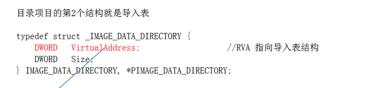


## 节表头： IMAGE_SECTION_HEADER

 节表：总大小占IMAGE_SECTION_HEADER结构体（40字节） * 节的数量（大小取决于节的数量）, 节的数量在 image file那里 

```c
typedef struct _IMAGE_SECTION_HEADER {
    BYTE    Name[IMAGE_SIZEOF_SHORT_NAME]; //当前节的名称  8个字节
    union {
            DWORD   PhysicalAddress;  //在操作系统设计的问题，不允许访问物理地址，所以这个字段没用
            DWORD   VirtualSize; 在内存中实际占用的大小
    } Misc;
    DWORD   VirtualAddress; 节区在内存中的RVA, 数值总是SectionAlignment的值的整数倍
        
    DWORD   SizeOfRawData; 当前节表在文件中对齐后的大小，上面是内存，这里是文件
    DWORD   PointerToRawData; 当前节数据在文件中的偏移地址 ，就是节的数据此时在哪个位置
        
    DWORD   PointerToRelocations; // 调试相关    没用   12字节
    DWORD   PointerToLinenumbers;// 调试相关  没用
    WORD    NumberOfRelocations;// 调试相关  没用
    WORD    NumberOfLinenumbers;// 调试相关  没用 
    DWORD   Characteristics; //文件属性，比如该节数据属性是否为可执行属性，可以当作一个依据来判断是什么段都在这里面
    //在windows 你不给读的权限,他也会读，你不给执行权限 也有执行权限 任何内存地址 只要可以读 就可以执行

} IMAGE_SECTION_HEADER, *PIMAGE_SECTION_HEADER;
;
```

- VirtualSize 可能会比SizeOfRawData 大  也可能会比小

- 比如定义的全局变量多但是没赋值，就不会存储在文件中，那么在内存中拉伸后的值可能VirtualSize 会比 SizeOfRawData 大！

- 比如定义的全局变量多并且都赋值，就会存储在文件中，那么在内存中拉伸后的值可能VirtualSize 会比 SizeOfRawData 大

  

- ### 关于文件属性：

- ```
  - Characteristics(属性块) 常用特征值对照表：
  - [值:00000020h] [IMAGE_SCN_CNT_CODE                // Section contains code.(包含可执行代码)]
  - [值:00000040h] [IMAGE_SCN_CNT_INITIALIZED_DATA    // Section contains initialized data.(该块包含已初始化的数据)]
  - [值:00000080h] [IMAGE_SCN_CNT_UNINITIALIZED_DATA  // Section contains uninitialized data.(该块包含未初始化的数据)]
  - [值:00000200h] [IMAGE_SCN_LNK_INFO                // Section contains comments or some other type of information.]
  - [值:00000800h] [IMAGE_SCN_LNK_REMOVE              // Section contents will not become part of image.]
  - [值:00001000h] [IMAGE_SCN_LNK_COMDAT              // Section contents comdat.]
  - [值:00004000h] [IMAGE_SCN_NO_DEFER_SPEC_EXC       // Reset speculative exceptions handling bits in the TLB entries for this section.]
  - [值:00008000h] [IMAGE_SCN_GPREL                   // Section content can be accessed relative to GP.]
  - [值:00500000h] [IMAGE_SCN_ALIGN_16BYTES           // Default alignment if no others are specified.]
  - [值:01000000h] [IMAGE_SCN_LNK_NRELOC_OVFL         // Section contains extended relocations.]
  - [值:02000000h] [IMAGE_SCN_MEM_DISCARDABLE         // Section can be discarded.]
  - [值:04000000h] [IMAGE_SCN_MEM_NOT_CACHED          // Section is not cachable.]
  - [值:08000000h] [IMAGE_SCN_MEM_NOT_PAGED           // Section is not pageable.]
  - [值:10000000h] [IMAGE_SCN_MEM_SHARED              // Section is shareable(该块为共享块).]
  - [值:20000000h] [IMAGE_SCN_MEM_EXECUTE             // Section is executable.(该块可执行)]
  - [值:40000000h] [IMAGE_SCN_MEM_READ                // Section is readable.(该块可读)]
  - [值:80000000h] [IMAGE_SCN_MEM_WRITE               // Section is writeable.(该块可写)]
  ```

  - 代码节的属性一般为60000020H，也就是可执行、可读和"节中包含代码"；
  - 数据节的属性 一般为C0000040H，也就是可读、可写和"包含已初始化数据"；
  - 而常量节（对应源代码中的.const段）的属性为40000040H，也就是可读 和 "包含已初始化数据"；
  - 资源节的属性和常量节的属性一般是相同的。

## 内存映射

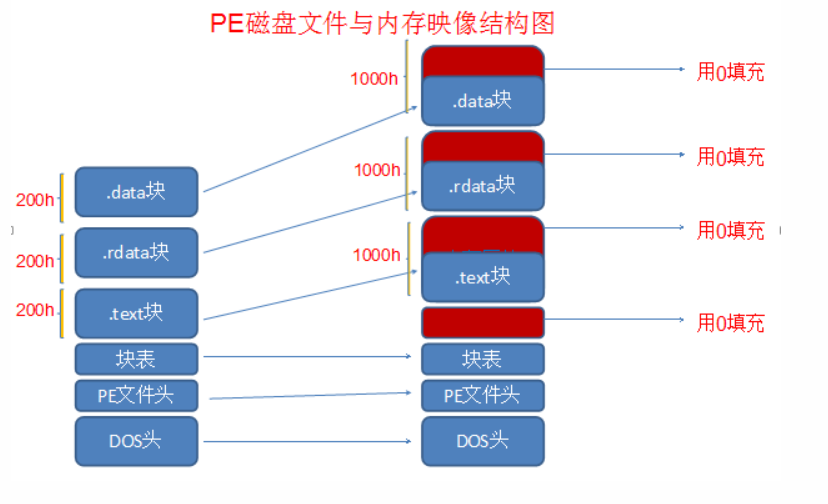

假设ImageBase=0x0040000，内存对齐值0x1000，头的大小为200 头文件对齐值为200

节表文件对齐值也是200

我们先映射PE头，从_IMAGE_OPTIONAL_HEADER 结构体的SizeOfHeaders 拿到头的大小，便

| 文件                | 内存                |
| ------------------- | ------------------- |
| 头0-0X200           | 0X0040000-0x0041000 |
| 第1个节0X200-0X400  | 0X0041000-0x0042000 |
| 第二个节0X400-0X600 | 0X0042000-0x0043000 |

如果此时对0X600进行操作，那操作的数据将不会进入内存，那么我们只需要将第二个节的SizeOfRawData 200改为400，就会将0X600位置的数据进入

但是此时给文件加个4096个字节，那将是无效的PE 因为我们内存只申请了 SizeOfImage=3000个字节大小

但是如果最后一个节 不可读不可执行呢，加了没用

## 计算FA VA RVA

RVA相对虚拟地址偏移， 。RVA是当PE 文件被装载到内存中后，某个数据位置相对于文件头的偏移量。 

 文件偏移地址（File Offset Address，FOA）和内存无关，它是指某个位置距离文件头的偏移。 

比如说 正好是属于第一个节表,那么看第一个节表中的PointerToRawData成员即可. 

RVA在文件头中 或 SectionAlignment 等于 FileAlignment 时RVA等于FOA

VA是虚拟内存地址的意思    **指的是文件被载入虚拟空间后的地址。** 

RVA=VA-ImageBase


比如说我现在 VA=0X00402123 那他的RVA是2123

去查节表发现，这个节的Virtua lAddress是1000， VirtualSize是28，也就是1000-2000的位置

此时RVA没有在此范围中，再看下一个节

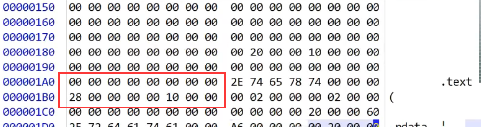


第二个rdata节 这个节的Virtua lAddress是2000， VirtualSize是A6，  SizeOfRawData是200
    PointerToRawData是400

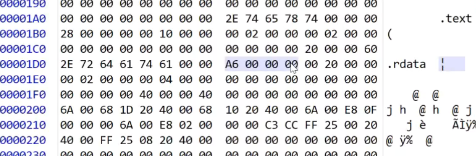

可以看出PointerToRawData文件偏移是400，它是从400开始 

此时的FA=400+123 为什么？

此时我们知道 VA=0X00402123 这个虚拟地址的相对imageBase偏移RVA是2123，

但是这个节里面的Virtua lAddress偏移是2000 所以这个地址的RVA-这个节的RVA 就等于123

确实很难理解，我们反过来推 现在给你一个文件地址FA=512 问你VA是多少？

拿到这个文件中的地址，就去文件里找512的位置，下图可以看到 命中了第二个节

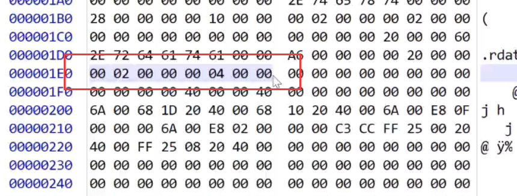

上图可以看到这个节对应的内存RVA是2000对吧，那文件的偏移是512-400就是112

RVA=那内存的RVA 再加上文件的RVA =2112

VA=0x4002112

总结一下：

RVA转换到文件偏移地址的方法如下： 

步骤一：循环扫描区块表得出每个区块在内存中的起始 RVA（根据IMAGE_SECTION_HEADER 中的VirtualAddress 字段），并根据区块的大小（根据IMAGE_SECTION_HEADER 中的SizeOfRawData 字段）算出区块的结束  RVA（两者相加即可），最后判断目标 RVA 是否落在该区块内。
步骤二：通过步骤一定位了目标 RVA 处于具体的某个区块中后，那么用目标 RVA 减去该区块的起始 RVA ，这样就能得到目标 RVA 相对于起始地址的偏移量 RVA2.
步骤三：在区块表中获取该区块在文件中所处的偏移地址（根据IMAGE_SECTION_HEADER 中的PointerToRawData 字段）, 将这个偏移值加上步骤二得到的 RVA2 值，就得到了真正的文件偏移地址。 

既，已知某虚拟地址（如va）和某区块的虚拟地址（text_va），虚拟地址在区块中，同时还知道此区块在文件中的位置（text_file_offset），解出此虚拟地址在文件中的具体位置。解：根据他们的偏移量相同（都是text_va - va）可知，答案为 text_file_offset + (text_va - va)。 


## 加节与注入代码

那我们就增加一个节，第一步修改节的数量，在文件头里面修改一下，

然后可能增加头大小SizeOfHeaders，因为有些程序节比较多，基于文件对齐值，pe头的大小会拓展的很大，我们就可以在最后一个节后面直接加，

但是如果文件只有两个节，那么刚好头的大小只有0X200，我们就需要在200的位置给他加个512 也就是0X200，如果加了0x200，那么你的节的PointerToRawData要增加对齐值个大小

 第二个节的PointerToRawData大小也要加个对齐值，就是头变大了，节的数据也都向后移动

再改一下 Virtua lAddress 加个内存对齐值0X1000

最后在 这个地址 [*PointerToRawData大小也要加个对齐值*] 处加上我们节的数据

最后改一下镜像大小 ok了如果你想执行这个代码 就OEP去跳转就OK了

## 万能脱壳方式 内存dump

内存一定要解密 不解密跑不了，我们把软件运行起来，文件的数据可以搬到内存 

 能不能反操作 内存的数据搬到文件就解密了

脱壳的时候先做了一个内存dump的操作

我们先可以通过它原来的文件 找到它的imageBase的值 我们在内存里可以先找到这个地址

能不能跑 并不重要 因为我已经可以静态反汇编了


打开 跑着的程序  先看PE头大小 然后把他复制下来  创建一个新的exe 复制进去

然后接着复制 节表中  VirtualSize （虚拟大小，可以说是虚拟偏移）如果这个值是1000然后 Virtua lAddress  是200 那么就是从401000位置复制200个字节


接着复制 下一个节   40000+VirtualSize 复制Virtua lAddress  个大小


这就叫内存DUMP

那如果你代码加密 这个程序可能跑不了  因为你总不能再解密一次  

通常 入口会是解密前的代码处，那我们就直接把入口改一下就完事了 但是不影响静态分析


一般来说如果用 od 来dump  要找到入口处dump 因为防止解密代码没有解密


## 反dump

程序跑起来之后 pe的一些东西就用不上了，我们可以在内存中修改

比如说删除mz大小，我们可以删除200个，但是会出现兼容性问题，有可能调用API会用到这个头

我们删了pe头几行 发现程序跑不动了  应该是从文件里直接拿的头

那我们就抹节 或者修改

 因为数据从内存来，数据不可能从文件里来 

这换成EN就可以变成中文

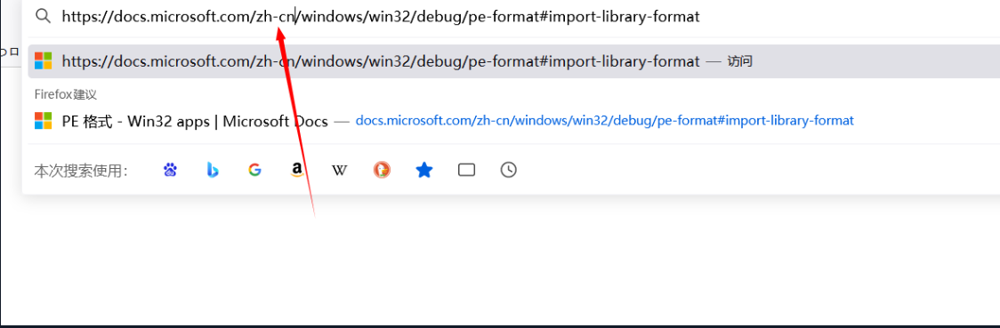

## 导入表

数据目录里面的大小 都不会看  都是以那里面指向的格式来解析的导入表遍历0结尾

 当程序调用了动态链接库的相关函数，在进行编译和链接的时候，编译程序和链接程序就会将调用的相关信息写入最终生成的PE文件中，告诉操作系统这些函数的执行指令字节码从哪里能够获取。这些信息就是导入表所描述的内容。 

指向导入表位置就位于数据目录表的第2项，

导入表是以零结尾，因为系统不会看数据目录表的大小，他会直接遍历

导入表会通过代理代码调用IAT，他会有一个中转的代码，通过中转的代码jmp IAT表

#### 1.导入目录表

我们可以看到数据目录表的内存偏移为2024，也就是相对虚拟地址RVA是2024，

此时第二个节的内存偏移是2000，那么这个地址的相对于节的RVA是24，那么这个节的文件偏移RVA是24

然后找到这个节文件偏移是400，那么也就是说数据目录表的文件偏移是424        

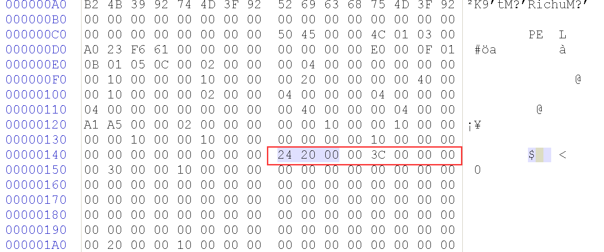

 

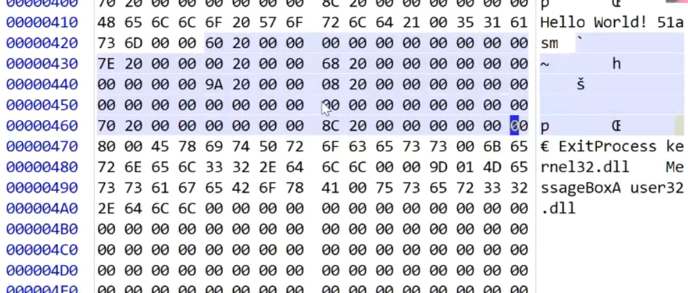


```c
20个字节大小 ，之后就是下一个库
typedef struct _IMAGE_IMPORT_DESCRIPTOR {
    union {
        DWORD   Characteristics;            // 0 for terminating null import descriptor
        如果操作系统发现这个字段是空的，系统就当没这个库，这个就当没有 直接下一个 
        DWORD   OriginalFirstThunk; *指向导入名称表（函数名称表	）    注意这是共用体     // RVA to original unbound IAT 指向这个(PIMAGE_THUNK_DATA) 
    } DUMMYUNIONNAME;  
    DWORD   TimeDateStamp;   没用              
    DWORD   ForwarderChain;   也没用              
    DWORD   Name; 重要 指向库名称
    DWORD   FirstThunk;  指向导入地址表    IMPORT_ADDRESS_TABLE (IAT)   // RVA to IAT (if bound this IAT has actual addresses)

} IMAGE_IMPORT_DESCRIPTOR;
```

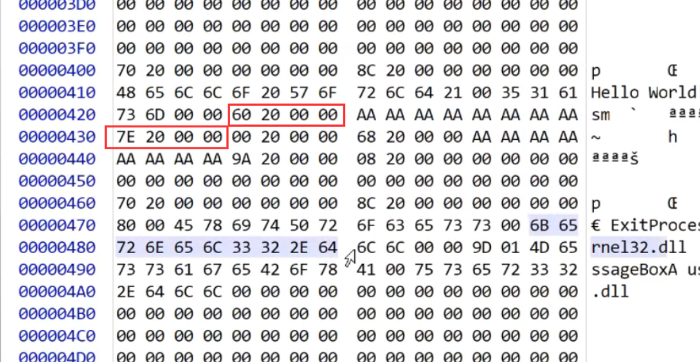

第一个导入名称表位置是460，导入名称表每四个字节代表一个函数，此时460位置是2070 文件rva是470，看470就是exitprocess函数

库名称在47E   

导入地址表在虚拟rva是2000，那么API地址就是要填到内存402000的位置去

#### 2.导入查找表


#### 3. IMAGE_IMPORT_BY_NAME 结构体定义如下: 

```c
typedef struct _IMAGE_IMPORT_BY_NAME {
    WORD    Hint;   //序号 这个序号其实没用，系统不看，这个序号是保存当时编译dll时的序号，不同版本不同
    CHAR   Name[1];   //函数名称
} IMAGE_IMPORT_BY_NAME, *PIMAGE_IMPORT_BY_NAME;


```

#### 4. IMAGE_THUNK_DATA——INT、IAT的结构体定义如下: 

```c
有32位和64位 我们拿个32位的
typedef struct _IMAGE_THUNK_DATA32 {
    union {
        DWORD ForwarderString;      // PBYTE  暂时不用考虑 是转发用的
        DWORD Function;             // PDWORD 表示函数地址
        DWORD Ordinal;              
        DWORD AddressOfData;        // PIMAGE_IMPORT_BY_NAME 若是按名字导入AddressOfData指向名字信息
    } u1;  注意这个是一个大的union 含多个域但是在不同时刻代表不同的意义，那到底应该是名字还是序号，如何区分呢？可以通过Ordinal判断，如果Ordinal的最高位是1，就是按序号导入的，这时候，低16位就是导入序号，如果最高位是0，则 AddressOfData是一个RVA，指向一个IMAGE_IMPORT_BY_NAME结构，用来保存名字信息
} IMAGE_THUNK_DATA32;
typedef IMAGE_THUNK_DATA32 * PIMAGE_THUNK_DATA32;
```

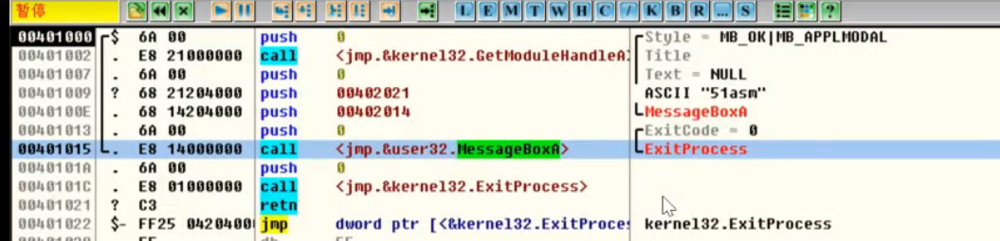

那OD此时怎么知道调用的是哪个API？

如果调试器发现你调用的Iat表的地址，那就是调API 

如果名称表为空，他会把iat表也就是导入地址表当作函数名称表来使用，导入地址表里面就是有函数名

###  导入表注入

我在后面加了512个字节，然后我扩展最后一个节的大小，把导入表复制到你想要复制的位置，导入表地址变一变，然后我们在原来的导入表后面再加个导入表，都按照导入表的格式

推荐自己实践一下，不难

这里

call dword ptr [_imp__GetModuleHandleA]

这里_imp__GetModuleHandleA相当于IAT表地址，直接会call 这个函数，不用跳转

那如果你直接call dword ptr [IATA地址]，这里不行，你编译完没有IAT表

他会认为你call的是全局变量地址

### 函数导入的过程

1.操作系统首先找到NAME对应的模块，然后遍历INT表去寻找IMAGE_IMPORT_BY_NAME结构（其中IMAGE_THUNK_DATA结构的搜索方式是：高一位如果是0，根据字符串方式寻找。如果是1，根据函数序号方式寻找函数）。
2.找到IMAGE_IMPORT_BY_NAME后系统利用GetProc Addr()函数找到函数的地址，并将地址放入IAT表中。

### 绑定导入表

 绑定导入目的是更快速的载入dll，其作用是取消系统修改IAT的过程。其单独在DataDirectory[11].VirttualAddress地址中。 

```c
typedef struct _IMAGE_BOUND_IMPORT_DESCRIPTOR {
    DWORD   TimeDateStamp;                    //时间戳
    WORD    OffsetModuleName;                 //DLL名的地址偏移
    WORD    NumberOfModuleForwarderRefs;      //该结构后IMAGE_BOUND_FORWARDER_REF数组的数量
// Array of zero or more IMAGE_BOUND_FORWARDER_REF follows
} IMAGE_BOUND_IMPORT_DESCRIPTOR,  *PIMAGE_BOUND_IMPORT_DESCRIPTOR;
```

```c
typedef struct _IMAGE_BOUND_FORWARDER_REF {
    DWORD   TimeDateStamp;			//时间戳
    WORD    OffsetModuleName;
    WORD    Reserved;
} IMAGE_BOUND_FORWARDER_REF, *PIMAGE_BOUND_FORWARDER_REF;    

```


我们运行一个软件之前，映射完软件接下来应该 映射导入表 需要时间，用的库多 运行就慢

什么叫绑定导入表 就是把 api的地址直接放进去 不用导入表，跑起来 编译的时候看看函数地址 直接填死

绑定导入表的作用是加快程序的启动速度，一个PE程序在启动时会去加载导入表中的dll文件，并将导入表的FirstThunk指向的数组填入函数的真实地址，这需要耗去时间，当绑定导入表有效时，即使是未运行状态，系统也会自动将导入表中的FirstThunk填入函数的真实地址，否则导入表的IAT在未载入内存时的值通常跟OriginFirstThunk中的一样，下图是Win7下的mspaint.exe，它拥有有效的绑定导入表，所以它的IAT中已经填好了函数的地址。

不同版本地址不一样，它运行起来之后，绑定导入表有版本号，时间戳 会拿系统的函数地址去对，看看一不一样 时间对不对，如果对 就是绑定导入表可以用，就不用填导入表 系统自带的软件都是这么做的，api地址对不上 再拿到 导入表 

延迟加载  当你第一次 call iat 表的时候 我再填，就是把dll 加载的时间往后挪  延迟加载编译选项vs里面有

 *msvcrt*.dll是微软在windows操作系统中提供的C语言运行库执行文件 

绑定导入表的生效，有两个前提条件：

1. 程序初始化时，导入的DLL都加载到了首选基址中
2. 程序执行了绑定导入操作以后，导入DLL中引用的符号位置一直没有变化

## 导出表

```c
typedef struct _IMAGE_EXPORT_DIRECTORY {
    DWORD   Characteristics;   //属性
    DWORD   TimeDateStamp;   //时间戳
    WORD    MajorVersion;  //dll版本
    WORD    MinorVersion;  //版本   *以上这12个字节没什么用
    DWORD   Name;    //库名称
    DWORD   Base;   //序号基址
    DWORD   NumberOfFunctions; //导出函数的数量
    DWORD   NumberOfNames;   //以名称导出的函数数量
    DWORD   AddressOfFunctions;     // 函数地址表  RVA
    DWORD   AddressOfNames;         // 函数名称表
    DWORD   AddressOfNameOrdinals;  // 函数序号表
} IMAGE_EXPORT_DIRECTORY, *PIMAGE_EXPORT_DIRECTORY;   //40个字节，两行半

```

 **导出表简介:****简单来说导出表就是用来描述模块中的导出函数的结构，导出函数就是将功能的提供给外部使用的函数，如果一个PE文件导出了函数，那么这个函数的信息就会记录PE文件的导出表中，方便外部程序加载该文件进行动态调用。可能有时函数在导出表中只有一个序号而没有名字，也就造成了导出表中有了三个子表的存在，分别是：函数地址表、函数名称表和函数序号表。使得外部程序可以通过函数名称和函数序号两种方式获取该函数的地址。** 

```
//系统中获取函数地址的两种方法：
HMODULE hModule ``=` `LoadLibraryA(``"User32.dll"``);
//1、函数名获取
DWORD FuncAddress ``=` `GetProcAddress(hModule, ``"MessageBoxA"``);
//2、序号获取
DWORD FuncAddress ``=` `GetProcAddress(hModule, ``12``);
```

**通过导出表查找函数地址的两种方法：**

　　**1、通过函数名查找函数地址：**

 **(1)、首先定位函数名表，然后通过函数名表中的RVA地址定位函数名，通过比对函数名获取目标函数名的在函数名表中的索引。
　(2)、通过获取函数名表的索引获取函数序号表中对应索引中的函数序号。
　(3)、通过把该序号当作函数地址表的下标，就可以得到该下标中的函数地址。** 

　　**2、通过函数序号查找函数地址：**

 **(1)、首先计算函数地址表的索引：index = 目标函数的函数序号 - 导出表的Base。
(2)、通过计算出的索引就可以在函数地址表中获取到目标序号的函数地址。
注：通过序号获取函数地址不需要使用函数名称表和函数序号表就可以直接获取函数地址，实现上相对来说比较方便。** 

现在举例 对方只给我一个api 名称 拿到这个名称 我就去查名称表 名称表对应了 这个api 我们马上去拿序号表，看看在第几项 ， 在函数地址表里找到对应的地址下标再加上imagebase 

查序号的时候 要用序号减掉base 再查表  ，因为序号表 是1  下标0 才是数组第一个值, base是1 这个时候减去一 1 就等于0

## 资源表

```c
//资源目录头
typedef struct _IMAGE_RESOURCE_DIRECTORY {
    DWORD   Characteristics;        //资源属性        一般为0
    DWORD   TimeDateStamp;          //资源创建时间戳   一般为0
    WORD    MajorVersion;           
    WORD    MinorVersion;
    WORD    NumberOfNamedEntries;   //以名称命名的目录项数量  重要
    WORD    NumberOfIdEntries;      //以ID命名的目录项数量   重要
//  IMAGE_RESOURCE_DIRECTORY_ENTRY DirectoryEntries[];
} IMAGE_RESOURCE_DIRECTORY, *PIMAGE_RESOURCE_DIRECTORY;
 
//资源目录项
typedef struct _IMAGE_RESOURCE_DIRECTORY_ENTRY {
    union {
        struct {
            DWORD NameOffset:31;         //字符串的偏移(不是RVA、FOA，相对特殊)
            DWORD NameIsString:1;        //判断名字是否是字符串    1:是  0:不是
        } DUMMYSTRUCTNAME;
        DWORD   Name;
        WORD    Id;                      //目录项的ID(在一级目录指资源类型，二级目录指资源编号，三级目录指代码的页号)
    } DUMMYUNIONNAME;                   
    union {
        DWORD   OffsetToData;            //如果不是目录，这里指数据的偏移(不是RVA、FOA，相对特殊)
        struct {
            DWORD   OffsetToDirectory:31;//目录的偏移(不是RVA、FOA，相对特殊)
            DWORD   DataIsDirectory:1;   //判断子资源项是否是目录    1:是  0:不是
        } DUMMYSTRUCTNAME2;
    } DUMMYUNIONNAME2;
} IMAGE_RESOURCE_DIRECTORY_ENTRY, *PIMAGE_RESOURCE_DIRECTORY_ENTRY;
 
//数据项
typedef struct _IMAGE_RESOURCE_DATA_ENTRY {
    DWORD   OffsetToData;        //数据的偏移    重要
    DWORD   Size;                //数据的大小    重要
    DWORD   CodePage;            //代码页(一般为0)
    DWORD   Reserved;            //保留
} IMAGE_RESOURCE_DATA_ENTRY, *PIMAGE_RESOURCE_DATA_ENTRY;
 
//名字字符串结构
typedef struct _IMAGE_RESOURCE_DIR_STRING_U {
    WORD    Length;                //Unicode字符串长度
    WCHAR   NameString[ 1 ];       //Unicode字符串
} IMAGE_RESOURCE_DIR_STRING_U, *PIMAGE_RESOURCE_DIR_STRING_U;
```

 **资源表简介：在Windows程序中其各种界面被称作为资源，其中被系统预先定义的资源类型包括：鼠标指针,位图, 图标,菜单,对话框, 字符串列表,字体目录, 字体,加速键,非格式化资源,消息列表,鼠标指针组,图标组,版本信息。当然还有用户自定义的资源类型，这些资源的就不举例了。这些资源都是以二进制的形式保存到PE文件中，而保存资源信息的结构就是资源表，它位于目录项的第三位。在PE文件的所有结构中，资源表的结构最为复杂，这是因为资源表用类似于文件目录结构的方式进行保存的，从根目录开始，下设一级目录、二级目录和三级目录，三级目录下才是资源文件的信息，而且资源表的结构定位也是最为特殊的，希望重点掌握。
　　一级目录是按照资源类型分类的，如位图资源、光标资源、图标资源。
　　二级目录是按照资源编号分类的，同样是菜单资源，其子目录通过资源ID编号分类，例如：IDM_OPEN的ID号是2001h，IDM_EXIT的ID号是2002h等多个菜单编号。
　　三级目录是按照资源的代码页分类的，即不同语言的代码页对应不同的代码页编号，例如：简体中文代码页编号是2052。
　　三级目录下是节点，也称为资源数据，这是一个IMAGE_RESOURCE_DATA_ENTRY的数据结构，里面保存了资源的RVA地址、资源的大小，对所有资源数据块的访问都是从这里开始的。** 

 **注：资源表的一级目录、二级目录、三级目录的目录结构是相同的都是由一个资源目录头加上一个资源目录项数组组成的，可以将这个结构称作资源目录结构单元。** 

**`IMAGE_RESOURCE_DIRECTORY.NumberOfNamedEntries`和`IMAGE_RESOURCE_DIRECTORY.NumberOfIdEntries`
　　在资源目录头结构中这两个字段是最为重要的，其他字段大部分为0。NumberOfNamedEntries表示在该资源目录头后跟随的资源目录项中以IMAGE_RESOURCE_DIR_STRING_U结构命名的资源目录项数量。NumberOfIdEntries表示在该资源目录头后跟随的资源目录项中以ID命名的资源目录项数量。两个字段加起来就是本资源目录头后的资源目录项的数量总和。也就是后面IMAGE_RESOURCE_DIRECTORY_ENTRY结构的总数量。**

 

　　**`IMAGE_RESOURCE_DIRECTORY_ENTRY.DUMMYUNIONNAME`
　　在资源目录项中该字段是一个联合体类型，大小为4个字节，它决定这个资源目录的名字是字符串还是ID号。如果这个字段的最高位是1，则表示该资源的名字是字符串类型，该字段的低31位是IMAGE_RESOURCE_DIR_STRING_U结构的偏移，但这个偏移既不是FOA也不是RVA，它是以首个资源表的地址为基址，加上低31位的值才是字符串结构的地址。如果最高位为0，则表示该资源的名字是一个ID号，整个字段的值就是该资源的ID。(如果是一级目录的资源项，该ID有14个号码被预先定义了)**

 **一级目录中预定义的资源ID：** 

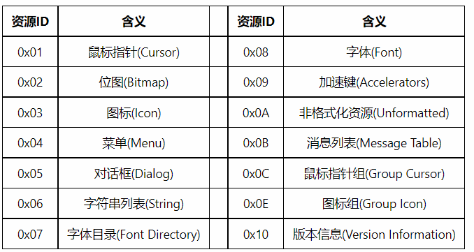

 **`IMAGE_RESOURCE_DIRECTORY_ENTRY.DUMMYUNIONNAME2`
　　在资源目录项中该字段是一个联合体类型，大小为4个字节，它决定这个资源目录的目录中子节点的类型(是目录还是节点)。如果这个字段的最高位是1，则表示该资源的子节点是一个目录类型，该字段的低31位是子目录的资源目录头结构的偏移，但这个偏移既不是FOA也不是RVA，它是以首个资源表的地址为基址，加上低31位的值才是资源目录头结构的地址。如果最高位为0，则表示该资源的子节点是一个节点，它也以首个资源表的地址为基址，整个字段的值就是该资源节点的偏移。这个节点是IMAGE_RESOURCE_DATA_ENTRY类型的结构体。(一般在三级目录中该字段的最高位位0，而在其他两个目录中该字段的最高位为1)** 

 **注：为了编程方便，IMAGE_RESOURCE_DIRECTORY_ENTRY的联合体中出现了一组特殊的struct结构体，其成员声明格式为：[类型] [变量名] : [位宽表达式]， 这个格式就是C语言中位段的声明格式。NameOffset字段的值等于该联合体的低31位，NameIsString字段的值等于该联合体的最高位。将一个4字节的类型拆成这样两个字段就可以方便的避免了繁琐的位操作了，而且该结构的总大小不会发生变化。** 

 **`MAGE_RESOURCE_DATA_ENTRY`
　　这个结构体就是目录资源的三级目录下的子目录，里面存储的就是资源文件的信息，如OffsetToData字段存储的就是资源文件的RVA地址，它指向了资源的二进制信息，Size字段存储的就是资源文件的大小，CodePage字段存储资源的代码页但大多数情况为0。
　　注：在其指向的资源数据中，字符串都是Unicode的编码方式，每个字符都是由一个16位(一个单字)的值表示，并且都是以UNICODE_NULL结束(其实就是两个0x00)。**
　　**`IMAGE_RESOURCE_DIR_STRING_U`
　　该结构体就是目录资源的名称结构，里面存在两个字段，都是2个字节，Length字段存储的是目录资源名称的长度，以2个字节为单位。NameString字段是一个Unicode字符串的第一个字符，并不以0结尾，其长度是由Length字段限制。该结构的总大小并不是表面上的4个字节，而是根据名字长度变化的，计算方式为：Size = SizeOf(WCHAR) \* (Length + 1); 这里的1是Length字段的大小。** 

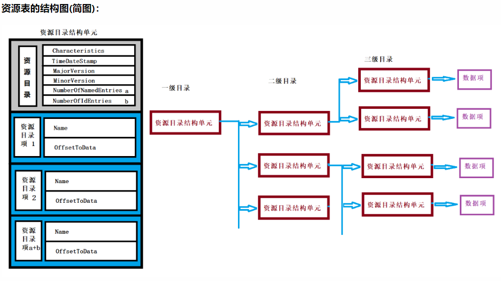

 **手动寻找资源数据(为了方便程序的两个对齐方式的值都是0x1000)：** 

## 重定位表

 知道了重定位表的作用，现在我们来分析一个重定位表在PE文件中是如何存在的，首先来看看描述重定位表的结构： 

```c
typedef struct _IMAGE_BASE_RELOCATION {
    DWORD   VirtualAddress;//RVA
    DWORD   SizeOfBlock;
} IMAGE_BASE_RELOCATION,* PIMAGE_BASE_RELOCATION;
#define IMAGE_SIZEOF_BASE_RELOCATION
```

该结构体有两个成员：一个是地址，一个是大小。如下图所示：一个重定位表由多个大小SizeOfBlock的Block组成，（不同块的SizeOfBlock大小不一）。

每一个块记录了1000H即4KB大小的内存中需要重定位信息的地址（一页大小），这些地址以VirtualAdress为该页的基址，偏移地址占两个字节（1000H最多需要12bit即可：0~FFFH）。

所以两个字节的低12位为偏移地址，而高4位就是一个标记，当此标记为0011（3）时低12为才有效，否则该2个字节可能是为了对齐而产生的，并且为对齐而产生的字节其值全为0。

 由于重定位表的SizeOfBlock大小不确定，新的Block的重定位信息的结构体接着上一个Block4字节对齐后开始，而当出现一个_IMAGE_BASE_RELOCATION结构体的值全为0时，表明重定位表结束。 


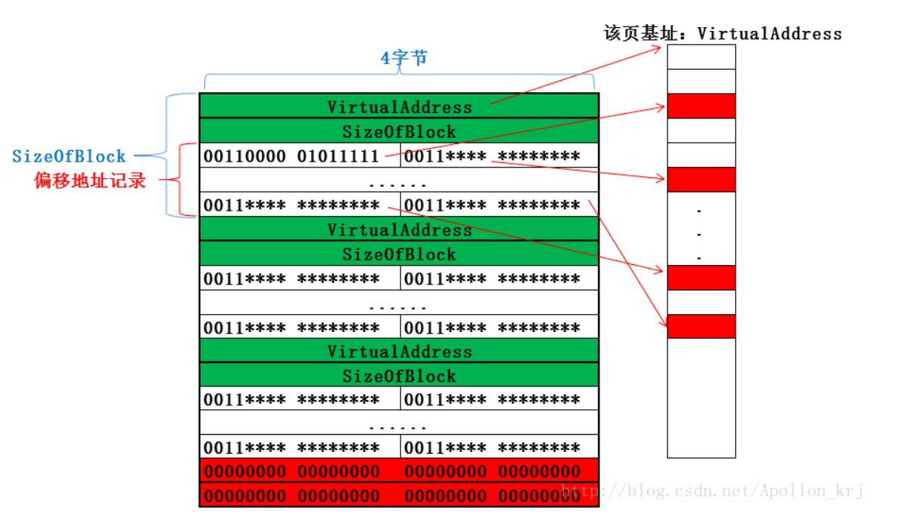


