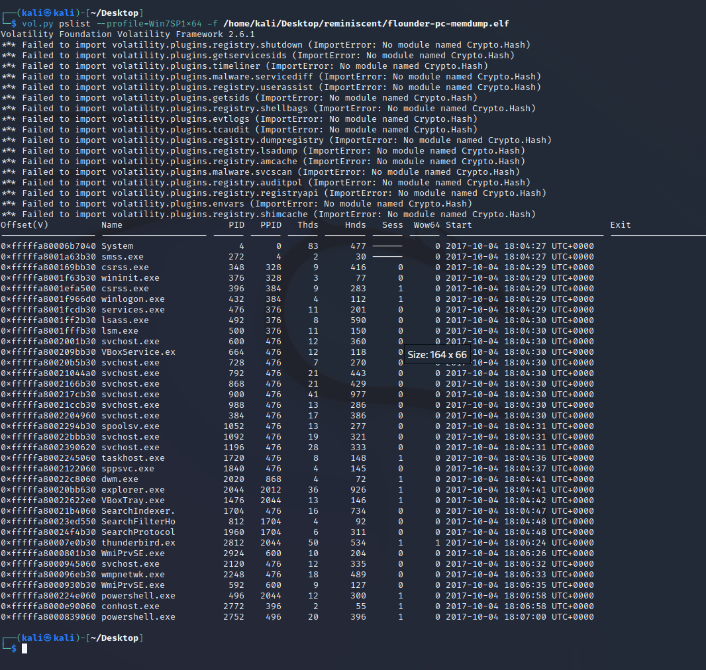
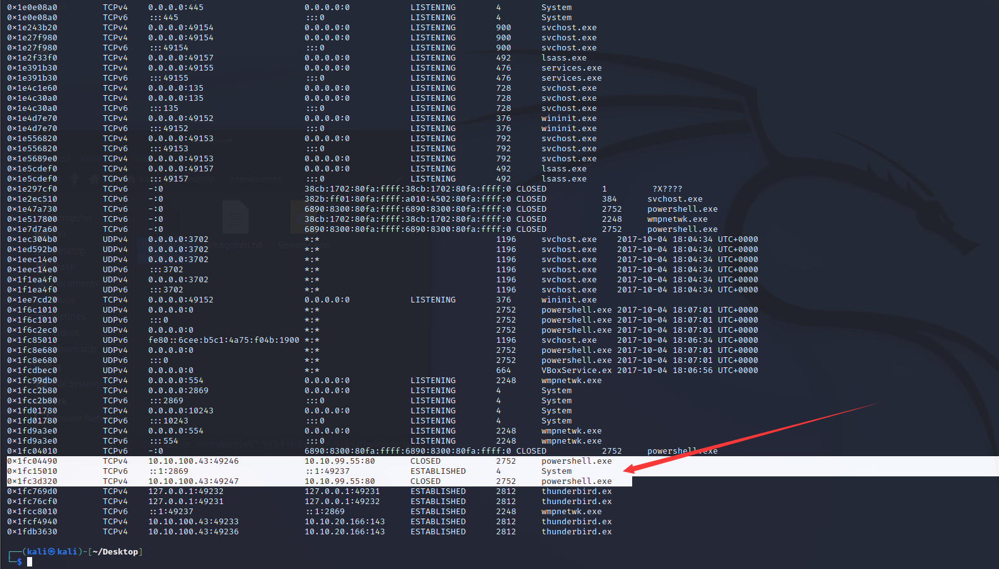
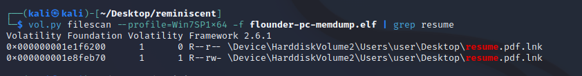
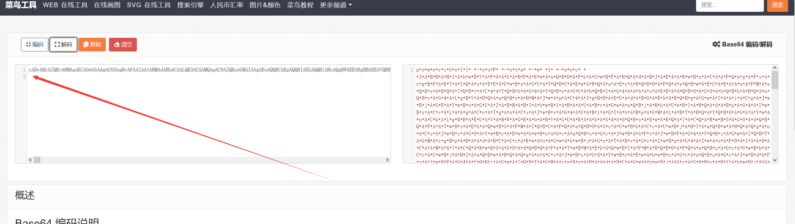

# 环境搭建

https://blog.csdn.net/m0_68012373/article/details/127419463

先跟着安装一下 在kali里面

# 简述


# 开整

按好环境直接运行下面这条命令

```
vol.py pslist --profile=Win7SP1x64 -f /home/kali/Desktop/reminiscent/flounder-pc-memdump.elf
```




看见最后有两个powershell.exe  

扫一下网络活动

```
vol.py netscan --profile=Win7SP1x64 -f flounder-pc-memdump.elf
```




1. 有`powershell.exe`，即使它可能是良性的，也有可能用于设置反向 shell。
2. 与端口“80”的通信使用`powershell.exe`. 这很突出，因为普通用户（不是那么精通技术）不会使用“powershell.exe”与网站通信。

让我们转储用于调用`powershell.exe`调查的命令。

**通过使用获取命令运行`windows.cmdline`**

- 我们可以使用以下命令获取用于运行该进程的所有命令：

```
vol.py -f flounder-pc-memdump.elf windows.cmdline
```

- 但是为了只获取特定进程的命令，我们可以使用带`--pid`标志的PID

```
vol.py -f flounder-pc-memdump.elf windows.cmdline --pid 2752
```


我们确实打开了两个文件，让我们转储这些文件，看看我们可以从中得到什么：

```
vol.py filescan --profile=Win7SP1x64 -f flounder-pc-memdump.elf | grep resume
```



```
# dump files at the specified offset to the current directory
vol.py dumpfiles --profile=Win7SP1x64 -f flounder-pc-memdump.elf -Q 0x000000001e8feb70 -D . 
```

我们可以`strings`在文件上使用，然后出现一堆 base64。

```
strings file.496.0xfffffa80017dcc60.resume.pdf.lnk.vacb
```




又是一段powershell 就是两层 base64 再解一次

  出现flag

