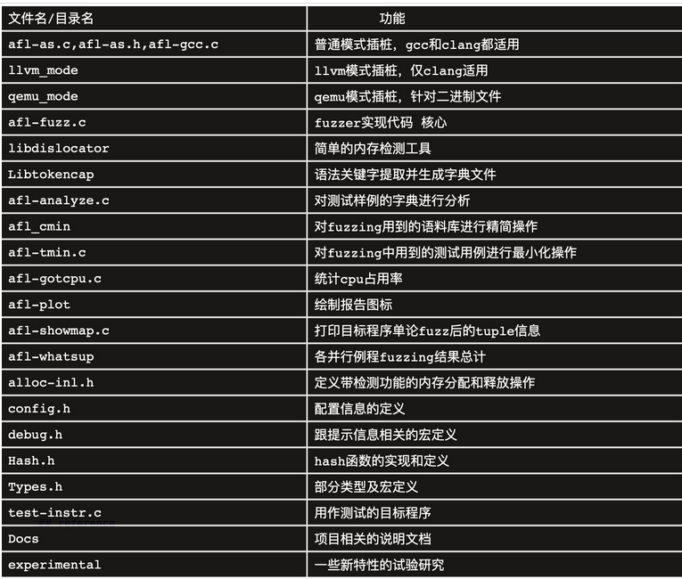
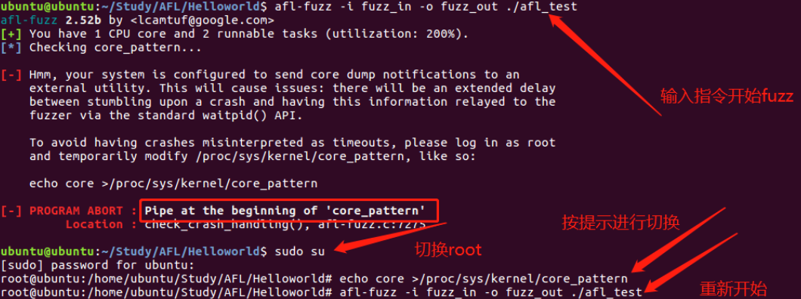
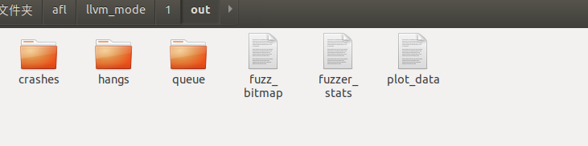
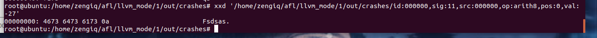
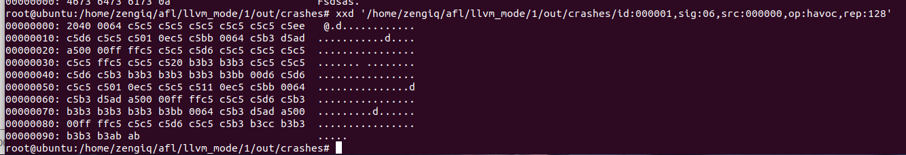
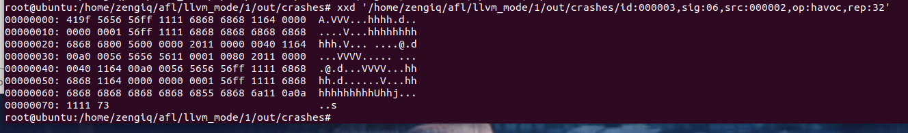

# AFL简介

afl-fuzz全称American Fuzzy Loop， 它的原理是：对源码进行重新编译时进行插桩，在进行fuzzing时，会把执行了新的tuple或新的tuple命中组的测试样例重新放回语料库进行变异，不断优化种子，来提高代码覆盖率。而且AFL是基于边覆盖率的，之所以没有采用基本块覆盖率是因为大部分的漏洞产生都是由于一些不确定性的跳转或者状态导致，而不是只是单纯的是否执行到了这块代码，所以采用边覆盖率比基于代码覆盖率更有意义。AFL用了一块64KB的共享内存来存放tuple的信息，而且是采用byte来记录tuple的信息，之所以采用byte不是bit是因为还要记录命中数。使用这块有限的共享内存存在碰撞，会导致边覆盖率不准确，这是AFL的一个缺点。 

# AFL安装

可以git下载，也可以官网下载，这里选择Linux下，git安装

```
git clone https://github.com/mirrorer/afl
```

 之后在afl文件夹中执行 

```
$ make
$ make install //如果安装报权限的错，那么就 $ sudo make install
```

 可以输入afl-fuzz -h查看是否安装成功，安装成功则会出现afl-fuzz的–help界面。 

# llvm+clang安装

afl-fuzz需要在编译时进行插桩，然后再进行下一步的Fuzzing。afl-fuzz的编译器有afl-gcc、afl-g++、afl-clang、afl-clang++，其实质就是gcc、g++、clang以及clang++的wrapper，实质调用的依旧是gcc和clang，一般来说gcc在大部分Linux系统都有安装，高版本的ubuntu和centOS好像也编译好了llvm和clang，可以按照下面分别验证系统是否安装gcc和llvm+clang（llvm和clang是一套的）。

 gcc --version
 clang --version


下面针对电脑未安装llvm+clang。对于简单的学习afl和fuzzing，并不需要自己编译llvm，在llvm的官网下载需要版本的pre-built版，然后进行环境配置就够了。但如果是对一些论文的工具，特别是魔改过afl-clang的工具、源码，最好是下载源码中所用版本的llvm源码，然后本地进行编译。
下载到本地之后进行环境配置，在打开的文件最后加上环境变量，最后使环境变量生效。

gedit ~/.bashrc 

export LLVM_HOME=/你的下载的llvm路径/bin
export PATH=$LLVM_HOME:$PATH


source ~/.bashrc1

再进入afl的文件夹，找到llvm_mode文件夹进入，运行make。afl-clang就可以运行了。

# AFL源码目录结构



# 开始第一次AFL-Fuzz

就和学一门语言都要先输入"Hello World"一样，我们也用一个简单的例子开始Fuzzing。
新建一个文件夹，目录下建立test.c文件，并在该文件夹下新建两个文件夹分别为in 和out 。在in文件夹中建立testcase文本文件，随意输入一点文本，作为起始种子。

```
echo "asdsas" >> testcase
```

```c
#include <stdio.h> 
#include <stdlib.h> 
#include <unistd.h> 
#include <string.h> 
#include <signal.h> 

int vuln(char *str)
{
    int len = strlen(str);
    if(str[0] == 'A' && len == 66)
    {
        raise(SIGSEGV);
        //如果输入的字符串的首字符为A并且长度为66，则异常退出
    }
    else if(str[0] == 'F' && len == 6)
    {
        raise(SIGSEGV);
        //如果输入的字符串的首字符为F并且长度为6，则异常退出
    }
    else
    {
        printf("it is good!\n");
    }
    return 0;
}

int main(int argc, char *argv[])
{
    char buf[100]={0};
    gets(buf);//存在栈溢出漏洞
    printf(buf);//存在格式化字符串漏洞
    vuln(buf);

    return 0;
}

```

 将上面的代码使用afl插桩  编译

```
afl-gcc -g test.c -o test
```

 test文件就是插桩好的测试文件。下面使用afl-fuzz工具，运行界面最好全屏显示。 

```bash
afl-fuzz -i in -o out ./test 
```

 这时候应该会出现一些问题 



 解决方案

```
1.查看报错，发现有个问题，需要 core_pattern

2.切换root

3.按提示输入指令切换 echo core >/proc/sys/kernel/core_pattern

4.重新输入指令 afl-fuzz -i fuzz_in -o fuzz_out ./afl_test

```



 queue：存放所有具有独特执行路径的测试用例。
 crashes：导致目标接收致命signal而崩溃的独特测试用例。
 crashes/README.txt：保存了目标执行这些crash文件的命令行参数。
 hangs：导致目标超时的独特测试用例。
 fuzzer_stats：afl-fuzz的运行状态。
 plot_data：用于afl-plot绘图 


# 三、结束测试

## 何时结束

检查*afl-fuzz*工作状态的目的是为何时停止测试提供依据，通常来说符合下面几种情况时就可以停掉了。

(1) 状态窗口中”cycles  done”字段颜色变为绿色该字段的颜色可以作为何时停止测试的参考，随着周期数不断增大，其颜色也会由洋红色，逐步变为黄色、蓝色、绿色。当其变为绿色时，继续Fuzzing下去也很难有新的发现了，这时便可以通过Ctrl+C停止afl-fuzz


# 分析crash



第一个crashes 发现符合首字符为F且字符串长度为6的异常退出情况 




第二个crashes 一般像这样的存在栈溢出漏洞



第四个crashes 输入A 并且长度为66，则异常退出


