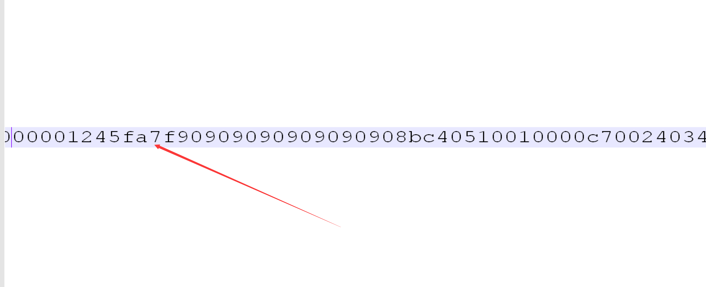
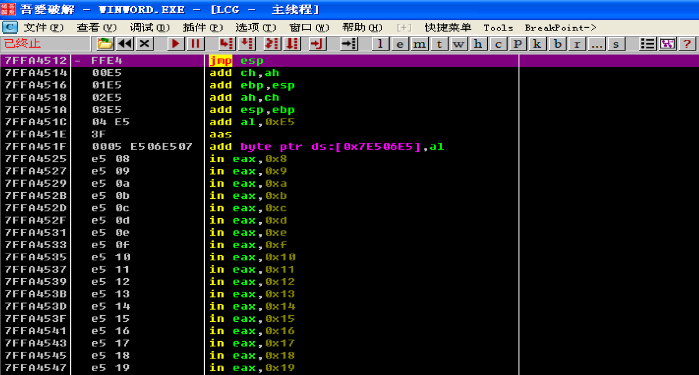
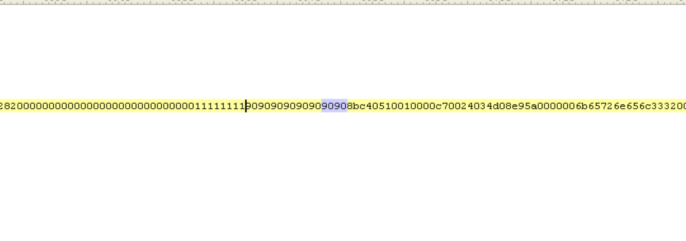
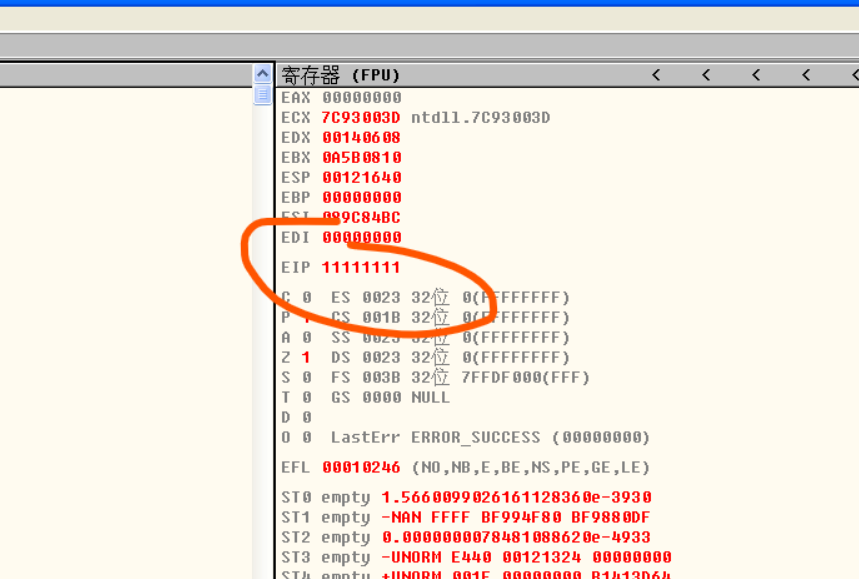
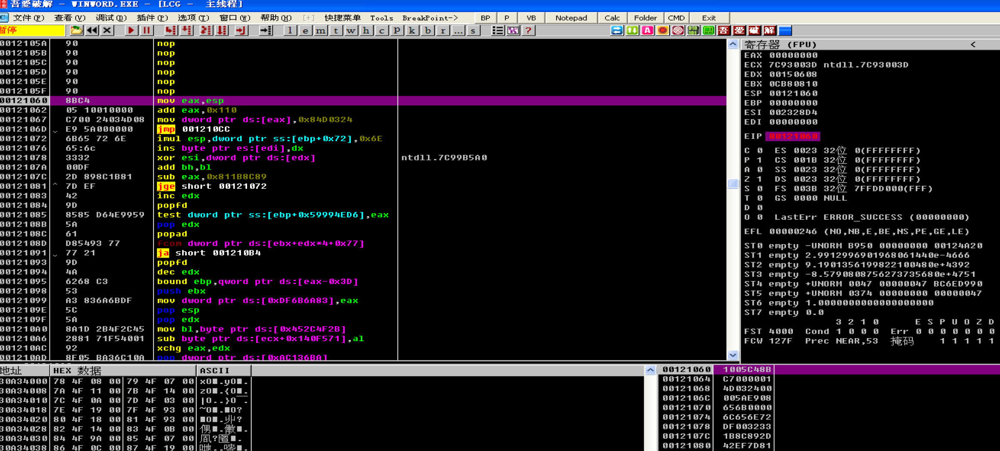

没看出来，堆栈前后看了一下也没发现形似shellcode的东西，下了几个断点也没有，只能另寻他法！

俩个办法

（1）把POC拖到010Editor看看有没有特征可以看看
（2）对弹出计算器用到的函数下断点

先用第一个办法：
拖到010Editor中，搜搜有没有9090（nop滑板指令，大部分会有这种指令用来凑数或者保护数据等）之类的，运气不错，找到相似的。

9090909090909090前面有四个字节，像一个库里面的地址7FFA4512，后面一堆看着像shellcode，附加office，看看这个地址是个啥东西：

一个jmp esp，典型的跳板指令，差不多就是这个地方溢出返回值，我们尝试改一下这里，验证一下：

把这个跳板改成11111111试试：

保存，OD附加office，打开poc，EIP果然等于11111111：

这就算撞到了溢出点，我们用原来的POC，附加-运行-下断在jmp esp这里下硬件断点看看堆栈情况：

执行jmp esp 来到shellcode处

从这里也能够看出溢出函数末尾是ret 8，esp直接+8，F8运行几步，弹出计算器：

们试着替换shellcode，改成自己的弹窗shellcode，不改变文件原来大小，替换掉9090909090909090后面的shellcode就行，因为我的shellcode结尾会自动退出程序，所以不需要管原来shellcode长度过长的问题，但是这里卡了一个bug，修改完shellcode之后，并没有出现弹窗，猜想可能是我们自己的shellcode结尾接了原来的字节码，导致识别出错，于是我把我们的弹窗shellcode后面8字节改成90，成功弹窗（这里发现改过得POC不再是一次性的了，可能是因为弹窗shellcode长度较小，不会被破坏）：

