#   Linux结构 

## 历史

从 1970 年 Ken Thompson 和 Dennis Ritchie（他们当时都在 AT&T 工作）发布 Unix 操作系统开始，许多事件导致创建了第一个 Linux 内核，并最终创建了 Linux 操作系统 (OS)。伯克利Software Distribution (BSD) 于 1977 年发布，但由于其中包含 AT&T 拥有的 Unix 代码，由此引发的诉讼限制了 BSD 的发展。Richard Stallman 于 1983 年启动了 GNU 项目。他的目标是创建一个免费的类 Unix 操作系统，他的部分工作促成了 GNU 通用公共许可证 (GPL) 的创建。多年来其他人的项目未能产生一个有效的、免费的内核，该内核在 Linux 内核创建之前被广泛采用。


起初，Linux 是一个个人项目，由一位名叫 Linus Torvalds 的芬兰学生于 1991 年开始。他的目标是创建一个新的、免费的操作系统内核。多年来，Linux 内核已经从少量使用 C 语言编写的文件，根据禁止商业分发的许可，发展到拥有超过 2300 万行源代码（不包括注释）的最新版本，并根据 GNU 通用公共许可证 v2 获得许可。


Linux 可用于 600 多个发行版（或基于 Linux 内核和支持软件和库的操作系统）。一些最流行和最著名的是 Ubuntu、Debian、Fedora、OpenSUSE、elementary、Manjaro、Gentoo Linux、RedHat 和 Linux Mint。


Linux 通常被认为比其他操作系统更安全，虽然它过去有很多内核漏洞，但现在越来越少。与 Windows 操作系统相比，它不易受到恶意软件的影响，并且更新非常频繁。Linux 也非常稳定，通常可以为最终用户提供非常高的性能。但是，对于初学者来说可能更难，并且没有像 Windows 那样多的硬件驱动程序。


由于 Linux 是免费和开源的，因此任何人都可以修改源代码并以商业或非商业方式分发。基于 Linux 的操作系统运行在服务器、大型机、台式机、嵌入式系统（如路由器、电视、视频游戏机等）上。在智能手机和平板电脑上运行的整体 Android 操作系统基于 Linux 内核，因此，Linux 是安装最广泛的操作系统。

Linux 是类似于 Windows、iOS、Android 或 macOS 的操作系统。操作系统是管理与我们计算机相关的所有硬件资源的软件。这意味着操作系统管理软件和硬件之间的整个通信。此外，存在许多不同的发行版（distro）。它就像是 Windows 操作系统的一个版本。


通过交互式实例，我们可以访问 Parrot OS 的定制版本 Pwnbox。这将是我们将通过模块使用的主要操作系统。Parrot OS 是一个基于 Debian 的 Linux 发行版，专注于安全、隐私和开发。

## 哲学

Linux 遵循五个核心原则：

| **原则**                                                     | **描述**                                                     |
| ------------------------------------------------------------ | ------------------------------------------------------------ |
| `Everything is a file`                                       | Linux操作系统上运行的各种服务的所有配置文件都存储在一个或多个文本文件中。 |
| `Small, single-purpose programs`                             | Linux 提供了许多不同的工具供我们使用，它们可以组合在一起工作。 |
| `Ability to chain programs together to perform complex tasks` | 不同工具的集成和组合使我们能够执行许多大型和复杂的任务，例如处理或过滤特定数据结果。 |
| `Avoid captive user interfaces`                              | Linux 设计为主要与 shell（或终端）一起工作，这使用户可以更好地控制操作系统。 |
| `Configuration data stored in a text file`                   | 此类文件的一个示例是文件`/etc/passwd`，该文件存储在系统上注册的所有用户。 |

## 成分

| **成分**          | **描述**                                                     |
| ----------------- | ------------------------------------------------------------ |
| `Bootloader`      | 运行的一段代码，用于引导引导过程启动操作系统。Parrot Linux 使用 GRUB 引导程序。 |
| `OS Kernel`       | 内核是操作系统的主要组成部分。它在硬件级别管理系统 I/O 设备的资源。 |
| `Daemons`         | 后台服务在 Linux 中称为“守护进程”。他们的目的是确保计划、打印和多媒体等关键功能正常运行。这些小程序在我们启动或登录计算机后加载。 |
| `OS Shell`        | 操作系统外壳或命令语言解释器（也称为命令行）是操作系统与用户之间的接口。该接口允许用户告诉操作系统要做什么。最常用的 shell 是 Bash、Tcsh/Csh、Ksh、Zsh 和 Fish。 |
| `Graphics server` | 这提供了一个称为“X”或“X-server”的图形子系统（服务器），它允许图形程序在本地或远程在 X-windowing 系统上运行。 |
| `Window Manager`  | 也称为图形用户界面 (GUI)。有很多选项，包括 GNOME、KDE、MATE、Unity 和 Cinnamon。桌面环境通常有多个应用程序，包括文件和网络浏览器。这些允许用户访问和管理操作系统的基本和经常访问的功能和服务。 |
| `Utilities`       | 应用程序或实用程序是为用户或其他程序执行特定功能的程序。     |

## Linux架构

Linux 操作系统可以分为几层：

| **层**           | **描述**                                                     |
| ---------------- | ------------------------------------------------------------ |
| `Hardware`       | 外围设备，例如系统的 RAM、硬盘驱动器、CPU 等。               |
| `Kernel`         | Linux 操作系统的核心，其功能是虚拟化和控制常见的计算机硬件资源，如 CPU、分配的内存、访问的数据等。内核为每个进程提供自己的虚拟资源，并防止/减轻不同进程之间的冲突。 |
| `Shell`          | 命令行界面 ( **CLI** )，也称为 shell，用户可以在其中输入命令以执行内核的功能。 |
| `System Utility` | 使用户可以使用操作系统的所有功能。                           |

## 文件系统层次结构

Linux 操作系统采用树状层次结构，并记录在[文件系统层次结构](http://www.pathname.com/fhs/)标准 (FHS) 中。Linux 由以下标准顶级目录构成：

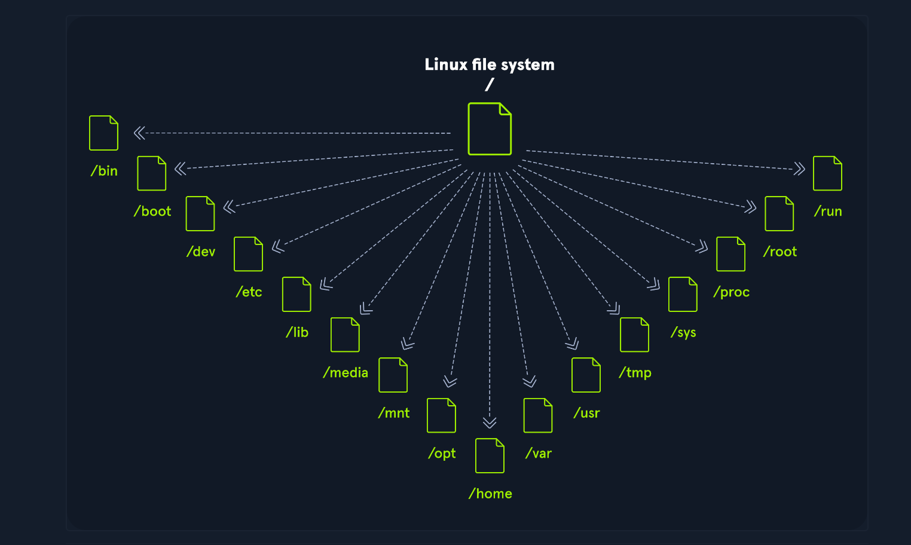

| **小路** | **描述**                                                     |
| -------- | ------------------------------------------------------------ |
| `/`      | 顶级目录是根文件系统，包含在挂载其他文件系统之前启动操作系统所需的所有文件，以及启动其他文件系统所需的文件。启动后，所有其他文件系统都作为根目录的子目录安装在标准安装点。 |
| `/bin`   | 包含必要的命令二进制文件。                                   |
| `/boot`  | 由静态引导加载程序、内核可执行文件和引导 Linux 操作系统所需的文件组成。 |
| `/dev`   | 包含设备文件以方便访问连接到系统的每个硬件设备。             |
| `/etc`   | 本地系统配置文件。已安装应用程序的配置文件也可以保存在这里。 |
| `/home`  | 系统上的每个用户在这里都有一个子目录存放。                   |
| `/lib`   | 系统启动所需的共享库文件。                                   |
| `/media` | 外部可移动媒体设备（例如 USB 驱动器）安装在此处。            |
| `/mnt`   | 常规文件系统的临时挂载点。                                   |
| `/opt`   | 第三方工具等可选文件可以保存在这里。                         |
| `/root`  | 根用户的主目录。                                             |
| `/sbin`  | 该目录包含用于系统管理的可执行文件（二进制系统文件）。       |
| `/tmp`   | 操作系统和许多程序使用此目录来存储临时文件。该目录通常在系统启动时被清除，并且可能会在其他时间被删除而不会发出任何警告。 |
| `/usr`   | 包含可执行文件、库、man 文件等。                             |
| `/var`   | 此目录包含可变数据文件，例如日志文件、电子邮件收件箱、Web 应用程序相关文件、cron 文件等。 |

# Linux发行版

Linux发行版是基于Linux内核的操作系统。它们被用于各种用途，从服务器和嵌入式设备到台式电脑和移动电话。每个Linux发行版都是不同的，有自己的一组特性、包和工具。一些流行的例子包括:

- [Ubuntu](https://ubuntu.com/)
- [Fedora](https://getfedora.org/)
- [CentOS](https://www.centos.org/)
- [Debian](https://www.debian.org/)
- [Red Hat Enterprise Linux](https://www.redhat.com/en/technologies/linux-platforms/enterprise-linux)

许多用户选择Linux作为他们的桌面计算机，因为它是免费的、开源的和高度可定制的。Ubuntu和Fedora是桌面Linux和初学者的两个流行选择。

它也被广泛用作服务器操作系统，因为它安全、稳定、可靠，并提供频繁和定期的更新。

最后，作为网络安全专家，我们通常更喜欢Linux，因为它是开源的，这意味着它的源代码可供审查和定制。由于有了这样的定制，我们可以按照我们想要的方式优化和定制我们的Linux发行版，并仅在必要时为特定的用例配置它。

我们可以在任何地方使用这些发行版，包括(web)服务器、移动设备、嵌入式系统、云计算和桌面计算。对于网络安全专家来说，一些最流行的Linux发行版包括但不限于:


|                                                          |                                   |                                     |
| -------------------------------------------------------- | --------------------------------- | ----------------------------------- |
| [ParrotOS](https://www.parrotsec.org/)                   | [Ubuntu](https://ubuntu.com/)     | [Debian](https://www.debian.org/)   |
| [Raspberry Pi OS](https://www.raspberrypi.com/software/) | [CentOS](https://www.centos.org/) | [BackBox](https://www.backbox.org/) |
| [BlackArch](https://www.blackarch.org/)                  | [Pentoo](https://www.pentoo.ch/)  |                                     |

不同Linux发行版之间的主要区别是包含的包、用户界面和可用的工具。Kali Linux是最受网络安全专家欢迎的发行版，包括各种以安全为重点的工具和包。Ubuntu广泛应用于桌面用户，而Debian则流行于服务器和嵌入式系统。最后，红帽企业Linux和CentOS在企业级计算中很流行。

## Debian

Debian是一个广泛使用和备受尊敬的Linux发行版，以其稳定性和可靠性而闻名。它被用于各种用途，包括桌面计算、服务器和嵌入式系统。它使用高级包工具(apt)包管理系统来处理软件更新和安全补丁。软件包管理系统通过在安全更新可用时自动下载和安装安全更新来帮助保持系统最新和安全。这可以手动执行，也可以自动设置。

Debian的学习曲线可能比其他发行版更陡峭，但它被广泛认为是最灵活和可定制的Linux发行版之一。配置和设置可能很复杂，但它也提供了对系统的出色控制，这对高级用户很有好处。我们对Linux系统的控制越多，它就会变得越复杂。然而，与我们获得的选择和可能性相比，这只是一种感觉。如果不深入地学习它，我们可能会花更多的时间配置“简单”的任务和流程，而不是更深入地学习使用一些命令和工具。我们将在筛选内容和查找文件和目录部分看到它。

稳定性和可靠性是Debian的关键优势。该发行版以其长期支持版本而闻名，它可以提供长达五年的更新和安全补丁。这对于必须全天候运行的服务器和其他系统尤其重要。它有一些漏洞，但开发社区已经迅速发布了补丁和安全更新。此外，Debian在安全和隐私方面有很强的承诺，并且该发行版有良好的安全记录。Debian是一种多功能、可靠的Linux发行版，广泛用于各种目的。其稳定性、可靠性和对安全性的承诺使其成为各种用例(包括网络安全)的有吸引力的选择。

# Shell简介

学习如何使用Linux shell是至关重要的，因为有许多基于Linux的服务器。它们经常被使用，因为与Windows服务器相比，Linux更不容易出错。

例如，web服务器通常基于Linux。要知道如何使用操作系统来有效地控制它，就需要理解和掌握Linux的基本部分——Shell。当我们第一次从Windows切换到Linux时，它看起来像这样吗:

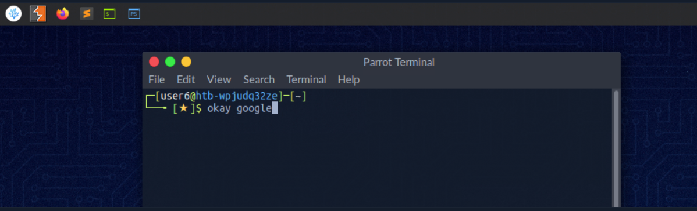

Linux终端，也称为shell或命令行，为计算机系统的用户和内核之间提供基于文本的输入/输出(I/O)接口。术语控制台也是典型的，但不是指窗口，而是指文本模式下的屏幕。在终端窗口中可以执行命令对系统进行控制。

我们可以把shell看作是一个基于文本的GUI，我们在其中输入命令来执行诸如导航到其他目录、处理文件以及从系统获取信息等操作，但是它具有更多的功能。

## Terminal Emulators

​	终端仿真是模拟终端功能的软件。它允许在图形用户界面(GUI)中使用基于文本的程序。还有所谓的命令行接口(CLI)，它们作为一个终端中的附加终端运行。简而言之，终端充当shell解释器的接口。

​	终端仿真器和多路复用器是对终端有益的扩展。它们为我们提供了不同的方法和函数来使用终端，例如将终端拆分为一个窗口、在多个目录中工作、创建不同的工作空间等等。使用这种名为Tmux的多路复用器的示例如下所示:

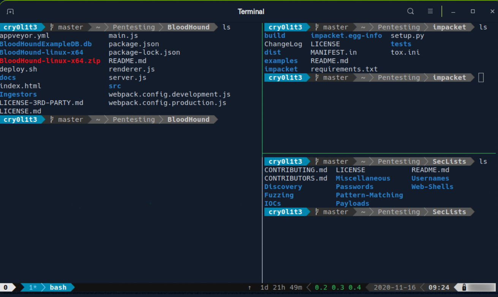

## Shell

Linux中最常用的shell是' Bourne-Again shell ' (' BASH ')，它是GNU项目的一部分。我们通过GUI所做的一切都可以用shell来完成。shell为我们提供了更多与程序和进程交互的可能性，从而更快地获取信息。此外，许多流程可以通过更小或更大的脚本轻松地实现自动化，从而使手工工作更加容易。

除了Bash，还存在其他shell，如[Tcsh/Csh](https://en.wikipedia.org/wiki/Tcsh)， [Ksh](https://en.wikipedia.org/wiki/KornShell)， [Zsh](https://en.wikipedia.org/wiki/Z_shell)， [Fish](https://en.wikipedia.org/wiki/Friendly_interactive_shell) shell等。

# Prompt Description

bash 提示符易于理解，默认情况下包括用户、主机名和当前工作目录等信息。它是终端屏幕上显示的一串字符，表明系统已准备好接受我们的输入。它通常包括当前用户、计算机的主机名和当前工作目录等信息。提示符通常换行显示，光标位于提示符之后，准备好让用户开始输入命令。

它可以被定制以向用户提供有用的信息。格式看起来像这样：

```shell-session
<username>@<hostname><current working directory>$
```

用户的主目录用波浪号 < `~`> 标记，是我们登录时的默认文件夹。

```
 <username>@<hostname>[~]$
```

在这种情况下，美元符号代表用户。一旦我们以 身份登录`root`，字符就会变为`hash`< `#`>，如下所示：

```shell-session
root@htb[/htb]#
```

例如，当我们在目标系统上上传并运行 shell 时，我们可能看不到用户名、主机名和当前工作目录。这可能是由于环境中的 PS1 变量设置不正确所致。在这种情况下，我们会看到以下提示：

### 非特权 - 用户 Shell 提示符

```shell-session
$
```

### 特权 - Root Shell 提示符

```shell-session
#
```

​	除了提供当前用户和工作目录等基本信息外，我们还可以自定义在提示符中显示其他信息，例如日期和时间、IP 地址、日期、时间、上一条命令的退出状态等。

​	这在我们的渗透测试期间对我们特别有用，因为我们可以使用各种工具和可能性，如`script`或 来`.bash_history`过滤和打印我们使用的所有命令，并按日期和时间对它们进行排序。

例如，可以将提示设置为显示当前工作目录的完整路径，而不仅仅是当前目录名称，如果我们有条理地工作，它还可以包括目标的 IP 地址。

可以使用 shell 配置文件（`.bashrc`对于 Bash shell）中的特殊字符和变量来自定义提示。例如，我们可以使用：`\u`字符来表示当前用户名，`\h`对于主机名，`\w`对于当前工作目录。

| **特殊字符**   | **描述**                      |
| -------------- | ----------------------------- |
| `\d`           | 日期（2 月 6 日星期一）       |
| `\D{%Y-%m-%d}` | 日期 (YYYY-MM-DD)             |
| `\H`           | 完整的主机名                  |
| `\j`           | shell 管理的作业数            |
| `\n`           | 新队                          |
| `\r`           | 回车                          |
| `\s`           | 外壳名称                      |
| `\t`           | 当前时间 24 小时制 (HH:MM:SS) |
| `\T`           | 当前时间 12 小时制 (HH:MM:SS) |
| `\@`           | 当前时间                      |
| `\u`           | 当前用户名                    |
| `\w`           | 当前工作目录的完整路径        |

自定义提示可能是使您的终端体验更加个性化和高效的有用方法。它还可以作为故障排除和问题解决的有用工具，因为它可以在任何给定时间提供有关系统状态的重要信息。

除了自定义提示之外，我们还可以使用不同的配色方案、字体和其他设置来自定义他们的终端环境，使他们的工作环境更具视觉吸引力和更易于使用。

但是，我们在这里看到与在 Windows GUI 上工作时相同的情况。我们以用户身份登录到具有特定名称的计算机上，并且当我们浏览系统时，我们知道我们在哪个目录中。Bash 提示符也可以根据我们自己的需要进行定制和更改。bash 提示符的调整超出了本模块的范围。但是，我们可以查看[bashrcgenerator](http://bashrcgenerator.com/)和[powerline](https://github.com/powerline/powerline)，这使我们有可能根据我们的需要调整我们的提示。

# Getting Help

我们总是会遇到一些工具，它们的可选参数我们从记忆中不知道，或者我们以前从未见过。因此，了解如何帮助自己熟悉这些工具是至关重要的。前两种方法是手册页和帮助函数。首先熟悉我们想要尝试的工具总是一个好主意。我们还将学习一些我们认为不可能的工具的一些可能的技巧。在手册页中，我们将找到详细说明的详细手册。

 Syntax:

```shell-session
vnswer77@htb[/htb]$ man <tool>
```

Let us have a look at an example:

 Example:

```shell-session
vnswer77@htb[/htb]$ man curl
```

```shell-session
curl(1)                                                             Curl Manual                                                            curl(1)

NAME
       curl - transfer a URL

SYNOPSIS
       curl [options] [URL...]

DESCRIPTION
       curl  is  a tool to transfer data from or to a server, using one of the supported protocols (DICT, FILE, FTP, FTPS, GOPHER, HTTP, HTTPS,  
       IMAP, IMAPS,  LDAP,  LDAPS,  POP3,  POP3S,  RTMP, RTSP, SCP, SFTP, SMB, SMBS, SMTP, SMTPS, TELNET, and TFTP). The command is designed to work without user interaction.

       curl offers a busload of useful tricks like proxy support, user authentication, FTP upload, HTTP post, SSL connections, cookies, file transfer resume, Metalink,  and more. As we will see below, the number of features will make our head spin!

       curl is powered by libcurl for all transfer-related features.  See libcurl(3) for details.

Manual page curl(1) line 1 (press h for help or q to quit)
```

 Syntax:

```shell-session
vnswer77@htb[/htb]$ <tool> --help
```

 Example:

```shell-session
vnswer77@htb[/htb]$ curl --help

Usage: curl [options...] <url>
     --abstract-unix-socket <path> Connect via abstract Unix domain socket
     --anyauth       Pick any authentication method
 -a, --append        Append to target file when uploading
     --basic         Use HTTP Basic Authentication
     --cacert <file> CA certificate to verify peer against
     --capath <dir>  CA directory to verify peer against
 -E, --cert <certificate[:password]> Client certificate file and password
<SNIP>
```

我们也可以用它的简写形式:

Syntax:

```shell-session
vnswer77@htb[/htb]$ <tool> -h
```

Example:

```shell-session
vnswer77@htb[/htb]$ curl -h

Usage: curl [options...] <url>
     --abstract-unix-socket <path> Connect via abstract Unix domain socket
     --anyauth       Pick any authentication method
 -a, --append        Append to target file when uploading
     --basic         Use HTTP Basic Authentication
     --cacert <file> CA certificate to verify peer against
     --capath <dir>  CA directory to verify peer against
 -E, --cert <certificate[:password]> Client certificate file and password
<SNIP>
```

正如我们所看到的，在这个例子中，彼此的结果并没有什么不同。另一个在开始时有用的工具是恰当。每个手册页都有一个简短的描述。该工具搜索给定关键字实例的描述。

Syntax:

```shell-session
vnswer77@htb[/htb]$ apropos <keyword>
```

Example:

```shell-session
vnswer77@htb[/htb]$ apropos sudo

sudo (8)             - execute a command as another user
sudo.conf (5)        - configuration for sudo front end
sudo_plugin (8)      - Sudo Plugin API
sudo_root (8)        - How to run administrative commands
sudoedit (8)         - execute a command as another user
sudoers (5)          - default sudo security policy plugin
sudoreplay (8)       - replay sudo session logs
visudo (8)           - edit the sudoers file
```

如果我们在理解长命令时遇到问题，另一个有用的资源是:https://explainshell.com/

# System Information

因为我们将使用许多不同的Linux系统，所以我们需要了解系统的结构和信息、它的进程、网络配置、用户、目录、用户设置和相应的参数。这里有一个必要的工具列表，将帮助我们获得上述信息。大多数都是默认安装的。

| **Command** | **Description**                                              |
| ----------- | ------------------------------------------------------------ |
| `whoami`    | 显示当前用户名                                               |
| `id`        | 返回用户身份                                                 |
| `hostname`  | 设置或打印当前主机系统的名称。                               |
| `uname`     | 打印有关操作系统名称和系统硬件的基本信息。                   |
| `pwd`       | 返回工作目录名。                                             |
| `ifconfig`  | ifconfig实用程序用于为网络接口分配或查看地址和/或配置网络接口参数。 |
| `ip`        | Ip是显示或操作路由、网络设备、接口和隧道的实用程序。         |
| `netstat`   | 显示网络状态。                                               |
| `ss`        | 另一个用于调查套接字的实用程序。                             |
| `ps`        | 显示进程状态。                                               |
| `who`       | 显示登录的用户。                                             |
| `env`       | 打印环境或设置并执行命令。                                   |
| `lsblk`     | 列出块设备。                                                 |
| `lsusb`     | Lists USB devices                                            |
| `lsof`      | Lists opened files.                                          |
| `lspci`     | Lists PCI devices.                                           |

让我们看几个例子。

#### Hostname

“hostname”命令是不言自明的，它只会打印我们登录的计算机的名称

```shell-session
vnswer77@htb[/htb]$ hostname

nixfund
```

#### Whoami

这个快速而简单的命令可以在Windows和Linux系统上使用，以获取我们当前的用户名。在安全评估期间，我们获得主机上的反向shell访问权限，我们应该做的情景感知的第一部分是确定我们以什么用户运行。从那里，我们可以确定用户是否有任何特权/访问权限。

```shell-session
cry0l1t3@htb[/htb]$ whoami

cry0l1t3
```

#### Id

“id”命令扩展了“whoami”命令，并打印出我们有效的组成员和id。渗透测试人员希望了解用户可能拥有的访问权限，系统管理员希望审计帐户权限和组成员资格，

这可能会引起他们的兴趣。在这个输出中，' hackthebox '组很有趣，因为它是非标准的，' adm '组意味着用户可以读取' /var/log '中的日志文件，

​	并可能获得敏感信息的访问权限，' sudo '组的成员资格特别有趣，因为这意味着我们的用户可以作为全能的' root '用户运行部分或所有命令。Sudo权限可以帮助我们升级特权，也可以向系统管理员提示，他们可能需要审计权限和组成员关系，以删除给定用户执行日常任务时不需要的任何访问权限。

```shell-session
cry0l1t3@htb[/htb]$ id

uid=1000(cry0l1t3) gid=1000(cry0l1t3) groups=1000(cry0l1t3),1337(hackthebox),4(adm),24(cdrom),27(sudo),30(dip),46(plugdev),116(lpadmin),126(sambashare)
```

#### Uname

让我们再深入研究一下uname命令。如果我们在终端中输入man uname，我们将显示该命令的手册页，它将显示我们可以使用该命令运行的可能选项和结果。

```shell-session
UNAME(1)                                    User Commands                                   UNAME(1)

NAME
       uname - print system information

SYNOPSIS
       uname [OPTION]...

DESCRIPTION
       Print certain system information.  With no OPTION, same as -s.

       -a, --all
              print all information, in the following order, except omit -p and -i if unknown:

       -s, --kernel-name
              print the kernel name

       -n, --nodename
              print the network node hostname

       -r, --kernel-release
              print the kernel release

       -v, --kernel-version
              print the kernel version

       -m, --machine
              print the machine hardware name

       -p, --processor
              print the processor type (non-portable)

       -i, --hardware-platform
              print the hardware platform (non-portable)

       -o, --operating-system
```

运行uname -a将按特定顺序打印有关该机器的所有信息:内核名称、主机名、内核发布版本、内核版本、机器硬件名称和操作系统。-a标志将省略-p(处理器类型)和-i(硬件平台)如果它们是未知的。

```shell-session
cry0l1t3@htb[/htb]$ uname -a

Linux box 4.15.0-99-generic #100-Ubuntu SMP Wed Apr 22 20:32:56 UTC 2020 x86_64 x86_64 x86_64 GNU/Linux
```

​	从上面的命令中，我们可以看到内核名称是Linux，主机名是box，内核发布版本是4.15.0-99-generic，内核版本是#100-Ubuntu SMP Wed Apr 22 20:32:56 UTC 2020，等等。单独运行这些选项中的任何一个都将给出我们感兴趣的特定位输出。

Uname获取内核版本

假设我们想打印出内核发行版，以便快速搜索潜在的内核漏洞。我们可以输入uname -r来获取这个信息。

```
cry0l1t3@htb[/htb]$ uname -r

4.15.0-99-generic
```

有了这些信息，我们可以去搜索“4.15.0-99-generic exploit”，第一个结果立即对我们有用。

强烈建议学习这些命令，了解它们的用途以及它们可以提供哪些信息。虽然有点乏味，但我们可以通过研究常见命令的手册页学到很多东西。我们甚至可能会发现一些我们甚至不知道的事情，用一个给定的命令是可能的。这些信息不仅仅用于Linux。但是，稍后还将使用它来发现Linux系统上可能导致权限升级的漏洞和错误配置。这里有一些可选的练习，我们可以解决练习的目的，这将帮助我们熟悉一些命令。

## Logging In via SSH

Secure Shell (SSH)是一种允许客户端访问并在远程计算机上执行命令或操作的协议。在基于linux的主机和运行其他类unix操作系统的服务器上，SSH是永久安装的标准工具之一，是许多管理员通过远程访问配置和维护计算机的首选。它是一种较老且经过验证的协议，不需要或不提供图形用户界面(GUI)。因此，它的工作效率非常高，占用的资源很少。

我们在以下部分和大多数其他模块中使用这种类型的连接，以提供在安全环境中尝试学习到的命令和操作的可能性。我们可以用下面的命令连接我们的目标:

#### SSH Login

```shell-session
vnswer77@htb[/htb]$ ssh [username]@[IP address]
```

## 练习

env | grep MAIL  邮箱路径

env | grep SHELL  shell路径

MTU 设置为 1500 的网络接口的名称是什么？  ifconfig -a里面找

# Navigation

导航是必不可少的，就像标准Windows用户使用鼠标一样。有了它，我们可以在整个系统中移动，在我们需要和想要的目录和文件中工作。

因此，我们使用不同的命令和工具来打印关于目录或文件的信息，并可以使用高级选项来优化输出以满足我们的需求。

学习新事物的最好方法之一就是亲身实践。在这里，我们将介绍如何在Linux中导航、创建、移动、编辑和删除文件和文件夹、在操作系统上查找它们、不同类型的重定向以及什么是文件描述符。

我们还将找到快捷方式，使我们使用shell的工作更容易、更舒适。

我们建议在本地托管的VM上进行试验。确保我们已经为虚拟机创建了快照，以防系统意外损坏。

让我们从导航开始。在我们通过系统之前，我们必须找出我们在哪个目录中。我们可以用pwd命令找到我们的位置。

```shell-session
cry0l1t3@htb[~]$ pwd

/home/cry0l1t3
```

只需要ls命令就可以列出目录中的所有内容。它有许多附加选项，可以补充当前文件夹中内容的显示。

```shell-session
cry0l1t3@htb[~]$ ls

Desktop  Documents  Downloads  Music  Pictures  Public  Templates  Videos
```

在没有任何附加选项的情况下使用它将只显示目录和文件。但是，我们还可以添加-l选项来显示关于这些目录和文件的更多信息。

```shell-session
cry0l1t3@htb[~]$ ls -l

total 32
drwxr-xr-x 2 cry0l1t3 htbacademy 4096 Nov 13 17:37 Desktop
drwxr-xr-x 2 cry0l1t3 htbacademy 4096 Nov 13 17:34 Documents
drwxr-xr-x 3 cry0l1t3 htbacademy 4096 Nov 15 03:26 Downloads
drwxr-xr-x 2 cry0l1t3 htbacademy 4096 Nov 13 17:34 Music
drwxr-xr-x 2 cry0l1t3 htbacademy 4096 Nov 13 17:34 Pictures
drwxr-xr-x 2 cry0l1t3 htbacademy 4096 Nov 13 17:34 Public
drwxr-xr-x 2 cry0l1t3 htbacademy 4096 Nov 13 17:34 Templates
drwxr-xr-x 2 cry0l1t3 htbacademy 4096 Nov 13 17:34 Videos
```

​	首先，我们看到当前目录中列出的文件和目录所使用的总块量(512字节)，这表明所使用的总大小。这意味着它使用了32 * 512字节= 16384字节的磁盘空间。接下来，我们看到一些列，它们的结构如下:

| **专栏内容**   | **描述**                         |
| -------------- | -------------------------------- |
| `drwxr-xr-x`   | 类型和权限                       |
| `2`            | 文件/目录的硬链接数              |
| `cry0l1t3`     | 文件/目录的所有者                |
| `htbacademy`   | 文件/目录的组所有者              |
| `4096`         | 用于存储目录信息的文件大小或块数 |
| `Nov 13 17:37` | 日期和时间                       |
| `Desktop`      | 目录名称                         |

​	但是，我们不会看到此文件夹中的所有内容。目录也可以包含隐藏文件，这些文件的名称以点开头（例如，`.bashrc`或`.bash_history`）。`ls -la`因此，我们需要对`list all`某个目录的文件使用命令：

```shell-session
cry0l1t3@htb[~]$ ls -la

total 403188
drwxr-xr-x 2 cry0l1t3 htbacademy 4096 Nov 13 17:37 .bash_history
drwxr-xr-x 2 cry0l1t3 htbacademy 4096 Nov 13 17:37 .bashrc
...SNIP...
drwxr-xr-x 2 cry0l1t3 htbacademy 4096 Nov 13 17:37 Desktop
drwxr-xr-x 2 cry0l1t3 htbacademy 4096 Nov 13 17:34 Documents
drwxr-xr-x 3 cry0l1t3 htbacademy 4096 Nov 15 03:26 Downloads
drwxr-xr-x 2 cry0l1t3 htbacademy 4096 Nov 13 17:34 Music
drwxr-xr-x 2 cry0l1t3 htbacademy 4096 Nov 13 17:34 Pictures
drwxr-xr-x 2 cry0l1t3 htbacademy 4096 Nov 13 17:34 Public
drwxr-xr-x 2 cry0l1t3 htbacademy 4096 Nov 13 17:34 Templates
drwxr-xr-x 2 cry0l1t3 htbacademy 4096 Nov 13 17:34 Videos
```

​	要列出目录的内容，我们不一定需要先导航到那里。我们也可以用“ `ls`”来指定我们想知道内容的路径。

```shell-session
cry0l1t3@htb[~]$ ls -l /var/

total 52
drwxr-xr-x  2 root root     4096 Mai 15 18:54 backups
drwxr-xr-x 18 root root     4096 Nov 15 16:55 cache
drwxrwsrwt  2 root whoopsie 4096 Jul 25  2018 crash
drwxr-xr-x 66 root root     4096 Mai 15 03:08 lib
drwxrwsr-x  2 root staff    4096 Nov 24  2018 local
<SNIP>
```

​	我们可以做同样的事情来导航到目录。要在目录中移动，我们使用命令`cd`. 让我们切换到`/dev/shm`目录。当然我们也可以先去`/dev`目录再去`/shm`。尽管如此，我们也可以进入完整路径并跳转到那里。

```shell-session
cry0l1t3@htb[~]$ cd /dev/shm

cry0l1t3@htb[/dev/shm]$
```

由于我们之前在主目录中，所以我们可以快速跳回上次所在的目录。

```shell-session
cry0l1t3@htb[/dev/shm]$ cd -

cry0l1t3@htb[~]$
```

shell 还为我们提供了自动完成功能，这使得导航更加容易。如果我们现在键入`cd /dev/s`并按下，我们将获得目录中`[TAB] twice`以字母“ ”开头的所有条目。`s``/dev/`

```shell-session
cry0l1t3@htb[~]$ cd /dev/s [TAB 2x]

shm/ snd/
```

如果我们将字母“ `h`”添加到字母“ `s`”，shell 将完成输入，否则此目录中将没有以字母“ `sh`”开头的文件夹。如果我们现在显示目录的所有内容，我们只会看到下面的内容。

```shell-session
cry0l1t3@htb[/dev/shm]$ ls -la /dev/shm

total 0
drwxrwxrwt  2 root root   40 Mai 15 18:31 .
drwxr-xr-x 17 root root 4000 Mai 14 20:45 ..
```

第一个带有单点 ( `.`) 的条目表示我们当前所在的当前目录。第二个带有两个点 ( `..`) 的条目表示父目录`/dev`。这意味着我们可以使用以下命令跳转到父目录。

```shell-session
cry0l1t3@htb[/dev/shm]$ cd ..

cry0l1t3@htb[/dev]$
```

由于我们的 shell 中充满了一些记录，因此我们可以使用命令清理 shell `clear`。但是，首先，让我们返回到之前的目录`/dev/shm`，然后执行`clear`命令来清理我们的终端。

```shell-session
cry0l1t3@htb[/dev]$ cd shm && clear
```

清理终端的另一种方法是使用快捷方式`[Ctrl] + [L]`。我们还可以使用箭头键（`↑`或`↓`）滚动命令历史记录，这将向我们显示我们之前使用过的命令。但我们也可以使用快捷方式搜索命令历史记录`[Ctrl] + [R]`并键入我们要查找的一些文本。

### 练习

“/etc”目录中“sudoers”文件的索引号是多少？

ls -li /etc/sudoers

# 使用文件和目录

​	在Linux和Windows中使用文件的主要区别在于我们访问文件的方式不同。例如，在Windows中，我们通常需要打开资源管理器来查找和编辑文件。

另一方面，在Linux中，我们有一个终端，可以使用命令访问和编辑文件。此外，我们甚至可以在不使用vim或nano等编辑器的情况下交互式地编辑文件。

Linux中的终端是一种更高效、更快的工具，因为您可以用几个命令直接访问文件，并使用正则表达式(regex)有选择地编辑和修改它们。您还可以同时运行几个命令并将输出重定向到一个文件。这节省了时间，当我们想要一次编辑多个文件时非常方便。

### 创建、移动和复制

接下来，让我们使用文件和目录，并学习如何创建、重命名、移动、复制和删除。首先，让我们创建一个空文件和目录。我们可以使用touch创建一个空文件，使用mkdir创建一个目录。

语法如下:

####  touch

```shell-session
vnswer77@htb[/htb]$ touch <name>
```

#### mkdir

```shell-session
vnswer77@htb[/htb]$ mkdir <name>
```

在这个例子中，我们将文件命名为“info.txt”，目录命名为“Storage”。为了创建这些，我们遵循上面所示的命令及其语法。

#### Create an Empty File

```shell-session
vnswer77@htb[/htb]$ touch info.txt
```

#### Create a Directory

```shell-session
vnswer77@htb[/htb]$ mkdir Storage
```

​	我们可能希望目录中有特定的目录，为每个目录创建这个命令会非常耗时。命令' mkdir '有一个标记为' -p '的选项来添加父目录。

```shell-session
vnswer77@htb[/htb]$ mkdir -p Storage/local/user/documents
```

在使用工具树创建父目录之后，我们可以查看整个结构。

```shell-session
vnswer77@htb[/htb]$ tree .

.
├── info.txt
└── Storage
    └── local
        └── user
            └── documents

4 directories, 1 file
```

我们还可以通过指定存储文件的路径直接在目录中创建文件。

诀窍是使用单个点(.)告诉系统我们想从当前目录开始。因此，创建另一个空文件的命令如下所示:

```shell-session
vnswer77@htb[/htb]$ touch ./Storage/local/user/userinfo.txt
```

```shell-session
vnswer77@htb[/htb]$ tree .

.
├── info.txt
└── Storage
    └── local
        └── user
            ├── documents
            └── userinfo.txt

4 directories, 2 files
```

使用mv命令，我们可以移动和重命名文件和目录。它的语法是这样的:

```shell-session
vnswer77@htb[/htb]$ mv <file/directory> <renamed file/directory>
```

首先，让我们将文件info.txt重命名为information.txt，然后将其移动到目录Storage。

```shell-session
vnswer77@htb[/htb]$ mv info.txt information.txt
```

现在让我们在当前目录中创建一个名为readme.txt的文件，然后将文件information.txt和readme.txt复制到Storage/目录中。

```shell-session
vnswer77@htb[/htb]$ touch readme.txt
```

#### Move Files to Specific Directory

```shell-session
vnswer77@htb[/htb]$ mv information.txt readme.txt Storage/
```

```shell-session
vnswer77@htb[/htb]$ tree .

.
└── Storage
    ├── information.txt
    ├── local
    │   └── user
    │       ├── documents
    │       └── userinfo.txt
    └── readme.txt

4 directories, 3 files
```

让我们假设我们希望将readme.txt放在本地/目录中。然后我们可以用指定的路径将它们复制到那里。

```shell-session
vnswer77@htb[/htb]$ cp Storage/readme.txt Storage/local/
```

现在我们可以检查文件是否因此再次使用“树”工具。

```shell-session
vnswer77@htb[/htb]$ tree .

.
└── Storage
    ├── information.txt
    ├── local
    │   ├── readme.txt
    │   └── user
    │       ├── documents
    │       └── userinfo.txt
    └── readme.txt

4 directories, 4 files
```

​	还有许多其他使用重定向或文本编辑器处理文件的方法，我们将在后面的其他部分中看到并讨论这些方法。

可选的练习:
使用我们已经知道的工具来了解如何删除文件和目录。

## 练习

“/var/backups”目录中最后修改的文件的名称是什么？

ls -lt /var/backups

“/var/backups”目录中的“shadow.bak”文件的索引节点号是多少？

# 编辑文件

有几种方法可以编辑文件。最常用的文本编辑器之一是`Vi`和`Vim`。更罕见的是，有`Nano`编辑器。我们将首先在这里处理 Nano 编辑器，因为它更容易理解。我们可以直接使用 Nano 编辑器创建一个新文件，方法是直接将文件名指定为第一个参数。在这种情况下，我们创建一个名为`notes.txt`.

```shell-session
vnswer77@htb[/htb]$ nano notes.txt
```

现在我们应该看到一个所谓的“ `pager`”打开，我们可以自由输入或插入任何文本。我们的外壳应该看起来像这样。

## Nano Editor

```shell-session
 GNU nano 2.9.3                                    notes.txt                                              

Here we can type everything we want and make our notes.▓


^G Get Help    ^O Write Out   ^W Where Is    ^K Cut Text    ^J Justify     ^C Cur Pos     M-U Undo
^X Exit        ^R Read File   ^\ Replace     ^U Uncut Text  ^T To Spell    ^_ Go To Line  M-E Redo
```

下面我们看到两行简短的描述。插入符号(^)代表“[CTRL]”键。例如，如果我们按下[CTRL + W]，编辑器底部就会出现“Search:”行，在这里我们可以输入要查找的一个或多个单词。如果我们现在搜索单词“we”并按[ENTER]，光标将移动到第一个匹配的单词。^``[CTRL]``[CTRL + W]``Search:``we``[ENTER]

```shell-session
GNU nano 2.9.3                                    notes.txt                                              

Here ▓we can type everything we want and make our notes.

Search:   notes                                                                                            
^G Get Help    M-C Case Sens  M-B Backwards  M-J FullJstify ^W Beg of Par  ^Y First Line  ^P PrevHstory
^C Cancel      M-R Regexp     ^R Replace     ^T Go To Line  ^O End of Par  ^V Last Line   ^N NextHstory
```

​	要使用光标跳转到下一个匹配项，我们`[CTRL + W]`再次按下并确认，`[ENTER]`无需任何其他信息。

```shell-session
GNU nano 2.9.3                                    notes.txt                                              

Here we can type everything ▓we want and make our notes.

Search [we]:                                                                                               
^G Get Help    M-C Case Sens  M-B Backwards  M-J FullJstify ^W Beg of Par  ^Y First Line  ^P PrevHstory
^C Cancel      M-R Regexp     ^R Replace     ^T Go To Line  ^O End of Par  ^V Last Line   ^N NextHstory
```

​	现在我们可以按 保存文件`[CTRL + O]`并用 确认文件名`[ENTER]`。

```shell-session
GNU nano 2.9.3                                    notes.txt                                              

Here we can type everything we want and make our notes.

File Name to Write: notes.txt▓                                                                           
^G Get Help    M-C Case Sens  M-B Backwards  M-J FullJstify ^W Beg of Par  ^Y First Line  ^P PrevHstory
^C Cancel      M-R Regexp     ^R Replace     ^T Go To Line  ^O End of Par  ^V Last Line   ^N NextHstory
```

保存文件后，我们可以离开编辑器`[CTRL + X]`。

#### 回到shell

要查看文件的内容，我们可以使用命令`cat`.

```shell-session
vnswer77@htb[/htb]$ cat notes.txt

Here we can type everything we want and make our notes.
```

Linux 系统上有许多文件可以对我们作为渗透测试人员发挥重要作用，而这些人员的权限尚未被管理员正确设置。此类文件可能包括文件“ `/etc/passwd`”。

## VIM

`Vim`是一个用于各种 ASCII 文本的开源编辑器，就像 Nano。它是先前 Vi 的改进克隆。它是一个非常强大的编辑器，专注于基本要素，即编辑文本。对于超出此范围的任务，Vim 提供了与外部程序的接口，例如`grep`、`awk`、`sed`等，它们可以比通常在编辑器中直接实现的相应功能更好地处理它们的特定任务。这使得编辑器小巧紧凑、速度快、功能强大、灵活且不易出错。

Vim 在这里遵循 Unix 原则：许多经过充分测试和验证的小型专用程序，当它们组合在一起并相互通信时，就会产生一个灵活而强大的系统。

```shell-session
vnswer77@htb[/htb]$ vim
```

```shell-session
 1 $
~
~                              VIM - Vi IMproved                                
~                                                                               
~                               version 8.0.1453                                
~                           by Bram Moolenaar et al.                            
~           Modified by pkg-vim-maintainers@lists.alioth.debian.org             
~                 Vim is open source and freely distributable                   
~                                                                               
~                           Sponsor Vim development!                            
~                type  :help sponsor<Enter>    for information                  
~                                                                               
~                type  :q<Enter>               to exit                          
~                type  :help<Enter>  or  <F1>  for on-line help                 
~                type  :help version8<Enter>   for version info                 
~                                                                               
                                                                         
                                                                    0,0-1         All
```

与 Nano 不同的是，`Vim`它是一个模态编辑器，可以区分文本和命令输入。Vim 总共提供了六种基本模式，使我们的工作更加轻松，并使这个编辑器如此强大：

| **模式**  | **描述**                                                     |
| --------- | ------------------------------------------------------------ |
| `Normal`  | 在正常模式下，所有输入都被视为编辑器命令。因此，不会像大多数其他编辑器那样将输入的字符插入到编辑器缓冲区中。启动编辑器后，我们通常处于正常模式。 |
| `Insert`  | 除了少数例外，所有输入的字符都被插入到缓冲区中。             |
| `Visual`  | 视觉模式用于标记文本的连续部分，该部分将在视觉上突出显示。通过定位光标，我们改变了选择的区域。然后可以通过多种方式编辑突出显示的区域，例如删除、复制或替换它。 |
| `Command` | 它允许我们在编辑器底部输入单行命令。例如，这可用于排序、替换文本部分或删除它们。 |
| `Replace` | 在替换模式下，新输入的文本将覆盖现有的文本字符，除非当前光标位置不再有旧字符。然后将添加新输入的文本。 |

当我们打开 Vim 编辑器时，我们可以通过输入“”进入命令模式`:`，然后输入“ `q`”关闭 Vim。

```shell-session
  1 $
~
~                              VIM - Vi IMproved                                
~                                                                               
~                               version 8.0.1453                                
~                           by Bram Moolenaar et al.                            
~           Modified by pkg-vim-maintainers@lists.alioth.debian.org             
~                 Vim is open source and freely distributable                   
~                                                                               
~                           Sponsor Vim development!                            
~                type  :help sponsor<Enter>    for information                  
~                                                                               
~                type  :q<Enter>               to exit                          
~                type  :help<Enter>  or  <F1>  for on-line help                 
~                type  :help version8<Enter>   for version info                 
~                                                                               
:q▓
```

Vim 提供了一个极好的机会来`vimtutor`练习和熟悉编辑器。起初可能看起来非常困难和复杂，但这种感觉只会持续很短的时间。一旦我们习惯了 Vim，我们从 Vim 中获得的效率是巨大的。

#### VimTutor

```shell-session
vnswer77@htb[/htb]$ vimtutor
```

```shell-session
===============================================================================
=    W e l c o m e   t o   t h e   V I M   T u t o r    -    Version 1.7      =
===============================================================================

     Vim is a very powerful editor that has many commands, too many to
     explain in a tutor such as this.  This tutor is designed to describe
     enough of the commands that you will be able to easily use Vim as
     an all-purpose editor.

     The approximate time required to complete the tutor is 25-30 minutes,
     depending upon how much time is spent with experimentation.

     ATTENTION:
     The commands in the lessons will modify the text.  Make a copy of this
     file to practice on (if you started "vimtutor" this is already a copy).

     It is important to remember that this tutor is set up to teach by
     use.  That means that you need to execute the commands to learn them
     properly.  If you only read the text, you will forget the commands!

     Now, make sure that your Caps-Lock key is NOT depressed and press
     the   j   key enough times to move the cursor so that lesson 1.1
     completely fills the screen.
~~~~~~~~~~~~~~~~~~~~~~~~~~~~~~~~~~~~~~~~~~~~~~~~~~~~~~~~~~~~~~~~~~~~~~~~~~~~~~
```

##### Optional Exercise:

Play with the vimtutor. Get familiar with the editor and experiment with their features.

## 查找文件和目录

### 搜索的重要性

​	能够找到我们需要的文件和文件夹是至关重要的。一旦我们获得了基于Linux的系统的访问权限，找到配置文件、用户或管理员创建的脚本以及其他文件和文件夹将是至关重要的。我们不需要手动浏览每个文件夹并检查最后一次修改的时间。我们可以使用一些工具来简化这项工作。

### Which

​	其中一个常用的工具是which。此工具返回应执行的文件或链接的路径。这允许我们确定特定的程序，如cURL、netcat、wget、python、gcc，在操作系统上是否可用。让我们使用它在交互实例中搜索Python。

```shell-session
vnswer77@htb[/htb]$ which python

/usr/bin/python
```

如果我们搜索的程序不存在，则不会显示任何结果。

### Find

​	另一个方便的工具是find。除了查找文件和文件夹的功能外，该工具还包含过滤结果的功能。我们可以使用过滤器参数，如文件大小或日期。我们还可以指定是否只搜索文件或文件夹。

Syntax - find

```shell-session
vnswer77@htb[/htb]$ find <location> <options>
```

​	让我们看一个带有多个选项的命令的示例。

```shell-session
vnswer77@htb[/htb]$ find / -type f -name *.conf -user root -size +20k -newermt 2020-03-03 -exec ls -al {} \; 2>/dev/null

-rw-r--r-- 1 root root 136392 Apr 25 20:29 /usr/src/linux-headers-5.5.0-1parrot1-amd64/include/config/auto.conf
-rw-r--r-- 1 root root 82290 Apr 25 20:29 /usr/src/linux-headers-5.5.0-1parrot1-amd64/include/config/tristate.conf
-rw-r--r-- 1 root root 95813 May  7 14:33 /usr/share/metasploit-framework/data/jtr/repeats32.conf
-rw-r--r-- 1 root root 60346 May  7 14:33 /usr/share/metasploit-framework/data/jtr/dynamic.conf
-rw-r--r-- 1 root root 96249 May  7 14:33 /usr/share/metasploit-framework/data/jtr/dumb32.conf
-rw-r--r-- 1 root root 54755 May  7 14:33 /usr/share/metasploit-framework/data/jtr/repeats16.conf
-rw-r--r-- 1 root root 22635 May  7 14:33 /usr/share/metasploit-framework/data/jtr/korelogic.conf
-rwxr-xr-x 1 root root 108534 May  7 14:33 /usr/share/metasploit-framework/data/jtr/john.conf
-rw-r--r-- 1 root root 55285 May  7 14:33 /usr/share/metasploit-framework/data/jtr/dumb16.conf
-rw-r--r-- 1 root root 21254 May  2 11:59 /usr/share/doc/sqlmap/examples/sqlmap.conf
-rw-r--r-- 1 root root 25086 Mar  4 22:04 /etc/dnsmasq.conf
-rw-r--r-- 1 root root 21254 May  2 11:59 /etc/sqlmap/sqlmap.conf
```

​	现在让我们仔细看看在前面的命令中使用的选项。如果我们将鼠标悬停在相应的选项上，将出现一个带有解释的小窗口。这些解释也将在其他模块中找到，如果我们还不熟悉其中一个工具，这应该会对我们有所帮助。

| **Option**            | **Description**                                              |
| --------------------- | ------------------------------------------------------------ |
| `-type f`             | 在这里，我们定义了搜索对象的类型。在本例中，“f”代表“文件”。  |
| `-name *.conf`        | 用' ' name "表示我们正在寻找的文件的名称。星号(' * ')代表扩展名为' .conf '的所有文件。 |
| `-user root`          | 此选项将过滤所有所有者为根用户的文件。                       |
| `-size +20k`          | 然后，我们可以过滤所有定位的文件，并指定我们只希望看到大于20 KiB的文件。 |
| `-newermt 2020-03-03` | 通过这个选项，我们可以设置日期。只会显示比指定日期更新的文件。 |
| `-exec ls -al {} \;`  | 此选项执行指定的命令，使用花括号作为每个结果的占位符。反斜杠转义下一个字符，使其不被shell解释，否则分号将终止命令而不能到达重定向。 |
| `2>/dev/null`         | 这是一个“STDERR”重定向到“空设备”，我们将在下一节中回来讨论。此重定向确保在终端中不显示错误。此重定向必须“不是”“find”命令的选项。 |

### Locate

​	在整个系统中搜索我们的文件和目录将花费大量时间来执行许多不同的搜索。locate命令为我们提供了在系统中搜索的更快方法。与find命令相反，locate使用本地数据库，其中包含有关现有文件和文件夹的所有信息。我们可以用下面的命令更新这个数据库。

```shell-session
vnswer77@htb[/htb]$ sudo updatedb
```

​	如果我们现在搜索所有扩展名为“.conf”的文件，您会发现这种搜索产生的结果比使用find快得多

```shell-session
vnswer77@htb[/htb]$ locate *.conf

/etc/GeoIP.conf
/etc/NetworkManager/NetworkManager.conf
/etc/UPower/UPower.conf
/etc/adduser.conf
<SNIP>
```

但是，这个工具没有那么多的过滤器选项。因此，我们总是值得考虑是否可以使用locate命令或使用find命令。这总是取决于我们在寻找什么。

可选的练习:

尝试不同的实用程序，找到所有与netcat / nc工具相关的东西。

## 文件描述符和重定向

### 文件描述符

Unix/Linux 操作系统中的文件描述符 (FD) 是内核维护的连接指示符，用于执行输入/输出 (I/O) 操作。在基于 Windows 的操作系统中，它称为文件句柄。它是操作系统执行 I/O 操作（字节的输入/输出）的连接（通常是文件）。默认情况下，Linux 中的前三个文件描述符是：

1. 输入数据流
   - `STDIN – 0`
2. 输出数据流
   - `STDOUT – 1`
3. 与发生的错误相关的输出数据流。
   - `STDERR – 2`

​	Unix/Linux 操作系统中的文件描述符 (FD) 是内核维护的连接指示符，用于执行输入/输出 (I/O) 操作。在基于 Windows 的操作系统中，它称为文件句柄。它是操作系统执行 I/O 操作（字节的输入/输出）的连接（通常是文件）。默认情况下，Linux 中的前三个文件描述符是：

1. 输入数据流
   - `STDIN – 0`
2. 输出数据流
   - `STDOUT – 1`
3. 与发生的错误相关的输出数据流。
   - `STDERR – 2`

### 标准输入和标准输出

让我们看一个例子`cat`。运行时`cat`，我们给正在运行的程序我们的标准输入( `STDIN - FD 0`)，标记为`green`，其中本例为“SOME INPUT”。一旦我们用 确认我们的输入`[ENTER]`，它就会作为标准输出 ( ) 返回到终端`STDOUT - FD 1`，标记为**红色**。

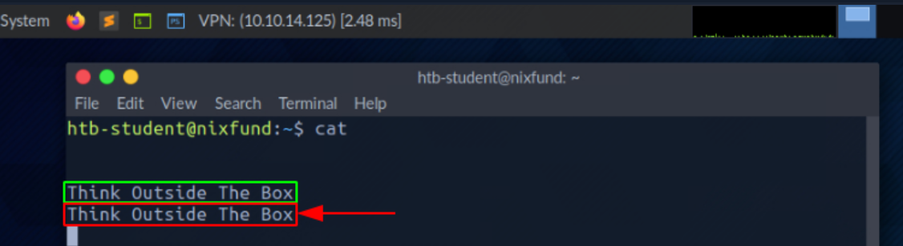

### 标准输出和标准错误

​	在下一个示例中，通过使用该`find`命令，我们将看到标准输出 ( `STDOUT - FD 1`) 标记为`green`和标准错误 ( `STDERR - FD 2`) 标记为红色。

```shell-session
vnswer77@htb[/htb]$ find /etc/ -name shadow
```

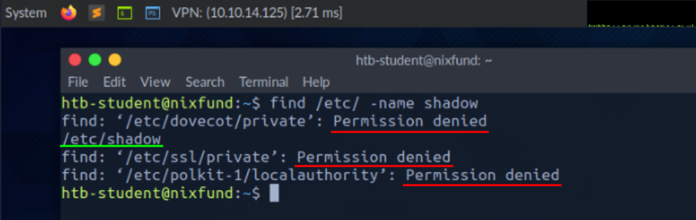

​	在这种情况下，错误被标记并显示为“ `Permission denied`”。我们可以通过将错误 () 的文件描述符重定向`FD 2 - STDERR`到“ `/dev/null`.”来检查这一点。这样，我们将产生的错误重定向到“空设备”，它会丢弃所有数据。

```shell-session
vnswer77@htb[/htb]$ find /etc/ -name shadow 2>/dev/null
```

### 将 STDOUT 重定向到文件

​	现在我们可以看到，`STDERR`之前以“ `Permission denied`”呈现的所有错误（）都不再显示了。我们现在看到的唯一结果是标准输出 ( `STDOUT`)，我们还可以将其重定向到一个文件，该文件的名称`results.txt`将只包含没有标准错误的标准输出。

```shell-session
vnswer77@htb[/htb]$ find /etc/ -name shadow 2>/dev/null > results.txt
```

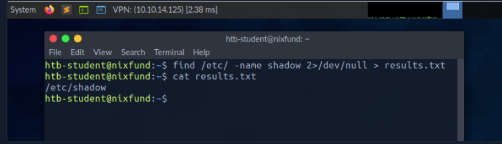

### 将 STDOUT 和 STDERR 重定向到单独的文件

`>`我们应该注意到，在上一个示例中，我们没有在大于号 ( ) 之前使用数字。那是因为我们之前将所有的标准错误都重定向到“ `null device`”，我们得到的唯一输出是标准输出（`FD 1 - STDOUT`）。为了更精确，我们将标准错误 ( `FD 2 - STDERR`) 和标准输出 ( `FD 1 - STDOUT`) 重定向到不同的文件。


```shell-session
vnswer77@htb[/htb]$ find /etc/ -name shadow 2> stderr.txt 1> stdout.txt
```

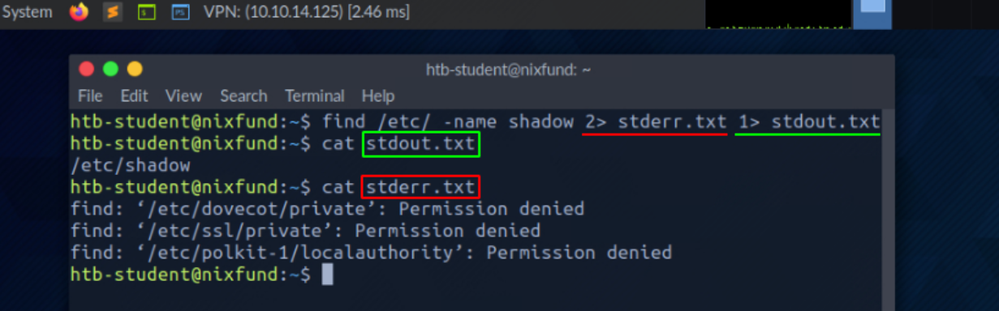

### 重定向标准输入

​	正如我们已经看到的，结合文件描述符，我们可以重定向错误并使用大于号 ( `>`) 输出。这也适用于小于号 ( `<`)。但是，低于号用作标准输入 ( `FD 0 - STDIN`)。这些字符可以看作是`direction`箭头形式的，告诉我们“ `from where`”和“ `where to`”数据应该被重定向。我们使用`cat`命令将文件“ `stdout.txt`”的内容用作`STDIN`.

```shell-session
vnswer77@htb[/htb]$ cat < stdout.txt
```

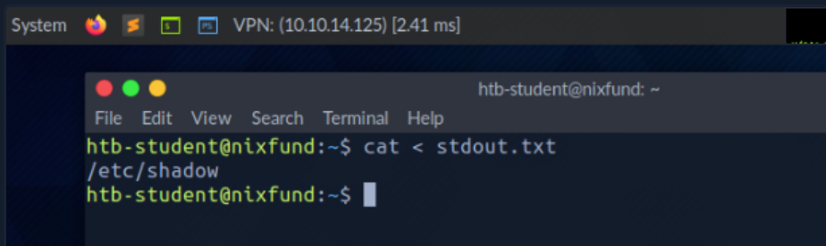

### 重定向 STDOUT 并附加到文件

当我们使用大于号 ( `>`) 来重定向我们的时`STDOUT`，如果新文件尚不存在，则会自动创建一个新文件。如果此文件存在，它将被覆盖而不要求确认。如果我们想附加`STDOUT`到我们现有的文件，我们可以使用双大于号 ( `>>`)。

```shell-session
vnswer77@htb[/htb]$ find /etc/ -name passwd >> stdout.txt 2>/dev/null
```

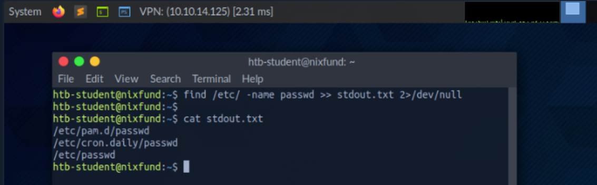

### 将 STDIN 流重定向到文件

我们还可以使用双下位字符 ( `<<`) 通过流添加我们的标准输入。我们可以使用Linux 系统文件的所谓`End-Of-File`( ) 函数，它定义了输入的结束。`EOF`在下一个示例中，我们将使用`cat`命令通过流读取我们的流输入并将其定向到名为“. `stream.txt`”的文件。

```shell-session
vnswer77@htb[/htb]$ cat << EOF > stream.txt
```

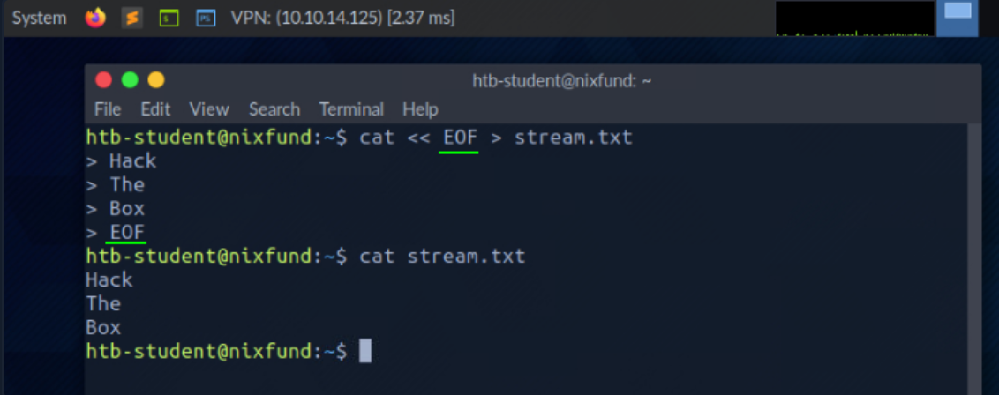

### 管道

重定向的另一种方法`STDOUT`是使用管道 ( `|`)。当我们想使用`STDOUT`来自一个程序的数据由另一个程序处理时，这些很有用。最常用的工具之一是`grep`，我们将在下一个示例中使用它。grep 用于`STDOUT`根据我们定义的模式进行过滤。在下一个例子中，我们使用`find`命令搜索“ `/etc/`”目录下所有`.conf`扩展名为“ ”的文件。任何错误都被重定向到“ `null device`”（`/dev/null`）。使用，我们筛选出结果并指定只应显示`grep`包含模式“ ”的行。`systemd`

```shell-session
vnswer77@htb[/htb]$ find /etc/ -name *.conf 2>/dev/null | grep systemd
```

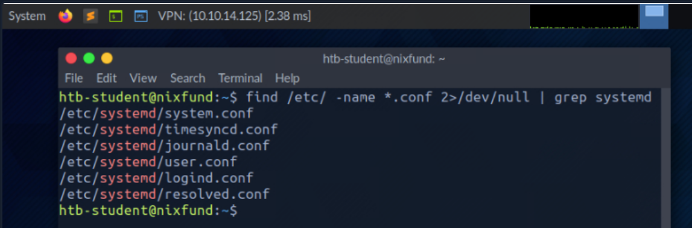

重定向有效，不止一次。我们可以使用获得的结果将它们重定向到另一个程序。对于下一个示例，我们将使用名为 的工具`wc`，它应该统计获得结果的总数。

```shell-session
vnswer77@htb[/htb]$ find /etc/ -name *.conf 2>/dev/null | grep systemd | wc -l
```

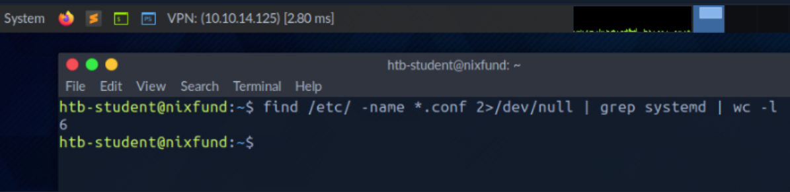

### 练习

目标系统上总共安装了多少个软件包？ 

dpkg -l | grep ^ii | wc -l

## 过滤内容

​	在上一节中，我们了解了可用于将结果从一个程序重定向到另一个程序以进行处理的重定向。要读取文件，我们不一定要为此使用编辑器。有两个工具称为`more`和`less`，它们非常相同。这些是`pagers`允许我们在交互式视图中滚动文件的基础。让我们看一些例子。

### more

```shell-session
vnswer77@htb[/htb]$ more /etc/passwd
```

​	我们读取内容using`cat`并重定向到后`more`，已经提到的`pager`打开，我们会自动从文件开头开始。

```shell-session
root:x:0:0:root:/root:/bin/bash
daemon:x:1:1:daemon:/usr/sbin:/usr/sbin/nologin
bin:x:2:2:bin:/bin:/usr/sbin/nologin
sys:x:3:3:sys:/dev:/usr/sbin/nologin
sync:x:4:65534:sync:/bin:/bin/sync
<SNIP>
--More--
```

​	有了`[Q]`钥匙，我们就可以离开这个了`pager`。我们会注意到输出保留在终端中。

### less

```shell-session
vnswer77@htb[/htb]$ less /etc/passwd
```

```shell-session
root:x:0:0:root:/root:/bin/bash
daemon:x:1:1:daemon:/usr/sbin:/usr/sbin/nologin
bin:x:2:2:bin:/bin:/usr/sbin/nologin
sys:x:3:3:sys:/dev:/usr/sbin/nologin
sync:x:4:65534:sync:/bin:/bin/sync
<SNIP>
:
```

`less`使用 键关闭时`[Q]`，我们会注意到我们看到的输出与 不同`more`，它不会保留在终端中。

### Head

有时我们只会对文件开头或结尾的特定问题感兴趣。如果我们只想获取`first`文件的行，我们可以使用工具`head`。默认情况下，`head`打印给定文件或输入的前十行，如果没有另外指定的话。

```shell-session
vnswer77@htb[/htb]$ head /etc/passwd

root:x:0:0:root:/root:/bin/bash
daemon:x:1:1:daemon:/usr/sbin:/usr/sbin/nologin
bin:x:2:2:bin:/bin:/usr/sbin/nologin
sys:x:3:3:sys:/dev:/usr/sbin/nologin
sync:x:4:65534:sync:/bin:/bin/sync
games:x:5:60:games:/usr/games:/usr/sbin/nologin
man:x:6:12:man:/var/cache/man:/usr/sbin/nologin
lp:x:7:7:lp:/var/spool/lpd:/usr/sbin/nologin
mail:x:8:8:mail:/var/mail:/usr/sbin/nologin
news:x:9:9:news:/var/spool/news:/usr/sbin/nologin
```

### Tail

`head`如果我们只想查看文件或结果的最后部分，我们可以使用called的对应项`tail`，它返回`last`十行。

```shell-session
vnswer77@htb[/htb]$ tail /etc/passwd

miredo:x:115:65534::/var/run/miredo:/usr/sbin/nologin
usbmux:x:116:46:usbmux daemon,,,:/var/lib/usbmux:/usr/sbin/nologin
rtkit:x:117:119:RealtimeKit,,,:/proc:/usr/sbin/nologin
nm-openvpn:x:118:120:NetworkManager OpenVPN,,,:/var/lib/openvpn/chroot:/usr/sbin/nologin
nm-openconnect:x:119:121:NetworkManager OpenConnect plugin,,,:/var/lib/NetworkManager:/usr/sbin/nologin
pulse:x:120:122:PulseAudio daemon,,,:/var/run/pulse:/usr/sbin/nologin
beef-xss:x:121:124::/var/lib/beef-xss:/usr/sbin/nologin
lightdm:x:122:125:Light Display Manager:/var/lib/lightdm:/bin/false
do-agent:x:998:998::/home/do-agent:/bin/false
user6:x:1000:1000:,,,:/home/user6:/bin/bash
```

### Sort

根据处理的结果和文件，很少对它们进行排序。通常需要按字母顺序或数字顺序对所需结果进行排序以获得更好的概览。为此，我们可以使用一个名为`sort`.

```shell-session
vnswer77@htb[/htb]$ cat /etc/passwd | sort

_apt:x:104:65534::/nonexistent:/usr/sbin/nologin
backup:x:34:34:backup:/var/backups:/usr/sbin/nologin
bin:x:2:2:bin:/bin:/usr/sbin/nologin
cry0l1t3:x:1001:1001::/home/cry0l1t3:/bin/bash
daemon:x:1:1:daemon:/usr/sbin:/usr/sbin/nologin
dnsmasq:x:107:65534:dnsmasq,,,:/var/lib/misc:/usr/sbin/nologin
dovecot:x:114:117:Dovecot mail server,,,:/usr/lib/dovecot:/usr/sbin/nologin
dovenull:x:115:118:Dovecot login user,,,:/nonexistent:/usr/sbin/nologin
ftp:x:113:65534::/srv/ftp:/usr/sbin/nologin
games:x:5:60:games:/usr/games:/usr/sbin/nologin
gnats:x:41:41:Gnats Bug-Reporting System (admin):/var/lib/gnats:/usr/sbin/nologin
htb-student:x:1002:1002::/home/htb-student:/bin/bash
<SNIP>
```

正如我们现在所见，输出不再以 root 开头，而是按字母顺序排序。

### Grep

​	更多时候，我们只会搜索包含我们定义的模式的特定结果。最常用的工具之一是`grep`，它提供了许多不同的功能。据此，我们可以搜索`/bin/bash`设置了默认shell“”的用户为例。

```shell-session
vnswer77@htb[/htb]$ cat /etc/passwd | grep "/bin/bash"

root:x:0:0:root:/root:/bin/bash
mrb3n:x:1000:1000:mrb3n:/home/mrb3n:/bin/bash
cry0l1t3:x:1001:1001::/home/cry0l1t3:/bin/bash
htb-student:x:1002:1002::/home/htb-student:/bin/bash
```

​	另一种可能性是排除特定结果。为此，选项“ `-v`”与 一起使用`grep`。在下一个示例中，我们排除所有禁用了名称为“ `/bin/false`”或“ `/usr/bin/nologin`”的标准 shell 的用户。

```shell-session
vnswer77@htb[/htb]$ cat /etc/passwd | grep -v "false\|nologin"

root:x:0:0:root:/root:/bin/bash
sync:x:4:65534:sync:/bin:/bin/sync
postgres:x:111:117:PostgreSQL administrator,,,:/var/lib/postgresql:/bin/bash
user6:x:1000:1000:,,,:/home/user6:/bin/bash
```

### Cut

具有不同字符的特定结果可以作为分隔符分隔。在这里了解如何删除特定的分隔符并在指定位置的一行中显示单词会很方便。可用于此的工具之一是`cut`. 因此，我们使用选项“ `-d`”并将分隔符设置为冒号字符 ( `:`)，并使用选项“ `-f`”定义我们要输出的行中的位置。

```shell-session
vnswer77@htb[/htb]$ cat /etc/passwd | grep -v "false\|nologin" | cut -d":" -f1

root
sync
mrb3n
cry0l1t3
htb-student
```

### Tr

用我们定义的字符替换一行中某些字符的另一种可能性是工具`tr`。作为第一个选项，我们定义要替换的字符，作为第二个选项，我们定义要替换的字符。在下一个示例中，我们将冒号字符替换为空格。

```shell-session
vnswer77@htb[/htb]$ cat /etc/passwd | grep -v "false\|nologin" | tr ":" " "

root x 0 0 root /root /bin/bash
sync x 4 65534 sync /bin /bin/sync
mrb3n x 1000 1000 mrb3n /home/mrb3n /bin/bash
cry0l1t3 x 1001 1001  /home/cry0l1t3 /bin/bash
htb-student x 1002 1002  /home/htb-student /bin/bash
```

### Column

由于此类结果的表示通常不清楚，因此该工具`column`非常适合使用“. `-t`”以表格形式显示此类结果。

### awk

我们可能已经注意到，用户“ `postgres`”的一行太多了。为了尽可能简单地整理出这样的结果，( `g`)`awk`编程是有益的，它允许我们显示该行的第一个 ( `$1`) 和最后一个 ( ) 结果。`$NF`

```shell-session
vnswer77@htb[/htb]$ cat /etc/passwd | grep -v "false\|nologin" | tr ":" " " | awk '{print $1, $NF}'

root /bin/bash
sync /bin/sync
mrb3n /bin/bash
cry0l1t3 /bin/bash
htb-student /bin/bash
```

### Sed

有时我们想要更改整个文件或标准输入中的特定名称。我们可以为此使用的工具之一是名为`sed`. 最常见的用途之一是替换文本。在这里，`sed`查找我们以正则表达式 (regex) 的形式定义的模式，并将它们替换为我们也定义的另一种模式。让我们坚持最后的结果，并假设我们想用“ `bin`”替换单词“ `HTB`”。

`s`开头的“ ”标志代表替换命令。然后我们指定要替换的模式。在斜杠 ( `/`) 之后，我们在第三个位置输入我们想要用作替换的模式。最后，我们使用“ `g`”标志，代表替换所有匹配项。

```shell-session
vnswer77@htb[/htb]$ cat /etc/passwd | grep -v "false\|nologin" | tr ":" " " | awk '{print $1, $NF}' | sed 's/bin/HTB/g'

root /HTB/bash
sync /HTB/sync
mrb3n /HTB/bash
cry0l1t3 /HTB/bash
htb-student /HTB/bash
```

### Wc

最后但并非最不重要的一点是，了解我们有多少成功匹配通常很有用。为避免手动计算行数或字符数，我们可以使用工具`wc`。使用“ `-l`”选项，我们指定只计算行数。

```shell-session
vnswer77@htb[/htb]$ cat /etc/passwd | grep -v "false\|nologin" | tr ":" " " | awk '{print $1, $NF}' | wc -l

5
```

### Practice

如果我们不熟悉这么多不同的工具及其功能，一开始可能会有点不知所措。花点时间试用这些工具。查看手册页 ( `man <tool>`) 或调用它的帮助 ( `<tool> -h`/ `<tool> --help`)。熟悉所有工具的最佳方法是练习。尝试尽可能多地使用它们，不久之后我们将能够直观地过滤很多东西。

这里有一些可选练习，我们可以使用这些练习来提高我们的过滤技能并更加熟悉终端和命令。我们需要使用的文件是`/etc/passwd`我们的文件`target`，我们可以使用上面显示的任何命令。我们的目标是仅过滤和显示特定内容。读取文件并以我们只能看到的方式过滤其内容：

|      |                                                              |
| ---- | ------------------------------------------------------------ |
| 1.   | 包含用户名的一行`cry0l1t3`。                                 |
| 2.   | 用户名。                                                     |
| 3.   | 用户名`cry0l1t3`和他的 UID。                                 |
| 4.   | `cry0l1t3`用逗号 ( ) 分隔的用户名和他的 UID `,`。            |
| 5.   | 用户名`cry0l1t3`、他的 UID 和设置的 shell，用逗号 ( `,`) 分隔。 |
| 6.   | 所有用户名及其 UID 和 set shell 由逗号 ( `,`) 分隔。         |
| 7.   | 所有用户名及其 UID 和 set shell 以逗号 ( ) 分隔，并排除包含or`,`的用户名。`nologin``false` |
| 8.   | 所有用户名及其 UID 和设置 shell 由逗号 ( ) 分隔，并排除包含和计算过滤输出的所有行的`,`用户名。`nologin` |

### 练习

有多少服务在所有接口上监听目标系统？（不在 localhost 和 IPv4 上）

```
netstat -ln4 | grep LISTEN | grep -v 127 | wc -l
```

​	确定 ProFTPd 服务器在哪个用户下运行。提交用户名作为答案。

​	从您的 Pwnbox（不是目标机器）使用 cURL 获取“https://www.inlanefreight.com”网站的源代码并过滤该域的所有唯一路径。提交这些路径的数量作为答案。	

```
curl https://www.inlanefreight.com/ | grep -Po "https://www.inlanefreight.com/[^'\"]*" | sort -u | wc -l
```

## 常用表达

正则表达式 ( `RegEx`) 是一种表达语言的艺术，用于在文本和文件中搜索模式。它们可用于查找和替换文本、分析数据、验证输入、执行搜索等。简单来说，它们是一个过滤条件，可以用来分析和操作字符串。它们以各种编程语言和程序提供，并以许多不同的方式和功能使用。

正则表达式是构成搜索模式的一系列字母和符号。此外，可以使用称为元字符的模式创建正则表达式。元字符是定义搜索模式但没有字面意义的符号。我们可以在`grep`或`sed`或其他工具中使用它。正则表达式通常在 Web 应用程序中实现以验证用户输入。

## 分组

除此之外，正则表达式为我们提供了对所需搜索模式进行分组的可能性。基本上，正则表达式遵循三个不同的概念，它们由三个不同的括号区分：

### 分组运算符

|      | **运营商** | **描述**                                                     |
| ---- | ---------- | ------------------------------------------------------------ |
| 1个  | `(a)`      | 圆括号用于对正则表达式的各个部分进行分组。在括号内，您可以定义应一起处理的更多模式。 |
| 2个  | `[a-z]`    | 方括号用于定义字符类。在方括号内，您可以指定要搜索的字符列表。 |
| 3个  | `{1,10}`   | 大括号用于定义量词。在方括号内，您可以指定一个数字或一个范围来指示应重复先前模式的频率。 |
| 4个  | `|`        | 也称为 OR 运算符，并在两个表达式之一匹配时显示结果           |
| 5个  | `.*`       | 也称为 AND 运算符，仅当两个表达式匹配时才显示结果            |

假设我们使用`OR`运算符。正则表达式搜索给定的搜索参数之一。在下一个示例中，我们搜索包含单词`my`or的行`false`。要使用这些运算符，您需要使用`-E`grep 中的选项应用扩展的正则表达式。

### 或运算符

 或运算符

```shell-session
cry0l1t3@htb:~$ grep -E "(my|false)" /etc/passwd

lxd:x:105:65534::/var/lib/lxd/:/bin/false
pollinate:x:109:1::/var/cache/pollinate:/bin/false
mysql:x:116:120:MySQL Server,,:/nonexistent:/bin/false
```

由于两个搜索参数之一总是出现在三行中，因此所有三行都会相应显示。但是，如果我们使用`AND`运算符，对于相同的搜索参数，我们将得到不同的结果。

### AND 运算符

```shell-session
cry0l1t3@htb:~$ grep -E "(my.*false)" /etc/passwd

mysql:x:116:120:MySQL Server,,:/nonexistent:/bin/false
```

基本上，我们用这个命令说的是我们正在寻找一条我们希望同时看到`my`和 的行`false`。一个简化的例子也是使用`grep`两次，看起来像这样：


```shell-session
cry0l1t3@htb:~$ grep -E "my" /etc/passwd | grep -E "false"

mysql:x:116:120:MySQL Server,,:/nonexistent:/bin/false
```

​	这里有一些练习正则表达式的可选任务，可以帮助我们更好、更有效地处理它。`/etc/ssh/sshd_config`对于所有练习，我们将在我们的实例上使用该文件`Pwnbox`。

|      |                                                 |
| ---- | ----------------------------------------------- |
| 1个  | 显示所有不包含该`#`字符的行。                   |
| 2个  | 搜索包含以 开头的单词的所有行`Permit`。         |
| 3个  | 搜索所有包含以 结尾的单词的行`Authentication`。 |
| 4个  | 搜索包含单词 的所有行`Key`。                    |
| 5个  | 搜索以 开头`Password`并包含 的所有行`yes`。     |
| 6个  | 搜索以 结尾的所有行`yes`。                      |

## 权限管理

​	在 Linux 下，权限被分配给用户和组。每个用户都可以是不同组的成员，这些组中的成员身份赋予用户特定的附加权限。每个文件和目录都属于特定用户和特定组。因此，定义文件的用户和组的权限也为各自的所有者定义。当我们创建新文件或目录时，它们属于我们所属的组和我们。

当用户想要访问Linux目录的内容时，首先要遍历该目录，也就是导航到该目录，要求用户对该目录有`execute`权限。如果没有此权限，用户将无法访问目录的内容，而是会显示一条“ `Permission Denied`”错误消息。

```shell-session
cry0l1t3@htb[/htb]$ ls -l

drw-rw-r-- 3 cry0l1t3 cry0l1t3   4096 Jan 12 12:30 scripts


cry0l1t3@htb[/htb]$ ls -al mydirectory/

ls: cannot access 'mydirectory/script.sh': Permission denied
ls: cannot access 'mydirectory/..': Permission denied
ls: cannot access 'mydirectory/subdirectory': Permission denied
ls: cannot access 'mydirectory/.': Permission denied
total 0
d????????? ? ? ? ?            ? .
d????????? ? ? ? ?            ? ..
-????????? ? ? ? ?            ? script.sh
d????????? ? ? ? ?            ? subdirectory
```

​	重要的是要注意，`execute`无论用户的访问级别如何，遍历目录都需要权限。此外，`execute`对目录的权限不允许用户执行或修改目录内的任何文件或内容，只能遍历和访问目录的内容。

要执行目录中的文件，用户需要对`execute`相应文件的权限。要修改目录的内容（创建、删除或重命名文件和子目录），用户需要`write`该目录的权限。

Linux 系统上的整个权限系统基于八进制数系统，基本上，可以为文件或目录分配三种不同类型的权限：

- ( `r`) - 阅读
- ( `w`) - 写
- ( `x`) - 执行

`owner`可以为下一个示例中显示的、`group`等设置权限`others`及其相应的权限。

```shell-session
cry0l1t3@htb[/htb]$ ls -l /etc/passwd

- rwx rw- r--   1 root root 1641 May  4 23:42 /etc/passwd
- --- --- ---   |  |    |    |   |__________|
|  |   |   |    |  |    |    |        |_ Date
|  |   |   |    |  |    |    |__________ File Size
|  |   |   |    |  |    |_______________ Group
|  |   |   |    |  |____________________ User
|  |   |   |    |_______________________ Number of hard links
|  |   |   |_ Permission of others (read)
|  |   |_____ Permissions of the group (read, write)
|  |_________ Permissions of the owner (read, write, execute)
|____________ File type (- = File, d = Directory, l = Link, ... )
```

### 更改权限

我们可以使用`chmod`命令、权限组引用（`u`-owner、`g`-Group、`o`-others、`a`-All users）和 [ `+`] 或 [ `-`] 来修改权限，以添加删除指定的权限。在以下示例中，用户创建了一个新的 shell 脚本，该脚本归该用户所有，不可执行，并为所有用户设置了读/写权限。

 

```shell-session
cry0l1t3@htb[/htb]$ ls -l shell

-rwxr-x--x   1 cry0l1t3 htbteam 0 May  4 22:12 shell
```

然后我们可以`read`为所有用户申请权限并查看结果。

 

```shell-session
cry0l1t3@htb[/htb]$ chmod a+r shell && ls -l shell

-rwxr-xr-x   1 cry0l1t3 htbteam 0 May  4 22:12 shell
```

我们还可以将所有其他用户的权限设置为`read`仅使用八进制值分配。

 

```shell-session
cry0l1t3@htb[/htb]$ chmod 754 shell && ls -l shell

-rwxr-xr--   1 cry0l1t3 htbteam 0 May  4 22:12 shell
```

让我们看看与之相关的所有表示，以更好地理解权限分配是如何计算的。

 

```shell-session
Binary Notation:                4 2 1  |  4 2 1  |  4 2 1
----------------------------------------------------------
Binary Representation:          1 1 1  |  1 0 1  |  1 0 0
----------------------------------------------------------
Octal Value:                      7    |    5    |    4
----------------------------------------------------------
Permission Representation:      r w x  |  r - x  |  r - -
```

如果我们将分配`Binary Representation`给值的集合位加`Binary Notation`在一起，我们得到`Octal Value`. 表示用三个字符`Permission Representation`设置的位，只识别设置的权限比较容易。`Binary Representation`

### 更改所有者

要更改文件或目录的所有者和/或组分配，我们可以使用命令`chown`。语法如下：

### 语法 - chown

 语法 - chown

```shell-session
cry0l1t3@htb[/htb]$ chown <user>:<group> <file/directory>
```

在此示例中，“shell”可以替换为任意文件或文件夹。

 语法 - chown

```shell-session
cry0l1t3@htb[/htb]$ chown root:root shell && ls -l shell

-rwxr-xr--   1 root root 0 May  4 22:12 shell
```

### SUID 和 SGID

`Set User ID`除了分配直接用户和组权限外，我们还可以通过设置( `SUID`) 和`Set Group ID`( `SGID`) 位来为文件配置特殊权限。例如，这些`SUID`/位允许用户以另一个用户的权限运行程序。`SGID`管理员经常使用它来授予他们的用户对某些应用程序或文件的特殊权限。使用字母“ `s`”代替“ `x`”。执行此类程序时，将使用文件所有者的 SUID/SGID。

经常出现管理员对应用程序不熟悉，仍然分配SUID/SGID位的情况，安全风险很高。这样的程序可能包含允许从寻呼机执行 shell 的函数，例如应用程序“ `journalctl`.”。

如果管理员将 SUID 位设置为“ `journalctl`”，则任何有权访问此应用程序的用户都可以作为`root`. 有关此应用程序和其他此类应用程序的更多信息，请访问[GTFObins](https://gtfobins.github.io/gtfobins/journalctl/)。

### 粘性位

粘滞位是 Linux 中的一种文件权限，可以在目录上设置。在控制目录中文件的删除和重命名时，这种类型的权限提供了额外的安全层。它通常用于多个用户共享的目录，以防止一个用户意外删除或重命名对其他人很重要的文件。

例如，在共享主目录中，多个用户可以访问同一个目录，系统管理员可以在目录上设置粘滞位，以确保只有文件所有者、目录所有者或 root 用户可以删除或重命名目录中的文件。这意味着其他用户无法删除或重命名目录中的文件，因为他们没有所需的权限。这提供了一个额外的安全层来保护重要文件，因为只有那些具有必要访问权限的人才能删除或重命名文件。在目录上设置粘滞位可确保只有所有者、目录所有者或 root 用户才能更改目录中的文件。

`t`当目录设置了sticky bit时，在目录权限的执行权限中用字母“ ”表示。例如，如果目录有权限“ `rwxrwxrwt`”，则表示设置了sticky bit，给予额外的安全级别，以便所有者或根用户以外的任何人都不能删除或重命名目录中的文件或文件夹。

 语法 - chown

```shell-session
cry0l1t3@htb[/htb]$ ls -l

drw-rw-r-t 3 cry0l1t3 cry0l1t3   4096 Jan 12 12:30 scripts
drw-rw-r-T 3 cry0l1t3 cry0l1t3   4096 Jan 12 12:32 reports
```

在此示例中，我们看到两个目录都设置了粘滞位。但是，`reports`文件夹有大写的`T`，`scripts`文件夹有小写的`t`。

如果粘滞位是大写的 ( `T`)，则这意味着所有其他用户没有`execute`( `x`) 权限，因此无法看到该文件夹的内容，也无法从中运行任何程序。小写粘滞位 ( ) 是已设置( ) 权限的`t`粘滞位。`execute``x`

## 用户管理

​	用户管理是 Linux 管理的重要组成部分。有时我们需要创建新用户或将其他用户添加到特定组。另一种可能性是以不同的用户身份执行命令。毕竟，只有一个特定组的用户具有查看或编辑特定文件或目录的权限的情况并不少见。反过来，这使我们能够在机器本地收集更多信息，这可能非常重要。让我们看一下以下示例，了解如何以不同的用户身份执行代码。

### 作为用户执行

 作为用户执行

```shell-session
vnswer77@htb[/htb]$ cat /etc/shadow

cat: /etc/shadow: Permission denied
```

### 以root身份执行

 以root身份执行

```shell-session
vnswer77@htb[/htb]$ sudo cat /etc/shadow

root:<SNIP>:18395:0:99999:7:::
daemon:*:17737:0:99999:7:::
bin:*:17737:0:99999:7:::
<SNIP>
```

这是一个列表，可以帮助我们更好地理解和处理用户管理。

| **命令**   | **描述**                                                     |
| ---------- | ------------------------------------------------------------ |
| `sudo`     | 以不同的用户身份执行命令。                                   |
| `su`       | 该`su`实用程序通过 PAM 请求适当的用户凭证并切换到该用户 ID（默认用户是超级用户）。然后执行 shell。 |
| `useradd`  | 创建新用户或更新默认的新用户信息。                           |
| `userdel`  | 删除用户帐户和相关文件。                                     |
| `usermod`  | 修改用户帐户。                                               |
| `addgroup` | 向系统添加一个组。                                           |
| `delgroup` | 从系统中删除一个组。                                         |
| `passwd`   | 更改用户密码。                                               |

用户管理在任何操作系统中都是必不可少的，熟悉它的最佳方法是尝试将各个命令与它们的各种选项结合使用。

## 包裹管理

无论是作为系统管理员工作、在家中维护我们自己的 Linux 机器，还是构建/升级/维护我们选择的渗透测试发行版，牢牢掌握可用的 Linux 包管理器以及利用它们的各种方法都是至关重要的安装、更新或删除软件包。包是包含软件二进制文件、配置文件、有关依赖项的信息并跟踪更新和升级的档案。大多数包管理系统提供的功能是：

- 包下载
- 依赖解析
- 标准的二进制包格式
- 常见的安装和配置位置
- 额外的系统相关配置和功能
- 质量控制

我们可以使用许多不同的包管理系统，涵盖不同类型的文件，如“.deb”、“.rpm”等。包管理要求是要安装的软件作为相应的包可用。通常，这是在 Linux 发行版下集中创建、提供和维护的。这样，软件直接集成到系统中，其各个目录分布在整个系统中。包管理软件对系统安装包的更改取自包并由包管理软件执行。如果软件包管理软件识别出还需要额外的软件包才能使尚未安装的软件包正常运行，

如果已安装的软件已被删除，则包管理系统会重新获取包的信息，根据其配置对其进行修改，并删除文件。为此，我们可以使用不同的包管理程序。以下是此类程序的示例列表：

| **命令**   | **描述**                                                     |
| ---------- | ------------------------------------------------------------ |
| `dpkg`     | 这`dpkg`是一个用于安装、构建、删除和管理 Debian 软件包的工具。`dpkg`aptitude的主要和更用户友好的前端。 |
| `apt`      | Apt 为包管理系统提供了一个高级命令行界面。                   |
| `aptitude` | Aptitude 是 apt 的替代品，是包管理器的高级接口。             |
| `snap`     | 安装、配置、刷新和删除快照包。Snaps 可以安全地分发适用于云、服务器、桌面和物联网的最新应用程序和实用程序。 |
| `gem`      | Gem 是 RubyGems 的前端，Ruby 的标准包管理器。                |
| `pip`      | Pip 是一个 Python 包安装程序，推荐用于安装 Debian 存档中不可用的 Python 包。它可以与版本控制存储库（目前只有 Git、Mercurial 和 Bazaar 存储库）一起工作，大量记录输出，并通过在开始安装之前下载所有需求来防止部分安装。 |
| `git`      | Git 是一个快速、可扩展的分布式版本控制系统，具有异常丰富的命令集，可提供高级操作和对内部的完全访问。 |

强烈建议在本地设置我们的虚拟机 (VM) 来进行试验。让我们在本地 VM 中进行一些试验，并使用一些额外的包对其进行扩展。首先，让我们`git`使用`apt`.

### 高级包管理器 (APT)

基于 Debian 的 Linux 发行版使用`APT`包管理器。包是包含多个“.deb”文件的存档文件。该`dpkg`实用程序用于从关联的“.deb”文件安装程序。`APT`使更新和安装程序更容易，因为许多程序都有依赖性。从独立的“.deb”文件安装程序时，我们可能会遇到依赖性问题，需要下载并安装一个或多个附加包。`APT`通过将安装程序所需的所有依赖项打包在一起，可以更轻松、更高效地进行安装。

每个 Linux 发行版都使用经常更新的软件存储库。当我们更新程序或安装新程序时，系统会在这些存储库中查询所需的包。存储库可以标记为稳定、测试或不稳定。大多数 Linux 发行版都使用最稳定或“主要”的存储库。这可以通过查看文件的内容来检查`/etc/apt/sources.list`。Parrot OS 的存储库列表位于`/etc/apt/sources.list.d/parrot.list`。

 高级包管理器 (APT)

```shell-session
vnswer77@htb[/htb]$ cat /etc/apt/sources.list.d/parrot.list

# parrot repository
# this file was automatically generated by parrot-mirror-selector
deb http://htb.deb.parrot.sh/parrot/ rolling main contrib non-free
#deb-src https://deb.parrot.sh/parrot/ rolling main contrib non-free
deb http://htb.deb.parrot.sh/parrot/ rolling-security main contrib non-free
#deb-src https://deb.parrot.sh/parrot/ rolling-security main contrib non-free
```

APT 使用称为 APT 缓存的数据库。这用于提供有关离线安装在我们系统上的软件包的信息。例如，我们可以搜索 APT 缓存来查找所有`Impacket`相关包。

 高级包管理器 (APT)

```shell-session
vnswer77@htb[/htb]$ apt-cache search impacket

impacket-scripts - Links to useful impacket scripts examples
polenum - Extracts the password policy from a Windows system
python-pcapy - Python interface to the libpcap packet capture library (Python 2)
python3-impacket - Python3 module to easily build and dissect network protocols
python3-pcapy - Python interface to the libpcap packet capture library (Python 3)
```

然后我们可以查看有关包的其他信息。

 高级包管理器 (APT)

```shell-session
vnswer77@htb[/htb]$ apt-cache show impacket-scripts

Package: impacket-scripts
Version: 1.4
Architecture: all
Maintainer: Kali Developers <devel@kali.org>
Installed-Size: 13
Depends: python3-impacket (>= 0.9.20), python3-ldap3 (>= 2.5.0), python3-ldapdomaindump
Breaks: python-impacket (<< 0.9.18)
Replaces: python-impacket (<< 0.9.18)
Priority: optional
Section: misc
Filename: pool/main/i/impacket-scripts/impacket-scripts_1.4_all.deb
Size: 2080
<SNIP>
```

我们还可以列出所有已安装的包。

 高级包管理器 (APT)

```shell-session
vnswer77@htb[/htb]$ apt list --installed

Listing... Done
accountsservice/rolling,now 0.6.55-2 amd64 [installed,automatic]
adapta-gtk-theme/rolling,now 3.95.0.11-1 all [installed]
adduser/rolling,now 3.118 all [installed]
adwaita-icon-theme/rolling,now 3.36.1-2 all [installed,automatic]
aircrack-ng/rolling,now 1:1.6-4 amd64 [installed,automatic]
<SNIP>
```

如果我们缺少一些包，我们可以搜索它并使用以下命令安装它。

 高级包管理器 (APT)

```shell-session
vnswer77@htb[/htb]$ sudo apt install impacket-scripts -y

Reading package lists... Done
Building dependency tree       
Reading state information... Done
The following NEW packages will be installed:
  impacket-scripts
0 upgraded, 1 newly installed, 0 to remove and 0 not upgraded.
Need to get 2,080 B of archives.
After this operation, 13.3 kB of additional disk space will be used.
Get:1 https://euro2-emea-mirror.parrot.sh/mirrors/parrot rolling/main amd64 impacket-scripts all 1.4 [2,080 B]
Fetched 2,080 B in 0s (15.2 kB/s)
Selecting previously unselected package impacket-scripts.
(Reading database ... 378459 files and directories currently installed.)
Preparing to unpack .../impacket-scripts_1.4_all.deb ...
Unpacking impacket-scripts (1.4) ...
Setting up impacket-scripts (1.4) ...
Scanning application launchers
Removing duplicate launchers from Debian
Launchers are updated
```

### GIT

现在我们已经`git`安装好了，我们可以使用它从 Github 下载有用的工具。其中一个这样的项目叫做“尼尚”。稍后我们将处理和处理项目本身。首先，我们需要导航到[项目的存储库](https://github.com/samratashok/nishang)并复制 Github 链接，然后再使用 git 下载它。

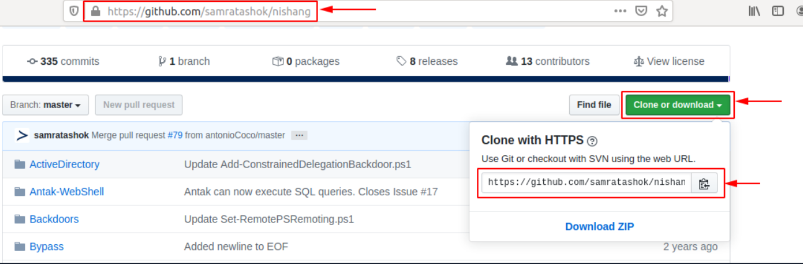

尽管如此，在我们下载项目及其脚本和列表之前，我们应该创建一个特定的文件夹。

 高级包管理器 (APT)

```shell-session
vnswer77@htb[/htb]$ mkdir ~/nishang/ && git clone https://github.com/samratashok/nishang.git ~/nishang

Cloning into '/opt/nishang/'...
remote: Enumerating objects: 15, done.
remote: Counting objects: 100% (15/15), done.
remote: Compressing objects: 100% (13/13), done.
remote: Total 1691 (delta 4), reused 6 (delta 2), pack-reused 1676
Receiving objects: 100% (1691/1691), 7.84 MiB | 4.86 MiB/s, done.
Resolving deltas: 100% (1055/1055), done.
```

### DPKG

我们也可以单独从存储库下载程序和工具。在此示例中，我们为 Ubuntu 18.04 LTS 下载“strace”。

 高级包管理器 (APT)

```shell-session
vnswer77@htb[/htb]$ wget http://archive.ubuntu.com/ubuntu/pool/main/s/strace/strace_4.21-1ubuntu1_amd64.deb

--2020-05-15 03:27:17--  http://archive.ubuntu.com/ubuntu/pool/main/s/strace/strace_4.21-1ubuntu1_amd64.deb
Resolving archive.ubuntu.com (archive.ubuntu.com)... 91.189.88.142, 91.189.88.152, 2001:67c:1562::18, ...
Connecting to archive.ubuntu.com (archive.ubuntu.com)|91.189.88.142|:80... connected.
HTTP request sent, awaiting response... 200 OK
Length: 333388 (326K) [application/x-debian-package]
Saving to: ‘strace_4.21-1ubuntu1_amd64.deb’

strace_4.21-1ubuntu1_amd64.deb       100%[===================================================================>] 325,57K  --.-KB/s    in 0,1s    

2020-05-15 03:27:18 (2,69 MB/s) - ‘strace_4.21-1ubuntu1_amd64.deb’ saved [333388/333388]
```

此外，现在我们可以同时使用`apt`和`dpkg`来安装包。由于我们已经使用，我们将在下一个示例中`apt`转向。`dpkg`

 高级包管理器 (APT)

```shell-session
vnswer77@htb[/htb]$ sudo dpkg -i strace_4.21-1ubuntu1_amd64.deb 

(Reading database ... 154680 files and directories currently installed.)
Preparing to unpack strace_4.21-1ubuntu1_amd64.deb ...
Unpacking strace (4.21-1ubuntu1) over (4.21-1ubuntu1) ...
Setting up strace (4.21-1ubuntu1) ...
Processing triggers for man-db (2.8.3-2ubuntu0.1) ...
```

有了这个，我们已经安装了该工具，可以测试它是否正常工作。

 高级包管理器 (APT)

```shell-session
vnswer77@htb[/htb]$ strace -h

usage: strace [-CdffhiqrtttTvVwxxy] [-I n] [-e expr]...
              [-a column] [-o file] [-s strsize] [-P path]...
              -p pid... / [-D] [-E var=val]... [-u username] PROG [ARGS]
   or: strace -c[dfw] [-I n] [-e expr]... [-O overhead] [-S sortby]
              -p pid... / [-D] [-E var=val]... [-u username] PROG [ARGS]

Output format:
  -a column      alignment COLUMN for printing syscall results (default 40)
  -i             print instruction pointer at time of syscall
```

## 服务和流程管理

一般而言，有两种类型的服务：内部服务，系统启动时需要的相关服务，例如执行与硬件相关的任务，以及用户安装的服务，通常包括所有服务器服务。此类服务在后台运行，无需任何用户交互。这些也被称为并由程序名称末尾的`daemons`字母“”标识，例如，或。`d``sshd``systemd`

大多数 Linux 发行版现在已经切换到`systemd`. 该守护进程`Init process`首先启动，因此其进程 ID (PID) 为 1。该守护进程监视并负责其他服务的有序启动和停止。`/proc/`所有进程都有一个分配的 PID，可以在相应的编号下查看。这样的进程可以有一个父进程 ID (PPID)，如果有，则称为子进程。

此外`systemctl`我们还可以使用它`update-rc.d`来管理 SysV init 脚本链接。让我们看一些例子。`OpenSSH`我们将在这些示例中使用服务器。如果我们没有安装它，请在继续本节之前安装它。

### 系统控制

在我们的 VM 上安装后`OpenSSH`，我们可以使用以下命令启动该服务。

```shell-session
vnswer77@htb[/htb]$ systemctl start ssh
```

启动服务后，我们现在可以检查它是否运行无误。

```shell-session
vnswer77@htb[/htb]$ systemctl status ssh

● ssh.service - OpenBSD Secure Shell server
   Loaded: loaded (/lib/systemd/system/ssh.service; enabled; vendor preset: enabled)
   Active: active (running) since Thu 2020-05-14 15:08:23 CEST; 24h ago
   Main PID: 846 (sshd)
   Tasks: 1 (limit: 4681)
   CGroup: /system.slice/ssh.service
           └─846 /usr/sbin/sshd -D

Mai 14 15:08:22 inlane systemd[1]: Starting OpenBSD Secure Shell server...
Mai 14 15:08:23 inlane sshd[846]: Server listening on 0.0.0.0 port 22.
Mai 14 15:08:23 inlane sshd[846]: Server listening on :: port 22.
Mai 14 15:08:23 inlane systemd[1]: Started OpenBSD Secure Shell server.
Mai 14 15:08:30 inlane systemd[1]: Reloading OpenBSD Secure Shell server.
Mai 14 15:08:31 inlane sshd[846]: Received SIGHUP; restarting.
Mai 14 15:08:31 inlane sshd[846]: Server listening on 0.0.0.0 port 22.
Mai 14 15:08:31 inlane sshd[846]: Server listening on :: port 22.
```

​	要将 OpenSSH 添加到 SysV 脚本中以告诉系统在启动后运行此服务，我们可以使用以下命令将其链接：

```shell-session
vnswer77@htb[/htb]$ systemctl enable ssh

Synchronizing state of ssh.service with SysV service script with /lib/systemd/systemd-sysv-install.
Executing: /lib/systemd/systemd-sysv-install enable ssh
```

一旦我们重新启动系统，OpenSSH 服务器将自动运行。我们可以使用一个名为`ps`.

```shell-session
vnswer77@htb[/htb]$ ps -aux | grep ssh

root       846  0.0  0.1  72300  5660 ?        Ss   Mai14   0:00 /usr/sbin/sshd -D
```

我们也可以用来`systemctl`列出所有服务。

```shell-session
vnswer77@htb[/htb]$ systemctl list-units --type=service

UNIT                                                       LOAD   ACTIVE SUB     DESCRIPTION              
accounts-daemon.service                                    loaded active running Accounts Service         
acpid.service                                              loaded active running ACPI event daemon        
apache2.service                                            loaded active running The Apache HTTP Server   
apparmor.service                                           loaded active exited  AppArmor initialization  
apport.service                                             loaded active exited  LSB: automatic crash repor
avahi-daemon.service                                       loaded active running Avahi mDNS/DNS-SD Stack  
bolt.service                                               loaded active running Thunderbolt system service
```

​	服务很可能由于错误而未启动。要查看问题，我们可以使用该工具`journalctl`查看日志。

```shell-session
vnswer77@htb[/htb]$ journalctl -u ssh.service --no-pager

-- Logs begin at Wed 2020-05-13 17:30:52 CEST, end at Fri 2020-05-15 16:00:14 CEST. --
Mai 13 20:38:44 inlane systemd[1]: Starting OpenBSD Secure Shell server...
Mai 13 20:38:44 inlane sshd[2722]: Server listening on 0.0.0.0 port 22.
Mai 13 20:38:44 inlane sshd[2722]: Server listening on :: port 22.
Mai 13 20:38:44 inlane systemd[1]: Started OpenBSD Secure Shell server.
Mai 13 20:39:06 inlane sshd[3939]: Connection closed by 10.22.2.1 port 36444 [preauth]
Mai 13 20:39:27 inlane sshd[3942]: Accepted password for master from 10.22.2.1 port 36452 ssh2
Mai 13 20:39:27 inlane sshd[3942]: pam_unix(sshd:session): session opened for user master by (uid=0)
Mai 13 20:39:28 inlane sshd[3942]: pam_unix(sshd:session): session closed for user master
Mai 14 02:04:49 inlane sshd[2722]: Received signal 15; terminating.
Mai 14 02:04:49 inlane systemd[1]: Stopping OpenBSD Secure Shell server...
Mai 14 02:04:49 inlane systemd[1]: Stopped OpenBSD Secure Shell server.
-- Reboot --
```

### 杀死进程

进程可以处于以下状态：

- runing
- 等待（等待事件或系统资源）
- 停止
- Zombie（已停止但在进程表中仍有一个条目）。

可以使用`kill`、`pkill`、`pgrep`和来控制流程`killall`。要与进程交互，我们必须向它发送信号。我们可以使用以下命令查看所有信号：

 

```shell-session
vnswer77@htb[/htb]$ kill -l

 1) SIGHUP       2) SIGINT       3) SIGQUIT      4) SIGILL       5) SIGTRAP
 6) SIGABRT      7) SIGBUS       8) SIGFPE       9) SIGKILL     10) SIGUSR1
11) SIGSEGV     12) SIGUSR2     13) SIGPIPE     14) SIGALRM     15) SIGTERM
16) SIGSTKFLT   17) SIGCHLD     18) SIGCONT     19) SIGSTOP     20) SIGTSTP
21) SIGTTIN     22) SIGTTOU     23) SIGURG      24) SIGXCPU     25) SIGXFSZ
26) SIGVTALRM   27) SIGPROF     28) SIGWINCH    29) SIGIO       30) SIGPWR
31) SIGSYS      34) SIGRTMIN    35) SIGRTMIN+1  36) SIGRTMIN+2  37) SIGRTMIN+3
38) SIGRTMIN+4  39) SIGRTMIN+5  40) SIGRTMIN+6  41) SIGRTMIN+7  42) SIGRTMIN+8
43) SIGRTMIN+9  44) SIGRTMIN+10 45) SIGRTMIN+11 46) SIGRTMIN+12 47) SIGRTMIN+13
48) SIGRTMIN+14 49) SIGRTMIN+15 50) SIGRTMAX-14 51) SIGRTMAX-13 52) SIGRTMAX-12
53) SIGRTMAX-11 54) SIGRTMAX-10 55) SIGRTMAX-9  56) SIGRTMAX-8  57) SIGRTMAX-7
58) SIGRTMAX-6  59) SIGRTMAX-5  60) SIGRTMAX-4  61) SIGRTMAX-3  62) SIGRTMAX-2
63) SIGRTMAX-1  64) SIGRTMAX
```

最常用的是：

| **信号** | **描述**                                                     |
| -------- | ------------------------------------------------------------ |
| `1`      | `SIGHUP`- 当控制它的终端关闭时，它被发送到一个进程。         |
| `2`      | `SIGINT`- 当用户`[Ctrl] + C`在控制终端中按下以中断进程时发送。 |
| `3`      | `SIGQUIT`- 当用户按下`[Ctrl] + D`退出时发送。                |
| `9`      | `SIGKILL`- 立即终止一个没有清理操作的进程。                  |
| `15`     | `SIGTERM`- 程序终止。                                        |
| `19`     | `SIGSTOP`- 停止程序。不能再处理了。                          |
| `20`     | `SIGTSTP`- 当用户按下`[Ctrl] + Z`请求暂停服务时发送。用户可以事后处理。 |

例如，如果一个程序要冻结，我们可以用下面的命令强制杀死它：

```shell-session
vnswer77@htb[/htb]$ kill 9 <PID> 
```

### 后台进程

有时需要将我们刚刚启动的扫描或进程放在后台继续使用当前会话与系统交互或启动其他进程。正如我们已经看到的，我们可以使用快捷方式来做到这一点`[Ctrl + Z]`。如上所述，我们将`SIGTSTP`信号发送给内核，内核会暂停进程。

```shell-session
vnswer77@htb[/htb]$ ping -c 10 www.hackthebox.eu

vnswer77@htb[/htb]$ vim tmpfile
[Ctrl + Z]
[2]+  Stopped                 vim tmpfile
```

现在可以使用以下命令显示所有后台进程。

```shell-session
vnswer77@htb[/htb]$ jobs

[1]+  Stopped                 ping -c 10 www.hackthebox.eu
[2]+  Stopped                 vim tmpfile
```

快捷方式`[Ctrl] + Z`暂停进程，它们将不会被进一步执行。为了让它在后台运行，我们必须输入命令`bg`将进程置于后台。

```shell-session
vnswer77@htb[/htb]$ bg

vnswer77@htb[/htb]$ 
--- www.hackthebox.eu ping statistics ---
10 packets transmitted, 0 received, 100% packet loss, time 113482ms

[ENTER]
[1]+  Exit 1                  ping -c 10 www.hackthebox.eu
```

`&`另一种选择是在命令末尾使用 AND 符号 ( ) 自动设置进程。

```shell-session
vnswer77@htb[/htb]$ ping -c 10 www.hackthebox.eu &

[1] 10825
PING www.hackthebox.eu (172.67.1.1) 56(84) bytes of data.
```

过程完成后，我们将看到结果。

```shell-session
vnswer77@htb[/htb]$ 

--- www.hackthebox.eu ping statistics ---
10 packets transmitted, 0 received, 100% packet loss, time 9210ms

[ENTER]
[1]+  Exit 1                  ping -c 10 www.hackthebox.eu
```

### 前台进程

​	之后，我们可以使用`jobs`命令列出所有后台进程。后台进程不需要用户交互，我们可以使用相同的 shell 会话，而无需等到进程先完成。一旦扫描或进程完成其工作，终端将通知我们该进程已完成。

```shell-session
vnswer77@htb[/htb]$ jobs

[1]+  Running                 ping -c 10 www.hackthebox.eu &
```

​	如果我们想把后台进程调到前台再与之交互，可以使用命令`fg <ID>`。

```shell-session
vnswer77@htb[/htb]$ fg 1
ping -c 10 www.hackthebox.eu

--- www.hackthebox.eu ping statistics ---
10 packets transmitted, 0 received, 100% packet loss, time 9206ms
```

### 执行多个命令

运行多个命令有三种可能性，一个接一个。它们被分隔开：

- 分号 ( `;`)
- 双`ampersand`字符 ( `&&`)
- 管道 ( `|`)

它们之间的区别在于前面的过程的处理，取决于前面的过程是成功完成还是有错误。分号 ( `;`) 是命令分隔符，通过忽略先前命令的结果和错误来执行命令。

```shell-session
vnswer77@htb[/htb]$ echo '1'; echo '2'; echo '3'

1
2
3
```

​	例如，如果我们执行相同的命令但将其替换为第二个命令，该命令`ls`包含一个不存在的文件，则会出现错误，但第三个命令仍会执行。

```shell-session
vnswer77@htb[/htb]$ echo '1'; ls MISSING_FILE; echo '3'

1
ls: cannot access 'MISSING_FILE': No such file or directory
3
```

​	但是，如果我们使用双 AND 字符 ( `&&`) 依次运行命令，它看起来会有所不同。如果其中一条命令出错，后面的命令将不再执行，整个过程将停止。

```shell-session
vnswer77@htb[/htb]$ echo '1' && ls MISSING_FILE && echo '3'

1
ls: cannot access 'MISSING_FILE': No such file or directory
```

管道 ( `|`) 不仅取决于先前过程的正确无误操作，而且还取决于先前过程的结果。

## 任务调度

任务调度是 Linux 系统中的一个特性，它允许用户调度和自动化任务。它允许管理员和用户在特定时间或以特定频率运行任务，而无需手动启动它们。它可以在 Ubuntu、Redhat Linux 和 Solaris 等 Linux 系统中使用，以管理各种任务。示例包括自动更新软件、运行脚本、清理数据库和自动备份。这还允许用户安排定期和重复的任务，以确保它们定期运行。此外，可以设置警报以在特定事件发生时显示或联系管理员或用户。这种类型的自动化有许多不同的用例，但这些用例涵盖了大多数情况。

### 系统化

Systemd 是 Ubuntu、Redhat Linux 和 Solaris 等 Linux 系统中用于在特定时间启动进程和脚本的服务。有了它，我们可以设置进程和脚本在特定时间或时间间隔运行，还可以指定特定事件和触发特定任务的触发器。为此，我们需要在我们的脚本或进程被系统自动执行之前采取一些步骤和预防措施。

1. 创建一个计时器
2. 创建服务
3. 启动定时器

#### 创建一个计时器

要为 systemd 创建一个计时器，我们需要创建一个用于存储计时器脚本的目录。

 创建一个计时器

```shell-session
vnswer77@htb[/htb]$ sudo mkdir /etc/systemd/system/mytimer.timer.d
vnswer77@htb[/htb]$ sudo vim /etc/systemd/system/mytimer.timer
```

接下来，我们需要创建一个配置计时器的脚本。该脚本必须包含以下选项：“Unit”、“Timer”和“Install”。“Unit”选项指定计时器的描述。“计时器”选项指定何时启动计时器以及何时激活它。最后，“安装”选项指定安装计时器的位置。

#### Mytimer.定时器

代码：.txt

```txt
[Unit]
Description=My Timer

[Timer]
OnBootSec=3min
OnUnitActiveSec=1hour

[Install]
WantedBy=timers.target
```

这取决于我们要如何使用我们的脚本。例如，如果我们想在系统启动后只运行一次我们的脚本，我们应该`OnBootSec`使用`Timer`. 但是，如果我们希望我们的脚本定期运行，那么我们应该使用`OnUnitActiveSec`让系统定期运行脚本。接下来，我们需要创建我们的`service`.

#### 创建服务

 创建服务

```shell-session
vnswer77@htb[/htb]$ sudo vim /etc/systemd/system/mytimer.service
```

在这里，我们设置了描述并指定了我们要运行的脚本的完整路径。“multi-user.target”是启动普通多用户模式时激活的单位系统。它定义了应该在正常系统启动时启动的服务。

代码：.txt

```txt
[Unit]
Description=My Service

[Service]
ExecStart=/full/path/to/my/script.sh

[Install]
WantedBy=multi-user.target
```

之后，我们必须`systemd`再次读取文件夹以包含更改。

#### 重新加载系统

 重新加载系统

```shell-session
vnswer77@htb[/htb]$ sudo systemctl daemon-reload
```

之后，我们可以手动使用服务和`systemctl`自动启动。`start``enable`

#### 启动定时器和服务

 启动定时器和服务

```shell-session
vnswer77@htb[/htb]$ sudo systemctl start mytimer.service
vnswer77@htb[/htb]$ sudo systemctl enable mytimer.service
```

### 定时任务

Cron 是另一个可在 Linux 系统中用于调度和自动化进程的工具。它允许用户和管理员在特定时间或特定时间间隔内执行任务。对于上面的例子，我们也可以使用 Cron 来自动执行相同的任务。我们只需要创建一个脚本，然后告诉 cron 守护进程在特定时间调用它。

使用 Cron，我们可以自动执行相同的任务，但设置 Cron 守护进程的过程与 Systemd 略有不同。要设置 cron 守护进程，我们需要将任务存储在一个名为的文件中`crontab`，然后告诉守护进程何时运行任务。然后我们可以通过相应地配置 cron 守护进程来安排和自动化任务。Cron 的结构由以下组件组成：

| **大体时间**            | **描述**                           |
| ----------------------- | ---------------------------------- |
| 分钟 (0-59)             | 这指定应在哪一分钟执行任务。       |
| 小时（0-23）            | 这指定应在哪个小时执行任务。       |
| 一个月中的第几天 (1-31) | 这指定应在每月的哪一天执行任务。   |
| 月 (1-12)               | 这指定应在哪个月执行任务。         |
| 星期几 (0-7)            | 这指定应在一周中的哪一天执行任务。 |

例如，这样的 crontab 可能如下所示：

代码：.txt

```txt
# System Update
* */6 * * /path/to/update_software.sh

# Execute scripts
0 0 1 * * /path/to/scripts/run_scripts.sh

# Cleanup DB
0 0 * * 0 /path/to/scripts/clean_database.sh

# Backups
0 0 * * 7 /path/to/scripts/backup.sh
```

​	“系统更新”应该每六个小时执行一次。`*/6`这由小时列中的条目指示。该任务由脚本执行`update_software.sh`，其路径在最后一列中给出。

该任务`execute scripts`将在每月第一天的午夜执行。这由条目`0`以及`0`分钟和小时列以及`1`每月的天数列中指示。该任务由脚本执行`run_scripts.sh`，其路径在最后一列中给出。

第三个任务，`Cleanup DB`每周日午夜执行。这由条目`0`以及`0`分钟和小时列以及`0`星期几列中指定。该任务由脚本执行`clean_database.sh`，其路径在最后一列中给出。

第四个任务，`backups`每周日午夜执行。这由条目`0`以及`0`分钟和小时列以及`7`星期几列中指示。该任务由脚本执行`backup.sh`，其路径在最后一列中给出。

也可以在任务执行成功或失败时收到通知。此外，我们可以创建日志来监控任务的执行情况。

## Systemd 与 Cron

Systemd 和 Cron 都是可以在 Linux 系统中用于调度和自动化进程的工具。这两个工具之间的主要区别在于它们的配置方式。使用 Systemd，您需要创建一个计时器和服务脚本来告诉操作系统何时运行任务。另一方面，对于 Cron，您需要创建一个`crontab`文件来告诉 cron 守护进程何时运行任务。

### 练习

 What is the type of the service of the "syslog.service"?

```
systemctl show syslog.service | grep Type
```

# 网络服务

------

当我们使用 Linux 工作时，我们还必须处理不同的网络服务。出于多种原因，使用这些网络服务的能力是必不可少的。除其他外，我们需要这种知识和能力来通过网络与其他计算机通信、连接、传输文件、分析网络流量，并学习如何配置此类服务以识别我们以后的渗透测试中的潜在漏洞。当我们了解每项服务及其配置需要哪些选项时，这些知识也推动了我们对网络安全的理解。

假设我们正在执行渗透测试并遇到我们正在探测漏洞的 Linux 主机。监听网络，我们可以看到来自这台 Linux 主机的用户通过未加密的 FTP 服务器连接到另一台服务器。因此，我们可以以明文形式检测用户的凭据。当然，如果用户知道 FTP 不加密连接和发送的数据，这种情况发生的可能性就会低得多。作为 Linux 管理员，这可能是一个致命的错误，因为它不仅告诉我们很多有关网络安全措施的信息，而且还告诉我们负责网络安全的管理员。

我们无法涵盖所有网络服务，但我们将重点关注并涵盖最重要的服务。因为不仅从管理员和用户的角度来看，它有很大的好处，而且作为其他主机与我们机器之间交互的渗透测试器。

------

## SSH

Secure Shell ( `SSH`) 是一种网络协议，允许通过网络安全传输数据和命令。它被广泛用于安全地管理远程系统和安全地访问远程系统以执行命令或传输文件。为了通过 SSH 连接到我们的或远程 Linux 主机，相应的 SSH 服务器必须可用并正在运行。

最常用的 SSH 服务器是 OpenSSH 服务器。OpenSSH 是 Secure Shell (SSH) 协议的免费开源实现，允许通过网络安全传输数据和命令。

管理员使用 OpenSSH 通过与远程主机建立加密连接来安全地管理远程系统。借助 OpenSSH，管理员可以在远程系统上执行命令，安全地传输文件，并建立安全的远程连接，而数据和命令的传输不会被第三方拦截。

#### 安装 OpenSSH

 安装 OpenSSH

```shell-session
vnswer77@htb[/htb]$ sudo apt install openssh-server -y
```

要检查服务器是否正在运行，我们可以使用以下命令：

#### 服务器状态

 服务器状态

```shell-session
vnswer77@htb[/htb]$ systemctl status ssh

● ssh.service - OpenBSD Secure Shell server
     Loaded: loaded (/lib/system/system/ssh.service; enabled; vendor preset: enabled)
     Active: active (running) since Sun 2023-02-12 21:15:27 GMT; 1min 22s ago
       Docs: man:sshd(8)
             man:sshd_config(5)
   Main PID: 7740 (sshd)
      Tasks: 1 (limit: 9458)
     Memory: 2.5M
        CPU: 236ms
     CGroup: /system.slice/ssh.service
             └─7740 sshd: /usr/sbin/sshd -D [listener] 0 of 10-100 startups
```

作为渗透测试人员，我们在执行网络审计时使用 OpenSSH 来安全地访问远程系统。为此，我们可以使用以下命令：

#### SSH - 登录

 SSH - 登录

```shell-session
vnswer77@htb[/htb]$ ssh cry0l1t3@10.129.17.122

The authenticity of host '10.129.17.122 (10.129.17.122)' can't be established.
ECDSA key fingerprint is SHA256:bKzhv+n2pYqr2r...Egf8LfqaHNxk.

Are you sure you want to continue connecting (yes/no/[fingerprint])? yes

Warning: Permanently added '10.129.17.122' (ECDSA) to the list of known hosts.

cry0l1t3@10.129.17.122's password: ***********
```

`/etc/ssh/sshd_config`可以通过使用文本编辑器编辑文件来配置和自定义 OpenSSH 。在这里我们可以调整设置，例如最大并发连接数、使用密码或密钥登录、主机密钥检查等。但是，我们需要注意的是，必须谨慎更改 OpenSSH 配置文件。

例如，我们可以使用 SSH 安全地登录到远程系统并执行命令，或者使用隧道和端口转发通过加密连接隧道传输数据，以验证网络设置和其他系统设置，而没有第三方拦截数据传输的可能性和命令。

------

## 网络文件系统

网络文件系统 ( `NFS`) 是一种网络协议，它允许我们在远程系统上存储和管理文件，就好像它们存储在本地系统上一样。它可以跨网络轻松高效地管理文件。例如，管理员使用 NFS 集中存储和管理文件（适用于 Linux 和 Windows 系统），以便轻松协作和管理数据。对于 Linux，有多种 NFS 服务器，包括 NFS-UTILS ( `Ubuntu`)、NFS-Ganesha ( `Solaris`) 和 OpenNFS ( `Redhat Linux`)。

它还可以用于有效地共享和管理资源，例如，在服务器之间复制文件系统。它还提供访问控制、实时文件传输和支持多个用户同时访问数据等功能。如果目标系统上没有安装 FTP 客户端，或者正在运行 NFS 而不是 FTP，我们可以像使用 FTP 一样使用此服务。

我们可以使用以下命令在 Linux 上安装 NFS：

#### 安装 NFS

 安装 NFS

```shell-session
vnswer77@htb[/htb]$ sudo apt install nfs-kernel-server -y
```

要检查服务器是否正在运行，我们可以使用以下命令：

#### 服务器状态

 服务器状态

```shell-session
vnswer77@htb[/htb]$ systemctl status nfs-kernel-server

● nfs-server.service - NFS server and services
     Loaded: loaded (/lib/system/system/nfs-server.service; enabled; vendor preset: enabled)
     Active: active (exited) since Sun 2023-02-12 21:35:17 GMT; 13s ago
    Process: 9234 ExecStartPre=/usr/sbin/exportfs -r (code=exited, status=0/SUCCESS)
    Process: 9235 ExecStart=/usr/sbin/rpc.nfsd $RPCNFSDARGS (code=exited, status=0/SUCCESS)
   Main PID: 9235 (code=exited, status=0/SUCCESS)
        CPU: 10ms
```

我们可以通过配置文件来配置NFS `/etc/exports`。该文件指定应共享哪些目录以及用户和系统的访问权限。还可以配置传输速度和加密使用等设置。NFS 访问权限决定哪些用户和系统可以访问共享目录以及他们可以执行哪些操作。以下是一些可以在 NFS 中配置的重要访问权限：

| **权限**         | **描述**                                                     |
| ---------------- | ------------------------------------------------------------ |
| `rw`             | 授予用户和系统对共享目录的读写权限。                         |
| `ro`             | 授予用户和系统对共享目录的只读访问权限。                     |
| `no_root_squash` | 防止客户端上的 root 用户被限制为普通用户的权限。             |
| `root_squash`    | 将客户端上的 root 用户的权限限制为普通用户的权限。           |
| `sync`           | 同步数据传输以确保仅在将更改保存到文件系统后才传输更改。     |
| `async`          | 异步传输数据，这使得传输速度更快，但如果更改尚未完全提交，可能会导致文件系统不一致。 |

比如我们可以新建一个文件夹，在NFS中临时共享。我们会这样做：

#### 创建 NFS 共享

 创建 NFS 共享

```shell-session
cry0l1t3@htb:~$ mkdir nfs_sharing
cry0l1t3@htb:~$ echo '/home/cry0l1t3/nfs_sharing hostname(rw,sync,no_root_squash)' >> /etc/exports
cry0l1t3@htb:~$ cat /etc/exports | grep -v "#"

/home/cry0l1t3/nfs_sharing hostname(rw,sync,no_root_squash)
```

如果我们已经创建了一个 NFS 共享并想在目标系统上使用它，我们必须先挂载它。我们可以使用以下命令执行此操作：

#### 挂载 NFS 共享

 挂载 NFS 共享

```shell-session
cry0l1t3@htb:~$ mkdir ~/target_nfs
cry0l1t3@htb:~$ mount 10.129.12.17:/home/john/dev_scripts ~/target_nfs
cry0l1t3@htb:~$ tree ~/target_nfs

target_nfs/
├── css.css
├── html.html
├── javascript.js
├── php.php
└── xml.xml

0 directories, 5 files
```

因此，我们已经通过网络将`dev_scripts`目标 ( ) 中的NFS 共享 ( )`10.129.12.17`本地安装到挂载点中的系统，并且可以像在目标系统上一样查看内容。`target_nfs`甚至有一些方法可以在特定情况下使用 NFS 提升我们在远程系统上的权限。

------

## 网络服务器

作为渗透测试人员，我们需要了解 Web 服务器的工作原理，因为它们是 Web 应用程序的关键部分，并且经常成为我们攻击的目标。Web 服务器是一种通过 Internet 提供数据和文档或其他应用程序和功能的软件。它们使用超文本传输协议 (HTTP) 向客户端（例如 Web 浏览器）发送数据并接收来自这些客户端的请求。然后在客户端浏览器中以超文本标记语言 (HTML) 的形式呈现这些内容。这种类型的通信允许客户端创建响应客户端请求的动态网页。因此，了解Web服务器的各种功能对于创建安全高效的Web应用程序以及保证系统的安全性是非常重要的。一些最流行的 Linux 服务器 Web 服务器是 Apache、Nginx、Lighttpd 和 Caddy。Apache 是最流行和使用最广泛的 Web 服务器之一，可用于多种操作系统，包括 Ubuntu、Solaris 和 Redhat Linux。

作为渗透测试人员，我们可以将 Web 服务器用于多种目的。例如，我们可以使用 Web 服务器执行文件传输，允许我们通过传入的 HTTP 或 HTTPS 端口登录并与目标系统交互。最后，我们可以使用 Web 服务器通过在我们自己的服务器上托管目标页面的副本来执行网络钓鱼攻击，然后尝试窃取用户凭据。此外，还有多种其他可能性。

Apache Web 服务器具有多种功能，使我们能够托管安全高效的 Web 应用程序。此外，我们还可以配置日志记录以获取有关我们服务器上的流量的信息，这有助于我们分析攻击。我们可以使用以下命令安装 Apache：

#### 安装 Apache Web 服务器

 安装 Apache Web 服务器

```shell-session
vnswer77@htb[/htb]$ sudo apt install apache2 -y
```

对于Apache2，要指定可以访问哪些文件夹，我们可以`/etc/apache2/apache2.conf`使用文本编辑器编辑该文件。该文件包含全局设置。我们可以更改设置以指定可以访问哪些目录以及可以对这些目录执行哪些操作。

#### 阿帕奇配置

代码：.txt

```txt
<Directory /var/www/html>
        Options Indexes FollowSymLinks
        AllowOverride All
        Require all granted
</directory>
```

此部分指定默认`/var/www/html`文件夹是可访问的，用户可以使用`Indexes`和`FollowSymLinks`选项，可以使用 覆盖对此目录中文件的更改`AllowOverride All`，并`Require all granted`授予所有用户访问此目录的权限。例如，如果我们想使用网络服务器将文件传输到我们的目标系统之一，我们可以将适当的文件放在文件夹中，`/var/www/html`然后使用`wget`或`curl`或其他应用程序将这些文件下载到目标系统上。

也可以使用`.htaccess`我们可以在相关目录中创建的文件在目录级别自定义各个设置。该文件允许我们配置某些目录级别的设置，例如访问控制，而无需自定义 Apache 配置文件。`mod_rewrite`我们还可以添加模块以获得、等功能`mod_security`，`mod_ssl`这有助于我们提高 Web 应用程序的安全性。

Python Web Server 是 Apache 的一种简单、快速的替代方案，可用于托管单个文件夹，使用单个命令将文件传输到另一个系统。要安装 Python Web Server，我们需要在我们的系统上安装 Python3，然后运行以下命令：

#### 安装 Python 和网络服务器

 安装 Python 和网络服务器

```shell-session
vnswer77@htb[/htb]$ sudo apt install python3 -y
vnswer77@htb[/htb]$ python3 -m http.server
```

当我们运行这个命令时，我们的 Python Web 服务器将在端口上启动`TCP/8000`，我们可以访问我们当前所在的文件夹。我们还可以使用以下命令托管另一个文件夹：

 安装 Python 和网络服务器

```shell-session
vnswer77@htb[/htb]$ python3 -m http.server --directory /home/cry0l1t3/target_files
```

这将在端口上启动一个 Python Web 服务器`TCP/8000`，例如，我们可以`/home/cry0l1t3/target_files`从浏览器访问该文件夹。当我们访问我们的 Python Web 服务器时，我们可以通过在浏览器中输入链接并下载文件来将文件传输到其他系统。我们还可以使用以下选项在默认端口以外的端口上托管我们的 Python Web 服务器`-p`：

 安装 Python 和网络服务器

```shell-session
vnswer77@htb[/htb]$ python3 -m http.server 443
```

这将在端口 443 而不是默认`TCP/8000`端口上托管我们的 Python Web 服务器。我们可以通过在浏览器中键入链接来访问此 Web 服务器。

------

## 虚拟专用网

虚拟专用网络 ( `VPN`) 是一种技术，它允许我们安全地连接到另一个网络，就好像我们直接在其中一样。这是通过在客户端和服务器之间创建加密隧道连接来完成的，这意味着通过该连接传输的所有数据都是加密的。

公司主要使用 VPN 为其员工提供对内部网络的安全访问，而无需实际位于公司网络中。这允许员工从任何位置访问内部网络及其资源和应用程序。此外，VPN 还可用于匿名化流量并防止外部访问。

一些最流行的 Linux 服务器 VPN 服务器是 OpenVPN、L2TP/IPsec、PPTP、SSTP 和 SoftEther。OpenVPN 是一种流行的开源 VPN 服务器，可用于各种操作系统，包括 Ubuntu、Solaris 和 Redhat Linux。OpenVPN 被管理员用于各种目的，包括实现对公司网络的安全远程访问、加密网络流量和匿名流量。

OpenVPN 也可以被我们用作渗透测试器来连接到内部网络。客户可能会创建 VPN 访问，以便我们可以测试内部网络是否存在安全漏洞。当渗透测试人员离客户太远时，这是一种替代方法。OpenVPN 为我们提供了多种功能，包括加密、隧道、流量整形、网络路由以及适应动态变化网络的能力。我们可以使用以下命令安装服务器和客户端：

#### 安装 OpenVPN

 安装 OpenVPN

```shell-session
vnswer77@htb[/htb]$ sudo apt install openvpn -y
```

可以通过编辑配置文件来定制和配置 OpenVPN `/etc/openvpn/server.conf`。该文件包含 OpenVPN 服务器的设置。我们可以更改设置以配置某些功能，例如加密、隧道、流量整形等。

如果我们想连接到 OpenVPN 服务器，我们可以使用`.ovpn`从服务器收到的文件并将其保存在我们的系统中。我们可以在命令行中使用以下命令来完成此操作：

#### 连接到 VPN

 连接到 VPN

```shell-session
vnswer77@htb[/htb]$ sudo openvpn --config internal.ovpn
```

建立连接后，我们就可以和内部网络上的内部主机进行通信了。

1. [
   第 20 页](javascript: void(0);)
2. 使用 Web 服务

# 使用 Web 服务

------

另一个重要组成部分是与网络服务器的通信。有许多不同的方法可以在 Linux 操作系统上设置 Web 服务器。除了 IIS 和 Nginx 之外，使用最广泛的 Web 服务器之一是 Apache。对于 Apache Web 服务器，我们可以使用适当的模块，这些模块可以加密浏览器和 Web 服务器之间的通信 (mod_ssl)，用作代理服务器 (mod_proxy)，或者对 HTTP 标头数据 (mod_headers) 和 URL (mod_rewrite) 执行复杂的操作).

Apache 提供了使用服务器端脚本语言动态创建网页的可能性。常用的脚本语言是 PHP、Perl 或 Ruby。其他语言有 Python、JavaScript、Lua 和 .NET，它们都可以用于此。我们可以使用以下命令安装 Apache Web 服务器。

 

```shell-session
vnswer77@htb[/htb]$ apt install apache2 -y

Reading package lists... Done
Building dependency tree       
Reading state information... Done
Suggested packages:
  apache2-doc apache2-suexec-pristine | apache2-suexec-custom
The following NEW packages will be installed:
  apache2
0 upgraded, 1 newly installed, 0 to remove and 17 not upgraded.
Need to get 95,1 kB of archives.
After this operation, 535 kB of additional disk space will be used.
Get:1 http://de.archive.ubuntu.com/ubuntu bionic-updates/main amd64 apache2 amd64 2.4.29-1ubuntu4.13 [95,1 kB]
Fetched 95,1 kB in 0s (270 kB/s)   
<SNIP>
```

启动后，我们可以使用浏览器导航到默认页面 (http://localhost)。

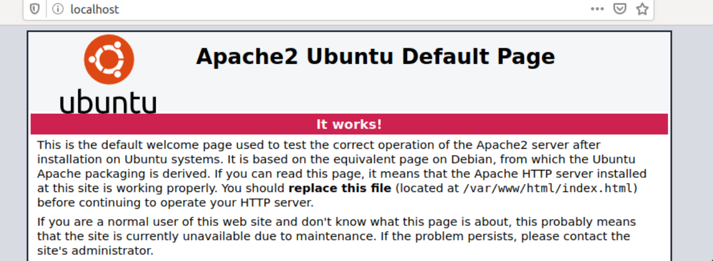

这是安装后的默认页面，用于确认网络服务器是否正常工作。

### CURL

`cURL``HTTP`是一种工具，它允许我们通过、`HTTPS`、`FTP`、`SFTP`、`FTPS`或 等协议从 shell 传输文件`SCP`。该工具使我们能够远程控制和测试网站。除了远程服务器的内容，我们还可以查看单个请求以查看客户端和服务器的通信。通常，`cURL`已经安装在大多数 Linux 系统上。这是熟悉此工具的另一个重要原因，因为它可以使以后的某些流程变得更加容易。

 

```shell-session
vnswer77@htb[/htb]$ curl http://localhost

<!DOCTYPE html PUBLIC "-//W3C//DTD XHTML 1.0 Transitional//EN" "http://www.w3.org/TR/xhtml1/DTD/xhtml1-transitional.dtd">
<html xmlns="http://www.w3.org/1999/xhtml">
  <!--
    Modified from the Debian original for Ubuntu
    Last updated: 2016-11-16
    See: https://launchpad.net/bugs/1288690
  -->
  <head>
    <meta http-equiv="Content-Type" content="text/html; charset=UTF-8" />
    <title>Apache2 Ubuntu Default Page: It works</title>
    <style type="text/css" media="screen">
...SNIP...
```

在标题标签中，我们可以看到它与浏览器中的文本相同。这使我们能够检查网站的源代码并从中获取信息。尽管如此，我们将在另一个模块中回到这一点。

### Wget

curl 的替代方法是工具`wget`。使用此工具，我们可以直接从终端从 FTP 或 HTTP 服务器下载文件，它是一个很好的下载管理器。如果我们同样使用wget，与curl不同的是，网站内容是下载并存储在本地的，如下例所示。

 

```shell-session
vnswer77@htb[/htb]$ wget http://localhost

--2020-05-15 17:43:52--  http://localhost/
Resolving localhost (localhost)... 127.0.0.1
Connecting to localhost (localhost)|127.0.0.1|:80... connected.
HTTP request sent, awaiting response... 200 OK
Length: 10918 (11K) [text/html]
Saving to: 'index.html'

index.html                 100%[=======================================>]  10,66K  --.-KB/s    in 0s      

2020-05-15 17:43:52 (33,0 MB/s) - ‘index.html’ saved [10918/10918]
```

### python3

涉及数据传输时经常使用的另一个选项是使用 Python 3。在这种情况下，Web 服务器的根目录是执行命令以启动服务器的位置。对于此示例，我们位于安装了 WordPress 的目录中并包含“readme.html”。现在，让我们启动 Python 3 Web 服务器，看看我们是否可以使用浏览器访问它。

 

```shell-session
vnswer77@htb[/htb]$ python3 -m http.server

Serving HTTP on 0.0.0.0 port 8000 (http://0.0.0.0:8000/) ...
```


如果我们现在查看我们的 Python 3 Web 服务器的事件，我们可以看到发出了哪些请求。

 

```shell-session
vnswer77@htb[/htb]$ python3 -m http.server

Serving HTTP on 0.0.0.0 port 8000 (http://0.0.0.0:8000/) ...
127.0.0.1 - - [15/May/2020 17:56:29] "GET /readme.html HTTP/1.1" 200 -
127.0.0.1 - - [15/May/2020 17:56:29] "GET /wp-admin/css/install.css?ver=20100228 HTTP/1.1" 200 -
127.0.0.1 - - [15/May/2020 17:56:29] "GET /wp-admin/images/wordpress-logo.png HTTP/1.1" 200 -
```

### 练习

使用“npm”找到一种在 Pwnbox 或本地 VM 中启动简单 HTTP 服务器的方法。提交在端口 8080 上启动 Web 服务器的命令（使用短参数指定端口号）。

```
http-server -p 8080
```

找到一种在 Pwnbox 或使用“php”的本地 VM 中启动简单 HTTP 服务器的方法。提交在本地主机 (127.0.0.1) 上的端口 8080 上启动 Web 服务器的命令。

```
php -S 127.0.0.1:8080
```

## 备份还原

------

Linux 系统提供了多种用于备份和恢复数据的软件工具。这些工具旨在高效和安全地确保数据受到保护，同时还允许我们轻松访问所需的数据。

在 Ubuntu 系统上备份数据时，我们可以使用以下工具：

- 同步
- 似曾相识
- 表里不一

Rsync 是一种开源工具，可让我们快速安全地将文件和文件夹备份到远程位置。它对于通过网络传输大量数据特别有用，因为它只传输文件的更改部分。它还可用于在本地或远程服务器上创建备份。如果我们需要通过网络备份大量数据，Rsync 可能是更好的选择。

Duplicity 是 Ubuntu 的另一个图形备份工具，它为用户提供全面的数据保护和安全备份。它还使用 Rsync 作为后端，另外还提供了加密备份副本并将其存储在远程存储介质（例如 FTP 服务器）或云存储服务（例如 Amazon S3）上的可能性。

Deja Dup 是一款用于 Ubuntu 的图形化备份工具，它简化了备份过程，让我们能够快速轻松地备份我们的数据。它提供了一个用户友好的界面，可以在本地或远程存储介质上创建数据备份副本。它使用 Rsync 作为后端，还支持数据加密。

为了确保备份的安全性和完整性，我们应该采取措施对其备份进行加密。加密备份可确保敏感数据免受未经授权的访问。或者，我们可以使用 GnuPG、eCryptfs 和 LUKS 等工具对 Ubuntu 系统上的备份进行加密。

在 Ubuntu 系统上备份和恢复数据是数据保护的重要组成部分。通过使用所讨论的工具，我们可以确保我们的数据得到安全备份，并且可以在需要时轻松恢复。

为了在 Ubuntu 上安装 Rsync，我们可以使用`apt`包管理器：

#### 安装 Rsync

 安装 Rsync

```shell-session
vnswer77@htb[/htb]$ sudo apt install rsync -y
```

这将在系统上安装最新版本的 Rsync。安装完成后，我们就可以开始使用该工具来备份和恢复数据了。要使用 备份整个目录`rsync`，我们可以使用以下命令：

#### Rsync - 将本地目录备份到我们的备份服务器

 Rsync - 将本地目录备份到我们的备份服务器

```shell-session
vnswer77@htb[/htb]$ rsync -av /path/to/mydirectory user@backup_server:/path/to/backup/directory
```

此命令会将整个目录 ( `/path/to/mydirectory`) 复制到远程主机 ( `backup_server`) 的目录中`/path/to/backup/directory`。选项`archive`( `-a`) 用于保留原始文件属性，如权限、时间戳等，使用`verbose`( `-v`) 选项提供操作进度的详细输出`rsync`。

我们还可以添加其他选项来自定义备份过程，例如使用压缩和增量备份。我们可以这样做：

 Rsync - 将本地目录备份到我们的备份服务器

```shell-session
vnswer77@htb[/htb]$ rsync -avz --backup --backup-dir=/path/to/backup/folder --delete /path/to/mydirectory user@backup_server:/path/to/backup/directory
```

有了这个，我们备份`mydirectory`到远程`backup_server`，保留原始文件属性、时间戳和权限，并启用压缩 ( `-z`) 以加快传输速度。该`--backup`选项在目录中创建增量备份`/path/to/backup/folder`，并且该`--delete`选项从远程主机中删除不再存在于源目录中的文件。

如果我们想将我们的目录从我们的备份服务器恢复到我们的本地目录，我们可以使用以下命令：

#### Rsync - 恢复我们的备份

 Rsync - 恢复我们的备份

```shell-session
vnswer77@htb[/htb]$ rsync -av user@remote_host:/path/to/backup/directory /path/to/mydirectory
```

------

## 加密同步

为了确保本地主机和备份服务器之间文件传输的安全`rsync`，我们可以结合使用 SSH 和其他安全措施。通过使用 SSH，我们能够在传输数据时对其进行加密，从而使任何未经授权的个人更难访问这些数据。此外，我们还可以使用防火墙和其他安全协议来确保我们的数据在传输过程中保持安全。通过采取这些步骤，我们可以确信我们的数据受到保护并且我们的文件传输是安全的。因此，我们告诉您`rsync`像下面这样使用 SSH：

#### 安全传输我们的备份

 安全传输我们的备份

```shell-session
vnswer77@htb[/htb]$ rsync -avz -e ssh /path/to/mydirectory user@backup_server:/path/to/backup/directory
```

我们的本地主机和备份服务器之间的数据传输是通过加密的 SSH 连接进行的，这为传输的数据提供了机密性和完整性保护。此加密过程可确保数据免受任何潜在的恶意行为者的侵害，否则他们将能够在未经授权的情况下访问和修改数据。加密密钥本身也受到一套全面的安全协议的保护，使任何未经授权的人更难访问数据。此外，加密连接旨在高度抵御任何破坏安全的企图，让我们对传输数据的保护充满信心。

------

## 自动同步

要使用 启用自动同步`rsync`，您可以结合使用`cron`和`rsync`来自动执行同步过程。安排 cron 作业定期运行可确保两个系统的内容保持同步。这对于需要在多台机器上保持数据同步的组织尤其有益。此外，设置自动同步`rsync`是一种节省时间和精力的好方法，因为它消除了手动同步的需要。它还有助于确保存储在系统中的文件和数据保持最新和一致，这有助于减少错误并提高效率。

因此，我们创建了一个名为 的新脚本`RSYNC_Backup.sh`，它将触发`rsync`命令将我们的本地目录与远程目录同步。

#### RSYNC_Backup.sh

代码：庆典

```bash
#!/bin/bash

rsync -avz -e ssh /path/to/mydirectory user@backup_server:/path/to/backup/directory
```

那么，为了保证脚本能够正常执行，我们必须提供必要的权限。此外，确保脚本由正确的用户拥有也很重要，因为这将确保只有正确的用户才能访问脚本，并且脚本不会被任何其他用户篡改。

 RSYNC_Backup.sh

```shell-session
vnswer77@htb[/htb]$ chmod +x RSYNC_Backup.sh
```

之后，我们可以创建一个 crontab，告诉我们`cron`在每小时的第 0 分钟运行脚本。我们可以根据需要调整时间。为此，crontab 需要以下内容：

#### 自动同步 - Crontab

 自动同步 - Crontab

```shell-session
0 * * * * /path/to/RSYNC_Backup.sh
```

使用此设置，`cron`将负责以所需的时间间隔执行脚本，确保`rsync`命令运行并且本地目录的内容与远程主机同步。

## 文件系统管理

Linux 上的文件系统管理是一个复杂的过程，涉及组织和维护存储在磁盘或其他存储设备上的数据。Linux 是一个功能强大的操作系统，支持范围广泛的文件系统，包括 ext2、ext3、ext4、XFS、Btrfs、NTFS 等。这些文件系统中的每一个都提供独特的功能和优势，任何给定情况的最佳选择将取决于应用程序或用户的特定要求。例如，ext2 适用于基本的文件系统管理任务，而 Btrfs 则提供强大的数据完整性和快照功能。此外，当需要与 Windows 兼容时，NTFS 很有用。无论情况如何，在选择文件系统之前正确分析应用程序或用户的需求都很重要。

Linux文件系统是在Unix文件系统的基础上建立起来的，它是由各种组件组成的层次结构。这个结构的顶端是索引节点表，它是整个文件系统的基础。inode 表是 Linux 系统上与每个文件和目录相关联的信息表。Inode 包含有关文件或目录的元数据，例如其权限、大小、类型、所有者等。inode 表就像是 Linux 系统上每个文件和目录的信息数据库，允许操作系统快速访问和管理文件。文件可以通过以下两种方式之一存储在 Linux 文件系统中：

- 常规文件
- 目录

常规文件是最常见的文件类型，它们存储在文件系统的根目录中。目录用于存储文件集合。当文件存储在目录中时，该目录称为文件的父目录。除了常规文件和目录外，Linux 还支持符号链接，即对其他文件或目录的引用。符号链接可用于快速访问位于文件系统不同部分的文件。每个文件和目录都需要在权限方面进行管理。权限控制谁有权访问文件和目录。每个文件和目录都有一组关联的权限，用于确定谁可以读取、写入和执行文件。相同的权限适用于所有用户，因此如果更改了一个用户的权限，

 

```shell-session
vnswer77@htb[/htb]$ ls -il

total 0
10678872 -rw-r--r--  1 cry0l1t3  htb  234123 Feb 14 19:30 myscript.py
10678869 -rw-r--r--  1 cry0l1t3  htb   43230 Feb 14 11:52 notes.txt
```

### 磁盘和驱动器

​	Linux 上的磁盘管理涉及管理物理存储设备，包括硬盘驱动器、固态驱动器和可移动存储设备。Linux 上磁盘管理的主要工具是`fdisk`，它允许我们在驱动器上创建、删除和管理分区。它还可以显示有关分区表的信息，包括每个分区的大小和类型。在 Linux 上对驱动器进行分区涉及将物理存储空间划分为单独的逻辑部分。然后每个分区都可以格式化为特定的文件系统，例如 ext4、NTFS 或 FAT32，并且可以作为单独的文件系统挂载。Linux 上最常用的分区工具还有`fdisk`、`gpart`和`GParted`。

### 软盘

```shell-session
vnswer77@htb[/htb]$ sudo fdisk -l

Disk /dev/vda: 160 GiB, 171798691840 bytes, 335544320 sectors
Units: sectors of 1 * 512 = 512 bytes
Sector size (logical/physical): 512 bytes / 512 bytes
I/O size (minimum/optimal): 512 bytes / 512 bytes
Disklabel type: dos
Disk identifier: 0x5223435f

Device     Boot     Start       End   Sectors  Size Id Type
/dev/vda1  *         2048 158974027 158971980 75.8G 83 Linux
/dev/vda2       158974028 167766794   8792767  4.2G 82 Linux swap / Solaris

Disk /dev/vdb: 452 KiB, 462848 bytes, 904 sectors
Units: sectors of 1 * 512 = 512 bytes
Sector size (logical/physical): 512 bytes / 512 bytes
I/O size (minimum/optimal): 512 bytes / 512 bytes
```

### 安装

每个逻辑分区或驱动器都需要分配给 Linux 上的特定目录。这个过程称为安装。安装涉及将驱动器附加到特定目录，使其可供文件系统层次结构访问。一旦安装了驱动器，就可以像系统上的任何其他目录一样访问和操作它。该`mount`工具用于在 Linux 上挂载文件系统，该`/etc/fstab`文件用于定义在启动时挂载的默认文件系统。

#### 启动时挂载的文件系统

```shell-session
vnswer77@htb[/htb]$ cat /etc/fstab

# /etc/fstab: static file system information.
#
# Use 'blkid' to print the universally unique identifier for a device; this may
# be used with UUID= as a more robust way to name devices that works even if
# disks are added and removed. See fstab(5).
#
# <file system>                      <mount point>  <type>  <options>  <dump>  <pass>
UUID=3d6a020d-...SNIP...-9e085e9c927a /              btrfs   subvol=@,defaults,noatime,nodiratime,nodatacow,space_cache,autodefrag 0 1
UUID=3d6a020d-...SNIP...-9e085e9c927a /home          btrfs   subvol=@home,defaults,noatime,nodiratime,nodatacow,space_cache,autodefrag 0 2
UUID=21f7eb94-...SNIP...-d4f58f94e141 swap           swap    defaults,noatime 0 0
```

要查看当前挂载的文件系统，我们可以使用不带任何参数的“mount”命令。输出将显示所有当前安装的文件系统的列表，包括设备名称、文件系统类型、安装点和选项。

#### 列出已安装的驱动器

 列出已安装的驱动器

```shell-session
vnswer77@htb[/htb]$ mount

sysfs on /sys type sysfs (rw,nosuid,nodev,noexec,relatime)
proc on /proc type proc (rw,nosuid,nodev,noexec,relatime)
udev on /dev type devtmpfs (rw,nosuid,relatime,size=4035812k,nr_inodes=1008953,mode=755,inode64)
devpts on /dev/pts type devpts (rw,nosuid,noexec,relatime,gid=5,mode=620,ptmxmode=000)
tmpfs on /run type tmpfs (rw,nosuid,nodev,noexec,relatime,size=814580k,mode=755,inode64)
/dev/vda1 on / type btrfs (rw,noatime,nodiratime,nodatasum,nodatacow,space_cache,autodefrag,subvolid=257,subvol=/@)
```

要挂载文件系统，我们可以使用`mount`命令后跟设备名称和挂载点。例如，要将具有设备名称的 USB 驱动器挂载`/dev/sdb1`到目录`/mnt/usb`，我们将使用以下命令：

#### 安装 U 盘

```shell-session
vnswer77@htb[/htb]$ sudo mount /dev/sdb1 /mnt/usb
vnswer77@htb[/htb]$ cd /mnt/usb && ls -l

total 32
drwxr-xr-x 1 root root   18 Oct 14  2021 'Account Takeover'
drwxr-xr-x 1 root root   18 Oct 14  2021 'API Key Leaks'
drwxr-xr-x 1 root root   18 Oct 14  2021 'AWS Amazon Bucket S3'
drwxr-xr-x 1 root root   34 Oct 14  2021 'Command Injection'
drwxr-xr-x 1 root root   18 Oct 14  2021 'CORS Misconfiguration'
drwxr-xr-x 1 root root   52 Oct 14  2021 'CRLF Injection'
drwxr-xr-x 1 root root   30 Oct 14  2021 'CSRF Injection'
drwxr-xr-x 1 root root   18 Oct 14  2021 'CSV Injection'
drwxr-xr-x 1 root root 1166 Oct 14  2021 'CVE Exploits'
...SNIP...
```

要在 Linux 中卸载文件系统，我们可以使用`umount`后面跟要卸载的文件系统的挂载点的命令。挂载点是文件系统中挂载文件系统的位置，也是我们可以访问的位置。例如，要卸载之前挂载到目录的 USB 驱动器`/mnt/usb`，我们将使用以下命令：

#### 卸载

 卸载

```shell-session
vnswer77@htb[/htb]$ sudo umount /mnt/usb
```

需要注意的是，我们必须有足够的权限才能卸载文件系统。我们也无法卸载正在运行的进程正在使用的文件系统。为了确保没有正在运行的进程正在使用文件系统，我们可以使用命令`lsof`列出文件系统上打开的文件。

 卸载

```shell-session
cry0l1t3@htb:~$ lsof | grep cry0l1t3

vncserver 6006        cry0l1t3  mem       REG      0,24       402274 /usr/bin/perl (path dev=0,26)
vncserver 6006        cry0l1t3  mem       REG      0,24      1554101 /usr/lib/locale/aa_DJ.utf8/LC_COLLATE (path dev=0,26)
vncserver 6006        cry0l1t3  mem       REG      0,24       402326 /usr/lib/x86_64-linux-gnu/perl-base/auto/POSIX/POSIX.so (path dev=0,26)
vncserver 6006        cry0l1t3  mem       REG      0,24       402059 /usr/lib/x86_64-linux-gnu/perl/5.32.1/auto/Time/HiRes/HiRes.so (path dev=0,26)
vncserver 6006        cry0l1t3  mem       REG      0,24      1444250 /usr/lib/x86_64-linux-gnu/libnss_files-2.31.so (path dev=0,26)
vncserver 6006        cry0l1t3  mem       REG      0,24       402327 /usr/lib/x86_64-linux-gnu/perl-base/auto/Socket/Socket.so (path dev=0,26)
vncserver 6006        cry0l1t3  mem       REG      0,24       402324 /usr/lib/x86_64-linux-gnu/perl-base/auto/IO/IO.so (path dev=0,26)
...SNIP...
```

​	如果我们发现任何正在使用文件系统的进程，我们需要在卸载文件系统之前停止它们。此外，我们还可以通过在文件中添加条目来在系统关闭时自动卸载文件系统`/etc/fstab`。该`/etc/fstab`文件包含有关系统上安装的所有文件系统的信息，包括在引导时自动安装的选项和其他安装选项。要在关机时自动卸载文件系统，我们需要将选项添加到该文件系统的文件`noauto`条目中。`/etc/fstab`例如，这会像下面这样：

#### 文件

代码：.txt

```txt
/dev/sda1 / ext4 defaults 0 0
/dev/sda2 /home ext4 defaults 0 0
/dev/sdb1 /mnt/usb ext4 rw,auto,user 0 0
192.168.1.100:/nfs /mnt/nfs nfs defaults 0 0
```

### 交换

​	交换空间是 Linux 中内存管理的一个重要方面，它在确保系统平稳运行方面发挥着重要作用，即使在可用物理内存耗尽时也是如此。当系统用完物理内存时，内核将不活动的内存页转移到交换空间，释放物理内存以供活动进程使用。此过程称为交换。

可以在安装操作系统期间或之后使用`mkswap`和`swapon`命令随时创建交换空间。该`mkswap`命令用于在设备或文件中设置 Linux 交换区，而`swapon`命令用于激活交换区。交换空间的大小是个人喜好的问题，取决于系统中安装的物理内存量和系统的使用类型。创建交换空间时，务必确保将其放置在专用分区或文件上，与文件系统的其余部分分开。这有助于防止交换空间碎片化，并确保系统在需要时有足够的可用交换空间。确保交换空间加密也很重要，因为敏感数据可能会暂时存储在交换空间中。

除了用作物理内存的扩展之外，交换空间还可以用于休眠，这是一种电源管理功能，允许系统将其状态保存到磁盘，然后关闭而不是完全关闭。当系统稍后开机时，它可以从交换空间恢复其状态，返回到关机前的状态。

# 容器化

------

容器化是在容器、虚拟机或无服务器环境等隔离环境中打包和运行应用程序的过程。Docker、Docker Compose 和 Linux Containers 等技术使这一过程在 Linux 系统中成为可能。这些技术允许用户快速、安全、高效地创建、部署和管理应用程序。使用这些工具，用户可以通过多种方式配置他们的应用程序，从而使他们能够根据自己的需要定制应用程序。此外，容器非常轻巧，非常适合同时运行多个应用程序并提供可扩展性和可移植性。容器化是确保高效、安全地管理和部署应用程序的好方法。

容器安全是容器化的一个重要方面。它们为用户提供了一个安全的环境来运行他们的应用程序，因为它们与主机系统和其他容器隔离开来。这种隔离有助于保护主机系统免受容器中的任何恶意活动的影响，同时为容器上运行的应用程序提供额外的安全层。此外，容器具有轻量级的优势，这使得它们比传统虚拟机更难受到攻击。此外，容器易于配置，是安全运行应用程序的理想选择。

除了提供安全的环境外，容器还为用户提供了许多其他优势，因为它们使应用程序更易于部署和管理，并且可以更高效地同时运行多个应用程序。但是，仍然存在一些方法来提升我们对容器的权限并逃避它们。

------

## 码头工人

Docker 是一个开源平台，用于将应用程序自动部署为称为容器的独立单元。它使用分层文件系统和资源隔离功能来提供灵活性和可移植性。此外，它还提供了一组强大的工具来创建、部署和管理应用程序，这有助于简化容器化过程。

#### 安装 Docker 引擎

安装 Docker 相对简单。我们可以使用以下脚本将其安装在 Ubuntu 主机上：

代码：庆典

```bash
#!/bin/bash

# Preparation
sudo apt update -y
sudo apt install ca-certificates curl gnupg lsb-release -y
sudo mkdir -m 0755 -p /etc/apt/keyrings
curl -fsSL https://download.docker.com/linux/ubuntu/gpg | sudo gpg --dearmor -o /etc/apt/keyrings/docker.gpg
echo "deb [arch=$(dpkg --print-architecture) signed-by=/etc/apt/keyrings/docker.gpg] https://download.docker.com/linux/ubuntu $(lsb_release -cs) stable" | sudo tee /etc/apt/sources.list.d/docker.list > /dev/null

# Install Docker Engine
sudo apt update -y
sudo apt install docker-ce docker-ce-cli containerd.io docker-buildx-plugin docker-compose-plugin -y

# Add user htb-student to the Docker group
sudo usermod -aG docker htb-student
echo '[!] You need to log out and log back in for the group changes to take effect.'

# Test Docker installation
docker run hello-world
```

运行容器需要 Docker 引擎和特定的 Docker 映像。[这些可以从Docker Hub](https://academy.hackthebox.com/module/18/section/[https://hub.docker.com/](https://hub.docker.com/))获得，这是一个预制图像的存储库，或者由用户创建。Docker Hub 是一个基于云的软件存储库注册表或 Docker 映像库。它分为一个`public`和一个`private`区域。公共区域允许用户上传图像并与社区共享。它还包含来自 Docker 开发团队和已建立的开源项目的官方图像。上传到注册表私有区域的图像不可公开访问。它们可以在公司内部共享，也可以与团队和熟人共享。

创建 Docker 镜像是通过创建[Dockerfile](https://academy.hackthebox.com/module/18/section/[https://docs.docker.com/engine/reference/builder/](https://docs.docker.com/engine/reference/builder/))来完成的，其中包含 Docker 引擎创建容器所需的所有指令。在将特定文件传输到我们的目标系统时，我们可以使用 Docker 容器作为我们的“文件托管”服务器。因此，我们必须创建一个`Dockerfile`基于 Ubuntu 22.04`Apache`并`SSH`运行的服务器。有了这个，我们可以使用`scp`将文件传输到 docker 镜像，Apache 允许我们托管文件并使用目标系统上的 、 和其他工具`curl`来`wget`下载所需的文件。这样的`Dockerfile`可能如下所示：

#### 文件

代码：庆典

```bash
# Use the latest Ubuntu 22.04 LTS as the base image
FROM ubuntu:22.04

# Update the package repository and install the required packages
RUN apt-get update && \
    apt-get install -y \
        apache2 \
        openssh-server \
        && \
    rm -rf /var/lib/apt/lists/*

# Create a new user called "student"
RUN useradd -m docker-user && \
    echo "docker-user:password" | chpasswd

# Give the htb-student user full access to the Apache and SSH services
RUN chown -R docker-user:docker-user /var/www/html && \
    chown -R docker-user:docker-user /var/run/apache2 && \
    chown -R docker-user:docker-user /var/log/apache2 && \
    chown -R docker-user:docker-user /var/lock/apache2 && \
    usermod -aG sudo docker-user && \
    echo "docker-user ALL=(ALL) NOPASSWD: ALL" >> /etc/sudoers

# Expose the required ports
EXPOSE 22 80

# Start the SSH and Apache services
CMD service ssh start && /usr/sbin/apache2ctl -D FOREGROUND
```

在我们定义了 Dockerfile 之后，我们需要将其转换为图像。通过`build`命令，我们获取带有 Dockerfile 的目录，执行 中的步骤`Dockerfile`，并将图像存储在我们的本地 Docker 引擎中。如果其中一个步骤因错误而失败，则容器创建将中止。通过选项`-t`，我们为我们的容器提供了一个标签，以便以后更容易识别和使用。

#### Docker构建

 Docker构建

```shell-session
vnswer77@htb[/htb]$ docker build -t FS_docker
```

一旦创建了 Docker 镜像，它就可以通过 Docker 引擎执行，这使得它成为运行容器的一种非常高效和简单的方法。它类似于基于图像的虚拟机概念。尽管如此，这些图像仍然是只读模板，并提供运行时和所有参数所需的文件系统。容器可以看成是一个镜像的运行进程。当要在系统上启动容器时，如果本地不可用，则首先加载具有相应图像的包。我们可以通过以下命令启动容器[docker run](https://academy.hackthebox.com/module/18/section/[https://docs.docker.com/engine/reference/commandline/run/](https://docs.docker.com/engine/reference/commandline/run/))：

#### Docker 运行 - 语法

 Docker 运行 - 语法

```shell-session
vnswer77@htb[/htb]$ docker run -p <host port>:<docker port> -d <docker container name>
```

#### 码头工人运行

 码头工人运行

```shell-session
vnswer77@htb[/htb]$ docker run -p 8022:22 -p 8080:80 -d FS_docker
```

在这种情况下，我们从镜像中启动一个新容器`FS_docker`，并将主机端口 8022 和 8080 分别映射到容器端口 22 和 80。容器在后台运行，允许我们使用指定的主机端口访问容器内部的 SSH 和 HTTP 服务。

#### 码头管理

在管理 Docker 容器时，Docker 提供了一套完善的工具，使我们能够轻松地创建、部署和管理容器。借助这些强大的工具，我们可以列出、启动和停止容器并有效地管理它们，确保应用程序的无缝执行。一些最常用的 Docker 管理命令是：

| **命令**         | **描述**                 |
| ---------------- | ------------------------ |
| `docker ps`      | 列出所有正在运行的容器   |
| `docker stop`    | 停止正在运行的容器。     |
| `docker start`   | 启动一个停止的容器。     |
| `docker restart` | 重新启动正在运行的容器。 |
| `docker rm`      | 删除一个容器。           |
| `docker rmi`     | 删除 Docker 映像。       |
| `docker logs`    | 查看容器的日志。         |

值得注意的是，这些在 Docker 中使用的命令可以与各种选项结合使用以提供附加功能。例如，我们可以指定公开哪些端口、挂载卷或设置环境变量。这使我们能够自定义 Docker 容器以满足我们的需要和要求。使用 Docker 映像时，请务必注意对现有映像所做的任何更改都不是永久性的。相反，我们需要创建一个继承原始图像并包含所需更改的新图像。

这是通过创建一个新的 Dockerfile 来完成的，该文件以指定基本映像的语句开头`FROM`，然后添加必要的命令以进行所需的更改。创建 Dockerfile 后，我们可以使用`docker build`命令构建新映像，并使用唯一名称对其进行标记以帮助识别它。此过程可确保原始图像保持完整，同时允许我们创建具有所需更改的新图像。

需要注意的是，Docker 容器被设计为不可变的，这意味着在运行时对容器所做的任何更改都会在容器停止时丢失。因此，推荐使用Docker Compose或Kubernetes等容器编排工具对生产环境中的容器进行管理和伸缩。

------

## Linux容器

Linux Containers ( `LXC`) 是一种虚拟化技术，允许多个独立的 Linux 系统在单个主机上运行。`cgroups`它使用和等资源隔离特性`namespaces`来提供轻量级虚拟化解决方案。LXC 还提供了一套丰富的工具和 API 来管理和配置容器，这有助于它作为容器化技术的普及。通过结合 LXC 的优势和 Docker 的强大功能，用户可以在 Linux 系统中实现成熟的容器化体验。

LXC 和 Docker 都是容器化技术，允许应用程序在隔离环境中打包和运行。但是，可以根据以下类别区分两者之间的一些差异：

- 方法
- 形象塑造
- 可移植性
- 易于使用
- 安全

LXC是一种轻量级的虚拟化技术，利用Linux内核的资源隔离特性，为应用程序提供一个隔离的环境。在 LXC 中，镜像是通过创建根文件系统并安装必要的包和配置来手动构建的。这些容器绑定到主机系统，可能不容易移植，并且可能需要更多的技术专业知识来配置和管理。LXC 还提供了一些安全功能，但可能不如 Docker 强大。

另一方面，Docker 是一个以应用程序为中心的平台，它构建在 LXC 之上，并为容器化提供了更加用户友好的界面。它的图像是使用 Dockerfile 构建的，它指定了基础图像和构建图像所需的步骤。这些图像被设计成可移植的，因此它们可以很容易地从一个环境移动到另一个环境。Docker 为容器化提供了一个更加用户友好的界面，提供了一组丰富的工具和 API 来管理和配置容器，并为运行应用程序提供了一个更安全的环境。

要在 Linux 发行版上安装 LXC，我们可以使用发行版的包管理器。例如，在 Ubuntu 上，我们可以使用`apt`包管理器通过以下命令安装 LXC：

#### 安装 LXC

 安装 LXC

```shell-session
vnswer77@htb[/htb]$ sudo apt-get install lxc lxc-utils -y
```

一旦安装了 LXC，我们就可以开始在 Linux 主机上创建和管理容器。值得注意的是，LXC 需要 Linux 内核支持容器化的必要特性。大多数现代 Linux 内核都内置了对容器化的支持，但一些较旧的内核可能需要额外的配置或打补丁才能支持 LXC。

#### 创建 LXC 容器

要创建一个新的 LXC 容器，我们可以使用`lxc-create`命令后跟容器的名称和要使用的模板。例如，要创建一个名为 的新 Ubuntu 容器`linuxcontainer`，我们可以使用以下命令：

 创建 LXC 容器

```shell-session
vnswer77@htb[/htb]$ sudo lxc-create -n linuxcontainer -t ubuntu
```

#### 管理 LXC 容器

使用 LXC 容器时，管理它们涉及多项任务。这些任务包括创建新容器、配置它们的设置、根据需要启动和停止它们，以及监控它们的性能。幸运的是，有许多可用的命令行工具和配置文件可以帮助完成这些任务。这些工具使我们能够快速轻松地管理我们的容器，确保它们针对我们的特定需求和要求进行了优化。通过有效地利用这些工具，我们可以确保我们的 LXC 容器高效且有效地运行，从而使我们能够最大限度地提高系统的性能和功能。

| 命令                                          | 描述                             |
| --------------------------------------------- | -------------------------------- |
| `lxc-ls`                                      | 列出所有现有容器                 |
| `lxc-stop -n <container>`                     | 停止正在运行的容器。             |
| `lxc-start -n <container>`                    | 启动一个停止的容器。             |
| `lxc-restart -n <container>`                  | 重新启动正在运行的容器。         |
| `lxc-config -n <container name> -s storage`   | 管理容器存储                     |
| `lxc-config -n <container name> -s network`   | 管理容器网络设置                 |
| `lxc-config -n <container name> -s security`  | 管理容器安全设置                 |
| `lxc-attach -n <container>`                   | 连接到容器。                     |
| `lxc-attach -n <container> -f /path/to/share` | 连接到容器并共享特定目录或文件。 |

作为渗透测试人员，我们可能会遇到这样的情况，我们必须测试具有难以在我们的机器上重现的依赖项或配置的软件或系统。这就是 Linux 容器派上用场的地方。由于 Linux 容器是一个轻量级的独立可执行程序包，其中包含运行特定软件或系统所需的所有依赖项和配置文件，因此它提供了一个隔离的环境，可以在任何 Linux 机器上运行，而不管主机的配置如何。

容器很有用，尤其是因为它们允许我们快速启动一个特定于我们测试需求的隔离环境。例如，我们可能需要测试需要特定数据库或 Web 服务器版本的 Web 应用程序。与其在我们的机器上设置这些组件，这可能既耗时又容易出错，我们可以创建一个容器，其中包含我们需要的确切配置。

我们还可以使用它们在受控环境中测试漏洞利用或恶意软件，在该环境中我们创建一个容器来模拟易受攻击的系统或网络，然后使用该容器安全地测试漏洞利用，而不会冒损坏我们的机器或网络的风险。但是，重要的是配置 LXC 容器安全性以防止容器内未经授权的访问或恶意活动。这可以通过实施多项安全措施来实现，例如：

- 限制对容器的访问
- 限制资源
- 将容器与主机隔离
- 强制执行访问控制
- 保持容器最新

可以使用各种方法访问 LXC 容器，例如 SSH 或控制台。建议通过禁用不必要的服务、使用安全协议和强制执行强身份验证机制来限制对容器的访问。例如，我们可以通过删除包`openssh-server`或将 SSH 配置为仅允许来自可信 IP 地址的访问来禁用对容器的 SSH 访问。这些容器还与主机系统共享相同的内核，这意味着它们可以访问系统上的所有可用资源。我们可以使用资源限制或配额来防止容器消耗过多的资源。例如，我们可以使用它`cgroups`来限制容器可以使用的 CPU、内存或磁盘空间的数量。

#### 保护 LXC

让我们限制容器的资源。为了配置`cgroups`LXC 并限制 CPU 和内存，容器可以在`/usr/share/lxc/config/<container name>.conf`目录中以我们容器的名称创建一个新的配置文件。例如，要为名为 的容器创建配置文件`linuxcontainer`，我们可以使用以下命令：

 保护 LXC

```shell-session
vnswer77@htb[/htb]$ sudo vim /usr/share/lxc/config/linuxcontainer.conf
```

在这个配置文件中，我们可以添加以下行来限制容器可以使用的 CPU 和内存。

代码：.txt

```txt
lxc.cgroup.cpu.shares = 512
lxc.cgroup.memory.limit_in_bytes = 512M
```

使用容器时，了解`lxc.cgroup.cpu.shares`参数很重要。此参数确定一个容器相对于系统上其他容器可以使用的 CPU 时间。默认情况下，此值设置为 1024，这意味着容器可以使用其公平份额的 CPU 时间。但是，如果我们将这个值设置为 512，例如，容器只能使用系统可用 CPU 时间的一半。这可能是管理资源并确保所有容器都具有必要的 CPU 时间访问权限的有用方法。

参数是控制容器资源分配的关键参数之一`lxc.cgroup.memory.limit_in_bytes`。此参数允许您设置容器可以使用的最大内存量。重要的是要注意，这个值可以用多种单位指定，包括字节、千字节 (K)、兆字节 (M)、千兆字节 (G) 或太字节 (T)，允许在定义容器时具有高度的粒度资源限制。添加这两行后，我们可以通过键入以下内容来保存并关闭文件：

- `[Esc]`
- `:`
- `wq`

要应用这些更改，我们必须重新启动 LXC 服务。

 保护 LXC

```shell-session
vnswer77@htb[/htb]$ sudo systemctl restart lxc.service
```

LXC 用于`namespaces`为主机系统的进程、网络和文件系统提供一个隔离的环境。命名空间是 Linux 内核的一项功能，它允许通过提供系统资源的抽象来创建隔离的环境。

命名空间是容器化的一个重要方面，因为它们为容器的进程、网络接口、路由表和防火墙规则提供了高度隔离。每个容器都分配有一个唯一的进程 ID ( `pid`) 编号空间，与主机系统的进程 ID 隔离。这样可以保证容器的进程不会干扰宿主系统的进程，增强系统的稳定性和可靠性。此外，每个容器都有自己的网络接口 ( `net`)、路由表和防火墙规则，它们完全独立于主机系统的网络接口。容器内任何与网络相关的活动都与主机系统的网络隔离开来，提供了额外的网络安全层。

此外，容器带有自己的根文件系统 ( `mnt`)，这与主机系统的根文件系统完全不同。两者之间的这种分离可确保在容器文件系统中所做的任何更改或修改都不会影响主机系统的文件系统。然而，重要的是要记住，虽然名称空间提供了高级别的隔离，但它们并不提供完全的安全性。因此，始终建议实施额外的安全措施，以进一步保护容器和主机系统免受潜在的安全漏洞。

这里有 9 个练习 LXC 的可选练习：

|      |                                                              |
| ---- | ------------------------------------------------------------ |
| 1个  | 在你的机器上安装 LXC 并创建你的第一个容器。                  |
| 2个  | 为您的 LXC 容器配置网络设置。                                |
| 3个  | 创建自定义 LXC 映像并使用它来启动新容器。                    |
| 4个  | 为 LXC 容器配置资源限制（CPU、内存、磁盘空间）。             |
| 5个  | 探索`lxc-*`用于管理容器的命令。                              |
| 6个  | 使用 LXC 创建运行特定版本 Web 服务器（例如 Apache、Nginx）的容器。 |
| 7    | 配置对 LXC 容器的 SSH 访问并远程连接到它们。                 |
| 8个  | 创建具有持久性的容器，以便保存对容器所做的更改并可以重复使用。 |
| 9    | 使用 LXC 在受控环境中测试软件，例如易受攻击的 Web 应用程序或恶意软件。 |

# 网络配置

------

作为渗透测试人员，所需的关键技能之一是在 Linux 系统上配置和管理网络设置。此技能在设置测试环境、控制网络流量或识别和利用漏洞方面很有价值。通过了解 Linux 的网络配置选项，我们可以调整我们的测试方法以满足我们的特定需求并优化我们的结果。

主要的网络配置任务之一是配置网络接口。这包括分配 IP 地址、配置网络设备（例如路由器和交换机）以及设置网络协议。彻底了解网络协议及其特定用例（例如 TCP/IP、DNS、DHCP 和 FTP）至关重要。此外，我们应该熟悉不同的网络接口，包括无线和有线连接，并能够解决连接问题。

网络访问控制是网络配置的另一个重要组成部分。作为渗透测试人员，我们应该熟悉 NAC 对网络安全的重要性以及可用的不同 NAC 技术。这些包括：

- 自主访问控制 (DAC)
- 强制访问控制 (MAC)
- 基于角色的访问控制 (RBAC)

我们还应该了解不同的 NAC 执行机制，并知道如何为 NAC 配置 Linux 网络设备。这包括设置 SELinux 策略、配置 AppArmor 配置文件以及使用 TCP 包装器来控制访问。

监控网络流量也是网络配置的重要组成部分。因此，我们应该知道如何配置网络监控和日志记录，并能够出于安全目的分析网络流量。syslog、rsyslog、ss、lsof 和 ELK stack 等工具可用于监控网络流量和识别安全问题。

此外，熟悉网络故障排除工具对于识别漏洞以及与其他网络和主机交互至关重要。除了我们提到的工具外，我们还可以使用 ping、nslookup 和 nmap 来诊断和枚举网络。这些工具可以提供对网络流量、数据包丢失、延迟、DNS 解析等的宝贵见解。通过了解如何有效地使用这些工具，我们可以快速查明任何网络问题的根本原因，并采取必要的步骤来解决它。

------

## 配置网络接口

使用 Ubuntu 时，您可以使用`ifconfig`或`ip`命令配置本地网络接口。这些强大的命令允许我们查看和配置我们系统的网络接口。无论我们是要更改现有的网络设置还是需要检查接口的状态，这些命令都可以大大简化流程。此外，牢牢掌握网络接口的复杂性是现代互联世界的基本能力。随着技术的快速进步和对数字通信的日益依赖，全面了解如何使用网络接口可以使您有效地浏览当今存在的各种网络。

获取有关网络接口的信息（例如 IP 地址、网络掩码和状态）的一种方法是使用命令`ifconfig`。通过执行此命令，我们可以清晰、有条理地查看可用的网络接口及其各自的属性。在解决网络连接问题或设置新网络配置时，此信息特别有用。应该注意的是，该`ifconfig`命令在较新版本的 Linux 中已被弃用，取而代之的是`ip`提供更多高级功能的命令。尽管如此，该`ifconfig`命令仍在许多 Linux 发行版中广泛使用，并继续成为网络管理的可靠工具。

#### 网络设置

 网络设置

```shell-session
cry0l1t3@htb:~$ ifconfig

eth0: flags=4163<UP,BROADCAST,RUNNING,MULTICAST>  mtu 1500
        inet 178.62.32.126  netmask 255.255.192.0  broadcast 178.62.63.255
        inet6 fe80::88d9:faff:fecf:797a  prefixlen 64  scopeid 0x20<link>
        ether 8a:d9:fa:cf:79:7a  txqueuelen 1000  (Ethernet)
        RX packets 7910  bytes 717102 (700.2 KiB)
        RX errors 0  dropped 0  overruns 0  frame 0
        TX packets 7072  bytes 24215666 (23.0 MiB)
        TX errors 0  dropped 0 overruns 0  carrier 0  collisions 0

eth1: flags=4163<UP,BROADCAST,RUNNING,MULTICAST>  mtu 1500
        inet 10.106.0.66  netmask 255.255.240.0  broadcast 10.106.15.255
        inet6 fe80::b8ab:52ff:fe32:1f33  prefixlen 64  scopeid 0x20<link>
        ether ba:ab:52:32:1f:33  txqueuelen 1000  (Ethernet)
        RX packets 14  bytes 1574 (1.5 KiB)
        RX errors 0  dropped 0  overruns 0  frame 0
        TX packets 15  bytes 1700 (1.6 KiB)
        TX errors 0  dropped 0 overruns 0  carrier 0  collisions 0

lo: flags=73<UP,LOOPBACK,RUNNING>  mtu 65536
        inet 127.0.0.1  netmask 255.0.0.0
        inet6 ::1  prefixlen 128  scopeid 0x10<host>
        loop  txqueuelen 1000  (Local Loopback)
        RX packets 15948  bytes 24561302 (23.4 MiB)
        RX errors 0  dropped 0  overruns 0  frame 0
        TX packets 15948  bytes 24561302 (23.4 MiB)
        TX errors 0  dropped 0 overruns 0  carrier 0  collisions 0


cry0l1t3@htb:~$ ip addr

1: lo: <LOOPBACK,UP,LOWER_UP> mtu 65536 qdisc noqueue state UNKNOWN group default qlen 1000
    link/loopback 00:00:00:00:00:00 brd 00:00:00:00:00:00
    inet 127.0.0.1/8 scope host lo
       valid_lft forever preferred_lft forever
    inet6 ::1/128 scope host 
       valid_lft forever preferred_lft forever
2: eth0: <BROADCAST,MULTICAST,UP,LOWER_UP> mtu 1500 qdisc fq_codel state UP group default qlen 1000
    link/ether 8a:d9:fa:cf:79:7a brd ff:ff:ff:ff:ff:ff
    altname enp0s3
    altname ens3
    inet 178.62.32.126/18 brd 178.62.63.255 scope global dynamic eth0
       valid_lft 85274sec preferred_lft 85274sec
    inet6 fe80::88d9:faff:fecf:797a/64 scope link 
       valid_lft forever preferred_lft forever
3: eth1: <BROADCAST,MULTICAST,UP,LOWER_UP> mtu 1500 qdisc fq_codel state UP group default qlen 1000
    link/ether ba:ab:52:32:1f:33 brd ff:ff:ff:ff:ff:ff
    altname enp0s4
    altname ens4
    inet 10.106.0.66/20 brd 10.106.15.255 scope global dynamic eth1
       valid_lft 85274sec preferred_lft 85274sec
    inet6 fe80::b8ab:52ff:fe32:1f33/64 scope link 
       valid_lft forever preferred_lft forever
```

说到激活网络接口，`ifconfig`命令`ip`是两种常用的工具。这些命令允许用户修改和激活特定界面的设置，例如`eth0`. 我们可以通过使用适当的语法并指定接口名称来调整网络设置以满足我们的需要。

#### 激活网络接口

 激活网络接口

```shell-session
vnswer77@htb[/htb]$ sudo ifconfig eth0 up     # OR
vnswer77@htb[/htb]$ sudo ip link set eth0 up
```

为网络接口分配 IP 地址的一种方法是使用命令`ifconfig`。为此，我们必须指定接口的名称和 IP 地址作为参数。这是建立网络连接的关键步骤。IP地址作为接口的唯一标识符，实现网络上设备之间的通信。

#### 为接口分配 IP 地址

 为接口分配 IP 地址

```shell-session
vnswer77@htb[/htb]$ sudo ifconfig eth0 192.168.1.2
```

要为网络接口设置网络掩码，我们可以使用接口名称和网络掩码运行以下命令：

#### 为接口分配网络掩码

 为接口分配网络掩码

```shell-session
vnswer77@htb[/htb]$ sudo ifconfig eth0 netmask 255.255.255.0
```

当我们想为网络接口设置默认网关时，我们可以使用`route`带`add`选项的命令。这允许我们指定网关的 IP 地址和它应该应用到的网络接口。通过设置默认网关，我们指定了路由器的 IP 地址，该路由器将用于将流量发送到本地网络之外的目的地。确保默认网关设置正确很重要，因为不正确的配置会导致连接问题。

#### 将路由分配给接口

 将路由分配给接口

```shell-session
vnswer77@htb[/htb]$ sudo route add default gw 192.168.1.1 eth0
```

配置网络接口时，通常需要设置域名系统 ( `DNS`) 服务器以确保正常的网络功能。DNS 服务器将域名转换为 IP 地址，允许设备在互联网上相互连接。通过设置这些，我们可以确保他们的设备可以与其他设备通信并访问网站和其他在线资源。如果没有正确的 DNS 服务器配置，设备可能会遇到网络连接问题并且无法访问某些在线资源。`/etc/resolv.conf`这可以通过使用适当的 DNS 服务器信息更新文件来实现。这`/etc/resolv.conf`file 是包含系统 DNS 信息的纯文本文件。通过在该文件中添加所需的DNS服务器，系统可以正确地将域名解析为IP地址。重要的是要注意，对此文件所做的任何更改将仅适用于当前会话，并且如果系统重新启动或网络配置发生更改，则必须更新。

#### 编辑 DNS 设置

 编辑 DNS 设置

```shell-session
vnswer77@htb[/htb]$ sudo vim /etc/resolv.conf
```

#### /etc/resolv.conf

代码：.txt

```txt
nameserver 8.8.8.8
nameserver 8.8.4.4
```

完成对网络配置的必要修改后，必须确保保存这些更改以在重新启动后保持不变。这可以通过编辑文件来实现`/etc/network/interfaces`，该文件定义了基于 Linux 的操作系统的网络接口。因此，保存对此文件所做的任何更改以避免任何潜在的网络连接问题至关重要。

#### 编辑界面

 编辑界面

```shell-session
vnswer77@htb[/htb]$ sudo vim /etc/network/interfaces
```

`interfaces`这将在 vim 编辑器中打开该文件。我们可以像这样将网络配置设置添加到文件中：

#### /etc/网络/接口

代码：.txt

```txt
auto eth0
iface eth0 inet static
  address 192.168.1.2
  netmask 255.255.255.0
  gateway 192.168.1.1
  dns-nameservers 8.8.8.8 8.8.4.4
```

通过将`eth0`网络接口设置为使用静态 IP 地址`192.168.1.2`、网络掩码`255.255.255.0`和默认网关`192.168.1.1`，我们可以确保您的网络连接保持稳定和可靠。`8.8.8.8`另外，通过指定和的DNS服务器`8.8.4.4`，可以保证我们的电脑可以方便的上网和解析域名。一旦我们对配置文件进行了这些更改，保存文件并退出编辑器就很重要了。之后，我们必须重新启动网络服务以应用更改。

#### 重新启动网络服务

 重新启动网络服务

```shell-session
vnswer77@htb[/htb]$ sudo systemctl restart networking
```

## 网络访问控制

网络访问控制 (NAC) 是网络安全的重要组成部分，尤其是在当今网络威胁日益增加的时代。作为渗透测试人员，了解 NAC 在保护网络方面的重要性以及可用于增强安全措施的各种 NAC 技术至关重要。NAC 是一种安全系统，可确保只有授权和合规的设备才能访问网络，从而防止未经授权的访问、数据泄露和其他安全威胁。通过实施 NAC，组织可以确信他们有能力保护自己的资产和数据免受总是试图利用系统漏洞的网络犯罪分子的侵害。以下是可用于增强安全措施的不同 NAC 技术：

- 自主访问控制 (DAC)
- 强制访问控制 (MAC)
- 基于角色的访问控制 (RBAC)

这些技术旨在提供不同级别的访问控制和安全性。每种技术都有其独特的特性，适用于不同的用例。作为渗透测试人员，了解这些技术及其具体用例对于有效地测试和评估网络的安全性至关重要。

#### 自主访问控制

DAC 是现代安全系统的重要组成部分，因为它可以帮助组织提供对其资源的访问，同时管理未授权访问的相关风险。它是一种广泛使用的访问控制系统，通过授予资源所有者控制对其资源的访问权限的责任，使用户能够管理对其资源的访问。这意味着拥有特定资源的用户和组可以决定谁有权访问他们的资源以及他们有权执行哪些操作。这些权限可以设置为读取、写入、执行或删除资源。

#### 强制访问控制

MAC 用于提供比 DAC 系统更细粒度的资源访问控制的基础设施。这些系统定义了规则，这些规则根据资源的安全级别和用户的安全级别或进程请求访问来确定资源访问。每个资源都分配有一个标识其安全级别的安全标签，每个用户或进程都分配有一个标识其安全级别的安全许可。仅当用户或进程的安全级别等于或高于资源的安全级别时，才授予对资源的访问权限。MAC 通常用于需要高级别安全性的操作系统和应用程序，例如军事或政府系统、金融系统和医疗保健系统。

#### 基于角色的访问控制

RBAC 根据用户在组织中的角色向用户分配权限。根据用户的工作职责或其他标准为用户分配角色，并且每个角色都被授予一组权限，这些权限决定了他们可以执行的操作。RBAC 简化了访问权限的管理，降低了出错的风险，并确保用户只能访问执行其工作职能所必需的资源。它可以限制对敏感资源和数据的访问，限制安全漏洞的影响，并确保符合法规要求。与自主访问控制 (DAC) 系统相比，RBAC 提供了一种更灵活和可扩展的方法来管理资源访问。在 RBAC 系统中，每个用户都分配有一个或多个角色，每个角色都分配有一组定义用户操作的权限。资源访问权限是根据用户分配的角色而不是他们的身份或资源所有权授予的。RBAC 系统通常用于用户和资源较多的环境，例如大型组织、政府机构和金融机构。

------

## 监控

网络监控涉及捕获、分析和解释网络流量，以识别安全威胁、性能问题和可疑行为。分析和监控网络流量的主要目标是识别安全威胁和漏洞。例如，作为渗透测试人员，我们可以在有人使用未加密的连接并尝试登录 FTP 服务器时捕获凭据。因此，我们将获得该用户的凭证，这可能有助于我们进一步渗透网络或将我们的权限提升到更高级别。简而言之，通过分析网络流量，我们可以深入了解网络行为并识别可能表明安全威胁的模式。此类分析包括检测可疑的网络活动、识别恶意流量和识别潜在的安全风险。然而，[介绍网络流量分析](https://academy.hackthebox.com/module/18/section/[https://academy.hackthebox.com/module/details/81](https://academy.hackthebox.com/module/details/81))模块，其中我们使用多种工具在 Linux 系统（如 Ubuntu 和 Windows 系统）上进行网络监控，如 Wireshark、tshark 和 Tcpdump。

## 故障排除

网络故障排除是一个必不可少的过程，涉及诊断和解决可能对网络性能和可靠性产生不利影响的网络问题。此过程对于确保网络以最佳方式运行并避免在我们的渗透测试期间可能影响业务运营的中断至关重要。它还涉及识别、分析和实施解决方案以解决问题。此类问题包括连接问题、网络速度慢和网络错误。各种工具可以帮助我们识别和解决有关 Linux 系统网络故障排除的问题。一些最常用的工具包括：

1. 平
2. 跟踪路由
3. 网络统计
4. 转储
5. 线鲨
6. 地图

通过使用这些工具和其他类似工具，我们可以更好地了解网络的功能并快速诊断可能出现的任何问题。例如，`ping`是一个命令行工具，用于测试两个设备之间的连接性。它向远程主机发送数据包并测量返回数据包的时间。要使用`ping`，我们可以输入以下命令：

#### 平

 平

```shell-session
vnswer77@htb[/htb]$ ping <remote_host>
```

例如，ping 谷歌 DNS 服务器将向谷歌 DNS 服务器发送 ICMP 数据包并显示响应时间。

 平

```shell-session
vnswer77@htb[/htb]$ ping 8.8.8.8

PING 8.8.8.8 (8.8.8.8) 56(84) bytes of data.
64 bytes from 8.8.8.8: icmp_seq=1 ttl=119 time=1.61 ms
64 bytes from 8.8.8.8: icmp_seq=2 ttl=119 time=1.06 ms
64 bytes from 8.8.8.8: icmp_seq=3 ttl=119 time=0.636 ms
64 bytes from 8.8.8.8: icmp_seq=4 ttl=119 time=0.685 ms
^C
--- 8.8.8.8 ping statistics ---
4 packets transmitted, 4 received, 0% packet loss, time 3017ms
rtt min/avg/max/mdev = 0.636/0.996/1.607/0.388 ms
```

另一个工具是`traceroute`，它跟踪数据包到达远程主机所采用的路由。它向远程主机发送具有递增生存时间 (TTL) 值的数据包，并显示数据包经过的设备的 IP 地址。例如，要跟踪到 Google DNS 服务器的路由，我们将输入以下命令：

#### 跟踪路由

 跟踪路由

```shell-session
vnswer77@htb[/htb]$ traceroute www.inlanefreight.com

traceroute to www.inlanefreight.com (134.209.24.248), 30 hops max, 60 byte packets
 1  * * *
 2  10.80.71.5 (10.80.71.5)  2.716 ms  2.700 ms  2.730 ms
 3  * * *
 4  10.80.68.175 (10.80.68.175)  7.147 ms  7.132 ms 10.80.68.161 (10.80.68.161)  7.393 ms
```

这将显示数据包到达 Google DNS 服务器所经过的设备的 IP 地址。traceroute 命令的输出显示了它如何用于跟踪数据包到网站[www.inlanefreight.com](http://www.inlanefreight.com/)的路径，该网站的 IP 地址为 134.209.24.248。输出的每一行都包含有价值的信息。

设置网络连接时，指定目标主机和 IP 地址很重要。本例中目的主机为134.209.24.248，允许的最大跳数为30，保证了连接的高效可靠建立。通过提供此信息，系统可以将流量路由到正确的目的地，并限制数据需要进行的中间停留次数。

第二行显示了 traceroute 中的第一跳，即 IP 地址为 10.80.71.5 的本地网络网关，接下来的三列显示了发送的三个数据包中的每一个到达网关所花费的时间（以毫秒为单位） 2.716 毫秒、2.700 毫秒和 2.730 毫秒）。

接下来，我们看到 traceroute 中的第二跳。但是，该跳的设备没有响应，由三个星号而不是 IP 地址表示。这可能意味着设备已关闭，阻止 ICMP 流量，或者网络问题导致数据包丢失。

在第四行中，我们可以看到 traceroute 中的第三跳，由 IP 地址为 10.80.68.175 和 10.80.68.161 的两台设备组成，接下来的三列再次显示三个数据包中的每一个到达目的地所花费的时间第一个设备（7.147 毫秒、7.132 毫秒和 7.393 毫秒）。

#### 网络统计

`Netstat`用于显示活动的网络连接及其相关端口。它可用于识别网络流量和解决连接问题。要使用`netstat`，我们可以输入以下命令：

 网络统计

```shell-session
vnswer77@htb[/htb]$ netstat -a

Active Internet connections (servers and established)
Proto Recv-Q Send-Q Local Address           Foreign Address         State      
tcp        0      0 localhost:5901          0.0.0.0:*               LISTEN     
tcp        0      0 0.0.0.0:sunrpc          0.0.0.0:*               LISTEN     
tcp        0      0 0.0.0.0:http            0.0.0.0:*               LISTEN     
tcp        0      0 0.0.0.0:ssh             0.0.0.0:*               LISTEN
...SNIP...
```

我们可以期望在使用此工具时收到有关每个连接的详细信息。这包括使用的协议、接收和发送的字节数、IP 地址、本地和远程设备的端口号以及当前连接状态。输出提供了对系统网络活动的宝贵见解，突出显示了当前处于活动状态并侦听特定端口的四个特定连接。这些连接包括 VNC 远程桌面软件、Sun 远程过程调用服务、用于 Web 流量的 HTTP 协议以及用于安全远程 shell 访问的 SSH 协议。通过了解哪些服务使用哪些端口，用户可以快速识别任何网络问题并进行相应的故障排除。我们在渗透测试中会遇到的最常见的网络问题包括：

- 网络连接问题
- DNS 解析问题（总是 DNS）
- 数据包丢失
- 网络性能问题

每个问题，以及可能包括错误配置的防火墙或路由器、损坏的网络电缆或连接器、不正确的网络设置、硬件故障、不正确的 DNS 服务器设置、DNS 服务器故障、错误配置的 DNS 记录、网络拥塞、过时的网络硬件、错误配置的常见原因网络设置、未打补丁的软件或固件以及缺乏适当的安全控制。了解这些常见的网络问题及其原因对于我们在测试期间有效识别和利用网络系统中的漏洞非常重要。

------

## 硬化

有几种机制在保护 Linux 系统以确保我们和其他公司的数据安全方面非常有效。三种这样的机制是 SELinux、AppArmor 和 TCP 包装器。这些工具旨在保护 Linux 系统免受各种安全威胁，从未经授权的访问到恶意攻击，尤其是在进行渗透测试时。几乎没有比公司因渗透测试而受到损害更糟糕的情况了。通过实施这些安全措施并确保我们针对潜在的攻击者设置相应的保护措施，我们可以显着降低数据泄露的风险并确保我们的系统保持安全。虽然这些工具有一些相似之处，但它们也有重要的区别。

SELinux 是一个内置于 Linux 内核中的 MAC 系统。它旨在提供对系统资源和应用程序的细粒度访问控制。SELinux 的工作原理是强制执行一个策略，该策略定义系统上每个进程和文件的访问控制。它通过限制受损进程可能造成的损害来提供更高级别的安全性。

AppArmor 也是一个 MAC 系统，它对系统资源和应用程序提供类似级别的控制，但工作方式略有不同。AppArmor 作为 Linux 安全模块 (LSM) 实施，并使用应用程序配置文件来定义应用程序可以访问的资源。AppArmor 通常比 SELinux 更易于使用和配置，但可能无法提供相同级别的细粒度控制。

TCP 包装器是一种基于主机的网络访问控制机制，可用于根据客户端系统的 IP 地址限制对网络服务的访问。它的工作原理是拦截传入的网络请求并将客户端系统的 IP 地址与访问控制规则进行比较。这些对于限制未授权系统对网络服务的访问很有用。

就相似性而言，这三种安全机制的共同目标是确保 Linux 系统的安全和保障。除了提供额外保护外，它们还可以限制对资源和服务的访问，从而降低未经授权访问和数据泄露的风险。还值得注意的是，这些机制作为大多数 Linux 发行版的一部分随时可用，使我们可以访问它们以增强其系统的安全性。此外，这些机制可以使用标准工具和实用程序轻松定制和配置，使它们成为 Linux 用户的便捷选择。

从区别上看，SELinux和AppArmor都是MAC系统，对系统资源提供细粒度的访问控制，但工作方式不同。SELinux 内置于内核中，配置和使用起来更加复杂，而 AppArmor 作为模块实现，通常更易于使用。另一方面，TCP 包装器是一种基于主机的网络访问控制机制，旨在根据客户端系统的 IP 地址限制对网络服务的访问。它是一种比 SELinux 和 AppArmor 更简单的机制，但对于限制未授权系统对网络服务的访问很有用。

------

## 配置

在 Linux 世界中航行时，我们不可避免地会遇到我们需要熟悉的各种技术、应用程序和服务。这是一项至关重要的技能，尤其是当我们从事网络安全工作并努力不断提高我们的专业知识时。因此，我们强烈建议您花时间学习如何自行配置重要的安全措施，例如`SELinux`、`AppArmor`和。`TCP wrappers`通过接受这个（可选但高效的）挑战，您将加深对这些技术的理解，培养您解决问题的能力，并获得宝贵的经验，这将在未来为您提供良好的服务。

在实施网络安全措施时，没有放之四海而皆准的方法。重要的是要考虑您要保护的特定信息以及您将使用的工具。但是，您可以在 Discord 频道中与其他人一起练习和实施几个可选任务，以增加您在该领域的知识和技能。通过利用他人的帮助并分享您自己的专业知识，您可以加深对网络安全的理解并帮助他人这样做。请记住，向他人解释概念对于教学和学习至关重要。

#### SELinux

|      |                                                              |
| ---- | ------------------------------------------------------------ |
| 1.   | 在 Pwnbox 上安装 SELinux。                                   |
| 2.   | 配置 SELinux 以防止用户访问特定文件。                        |
| 3.   | 配置 SELinux 以允许单个用户访问特定网络服务但拒绝所有其他用户访问。 |
| 4.   | 配置 SELinux 以拒绝特定用户或组访问特定网络服务。            |

#### 应用装甲

|      |                                                              |
| ---- | ------------------------------------------------------------ |
| 5.   | 配置 AppArmor 以防止用户访问特定文件。                       |
| 6.   | 配置 AppArmor 以允许单个用户访问特定网络服务但拒绝所有其他用户访问。 |
| 7.   | 配置 AppArmor 以拒绝特定用户或组访问特定网络服务。           |

#### TCP包装器

|      |                                                         |
| ---- | ------------------------------------------------------- |
| 8.   | 配置 TCP 包装器以允许从特定 IP 地址访问特定网络服务。   |
| 9.   | 配置 TCP 包装器以拒绝从特定 IP 地址访问特定网络服务。   |
| 10.  | 配置 TCP 包装器以允许从一系列 IP 地址访问特定网络服务。 |

# Linux 中的远程桌面协议

------

Windows、Linux 和 macOS 中使用远程桌面协议来提供对系统的图形远程访问。管理员可以在许多场景中使用远程桌面协议，例如故障排除、软件或系统升级以及远程系统管理。管理员需要连接到他们将远程管理的远程系统，因此，他们相应地使用适当的协议。此外，如果他们想在远程系统上安装应用程序，他们可以使用不同的协议登录。这种用法最常见的协议是 RDP (Windows) 和 VNC (Linux)。

------

## X服务器

`X Window System network protocol`XServer 是( `X11`/ )的用户端部分`X`。这`X11`是一个固定的系统，由一组协议和应用程序组成，允许我们在图形用户界面的显示器上调用应用程序窗口。X11 在 Unix 系统上占主导地位，但 X 服务器也可用于其他操作系统。如今，XServer 几乎是 Ubuntu 及其衍生产品的每个桌面安装的一部分，不需要单独安装。

当桌面在 Linux 计算机上启动时，图形用户界面与操作系统的通信通过 X 服务器发生。使用计算机的内部网络，即使计算机不应该在网络中。X 协议的实用之处在于网络透明性。该协议主要使用 TCP/IP 作为传输基础，但也可用于纯 Unix 套接字。用于 X 服务器的端口通常位于 范围内`TCP/6001-6009`，允许客户端和服务器之间进行通信。通过 X 服务器启动新的桌面会话时，`TCP port 6000`将为第一个 X 显示打开`:0`. 此范围的端口使服务器能够执行其任务，例如托管应用程序以及为客户端提供服务。它们通常用于提供对系统的远程访问，允许用户从世界任何地方访问应用程序和数据。此外，这些端口对于文件和数据的安全共享也是必不可少的，使它们成为 Open X Server 不可或缺的一部分。这样一个X服务器不依赖于本地计算机，它可以用来访问其他计算机，其他计算机也可以使用本地X服务器。如果本地和远程计算机都包含 Unix/Linux 系统，则 VNC 和 RDP 等附加协议是多余的。VNC 和 RDP 在远程计算机上生成图形输出并通过网络传输。而对于 X11，它是在本地计算机上呈现的。这节省了远程计算机上的流量和负载。然而，X11 的显着缺点是未加密的数据传输。但是，这可以通过隧道 SSH 协议来克服。

为此，我们必须`/etc/ssh/sshd_config`通过将此选项更改为 来允许提供应用程序的服务器上的 SSH 配置文件 () 中的 X11 转发`yes`。

#### X11转发

 X11转发

```shell-session
vnswer77@htb[/htb]$ cat /etc/ssh/sshd_config | grep X11Forwarding

X11Forwarding yes
```

有了这个，我们可以使用以下命令从我们的客户端启动应用程序：

 X11转发

```shell-session
vnswer77@htb[/htb]$ ssh -X htb-student@10.129.23.11 /usr/bin/firefox

htb-student@10.129.14.130's password: ********
<SKIP>
```

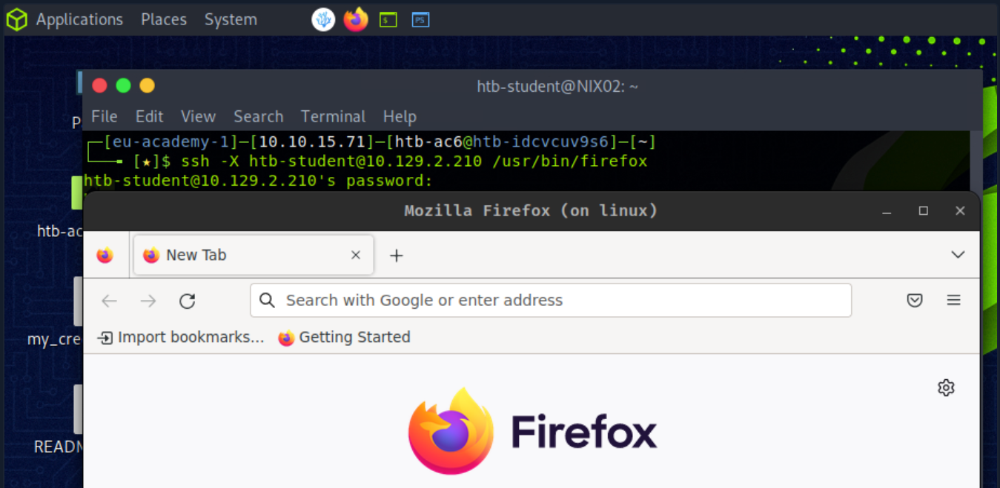

如果没有适当的安全措施，X11 不是一个安全协议，因为 X11 通信是完全未加密的。例如，一个完全开放的 X 服务器允许网络上的任何人读取其窗口的内容，而坐在它前面的用户不会注意到这一点。因此，甚至没有必要嗅探网络。这个标准的 X11 功能是通过简单的 X11 工具实现的，比如`xwd`和`xgrabsc`。简而言之，作为渗透测试人员，我们可以读取用户的击键、获取屏幕截图、移动鼠标光标并通过网络从服务器发送击键。

一个很好的例子是在XServer中发现的几个安全漏洞，本地攻击者可以利用XServer中的漏洞以用户权限执行任意代码并获得用户权限。受这些漏洞影响的操作系统包括 UNIX 和 Linux、Red Hat Enterprise Linux、Ubuntu Linux 和 SUSE Linux。这些漏洞称为 CVE-2017-2624、CVE-2017-2625 和 CVE-2017-2626。

------

## XDMCP

`X Display Manager Control Protocol`( )协议`XDMCP`用于`X Display Manager`在 X 终端和在 Unix/Linux 下运行的计算机之间通过 UDP 端口 177 进行通信。它用于管理其他机器上的远程 X Window 会话，Linux 系统管理员经常使用它来提供对远程桌面的访问。XDMCP 是一种不安全的协议，不应在任何需要高安全级别的环境中使用。这样，就可以将整个图形用户界面 ( `GUI`)（例如 KDE 或 Gnome）重定向到相应的客户端。要使 Linux 系统充当 XDMCP 服务器，必须在服务器上安装和配置具有 GUI 的 X 系统。启动计算机后，用户应该可以在本地使用图形界面。

XDMCP 可能被利用的一种潜在方式是通过中间人攻击。在这种类型的攻击中，攻击者拦截远程计算机与 X Window System 服务器之间的通信，并冒充其中一方以获得对服务器的未授权访问。然后，攻击者可以使用服务器运行任意命令、访问敏感数据或执行其他可能危及系统安全的操作。

------

## 虚拟网络控制器

`Virtual Network Computing`( `VNC`) 是一个基于 RFB 协议的远程桌面共享系统，允许用户远程控制一台计算机。它允许用户通过网络连接远程查看桌面环境并与之交互。用户可以像坐在它面前一样控制远程计算机。这也是 Linux 主机远程图形连接最常用的协议之一。

VNC 通常被认为是安全的。它使用加密来确保数据在传输过程中是安全的，并且在用户获得访问权限之前需要进行身份验证。管理员使用 VNC 访问物理上无法访问的计算机。这可用于对服务器进行故障排除和维护、访问其他计算机上的应用程序或提供对工作站的远程访问。VNC 还可用于屏幕共享，允许多个用户协作处理一个项目或解决一个问题。

VNC 服务器有两个不同的概念。通常的服务器提供主机的实际屏幕以供用户支持。由于键盘和鼠标在远程计算机上仍然可用，因此建议进行安排。第二组服务器程序允许用户登录到虚拟会话，类似于终端服务器概念。

VNC 的服务器和查看器程序可用于所有常见操作系统。因此，许多 IT 服务都是使用 VNC 执行的。专有的 TeamViewer 和 RDP 具有相似的用途。

传统上，VNC 服务器在 TCP 端口 5900 上侦听。因此它`display 0`在那里提供它。可以通过其他端口提供其他显示器，主要是`590[x]`，`x`显示器编号在哪里。添加多个连接将被分配到更高的 TCP 端口，如 5901、5902、5903 等。

对于这些 VNC 连接，使用了许多不同的工具。其中例如：

- [老虎VNC](https://tigervnc.org/)
- [紧VNC](https://www.tightvnc.com/)
- [真实VNC](https://www.realvnc.com/en/)
- [超VNC](https://uvnc.com/)

用于此类连接的最常用工具是 UltraVNC 和 RealVNC，因为它们具有加密和更高的安全性。

在此示例中，我们设置了一个`TigerVNC`服务器，为此，我们还需要`XFCE4`桌面管理器，因为与 GNOME 的 VNC 连接有些不稳定。因此，我们需要安装必要的软件包并为 VNC 连接创建密码。

#### TigerVNC 安装

 TigerVNC 安装

```shell-session
htb-student@ubuntu:~$ sudo apt install xfce4 xfce4-goodies tigervnc-standalone-server -y
htb-student@ubuntu:~$ vncpasswd 

Password: ******
Verify: ******
Would you like to enter a view-only password (y/n)? n
```

安装过程中，会在主目录中创建一个隐藏文件夹，名为`.vnc`. 然后，我们必须创建两个额外的文件，`xstartup`和`config`. 确定`xstartup`如何创建与显示管理器相关的 VNC 会话，并`config`确定其设置。

#### 配置

 配置

```shell-session
htb-student@ubuntu:~$ touch ~/.vnc/xstartup ~/.vnc/config
htb-student@ubuntu:~$ cat <<EOT >> ~/.vnc/xstartup

#!/bin/bash
unset SESSION_MANAGER
unset DBUS_SESSION_BUS_ADDRESS
/usr/bin/startxfce4
[ -x /etc/vnc/xstartup ] && exec /etc/vnc/xstartup
[ -r $HOME/.Xresources ] && xrdb $HOME/.Xresources
x-window-manager &
EOT
```

 配置

```shell-session
htb-student@ubuntu:~$ cat <<EOT >> ~/.vnc/config

geometry=1920x1080
dpi=96
EOT
```

此外，`xstartup`可执行文件需要由服务启动的权限。

 配置

```shell-session
htb-student@ubuntu:~$ chmod x ~/.vnc/xstartup
```

现在我们可以启动 VNC 服务器了。

#### 启动 VNC 服务器

 启动 VNC 服务器

```shell-session
htb-student@ubuntu:~$ vncserver

New 'linux:1 (htb-student)' desktop at :1 on machine linux

Starting applications specified in /home/htb-student/.vnc/xstartup
Log file is /home/htb-student/.vnc/linux:1.log

Use xtigervncviewer -SecurityTypes VncAuth -passwd /home/htb-student/.vnc/passwd :1 to connect to the VNC server.
```

此外，我们还可以显示具有关联端口和进程 ID 的整个会话。

#### 列出会话

 列出会话

```shell-session
htb-student@ubuntu:~$ vncserver -list

TigerVNC server sessions:

X DISPLAY #     RFB PORT #      PROCESS ID
:1              5901            79746
```

为了加密连接并使其更安全，我们可以创建一个 SSH 隧道，整个连接都通过隧道传输。[我们将在Pivoting、Tunneling 和 Port Forwarding](https://academy.hackthebox.com/module/details/158)模块中详细了解隧道的工作原理。

#### 设置 SSH 隧道

 设置 SSH 隧道

```shell-session
vnswer77@htb[/htb]$ ssh -L 5901:127.0.0.1:5901 -N -f -l htb-student 10.129.14.130

htb-student@10.129.14.130's password: *******
```

最后，我们可以使用 .ssh 隧道通过 SSH 隧道连接到服务器`xtightvncviewer`。

#### 连接到 VNC 服务器

 连接到 VNC 服务器

```shell-session
vnswer77@htb[/htb]$ xtightvncviewer localhost:5901

Connected to RFB server, using protocol version 3.8
Performing standard VNC authentication

Password: ******

Authentication successful
Desktop name "linux:1 (htb-student)"
VNC server default format:
  32 bits per pixel.
  Least significant byte first in each pixel.
  True colour: max red 255 green 255 blue 255, shift red 16 green 8 blue 0
Using default colormap which is TrueColor.  Pixel format:
  32 bits per pixel.
  Least significant byte first in each pixel.
  True colour: max red 255 green 255 blue 255, shift red 16 green 8 blue 0
Same machine: preferring raw encoding
```


# Linux 安全

------

所有计算机系统都有被入侵的内在风险。有些比其他的风险更大，例如面向 Internet 的 Web 服务器托管多个复杂的 Web 应用程序。Linux 系统也不太容易感染影响 Windows 操作系统的病毒，并且不会像加入 Active Directory 域的主机那样呈现出那么大的攻击面。无论如何，必须具备一定的基础知识来保护任何 Linux 系统。

Linux 操作系统最重要的安全措施之一是使操作系统和安装的软件包保持最新。这可以通过如下命令实现：

 

```shell-session
vnswer77@htb[/htb]$ apt update && apt dist-upgrade
```

如果在网络级别没有适当设置防火墙规则，我们可以使用 Linux 防火墙和/或`iptables`限制进出主机的流量。

如果在服务器上打开了 SSH，则应将配置设置为禁止密码登录并禁止 root 用户通过 SSH 登录。尽可能避免以 root 用户身份登录和管理系统并充分管理访问控制也很重要。应根据最小权限原则确定用户的访问权限。例如，如果用户需要以 root 身份运行命令，则应在配置中指定该命令，`sudoers`而不是授予他们完整的 sudo 权限。可以使用的另一种常见保护机制是`fail2ban`. 此工具统计失败登录尝试的次数，如果用户已达到最大次数，尝试连接的主机将按配置处理。

定期审核系统以确保不存在可能促进特权升级的问题也很重要，例如过时的内核、用户权限问题、全局可写文件和配置错误的 cron 作业或配置错误的服务。许多管理员忘记了某些内核版本必须手动更新的可能性。

进一步锁定 Linux 系统的选项是`Security-Enhanced Linux`( `SELinux`) 或`AppArmor`。这是一个内核安全模块，可用于安全访问控制策略。在 SELinux 中，每个进程、文件、目录和系统对象都被赋予一个标签。创建策略规则以控制这些标记的进程和对象之间的访问，并由内核强制执行。这意味着可以设置访问权限来控制哪些用户和应用程序可以访问哪些资源。SELinux 提供非常精细的访问控制，例如指定谁可以附加到文件或移动文件。

此外，还有不同的应用程序和服务，例如[Snort](https://www.snort.org/)、[chkrootkit](http://www.chkrootkit.org/)、[rkhunter](https://packages.debian.org/sid/rkhunter)、[Lynis](https://cisofy.com/lynis/)和其他可以为 Linux 的安全性做出贡献的应用程序和服务。此外，还应进行一些安全设置，例如：

- 删除或禁用所有不必要的服务和软件
- 删除所有依赖未加密身份验证机制的服务
- 确保 NTP 已启用并且 Syslog 正在运行
- 确保每个用户都有自己的帐户
- 强制使用强密码
- 设置密码时效并限制使用以前的密码
- 登录失败后锁定用户帐户
- 禁用所有不需要的 SUID/SGID 二进制文件

此列表不完整，因为安全不是产品而是过程。这意味着必须始终采取特定步骤来更好地保护系统，这取决于管理员对操作系统的了解程度。管理员对系统越熟悉，接受的培训越多，他们的安全防范和安全措施就会越好、越安全。

------

## TCP包装器

TCP wrapper 是 Linux 系统中使用的一种安全机制，允许系统管理员控制允许哪些服务访问系统。它的工作原理是根据请求访问的用户的主机名或 IP 地址限制对某些服务的访问。当客户端尝试连接到服务时，系统将首先参考 TCP 包装器配置文件中定义的规则来确定客户端的 IP 地址。如果 IP 地址与配置文件中指定的条件匹配，系统将授予客户端访问该服务的权限。但是，如果不满足标准，连接将被拒绝，从而为服务提供额外的安全层。TCP 包装器使用以下配置文件：

- `/etc/hosts.allow`
- `/etc/hosts.deny`

简而言之，`/etc/hosts.allow`文件指定哪些服务和主机允许访问系统，而文件`/etc/hosts.deny`指定哪些服务和主机不允许访问。可以通过向文件添加特定规则来配置这些文件。

#### /etc/hosts.allow

 /etc/hosts.allow

```shell-session
vnswer77@htb[/htb]$ cat /etc/hosts.allow

# Allow access to SSH from the local network
sshd : 10.129.14.0/24

# Allow access to FTP from a specific host
ftpd : 10.129.14.10

# Allow access to Telnet from any host in the inlanefreight.local domain
telnetd : .inlanefreight.local
```

#### /etc/hosts.deny

 /etc/hosts.deny

```shell-session
vnswer77@htb[/htb]$ cat /etc/hosts.deny

# Deny access to all services from any host in the inlanefreight.com domain
ALL : .inlanefreight.com

# Deny access to SSH from a specific host
sshd : 10.129.22.22

# Deny access to FTP from hosts with IP addresses in the range of 10.129.22.0 to 10.129.22.255
ftpd : 10.129.22.0/24
```

重要的是要记住文件中规则的顺序很重要。第一个与请求的服务和主机匹配的规则将被应用。同样重要的是要注意 TCP 包装器不能替代防火墙，因为它们受到以下事实的限制：它们只能控制对服务的访问，而不能控制对端口的访问。

# 防火墙设置

------

防火墙的主要目标是提供一种安全机制来控制和监视不同网段之间的网络流量，例如内部网络和外部网络或不同网络区域。防火墙在保护计算机网络免受未经授权的访问、恶意流量和其他安全威胁方面发挥着至关重要的作用。Linux 作为服务器和其他网络设备中使用的流行操作系统，提供了可用于控制网络流量的内置防火墙功能。换句话说，他们可以根据预定义的规则、协议、端口和其他标准过滤传入和传出的流量，以防止未经授权的访问并减轻安全威胁。防火墙实施的具体目标可能因组织的具体需求而异，例如确保机密性、

Linux 防火墙历史上的一个例子是 iptables 工具的开发，它取代了早期的 ipchains 和 ipfwadm 工具。iptables 实用程序于 2000 年在 Linux 2.4 内核中首次引入，它提供了一种灵活高效的网络流量过滤机制。iptables 成为 Linux 系统事实上的标准防火墙解决方案，并被许多组织和用户广泛采用。

iptables 实用程序提供了一个简单但功能强大的命令行界面来配置防火墙规则，可用于根据 IP 地址、端口、协议等各种条件过滤流量。iptables 被设计为高度可定制的，可用于创建复杂的防火墙规则集，以防止各种安全威胁，例如拒绝服务 (DoS) 攻击、端口扫描和网络入侵企图。

在 Linux 中，防火墙功能通常是使用 Netfilter 框架实现的，它是内核的一个组成部分。Netfilter 提供了一组挂钩，可用于拦截和修改通过系统的网络流量。iptables 实用程序通常用于在 Linux 系统上配置防火墙规则。

------

## iptables

iptables 实用程序提供了一组灵活的规则，用于根据源和目标 IP 地址、端口号、协议等各种条件过滤网络流量。还有其他解决方案，如 nftables、ufw 和 firewalld。`Nftables`提供了比 iptables 更现代的语法和改进的性能。但是，nftables 规则的语法与 iptables 不兼容，因此迁移到 nftables 需要一些努力。`UFW`代表“Uncomplicated Firewall”并提供一个简单且用户友好的界面来配置防火墙规则。UFW 建立在像 nftables 这样的 iptables 框架之上，并提供了一种更简单的方式来管理防火墙规则。最后，FirewallD 提供了一个动态且灵活的防火墙解决方案，可用于管理复杂的防火墙配置，它支持一组丰富的网络流量过滤规则，可用于创建自定义防火墙区域和服务。它由多个组件组成，这些组件协同工作以提供灵活而强大的防火墙解决方案。iptables 的主要组件是：

| **成分**  | **描述**                                                     |
| --------- | ------------------------------------------------------------ |
| `Tables`  | 表格用于组织和分类防火墙规则。                               |
| `Chains`  | 链用于对应用于特定类型网络流量的一组防火墙规则进行分组。     |
| `Rules`   | 规则定义过滤网络流量的标准以及对符合标准的数据包采取的操作。 |
| `Matches` | 匹配用于匹配过滤网络流量的特定标准，例如源或目标 IP 地址、端口、协议等。 |
| `Targets` | 目标指定匹配特定规则的数据包的操作。例如，目标可用于接受、丢弃或拒绝数据包或以其他方式修改数据包。 |

#### 表

在 Linux 系统上使用防火墙时，了解表在 iptables 中的工作方式很重要。iptables 中的表用于根据它们旨在处理的流量类型对防火墙规则进行分类和组织。这些表用于组织和分类防火墙规则。每个表负责执行一组特定的任务。

| **表名** | **描述**                                   | **内置链**                       |
| -------- | ------------------------------------------ | -------------------------------- |
| `filter` | 用于根据 IP 地址、端口和协议过滤网络流量。 | 输入、输出、转发                 |
| `nat`    | 用于修改网络包的源IP地址或目的IP地址。     | 路由前、路由后                   |
| `mangle` | 用于修改网络数据包的头部字段。             | 预路由、输出、输入、转发、后路由 |

除了内置表之外，iptables 还提供了第四个表，称为原始表，用于配置特殊的数据包处理选项。原始表包含两个内置链：PREROUTING 和 OUTPUT。

#### 链条

在 iptables 中，链组织规则定义网络流量应该如何被过滤或修改。iptables 中有两种类型的链：

- 内置链条
- 用户自定义链

内置链是预定义的，并在创建表时自动创建。每个表都有一组不同的内置链。例如，过滤表内置了三个链：

- 输入
- 输出
- 向前

这些链用于过滤传入和传出的网络流量，以及在不同网络接口之间转发的流量。nat 表有两个内置链：

- 预路由
- 后路由

PREROUTING 链用于在路由表处理传入数据包之前修改传入数据包的目标 IP 地址。POSTROUTING 链用于在路由表处理后修改传出数据包的源 IP 地址。mangle 表有五个内置链：

- 预路由
- 输出
- 输入
- 向前
- 后路由

这些链用于修改传入和传出数据包以及相应链正在处理的数据包的标头字段。

`User-defined chains`可以通过根据特定标准（例如源 IP 地址、目标端口或协议）对防火墙规则进行分组来简化规则管理。它们可以添加到三个主表中的任何一个。例如，如果一个组织有多个 Web 服务器，它们都需要类似的防火墙规则，则每个服务器的规则可以分组在用户定义的链中。另一个例子是用户定义的链可以过滤发往特定端口的流量，例如端口 80 (HTTP)。然后，用户可以向该链添加规则，专门过滤发往端口 80 的流量。

#### 规则和目标

Iptables 规则用于定义过滤网络流量的标准以及对符合标准的数据包采取的操作。`-A`使用后面跟有链名称的选项将规则添加到链中，并且可以使用各种其他选项修改或删除规则。

每个规则都包含一组条件或匹配项以及一个目标，该目标指定对匹配条件的数据包的操作。条件或匹配匹配 IP 标头中的特定字段，例如源或目标 IP 地址、协议、源、目标端口号等。目标指定对符合条件的数据包的操作。它们指定对匹配特定规则的数据包采取的操作。例如，目标可以接受、丢弃、拒绝或修改数据包。iptables 规则中使用的一些常见目标包括：

| **目标名称** | **描述**                                                     |
| ------------ | ------------------------------------------------------------ |
| `ACCEPT`     | 允许数据包通过防火墙并继续到达目的地                         |
| `DROP`       | 丢弃数据包，有效地阻止它通过防火墙                           |
| `REJECT`     | 丢弃数据包并将错误消息发送回源地址，通知他们数据包已被阻止   |
| `LOG`        | 将数据包信息记录到系统日志                                   |
| `SNAT`       | 修改数据包的源 IP 地址，通常用于网络地址转换 (NAT)，将私有 IP 地址转换为公共 IP 地址 |
| `DNAT`       | 修改数据包的目的 IP 地址，通常用于 NAT 将流量从一个 IP 地址转发到另一个 IP 地址 |
| `MASQUERADE` | 类似于SNAT，但用于源IP地址不固定的情况，比如动态IP的场景     |
| `REDIRECT`   | 将数据包重定向到另一个端口或 IP 地址                         |
| `MARK`       | 添加或修改数据包的Netfilter标记值，可用于高级路由或其他用途  |

让我们举例说明一个规则，假设我们要向 INPUT 链添加一个新条目，以允许接受端口 22 (SSH) 上的传入 TCP 流量。该命令如下所示：

 规则和目标

```shell-session
vnswer77@htb[/htb]$ sudo iptables -A INPUT -p tcp --dport 22 -j ACCEPT
```

#### 火柴

`Matches`用于指定确定是否应将防火墙规则应用于特定数据包或连接的标准。匹配用于匹配网络流量的特定特征，例如源或目标 IP 地址、协议、端口号等。

| **匹配名称**            | **描述**                                         |
| ----------------------- | ------------------------------------------------ |
| `-p`或者`--protocol`    | 指定要匹配的协议（例如 tcp、udp、icmp）          |
| `--dport`               | 指定要匹配的目标端口                             |
| `--sport`               | 指定要匹配的源端口                               |
| `-s`或者`--source`      | 指定要匹配的源IP地址                             |
| `-d`或者`--destination` | 指定要匹配的目的IP地址                           |
| `-m state`              | 匹配连接的状态（例如 NEW、ESTABLISHED、RELATED） |
| `-m multiport`          | 匹配多个端口或端口范围                           |
| `-m tcp`                | 匹配 TCP 数据包并包含额外的 TCP 特定选项         |
| `-m udp`                | 匹配 UDP 数据包并包含额外的 UDP 特定选项         |
| `-m string`             | 匹配包含特定字符串的数据包                       |
| `-m limit`              | 以指定的速率限制匹配数据包                       |
| `-m conntrack`          | 根据数据包的连接跟踪信息匹配数据包               |
| `-m mark`               | 根据 Netfilter 标记值匹配数据包                  |
| `-m mac`                | 根据 MAC 地址匹配数据包                          |
| `-m iprange`            | 根据 IP 地址范围匹配数据包                       |

通常，匹配是使用 iptables 中的“-m”选项指定的。例如，以下命令将规则添加到“过滤器”表中的“INPUT”链，以匹配端口 80 上的传入 TCP 流量：

 火柴

```shell-session
vnswer77@htb[/htb]$ sudo iptables -A INPUT -p tcp -m tcp --dport 80 -j ACCEPT
```

此示例规则匹配`-p tcp`端口 80 ( ) 上的传入 TCP 流量 ( )，如果匹配成功则`--dport 80`跳转到接受目标 ( )。`-j ACCEPT`

|      |                                                              |
| ---- | ------------------------------------------------------------ |
| 1.   | 在目标的 TCP/8080 端口上启动 Web 服务器，并使用 iptables 阻止该端口上的传入流量。 |
| 2.   | 更改 iptables 规则以允许 TCP/8080 端口上的传入流量。         |
| 3.   | 阻止来自特定 IP 地址的流量。                                 |
| 4.   | 允许来自特定 IP 地址的流量。                                 |
| 5.   | 根据协议阻止流量。                                           |
| 6.   | 允许基于协议的流量。                                         |
| 7.   | 创建一个新链。                                               |
| 8.   | 将流量转发到特定链。                                         |
| 9.   | 删除特定规则。                                               |
| 10.  | 列出所有现有规则。                                           |

# 系统日志

------

Linux 上的系统日志是一组文件，其中包含有关系统和系统上发生的活动的信息。这些日志对于系统监控和故障排除很重要，因为它们可以提供对系统行为、应用程序活动和安全事件的洞察。这些系统日志也可以成为识别 Linux 系统中潜在安全弱点和漏洞的宝贵信息来源。通过分析我们目标系统上的日志，我们可以深入了解系统的行为、网络活动和用户活动，并可以使用这些信息来识别任何异常活动，例如未经授权的登录、企图攻击、明文凭据或异常文件访问，这可能表明存在潜在的安全漏洞。

作为渗透测试人员，我们还可以使用系统日志来监控我们安全测试活动的有效性。通过在执行安全测试后查看日志，我们可以确定我们的活动是否触发了任何安全事件，例如入侵检测警报或系统警告。这些信息可以帮助我们改进测试策略并提高系统的整体安全性。

为了保证Linux系统的安全，正确配置系统日志很重要。这包括设置适当的日志级别、配置日志轮换以防止日志文件变得过大，以及确保日志安全存储并防止未经授权的访问。此外，定期审查和分析日志以识别潜在的安全风险并及时响应任何安全事件也很重要。Linux 上有几种不同类型的系统日志，包括：

- 内核日志
- 系统日志
- 身份验证日志
- 应用程序日志
- 安全日志

#### 内核日志

这些日志包含有关系统内核的信息，包括硬件驱动程序、系统调用和内核事件。它们存储在`/var/log/kern.log`文件中。例如，内核日志可以揭示存在易受攻击或过时的驱动程序，攻击者可能将其作为目标以获取对系统的访问权限。他们还可以深入了解系统崩溃、资源限制和其他可能导致拒绝服务或其他安全问题的事件。此外，内核日志可以帮助我们识别可疑的系统调用或其他可能表明系统上存在恶意软件或其他恶意软件的活动。通过监控`/var/log/kern.log`文件，我们可以检测到任何异常行为并采取适当的措施来防止对系统造成进一步的损害。

#### 系统日志

这些日志包含有关系统级事件的信息，例如服务启动和停止、登录尝试和系统重启。它们存储在`/var/log/syslog`文件中。通过分析登录尝试、服务启动和停止以及其他系统级事件，我们可以检测系统上任何可能的访问或活动。这可以帮助我们识别任何可能被利用的漏洞，并帮助我们推荐安全措施来减轻这些风险。此外，我们可以使用 来`syslog`识别可能影响系统可用性或性能的潜在问题，例如服务启动失败或系统重启。这是此类文件的示例`syslog`：

#### 系统日志

 系统日志

```shell-session
Feb 28 2023 15:00:01 server CRON[2715]: (root) CMD (/usr/local/bin/backup.sh)
Feb 28 2023 15:04:22 server sshd[3010]: Failed password for htb-student from 10.14.15.2 port 50223 ssh2
Feb 28 2023 15:05:02 server kernel: [  138.303596] ata3.00: exception Emask 0x0 SAct 0x0 SErr 0x0 action 0x6 frozen
Feb 28 2023 15:06:43 server apache2[2904]: 127.0.0.1 - - [28/Feb/2023:15:06:43 +0000] "GET /index.html HTTP/1.1" 200 13484 "-" "Mozilla/5.0 (Windows NT 10.0; Win64; x64) AppleWebKit/537.36 (KHTML, like Gecko) Chrome/80.0.3987.149 Safari/537.36"
Feb 28 2023 15:07:19 server sshd[3010]: Accepted password for htb-student from 10.14.15.2 port 50223 ssh2
Feb 28 2023 15:09:54 server kernel: [  367.543975] EXT4-fs (sda1): re-mounted. Opts: errors=remount-ro
Feb 28 2023 15:12:07 server systemd[1]: Started Clean PHP session files.
```

#### 身份验证日志

这些日志包含有关用户身份验证尝试的信息，包括成功和失败的尝试。它们存储在`/var/log/auth.log`文件中。值得注意的是，虽然该`/var/log/syslog`文件可能包含类似的登录信息，但该`/var/log/auth.log`文件特别关注用户身份验证尝试，使其成为识别潜在安全威胁的更有价值的资源。因此，渗透测试人员必须查看文件中存储的日志，`/var/log/auth.log`以确保系统安全且未被破坏。

#### 授权日志

 授权日志

```shell-session
Feb 28 2023 18:15:01 sshd[5678]: Accepted publickey for admin from 10.14.15.2 port 43210 ssh2: RSA SHA256:+KjEzN2cVhIW/5uJpVX9n5OB5zVJ92FtCZxVzzcKjw
Feb 28 2023 18:15:03 sudo:   admin : TTY=pts/1 ; PWD=/home/admin ; USER=root ; COMMAND=/bin/bash
Feb 28 2023 18:15:05 sudo:   admin : TTY=pts/1 ; PWD=/home/admin ; USER=root ; COMMAND=/usr/bin/apt-get install netcat-traditional
Feb 28 2023 18:15:08 sshd[5678]: Disconnected from 10.14.15.2 port 43210 [preauth]
Feb 28 2023 18:15:12 kernel: [  778.941871] firewall: unexpected traffic allowed on port 22
Feb 28 2023 18:15:15 auditd[9876]: Audit daemon started successfully
Feb 28 2023 18:15:18 systemd-logind[1234]: New session 4321 of user admin.
Feb 28 2023 18:15:21 CRON[2345]: pam_unix(cron:session): session opened for user root by (uid=0)
Feb 28 2023 18:15:24 CRON[2345]: pam_unix(cron:session): session closed for user root
```

在此示例中，我们可以在第一行看到已使用成功的公钥对用户进行身份验证`admin`。此外，我们可以看到该用户在该`sudoers`组中，因为他可以使用 执行命令`sudo`。内核消息表明端口 22 上允许意外流量，这可能表明存在潜在的安全漏洞。之后，我们看到为用户“admin”创建了一个新会话，并且为用户打开和关闭了`systemd-logind`一个会话。`cron``root`

#### 应用日志

这些日志包含有关系统上运行的特定应用程序的活动的信息。它们通常存储在自己的文件中，例如`/var/log/apache2/error.log`用于 Apache Web 服务器或`/var/log/mysql/error.log`MySQL 数据库服务器。当我们针对特定应用程序（例如 Web 服务器或数据库）时，这些日志尤为重要，因为它们可以提供有关这些应用程序如何处理和处理数据的见解。通过检查这些日志，我们可以识别潜在的漏洞或错误配置。例如，访问日志可用于跟踪对 Web 服务器发出的请求，而审计日志可用于跟踪对系统或特定文件所做的更改。这些日志可用于识别未经授权的访问尝试、数据泄露或其他可疑活动。

此外，访问和审计日志是记录用户和进程在系统上的操作信息的重要日志。它们对于安全性和合规性目的至关重要，我们可以使用它们来识别潜在的安全问题和攻击媒介。

例如，`access logs`记录系统上的用户和进程活动，包括登录尝试、文件访问和网络连接。`Audit logs`记录有关系统安全相关事件的信息，例如修改系统配置文件或尝试修改系统文件或设置。这些日志有助于跟踪潜在的攻击和活动，或识别安全漏洞或其他问题。访问日志文件中的示例条目如下所示：

#### 访问日志条目

 访问日志条目

```shell-session
2023-03-07T10:15:23+00:00 servername privileged.sh: htb-student accessed /root/hidden/api-keys.txt
```

在此日志条目中，我们可以看到用户`htb-student`使用`privileged.sh`脚本访问`api-keys.txt`目录中的文件`/root/hidden/`。在 Linux 系统上，大多数常见服务都有访问日志的默认位置：

| **服务**     | **描述**                                                     |
| ------------ | ------------------------------------------------------------ |
| `Apache`     | 访问日志存储在 /var/log/apache2/access.log 文件中（或类似文件，取决于发行版）。 |
| `Nginx`      | 访问日志存储在 /var/log/nginx/access.log 文件（或类似文件）中。 |
| `OpenSSH`    | 访问日志存储在 Ubuntu 上的 /var/log/auth.log 文件和 CentOS/RHEL 上的 /var/log/secure 中。 |
| `MySQL`      | 访问日志存储在 /var/log/mysql/mysql.log 文件中。             |
| `PostgreSQL` | 访问日志存储在 /var/log/postgresql/postgresql-version-main.log 文件中。 |
| `Systemd`    | 访问日志存储在 /var/log/journal/ 目录中。                    |

#### 安全日志

这些安全日志及其事件通常记录在各种日志文件中，具体取决于所使用的特定安全应用程序或工具。例如，Fail2ban 应用程序在文件中记录失败的登录尝试`/var/log/fail2ban.log`，而 UFW 防火墙在`/var/log/ufw.log`文件中记录活动。其他与安全相关的事件，例如系统文件或设置的更改，可能会记录在更通用的系统日志中，例如`/var/log/syslog`或`/var/log/auth.log`。作为渗透测试人员，我们可以使用日志分析工具和技术来搜索可能表明安全问题的特定事件或活动模式，并使用该信息进一步测试系统的漏洞或潜在攻击向量。

熟悉 Linux 系统上访问日志和其他日志文件的默认位置非常重要，因为此信息在执行安全评估或渗透测试时非常有用。通过了解与安全相关的事件是如何记录和存储的，我们可以更有效地分析日志数据并识别潜在的安全问题。

可以使用各种工具访问和分析所有这些日志，包括大多数 Linux 桌面环境中内置的日志文件查看器，以及 、 和 命令等命令`tail`行`grep`工具`sed`。正确分析系统日志有助于识别和解决系统问题，以及检测安全漏洞和其他相关事件。

# 索拉里斯

------

Solaris 是 Sun Microsystems（后来被 Oracle Corporation 收购）在 1990 年代开发的基于 Unix 的操作系统。它以其稳健性、可扩展性和对高端硬件和软件系统的支持而闻名。Solaris 广泛用于企业环境中的关键任务应用程序，例如数据库管理、云计算和虚拟化。例如，它包括一个名为 的内置管理程序`Oracle VM Server for SPARC`，它允许多个虚拟机在单个物理服务器上运行。总的来说，它旨在处理大量数据并为用户提供可靠和安全的服务，并且通常用于安全性、性能和稳定性是关键要求的企业环境中。

Solaris 的目标是为企业计算提供高度稳定、安全和可扩展的平台。它具有用于高可用性、容错和系统管理的内置功能，使其成为关键任务应用程序的理想选择。它广泛用于银行、金融和政府部门，在这些部门中，安全性、可靠性和性能至关重要。它还用于大型数据中心、云计算环境和虚拟化平台。亚马逊、IBM 和戴尔等公司在其产品和服务中使用 Solaris，凸显了其在行业中的重要性。

------

## Linux 发行版与 Solaris

Solaris 和 Linux 发行版之间的主要区别之一是 Solaris 是专有操作系统。这意味着它由 Oracle Corporation 开发和拥有，其源代码不向公众开放。相比之下，大多数 Linux 发行版都是开源的，并且其源代码可供任何人修改和使用，并且使用 Zettabyte File System ( )`ZFS`文件系统。ZFS 是一种非常先进的文件系统，提供数据压缩、快照和高可伸缩性等功能。`SMF`另一个关键区别是在 Solaris 中使用了服务管理工具 (Service Management Facility, )，这是一个非常先进的服务管理框架，可为系统服务提供更好的可靠性和可用性。

| **目录**      | **描述**                                                     |
| ------------- | ------------------------------------------------------------ |
| `/`           | 根目录包含文件系统中的所有其他目录和文件。                   |
| `/bin`        | 它包含引导和基本系统操作所需的基本系统二进制文件。           |
| `/boot`       | 引导目录包含与引导相关的文件，例如引导加载程序和内核映像。   |
| `/dev`        | dev 目录包含表示附加到系统的物理和逻辑设备的设备文件。       |
| `/etc`        | etc 目录包含系统配置文件，例如系统启动脚本和用户身份验证数据。 |
| `/home`       | 用户的主目录。                                               |
| `/kernel`     | 该目录包含内核模块和其他与内核相关的文件。                   |
| `/lib`        | /bin 和 /sbin 目录中的二进制文件所需的库目录。               |
| `/lost+found` | 该目录供文件系统一致性检查和修复工具用来存放恢复后的文件。   |
| `/mnt`        | 临时挂载文件系统的目录。                                     |
| `/opt`        | 该目录包含安装在系统上的可选软件包。                         |
| `/proc`       | proc 目录以文件形式提供系统进程和内核状态的视图。            |
| `/sbin`       | 此目录包含系统管理任务所需的系统二进制文件。                 |
| `/tmp`        | 系统和应用程序创建的临时文件存储在该目录中。                 |
| `/usr`        | usr 目录包含系统范围的只读数据和程序，例如文档、库和可执行文件。 |
| `/var`        | 该目录包含可变数据文件，例如系统日志、邮件假脱机和打印机假脱机。 |

Solaris 有许多独特的功能，使它有别于其他操作系统。它的主要优势之一是对高端硬件和软件系统的支持。它旨在与大型数据中心和复杂的网络基础架构一起使用，并且可以处理大量数据而不会出现任何性能问题。

在包管理方面，Solaris 使用 Image Packaging System ( `IPS`) 包管理器，它提供了一种强大而灵活的方式来管理包和更新。Solaris 还提供高级安全功能，例如基于角色的访问控制 (Role-Based Access Control `RBAC`) 和强制访问控制，这些功能并非在所有 Linux 发行版中都可用。

------

## 差异

让我们更深入地了解 Solaris 和 Linux 发行版之间的差异。最重要的区别之一是源代码不是开源的，仅在封闭的圈子中为人所知。这意味着与 Ubuntu 或许多其他发行版不同，公众无法查看和分析源代码。总之，主要差异可分为以下几类：

- 文件系统
- 流程管理
- 包裹管理
- 内核和硬件支持
- 系统监控
- 安全

为了更好地理解差异，让我们看一些示例和命令。

#### 系统信息

在 Ubuntu 上，我们使用该`uname`命令来显示有关系统的信息，例如内核名称、主机名和操作系统。这可能看起来像这样：

 系统信息

```shell-session
vnswer77@htb[/htb]$ uname -a

Linux ubuntu 5.4.0-1045 #48-Ubuntu SMP Fri Jan 15 10:47:29 UTC 2021 x86_64 x86_64 x86_64 GNU/Linux
```

另一方面，在 Solaris 中，该`showrev`命令可用于显示系统信息，包括 Solaris 的版本、硬件类型和补丁级别。这是一个示例输出：

 系统信息

```shell-session
$ showrev -a

Hostname: solaris
Kernel architecture: sun4u
OS version: Solaris 10 8/07 s10s_u4wos_12b SPARC
Application architecture: sparc
Hardware provider: Sun_Microsystems
Domain: sun.com
Kernel version: SunOS 5.10 Generic_139555-08
```

这两个命令的主要区别在于`showrev`提供了更详细的Solaris系统信息，如补丁级别和硬件供应商等，而`uname`Linux系统只提供了基本信息。

#### 安装包

在 Ubuntu 上，该`apt-get`命令用于安装软件包。这可能如下所示：

 安装包

```shell-session
vnswer77@htb[/htb]$ sudo apt-get install apache2
```

但是，在 Solaris 中，我们需要使用`pkgadd`安装包，如`SUNWapchr`.

 安装包

```shell-session
$ pkgadd -d SUNWapchr
```

这两个命令之间的主要区别在于语法和使用的包管理器。Ubuntu 使用高级打包工具 (APT) 来管理包，而 Solaris 使用 Solaris 包管理器 (SPM)。另外请注意，我们不在`sudo`这种情况下使用。这是因为 Solaris 使用了`RBAC`权限管理工具，允许为用户分配细粒度的权限。但是，`sudo`从 Solaris 11 开始就支持了。

#### 权限管理

在 Ubuntu 等 Linux 系统以及 Solaris 上，该`chmod`命令用于更改文件和目录的权限。下面是一个示例命令，用于向文件所有者授予读、写和执行权限：

 权限管理

```shell-session
vnswer77@htb[/htb]$ chmod 700 filename
```

要在 Ubuntu 中查找具有特定权限的文件，我们使用命令`find`。让我们看一个设置了 SUID 位的文件示例：

 权限管理

```shell-session
vnswer77@htb[/htb]$ find / -perm 4000
```

要查找具有特定权限的文件，例如在 Solaris 上设置了 SUID 位，我们也可以使用 find 命令，但需要稍作调整。

 权限管理

```shell-session
$ find / -perm -4000
```

`-`这两个命令之间的主要区别在于在 Solaris 命令中权限值之前的使用。这是因为 Solaris 使用与 Linux 不同的权限系统。

#### Solaris 中的 NFS

Solaris 有自己的 NFS 实现，这与 Ubuntu 等 Linux 发行版略有不同。在 Solaris 中，可以使用命令配置 NFS 服务器`share`，用于在网络上共享目录，它还允许我们指定各种选项，如读/写权限、访问限制等。要在 Solaris 中通过 NFS 共享目录，我们可以使用以下命令：

 Solaris 中的 NFS

```shell-session
$ share -F nfs -o rw /export/home
```

此命令`/export/home`通过 NFS 共享具有读写权限的目录。NFS 客户端可以使用命令挂载 NFS 文件系统`mount`，方式与 Ubuntu 相同。要在 Solaris 中挂载 NFS 文件系统，我们需要指定服务器名称和共享目录的路径。例如，要从具有 IP 地址`10.129.15.122`和共享目录的服务器挂载 NFS 共享`/nfs_share`，我们使用以下命令：

 Solaris 中的 NFS

```shell-session
vnswer77@htb[/htb]$ mount -F nfs 10.129.15.122:/nfs_share /mnt/local
```

在 Solaris 中，NFS 的配置存储在`/etc/dfs/dfstab`文件中。该文件包含每个共享目录的条目，以及 NFS 共享的各种选项。

 Solaris 中的 NFS

```shell-session
# cat /etc/dfs/dfstab

share -F nfs -o rw /export/home
```

#### 流程图

进程映射是系统管理和故障排除的重要方面。该`lsof`命令是一个强大的实用程序，它列出了进程打开的所有文件，包括我们可以在 Debian 发行版（如 Ubuntu）中使用的网络套接字和其他文件描述符。我们可以用来`lsof`列出进程打开的所有文件。例如，要列出 Apache Web 服务器进程打开的所有文件，我们可以使用以下命令：

 流程图

```shell-session
vnswer77@htb[/htb]$ sudo lsof -c apache2
```

在 Solaris 中，该`pfiles`命令可用于列出进程打开的所有文件。例如，要列出 Apache Web 服务器进程打开的所有文件，我们可以使用以下命令：

 流程图

```shell-session
$ pfiles `pgrep httpd`
```

此命令列出 Apache Web 服务器进程打开的所有文件。该`pfiles`命令的输出类似于命令的输出`lsof`，并提供有关文件描述符类型、文件描述符编号和文件名的信息。

#### 可执行访问

在 Solaris 中，`truss`使用了它，对于需要在 Solaris 操作系统上调试复杂软件问题的开发人员和系统管理员来说，这是一个非常有用的实用程序。通过跟踪进程进行的系统调用，`truss`可以帮助识别错误、性能问题和其他问题的来源，但也可以揭示应用程序开发或系统维护期间可能出现的一些敏感信息。该实用程序还可以提供有关系统调用的详细信息，包括传递给它们的参数及其返回值，从而使用户能够更好地了解其应用程序和底层操作系统的行为。

`Strace`是 Ubuntu 的替代品`truss`，它是系统管理员和开发人员的必备工具，可帮助他们实时诊断和解决问题。它使用户能够分析操作系统和在其上运行的应用程序之间的交互，这在高度复杂和任务关键型环境中特别有用。借助`truss`，用户可以快速识别和隔离与应用程序性能、网络连接和系统资源利用率等相关的问题。

例如，要跟踪 Apache Web 服务器进程进行的系统调用，我们可以使用以下命令：

 可执行访问

```shell-session
vnswer77@htb[/htb]$ sudo strace -p `pgrep apache2`
```

`truss`以下是如何使用来跟踪 Solaris 中命令进行的系统调用的示例`ls`：

 可执行访问

```shell-session
$ truss ls

execve("/usr/bin/ls", 0xFFBFFDC4, 0xFFBFFDC8)  argc = 1
...SNIP...
```

输出类似于`strace`，但格式略有不同。`strace`和之间的一个区别`truss`是，它还`truss`可以跟踪发送到进程的信号，而`strace`不能。另一个区别是，`truss`具有跟踪子进程进行的系统调用的能力，而`strace`只能跟踪由命令行指定的进程进行的系统调用。

## 捷径

我们可以使用许多快捷方式来更轻松、更快速地使用 Linux。在我们熟悉其中最重要的部分并养成习惯之后，我们将节省很多打字时间。其中一些甚至可以帮助我们避免在终端中使用鼠标。

#### 自动完成

`[TAB]`- 启动自动完成。这将根据`STDIN`我们提供的内容向我们建议不同的选项。这些可以是具体的建议，例如我们当前工作环境中的目录、以我们已经键入的相同字符数开头的命令或选项。

#### 光标移动

`[CTRL] + A`- 将光标移动到`beginning`当前行的。

`[CTRL] + E`- 将光标移动到`end`当前行的。

`[CTRL] + [←]`/ `[→]`- 在当前/上一个单词的开头跳转。

`[ALT] + B`/ `F`- 向后/向前跳一个词。

#### 擦除当前行

`[CTRL] + U`- 擦除从光标当前位置到该`beginning`行的所有内容。

`[Ctrl] + K`- 擦除从光标当前位置到该`end`行的所有内容。

`[Ctrl] + W`- 擦除光标位置之前的单词。

#### 粘贴擦除的内容

`[Ctrl] + Y`- 粘贴已擦除的文本或单词。

#### 结束任务

`[CTRL] + C`- 通过发送信号结束当前任务/进程`SIGINT`。例如，这可以是由工具运行的扫描。如果我们正在观察扫描，我们可以使用这个快捷方式停止它/杀死这个进程。虽然不是由我们使用的工具配置和开发的。该进程将在不要求我们确认的情况下被杀死。

#### 文件结束 (EOF)

`[CTRL] + D`- 关闭`STDIN`也称为文件结束 (EOF) 或传输结束的管道。

#### 清除终端

`[CTRL] + L`- 清除终端。此快捷方式的替代方法是`clear`您可以键入的命令来清除我们的终端。

#### 后台进程

`[CTRL] + Z`- 通过发送信号暂停当前进程`SIGTSTP`。

#### 搜索命令历史

`[CTRL] + R`- 在命令历史记录中搜索我们之前输入的与我们的搜索模式相匹配的命令。

`[↑]`/ `[↓]`- 转到命令历史记录中的上一个/下一个命令。

#### 在应用程序之间切换

`[ALT] + [TAB]`- 在打开的应用程序之间切换。

#### 飞涨

`[CTRL] + [+]`- 放大。

`[CTRL] + [-]`- 缩小。
