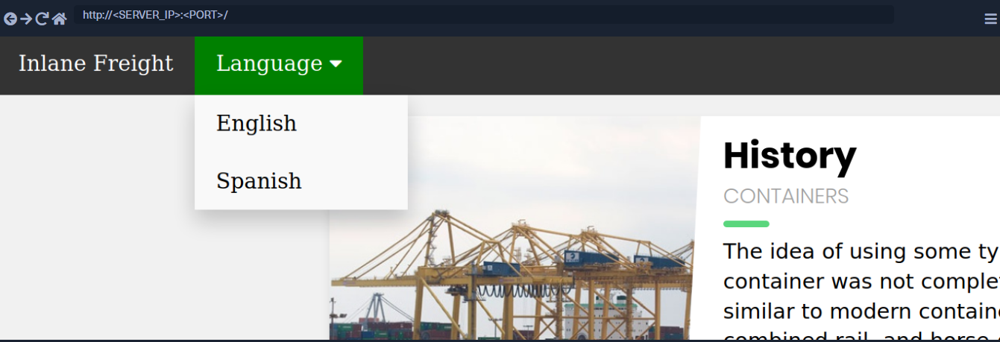

 

# 文件包含介绍

许多现代后端语言，如`PHP`、`Javascript`或`Java`，使用 HTTP 参数来指定网页上显示的内容，这允许构建动态网页，减少脚本的整体大小，并简化代码。在这种情况下，参数用于指定页面上显示的资源。如果此类功能没有安全编码，攻击者可能会操纵这些参数以显示托管服务器上任何本地文件的内容，从而导致本地[htb学院文件包含 (LFI)](https://owasp.org/www-project-web-security-testing-guide/v42/4-Web_Application_Security_Testing/07-Input_Validation_Testing/11.1-Testing_for_Local_File_Inclusion)漏洞。

## 本地htb学院文件包含 (LFI)

​	我们通常在其中找到 LFI 的最常见位置是模板引擎。为了让大多数 Web 应用程序在页面之间导航时看起来相同，模板引擎显示一个显示公共静态部分（例如 、 和 ）的页面，然后动态加载`header`页面`navigation bar`之间`footer`变化的其他内容。

​	否则，当对任何静态部分进行更改时，服务器上的每个页面都需要修改。这就是为什么我们经常看到像的参数`/index.php?page=about`，其中`index.php`设置了静态内容（例如页眉/页脚），然后只拉取参数中指定的动态内容，在这种情况下可能会从一个名为 about.php的文件中读取`

因为我们可以控制`about`请求的一部分，可以让 Web 应用程序抓取其他文件并将它们显示在页面上。

​	LFI 漏洞可能导致源代码泄露、敏感数据暴露，甚至在某些情况下会导致远程代码执行。泄露的源代码可能允许攻击者测试其他漏洞的代码，这可能会揭示以前未知的漏洞。

​	此外，泄露的敏感数据可能使攻击者能够枚举远程服务器的其他弱点，甚至泄露可能允许他们直接访问远程服务器的凭据和密钥。

​	在特定条件下，LFI 还可能允许攻击者在远程服务器上执行代码，这可能会危及整个后端服务器以及与其连接的任何其他服务器。

## 易受攻击代码示例

​	让我们看一些易受htb学院htb学院文件包含攻击的代码示例，以了解此类漏洞是如何发生的。如前所述，文件包含漏洞可能出现在许多最流行的 Web 服务器和开发框架中，例如`PHP`、`NodeJS`、`Java`、`.Net`和许多其他框架。它们中的每一个都有略微不同的方法来包含本地文件，但它们都有一个共同点：从指定路径加载文件。

​	这样的文件可以是动态标题或基于用户指定语言的不同内容。例如，页面可能有一个`?language`GET 参数，如果用户从下拉菜单中更改语言，则将返回相同的页面，但带有不同的参数`language`（例如`?language=es`）。在这种情况下，更改语言可能会更改 Web 应用程序从中加载页面的目录（例如`/en/`或`/es/`）。如果我们能够控制被加载的路径，那么我们就可以利用这个漏洞来读取其他文件，并有可能达到远程代码执行。

#### PHP

​	在 中`PHP`，我们可能会`include()`在加载页面时使用该函数来加载本地或远程文件。如果`path`传递给 的`include()`取自用户控制的参数，如`GET`参数和`the code does not explicitly filter and sanitize the user input`，则代码容易受到htb学院文件包含的攻击。以下代码片段显示了一个示例：

代码：php

```php
if (isset($_GET['language'])) {
    include($_GET['language']);
}
```

​	我们看到`language`参数是直接传递给`include()`函数的。因此，我们传入`language`参数的任何路径都将加载到页面上，包括后端服务器上的任何本地文件。这不是该`include()`函数独有的，因为如果我们控制传递给它们的路径，还有许多其他 PHP 函数会导致相同的漏洞。此类函数包括`include_once()`、`require()`、`require_once()`、`file_get_contents()`和其他几个函数。

**	注意：**在本单元中，我们将主要关注在 Linux 后端服务器上运行的 PHP Web 应用程序。然而，大多数技术和攻击都适用于大多数其他框架，因此我们的示例与使用任何其他语言编写的 Web 应用程序相同。

#### NodeJS

与 PHP 一样，NodeJS 网络服务器也可以根据 HTTP 参数加载内容。`language`以下是如何使用 GET 参数控制将哪些数据写入页面的基本示例：

代码：javascript

```javascript
if(req.query.language) {
    fs.readFile(path.join(__dirname, req.query.language), function (err, data) {
        res.write(data);
    });
}
```

如我们所见，函数使用从 URL 传递的任何参数`readfile`，然后将文件内容写入 HTTP 响应。另一个例子是框架`render()`中的函数`Express.js`。以下示例显示使用`language`参数来确定应从哪个目录`about.html`中提取页面：

代号：js

```js
app.get("/about/:language", function(req, res) {
    res.render(`/${req.params.language}/about.html`);
});
```

`?`与我们之前在 URL 中的( ) 字符之后指定 GET 参数的示例不同，上面的示例从 URL 路径（例如`/about/en`or `/about/es`）中获取参数。由于该参数直接在`render()`函数中用于指定呈现的文件，我们可以更改 URL 以显示不同的文件。

#### Java

相同的概念适用于许多其他 Web 服务器。以下示例显示了 Java Web 服务器的 Web 应用程序如何根据指定参数使用以下函数包含本地文件`include`：

代码：jsp

```jsp
<c:if test="${not empty param.language}">
    <jsp:include file="<%= request.getParameter('language') %>" />
</c:if>
```

该`include`函数可以将文件或页面 URL 作为其参数，然后将对象呈现到前端模板中，类似于我们之前在 NodeJS 中看到的模板。该`import`函数还可用于呈现本地文件或 URL，例如以下示例：

代码：jsp

```jsp
<c:import url= "<%= request.getParameter('language') %>"/>
```

#### .NET

最后，让我们举一个例子来说明htb学院文件包含漏洞是如何在 .NET Web 应用程序中发生的。该`Response.WriteFile`函数的工作方式与我们之前的所有示例非常相似，因为它采用文件路径作为输入并将其内容写入响应。可以从动态内容加载的 GET 参数中检索路径，如下所示：

代号：cs

```cs
@if (!string.IsNullOrEmpty(HttpContext.Request.Query['language'])) {
    <% Response.WriteFile("<% HttpContext.Request.Query['language'] %>"); %> 
}
```

此外，该`@Html.Partial()`函数还可以用于将指定文件渲染为前端模板的一部分，类似于我们之前看到的：

代号：cs

```cs
@Html.Partial(HttpContext.Request.Query['language'])
```

最后，该`include`函数可用于呈现本地文件或远程 URL，也可执行指定的文件：

代号：cs

```cs
<!--#include file="<% HttpContext.Request.Query['language'] %>"-->
```

## 读取与执行

从上面的所有例子中我们可以看出，htb学院文件包含漏洞可能出现在任何Web服务器和任何开发框架中，因为它们都提供加载动态内容和处理前端模板的功能。

要记住的最重要的事情是`some of the above functions only read the content of the specified files, while others also execute the specified files`。此外，其中一些允许指定远程 URL，而另一些仅适用于后端服务器的本地文件。

下表显示了哪些函数可以执行文件，哪些函数只读取文件内容：

| **Function**                 | **Read Content** | **Execute** | **Remote URL** |
| ---------------------------- | ---------------- | ----------- | -------------- |
| **PHP**                      |                  |             |                |
| `include()`/`include_once()` | ✅                | ✅           | ✅              |
| `require()`/`require_once()` | ✅                | ✅           | ❌              |
| `file_get_contents()`        | ✅                | ❌           | ✅              |
| `fopen()`/`file()`           | ✅                | ❌           | ❌              |
| **NodeJS**                   |                  |             |                |
| `fs.readFile()`              | ✅                | ❌           | ❌              |
| `fs.sendFile()`              | ✅                | ❌           | ❌              |
| `res.render()`               | ✅                | ✅           | ❌              |
| **Java**                     |                  |             |                |
| `include`                    | ✅                | ❌           | ❌              |
| `import`                     | ✅                | ✅           | ✅              |
| **.NET**                     |                  |             |                |
| `@Html.Partial()`            | ✅                | ❌           | ❌              |
| `@Html.RemotePartial()`      | ✅                | ❌           | ✅              |
| `Response.WriteFile()`       | ✅                | ❌           | ❌              |
| `include`                    | ✅                | ✅           | ✅              |

这是一个需要注意的显着差异，因为执行文件可能允许我们执行函数并最终导致代码执行，而仅读取文件的内容只能让我们读取源代码而不执行代码。此外，如果我们可以在白盒练习或代码审计中访问源代码，了解这些操作有助于我们识别潜在的htb学院文件包含漏洞，特别是如果它们有用户控制的输入。

在所有情况下，htb学院文件包含漏洞都很严重，最终可能会危及整个后端服务器。即使我们只能阅读 Web 应用程序源代码，它仍然可能让我们破坏 Web 应用程序，因为它可能会揭示前面提到的其他漏洞，并且源代码还可能包含数据库密钥、管理员凭据或其他敏感信息。


# 本地htb学院文件包含 (LFI)

现在我们了解了什么是htb学院文件包含漏洞以及它们是如何发生的，我们可以开始学习如何在不同的场景中利用这些漏洞来读取后端服务器上本地文件的内容。

## 基础低频

本节末尾的练习向我们展示了一个允许用户将语言设置为英语或西班牙语的网络应用程序示例：



如果我们通过单击选择一种语言（例如`Spanish`），我们会看到内容文本变为西班牙语：


​	我们还注意到 URL 包含一个`language`参数，该参数现在设置为我们选择的语言 ( `es.php`)。可以通过多种方式更改内容以匹配我们指定的语言。

​	它可能会根据指定的参数从不同的数据库表中提取内容，或者可能会加载完全不同版本的 Web 应用程序。然而，如前所述，使用模板引擎加载页面的一部分是最简单和最常用的方法。

​	因此，如果 Web 应用程序确实正在拉取一个现在包含在页面中的文件，我们可以更改被拉取的文件以读取不同本地文件的内容。大多数后端服务器上都有两个常见的可读文件，它们分别`/etc/passwd`位于 Linux 和`C:\Windows\boot.ini`Windows 上。因此，让我们将参数从更改`es`为`/etc/passwd`：


正如我们所看到的，该页面确实存在漏洞，我们能够读取文件内容`passwd`并识别后端服务器上存在哪些用户。

## 路径遍历

`absolute path`在前面的示例中，我们通过指定文件(eg )来读取文件`/etc/passwd`。如果整个输入在`include()`函数中使用而没有任何添加，这将起作用，如下例所示：

代码：php

```php
include($_GET['language']);
```

在这种情况下，如果我们尝试读取`/etc/passwd`，那么该`include()`函数将直接获取该文件。然而，在许多情况下，Web 开发人员可能会在参数中附加或预先添加一个字符串`language`。例如`language`参数可以用于文件名，也可以加在目录后面，如下：

代码：php

```php
include("./languages/" . $_GET['language']);
```

在这种情况下，如果我们尝试读取`/etc/passwd`，则传递给的路径`include()`将是 ( `./languages//etc/passwd`)，并且由于该文件不存在，我们将无法读取任何内容：


正如预期的那样，返回的详细错误向我们展示了传递给函数的字符串，说明语言目录中`include()`没有。`/etc/passwd`

**	注意：**我们仅出于教育目的在此 Web 应用程序上启用 PHP 错误，因此我们可以正确理解 Web 应用程序如何处理我们的输入。对于生产 Web 应用程序，不应显示此类错误。此外，我们所有的攻击都应该没有错误，因为它们不依赖于它们。

​	我们可以通过使用遍历目录轻松绕过此限制`relative paths`。为此，我们可以`../`在我们的文件名前添加，它指的是父目录。例如，如果语言目录的完整路径是`/var/www/html/languages/`，那么 using`../index.php`将引用`index.php`父目录中的文件（即`/var/www/html/index.php`）。

所以，我们可以使用这个技巧返回几个目录，直到我们到达根路径（即`/`），然后指定我们的绝对文件路径（例如`../../../../etc/passwd`），并且该文件应该存在：


正如我们所见，这次我们能够读取文件，而不管我们所在的目录。即使在函数中使用了整个参数，这个技巧也会起作用，所以我们可以默认使用这种技术，它应该`include()`在两种情况。此外，如果我们位于根路径 ( `/`) 并使用`../`，那么我们仍将保留在根路径中。所以，如果我们不确定 Web 应用程序所在的目录，我们可以添加`../`多次，并且它不应该破坏路径（即使我们这样做一百次！）。

**提示：**提高效率并且`../`不多次添加不必要的东西总是有用的，尤其是当我们正在编写报告或编写漏洞时。所以，总是尝试找到最小数量的`../`有效并使用它。您还可以计算出您距离根路径有多少个目录并使用这些目录。例如，with `/var/www/html/`we are `3`directorys away from the root path，所以我们可以使用`../`3 次（即`../../../`）。

## 文件名前缀

在我们前面的例子中，我们使用了`language`目录后面的参数，所以我们可以遍历路径来读取文件`passwd`。在某些情况下，我们的输入可能会附加在不同的字符串之后。例如，它可以与前缀一起使用以获得完整的文件名，如下例所示：

代码：php

```php
include("lang_" . $_GET['language']);
```

在这种情况下，如果我们尝试使用 遍历目录`../../../etc/passwd`，最终的字符串将是`lang_../../../etc/passwd`，这是无效的：


​	正如预期的那样，该错误告诉我们该文件不存在。所以，不是直接使用路径遍历，我们可以`/`在 payload 前加上 a 前缀，这应该将前缀视为一个目录，然后我们应该绕过文件名并能够遍历目录：


**注意：**这可能并不总是有效，因为在此示例中，名为的目录`lang_/`可能不存在，因此我们的相对路径可能不正确。此外，`any prefix appended to our input may break some file inclusion techniques`我们将在接下来的部分中讨论，例如使用 PHP 包装器和过滤器或 RFI。

## 附加扩展

另一个非常常见的例子是将扩展名附加到`language`参数时，如下所示：

代码：php

```php
include($_GET['language'] . ".php");
```

这很常见，因为在这种情况下，我们不必在每次需要更改语言时都编写扩展。这也可能更安全，因为它可能会限制我们只包含 PHP 文件。在这种情况下，如果我们尝试读取`/etc/passwd`，那么包含的文件将是`/etc/passwd.php`，它不存在：


我们可以使用多种技术来绕过它，我们将在接下来的部分中讨论它们。

**练习：**尝试通过 LFI 读取任何 php 文件（例如 index.php），看看您是否会得到它的源代码，或者文件是否被呈现为 HTML。

## 二阶攻击

正如我们所见，LFI 攻击可以有不同的形式。另一种常见且更高级的 LFI 攻击是`Second Order Attack`. 发生这种情况是因为许多 Web 应用程序功能可能会根据用户控制的参数不安全地从后端服务器中提取文件。

例如，Web 应用程序可能允许我们通过像 ( `/profile/$username/avatar.png`) 这样的 URL 下载我们的头像。如果我们设计了一个恶意的 LFI 用户名（例如`../../../etc/passwd`），那么就有可能将被拉取的文件更改为服务器上的另一个本地文件并获取它而不是我们的头像。

在这种情况下，我们将在我们的用户名中使用恶意 LFI 有效载荷来毒害数据库条目。然后，另一个 Web 应用程序功能将利用这个中毒的条目来执行我们的攻击（即根据用户名值下载我们的头像）。这就是为什么这种攻击被称为`Second-Order`攻击。

开发人员通常会忽视这些漏洞，因为它们可能会防止用户直接输入（例如来自参数`?page`），但他们可能会信任从数据库中提取的值，例如本例中的用户名。如果我们在注册过程中设法毒化我们的用户名，那么攻击就有可能发生。

使用二阶攻击利用 LFI 漏洞类似于我们在本节中讨论的内容。唯一的差异是我们需要发现一个函数，该函数根据我们间接控制的值提取文件，然后尝试控制该值以利用该漏洞。

**注意：**本节中提到的所有技术都应该适用于任何 LFI 漏洞，无论后端开发语言或框架如何。
