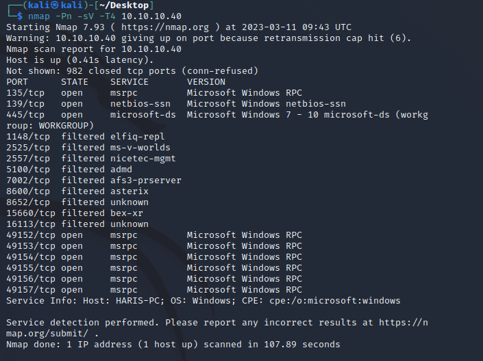
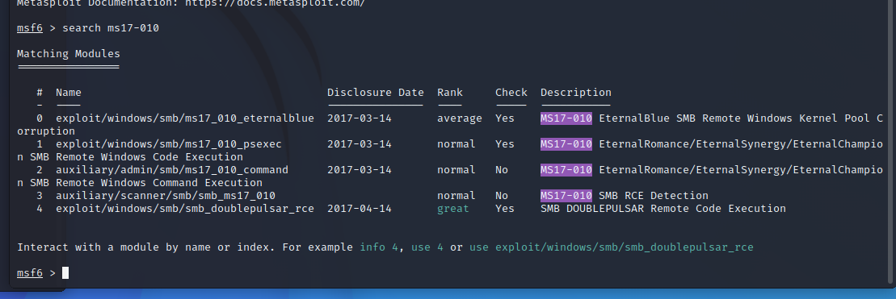
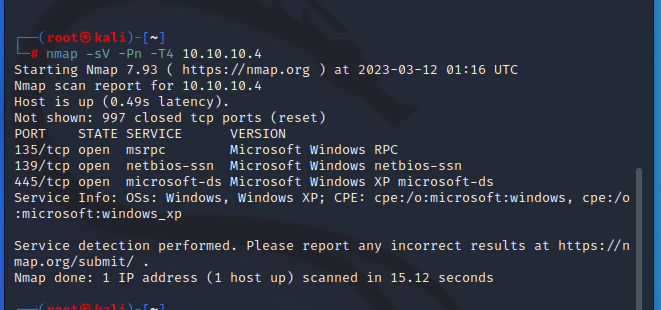
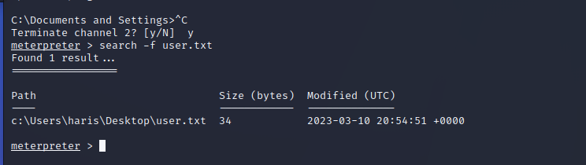
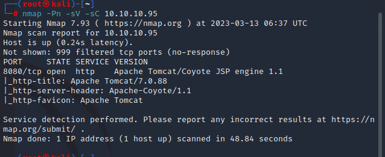
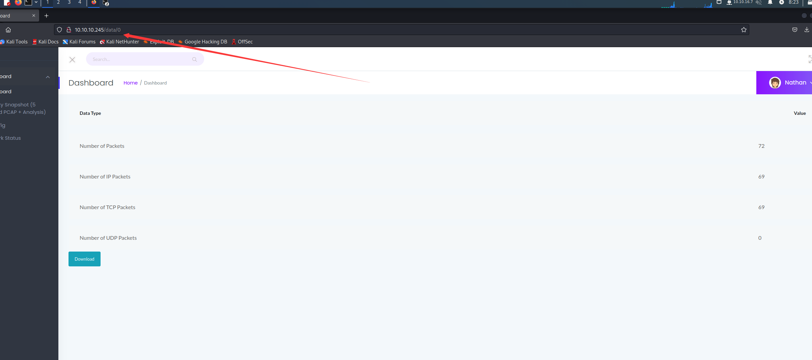
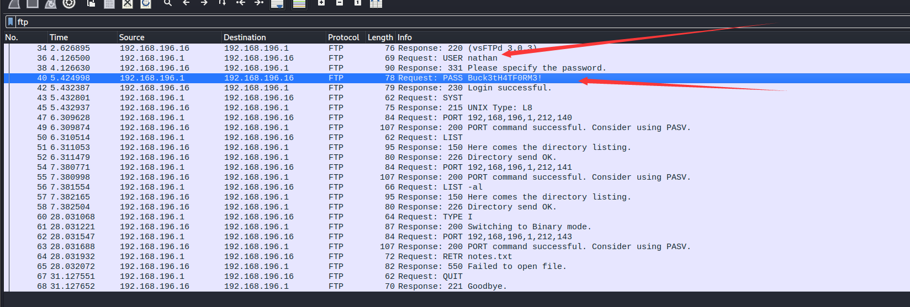
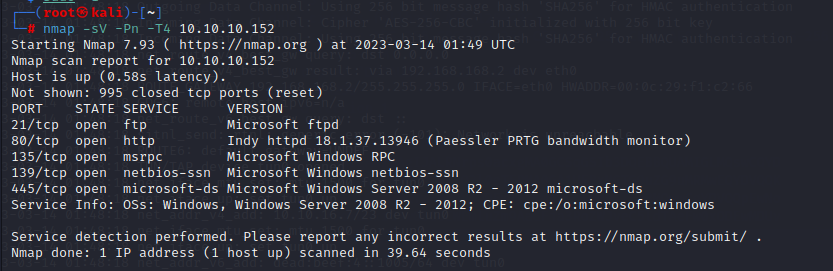

# Blue




Nmap 发现以下开放端口：

- 135 – 由远程过程调用 (RPC) 使用
- 139/445 – 由服务器消息块 (SMB) 使用
- 4915X – 由 Microsoft Windows RPC (MSRPC) 使用
- 

看见有一个 445 端口的  Microsoft Windows 7 - 10 microsoft-ds (workgroup: WORKGROUP)

`nmap`具有`vuln`检查服务中已知漏洞的脚本

```
nmap -p 445 --script=vuln 10.10.10.40
```

扫一下445端口

扫到了一个高危漏洞，可以用ms17010打



由于不知道版本号 可以用

我猜序号 1  于是

use 1

然后 设置 RHOST  和LHOST    运行

直接shell

ok


# Legacy

```
nmap -sV -Pn -T4 10.10.10.
```



```
nmap -p139,445 --script vuln 10.10.10.43
```

对于这一步，我们要扫描 445 以确定版本，因此我们在 Metasploit 中搜索 SMB (Samba) 扫描器。

启动

```
msfconsole 
```

查一下

```
search SMB/smb
```


这里' *RHOSTS* '必须设置为受害者的IP。另外，增加*THREADS*是个好主意。由于笔记本电脑的电池耗尽，我没有增加这么多。我早期没能学到的一个有价值的命令是未设置的。使用此命令将模块的选项设置回默认值/空白，即“ *unset RHOSTS* ”重置值


然后打成功，先别进去 看看flag在哪

```
search -f user.txt
```




## 利用后枚举
当前用户当前用户

```
 whoami /all
```

## 查找打开的端口

```
netstat -ano | findstr /i listen
```

## 查看一下系统信息和权限

```text
meterpreter > getuid
Server username: NT AUTHORITY\SYSTEM
meterpreter > sysinfo
Computer        : LEGACY
OS              : Windows XP (5.1 Build 2600, Service Pack 3).
Architecture    : x86
System Language : en_US
Domain          : HTB
Logged On Users : 1
Meterpreter     : x86/windows

```


## 找flag

d2e8e01df2f523e8c0adfd3bb57e69c9

5331a8b8e16f68d9a0196595b320382c

这俩都不是


## 问题 

smb是什么

# Jerry




我们看到它在端口 8080 上运行 Apache Tomcat，因此我们的第一直觉是访问该页面。

随便点点发现出来了 登录窗口

我设置为用户名为“tomcat”，密码为“s3cret”

进去发现好像是个身份验证的上传的漏洞

有一个上传 WAR 文件的选项，它基本上是 Web 应用程序的 JAR 文件。

直接用 msfconsole

使用 use multi/http/tomcat_mgr_upload 配置一下就行了

# Cap

老规矩nmap ，给出的东西像是html网页 所以我直接打开了

 然后摸索了一会 发现下载了几个pacap包 之后箭头指向变成2 了 所以我把数字改为0 发现有数值 这时候再下载pacape包





包里面有tcp和 ftp 研究一下





发现有账户名和密码

nathan 
Buck3tH4TF0RM3!
试试用ssh登录


**Telnet与SSH有啥区别？**

1、加密方式不同：telnet是明码传输，SSH是加密传输。telnet通过TCP/IP协议簇来访问远程终端，传输的数据和口令是明文形式，相对来说不安全； SSH相对于telnet安全，它的传输方式是以加密形式传输。

2、功能不同：SSH功能比telnet齐全，它既可以代替telnet进行远程管理终端，又可以为ftp、pop、基础PPP提供一个安全的通道。

3、端口号不同：telnet 端口号为23；SSH端口号为22。

4、防火墙信任度不同：默认情况下防火墙是不信任telnet的，因为它不安全。

# Netmon



在这里，我发现 FTP 端口 21、HTTP 端口 80、RPC 端口 135、NetBIOS 端口 139、SMB 端口 445 已打开，其余端口已被过滤。

当我们看到它打开时，我们立即前往端口 80。我们找到 PRTG 网络监控页面。但是要使用此仪表板，我们需要登录凭据。但我们现阶段无法访问这些凭据。

在之前的 nmap 扫描中，我们看到 FTP 端口 21 是开放的，也允许匿名登录。因此，我们使用匿名作为登录名和密码登录 FTP

成功登录后，我们使用 ls 命令列出所有共享的文件。我们看到我们的用户目录可用，所以我们使用 cd 命令遍历它。在这里，我们还有 2 个目录，Administrator 和 Public。我们无权访问管理员目录，因此我们进入公共目录。在这里我们找到了 user.txt 文件。我们使用 get 命令将此文件下载到我们的系统中。因此，我们得到了第一个标志，即；用户标志。

# bank

dig axfr bank.htb @10.10.10.29

```
──(root㉿kali)-[~]
└─#  dig axfr bank.htb @10.10.10.29

; <<>> DiG 9.18.12-1-Debian <<>> axfr bank.htb @10.10.10.29
;; global options: +cmd
bank.htb.               604800  IN      SOA     bank.htb. chris.bank.htb. 2 604800 86400 2419200 604800
bank.htb.               604800  IN      NS      ns.bank.htb.
bank.htb.               604800  IN      A       10.10.10.29
ns.bank.htb.            604800  IN      A       10.10.10.29
www.bank.htb.           604800  IN      CNAME   bank.htb.
bank.htb.               604800  IN      SOA     bank.htb. chris.bank.htb. 2 604800 86400 2419200 604800
;; Query time: 251 msec
;; SERVER: 10.10.10.29#53(10.10.10.29) (TCP)
;; WHEN: Mon Jul 31 14:20:38 CST 2023
;; XFR size: 6 records (messages 1, bytes 171)

```

```
gobuster
```

当一个IP地址重定向多个域名时，这意味着多个网站或web应用程序托管在同一台服务器上，并且它们都与该IP地址相关联。每个域名的内容可能打开不同的原因可以归因于服务器的配置方式和每个网站的具体设置。

​	以下是一些可能导致每个域的内容以不同方式打开的因素:

虚拟主机配置:Web服务器通常使用虚拟主机在单个IP地址上为多个网站提供服务。每个域名都与一个特定的虚拟主机配置相关联，它决定了如何将传入的请求路由到正确的网站内容和文件。

​	每个虚拟主机可以有不同的设置，例如文档根目录、默认页面、安全设置等。Web应用程序或网站配置:每个网站或Web应用程序可能使用不同的技术或框架构建，并且它们的配置文件可以指定各种设置。这些设置可以包括特定于每个域的页面布局、主题、样式和内容。服务器上的内容:每个域在服务器上呈现的内容和文件可能不同。每个网站可能都有自己的HTML、CSS、JavaScript、图像、视频、数据库等。因此，当您访问特定的域时，服务器将提供特定于该域的内容。

​	域重定向:一些域可能设置了HTTP重定向，这意味着当您访问一个域时，您可能会自动重定向到另一个域或特定页面。这可能导致浏览器中显示不同的内容。内容管理系统(CMS):如果不同的域使用不同的CMS平台，如WordPress、Joomla或Drupal，每个CMS可以以不同的方式管理和显示内容。模板、插件和主题可能因站点而异。动态内容生成:一些网站根据用户输入或其他因素动态生成内容。这些动态元素可以导致在不同的域中显示不同的内容。访问控制:访问控制设置在不同的域之间可能不同，这意味着某些内容可能在一个域中可以访问，但在另一个域中受到限制。服务器端配置:服务器的配置也会影响内容的提供方式。例如，服务器模块、安全设置、缓存机制和压缩设置都可以在内容的呈现方式中发挥作用。

​	总的来说，每个域的内容打开方式的差异主要是由于与共享IP地址上托管的每个网站或web应用程序相关的单个配置、设置和内容
