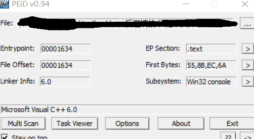
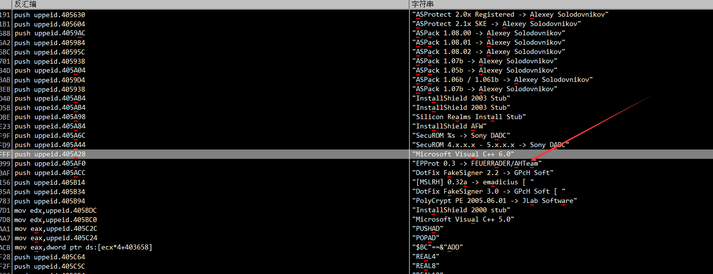
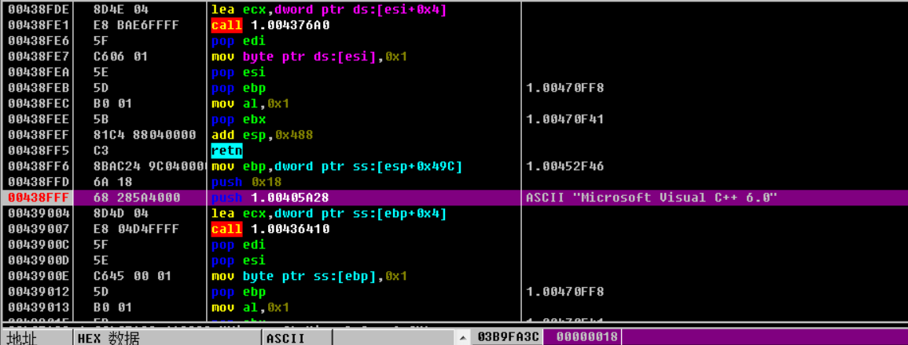
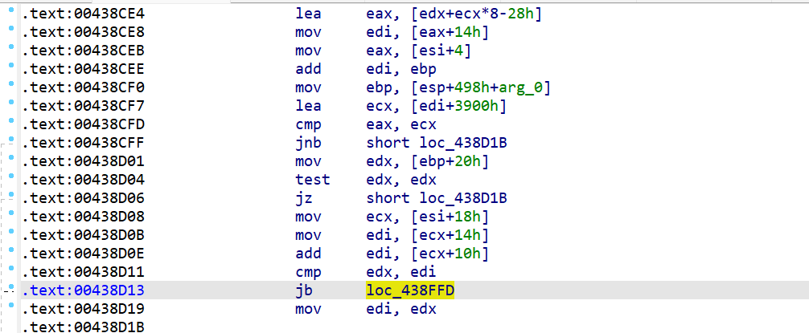
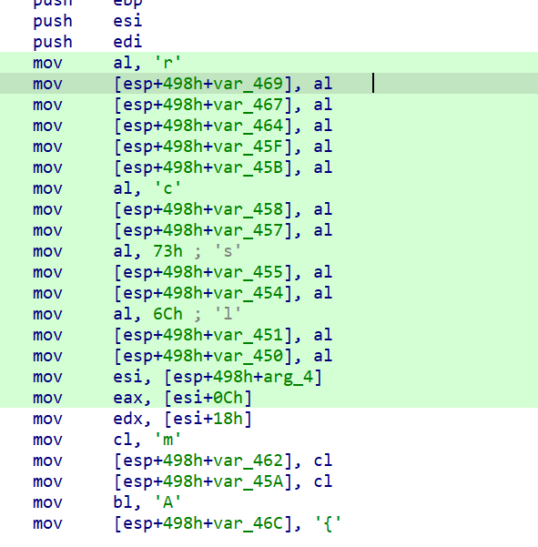
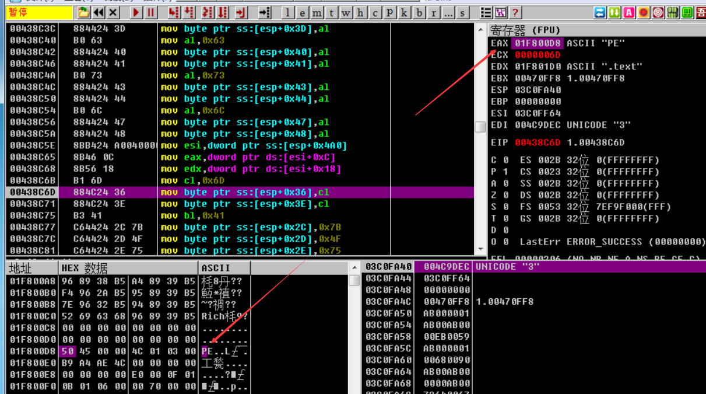
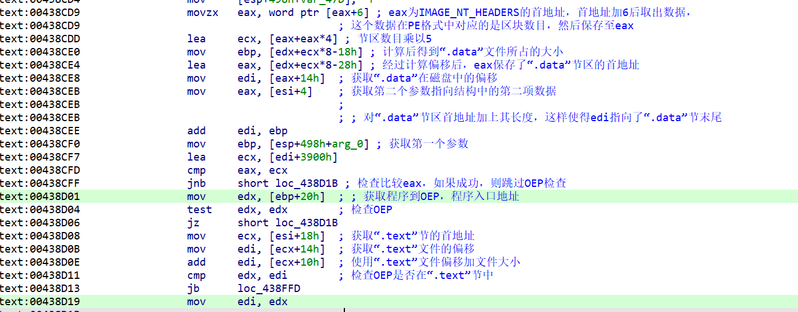
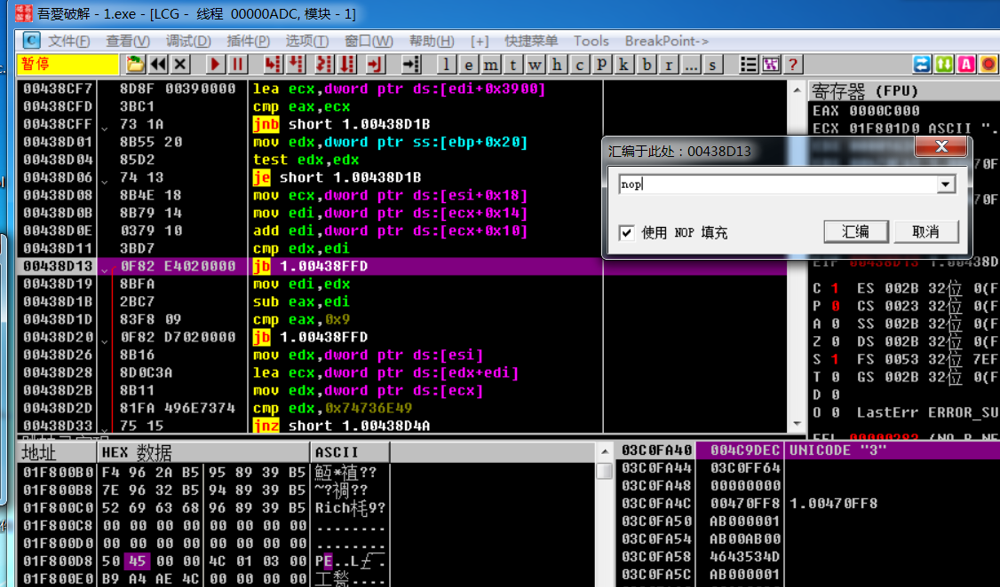
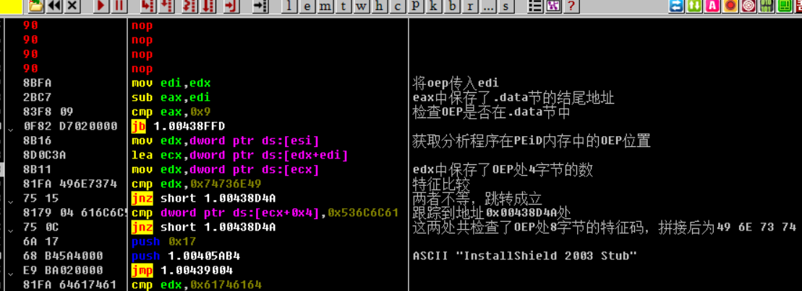
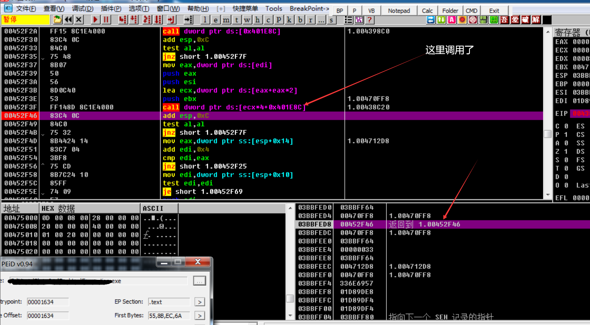

# 怎么识别的开发环境的呢？

先体验一下功能



把pe文件拖进去就会出现 c++6.0这一行字符串


我在creatfile下断点 没有段下来 我在creatfile内部下断点断下来了，说明是函数指针下的断点


首先要有一个思路 他既然显示出来字符串 说明他内部肯定有一个判断 然后跳转到相对于的版本就是跳转到相对应的字符串

我们在od里面查找这个字符串，



找到了 你会发现这里面非常多的版本 包括一些壳的版本



下个断点跑过来

跑过来之后  在ida里面x交叉引用 发现了00438D13这个地址


这是一个比较跳转指令，是根据edx与edi中的比较结果确定的。



把这两个寄存器搞懂、

往上翻 发现了一堆局部变量 怀疑是数组初始化 范围是488-450




od里面调试 此时eax的值是IMAGE_NT_HEADERS头部所在的地址

edx的值就是text节区的首地址






进入函数不久后就定义了一个很大的数组， 并对数组进行初始化。这个数组中存放的数据为相关特征码。

经过分 析，此段代码只检查了OEP是否在“.text”中，若条件成立，则跳转到 显示编译器版本的代码处。 虽然成功地找到了VC++ 6.0的判定流程，但由于第一个条件判 断就确定了结果，导致之前定义的相关特征码都没有用到。

如果不跳转呢 也就是判断失败了 怎么办 我们把这个跳转nop了再来研究研究








VC++6.0程序的流程。如果OEP不在“.text”节中，程序会先根据入 口特征码比较oep入口处的8字节机器码，

分析目标是否为其他编译器 生成的。如果不符合特征，将会调整OEP，

加入文件偏移与虚拟地址 偏移的转换过程，再次用特征码对比OEP处的机器码。如符合特征， 则程序流程进入字符串“Microsoft Visual C++ 6.0”的文本输出部 分。


VC++ 6.0的判定过程不是已经 在函数地址0x00438D13中了吗？

如果你这样想，那就大错特错了， 地址0x00438D13已经是判定过程的结尾了。


OllyDbg的栈窗口，根据函数的调用机制，函数被调用后会在栈的最 顶端压入函数的返回地址，这样就给了我们线索。 事不宜迟，在00438C20 地址处设置断点，运行程序并查看栈 窗口信息



0x00452F3F处就是判断函数的返回地 址。

从寻址方式上观察，这是一个存放函数指针的数组类型，首地址 在0x00401E8C处，ecx保存了数组的下标值。这个下标值又是由

eax计算所得，以此为线索即可找到PEiD的分析答案。首先来观察一 下这个函数指针数组，

往上翻到这个函数开头452E90


# 伪造开发环境

如何将用Microsoft Visual Studio 2005编写的程序伪装 成VC++ 6.0编写的程序呢？

找到PEiD检查PE文件的相关流程即可。 

PEiD的检查流程如下。 

检查OEP是否合法。 

提取OEP地址处相关的机器码，用于特征码的比较。 

检查“.rdata”节是否存在。

 检查OEP是否处于“.text”节中。

 在这几个步骤中，最重要的一个步骤是特征码比较，因此伪装时 需要伪造机器码。那么PEiD检查VC++ 6.0的机器码的相关特征都有

```
OEP + 0x0 对应机器码 0x55
OEP + 0x1 对应机器码 0x8B
OEP + 0x2 对应机器码 0xEC
OEP + 0x3 对应机器码 0x6A
OEP + 0x4 对应机器码 0xFF
OEP + 0x5 对应机器码 0x68
OEP + 0xA 对应机器码 0x68OEP + 0xF 对应机器码 0x64
OEP + 0x10 对应机器码 0xA1
OEP + 0x11 对应机器码 0x00
OEP + 0x16 对应机器码 0x64
OEP + 0x18 对应机器码 0x00
OEP + 0x1D 对应机器码 0x83
OEP + 0x1E 对应机器码 0xEC

```

有了这些机器码以及对应OEP的位置，就可以开始伪造机器码 了。先使用OllyDbg打开要伪造的目标程序，如图14-9所示

打开后，代码停留在地址0x004012C2处，这个地址是目标程序 的OEP。因为PEiD需要对OEP处的机器码进行检查，所以首要任务是 伪造这些参与检查的机器码。注意，不能直接修改OEP处的代码，因 为这样会破坏原有程序中的机器码，极有可能影响程序的运行。因 此，需要在程序中找到一段空白，将对比机器码填写进去。不能随意 使用这个空白处，必须要在“.text”节指定的范围内使用，否则即便通 过了机器码与特征码的检查，也无法通过后期VC++ 6.0的判定过 程。经过分析后，在伪造程序中找到符合要求的空白代码处，将已知 的对比机器码填写到此段空白处

