# 编写驱动程序

## 驱动分类简述

驱动大体分为三种，分别是：NT式驱动、WDM式驱动、WDF式驱动（KWDF内核驱动,UWDF用户驱动）。

### NT式驱动

NT虚拟驱动，老式驱动，从WIN95开始使用NT式驱动。 若所开发的驱动不与硬件打交道，建议使用NT式驱动或WDM式驱动。如果NT式驱动出现了绑定设备的情况，该驱动将无法卸载。只能通过重启系统进行卸载。对于服务器来说重启很伤。比如说你要插个鼠标 就要重启

### WDM式驱动

相对于NT式驱动来讲，WDM式驱动支持卸载（热拔插）。无需重启即可卸载。并且WDM式驱动对于NT式驱动进行了一些封装和优化。本质区别不大。

### WDF式驱动

WDF式驱动相较前两种，其最大的意义是简化开发。不像NT与WDM驱动那么底层化。WDF式驱动将WDM式驱动进行了封装，做成了一套架构，使得开发驱动变得更简单。同时带来的弊端就是无法掌控底层。

由于开发简便，不容易蓝屏，所以公司开发驱动一般选用WDF式驱动。

想要学习WDF式驱动，需要了解COM相关知识。

只有系统中存在WDFLDR.sys驱动，我们编写的WDF驱动才可以跑起来。并且项目中需要一个inf文件，NT/WDM式驱动则不需要这个inf文件。

# 创建驱动项目

## 创建项目

打开VS2017，新建项目选择Visual C++ -> Windwos Drivers -> Legacy -> Empty WDM Driver

右键SourceFiles目录，新建项。创建一个扩展名为C的C++文件。（不要用cpp扩展名）。文件名随意起，不是非要和项目名一样。

 在.c文件中先引入头文件 `ntifs.h`。

删除INF文件

## 驱动入口函数（DriverEntry）

```
#include "ntifs.h"
NTSTATUS DriverEntry(PDRIVER_OBJECT DriverObject,PUNICODE_STRING RegistryPath){
    //代码
    return STATUS_UNSUCCESSFUL;
}
```

DriverEntry是我们写代码时的入口函数。其编译生成的sys文件真正的入口点并不是DriverEntry。在IDA中可以看到驱动真正的入口点函数是GsDriverEntry。其内部调用了我们的DriverEntry函数。这个函数的返回值是一个NTSTATUS类型，这个返回值的宏定义在ntstatus.h这个头文件中
2 参数PDRIVER_OBJECT

它代表的是windows中的一个指向驱动对象的指针，前面的P就是Pointer的意思，这个驱动对象对应的就是我们要操作的.sys驱动

这个驱动对象是Windows系统中对某个驱动的唯一标识，里面包括了这个驱动的各种信息，各个功能函数的入口地址等重要信息，这些信息非常的庞大和复杂。

驱动对象一般包括一个及以上的设备对象，总之驱动就是要在一系列设备上进行信息交互实现功能。
3 参数PUNICODE_STRING

这是一个UNICODE类型的字符串，它代表了驱动在注册表中的参数所存放的位置，由于每个驱动都是以一个类似服务的形式存在，在系统注册表存放，注册表可以通过cmd输入regedit进入。

HKEY_LOCAL_MACHINE\SYSTEM\CurrentControlSet\Services

Windows内核在启动时加载了一个最小文件系统，分析磁盘并将注册表树下的所有内容读到内存中，这样保证这一部分的注册表内容在Windows内核刚加载之后就是可以读写状态。


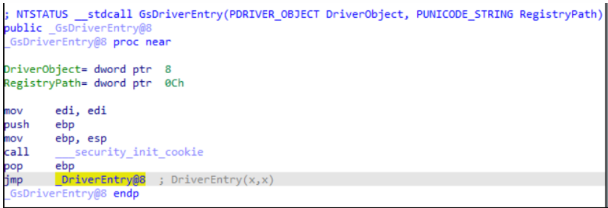


### 指定入口函数

如果不想让编译器生成GsDriverEntry而是直接将入口函数设置为DriverEntry，可以按照下图设置。

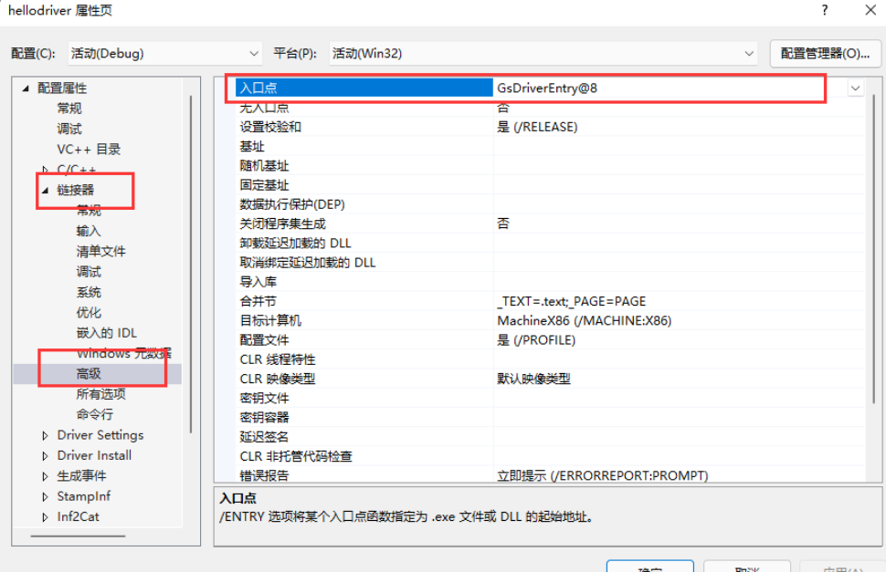

## 编写代码

```c
#include "ntddk.h"
 
void UnloadDriver(PDRIVER_OBJECT driver);
 
NTSTATUS DriverEntry(PDRIVER_OBJECT DriverObject, PUNICODE_STRING RegistryPath) {
    DbgBreakPoint();        //相当于 __asm{int 3}
    DbgPrint("驱动加载了。\r\n");    //驱动的打印函数，相当于3环的printf
    DriverObject->DriverUnload = UnloadDriver;    //为驱动指定卸载函数
    return STATUS_SUCCESS;
}
//驱动卸载函数
void UnloadDriver(PDRIVER_OBJECT driver) {
    DbgPrint("驱动停止了。\r\n");
}
```

## 打印字符串对象

如果想要打印字符串对象中的字符串，可以使用如下格式：

```c
NTSTATUS DriverEntry(PDRIVER_OBJECT DriverObject, PUNICODE_STRING pReg) {
    DbgPrint("-------%wZ--------",pReg);//传入字符串对象指针。
    return STATUS_SUCCESS;
}
```

## 生成驱动

点击生成解决方案即可。若报一些格式错误，就删除一些特殊符号之类的东西。

## 加载驱动（部署-启动-停止-卸载）

使用InstDrv.exe加载驱动。使用DbgView.exe查看输出（必须选中监视核心，否则无法监视驱动层输出）。

## 调试驱动

通过调用函数DbgBreakPoint为驱动增加一个断点。这个函数相当于int 3指令。

在虚拟机用驱动加载工具运行驱动我们生成的驱动

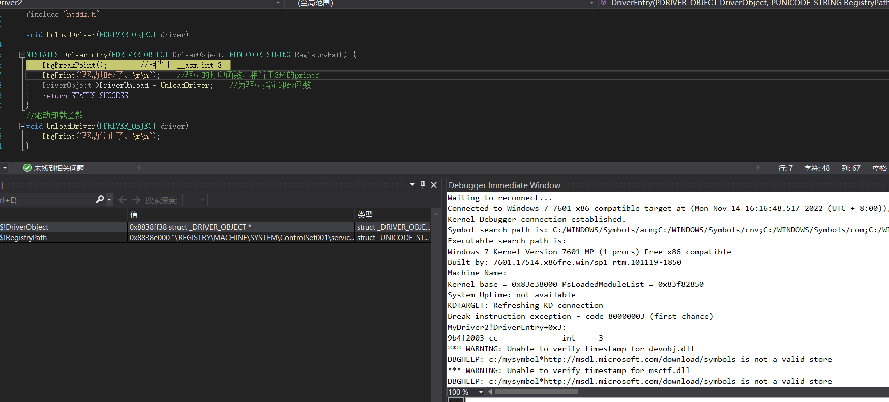

# 驱动对象PDRIVER_OBJECT初识

在成功断在我们的代码中后，查看驱动对象结构。

 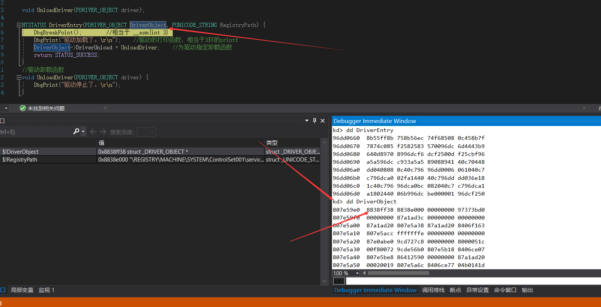


 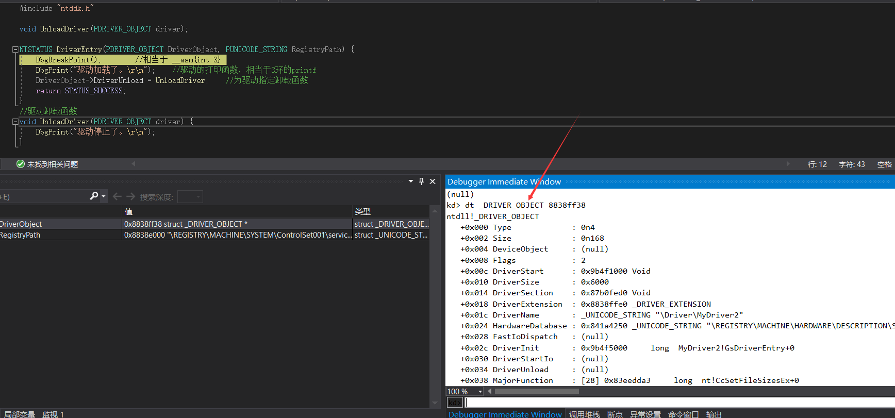

- Type：驱动对象类型。

- Size：驱动对象大小

- DeviceObject：设备对象，我们这里没添加设备，因此是null

- DriverStart：驱动文件基址，也就是PE格式中的ImageBase。通过db命令可以看到4D 5A。

-  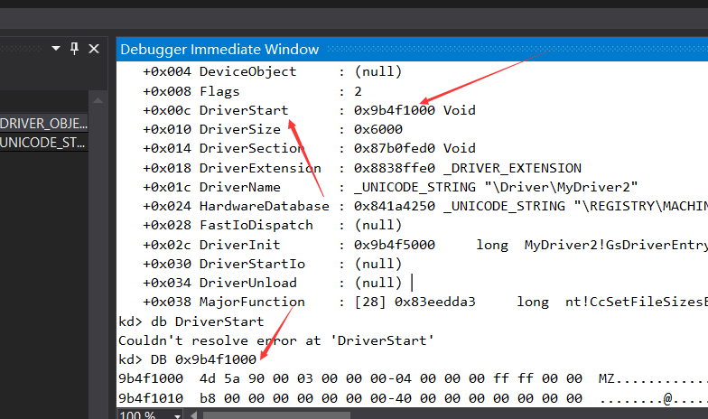

- DriverSize：驱动模块大小，也就是PE格式中的SizeOfImage。

- DriverExtension：驱动扩展对象。使用dt命令查看该对象

  

  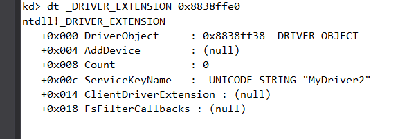

- DriverObject：指向当前驱动对象首地址。
- ServiceKeyName：驱动服务注册表文件夹名。

DriverName：驱动名，也就是驱动的文件名前面加个\Driver\。这个名字是个字符串结构体。

查看该字符串结构：

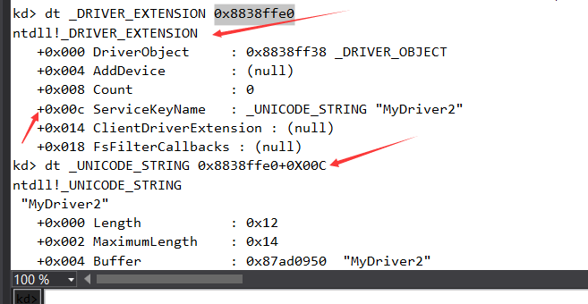


HardwareDatabase：驱动服务注册表路径。前往注册表查看该路径，可以发现一个名为“hellodriver”的文件夹，这就是我们的驱动。

 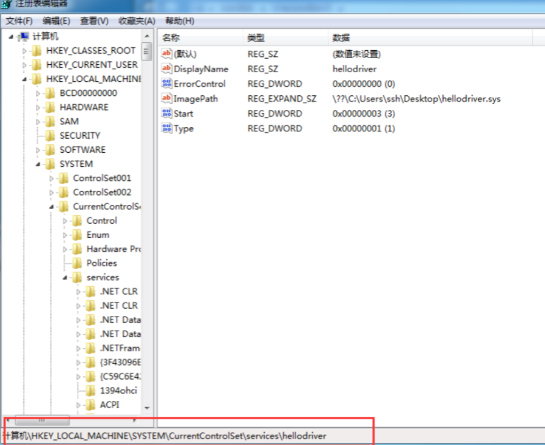

* DisplayName：驱动名

- ErrorControl：当驱动加载失败时会设置这个值。
- ImagePath：驱动文件路径。\??\是设备路径，我们平时访问各种文件夹其实都带这个\??\，只是windows底层帮我们补充了。
- Start：驱动加载类型。手动启动为3，开机自启为2，BIOS自启为1。
- Type：服务类型。1为驱动。
- DriverInit ：驱动入口点，也就是PE文件的AddressOfEntryPoint。
- DriverUnload：驱动卸载函数地址。

# 驱动加载方法

加载驱动大体分为两种：服务加载和直接加载。实际应用中可以将两种方法都利用上。

## 服务加载

1. 调用OpenSCManager打开服务控制。
2. 调用CreateService创建服务。实际上就是创建注册表相关键值。在执行完该API后，驱动已经被注册为服务了。这时我们通过CMD执行net start XXXX也可以加载我们的驱动。
3. 调用OpenService打开现有服务。
4. 调用StartService启动服务

这种方式实际上加载该驱动的进程，并不是调用API的进程。而是通过API向系统通知我要加载一个驱动。系统进程接收到通知后加入到系统中的一个队列。并由系统进程在某时某刻加载该驱动。

也就是这种方式是通知系统进程来进行加载。

## 直接加载

调用ZwLoadDriver或NtLoadDriver加载一个已被正确注册的驱动。

这种方法需要我们自己手动去注册表内注册该驱动的相关信息。这样该驱动才可以被加载。

直接加载的方式在调用API后就会直接加载该驱动，所以该驱动的加载者就是调用该API的进程。相比于服务加载会留下痕迹。

# 第一个练习

编写两个驱动A和B，在A中定义全局变量值为100，打印A的地址pA。在B中打印pA的数据，观察是否与A中定义的相同。

```c
#include "ntddk.h"

void UnloadDriver(PDRIVER_OBJECT driver);
UINT32 i = 100;
NTSTATUS DriverEntry(PDRIVER_OBJECT DriverObject, PUNICODE_STRING RegistryPath) {
    DbgPrint("驱动加载了。\r\n");    //驱动的打印函数，相当于3环的printf
    DbgPrint("i addr = %08x\r\n", &i);
    DriverObject->DriverUnload = UnloadDriver;    //为驱动指定卸载函数
    return STATUS_SUCCESS;
}
//驱动卸载函数
void UnloadDriver(PDRIVER_OBJECT driver) {
    DbgPrint("驱动停止了。\r\n");
}
```

 老规矩 生成了之后 拖入虚拟机里面加载 然后运行 程序就会断到vs设置断点的位置 我们此时给输出i哪一行 按下f9 看看 windbg窗口 db一下地址显示 64 也就是十进制100

此时虚拟机是卡着的很正常，

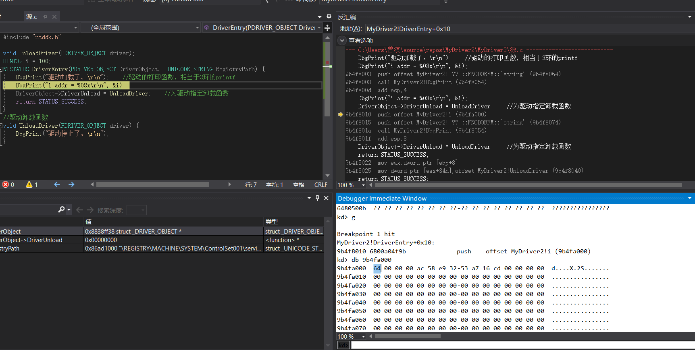


然后根据作业要求 打印这个地址 看看是不是64

```
//B
#include "ntddk.h"

void UnloadDriver(PDRIVER_OBJECT driver);
UINT32 i=9b4fa000;
NTSTATUS DriverEntry(PDRIVER_OBJECT DriverObject, PUNICODE_STRING RegistryPath) {
    DbgPrint("驱动加载了。\r\n");    //驱动的打印函数，相当于3环的printf
    DbgPrint("%08x\r\n", &i);
    DriverObject->DriverUnload = UnloadDriver;    //为驱动指定卸载函数
    return STATUS_SUCCESS;
}
//驱动卸载函数
void UnloadDriver(PDRIVER_OBJECT driver) {
    DbgPrint("驱动停止了。\r\n");
}
```

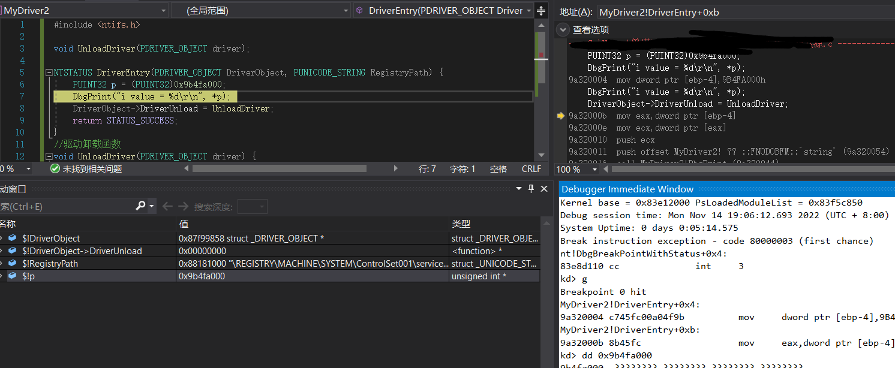

数值不见了

# 驱动常用类型及API

在驱动中写代码与3环不同，一些数据类型及常用API也最好使用驱动开发专用的版本。这算是一种代码规范。

## 基本数据类型

在驱动中，原数据类型int char等均被封装、重定义。在驱动开发中应使用如下数据类型：

```c
UINT8,PUINT8 -> unsigned char
UINT16,PUINT16 -> unsigned short 
UINT32,PUINT32 -> unsigned int
UINT64,PUINT64 -> unsigned __int64
INT8,PINT8 -> char
INT16,PINT16 -> short
INT32,PINT32 -> int
INT64,PINT64 -> __int64
LONG32,PLONG32 -> int
ULONG32,PULONG32 -> unsigned int
DWORD32,PDWRD32 -> int
```

## 错误码返回值

绝大多数内核函数都会有一个返回值，类型为`NTSTATUS`。该类型本质就是一个LONG。

 

如GetLastError这种取错误码的函数，取到的值其实就是NTSTATUS转化后的错误码。

 

常用的NTSTATUS宏如下,负数（大于0X80000000）的返回值为错误，大于等于0为成功

```c
STATUS_SEVERITY_SUCCESS          0x0
STATUS_SEVERITY_INFORMATIONAL    0x1
STATUS_SEVERITY_WARNING          0x2
STATUS_SEVERITY_ERROR            0x3
STATUS_UNSUCCESSFUL              0xC0000001
STATUS_ACCESS_VIOLATION             0xC0000005
```

同时有一个宏用于判断返回值是成功还是失败：

```c
NT_SUCCESS(NTSATUS类型参数)  ``/``/``#define NT_SUCCESS(Status) (((NTSTATUS)(Status)) >= 0)
```

## 字符串相关

在内核开发中，字符串不要定义为char* x = "xx"，WDK为我们准备了一些字符串相关的API。

### 定义字符串

```c
cUNICODE_STRING uStr = {0};    //定义一个unicode字符串，类型为UNICODE_STRING
STRING aStr = {0};    //定义一个ascii字符串，类型为STRING
ANSI_STRING aStr = {0};  //所有ANSI与直接STRING 作用相同
```

### 初始化字符串

```c
RtlInitUnicodeString(&uStr,L"unicode string");//初始化unicode字符串，为其赋值。不会申请内存。
RtlInitString(&aStr,"ascii string"); //初始化ascii字符串，为其赋值，不会申请内存。
RtlInitAnsiString(&aStr,"ascii string"); //初始化ascii字符串，为其赋值，不会申请内存。
```

### 字符串转化

```c
RtlAnsiStringToUnicodeString(&uStr,&aStr,true);//将ascii字符串转为unicode字符串，无需为unicode字符串做初始化，第三个参数为true则自动申请内存。为false则不申请，仅修改unicode现有空间。若为true，则需要手动释放字符串内存。
RtlUnicodeStringToAnsiString（）；//将unicode字符串转为ascii字符串，用法与上面相同。
```

### 释放字符串

```c
RtlFreeUnicodeString();//释放unicode字符串内存，当字符串初始化中为其分配了内存时，需要释放内存。
RtlFreeAnsiString(); //释放ascii字符串内存，当字符串初始化中为其分配了内存时，需要释放内存
```

### 字符串格式化

```c
#include <ntstrsafe.h> //使用格式化API需要引入此头文件
char aStr[0x1000]= {0};
RtlStringCbPrintfA(aStr, 0x1000, "%d---%s", 123, "test");//参数1： Ascii字符串指针
wchar uStr[0x1000] = {0};
RtlStringCbPrintfW(uStr, 0x1000, L"%d---%s", 123, L"test");//参数1： Unicode字符串指针
```

### 字符串比较	

```c
RtlCompareUnicodeString(&uStr1,&uStr2,TRUE);//比较两个unicode字符串是否相等，true忽略大小写
RtlCompareString    //比较两个ascii字符串是否相等
```

## 内存相关

### 申请内存

```c
ExAllocatePool(type,size);//type:内存类型，PagePool和NonPagePool，分别为分页内存和非分页内存。
//分页内存：后面章节会详细说，暂时理解为不可执行的内存
//非分页内存：后面章节会详细说，暂时理解为可执行的内存   通常填NonPagePool，对应属性为PTE的XD/NX位。
ExAllocatePoolWithTag(type,size,tag);//tag：内存标志，四个字节最多，如'test'，为申请的内存起个名字。用单引号包含，内部最终转为16进制数据。
```

### 拷贝、设置、比较内存

```c
RtlFillMemory(pointer,length,value);//相当于memset
RtlEqualMemory(pointer,Source,Length)//相当于memcmp结果取反
RtlMoveMemory(pointer,Source,Length) //相当于memmove
RtlCopyMemory(pointer,Source,Length) //相当于memcpy
RtlZeroMemory(pointer,Length) //相当于memset第二参数为0.
```

### 释放内存

```c
ExFreePool(pointer);//释放内存
```

## 延迟

```c
//驱动代码中的延迟不可以使用Sleep，而是KeDelayExecutionThread
LARGE_INTEGER li = { 0 };    //时长结构。
li.QuadPart = -10000 * 5000;    //时间单位 负数代表相对时间  正数代表绝对时间。 5000代表5秒。
KeDelayExecutionThread(KernelMode,FALSE,&li);
//第一个参数：延迟模式，我们这里选内核模式
//第二个参数：强制唤醒。如果为FALSE，那么休眠时间未结束前，不会被唤醒。
//第三个参数：延迟时长。
```

## 创建线程

```c
//线程函数
VOID myThreadFun(_In_ PVOID StartContext) {
    //线程函数代码
}
 
HANDLE tHandle = NULL;
NTSTATUS tRet = PsCreateSystemThread(&tHandle,THREAD_ALL_ACCESS,NULL,NULL,NULL, myThreadFun,NULL);
//最后一个参数是线程函数启动参数。
if(NT_SUCCESS(tRet)){
    ZwClose(tHandle);//相当于CloseHandle
}
```

## 内核链表API

windows开发人员很喜欢使用链表，你可以在很多内核结构中看到`LIST_ENTRY`成员。这就是链表节点结构。也是WDK中提供的一个官方链表结构。LIST_ENTRY是一个双向链表。

```c
typedef struct _Monster {    //定义一个结构体，成员包含节点结构。这样该结构体也可以作为节点。
    UINT32 ID;
    LIST_ENTRY node;
    UINT32 hp;
    UINT32 level;
    UNICODE_STRING name;
}Monster,*PMonster;
 
Monster m1 = { 0 };
InitializeListHead(&m1.node);    //初始化链表，防止出现垃圾数据作为指针的情况。
IsListEmpty(&m1.node);    //判断整条链表是否为空，传入整条链表中任意一个节点即可。
Monster m2 = { 0 };
InsertHeadList(&m1.node, &m2.node);//将m2节点插入至链表头部。
Monster m3 = { 0 };
InsertTailList(&m1.node, &m3.node);//将m3节点插入至链表尾部。
RemoveHeadList(&m2.node);//将整条链表的头部节点移除，传入任一节点即可。
RemoveTailList(&m2.node);//将整条链表的尾部节点移除，传入任一节点即可。
RemoveEntryList(&m3.node);//将指定节点移除，断链。
 
//通过FLINK找到Monster，架设要找到m2下一个节点
PMonster pm = (PMonster)((UCHAR)m2.node.Flink - ((UCHAR)(&m2.node) - (UCHAR)&m2));
//计算出ListEntry结构相对于Monster结构的偏移，用Flink减去该偏移得到m3的地址。
```

## 内核二叉树API

```c
typedef struct _Monster {
    UINT32 id;
    UINT32 hp;
    UINT32 level;
    UNICODE_STRING name;
}Monster,*PMonster;
//树节点比较函数
RTL_GENERIC_COMPARE_RESULTS NTAPI myCmpFunc(_In_ struct _RTL_GENERIC_TABLE *Table,_In_ PVOID FirstStruct,_In_ PVOID SecondStruct) {
    PMonster m1 = (PMonster)FirstStruct;    //内部强转为自己需要的结构体
    PMonster m2 = (PMonster)SecondStruct;
    if (m1->id == m2->id) {                //判断方法自己指定，我这里按照ID判断两个节点的大小关系
        return GenericEqual;
    }
    return m1->id > m2->id ? GenericGreaterThan : GenericLessThan;
}
//节点新建函数
VOID NTAPI myAllocFunc( _In_ struct _RTL_GENERIC_TABLE *Table, _In_ CLONG ByteSize ) {
    ExAllocatePool(NonPagedPool,ByteSize);//申请内存
}
//节点删除函数
VOID NTAPI myFreeFunc( _In_ struct _RTL_GENERIC_TABLE *Table, _In_ __drv_freesMem(Mem) _Post_invalid_ PVOID Buffer ) {
    ExFreePool(Buffer);//释放该节点申请出来的内存
}
 
Monster m1 = {0,100,10,L"monster 1"};
Monster m2 = {1,100,10,L"monster 2"};
Monster m3 = {2,100,10,L"monster 3"};
 
RTL_GENERIC_TABLE table = {0};
 
//初始化二叉树
RtlInitializeGenericTable(&table, myCmpFunc, myAllocFunc, myFreeFunc,NULL);
BOOLEAN isNewEle = FALSE;
 
//插入/更新节点，将节点强转为void*，isNewEle接收该节点是否为新加加点或已存在节点。通过myCmpFunc来判断两个节点是否为同一个节点。    在插入节点时，会调用myAllocFunc为节点重新分配一个内存并将数据拷贝过去。
RtlInsertElementGenericTable(&table, (PVOID)&m1,sizeof(m1),&isNewEle);
RtlInsertElementGenericTable(&table, (PVOID)&m2,sizeof(m1),&isNewEle);
RtlInsertElementGenericTable(&table, (PVOID)&m3,sizeof(m1),&isNewEle);
 
//查找节点，lookupM只需要赋值id属性，查找也会根据这个id去对比是否相同。返回查找到的结点指针
Monster lookupM = { 0,0,0,0 };
PMonster lookupResult = (PMonster)RtlLookupElementGenericTable(&table,&lookupM);
 
//删除节点，也是根据id删除。删除后会自动调用myFreeFunc释放内存。
RtlDeleteElementGenericTable(&table, &lookupM);
 
//取节点个数
ULONG nodeNum = RtlNumberGenericTableElements(&table);
ULONG nodeNum = RtlNumberGenericTableElementsAvl(&table);//安全函数，防止一边加节点一边读节点
 
//遍历节点，key用于取下一个节点，key为null时，取第一个节点。  返回值为下一个节点，同时自动更新key指向返回值所属节点。返回值为null说明遍历结束。 
PVOID key = NULL;
PMonster pm = (PMonster)RtlEnumerateGenericTableWithoutSplaying(&table, &key);
while (pm!=NULL) {
    DbgPrint(pm->name.Buffer);
    pm = (PMonster)RtlEnumerateGenericTableWithoutSplaying(&table, &key);
}
 
//二叉树用完（如驱动卸载），要将二叉树内所有节点销毁掉，防止内存泄漏。
```

# 驱动对象-DriverSection

驱动对象中有一个成员名为DriverSection，其数据类型为未公开类型`_KLDR_DATA_TABLE_ENTRY`的结构指针。该结构信息可以在WRK源码中搜索到。成员如下：

```c
typedef struct _KLDR_DATA_TABLE_ENTRY {
    LIST_ENTRY InLoadOrderLinks;
    ULONG __Undefined1;
    ULONG __Undefined2;
    ULONG __Undefined3;
    ULONG NonPagedDebugInfo;
    ULONG DllBase;
    ULONG EntryPoint;
    ULONG SizeOfImage;
    UNICODE_STRING FullDllName;
    UNICODE_STRING BaseDllName;
    ULONG Flags;
    USHORT LoadCount;
    USHORT __Undefined5;
    ULONG  __Undefined6;
    ULONG  CheckSum;
    ULONG  TimeDateStamp;
} KLDR_DATA_TABLE_ENTRY, *PKLDR_DATA_TABLE_ENTRY;
```

其中第一个成员InLoadOrderLinks是一个链表节点结构。由此可知，_KLDR_DATA_TABLE_ENTRY是一个双向链表。

## 驱动模块遍历-手动

编写如下代码，加载该驱动：

```c
typedef struct _KLDR_DATA_TABLE_ENTRY {
    LIST_ENTRY InLoadOrderLinks;
    ULONG __Undefined1;
    ULONG __Undefined2;
    ULONG __Undefined3;
    ULONG NonPagedDebugInfo;
    ULONG DllBase;
    ULONG EntryPoint;
    ULONG SizeOfImage;
    UNICODE_STRING FullDllName;
    UNICODE_STRING BaseDllName;
    ULONG Flags;
    USHORT LoadCount;
    USHORT __Undefined5;
    ULONG  __Undefined6;
    ULONG  CheckSum;
    ULONG  TimeDateStamp;
} KLDR_DATA_TABLE_ENTRY, *PKLDR_DATA_TABLE_ENTRY;
 
NTSTATUS DriverEntry(PDRIVER_OBJECT DriverObject, PUNICODE_STRING RegistryPath) {
    DbgBreakPoint();
    KLDR_DATA_TABLE_ENTRY * ldr = DriverObject->DriverSection;
    DriverObject->DriverUnload = UnloadDriver;
    return STATUS_SUCCESS;
}
```


还是昨天那个代码  跑起来 下断


输入命令`dt ldr`查看自身节点结构：

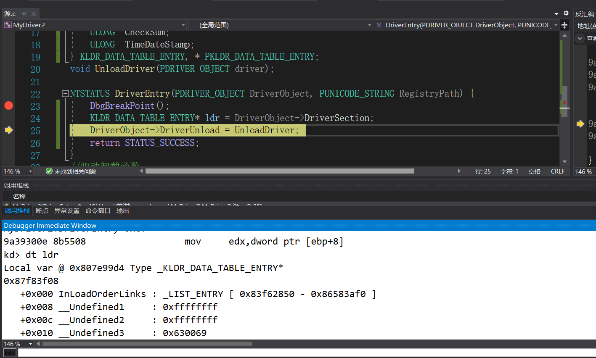


输入命令`dt _KLDR_DATA_TABLE_ENTRY 0x83f62850`查看下一个节点的结构。

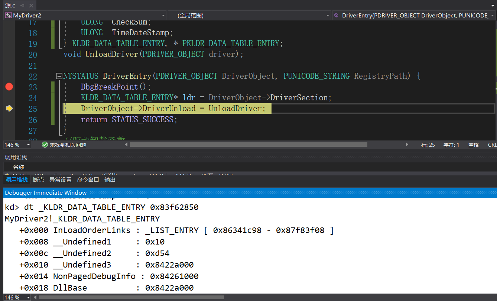


可以发现很多属性都是0。这里我们需要知道一个常识，windows很多链表都喜欢将头部节点成员置位null，从第二个节点开始才是真正的有效数据。

 

继续执行命令`dt _KLDR_DATA_TABLE_ENTRY 0x86341c98`查看下一个节点。

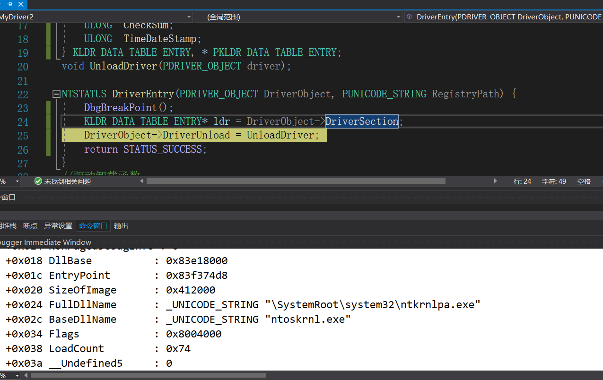


可以发现找到了ntoskrnl模块。经过多次重复寻找，可以发现这个链表是一个`双向循环链表`


## 驱动模块遍历-代码

将手动遍历的方法写入代码中：

```c
NTSTATUS DriverEntry(PDRIVER_OBJECT DriverObject, PUNICODE_STRING RegistryPath) {
    PKLDR_DATA_TABLE_ENTRY selfNode = DriverObject->DriverSection;
    PKLDR_DATA_TABLE_ENTRY preNode = selfNode;
    UINT32 index = 1;
    do {
        DbgPrint("[db] %d  driver name = %wZ \r\n", index++,&preNode->BaseDllName);
        preNode = preNode->InLoadOrderLinks.Flink;
    } while (preNode != selfNode);
    DriverObject->DriverUnload = UnloadDriver;
    return STATUS_SUCCESS;
}
```

加载驱动，观察输出内容，与PCHUNTER做对比，可以发现已经将全部驱动遍历出来了：（多一个因为吧空节点字符串也打印出来了，理应过滤掉）

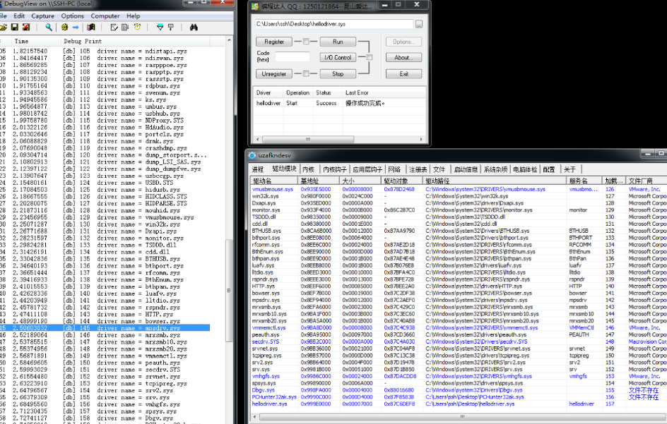

# 驱动模块隐藏-断链

完成对驱动模块的遍历后，我们要开始搞事情了。在实际攻防对抗中，无论是外挂开发者或是内核木马开发者，为了让自己的驱动悄悄的运行起来，都会对自身的驱动模块做一些隐藏操作。使其自身无法被检测到。而断链就是一个古老但又有效的一个方法。无论你将来从事攻或防，了解一些老技术都是必不可少的。

## 断链1-HTTP.sys

断链练习不要乱找一个驱动就开始断链， 否则可能对系统造成影响，这里我们拿HTTP.sys做断链练习，理论上如果断链成功，PCHUNTER中应该看不到HTTP.sys驱动。代码如下：

```c
NTSTATUS DriverEntry(PDRIVER_OBJECT DriverObject, PUNICODE_STRING RegistryPath) {
    PKLDR_DATA_TABLE_ENTRY selfNode = DriverObject->DriverSection;
    PKLDR_DATA_TABLE_ENTRY preNode = selfNode;
 
    UNICODE_STRING httpName = { 0 };
    RtlInitUnicodeString(&httpName,L"HTTP.sys");
    do {
        if (preNode->BaseDllName.Length != 0     //过滤空字符串
            && RtlCompareUnicodeString(&preNode->BaseDllName,&httpName,TRUE) == 0) {
            DbgPrint("%wZ\r\n", &preNode->BaseDllName);
            RemoveEntryList(preNode);
            break;
        }
        preNode = preNode->InLoadOrderLinks.Flink;
    } while (preNode != selfNode);
    DriverObject->DriverUnload = UnloadDriver;
    return STATUS_SUCCESS;
}
```

加载驱动后，dbgview成功打印，说明此时已经成功断链了。去PCHUNTER中观察一下效果：

 

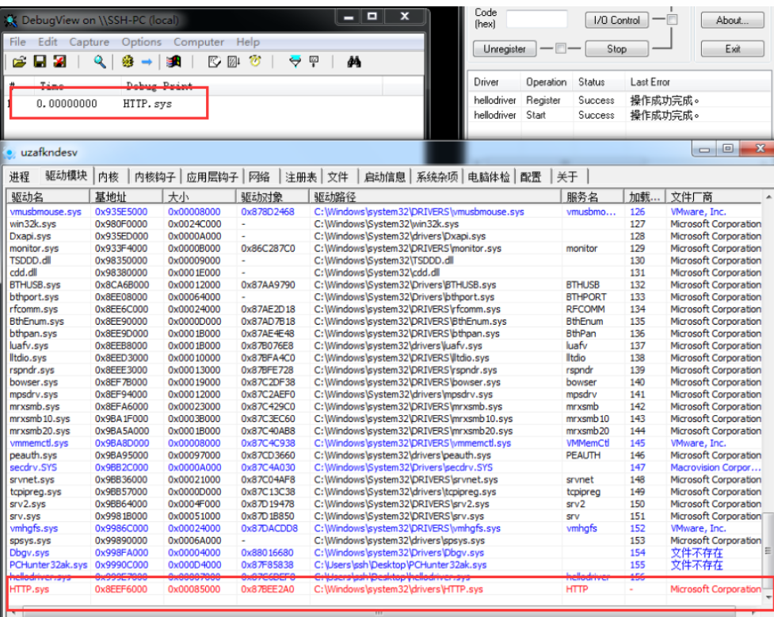


可以发现HTTP.sys仍然在列表中，但是它变红了。这是因为PCHUNTER的遍历方法更健壮一些，不单单是通过链表遍历。还会涉及特征、文件等。有精力的话可以逆向一下PCHUNTER。

 

所以为了达到完美隐藏，我们需要改善一下我们的代码，抹掉驱动对象中的一些特征，在此之前，我们需要了解一下如何通过驱动名来获取驱动对象指针。

## 获取驱动对象指针

微软有一个未公开的导出函数`ObReferenceObjectByName`。这个函数可以根据驱动名获取驱动对象指针。在WRK源码中可以搜索到。

```c
//NTKERNELAPI是一个宏，用于指定内核模块中的导出函数。
NTKERNELAPI NTSTATUS ObReferenceObjectByName(
    __in PUNICODE_STRING ObjectName,    //驱动对象名，如HTTP.sys的驱动对象名就是\Driver\HTTP
    __in ULONG Attributes,        //权限，给一个FILE_ALL_ACCESS即可。
    __in_opt PACCESS_STATE AccessState,    //opt为可选参数，直接写NULL
    __in_opt ACCESS_MASK DesiredAccess,//opt为可选参数，直接写NULL
    __in POBJECT_TYPE ObjectType,    //对象类型
    __in KPROCESSOR_MODE AccessMode,    //访问模式，有个枚举是_MODE,里面有个值是KernelMode，填写即可。
    __inout_opt PVOID ParseContext,    //opt为可选参数，直接写NULL
    __out PVOID *Object    //驱动对象二级指针
);
```

其中ObjectType对象类型我们通过F12未找到该类型都有哪些值。这些类型是未公开的。同样在WRK中可以找到。此处我们使用一个名为`IoDriverObjectType`的导出变量。

```
extern POBJECT_TYPE * IoDriverObjectType;
```

## 断链2-HTTP.sys增强

```c
extern POBJECT_TYPE * IoDriverObjectType;
NTSTATUS DriverEntry(PDRIVER_OBJECT DriverObject, PUNICODE_STRING RegistryPath) {
    PKLDR_DATA_TABLE_ENTRY selfNode = DriverObject->DriverSection;
    PKLDR_DATA_TABLE_ENTRY preNode = selfNode;
 
    UNICODE_STRING httpName = { 0 };
    RtlInitUnicodeString(&httpName,L"HTTP.sys");
    UNICODE_STRING httpObjName = { 0 };
    RtlInitUnicodeString(&httpObjName, L"\\Driver\\HTTP");
 
    do {
        if (preNode->BaseDllName.Length != 0
            && RtlCompareUnicodeString(&preNode->BaseDllName,&httpName,TRUE) == 0) {
            DbgPrint("%wZ\r\n", &preNode->BaseDllName);
            PDRIVER_OBJECT pHttpObj = NULL;
            ObReferenceObjectByName(&httpObjName,FILE_ALL_ACCESS,NULL,NULL, *IoDriverObjectType, KernelMode,NULL, &pHttpObj);    //取驱动对象指针
            pHttpObj->Flags = 0;    //清除几个属性，防止被搜索到。
            pHttpObj->DriverSection = 0;
            pHttpObj->DriverInit = 0;
            RemoveEntryList(preNode);
            break;
        }
        preNode = preNode->InLoadOrderLinks.Flink;
    } while (preNode != selfNode);
    DriverObject->DriverUnload = UnloadDriver;
    return STATUS_SUCCESS;
}
```

加载驱动，观察效果（记得重启，刚刚链表已经断掉HTTP了。）：

 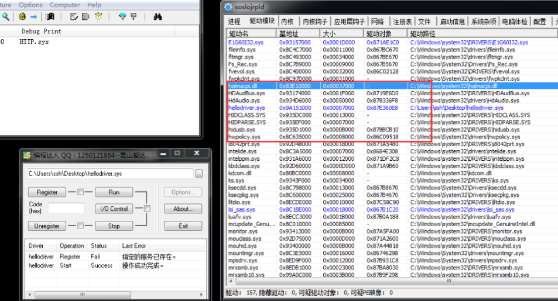


可以看到HTTP已经彻底从PCHUNTER中消失了，也没有了红色HTTP的记录。我们的断链操作成功了。

## 断链3-自身驱动

对自身驱动模块进行断链，省去了遍历和取驱动对象的步骤，理论上是更简单的，我们尝试一下。

```c
NTSTATUS DriverEntry(PDRIVER_OBJECT DriverObject, PUNICODE_STRING RegistryPath) {
    PKLDR_DATA_TABLE_ENTRY selfNode = DriverObject->DriverSection;
 
    DriverObject->Flags = 0;
    DriverObject->DriverSection = 0;
    DriverObject->DriverInit = 0;
    RemoveEntryList(selfNode);
 
    DriverObject->DriverUnload = UnloadDriver;
    return STATUS_SUCCESS;
}
```

加载驱动，观察效果：

 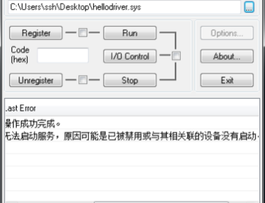

发现驱动无法被加载。这是因为系统调用完DriverEntry后仍需要做一些处理。而我们吧自己的驱动隐藏掉了，导致系统找不到我们的驱动没办法做后续处理。从而返回驱动加载失败。

 

所以我们需要在驱动成功加载后再进行断链操作，这里使用新线程+延迟执行的方法来规避。

```c
VOID hideSelf(PVOID pDriverObj) {
    LARGE_INTEGER li = { 0 };
    li.QuadPart = -10000 * 10000;
    KeDelayExecutionThread(KernelMode,FALSE,&li);    //延迟函数，详见 5-延迟
 
    PDRIVER_OBJECT DriverObject = (PDRIVER_OBJECT)pDriverObj;
    PKLDR_DATA_TABLE_ENTRY selfNode = DriverObject->DriverSection;
 
    DriverObject->Flags = 0;
    DriverObject->DriverSection = 0;
    DriverObject->DriverInit = 0;
    RemoveEntryList(selfNode);
}
NTSTATUS DriverEntry(PDRIVER_OBJECT DriverObject, PUNICODE_STRING RegistryPath) {
    HANDLE tHandle = NULL;
    NTSTATUS ret = PsCreateSystemThread(&tHandle,THREAD_ALL_ACCESS,NULL,NULL,NULL, hideSelf, DriverObject);
    if (NT_SUCCESS(ret)) {
        ZwClose(ret);
    }
    DriverObject->DriverUnload = UnloadDriver;
    return STATUS_SUCCESS;
}
```

再次尝试加载驱动，分别观察刚加载驱动时PCHUNTER的列表和延迟10秒后PCHUNTER的列表。

 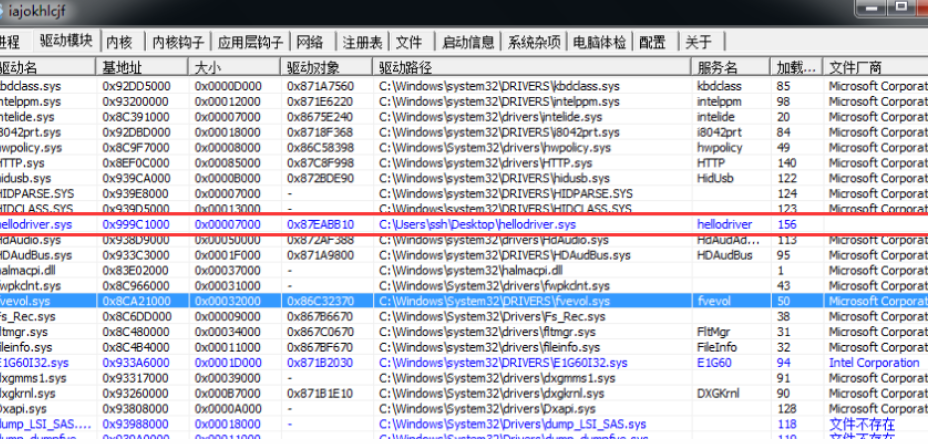

 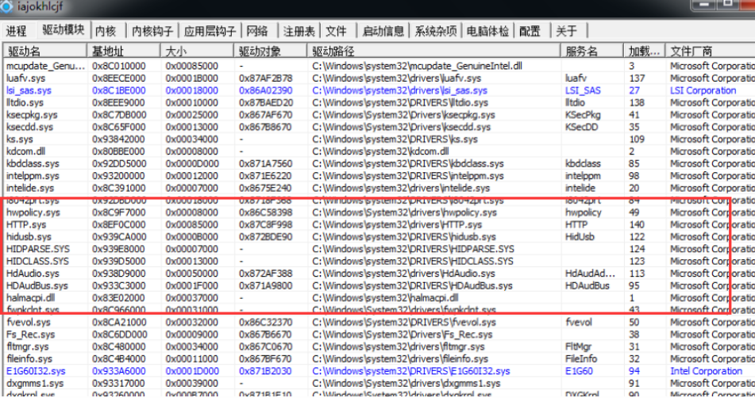


可以看到我们的驱动已经成功被加载了，并在10秒后做了断链隐藏处理。但目前仍有一个BUG，那就是卸载驱动时会提示“请求的控件对此服务无效。”。若想修复这个BUG，需要在卸载之前还原我们的驱动，将节点重新接入链表中并恢复被清空的属性。

# 驱动通信-常规

驱动在实际使用中不可能从入口点一路执行到结束。 将驱动按功能分成模块, 需要时调用才是实际的应用。通过用户层与内核层的通信，可以让用户程序在需要时调用驱动的特定功能。无论是攻击方或是防守方，驱动通信都是一个关键的战场。

 

这里的常规通信使用设备交互的方式，其类似与WIN32的消息和回调函数的组合。在内核中，消息被封装为一个结构体IRP（I/O Request Packae）。设备对象可以接收IRP数据从而实现通信。

## 0环代码-创建设备

用户应用想要向驱动发起通信，其本质是向驱动所绑定的设备发起通信，再由设备向下分发。所以我们需要首先创建一个设备：

```c
UNICODE_STRING deviceName = { 0 };
RtlInitUnicodeString(&deviceName,L"\\Device\\MyDevice");
DEVICE_OBJECT devObj = {0};
NTSTATUS retStatus = IoCreateDevice(pDriverObj,NULL,&deviceName,FILE_DEVICE_UNKNOWN,FILE_DEVICE_SECURE_OPEN,FALSE,&devObj);
//参数1：驱动对象指针，用于将创建出来的设备绑定到某个驱动上
//参数2：设备扩展大小，我们这里写NULL就好。不需要扩展。
//参数3：设备名，UNICODE字符串。  固定名字格式： \\Device\\名字   
//参数4：设备类型，按F12可以看到很多类型宏，有鼠标、键盘之类的，我们这里选未知设备。
//参数5：设备权限，为了让3环可以打开我们的设备进行通信，我们这里选择FILE_DEVICE_SECURE_OPEN权限。其他权限可以在MSDN上找到。
//参数6：是否独占，填FALSE。 如果独占的话3环无法打开该设备。
//参数7：设备对象指针，传出创建好的设备对象。
```

## 0环代码-设置数据交互方式

```c
pDeviceObj->Flags |= DO_BUFFERED_IO;
//缓冲区方式读写（DO_BUFFERED_IO）：将3环缓冲区内的数据复制一份到0环的缓冲区。  方便，但性能不好。
//直接方式读写（DO_DIRECT_IO）:首先将3环缓冲区锁住，然后在将对应的物理地址映射一份0环的线性地址。适合大量数据传输。两个线性地址对应同一个物理地址。
//其它方式读写（不设置值）：0环直接读取3环的线性地址，不建议。当进程切换,CR3改变，会读取到其他进程的内存数据。
pDeviceObj->Flags &= DO_DEVICE_INITIALIZING;
//将DO_DEVICE_INITIALIZING初始化标志位清空，如果不清空这个位，那么3环可能无法打开设备。
```

## 0环代码-创建符号链接

3环想要打开我们的设备无法直接使用`\\Device\\XXX`这种设备名，我们需要指定一个符号链接（别名）用于3环的访问。

```c
UNICODE_STRING symName = { 0 };
RtlInitUnicodeString(&symName, L"\\??\\MyDeviceSymbol");   
retStatus = IoCreateSymbolicLink(&symName,&deviceName);
//参数1：符号链接名。 固定格式：    \\??\\名字
//参数2：想要绑定的设备名。
```

## IRP消息

在用户层，我们每次调用CreateFile、OpenFIle、DeleteFile、CloseHandle等API时，都会向0环发送一个消息，这个消息成为IRP数据包。这些API称为`设备操作API`。如：当调用CreateFile时，会向内核层发送一个名为`IRP_MJ_CREATE`的打开设备的IRP消息。其他常用IRP类型如下：

```c
CreateFile        -》    IRP_MJ_CREATE
ReadFile        -》    IRP_MJ_READ
WriteFile        -》    IRP_MJ_WRITE
CloseHandle        -》    IRP_MJ_CLOSE
DeviceControl    -》    IRP_MJ_DEVICE_CONTROL        //此API比上面的API更加灵活方便，因此内核编程中常使用该API进行消息的传递
```

## 派遣函数

在用户层我们使用WIN32开发GUI时，通过`回调函数`来处理`窗口消息`。 而在内核层，我们通过`派遣函数`来处理`IRP消息`。只是换了个名字而已，本质一样。

 

在驱动对象中，有个属性名为`MajorFunction`，这是个数组，每个元素都是一个函数指针，对应了各种类型IRP的派遣函数。

 

派遣函数格式如下：

```c
NTSTATUS MyDispatchFunction(PDEVICE_OBJECT pDevObj,PIRP pIrp){
    //业务代码
    ...
    //设置返回状态
    pIrp->IoStatus.Status = STATUS_SUCCESS;   //3环的GetLastError得到的就是这个值
    pIrp->IoStatus.Information = 0;                //返回数据的字节数  没有写0
    IoCompleteRequest(pIrp,IO_NO_INCREMENT);        //当前处理完成，继续向下传递IRP消息
    return STATUS_SUCCESS;
}
```

## 0环代码-处理IRP消息1

```c
NTSTATUS NullFunc(DEVICE_OBJECT *DeviceObject, IRP *Irp) {
    Irp->IoStatus.Status = STATUS_SUCCESS;
    Irp->IoStatus.Information = 0;
    IoCompleteRequest(Irp, IO_NO_INCREMENT);
    return STATUS_SUCCESS;
}
NTSTATUS DeviceControlFunc(DEVICE_OBJECT *DeviceObject, IRP *Irp) {
    //通信逻辑，后面补充。
    Irp->IoStatus.Status = STATUS_SUCCESS;
    Irp->IoStatus.Information = 0;
    IoCompleteRequest(Irp, IO_NO_INCREMENT);
    return STATUS_SUCCESS;
}
//Create和Close如果不想做处理就直接给个空函数，直接返回成功。 如果不设置这两个派遣函数，3环则根本无法打开我们的设备。
NTSTATUS DriverEntry(PDRIVER_OBJECT pDriverObj,PUNICODE_STRING pReg) {
    //...
    pDriverObj->MajorFunction[IRP_MJ_DEVICE_CONTROL] = DeviceControlFunc;
    pDriverObj->MajorFunction[IRP_MJ_CREATE] = NullFunc;
    pDriverObj->MajorFunction[IRP_MJ_CLOSE] = NullFunc;
    //....
}
```

## 3环代码-发送IRP消息

驱动现在已经可以接收IRP消息了，那么我们在3环中就可以发送一个IRP消息了。使用`DeviceIoControl`函数来向设备发送一个`IRP_MJ_DEVICE_CONTROL`类型的IRP消息。（也可以用CreateFile进行通信，此处不做演示。）

```c
#include <iostream>
#include <Windows.h>
#include <winioctl.h>    //防止下面的宏识别不到
 
//这个宏用于组装IRP控制码，其中用户自定义的控制码从0x800开始。
#define code1 CTL_CODE(FILE_DEVICE_UNKNOWN,0x800,METHOD_BUFFERED,FILE_ANY_ACCESS)
#define code2 CTL_CODE(FILE_DEVICE_UNKNOWN,0x900,METHOD_BUFFERED,FILE_ANY_ACCESS)
int main()
{
    CHAR* devName = (CHAR*)"\\\\.\\MyDeviceSymbol";
    HANDLE devHandle = CreateFileA(devName,GENERIC_READ|GENERIC_WRITE, FILE_SHARE_READ| FILE_SHARE_WRITE,NULL, OPEN_EXISTING, FILE_ATTRIBUTE_NORMAL,NULL);
    DWORD str = 100;
    DWORD back = 0;
    DWORD backLen = 0;    //实际返回的数据长度，不接收就会崩溃
    DeviceIoControl(devHandle, code1, &str,0x4,&back,0x4,&backLen,NULL);
    printf("back = %d\r\n", back);
    str = 200;
    DeviceIoControl(devHandle, code2, &str, 0x4, &back, 0x4, &backLen, NULL);
    printf("back = %d\r\n", back);
    getchar();
    CloseHandle(devHandle);
    return 0;
}
```

## 0环代码-处理IRP消息-扩展

3环的代码已经写完了，我们需要对IRP中的控制码再做一个详细的分支处理：

```c
#define code1 CTL_CODE(FILE_DEVICE_UNKNOWN,0x800,METHOD_BUFFERED,FILE_ANY_ACCESS)
#define code2 CTL_CODE(FILE_DEVICE_UNKNOWN,0x900,METHOD_BUFFERED,FILE_ANY_ACCESS)
//由于3环使用DeviceIoControl进行IRP的发送，所以我们在DeviceControlFunc中补充逻辑。
NTSTATUS DeviceControlFunc(DEVICE_OBJECT *DeviceObject, IRP *Irp) {
    //取设备堆栈，控制码在设备堆栈里。
    PIO_STACK_LOCATION ioStack = IoGetCurrentIrpStackLocation(Irp);
    //取控制码，Parameters结构内部有很多联合体，我们使用的是DeviceIoControl的方式通信，所以这里使用DeviceIoControl成员取控制码。
    ULONG code = ioStack->Parameters.DeviceIoControl.IoControlCode;
    //取3环传进来的参数。
    PVOID buffer = Irp->AssociatedIrp.SystemBuffer;
    //不同的控制码执行不同的分支，使用switch case语句。
    switch (code)
    {
        case code1:
            //打印3环传进来的值
            DbgPrint("param = %d\r\n",*(PUINT32)buffer);
            //返回给3环的值，直接写入到buffer里就行。
            *(PUINT32)buffer = 800;
            //设置返回去多少数据，因为我们的数据交互方式是METHOD_BUFFERED，会拷贝buffer里的数据给3环地址，如果不指定Information，就无法拷贝数据，3环得到的就是空的数据。
            Irp->IoStatus.Information = 4;
            break;
        case code2:
            DbgPrint("param = %d\r\n", *(PUINT32)buffer);
            *(PUINT32)buffer = 900;
            Irp->IoStatus.Information = 4;
            break;
    default:
        break;
    }
    Irp->IoStatus.Status = STATUS_SUCCESS;
    IoCompleteRequest(Irp, IO_NO_INCREMENT);
    return STATUS_SUCCESS;
}
```

## 0环代码-卸载设备和符号链接

在驱动卸载时要删除设备和符号链接，否则会一直存在内核空间中，并且无法创建同名设备。

 

先创建设备，后创建符号链接。所以删除时先删除符号链接，再卸载设备。

```
VOID UnloadDriver( DRIVER_OBJECT *DriverObject ) {
    IoDeleteSymbolicLink(&symName);
    IoDeleteDevice(DriverObject->DeviceObject);
}
```

## 执行效果

如果代码没问题，执行后的效果如下：

 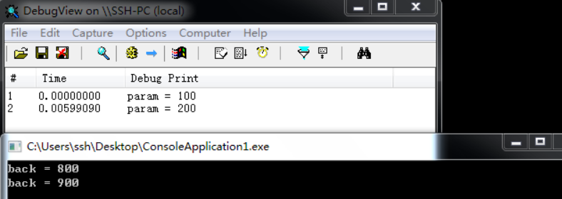
