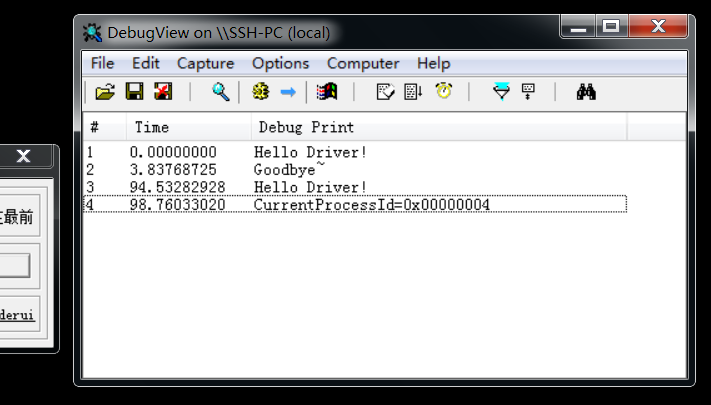
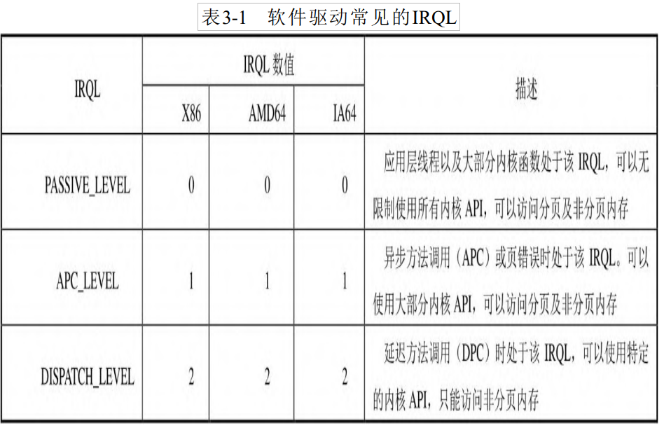

# win内核与驱动

## 保护模式与实模式简介

从32位cpu开始 设置，16位一般是实模式

cpu是32位的 但是我们要执行16位的代码，cpu会进入实模式，把一个32位的cpu当16位用

32位cpu主要运行在保护模式，那为什么会有模式一说呢 ？ 就是安全出问题了

所以我们分配了权限 主要是用户权限和系统权限

intel设计了 4环 权限，是ring0到ring3 数字越高 权限越高 但1和2 不会用

应用程序运行在3环  系统权限运行在0环 

 cpu刚通电是实模式

cpu专门给指令可以切换 使用iret 实模式切为保护模式

启用保护模式，我们运行16位程序就运行不了 无法兼容16位汇编

此时切回实模式 那保护模式的东西全没有了

还有一种是虚拟8086模式 运行16位在这里运行 就是cmd 命令行模式


### 保护模式到底保护了什么

保护的是硬件访问权限，一切的软件没有资格访问硬件，只有硬件访问 （系统）权限才能访问硬件

  应用程序通过API（ring3切换到ring0）向系统申请访问硬件 进入ring0 操作磁盘

比如说readfile 操作了磁盘 磁盘此时是被保护起来的，那么他就会切换权限,就是说api内部要负责权限的切换

 切换到0环是需要很多参数的初始化， 不是想进就进的

切换权限只是一个请求

保护模式下80386支持多任务内存隔离，60年代我们运行一个程序崩了，整台电脑就关机了 

dos操作系统存在于实模式下，windows操作系统运行与保护模式下

## 驱动学习

### 驱动的概念

硬件有很多，比如屏幕 鼠标 这些都不是操作系统商家出售的， 所以有些硬件操作系统不知道怎么通讯，  

操作系统可以留一个接口 使厂家 有机会写代码加载到操作系统去，让厂家做dll，用pe格式，

我们在操作系统和硬件 之间加一层，叫驱动，厂家可以为他的硬件开发一个驱动出来，操作系统想操作这个键盘 ，这个驱动的规范我们一般叫框架，每个硬件都需要给驱动给操作系统，

驱动安装完以后  操作系统问驱动 驱动问硬件 硬件回驱动 再回操作系统，

驱动的设计影响硬件的功能有一些普通的键盘和鼠标 微软自己有那种驱动，但是如果扩展功能的话 要自己安装驱动，比如罗技经常会扩展自己鼠标的功能

驱动和设备之间的关系是一对多的关系.一个驱动可以操作很多设备.比如我们的键盘驱动有一个. 但是可以操作的键盘则有很多个. 你键盘坏了.换了很多.但是驱动则没换过.

所以如果是数据关系的时候.  驱动作为外键放到设备表中


 驱动只能在0环开发，用微软提供的开发包 ，驱动后缀一般xxx.sys， 操作系统吧sys当作操作系统代码的一个模块 会动态加载到操作系统里面，如果你把操作系统当作exe，驱动就是dll

开发驱动现在有两种方式，第一种是硬件驱动，第二种是内核驱动，  此时不得不说rootkit_hook 可以自己百度

还有一种是虚拟光驱，可以通过驱动模拟硬件，游戏读数据要找这个驱动，这个驱动从内存读数据返回给它，

如果从内核层搞事情怎么防控呢，从win7开始 驱动要签名   那签名可以注册公司申请，也容易破

win10 驱动文件会检查里面是否有恶意代码， 比如编译的时候先上传，提供源码 过了就签上去，企业来说不可能那么准时，所以提供了离线版的签名，可以直接签 

但是签名过期也能用，没验证时间  

那么我们在编写驱动的时候 总不能买个签名吧，所以有一个测试模式，

苹果的是厂家写驱动直接链接进操作系统


ring0 内核权限这个权限的检测是cpu完成的


### 编写驱动框架讲解

上面我们已经简单的了解了驱动对象.设备对象是什么了.那么现在开始编写驱动框架

#### 步骤

##### 1.驱动入口函数

 [操作系统](https://so.csdn.net/so/search?q=操作系统&spm=1001.2101.3001.7020)在初始化驱动程序的时候会调用DriverEntry，通常会用这个函数来填充dispatch例程的指针，这就象注册回调函数一样。有的设备要创建设备的对象，或者还要创建一个设备名字，以及其他的初始化操作。它的原型： 

```
NTSTATUS DriverEntry(
    IN PDRIVER_OBJECT DriverObject,
    IN PUNICODE_STRING RegistryPath
    ){
}
```

 IN，OUT，INOUT是一个空的宏，只是用来说明这个参数是用于输入参数，还是输出的参数。NTSTATUS实际是个长整型可以在DDK头文件NTSTATUS.H中找到NTSTATUS的代码列表。函数的第一个参数DriverObject是刚被[初始化](https://so.csdn.net/so/search?q=初始化&spm=1001.2101.3001.7020)的驱动对象，就是操作系统为这个驱动分配的空间的指针。函数的第二 

##### 2.注册设备回调函数.

当用户对设备进行操作的是否.驱动会调用这个回调函数进行操作.注册回调函数.

```c
pDriverObject->MajorFunction[IRP_MJ_CREATE] = 创建的回调函数指针;
pDriverObject->MajorFunction[IRP_MJ_CLOSE] =  关闭的回调函数指针;
pDriverObject->MajorFunction[IRP_MJ_READ] =   读取的回调函数指针;
pDriverObject->MajorFunction[IRP_MJ_WRITE] =  写入的回调函数指针;
pDriverObject->MajorFunction[IRP_MJ_DEVICE_CONTROL] = 控制的回调函数指针;
//如果你的回调被调了 说明硬件进行了什么操作

//回调函数的写法.
NTSTATUS 自定义的函数名(__in struct _DEVICE_OBJECT *DeviceObject,
                      __inout struct _IRP *Irp)
{

  .........
  return STATUS_SUCCESS;
}
//注意

对pDriverObject->MajorFunction[]进行F12
来到这
PDRIVER_DISPATCH MajorFunction[IRP_MJ_MAXIMUM_FUNCTION + 1];
//提供的公共方法的接口. 创建.打开,关闭.读写控制... 里面存放的是函数指针.单用户操作设备的是否.则会调用这些回调函数指针.
下面是IRP_MJ_MAXIMUM_FUNCTION 这个宏的内容 
#define IRP_MJ_CREATE                   0x00  
#define IRP_MJ_CREATE_NAMED_PIPE        0x01
#define IRP_MJ_CLOSE                    0x02
#define IRP_MJ_READ                     0x03
#define IRP_MJ_WRITE                    0x04
#define IRP_MJ_QUERY_INFORMATION        0x05
#define IRP_MJ_SET_INFORMATION          0x06
#define IRP_MJ_QUERY_EA                 0x07
#define IRP_MJ_SET_EA                   0x08
#define IRP_MJ_FLUSH_BUFFERS            0x09
#define IRP_MJ_QUERY_VOLUME_INFORMATION 0x0a
#define IRP_MJ_SET_VOLUME_INFORMATION   0x0b
#define IRP_MJ_DIRECTORY_CONTROL        0x0c
#define IRP_MJ_FILE_SYSTEM_CONTROL      0x0d
#define IRP_MJ_DEVICE_CONTROL           0x0e
#define IRP_MJ_INTERNAL_DEVICE_CONTROL  0x0f
#define IRP_MJ_SHUTDOWN                 0x10
#define IRP_MJ_LOCK_CONTROL             0x11
#define IRP_MJ_CLEANUP                  0x12
#define IRP_MJ_CREATE_MAILSLOT          0x13
#define IRP_MJ_QUERY_SECURITY           0x14
#define IRP_MJ_SET_SECURITY             0x15
#define IRP_MJ_POWER                    0x16
#define IRP_MJ_SYSTEM_CONTROL           0x17
#define IRP_MJ_DEVICE_CHANGE            0x18
#define IRP_MJ_QUERY_QUOTA              0x19
#define IRP_MJ_SET_QUOTA                0x1a
#define IRP_MJ_PNP                      0x1b
#define IRP_MJ_PNP_POWER                IRP_MJ_PNP      // Obsolete....
#define IRP_MJ_MAXIMUM_FUNCTION         0x1b //回调函数的总数量
```

##### 3.创建设备.

创建虚拟的设备给用户使用. 但是也可以绑定真实的设备，如果不创造或者绑定，那读写就没有任何意义

```c
//创建设备等等.都属于IO操作.

//IO操作创建设备的API

NTSTATUS 
  IoCreateDevice(
    IN PDRIVER_OBJECT  DriverObject,　　　　　　//调用者驱动对象的指针.一般是驱动入口的参数
    IN ULONG  DeviceExtensionSize,         　　//设备扩展大小
    IN PUNICODE_STRING  DeviceName  OPTIONAL, //设备对象名称,注意不是我们ring3下的路径.
    IN DEVICE_TYPE  DeviceType,　　　　　　　　　//我们的设备类型
    IN ULONG  DeviceCharacteristics,　　　　　　//驱动的附加信息.
    IN BOOLEAN  Exclusive,　　　　　　　　　　　　//创建的设备是否其余的可以使用,是否独占
    OUT PDEVICE_OBJECT  *DeviceObject　　      //传出参数,设备的信息.
    );

//注意:
在内核中并没有路径一说.所以这个路径是特殊的.

UNICODE_STRING 内核中新的字符串格式.其实是一个结构体.系统提供了操作这种结构体的API

我们拼接一个路径

UNICODE_STRING  uStrDeviceName;

RtlInitUnicodeString(&uStrDeviceName,L"\\Device\\xxx名字即可");

注意,创建设备的时候.我们前边需要加上 \Device.  这里因为是转义字符.所以加了好多\\

拼接好则可以给了.

status = IoCreateDevice(pDriverObject, 
                          0, 
                          &ustrDeviceName,          //设备路径
                          FILE_DEVICE_UNKNOWN,//设备类型设置为不知道
                          FILE_DEVICE_SECURE_OPEN, 
                          FALSE,                           //是否独占
                          &pDevObj);
  if (status != STATUS_SUCCESS)
  {
    return status;
  }        

```

##### 4.指定通讯方式.

 什么意思?比如ring3中操作设备进行读写的时候 如果用ReadFile读取.那么你们的通讯方式是否是字符串 

```c
pDevObj->Flags |= DO_BUFFERED_IO; //指定通讯方式,为缓冲区
```

##### 5.创建符号连接.

符号连接: 我们知道.在操作系统下有C盘.D盘一说.但是在驱动下面.则没有怎么一说.只有卷一说.所以我们要绑定一下.

```c
我们创建的符号连接.可以通过 Win0bj工具进行查看. 这个工具可以查看所有设备.但是只有0环才可以操作.
 status = IoCreateSymbolicLink(&g_ustrSymbolName, &ustrDeviceName);
  if (status != STATUS_SUCCESS)
  {
    //删除设备
    IoDeleteDevice(pDevObj);
    return status;
  }

注意符号连接名字.我们也是初始化得出的.

RtlInitUnicodeString(&g_ustrSymbolName, L"\\DosDevices\\xxxx名字");

完整的框架已经写完.剩下的就是 三环和0环驱动通讯. 依赖我们写的框架.
```


### 驱动框架源码

```c
#include "Hello.h"
#include <Ntstrsafe.h>

char g_Buf[0x1000];
int g_nOffset = 0;

VOID Unload(_In_ struct _DRIVER_OBJECT* DriverObject)
{
  //删除符号链接  符号链接和设备是绑在一起的
  UNICODE_STRING DosDeviceName;
  RtlInitUnicodeString(&DosDeviceName, SYMBOL_LINK_NAME);
  IoDeleteSymbolicLink(&DosDeviceName);


  //删除设备  如果驱动被卸载了，操作系统还是要操作这个设备就要蓝屏
  PDEVICE_OBJECT pDevObj = DriverObject->DeviceObject;
  while (pDevObj != nullptr) {
    IoDeleteDevice(pDevObj);
    pDevObj = pDevObj->NextDevice;
  }

  DbgPrint("[51asm] Unload DriverObject=%p\n", DriverObject);
}

NTSTATUS DriverEntry(__in struct _DRIVER_OBJECT* DriverObject,
                     __in PUNICODE_STRING  RegistryPath)
{
  UNREFERENCED_PARAMETER(RegistryPath);
  UNREFERENCED_PARAMETER(DriverObject);

  DbgBreakPoint();

  DbgPrint("[51asm] DriverObject:%p RegistryPath:%wZ PID:%d\n", 
           DriverObject, RegistryPath, PsGetCurrentProcessId());

  DriverObject->DriverUnload = Unload;


  //注册派遣函数
  DriverObject->MajorFunction[IRP_MJ_CREATE] = DiaptchCreate;
  DriverObject->MajorFunction[IRP_MJ_CLOSE] = DiaptchClose;
  DriverObject->MajorFunction[IRP_MJ_READ] = DiaptchRead;
  DriverObject->MajorFunction[IRP_MJ_WRITE] = DiaptchWrite;
  DriverObject->MajorFunction[IRP_MJ_DEVICE_CONTROL] = DiaptchControl;


  //创建设备
  UNICODE_STRING ustrDevName;
  //ustrDevName.Length = 12;
  //ustrDevName.MaximumLength = 12;
  //ustrDevName.Buffer = L"Hello";

  NTSTATUS Status;
  RtlInitUnicodeString(&ustrDevName, DEVICE_NAME);
  PDEVICE_OBJECT pDevObj = nullptr;
  Status = IoCreateDevice(DriverObject,
                          0, 
                          &ustrDevName,
                          FILE_DEVICE_UNKNOWN,
                          FILE_DEVICE_SECURE_OPEN,
                          FALSE,
                          &pDevObj);
  if (!NT_SUCCESS(Status)) {
    DbgPrint("[51asm] IoCreateDevice Error Status:%p\n", Status);
  }
  else {
    DbgPrint("[51asm] IoCreateDevice OK pDevObj:%p\n", pDevObj);
  }

  //缓冲区方式
  pDevObj->Flags |= DO_BUFFERED_IO;

  //直接方式
  //pDevObj->Flags |= DO_DIRECT_IO;

  //创建符号链接
  UNICODE_STRING DosDeviceName;
  RtlInitUnicodeString(&DosDeviceName, SYMBOL_LINK_NAME);
  Status = IoCreateSymbolicLink(&DosDeviceName, &ustrDevName);
  if (!NT_SUCCESS(Status)) {
    DbgPrint("[51asm] IoCreateSymbolicLink Error Status:%p\n", Status);
  }
  else {
    DbgPrint("[51asm] IoCreateSymbolicLink OK\n");
  }
  return Status;
}

NTSTATUS DiaptchCreate( _In_ struct _DEVICE_OBJECT* DeviceObject,
                       _Inout_ struct _IRP* Irp
) 
{
  UNREFERENCED_PARAMETER(DeviceObject);
  UNREFERENCED_PARAMETER(Irp);
  DbgPrint("[51asm] DiaptchCreate PID:%d\n", PsGetCurrentProcessId());
  
  return STATUS_SUCCESS;
}

NTSTATUS DiaptchClose(
  _In_ struct _DEVICE_OBJECT* DeviceObject,
  _Inout_ struct _IRP* Irp
)
{
  PVOID lpBuf = Irp->AssociatedIrp.SystemBuffer;

  UNREFERENCED_PARAMETER(DeviceObject);
  UNREFERENCED_PARAMETER(Irp);
  DbgPrint("[51asm] DiaptchClose lpBuf=%p PID:%d\n", lpBuf, PsGetCurrentProcessId());

  return STATUS_SUCCESS;
}

NTSTATUS DiaptchRead(
  _In_ struct _DEVICE_OBJECT* DeviceObject,
  _Inout_ struct _IRP* Irp
) 
{
  //I/O Requst Packet
  // 
  //获取当前IRP堆栈
  PIO_STACK_LOCATION  pIrpStack = IoGetCurrentIrpStackLocation(Irp);
  PVOID lpBuf = Irp->AssociatedIrp.SystemBuffer;
  //PVOID lpBuf = MmGetSystemAddressForMdlSafe(Irp->MdlAddress, NormalPagePriority);
  ULONG nBufLength = pIrpStack->Parameters.Read.Length;

  DbgPrint("[51asm] DiaptchRead lpBuf:%p nBufLength:%d\n", lpBuf, nBufLength);

  DbgPrint("[51asm] DiaptchRead PID:%d\n", PsGetCurrentProcessId());

  UNREFERENCED_PARAMETER(DeviceObject);


  //拷贝数据
  RtlCopyMemory(lpBuf, g_Buf, nBufLength);
 

  //完成请求
  Irp->IoStatus.Status = STATUS_SUCCESS;
  Irp->IoStatus.Information = nBufLength;
  IoCompleteRequest(Irp, IO_NO_INCREMENT);

  //IoCallDriver 调用下一层驱动
  return STATUS_SUCCESS;
}


NTSTATUS DiaptchWrite(
  _In_ struct _DEVICE_OBJECT* DeviceObject,
  _Inout_ struct _IRP* Irp
)
{
  UNREFERENCED_PARAMETER(DeviceObject);

  DbgPrint("[51asm] DiaptchWrite PID:%d\n", PsGetCurrentProcessId());


 //获取当前IRP堆栈
  PIO_STACK_LOCATION  pIrpStack = IoGetCurrentIrpStackLocation(Irp);
  PVOID lpBuf = Irp->AssociatedIrp.SystemBuffer;
  //PVOID lpBuf = MmGetSystemAddressForMdlSafe(Irp->MdlAddress, NormalPagePriority);
  ULONG nBufLength = pIrpStack->Parameters.Write.Length;

  DbgPrint("[51asm] DiaptchWrite lpBuf:%p nBufLength:%d\n", lpBuf, nBufLength);

  //拷贝数据
  RtlCopyMemory(g_Buf + g_nOffset, lpBuf, nBufLength);
  g_nOffset += nBufLength;

  //完成请求
  Irp->IoStatus.Status = STATUS_SUCCESS;
  Irp->IoStatus.Information = nBufLength;
  IoCompleteRequest(Irp, IO_NO_INCREMENT);

  //IoCallDriver 调用下一层驱动
  return STATUS_SUCCESS;
}

NTSTATUS DiaptchControl(
  _In_ struct _DEVICE_OBJECT* DeviceObject,
  _Inout_ struct _IRP* Irp)
{
  UNREFERENCED_PARAMETER(DeviceObject);


  //获取当前IRP堆栈
  PIO_STACK_LOCATION  pIrpStack = IoGetCurrentIrpStackLocation(Irp);
  PVOID lpInBuf = Irp->AssociatedIrp.SystemBuffer;
  PVOID lpOutBuf = Irp->AssociatedIrp.SystemBuffer;

  //获取控制的参数信息
  ULONG nInLen = pIrpStack->Parameters.DeviceIoControl.InputBufferLength;
  ULONG nOutLen = pIrpStack->Parameters.DeviceIoControl.OutputBufferLength;
  ULONG nIoControlCode = pIrpStack->Parameters.DeviceIoControl.IoControlCode;
  ULONG nLen = 0;
    
  DbgPrint("[51asm] DiaptchControl PID:%d\n", PsGetCurrentProcessId());

  DbgPrint("[51asm] DiaptchControl nIoControlCode:%p lpInBuf:%p lpOutBuf:%p nInLen:%d nOutLen:%d\n", 
    nIoControlCode, lpInBuf, lpOutBuf, nInLen, nOutLen);

  switch (nIoControlCode) {
  case CTL_ENUM_PROCESS: {
    ULONG nGroupID = *(ULONG*)lpInBuf;
    stEnumProcess Process;
    Process.nCount = 3;
    for (int i = 0; i < 3; i++) {
      Process.Process[i].nProcessID = i;
      Process.Process[i].nThreadID = i;
    }
    DbgPrint("[51asm] EnumProcess nGroupID:%d\n", nGroupID);
    RtlCopyMemory(lpOutBuf, &Process, sizeof(Process));
    nLen = sizeof(Process);
    break;
  }
  case CTL_KILL_PROCESS: {
    //ULONG nPID = *(ULONG*)lpInBuf;
    //HANDLE  ProcessHandle;
    //CLIENT_ID cid = { 0 };
    //cid.UniqueProcess = (HANDLE)684;
    //OBJECT_ATTRIBUTES oa;

    //InitializeObjectAttributes(&oa, nullptr, OBJ_KERNEL_HANDLE, nullptr, nullptr);

    //NTSTATUS Status = ZwOpenProcess(&ProcessHandle, PROCESS_ALL_ACCESS, &oa, &cid);
   
    //if (NT_SUCCESS(Status)) {
    //  Status = ZwTerminateProcess(ProcessHandle, 0);
    //  ZwClose(ProcessHandle);
    //  DbgPrint("[51asm] KillProcess pid:%d Status:%p ProcessHandle:%p\n", nPID, Status, ProcessHandle);
    //}
    break;
  }
  }

  //完成请求
  Irp->IoStatus.Status = STATUS_SUCCESS;
  Irp->IoStatus.Information = nLen;
  IoCompleteRequest(Irp, IO_NO_INCREMENT);

  return STATUS_SUCCESS;
}
```

```c
hello.h     

#pragma once

/*
* 服务
*/

extern "C" {
  #include <Ntddk.h>

  VOID Unload(_In_ struct _DRIVER_OBJECT* DriverObject);

  NTSTATUS DriverEntry(__in struct _DRIVER_OBJECT* DriverObject,
    __in PUNICODE_STRING  RegistryPath);

  NTSTATUS DiaptchCreate(
      _In_ struct _DEVICE_OBJECT* DeviceObject,
      _Inout_ struct _IRP* Irp
    );

  NTSTATUS DiaptchClose(
    _In_ struct _DEVICE_OBJECT* DeviceObject,
    _Inout_ struct _IRP* Irp
  );

  NTSTATUS DiaptchRead(
    _In_ struct _DEVICE_OBJECT* DeviceObject,
    _Inout_ struct _IRP* Irp
  );


  NTSTATUS DiaptchWrite(
    _In_ struct _DEVICE_OBJECT* DeviceObject,
    _Inout_ struct _IRP* Irp
  );

  NTSTATUS DiaptchControl(
    _In_ struct _DEVICE_OBJECT* DeviceObject,
    _Inout_ struct _IRP* Irp
  );


};

#define DEVICE_NAME L"\\Device\\Hello" 
#define   SYMBOL_LINK_NAME L"\\DosDevices\\Hello" 
//#define   SYMBOL_LINK_NAME L"\\??\\Hello" 

//定义控制码
#define CTL_ENUM_PROCESS   CTL_CODE(FILE_DEVICE_UNKNOWN, 0x800, METHOD_BUFFERED , FILE_ANY_ACCESS)
#define CTL_KILL_PROCESS   CTL_CODE(FILE_DEVICE_UNKNOWN, 0x801, METHOD_BUFFERED , FILE_ANY_ACCESS)
//可以搜CTL_CODE宏

struct stKillProcess {
  ULONG nPID;
  CHAR  szProcName[0xff];
};

struct stProcessInfo {
  ULONG nProcessID;
  ULONG nThreadID;
};

struct stEnumProcess {
  ULONG nCount;
  stProcessInfo  Process[3];
};

```


写完我们去下载一个WinOb j可以看到我们加载的设备

### 3环程序对驱动进行操作

我们可以利用3环程序操作这个设备，我们3环程序跟驱动通讯中间介质就是驱动对象

3环操作设备的API就是 CreateFile ReadFile.....等等.利用三环程序.操作我们的设备.从中读取内容.

```
HANDLE hFile = CreateFile("\\\\?\\符号连接名称", 
             GENERIC_WRITE | GENERIC_READ, 
             0, 
             NULL, 
             OPEN_EXISTING, 
             FILE_ATTRIBUTE_NORMAL, 
             NULL);
```

打开我们的设备.注意文件名并不是路径.而是我们绑定的符号连接. 这里我们可以写成\\?

读取内容.

```
char szBuf[10];
ReadFile(hFile, szBuff, sizeof(szBuff), &dwBytes, NULL)
```

请注意,当读取设备的是否.我们一开始注册的回调函数就会来. 这时候我们给它什么都可以了.

但是此时需要讲解一下通讯协议.

当读取的是否,回调函数会来. 然后操作系统会填写 struct _IRP 结构体.用来和我们的零环通信.

```
typedef struct _IRP {
  .　　　　　　　　　　　　//省略了两个成员,这两个成员一个是类型.一个是大小.
  .
  PMDL  MdlAddress;
  ULONG  Flags;
  union {
    struct _IRP  *MasterIrp;
    .
    .
    PVOID  SystemBuffer;//ring3下的缓冲区.操作系统会填写.我们给里面填写什么内容.那么ring3就读取到什么.
  } AssociatedIrp;
  .
  .
  IO_STATUS_BLOCK  IoStatus;
  KPROCESSOR_MODE  RequestorMode;
  BOOLEAN PendingReturned;
  .
  .
  BOOLEAN  Cancel;
  KIRQL  CancelIrql;
  .
  .
  PDRIVER_CANCEL  CancelRoutine;
  PVOID UserBuffer;
  union {
    struct {
    .
    .
    union {
      KDEVICE_QUEUE_ENTRY DeviceQueueEntry;
      struct {
        PVOID  DriverContext[4];
      };
    };
    .
    .
    PETHREAD  Thread;
    .
    .
    LIST_ENTRY  ListEntry;
    .
    .
    } Overlay;
  .
  .
  } Tail;
} IRP, *PIRP;
```

我们有了缓冲区,但是不知道缓冲区的大小.这个是否需要通过IO函数.从当前栈中获取参数.

```
IoGetCurrentIrpStackLocation(pIrp)
```

返回当前IRP的栈.我们从返回值中获取参数即可.

操作完成之后,我们完成IRP请求即可.这个IRP请求主要是为了多线程使用.有的时候可能在读取的是否.线程就切换了.

#### 分层驱动程序 

比如说我键盘接口不一样，我不得不为每个接口写个驱动 ，8042芯片的键盘写个驱动，usb键盘写个驱动，这两个驱动逻辑上是一样的，只有某个地方不一样，

那么 分层的好处就是，抽象出来两个芯片，逻辑是一样的，当你键盘插到电脑上，我发现他说8042芯片的，我们下一层就加载8042.sys，那插的是usb键盘怎么办？直接把8042删除

一个请求产生，分层就代表每一次需要不同的参数，比如说操作系统给对顶层传了一个参数，那么最顶层可能给最底层传参数，所以操作系统给每一层驱动都建立了堆栈，每调用一层他就会产生一个堆栈，额外的参数都会在这个堆栈里面 这个就叫irp堆栈

#### Ring3源码

```c
// Ring3.cpp : 此文件包含 "main" 函数。程序执行将在此处开始并结束。
//

#include <windows.h>
#include <stdio.h>
#include <winioctl.h>

//定义控制码
#define CTL_ENUM_PROCESS   CTL_CODE(FILE_DEVICE_UNKNOWN, 0x800, METHOD_BUFFERED , FILE_ANY_ACCESS)
#define CTL_KILL_PROCESS   CTL_CODE(FILE_DEVICE_UNKNOWN, 0x801, METHOD_BUFFERED , FILE_ANY_ACCESS)

struct stKillProcess {
  ULONG nPID;
  CHAR  szProcName[MAXBYTE];
};

struct stProcessInfo {
  ULONG nProcessID;
  ULONG nThreadID;
};

struct stEnumProcess {
  ULONG nCount;
  stProcessInfo  Process[3];
};

int main()
{
  HANDLE hFile = CreateFile("\\\\.\\Hello", 
    GENERIC_READ | GENERIC_WRITE,
    0, NULL, OPEN_EXISTING,
    FILE_ATTRIBUTE_NORMAL, nullptr);
  if (hFile == INVALID_HANDLE_VALUE) {
    printf("CreateFileA Error:%d\n", GetLastError());
    return 0;
  }
  printf("CreateFileA OK hFile:%d\n", hFile);

  char szBuf[260] = { 0 };
  DWORD dwBytes = 0;

  strcpy_s(szBuf, sizeof(szBuf), "51asm");
  BOOL bResult = WriteFile(hFile, szBuf, strlen(szBuf), &dwBytes, NULL);
  printf("WriteFile bResult:%d szBuf:%s dwBytes:%d\n", bResult, szBuf, dwBytes);
  bResult = WriteFile(hFile, szBuf, strlen(szBuf), &dwBytes, NULL);
  printf("WriteFile bResult:%d szBuf:%s dwBytes:%d\n", bResult, szBuf, dwBytes);


  char szBuf2[260] = { 0 };
  bResult = ReadFile(hFile, szBuf2, sizeof(szBuf2), &dwBytes, NULL);
  printf("ReadFile bResult:%d szBuf2:%s dwBytes:%d\n", bResult, szBuf2, dwBytes);

  //控制
  ULONG nGroupID;
  stEnumProcess Process = { 0 };
  bResult = DeviceIoControl(hFile, CTL_ENUM_PROCESS, &nGroupID, sizeof(nGroupID), &Process, sizeof(Process),
            &dwBytes, NULL);
  //循环显示
  for (int i = 0; i < Process.nCount; i++) {
    printf("nProcessID:%d nThreadID:%d\n", Process.Process[i].nProcessID, Process.Process[i].nThreadID); 
  }
  printf("DeviceIoControl bResult:%d nGroupID:%p Process:%p\n", bResult, &nGroupID, &Process);

  /* bResult = DeviceIoControl(hFile, CTL_KILL_PROCESS, szInBuf, sizeof(szInBuf), szOutBuf, sizeof(szOutBuf),
     &dwBytes, NULL);
   printf("DeviceIoControl bResult:%d szInBuf:%sszOutBuf:%s dwBytes:%d\n",
     bResult, szInBuf, szOutBuf, dwBytes);*/

  ULONG nPID = 4;
  bResult = DeviceIoControl(hFile, CTL_KILL_PROCESS, &nPID, sizeof(nPID), NULL, 0,
    &dwBytes, NULL);
  printf("DeviceIoControl bResult:%d nPID:%p\n", bResult, &nPID);
  CloseHandle(hFile);
  system("pause");
}
```


https://www.cnblogs.com/iBinary/p/8264251.html
https://www.cnblogs.com/iBinary/p/8260969.html
https://bbs.huorong.cn/thread-65355-1-1.html

 

## 内核编程基础

### 上下文环境

应用层EXE有独立进程的概念，比如开发者开发一个EXE程序，当这个EXE运行的时候，开发者可以很清楚地知道程序的代码运行在哪一个线程中。

对于内核驱动开发来说，进程的概念显得相当模糊，初学者往往不清楚自己的驱动代码具体运行在什么进程或线程中，但搞清楚这些细节是驱动入门的重要途径。这就是后面需要介绍的上下文（Context）概念，上下文

（Context）泛指CPU在执行代码时，该代码所处的环境与状态。通俗来讲，这些环境状态包括（不仅限）：当前代码所属线程、中断请求级别、CPU寄存器各状态等。

还记得第1章与第2章介绍的FirstDriver工程吗？这个工程里面有两个函数，一个是驱动的入口函数DriverEntry，另一个是响应驱动停止的DriverUnload函数，这两个函数都是由系统调用的，

那么这两个函数被调用时处于哪一个进程中呢？笔者通过在这两个函数中调用PsGetCurrentProcessId，获取当前进程的ID，并且打印出来，具体代码如下：

```c
//打印函数
DbgPrint("CurrentProcessId=0x%p\n", PsGetCurrentProcessId());
```

从日志可以看出，无论是驱动入口函数，还是驱动卸载函数，都隶属于进程ID为4的进程，在笔者的Windows 10测试环境中，进程ID为4的进程为SYSTEM进程



SYSTEM进程其实是操作系统虚拟出来的一个进程，代表系统内核。一般来说，内核代码都处于SYSTEM进程空间中，但是驱动对象（DRIVER_OBJECT）的派遣例程一般工作在发起请求的进程中，

与上下文概念相关联的是地址空间，对32位系统来说，应用层程序有独立的2GB低地址空间，这2GB地址是虚拟地址，不同进程之间相互独立，互不影响，而高地址的2GB是内核共享的地址空间。64位系统与32位系统类似，在 64 位 Windows 中，虚拟地址空间的理论大小为2字节，但实际上仅使用2字节范围的一小部分，范围从0x000'00000000 至 0x7FF'FFFFFFFF 的 8 TB 用于应用层空间，范围从0xFFFF0800'00000000 至 0xFFFFFFFF'FFFFFFFF 的 248 TB 用于内核空间。

关于独立的应用层地址空间与共享的内核地址空间的区别，举一个通俗的例子来说明：比如进程P1与P2，在各自进程空间内修改0x6abb0000地址处的内容，那么P1只能看到自己修改后的内容，P2也只能看到自己修改后的内容，相互不影响；而对于内核空间来说，由于内核空间是共享的（提醒一下，并非全部内核地址空间都是共享的，但读者初期可以暂时认为是全部），所以对于两个驱动程序来说，

驱动D1修改内核某个地址的内容，驱动D2可以读取到驱动D1修改后的内容。一名合格的驱动开发者，必须清楚自己的代码在运行时所对应的上下文，以免造成驱动异常。下面是一个由上下文不正确导致出现错误的例子：驱动程序需要访问P1进程的应用层地址空间A，但当前驱动代码工作在进程P2，当驱动访问A时，实际上访问到的却是P2进程的A，这个后果是不可预料的。

### 中断请求级别

在应用层开发中，线程有“优先级”的概念，系统调度器以时间片作为粒度，根据线程的优先级来调度线程，线程优先级越高，获得调度的机会越大。与线程优先级概念类似，CPU提供了一个被称为IRQL（中断请求级别）的概念，

并且规定，高IRQL的代码，可以中断（抢占）低IRQL的代码的执行过程，从而得到执行机会。不同级别的IRQL对应不同的数值，软件驱动常见的IRQL及其数值如表3-1所示，数值越大，表示级别越高。



上表中只列出了软件驱动所需要使用到的IRQL，并不代表IRQL只有这三个值。不同体系CPU对IRQL的分级大同小异，为了简单起见，下面的描述中不额外区分CPU体系。

不同IRQL的限制不同：

对于PASSIVE_LEVEL来说，作为级别最低的IRQL，在这个IRQL中可以无限制使用系统提供的API（每个内核API对IRQL有不同的要求），并且可以访问分页内存（Paged）和非分页（NonPaged）内存；对于APC_LEVEL来说，这个中断级别可以中断PASSIVE_LEVEL的代码，主要用于APC（异步方法调用），在使用系统API时有一定的限制，在内存访问方面，处于APC级别的代码可以访问分页以及非分页内存；

对于DISPATCH_LEVEL来说，存在的限制更多，只有很少一部分API函数可以在这个级别下使用，在内存访问方面，只能使用非分页内存。读者可能对分页和非分页内存不太了解，在CPU保护模式分页机制开启的情况下，驱动所面对的内存地址都是虚拟地址（指常态下），虚拟地址需要通过页表转换得到实际的物理地址，这个地址转换过程即由CPU完成。这看上去非常简单，虚拟地址对应着物理地址，似乎是一一对应的关系，但事实上虚拟地址与物理地址是多对一的关系，不同的虚拟地址可以对应着某一个相同的物理地址，当这个情况发生的时候，这个物理地址所存的内容会被操作系统置换到磁盘上。

举一个简单的例子，虚拟地址A1与A2均指向物理地址P，目前P存放的是A1地址要求存放的内容，由于P没有存放A2的内容（已经置换到硬盘），A2地址在页表中的信息被标记为“缺页”，当程序通过A2地址访问内容的时候会触发缺页异常，系统捕获该异常后，首先会从磁盘中把原来A2地址的内容重新放置回P中，然后恢复程序对A2地址的访问，这个过程对程序来说是透明的，程序也不需要知道这个置换过程。

再次提醒读者，在DISPATCH_LEVEL的代码不能访问分页内存。既然不同IRQL的限制不同，作为开发者来说，就必须清楚地了解

自己的代码所处于的IRQL，并且保证代码行为逻辑符合当前IRQL的要求。判断代码所在的IRQL有两种方法，一种为静态方法，这种方法更多是根据微软WDK帮助文档来判断，比如说驱动的入口函数

DriverEntry，系统在调用这个入口函数时，IRQL为PASSIVE_LEVEL，这个是由系统保证的，WDK对这点也有明确的说明；

另外一种方法为动态判断方法，如某些回调函数（文件微过滤驱动的回调函数，将在后面章节中介绍）在被系统调用时，IRQL可能是PASSIVE_LEVEL至DISPATCH_LEVEL级别范围，对于这种情况，开发者可以在该回调函数中，通过调用KeGetCurrentIrql函数来获取当前的IRQL，下面给出了一个使用该方法的例子，这个例子依然是基于FirstDriver的：

