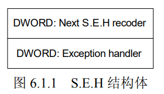
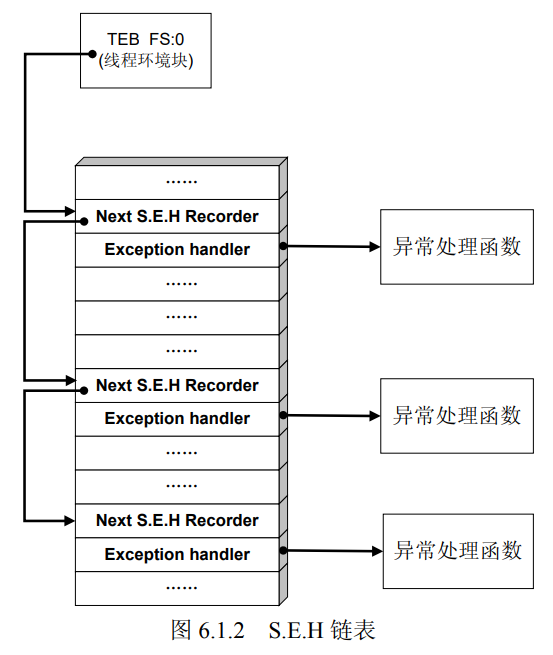

# S.E.H

操作系统或程序在运行时，难免会遇到各种各样的错误，如除零、非法内存访问、文件打 开错误、内存不足、磁盘读写错误、外设操作失败等。为了保证系统在遇到错误时不至于崩溃， 仍能够健壮稳定地继续运行下去， Windows 会对运行在其中的程序提供一次补救的机会来处理 错误，这种机制就是异常处理机制。 

S.E.H 即异常处理结构体（ Structure Exception Handler） ,它是 Windows 异常处理机制所采 用的重要数据结构。每个 S.E.H 包含两个 DWORD 指针： S.E.H 链表 指针和异常处理函数句柄，共 8 个字节



（ 1） S.E.H 结构体存放在系统栈中。 

（2）当线程初始化时，会自动向栈中安装一个 S.E.H，作为线程默认的异常处理。 

（3）如果程序源代码中使用了__try{}__except{}或者 Assert 宏等异常处理机制，编译器将 最终通过向当前函数栈帧中安装一个 S.E.H 来实现异常处理。 

（4）栈中一般会同时存在多个 S.E.H。 

（5）栈中的多个 S.E.H 通过链表指针在栈内由栈顶向栈底串成单向链表，位于链表最顶端 的 S.E.H 通过 T.E.B（线程环境块） 0 字节偏移处的指针标识。 

（6）当异常发生时，操作系统会中断程序，并首先从 T.E.B 的 0 字节偏移处取出距离栈顶 最近的 S.E.H，使用异常处理函数句柄所指向的代码来处理异常

（7）当离“事故现场”最近的异常处理函数运行失败时，将顺着 S.E.H 链表依次尝试其他

的异常处理函数。如果程序安装的所有异常处理函数都不能处理，系统将采用默认的异常处理函数。通 常，这个函数会弹出一个错误对话框，然后强制关闭程序。



从程序设计的角度来讲， S.E.H 就是在系统关闭程序之前，给程序一个执行预先设定的回 调函数（call back ）的机会。大概明白了 S.E.H 的工作原理之后，聪明的读者朋友们可能已经 发现了问题所在。   S.E.H 存放在栈内，故溢出缓冲区的数据有可能淹没 S.E.H。 

（2）精心制造的溢出数据可以把 S.E.H 中异常处理函数的入口地址更改为 shellcode 的起始 地址。 （3）溢出后错误的栈帧或堆块数据往往会触发异常。 4）当 Windows 开始处理溢出后的异常时，会错误地把 shellcode 当作异常处理函数而 执行。 

以上就是利用 Windows 异常处理机制的基本思路。利用异常处理机制往往也是一些高级漏洞利用技 术的关键所在。

## 在栈溢出中利用 S.E.H 

```c
#include<windows.h> 
char shellcode[] = "\x90 \x90 \x90 \x90……";
DWORD MyExceptionhandler(void)
{
	printf("got an exception , pres s Enter to kill proces s ! \n");
	getchar();
	ExitProcess(1);
}
void test(char* input)
{
	char buf[200];
	int zero = 0;
	__asm int 3 //used to break proces s for debug
	__try
	{
		strcpy(buf, input); //溢出
		zero = 4/zero; //生成一个异常
	}
	__except (MyExceptionhandler()) {}
}
main()
{
	test(shellcode);
}
/*
（1）函数 test 中存在典型的栈溢出漏洞。
（2） __try {}会在 test 的函数栈帧中安装一个 S.E.H 结构。
（3） __try 中的除零操作会产生一个异常。
（4）当 strcpy 操作没有产生溢出时，除零操作的异常将最终被 MyExceptionhandler 函数
处理。
（5）当 strcpy 操作产生溢出，并精确地将栈帧中的 S.E.H 异常处理句柄修改为 shellcode 的
入口地址时，操作系统将会错误地使用 shellcode 去处理除零异常，也就是说，代码植入成功。
（6）此外，异常处理机制与堆分配机制类似，会检测进程是否处于调试状态。如果直接使
用调试器加载程序，异常处理会进入调试状态下的处理流程。因此，我们这里同样采用直接在
代码中加入断点_asm int 3，让进程自动中断后再用调试器 attach 的方法进行调试。
这个实验的关键在于确定栈帧中 S.E.H 回调句柄的偏移，然后布置缓冲区，精确地淹没这
个位置，将该句柄修改为 shellcode 的起始位置。*/
```

实验环境 

windows 2000    release生成
