# wireshark

# 基本概念

## 子网

是为了确定网络区域，分开主机和路由器的每个接口，从而产生了若干个分离的网络岛，接口端连接了这些独立网络的端点。 这些独立的网络岛叫做子网(subnet)。 

IP地址是以网络号和主机号来表示网络上的主机的，只有在一个网络号下的计算机之间才能“直接”互通，不同网络号的计算机要通过网关才能互通。

## ip地址

为了了解子网，我们必须快速定义 [IP 地址](https://www.cloudflare.com/learning/dns/glossary/what-is-my-ip-address/)。每个连接到互联网的设备都分配有唯一的 IP（[互联网协议](https://www.cloudflare.com/learning/ddos/glossary/internet-protocol/)）地址，使通过互联网发送的数据可以到达数十亿连接到互联网的设备中的正确设备。当计算机将 IP 地址作为二进制代码（一系列 1 和 0）解读时，IP 地址通常被写成一系列字母数字字符。

## IP 地址的不同部分是什么意思？

本节重点介绍 IPv4 地址，该地址以四个十进制数字（以句点分隔）的形式表示，例如 203.0.113.112。（IPv6 地址更长，并且使用字母和数字。）

每个 IP 地址都有两个部分。第一部分指示地址所属的网络。第二部分指定该网络中的设备。但是，“第一部分”的长度根据网络的类别而变化。

网络被分为不同的类别，标记为 A 到 E。A 类网络可以连接数百万台设备。B 类网络和 C 类网络的规模逐渐减小。（不经常使用 D 类和 E 类网络。）

让我们分解一下这些类如何影响 IP 地址的构造：

**A 类网络：**第一个句点之前的所有内容均表示该网络，而其后的所有内容指定该网络中的设备。以 203.0.113.112 为例，网络用“203”表示，设备用“0.113.112”表示。

**B 类网络：**第二个句点之前的所有内容均表示该网络。同样以 203.0.113.112 为例，“203.0”表示网络，“113.112”表示该网络中的设备。

**C 类网络：**对于 C 类网络，第三个句点之前的所有内容均表示该网络。使用相同的例子，“203.0.113”表示 C 类网络，而“112”表示设备。

## 为什么要划分子网？

如上例所示，IP 地址的构造方式使互联网路由器可以相对容易地找到将数据路由到其中的正确网络。但是，作为示例，在 A 类网络中可能有数百万个已连接的设备，并且数据可能需要一些时间才能找到合适的设备。这就是子网划分派上用场的原因：子网划分缩小了 IP 地址范围，将其限定在一定范围内的设备。

由于 IP 地址仅限于表示网络和设备地址，因此，IP 地址不能用于表示 IP 数据包应访问哪个子网。网络中的路由器使用一种称为子网掩码的东西将数据划归到子网中。

## 什么是子网掩码？

子网掩码类似于 IP 地址，但仅在网络内部使用。路由器使用子网掩码将数据包路由到正确的位置。在互联网上传输的数据包中并不含子网掩码——这些数据包仅指示目标 IP 地址，路由器会将其与子网进行匹配。

假设 Bob 回复了 Alice 的来信，但他将l回复发送到 Alice 的工作地点而不是她的家。Alice 的办公室很大，里面有许多不同的部门。为了确保员工能够迅速收到他们的信件，Alice 的工作场所管理团队按部门而不是按单个员工对邮件进行归类。收到 Bob 的来信后，他们看了一眼 Alice 所在部门，发现她在客户支持部门工作。于是他们将信件发送给客户支持部门而不是给 Alice，然后客户支持部门将其发送给 Alice。

在这个类比当中，“Alice”好比一个IP地址，“客户支持部门”好比一个子网掩码。通过将 Alice 与其所在部门匹配，Bob 的信很快被分拣到一组正确的潜在收件人当中。没有这个步骤，办公室管理员将不得不花费时间来寻找 Alice 办公桌的确切位置，而它可能在建筑物的任何地方。

举个实际例子，假设一个 IP 数据包的目标地址是 192.0.2.15。该 IP 地址是一个 C 类网络，因此该网络由“192.0.2”标识（或从技术上精确地讲是 192.0.2.0/24）。网络路由器将数据包转发到由“192.0.2”表示的网络上的一台主机。

数据包到达该网络后，网络内的路由器将查询路由表。用其子网掩码 255.255.255.0 进行一些二进制数学运算，看到设备地址是“15”（IP 地址的其余部分表示网络），再计算数据包要发送到哪个子网。它将数据包转发到负责在该子网内传递数据包的路由器或[交换机](https://www.cloudflare.com/learning/network-layer/what-is-a-network-switch/)，数据包到达IP地址 192.0.2.15（了解有关[路由器](https://www.cloudflare.com/learning/network-layer/what-is-routing/)和[交换机](https://www.cloudflare.com/learning/network-layer/what-is-a-network-switch/)的更多信息）。

# 介绍

数据包的叫法 帧 包 段 

数据帧的起始点和目的点 都是数据的链路层

包的目的地是网络层

段 是传输层

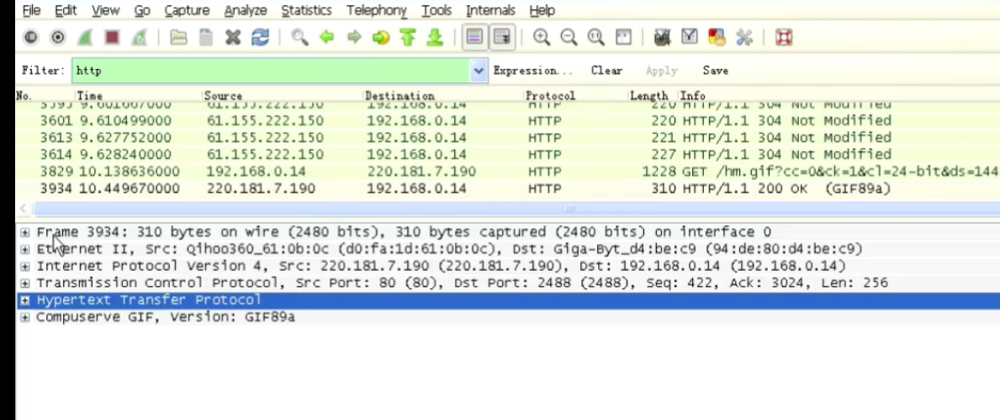

 这四层分别代表

 物理层 

数据链路层 以太网帧的头部信息

网络层ip包的头部信息

传输层的数据段头部的信息

为什么这些MAC地址的开头明明是“00:50:56”或者“00:0c:29”，Wireshark上显示出来却都是“Vmware”？这是因为 MAC 地址的前 3 个字节表示厂商。而 00:50:56 和00:0c:29 都被分配给Vmware公司。这是全球统一的标准，所以Wireshark干脆显示出厂商名了。

## 1.首先看一下物理层  

315号的的数据帧 在这个线路上一共具有355个字节  而实际捕获是355个字节

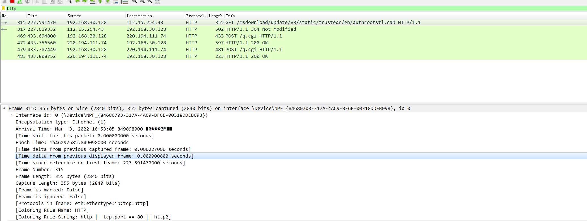

从上到下对应

接口ID 

封装类型

然后是所捕获的日期和时间

当前数据包和前一个数据包的时间间隔

当前和第一个的时间间隔

帧的序号

帧的长度

捕获的长度

帧是否被标记

帧是否被忽略

表示的帧内封装的协议的层次结构

着色标记的协议名称

着色规则显示的字符串

## 2.数据链路层以太网帧

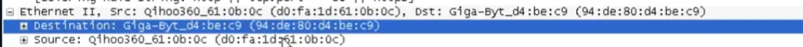

目标的mac地址

源mac地址

mac地址前三个字节 表示厂商名称

## 3.网络层

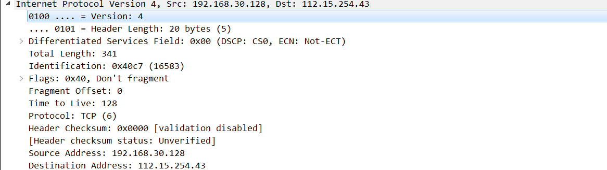

互联网协议 ipv4

ip包头部的长度

差分服务自段

ip包总的长度

标记字段

标记字段

分片的偏移

生存期

当前数据包封装的协议 tcp

头部数据的校验和

源ip地址

目的ip地址

## 4. 传输层

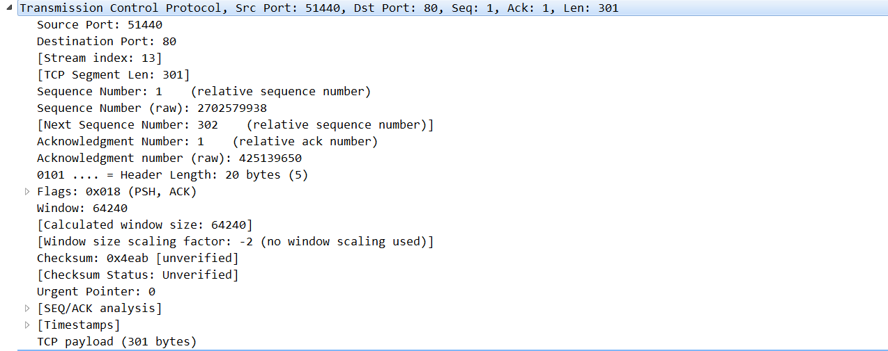

80表示源端口号

目标端口号

序列号

下一个序列号

确认序列号

头部的长度

tcp标记字段

流量控制的窗口大小

tcp数据段的校验和

  

## 筛选

ip.addr==108.97.34.134 and tcp.port=80 筛选ip地址为108.97.34.134 和80端口的数据包了

!tcp 筛选非tcp协议的数据包

fram.len<=150  筛选为数据包长度小于150

tcp[13]==0X18 筛选为 检查协议头偏移13的里的某一字节

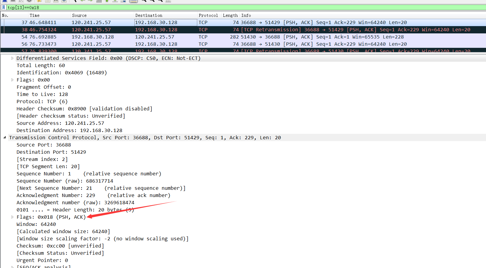

想要重复筛选 就new一个 新的筛选器

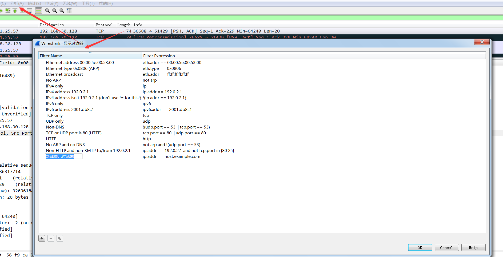

# wireshark 图形显示

横轴表示的是时间，纵轴表示数据包的数量，

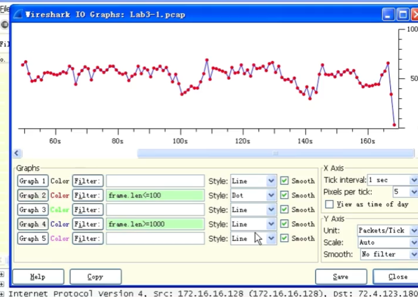

数据帧小于100，以及长度大于1000的情况

看颜色就知道是graph几了

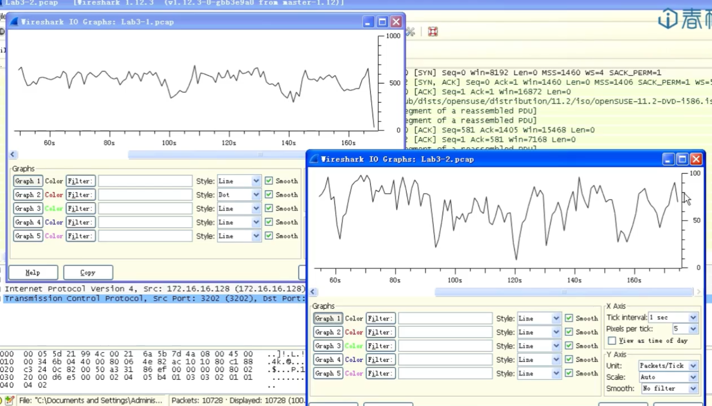

我们可以看到 3-2的数据包非常不稳定

我们可以使用iographs帮助我们分析

wireshark可以分析许多种类的tcp的网络错误 比如说常见的丢包 网络阻塞等等

我们可以  构建单个tcp的标志包 或所有标志包

 

tcp.analysis.flags  丢失重放等异常情况相关的tcp数据包

我们不希望显示窗口的更新数据包 我们就输入 tcp.analysis.window_update

tcp.analysis.flags &&  tcp.analysis.window_update

然后在右边设置为FBar的形式 然后单击graph2按钮

 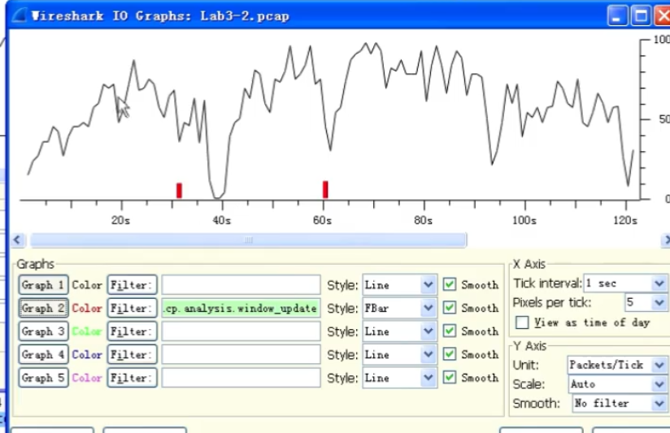

红色的是过滤的情况 黑色的线是捕获文件 整体的情况    

我们在设置单个tcp标志位的情况，这样可以更加具体的分析

我们可以graph1  tcp.analysis.duplicate_ack 然后后面点击 impulse

然后第二个筛选器   tcp.analysis_lost_segment 后面点击dot

第三个筛选器 tcp.analysis.retransmission  后面点击fbar

然后pixels per tick 选为10 然后点击这几个筛选器

 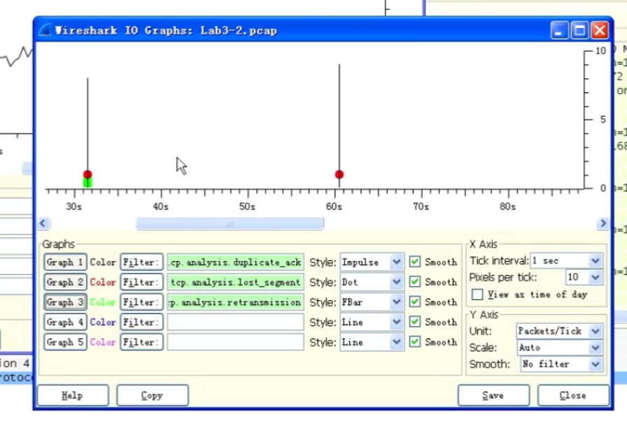

显示的三类出问题的数据包 

其中黑色的线条 表示的是tcp重发的确认包

红色的点表示tcp丢失的数据包 ，

绿色的表示tcp重发的包

还有一个对所捕获的文件进行往返时间的绘图 rtt 一个数据包从发出到确认被成功接收 所需要的时间，

通过这个时间可以找到通信中的瓶颈 确定是否存在延迟

点击一个tcp 

文件栏点击 statistics-tcp streamgraph- round trip time graph

 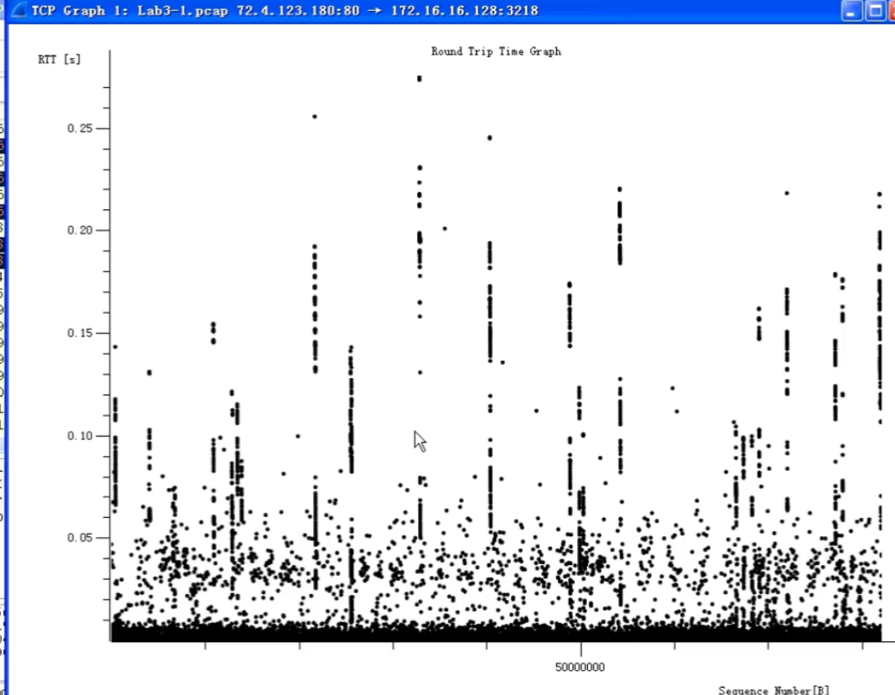

 点击上面的黑点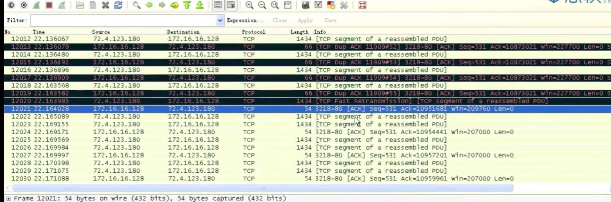

这里面的点 大多数是0.05以下，有少量是 0.25 整体是可以被接受的

还有一个数据流图

 可以将链接可视化，并且将一段时间的数据流 显示出来，数据流图一般以列的方式将主机之间的连接显示出来，并将数据连接在一起 更加直观的解读

statistics-flow graph

 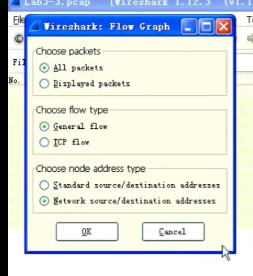

 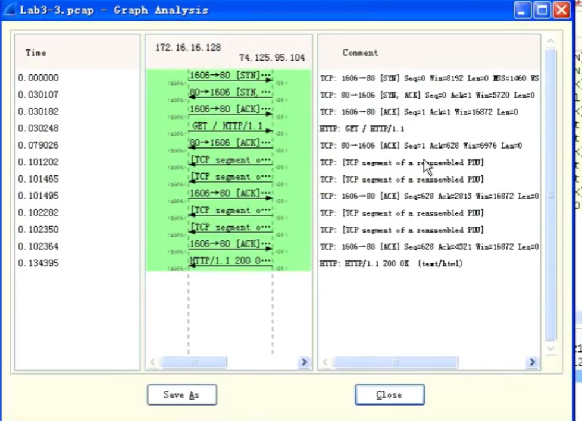

# wireshark的高级特性

协议的解析功能 是由wireshark的协议解析器完成的，它可以将网络上获取的原始二进制数据包进行拆分变成相关协议的不同区段，以便于我们分析

我们可以将wireshrak的协议解析器看作是网络原始数据流和wireshark软件之间的翻译器

如果想要让wireshark支持某给协议 必须拥有该协议的解析器

wireshark 并不会每次都选择正确的解析器 ，网络上的协议不同于标准的配置时候，一旦遇到这种情况，我们就需要更改wireshark解析方式，

ssl（安全的套接字协议，通常用于主机之间安全加密的传输）ssl是用来保密传输的，wireshark里面查看ssl数据包 并不会发现有用的信息，我们重点查看packet这个面板

我们不会读取到 数据包里有用的信息 更不会看到明文形式传输的用户名 

而我们却看到了 所以这并不是ssl

 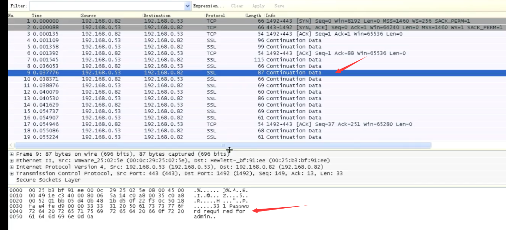

是ftp数据包 而不是ssl

而导致wireshark 错误的原因呢，很可能是ftp协议 使用了443号 端口 这个端口原本是应当是https专用的端口 https指的就是基于ssl的http

  为了解决这个问题 我们就需要强制wireshark使用htp协议器 来解析这些数据包，

我们选择他右键 decode as

 我们在下拉列表中选择 destination 443  并且在右边的列表 找到ftp

 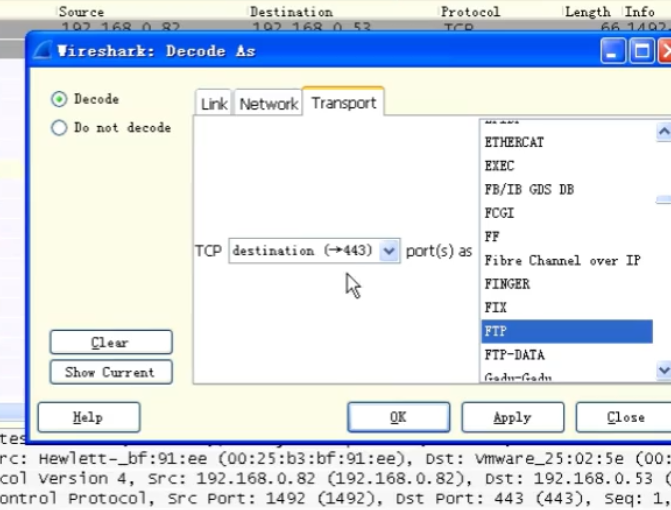

这次修改并不会保存

tcp stream

tcp 流 重组成 易于阅读的形式 而不是一小块 一小块查看，我们鼠标右键 选择任意的数据包，选择follo tcp stream  

 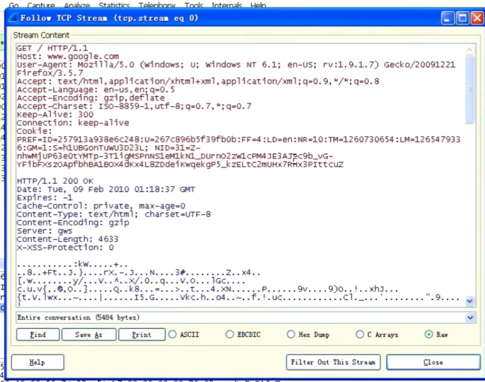

以太网上 帧的大小为 1518个字节  除去 以太网 ip 以及tcp等头部信息，还能够剩下 1460个字节，这些字节 可以供应用层协议来使用，我们可以通过一个捕获文件中的数据包 长度 的分布情况，来对流量进行分析，

 选择statistics - packet lengths然后选择 creat stat 

  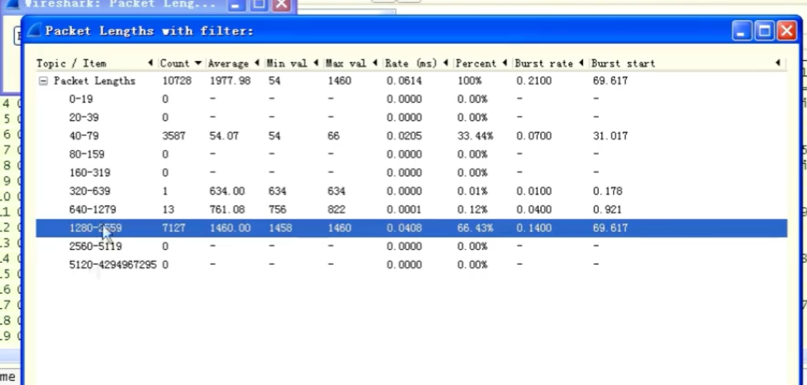

一般 7127这种较大的数据包 一般用于数据的传输，有可能是http的下载  ftp的上传

而较小的数据包，则是保存协议的控制序列，这是保存 tcp控制的数据包，

事实上 查看数据包的长度，是对捕获文件进行概念的很好的一种方法，

专家信息

其实 整个网络中的tcp信息 都会被wireshark等专家信息所记录 比如说，丢包 网络阻塞等等 

针对于每个协议的解析器 都会有 专家信息，我们可以通过专家信息来查看  使用该协议的数据包中的一些特定状态的错误 警告，以及提示等信息，

analyze - expert info 来打开

  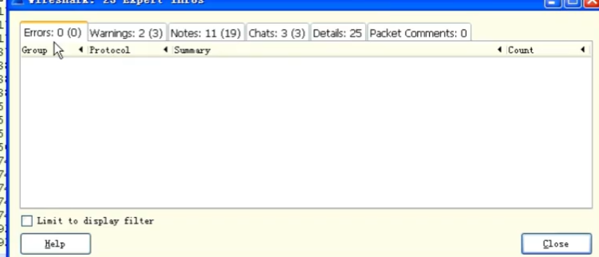

error是表明 数据包里面或者解析器 解析时出现的错误，

warning是表示不正常通信，中的异常数据包

notes 是正常通信中的数据包

chats 是网络通信的基本信息

details 显示数据包的详细信息，

packet comments 是数据包的描述信息

 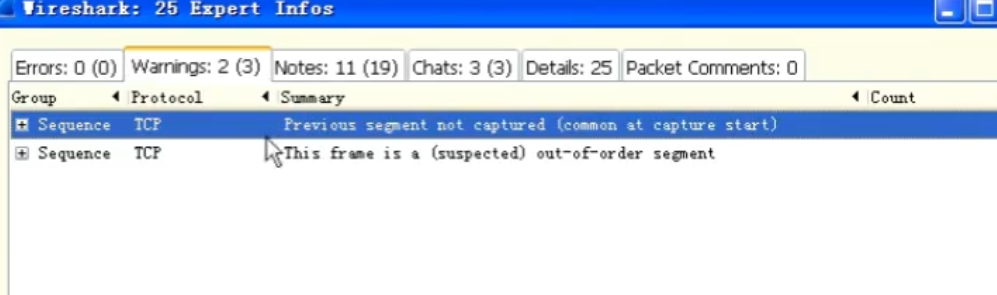

第一个 warning 表示数据包的丢失 当数据流中期望的序列号 被跳过的时候，这个警告就会出现

第二个 数据包没有按照顺序接受的时候就会出现

 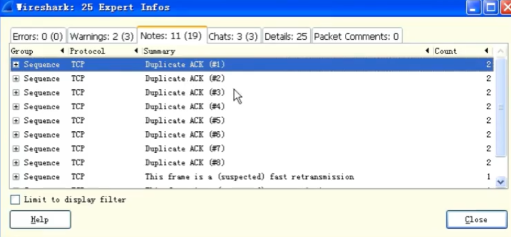

表示当一台主机 没有收到下一个期望的数据包的时候 就会生成最近收到的一次ack

也就表面 新的数据包没有收到    

wireshark 不妨先看看警告和信息 

# ARP协议的数据包分析

  arp称地址解析协议 是用于 将ip地址解析为 mac地址 ，是因为网络中 用于连接各个设备的交换机 使用的

内容可寻址存储器，这个存储器 维护的apr表 列出了 他在哪一个端口的所有连接设备的mac地址，当交换机收到了指向特定mac地址的网络流量时候，他就会使用这个表来确定应该使用哪一个端口来发送流量，如果目标mac地址是未知的，那么传输设备会首先在他的缓存中，查找这个地址，如果没有找到，那这个地址就需要在网络上额外的通讯功能解析

 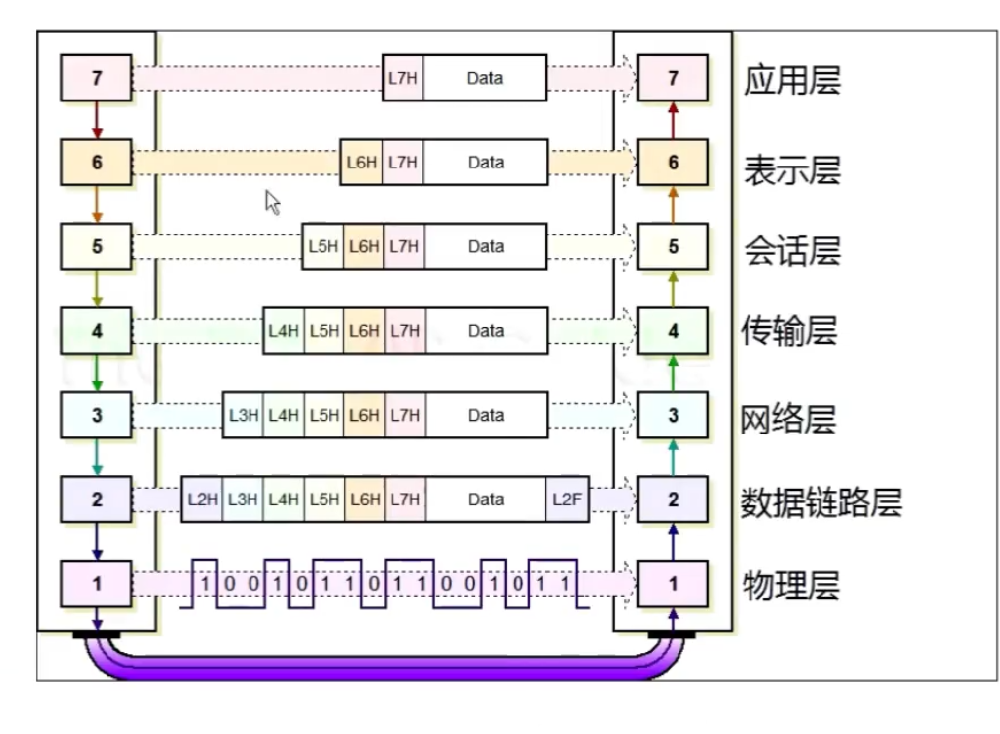

osi模型 将网络分成了7层，而ip地址位于网络层 mac地址是位于数据链路层  

通过以太网发送ip数据包的时候，需要首先封装第三层和第二层的报头，但由于发送数据包的时候，只知道目标的ip地址 不知道他的mac地址，而又不能够之间跨越第二层和第三层 所以要使用 arp协议之后，而在用了arp协议之后，计算机就可以按照网络层ip数据包的头部信息 ，将硬件地址信息 mac地址对应起来以保证通讯的顺利进行，

arp协议的基本功能 就是将已知的ip地址，解析成，mac地址，以便主机之间可以正常通讯

arp协议的解析过程 只使用了两种数据包 一个是arp请求 另外一个arp响应

 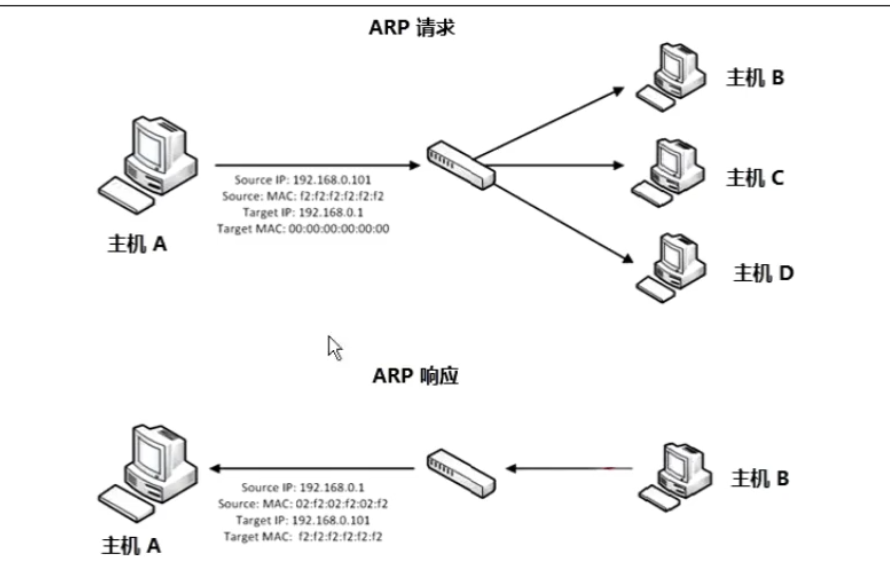

当主机A想要给主机B发送数据的时候， 主机A会先在自己的本地arp缓存表中，检查与主机B相匹配的mac地址，如果说主机A在自己的缓存表中没有找到相关条目，那么他就要想办法获取主机B的mac地址，这就需要将arp的请求帧广播到所有的主机上面，而这个请求帧就包含，主机A的 ip地址和mac地址 和主机B的mac地址，在网络中凡是收到请求帧的主机都会检查自己的ip地址是否与请求地址一致，如果不一致就会丢弃这个请求帧，对于这个图来说 主机C和主机D就会丢弃由主机A发出的请求帧，

而当主机B确定 arp请求中的ip地址和自己的ip地址一致，那 么就会将主机a的mac地址和ip地址，添加到他自己的缓存列表里面 之后主机b将包含有自己mac地址和arp响应消息 之间回复给主机A

当主机A收到由主机B发来的消息之后呢，就会将主机B的ip地址和mac地址添加到自己的arp缓存列表里面，那么接下来，主机A就可以向主机B发送消息了。

如果查看自己的arp缓存列表

可以打开cmd 输入arp-a

本地的缓存是有生命周期的， 默认的arp缓存表的有效期为120秒 过期后需要重复我们之前所讲的这个过程

 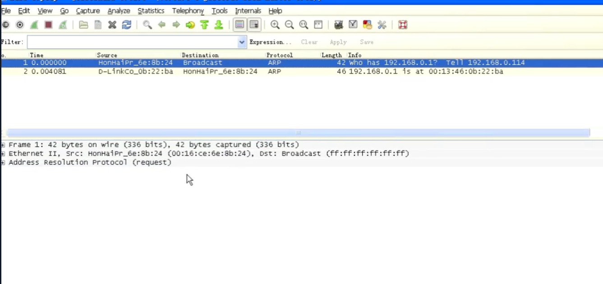

第一个数据包就是arp 请求数据包，

我们进入 packets 检查以太网头部的信息，来确定是否是真正的广播的数据包

 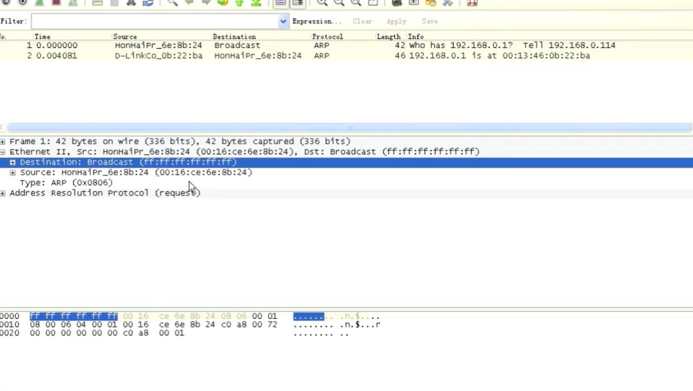

这个数据包大小为42个字节

这个数据包目的地址是 全F的 那么这个是广播地址，说明当前数据包会被广播到当前网断中的所有的 

设备上，而这个数据包当中呢 以太网源地址 是本机的mac地址，

# Wireshark眼中的IP协议

 TTL 存活时间 用于定义数据包的生存周期 该数据包被丢弃之前，所能够经历的时间 经过一个路由器 TTL的值减去一

icmp internet IP报文协议

IP分片

# TPC 与UDP协议详解

 TCP是一种面向连接的，可靠的基于ip的传输协议 他的主要目的是为了 给数据提供可靠的端到端的传输，它能够处理数据的顺序传输以及错误恢复并且保证数据能够到达目的地

UDP主要目的则是一种无连接的 传输层协议，提供面向事物的 简单的不可靠的信息的传输服务

TCP是传输控制协议，所以tcp通信都会使用源端口和目的端口，这些信息可以在每个tcp包的头部找到，而为了能够，将数据传输到远程服务器和设备特点应用中去呢，tcp数据包必须知道远程服务所监听的端口，如果想要尝试连接一个不同于所设置的端口，那么通信就会失败，使用tcp通信的时候，我们可以使用 65535个端口， 1-1023的端口属于标准的端口组，往往是特定的服务所使用的 1024-65535是临时端口，需要使用的时候 操作系统会在通信的时候 进行选择

  

  tcp所提供的是可靠的数据传输，因此在传输之前是与目标主机建立连接，而所有基于tcp的通信都需要与两台主机之间的握手开始，

 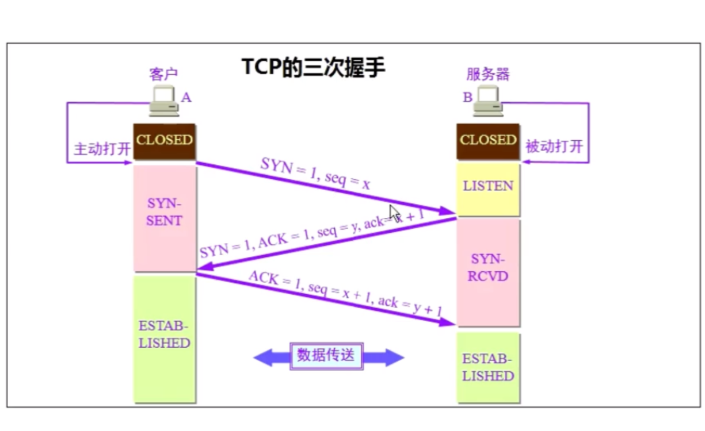

5：23

