# 简介

## 为什么学保护模式

了解操作系统是怎么运行的

以及它的一些机制，其实很大一部分都在cpu上，cpu规定的 必须要这样

## 什么是保护模式

x86 CPU的3个模式:实模式、保护模式和虚拟8086模式。

## 保护模式保护什么

保护一个是段一个是页，保护模式真正保护的是数据结构、寄存器、指令

保护的是硬件访问权限，一切的软件没有资格访问硬件，只有硬件访问 （系统）权限才能访问硬件

 应用程序通过API（ring3切换到ring0）向系统申请访问硬件 进入ring0 操作磁盘

比如说readfile 操作了磁盘 磁盘此时是被保护起来的，那么他就会切换权限,就是说api内部要负责权限的切换

 切换到0环是需要很多参数的初始化， 不是想进就进的

切换权限只是一个请求

保护模式下80386支持多任务内存隔离，60年代我们运行一个程序崩了，整台电脑就关机了 

dos操作系统存在于实模式下，windows操作系统运行与保护模式下

保护的是对内存的访问，相对实模式安全。段层面保护，页层面保护。9

保护`内存非法访问`和`特权指令的使用`。


# 段寄存器

CPU共有八个段寄存器 ： ES CS SS DS FS GS LDTR TR ，OD可见前6个，但GS段寄存器windows并未使用（32位下）。

如果运行在实模式下，则只有前四个有用。

如果是64位，则使用GS而不是FS。

LDT：局部描述符表 LDTR寄存器指向LDT段描述符。段描述符具体是什么在后文说明。

当执行一条指令如`mov dword ptr ds:[0x12345678],eax`时 ， 真正访问的地址： `ds.base + 0x12345678`

当执行一条指令时，真正执行的是`cs.base+EIP`处的指令

当访问堆栈时，真正访问的是`ss.base+Addr`地址。

段寄存器结构： 共96位， 16位可见，80位不可见。 

可见部分为Selector成员（选择子）。

具体结构如下图：


​	

 


ES=2B  

2B对应二进制

00101 0 *11*   最低两位是11 是3 所以说处于3环权限 

​                          从右开始数 第三位 是 0的话 查GDT表 1的话查LDT表   LDT不能单独存在 他只能嵌套在GDT里面 而且ldt可以有多张  如果第三位是1 会执行lldt去装载某一个ldt表，然后这个段选择子回去GDT里面找到这个ldt   


段描述符的位置 =gdt首地址+5*8 


读段寄存器指令：mov ax,es 只能读16位（可见部分）

写段寄存器指令：mov ds,ax 写了96位的。

段寄存器可以用mov指令读写，但是LDTR和TR除外。

证明隐藏的80位的存在：（下表属性是根据实际分析时总结出来的。）


# 段权限检查

### CPU分级（与操作系统无关）

0环 1环 2环 3环 特权指令只能运行在0环

我们常说的驱动就是运行在0环权限下。也是最高权限，所以驱动才会那么牛逼。

而常见的一些exe dll等我们直观感受的软件，代码都是运行在3环，权限最低。

### CPL-当前特权级别

当前特权级：CS和SS段选择子的后两位。之所以称为3环程序就是CPL为3

CS和SS段选择子的后两位永远相同！（X86规定的）

所以所谓的你程序是几环的就是看CS SS，而所谓的提权就是改CS SS，只要有一种方法能改掉CS SS，那就是提权。

### DPL-描述符特权级别

描述符特权级别：访问该段所需要的特权级别。

```
mov ds,ax  若ax所指向的段描述符级别为0，且当前CPL为3，那么这行指令执行会失败。
```

### RPL-请求特权级别

请求特权级别：段选择子中的后两位，可以随意指定。

当使用选择子来加载段描述符时，会检查CPL DPL RPL三者。

### 数据段的权限检查

```
mov ax,000B        //RPL = 3
mov ds,ax        //假设DPL = 0
```

假设上述代码运行在0环，也就是CPL=0，成功条件为：CPL<=DPL且RPL<=DPL，所以代码会执行失败。

### 练习

修改DS CS对应的DPL，看看OD中内存访问、代码执行会有什么影响？


怎么修改ds cs对应的dpl呢  我们首先修改ds的 我们根据之前的实验 可以知道 ds的段选择子是 23 ok 我们直接找到ds的段描述符 我们用

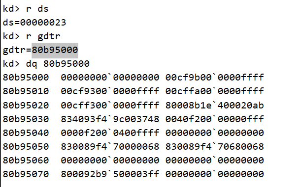

此时 dpl是0 因为c9 9对应的二进制是1001  p是1   dpl 是11  s是 1 所以改成f 9的二进制是1001

此时dpl等于二进制00 也就是0

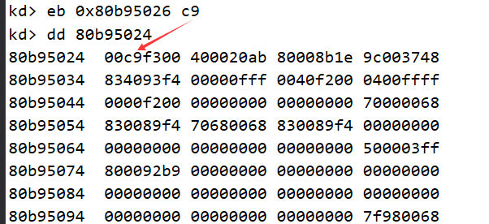

改完之后 

注意这句话，段选择子的RPL一定要<=对应段描述符的DPL，否则试图使用该选择子加载对应段描述符的行为将由于权限不足而失败

此时rpl是多少呢 我们看ds是0X23 是可见的16位段选择是分开就是 00100  0   11      

rpl 是11

rpl大于 dpl  程序会问题 


## 代码跨段跳转

必须保证CS与EIP同时修改，因此没有lcs这种只修改cs的指令。

同时修改CS与EIP的指令：

```
JMP FAR、CALL FAR、RETF、INT、IRETED
```

案例：

JMP FAR 0x20:0x004183D7

```
1.0x20为段选择子，拆分后RPL=0 TI=0 INDEX=4，因此查GDT表，索引为4，请求特权级为0
2.查GDT找对应段描述符。由于是修改CS段，所以不是所有段描述符都可以，四种情况可以跳转：代码段、调用门、TSS任务段、任务门    此处为了练习我们只规定其必须使用代码段描述符。
3.权限检查 如果是非一致代码段  CPL== DPL 且 RPL<=DPL   严格检查权限则使用非一致代码段
         如果是一致代码段  CPL>=DPL  不会破坏内核数据的可以使用一致代码段
4.将段描述符加载到CS段寄存器中。
5.将SC.base+Offset写入EIP，然后执行CS:EIP处的代码
 
直接对代码段进行JMP或CALL，无论目标是否为一致代码段，CPL都不会发生改变。只能通过类似调用门的方式改变CPL。


```

### 一致代码段：
​    也就是共享的段，特权级高的程序不允许访问特权级低的数据：内核态不允许访问用户态数据
​    特权级低的程序可以访问特权级高的数据：用户态可以访问内核态数据，但特权级依然是用户级别。

### 非一致代码段：

​    普通代码段，只允许同级访问。禁止不同级别的访问。

### 练习

JMP 0x20:0x12345678 cpu如何执行这段代码

```
1、段选择子拆分
0x20对应二进制形式0000 0000 0010 0000
RPL =00 
TI=0
index=4
2、查表得到段描述符
TI=0 所以查GDT表
index=4 找到对应的段描述符
四种情况可以跳转 代码段 调用门 TSS任务段、任务门


3、权限检查
如果是非一致代码段，要求:CPL==DPL并且RPL<= DPL
如果是一致代码段，要求:CPL非DPL

4、加载段描述符
通过上面的权限检查后，CPU会将段描述符加载到CS段寄存器中
5、代码执行
CPU将 CS.Base + Offset 的值写入EIP 然后执行CS:EIP处的代码，段间跳转结束。

所以这里的话查看实验是否做成功，这里只需要跟到cs.base+offset的地方看是否写入EIP来进行判断即可
```

### 非一致代码段访问实验

如果是非一致代码段，则需要满足 CPL == DPL 并且 RPL <= DPL

1、首先描述符是有效的，所以P需要为1

2、CPL>=DPL的，在OD中的时候，此时默认为3环的环境，那么此时的CPL则为3，那么DPL也只能为3，所以这里选择实验的段描述符DPL需要为3

3、又因为是代码段的描述符，所以S位需要为1，并且TYPE位中的C（一致性）需要为0

我们在gdt表中找一个没用的数据 改一下

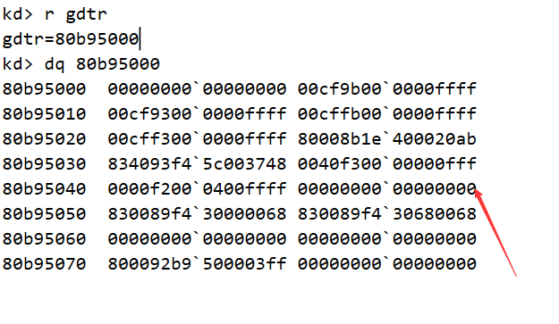

所以这里将0x48的位置替换为`00cffb00 0000ffff`，通过windbg的指令`eq 80b95048 00cffb00 0000ffff`，，因为这段数据，f -> 1111 那么则是 P为1 DPL为3 S为1 ，b -> 1011 符合TYPE位中的C为0

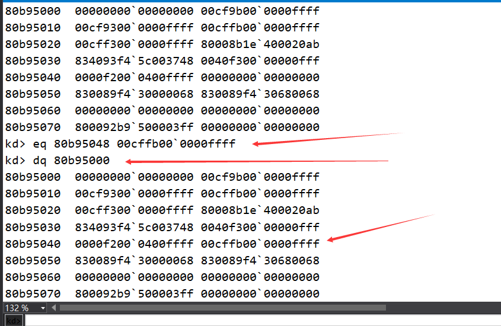

索引为9  所以段选择子为01001 0 11 为4B

进入虚拟机 用od随便打开一个exe，改eip为jmp far 004B:00403500  此时cs为1b

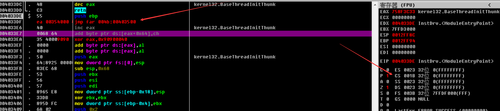

可以看到如下的段描述符是符合条件的，00cffb00`0000ffff，f -> 1111 那么则是 P为1 DPL为3 S为1 ，b -> 1011 符合TYPE位中的C为0

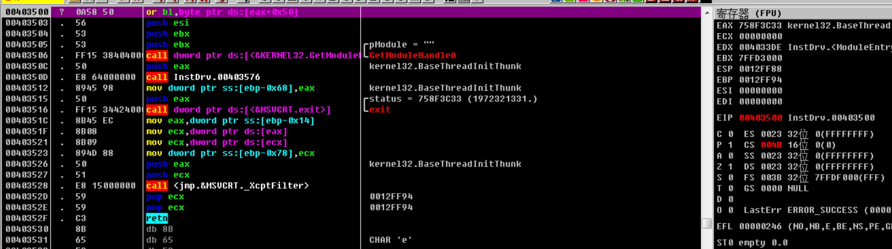

cs变为4B了 成功！！！

### 一致代码段访问实验

如果需要是一致代码段的段描述符的话，条件需要是 CPL >= DPL，其实这里的话还可以想下为什么没有了RPL的限制？个人理解其实就是为了低权限访问高权限，所以自然就没了RPL的限制

但是如果想让代码段的一致属性为1的话，可以发现是没有的，因为如下图中TYPE位都是<12的，所以这里的话需要自己构建

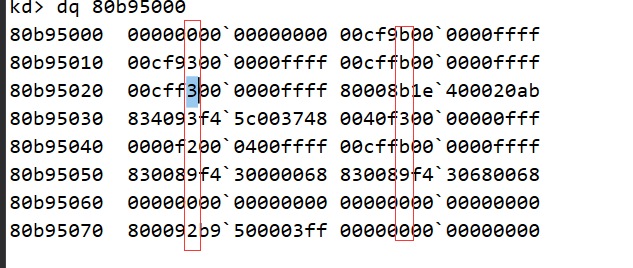

这里通过windbg来制造一个新的段描述符，改的位置还是0x48的位置，因为默认是无效的空描述符，这里是空的 因为我之前改过了，再改一边`eq 80b95048 00c9fc00 0000ffff`

这里需要注意的是我这里制造的段描述符的 00c9fc00 0000ffff ，则该段描述符的DPL的值是为0的，那么此时的情况就是CPL为3 RPL为3（默认CS的RPL为3）去访问一个DPL为0的段描述符

这里继续来测试，`jmp far 0048:00403500`，如下图所示，发现成功改变了CS代码段的段选择子为4B

段选择子0x48和0x4B的结果会一样，原因就是3环的环境，最终rpl会被置位11，所以 8 -> 1000 和 B -> 1011 被置位rpl为3的结果就是 1011 和 1011

所以这里会发现通过一致代码段访问，可以实现让一个低权限去访问一个高权限才能访问的段描述符，但是需要注意的就是CPL不变，还是3环的权限，所以这种方法不能称作为真正的提权，真正的提权应该是提升CPL的权限

### 什么时候会使用一致/非一致代码段

对于一致代码段，也就是共享的段

- 特权级高的程序不允许访问特权级低的数据：核心态不允许访问用户态的数据
- 特权级低的程序可以访问到特权级高的数据，但特权级不会改变：用户态还是用户态

对于普通代码段：也就是非一致代码段

- 只允许同级访问
- 绝对禁止不同级别的访问：核心态不是用户态，用户态也不是核心态.

直接对代码段进行JMP 或者 CALL的操作，无论目标是一致代码段还是非一致代码段，CPL都不会发生改变（从上面的实验也能看出来，默认会将改变的段选择子的RPL改为3）。如果要提升CPL的权限，只能通过调用门。

### 代码跨段跳转实验（3环测试）

大家可以自己再研究研究

- 构造一个DPL为3的非一致代码段的段描述符，使用JMP FAR指定一个RPL为3的段选择子，可以执行
- 构造一个DPL为0的非一致代码段的段描述符，使用JMP FAR指定一个RPL为3的段选择子，不可以执行
- 构造一个DPL为0的一致代码段的段描述符，使用JMP FAR指定一个RPL为3的段选择子，可以执行
- 构造一个DPL为0的一致代码段的段描述符，使用JMP FAR指定一个RPL为0的段选择子，可以执行

# 长调用与短调用

CALL FAR较为复杂，因为对堆栈产生了影响。

## 短调用：

常规call调用，调用后将下一条指令地址压入堆栈，并将ESP-4，然后修改EIP为指定地址。

RETN将栈顶数据赋给EIP，并将ESP+4

发生改变的寄存器只有`ESP`和`EIP`，即所谓的短调用。

## 长调用（跨段不提权，call代码段）

指令格式： CALL FAR CS:EIP

拆分CS段选择子，找到一个段描述符，这个段描述符是一个代码段。新EIP为该代码段的base+call指令后面的EIP

call时会将调用者的CS首先压入堆栈，然后压入返回地址。同时修改CS。（RPL若与CPL不同，会被CPU强制修正。）

## 长调用（跨段不提权，call门）

指令格式： CALL FAR CS:EIP （EIP是废弃的，通过指定的段选择子来决定跳到哪）

拆分CS段选择子，找到一个段描述符，这个段描述符必须是个调用门。

跨段不提权的长调用与短调用不同的是，call时会将调用者的CS首先压入堆栈，长返回retf时在弹出EIP后再将CS弹出

## 长调用（跨段并提权，call门）（堆栈切换）

指令格式： CALL FAR CS:EIP （EIP是废弃的，通过指定的段选择子来决定跳到哪）

拆分CS段选择子，找到一个段描述符，这个段描述符必须是个调用门。

涉及到权限变化后会发生堆栈的切换。从原调用者的堆栈A到目标堆栈B。

CALL后会将调用者的SS ESP CS 返回地址依次压入到堆栈B中。在retf时依次弹出回原调用者。

堆栈B和SS来源于TSS，每当发生提权调用时CPU就会从TSS中取出堆栈B和SS的值，而这两个值是Windows操作系统赋进去的。每个线程有两份堆栈，一份3环的一份0环的。

## 提权时的新堆栈从哪来

提权方式共有：调用门 任务门 中断门 陷阱门 快速调用 这几种。

其中快速调用需要CPU的MSR寄存器支持。

除了快速调用以外，其他的提权方式SS 和 ESP都是从TSS中获取。

快速调用的SS是通过CS+8计算得到，ESP在MSR寄存器里存着。

## 练习


门描述符后面学，先练习call代码段。

使用call far调用自己的裸函数，裸函数内使用jmp far跳回来。要求不能崩溃报错、跳回后原寄存器的数值不能被改变。

# 调用门

调用门的结构如下图所示。它和普通的段描述符结构十分相似。低四个字节改为段选择子，如果指向的段描述符的`DPL`小于`CPL`，则会提权。高四个字节低5个位是调用调用门需要的参数数目。低四个字节的低16位和高四个字节的高16位拼接为跳转后新的在段中的偏移，也就是调用后`EIP`的位置。

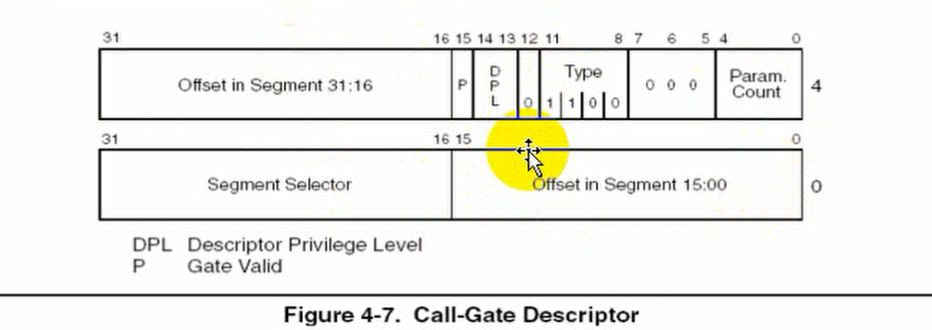

**那么调用门其实就是 type为12的情况下的一个段寄存器**。

| 字段              | 内容                                                    |
| ----------------- | ------------------------------------------------------- |
| offset in segment | 要跳转的函数的地址，或者是要跳转的地址                  |
| segment selector  | 段选择子，要变成的段选择子（提权的关键）                |
| Param Count       | 函数参数个数                                            |
| 高位5-7           | 固定的三个0                                             |
| Type              | 系统段只能是1100（10进制的12）                          |
| 高12地址          | 就是段描述符的S字段，就系统调用的必须是0                |
| DPL               | 肯定赋值为3呀，这样ring3才能。                          |
| p                 | 和段描述符一样表示该段是否有效，当P为0时无效，1时有效。 |


根据CS的值查GDT得到门描述符，门描述符中的SegmentSelector指向一个代码段描述符。

代码段描述符的base+门描述符的Offset才是要执行的代码的位置。

最终CS的值是调用门描述符内的选择子的值。

构造门描述符时，DPL一定要为3，否则无法访问门描述符，这样就连敲门的权利的没有了何谈进入门内提权。

调用门描述符内的选择子指向的代码段描述符的DPL为0时会自动提权。（代码3环，RPL任意，门3环，门内的代码段0环，则会自动提权）


利用调用门提权

我们可以通过构造段选择子和段描述符来自己添加一个调用门也就是添加一个段来自己使用。

因为段寄存器无非就是拥有一个起始地址然后作为一个段的内容来让你使用。用汇编写过代码的肯定知道如果构造一个段：

所以这里的段选择子就构造为： 0008（因为段选择子是两个字节16位）

然后再根据前面的解析我们目前的构造是这样的：

```
高32位:
    0-3:
    0(十六进制)
    4-7:
    0（十六进制)
    8-11:
     C（十六进制）
    12-15:
     E(十六进制)
     16-31：
        函数地址的高地址:xxxx
低32:
    0-15:
        函数地址的低地址：xxxx
    16-31:
        0008
合集:
    xxxxEC000008xxxx
```

目前就是函数地址需要解决，这个函数地址的话其实就是我们的代码的起始地址，然后就处理这个函数的内容了。

我们可以写一个函数不就完了嘛，但是需要修改成固定基址，这样函数地址就不会改变了。**需要采用release版本，因为debug版本有个jmp，然后还得修改优化和随机基址**：

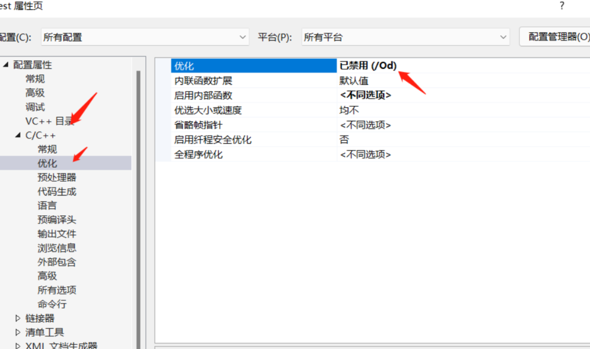

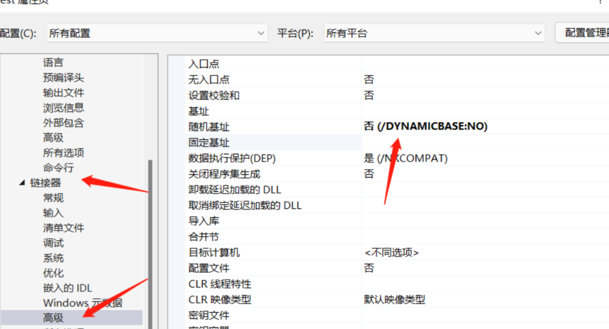

```c
#include<iostream>
#include<Windows.h>
using namespace std;
    void _declspec(naked) test()
    {
        _asm
        {
            //这里我们访问一个0环才能访问的地址
            //这样就知道是否是拿到了0环的权限
            push eax
            mov eax,0x80b95040
            mov eax,[eax]
            pop eax
            ret
        }
    }
    int main()
    {
        printf("%x\n", test);//输出函数的地址
        system("pause");
        return 0;
    }
```

这里我的函数地址是：40100f

4111c7

所以完整的段描述符值为：

```
0040EC00`0008100f
```

将段描述符添加到gdt表：

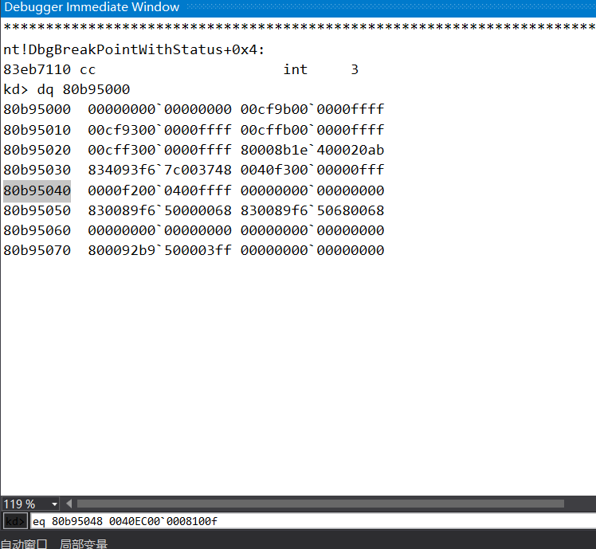


## 调用门执行

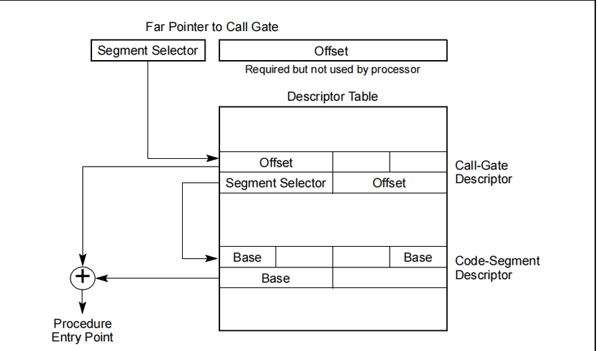


## 1.调用门执行流程 

```
1.首先会通过MAX{CPL,RPL} <= DPL的规则检查当前程序是否有权限去访问这个调用门.
2.如果权限能够访问，这时会使用调用门里面存储的段选择子去选择GDT或者LDT中的段描述符，与段描述符DPL进行比较的还是当前的CPL，而且要求当前的CPL一定是数值上大于该段描述符DPL的
3.通过call指令调用调用门，不管是不是一致代码段，一定是提权（或者保持权限不变的），而不能够通过调用门降低权限。
```

## 2.调用门[堆栈](https://so.csdn.net/so/search?q=堆栈&spm=1001.2101.3001.7020)变化 

```
当通过门，权限不变的时候，只会PUSH两个值：CS 返回地址新的CS的值由调用门决定
当通过门，权限改变的时候，会PUSH四个值：SS ESP CS 返回地址 新的CS的值由调用门决定 新的SS和ESP由    TSS提供
 
当提权发生时，栈切换的顺序
  1.使用目标代码段的DPL从TSS中选择合适的SS段选择子和ESP
  2.从TSS中读取SS，ESP，在读的过程中如果发生任何读错误，或者使用SS载入段选择子错误，都会产生一个无效TSS错误（#TS）
  3.检查SS段选择子的权限（跟当前代码段DPL比较是否匹配）、类型，如果发生错误就产生无效TSS异常（#TSS）
  4.暂时存储当前的SS和ESP
  5.载入新SS，ESP
  6.把第四步中暂时保存的SS和ESP压入新的堆栈
  7.从调用函数中拷贝参数到新的堆栈里
  8.CS，EIP压入堆栈
  9.从调用门描述符内载入新的CS和EIP，开始执行函数
 
通过门调用时，要执行哪行代码由调用门决定，但使用RETF返回时，由堆栈中压入的值决定，这就是说，进门时只能按指定路线走，出门时可以翻墙(只要改变堆栈里面的值就可以想去哪去哪)  
 
```

## 3.调用门返回过程

```
调用门返回
  1.检查存在堆栈内的之前CS寄存器的RPL值决定返回是否会发生权限切换（如果该值数值上大于当前CPL就会发生权限切换）
  2.通过堆栈内保存的CS，EIP的值载入到CS和EIP中（使用保存cs载入段描述符的时候会进行权限检查）
  3.当前ESP加上参数个数*每个参数大小进行堆栈平衡，这一步做完以后，当前ESP指向堆栈内之前的ESP
  4.（如果返回发生了权限的切换）载入堆栈内的之前ESP，SS的值到ESP，SS，切换回原来的堆栈，任何越界访问都会影发#GP异常，新的SS也会进行类型还有权限的检查
  5.如果ret里面有堆栈平衡的操作，那么也会对此时的堆栈进行平衡操作
  6.（如果返回发生了权限的切换）检查DS，ES，FS，GS，如果这些寄存器指向的段DPL小于新的CPL，那么该寄存器会被载入一个空的段选择子（实验发现并没有载入空的段选择子，而是保存的原来的段选择子）
 
只有当从一个高权限返回低权限的时候，跨权限返回的过程才会发生，处理器会比较堆栈中存储的CS里的RPL值（也就是之后可能的CPL值）
只有当RPL的值数值上大于当前CPL的时候，不同权限的返回才会发生（如果是相同权限，则pop的只是EIP和CS，算是普通的retf返回）
所以你并不能控制返回后继续执行时代码的权限（其实0环可以返回到1,2环的权限，不过就需要你自己构造段描述符）
```

## 调用门（无参）

指令格式： CALL FAR CS:EIP （EIP是废弃的，通过指定的段选择子来决定跳到哪）

## 调用门（有参）

参数个数写入门描述符中的ParamCount中，参数手动push，执行结束后通过retf 0xC之类的命令返回。注意堆栈平衡。

参数存储在CS和ESP之间，如 push 1 ， push 2， call far xxxx， 堆栈内部情况为：返回地址、原CS、2、1、原ESP、原SS

## 练习

1️⃣ 构造无参的调用门，实现提权后读取高2G的地址并分析堆栈情况。


 2️⃣ 构造有参的调用门，实现提权后正确依次取出参数并分析堆栈情况。
 3️⃣ 构造调用门，提权后，实现“FQ”，即不按原函数地址返回。
 4️⃣ 构造中断门，实现提权后读取高2G的地址并分析堆栈情况。
 5️⃣ 构造陷阱门，实现提权后读取高2G的地址并分析堆栈情况。

1. 使用call调用门进0环。
2. 使用call调用门从3环跳3环。
3. 使用jmp调用门进0环。
4. 使用jmp调用门从3环跳3环。
5. 使用任意方法进入0环，使用jmp调用门从0环回3环。
6. 使用任意方法进入0环，使用jmp调用门从0环跳到0环。
7. 使用任意方法进入0环，使用call调用门从0环回3环。
8. 使用任意方法进入0环，使用call调用门从0环跳到0环。

## 调用门总结

当通过门，权限不变的时候，只会PUSH两个值: CS返回地址
新的CS的值由调用门决定
当通过门，权限改变的时候，会PUSH四个值: SS ESP CS返
回地址新的CS的值由调用门决定新的SS和ESP由TSS提供

通过门调用时，要执行哪行代码有调用门决定，但使用RETF返
回时，由堆栈中压人的值决定，这就是说，进门时只能按指定路
线走，出门时可以翻墙(只要改变堆栈里面的值就可以想去哪去哪)

可不可以再建个门出去呢?也就是用Call当然可以了前门进后
门出.

call可以调用调用门。
对应代码段比CPL权限高时，自动提权，堆栈存储EIP CS 参数 ESP SS。
对应代码段比CPL权限低时，会触发异常，蓝屏。
权限相同时，执行正常，权限不变。
jmp可以跳调用门。
如果权限相同，则执行没问题，堆栈里没有值。
如果涉及提权，则会C005访问异常，代码仍在3环，不会蓝屏。
如果涉及降权，则会蓝屏。

# 中断门

Windows中的提权方式并未使用调用门，而是使用了中断门（旧CPU）。现在的新CPU全部使用快速调用。中断门调用使用int+中断描述符索引指令来进入，返回时通过iretd返回。 中断门无法携带参数。断电走2号中断（IDT第三个），双重错误走8号中断

## IDT表

中断描述符表。 r idtr r idtl 。 IDT表中全部存储系统段描述符。其中分为三类，任务门描述符，中断门描述符，陷阱门描述符。

## 中断门描述符

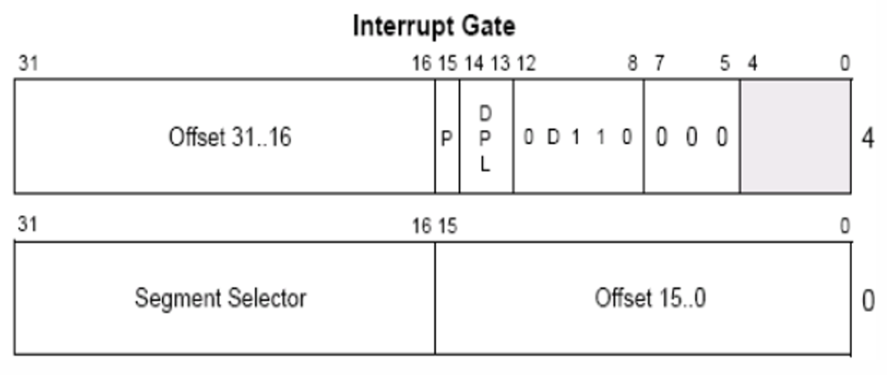

1110为32位中断门 0110为16位中断门

 中断门的结构和调用门结构几乎一样，只是调用门用来写参数数目的位被清空不再使用和Type域不一样而已。
  既然中断门的结构知道了，我们来看一下中断门的执行流程：

- 指令格式：`INT N (N为中断门索引号)`
- 执行步骤：
  1. 在没有权限切换时，会向堆栈顺次压入`EFLAG`、`CS`和`EIP`；如果有权限切换，会向堆栈顺次压入`SS`、`ESP`、`EFLAG`、`CS`和`EIP`。
  2. `CPU`会索引到`IDT`表。后面的`N`表示查`IDT表`项的下标。对比调用门，中断门没有了`RPL`，故`CPU`只会校验`CPL`。
  3. 在中断门中,不能通过`RETF`返回，而应该通过`IRET`/`IRETD`指令返回。

## 中断 返回

相比较调用门，中断门的压栈数据多了一个EFLAGS寄存器。

当未发生权限转换（无堆栈切换）时，堆栈中的数据是： 返回地址，EFLAGS，原CS

当发生权限转换（堆栈转换）时，堆栈中的数据是：返回地址，原CS，EFLAGS，原ESP，原SS

## 练习

修改中断号为3的中断门的选择子，达到hook int3的效果。当int3指令执行时随便打印一句话。

 

提示：注意fs和cs。要保证hook代码执行完毕后的现场和刚进0环时的现场一模一样，否则KiTrap03回3环时会有问题。

 

体会CPU指令缓存的作用.

# 陷阱门

type为1111时是32位陷阱门，0111时是16位陷阱门。陷阱门执行指令为INT+IDA索引号。与中断门相同。返回指令也相同。不同点是中断门执行时会将EFLAG寄存器中的IF位清零，而陷阱门不会。

IF：中断允许标志位。当为1时，CPU会响应可屏蔽中断请求。为0时，CPU不会响应可屏蔽中断请求。

可屏蔽中断请求：如键盘输入，鼠标点击都是一次可屏蔽中断请求。

不可屏蔽中断请求：CPU必须立即无条件响应的请求，如电源断电。

## 陷阱门描述符

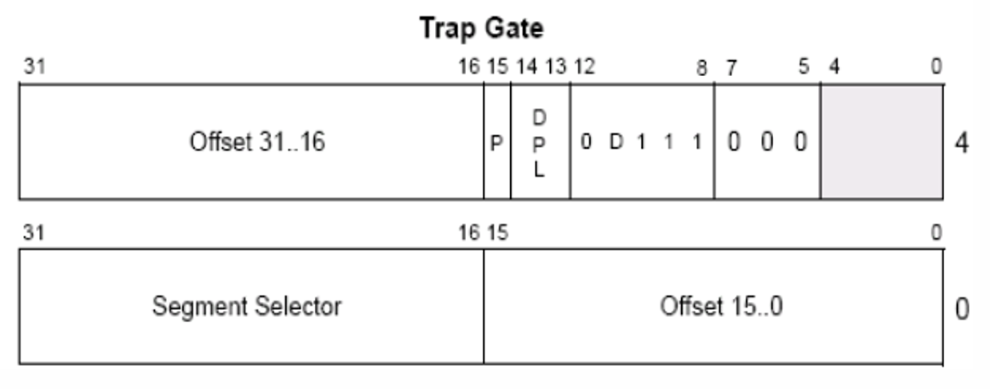

# 任务段（TSS）

我们回顾一下之前所学内容，在调用门、中断门与陷阱门中，一旦出现权限切换，那么就会有堆栈的切换。而且，由于`CS`的`CPL`发生改变，也导致了`SS`也必须要切换。切换时，会有新的`ESP`和`SS`从哪里来的呢？那就是任务状态段提供的。任务状态段简称任务段，英文缩写为`TSS`，`Task-state segment`。

TSS是一块内存，104个字节，存储着大量的寄存器的值，结构如下图

 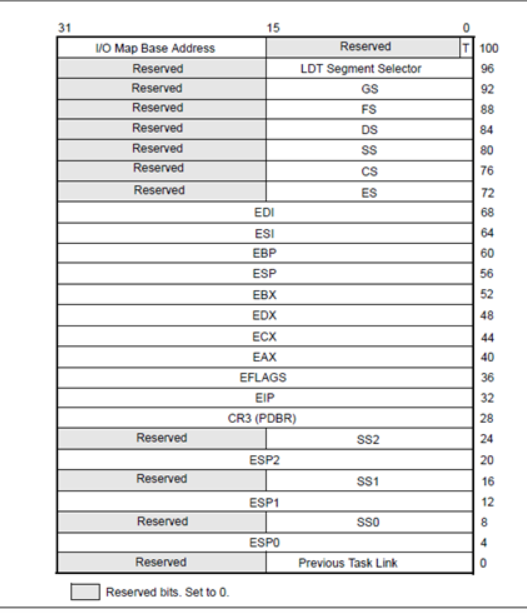

## TSS的作用

Intel的设计思想：想通过TSS来实现任务的切换，因为利用TSS可以一次性更换很多寄存器从而实现快速的任务切换。

`CPU`的任务在操作系统的方面就是线程。任务一切换，执行需要的环境就变了，即所有寄存器里面的值，需要保存供下一次切换到该任务的时候再换回去重新执行。

说到底，**`TSS`的意义就在于可以同时换掉一堆寄存器**。本质上和所谓的任务切换没啥根本联系。而操作系统嫌弃`Intel`的设计过于麻烦，自己实现了所谓的任务切换，即线程切换。具体将会在后面的教程进行讲解。

## TSS的位置

CPU中有一个段寄存器叫TR（TaskRegister），TR有96位，其中16位可见部分为选择子，可以找到GDT表中的一个段描述符，通过该描述符加载TR段寄存器中后80位。TR寄存器的Base指示了TSS表的位置。Limit指示了TSS表有多大。

Type:1001表示当前描述符是个TSS段描述符但没有加载到TR寄存器中。 1011表示已经加载到TR寄存器中。

 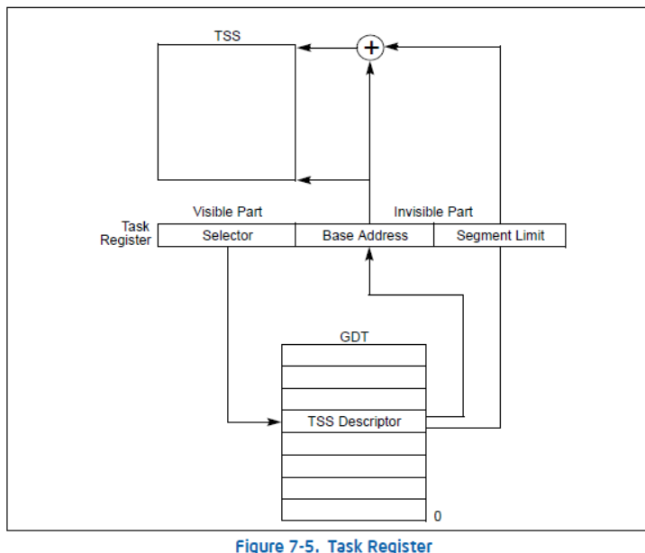


## TSS段描述符

 `TSS段描述符`的结构和普通的段描述符没啥区别，就不详细介绍了，如下图所示：

 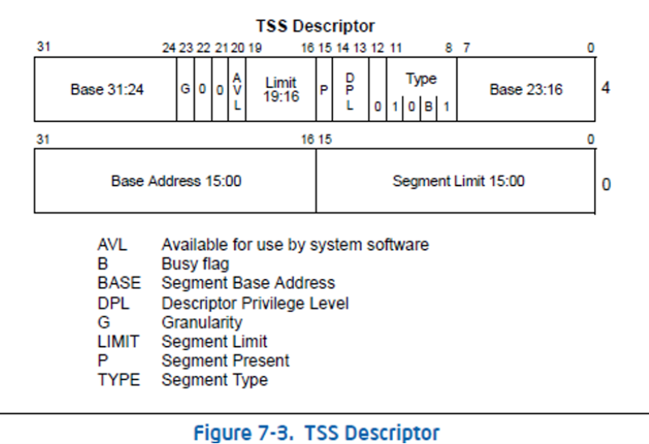

## 读写TR寄存器

### 加载TSS

通过LTR指定来装载TR寄存器（96位）。装载后TSS段描述符中的Type-3位会发生改变

LTR指令只能在0环权限中使用。并且仅修改TR寄存器，不修改其他寄存器。

### 读取TR寄存器

通过STR指令来读取TR寄存器，但只能读取16位，也就是可见部分（段选择子）

### 修改TR寄存器途径

1. 在0环可以通过LTR指令去修改TR寄存器。
2. 在3环可以通过CALL FAR或者JMP FAR指令来修改。用JMP去访问一个任务段的时候，如果是TSS段描述符，先修改TR寄存器，在用TR.Base指向的TSS中的值修改当前的寄存器。

## TSS任务段切换步骤

1. 调用 call/jmp + TSS任务段选择子
2. CPU将调用者的寄存器存入当前TR寄存器对应的TSS中。
3. 将TSS任务段选择子加载到TR寄存器中
4. 将新的TR寄存器对应的TSS任务段中的所有寄存器全部替换。

## 模拟任务切换（一次性切换所有寄存器）

1. 准备TSS任务段（104个字节）并将对应成员赋值。CR3通过 !process 0 0 来查看

2. 准备TSS段描述符。指向准备好的TSS任务段。并写入GDT表中合适的位置。（G位为0，AVL为0，因为TSS任务段是以字节为单位的。）

3. 修改TR寄存器指向TSS段描述符。由于ltr指令为特权指令，因此若想在3环实现TR寄存器修改，需要使用JMP FAR或CALL FAR。

   当JMP FAR后的段选择子指向一个TSS任务段描述符时，会首先将描述符装载到TR寄存器中，然后在根据TR.Base（TSS任务段）来修改当前寄存器的值。

### CALL 和 JMP 实现任务切换的不同之处

JMP指令进行任务切换，TSS段中的PreviousLink不会被赋值。且NT位不变。

CALL指令进行任务切换，TSS段中的PreviousLink会被填入上一个TSS段所属TSS段描述符的段选择子。且NT位被置1.

NT位：任务嵌套位。 NT位为0时，IRET/IRETD会从堆栈中取值（中断返回）。 NT位为1时，IRET/IRETD不会再从堆栈中取值返回，而是从当前TSS的PreviousLink对应的上一个TSS中取数据进行返回。（调试模式，单步调试时，NT位会被清0，导致IRET无法从TSS中返回，造成蓝屏）

## ESP和ESP0

当我们主动JMP CALL任务段或任务门时，CPU会将ESP SS替换。

当我们通过调用门、中断门这种提权时，CPU会去找TSS，这种可以理解为被动。这时会根据新CS的权限来选择替换ESP0 SS0、ESP1 SS1还是ESP2 SS2。

## 练习

使用jmp TSS任务段进入0环，使用JMP出来。

# 任务门

使用INT指令+IDT表索引的方式进入任务门。通过IDT表中对应的描述符中的TSS Segment Selector查GDT表找到TSS任务段描述符，使用IRETD返回。

## 任务门描述符

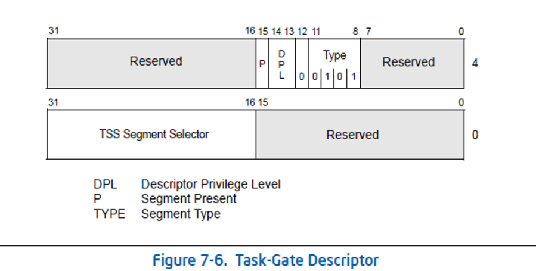

任务门的结构我就不想再赘述了，来看看它的执行过程：

1. 通过`INT N`的指令进行触发任务门
2. 查`IDT`表，找到任务门描述符
3. 通过任务门描述符，查`GDT`表，找到`TSS`段描述符
4. 使用`TSS`段中的值修改`TR`寄存器
5. `IRETD`返回

### 练习

1. pushad 和 pushfd 到底是必须的吗？作用是什么？

    如果你不改寄存器或者主动还原的话，这东西不是必要的。这两个汇编是为了保存所有必要保存寄存器的现场。保存后可以肆意修改。最后的时候还原回去，防止出现潜在的错误。

2. 在有参调用门调用取参的时候，为什么用下面的代码？

   mov eax,[esp+0x24+0x8+0x8];
   mov ebx,[esp+0x24+0x8+0x4];
   mov ecx,[esp+0x24+0x8+0x0];

   ```c
   0x24：是十六进制的 36 ，先看看怎么来的吧。pushfd 会将 8 个 32 位寄存器压入堆栈中，即 32 个字节。 pushfd 会将 EFLAG 寄存器压入堆栈中，也是 4 个字节，总和即为 36 个字节。
   0x8：是返回地址和 CS 所占的总字节数。
   ```

   

3. 使用任务门进1环。

4. 自己构造任务段通过`CALL`实现任务切换，要求使用0环的段，下面是一个代码模板，代码里面有坑，并且坑很深，看看自己能不能自行解决。

   #include "stdafx.h"
   #include <Windows.h>

   DWORD dwOK;
   DWORD dwESP;
   DWORD dwCS;

   void __declspec(naked)  test()
   {
       dwOK=1;
       __asm
       {
           int 3;
           mov eax,esp;
           mov dwESP,eax;
           mov word ptr [dwCS],cs;
           iretd;
       }
   }

   int main(int argc,char * argv[])
   {
       char stack[100]={0};    //自己构造一个堆栈使用
       DWORD cr3=0;
       printf("请输入CR3:\n");
       scanf("%x",&cr3);    //通过WinDbg指令进行获取：!process 0 0

       //下一步构造TSS，标有*说明必填有效值
       
       DWORD tss[0x68]={
           0x0,        //link
           0x0,        //esp0
           0x0,        //ss0
           0x0,        //esp1
           0x0,        //ss1
           0x0,        //esp2
           0x0,        //ss2
           cr3,        //*
           (DWORD)test,        //eip *
           0,        //eflags
           0,        //eax
           0,        //ecx
           0,        //edx
           0,        //ebx
           ((DWORD)stack) + 100,        //esp *
           0,        //ebp
           0,        //esi
           0,        //edi
           0x23,        //es *
           0x08,        //cs *
           0x10,        //ss *
           0x23,        //ds *
           0x30,        //fs *
           0,        //gs
           0,        //idt
           0x20ac0000        //IO权限位图，VISTA之后不再用了，从其他结构体拷贝出来
       };
       
       char buffer[6];//构造任务段
       __asm
       {
           call fword ptr [buffer];
       }
       
       printf("切换成功，获取的值：dwESP=%d\tdwCS=%d\n",dwESP,dwCS);
       return 0;
       }
   

# 17.10-10-12分页

## 地址的概念：

每个进程的4GB是假的，并不是每个进程占4GB。CPU将线性地址转换为物理地址。在X86架构中转换的方式有两种：10-10-12分页方式和2-9-9-12分页方式（PAE模式）。

`mov eax,dword ptr ds:[0x12345678]` 0x12345678为有效地址，ds.base+0x12345678为线性地址，通过线性地址进行拆分得到的是物理地址。

## WinXP设置分页方式：

默认为2-9-9-12分页，指定为10-10-12分页方式为：将noexecute中的no删除即可

# 读写操作系统
