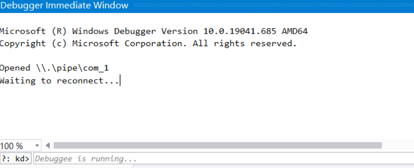
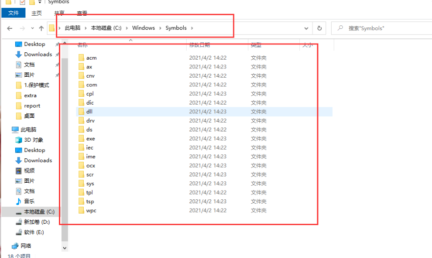

# vs2019+win7X86驱动环境

我自己按了4次了 换了3个电脑重装系统一次 稳健的一批

## 官网下载VS 和 WDK

https://docs.microsoft.com/zh-cn/windows-hardware/drivers/other-wdk-downloads


下载vs会自动安装 sdk 就是这个玩意


我的已经配置好不是新下载的，你就下载 三个箭头就行了，然后crtl+x去应用和功能看看


然后确认自己电脑的WSDK的版本，我们需要根据这个版本去下载对应版本的WDK

如果sdk和wdk版本对了但是不行 ，那就自己摸索一下 改改版本

## 安装VS WDK扩展 插件

下载WDK会弹出窗口默认安装，没有的话再路径:Windows Kits\10\Vsix

## VSInstall 下载SDK和 Spectre缓解库 同步SDK和WDK版本


## 编译驱动测试

创建WDM 空项目


看到这里就已经搭建好了，我们接下来再来配置win7x86虚拟机

## 虚拟机设置

### 为镜像添加一个串口 

这个参考下面的winxp 步骤都一样 如果串口被占用就删除打印机

管道地址: \\.\pipe\com_1

### 设置测试模式

在本地WDK的安装目录下找到 Remote 文件夹，复制相应的 WDK Test Target  Setup.msi 文件到虚拟机中打开。

在虚拟机管理员权限运行cmd，输入命令bcdedit /copy {current} /d DebugEnty


之后打开msconfig，选择引导选项卡，找到我们刚刚创建的DebugEntry并点击高级选项， 进行如下配置：


重启，选择 DebugEntry启动

管理员权限运行cmd，输入 bcdedit /set testsigning on和 bcdedit /Debug on ，开启 测试模式。 输入 bcdedit /dbgsettings 查看设置情况如下。


## VS2019设置

上面设置完虚拟机环境之后 关机备用 

vs打开 扩展 - Diver - Test - Configure Devices…，选择 Add New Device


输入名称，然后下一步。注意：Network host name必须为虚拟机的计算机名。


Kernel Mode中设置串口通信等信息，如下图：注意：Pipe name要与虚拟机串口设置的管道名称一致

### 双机调试

VS2019中，选择 调试 - 附加到进程，连接类型选择 Windows Kernel Mode Debugger，连接目 标为之前新建的Device，附加


Debug窗口会显示以下字样，表示已打开管道并等待重连。(注意是 Opened \.\pipe\com_1)



接着重新启动虚拟机，等待虚拟机进入桌面。Debug窗口显示如下：

 注意：1.这里可能会花较长时间，并不是因为卡死了。

 注意：2.重启虚拟机的时候记得禁用驱动程序强制签名。(或者使用testsigning)

进入桌面后，虚拟机可以正常操作。在VS2019中按下 暂停等待VS停下来，并出现以下画面，再点击 继续。(先暂停再继续，否则可能断不下来)


此时就可以设置断点了。

## 测试

到此我们测试一下

```c
#include <ntddk.h>
VOID DriverUnload(PDRIVER_OBJECT pDriver) {

	UNREFERENCED_PARAMETER(pDriver);
	DbgPrint("Goodbye~\n");
}


NTSTATUS DriverEntry(PDRIVER_OBJECT pDriver, PUNICODE_STRING pRegPath){
DbgPrint("Hello Driver!\n");

UNREFERENCED_PARAMETER(pRegPath);

pDriver->DriverUnload = DriverUnload;
return STATUS_SUCCESS;

}
```

删除inf文件 或者删除这两行


调整属性 - C/C++ - 常规，警告等级 4，将警告视为错误 否；
链接器 - 常规，警告视为错误 否；
Driver Settings - General，Target OS Version改成Windows 7，Target Platform改为Desktop；
Stampinf里所有 是 的地方改成 否；
Inf2Cat里所有 是 的地方改成 否；
Driver Signing - General中的Sign Mode改为 Off；

然后生成的sys文件 拖到虚拟机里面 测一测 

完成


# winxp+windbg环境搭建

## 虚拟机配置

打开ini文件，加入下面这一行：


```
multi(0)disk(0)rdisk(0)partition(1)\WINDOWS="Microsoft Windows XP Professional" /noexecute=optin /fastdetect /debug /debugport=com1 /baudrate=115200
```

## 虚拟机串口

为镜像添加一个串口


设置为`使用命名的管道`、`该端是服务器`、`另一端是应用程序`，管道命名填写：

```
\\.\pipe\com_1
```

## Windbg安装

链接：https://pan.baidu.com/s/1Q3yNp0lAeMEXOBYGYceOxQ 
提取码：ilq2 
--来自百度网盘超级会员V3的分享

windbg的安装使用`WDK_7600.ISO`来安装WDK，这样就会附带windbg。不要自己装windbg，否则可能出现一些错误。

双击ISO文件，等待DVD驱动器挂载成功后，管理员运行`KitSetup.exe`，然后一直下一步。

安装完成后，找到WDK的安装目录（安装的时候会让你选），Debugger目录下就是windbg的组件，将windbg.exe发送到桌面快捷方式。

## XP符号包安装

链接：https://pan.baidu.com/s/1A0x28R8Nitnxb5pzm6SxtQ 
提取码：5y6z 
--来自百度网盘超级会员V3的分享

直接下一步等待安装成功。然后你的`C:\Windows`会多出一个`Symbols`文件夹，结构如下图，如果不对那就重新安装。这步绝对不能出错。



## Windbg参数配置

右键windbg.exe - 快捷方式，点击属性，在目标那里后面加一段话（记得-b前面有个空格别忘记加）：

**-b -k com:pipe,port=\\.\pipe\com_1,resets=0**

-b：一旦主机目标机之间建立起连接，立刻中断目标机
 -k：内核调试
 Com：设置连接目标机的通信端口（此处为命名管道）和波特率（此处为115200）
 -y：设置符号文件路径

## Windbg环境变量配置

右键此电脑->属性->高级系统设置->环境变量，在Path里新建一条记录，内容为WDK安装路径下的debugger文件夹


## 符号包环境变量配置

在上面的用户变量处新建一个记录，变量名和变量值直接复制下面的，一定不能错，不然后面windbg命令用不了。

```
变量名：
_NT_SYMBOL_PATH
```

 

```
变量值：
C:``/``WINDOWS``/``Symbols``/``acm;C:``/``WINDOWS``/``Symbols``/``cnv;C:``/``WINDOWS``/``Symbols``/``com;C:``/``WINDOWS``/``Symbols``/``cpl;C:``/``WINDOWS``/``Symbols``/``dic;C:``/``WINDOWS``/``Symbols``/``dll;C:``/``WINDOWS``/``Symbols``/``drv;C:``/``WINDOWS``/``Symbols``/``exe;C:``/``WINDOWS``/``Symbols``/``iec;C:``/``WINDOWS``/``Symbols``/``ime;C:``/``WINDOWS``/``Symbols``/``ocx;C:``/``WINDOWS``/``Symbols``/``scr;C:``/``WINDOWS``/``Symbols``/``sys;C:``/``WINDOWS``/``Symbols``/``tpl;C:``/``WINDOWS``/``Symbols``/``tsp;C:``/``WINDOWS``/``Symbols``/``wpc;symsrv``*``symsrv.dll``*``C:``/``mysymbol``*``http:``/``/``msdl.microsoft.com``/``download``/``symbols
```


XP开机后选择DEBUG系统，按回车进入。

输入`!process 0 0`查看进程，如果可以成功查看，那么双机调试就已经完美配置成功了。如果不可以，那就还是符号包配置有问题。
