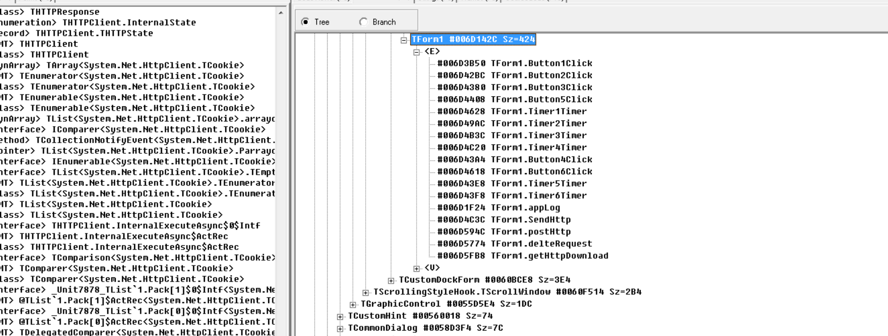
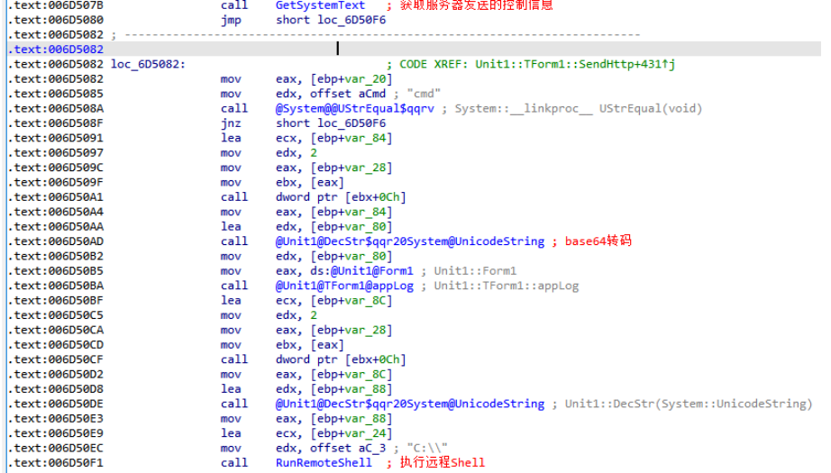

# 前言

**双尾蝎**APT组织(又名:`APT-C-23`),该组织从 2016 年 5 月开始就一直对巴勒斯坦教育机构、军事机构等重要领域展开了有组织、有计划、有针对性的长时间不间断攻击.其在2017年的时候其攻击活动被360企业安全进行了披露,并且其主要的攻击区域为中东,其中以色列与巴勒斯坦更受该组织的青睐。

攻击平台主要包括 `Windows` 与`Android`:

其中针对`windows`的平台,其比较常见的手法有投放带有"`*.exe`"或"`*.scr`"文件后缀的**释放者**文件,在目标用户打开后释放对应的诱饵文档,并且释放下一步的**侦查者(Recon)**.持久存在的方式也不唯一,一般通过写入注册表启动项以及释放指向持久化远控的快捷方式到自启动文件夹下.其侦查者会收集当前机器的相关信息包含(**系统版本,计算名,杀毒软件信息,当前文件所在路径,恶意软件当前版本**),以及其解析`C2`的回显指令,并执行.比如:**远程shell,截屏和文件下载**。

同时根据别的安全厂商的报告,我们也得知该组织拥有于攻击`Android`平台的组件,拥有**定位、短信拦截、电话录音等，并且还会收集文档、图片、联系人、短信等情报信息；PC 端后门程序功能包括收集用户信息上传到指定服务器**的功能、远程下载文件能力.

近日`check point`安全厂商披露了该组织自导自演,给以色列士兵手上安装恶意软件的攻击活动.可以从中看出该团伙的攻击设计之巧妙,准备之充分。但最后结果还是被以色列给反制了一波............

Gcow安全团队**追影小组**于`2019.12`月初开始监测到了**双尾蝎**APT组织通过投递带有诱饵文件的相关可执行文件针对**巴勒斯坦**的部门 进行了相应的攻击活动,这些诱饵文件涉及教育,科技,政治等方面的内容,其攻击活动一直持续到了`2020.2`月底.踪.

# 样本概况

## 样本信息

| 样本名称 | Malware.exe                                                  |
| -------- | ------------------------------------------------------------ |
| 样本大小 | 15955905 字节                                                |
| MD5      | 4406525982688345C1919D46F4338FA6                             |
| SHA1     | BA58F964C60782E3AC0183EA360D28881B08D926                     |
| SHA256   | A9CE66680039E6D0685798D33188A6E3399AC4C16FE671F42B70CD091C3A4C94 |
| CRC32    | 63540BC1                                                     |
| 语言     | Embarcadero Delphi(XE2-XE6)                                  |
| APT组织  | 双尾蝎(又名:APT-Q-23)                                        |

 

## 测试环境及工具 

行为测试及调试环境:

win7 SP2/32bit (以下分析工具，除此外无其他程序)

 本文所用到的分析工具:

DIE 3.01,火绒剑,X32Debug,IDA 7.6，WinHex，PEView,IDR (Delphi反汇编工具)，PdfStreamDumper，UltraEdit，UltraCompare，ResourceHacker。

## 分析目标

分析出该APT样本的行为和行为具体执行的流程并给出手工清除方案。

#  静态PE分析

## 静态查壳

初步可以看到样本未使用加壳技术，使用的开发语言是Delphi

## 静态PE结构分析

看到.rsrc资源节的大小的很大，样本可能有资源文件保存在资源节。

##  静态加密算法分析	

通过PEID 的KANAL插件静态解析出已知的加密算法

初步可以看到样本中的加密算法：

1. Adler-32算法，这是一种比常见CRC-32校验算法速度更快的一种校验算法，但安全性比CRC-32差一些。

2. Base64 一种常见的编码，特点是编码后有==字符。

3. CRC-32 循环冗余校验算法。

4. ZLIB 一种数据压缩算法，恶意样本往往会在远控木马中用于交互数据的压缩。

 

# 行为监测

## 行为分析

### 样本启动后的直接行为

在纯净win7，winXP测试机中测试样本执行后无明显行为。

再装有wps或浏览器的win7，winXp测试机会发现在桌面打开一个pdf文件，无其他明显行为

通过火绒剑查看现有和销毁的进程树信息，并比较样本执行前后的进程树结构。

 

###  查看进程树

通过火绒剑过滤行为特征确定样本行为

 通过监控进程树，malware.exe 进程执行后，可以看到：

malware.exe执行后会调用firefox.exe打开 ??????.pdf文件

我们来看看这个文件

### 行为监控	

通过火绒剑过滤行为特征确定样本行为

#### 文件监控

1.检测到存在创建截断并写入文件 C:\Users\shadow\AppData\Local\Temp\أسس تربوية مقترحة لتنمية رأس المال الفكري لدى المعلمين بناء على متطلبات التنمية المستدامة.pdf 文件行为

使用翻译软件翻译一下，可以识别出是阿拉伯文，标题为“基于可持续发展要求的教师智力资本开发的教育基础”，猜测很可能是是**针对阿拉伯语地区的****APT****攻击样本，该pdf很可能是诱饵文档，往往诱饵文档会可能存在利用漏洞攻击的ShellCode。**

2.检测到创建截断并写入C:\Users\shadow\AppData\Roaming\dsfjj45k.tmp 文件行为

打开winhex 看一看 可能是

dsfjj45k.tmp文件内容是一段编码，猜测样本可能会利用这一段编码进行加解密运算，或者用来存储信息

3.检测到在C:\Users\AppData\Roaming\Microsoft\Windows\Start Menu\Programs\Startup路径创建截断并写入malware.lnk

一般是将快捷方式写入此路径是恶意代码在**创建开机自启动项的行为**。

#### 注册表监控

检测到创建注册表键

但是该测试机检测到注册表键创建返回失败的结果。

#### 设备资源监控

检测到访问以下设备资源

检测到设备 \Device\Afd 不断被打开 

 

检测到打开Explorer.EXE进程

 3.1.3.4 进程监控

检测到创建firefox进程并写入内存并跨进程恢复线程行为

## 行为总结

通过对malware的初步行为监控，能看到的行为包括

\1. 释放.pdf诱饵文档（可能在文档中包含ShellCode）

\2. 设置malware开机自启动

但对于一个恶意样本一般的关键行为还未体现：包括***\*注入方式，隐藏自身方式，传输方式等等这些，\****猜测可能是由于与恶意样本链接的服务器无法联通，就不会执行以上行为，具体还需后续详细的静态分析和动态分析去确认样本的行为。

 

## 恶意程序的代码分析详细片段

一个病毒样本往往存在的行为不过于：启动、释放、设置、自启、注入、复制、外联等这些行为，由于样本大小在15m左右，比较大，因此以下分析从抓取上述行为特征入手，一般样本定位关键行为特征的方法包括结合行为进行单步调试、系统API下断点、对字符串信息设置内存断点等等。

### 通过搜索恶意的样本中的字符串推断恶意样本行为

通过静态分析搜索样本中的字符串推测样本的行为：

先通过IDR静态看一下样本中存在的字符串，根据一些字符串可以推断出样本的一些行为，再定位到关键代码详细分析。

http、https、GET、POST 这些字符串推测样本可能是在**向外发送****数据****包****。**

GetAntiVirusProductInfoException、'SELECT * FROM AntiVirusProduct'通过这些字符串猜测样本可能是**关闭****系统上的一些安全软件、杀毒软件**。

1. uterName、USERNAME 可能是**恶意样本对主机上一些信息的获取**。

2. Run、-start 可能是恶意样本**尝试启动一些东西或设置自启动。**

3. .link可能是**创建快捷启动方式**。

4. https://dorothymambrose.live/hx3FByTR5o3zNZYD/sYkaiHz0Mse13C79dy1I/ 可能是**恶意样本把获取到的一些信息发送到这个IP地址**。

5. \??? ?????? ?????? ?????? ??? ????? ?????? ??? ???????? ???? ??? ??????? ??????? ?????????.pdf 是恶**意样本释放的可能包含ShellCode的诱饵**。

6. \dsfjj45k.tmp 是**恶意样本释放的密钥文件**。

1. Log可能是**恶意样本在获取日志的一些信息**。

2. Cmd、Send CMD、可能是**恶意样本进行一些远程发送CMD命令的的行为**。

3. Send ScreenShot 可能是**恶意样本在获取远程屏幕快照或进行远控**。 

Download from、Download start、DownLoad Finish、可能是**恶意样本充当T****rojanDownloader角色下载更多的恶意代码或文件。**

## 具体行为分析

通过对关键字符串设置硬件访问断点，定位到关键函数并结合IDR和IDA分析后，经调试后发现恶意代码的一些主要行为在以下函数中。看地址主要在Timer1、Timer2、Timer3、Timer4四个定时器中。

###  创建诱饵文档

通过对关键字符串设置硬件访问断点，定位到关键函数并结合IDR和IDA分析后，经调试后发现恶意代码的一些主要行为在以下函数中。主要在Timer1、Timer2、Timer3、Timer4四个定时器中。

#### 诱饵文档的创建

通过对在idr搜索到的字符串 أسس تربوية مقترحة لتنمية رأس المال الفكري لدى المعلمين بناء على متطلبات التنمية المستدامة.pdf  所在地址6D4880 设置硬件访问断点，再对恶意样本进行调试定位地址6D46C6处访问此地址。

通过调试这里代码，确认此处即为  أسس تربوية مقترحة لتنمية رأس المال الفكري لدى المعلمين بناء على متطلبات التنمية المستدامة.pdf 文件创建的代码，恶意代码首先会获C:\Users\Shadow\AppData\Local\Temp系统临时文件路径，再从Resource1中获取资源，创建pdf类型的Tresourcestream实例，在临时文件路径下创建pdf诱饵文件，再调用ShellExcute执行创建的pdf文件。

通过PEView查看资源节，可以看到pdf文件隐藏在原malware.exe文件.rsrs节中：

通过静态分析得到该恶意代码样本会在 Timer1定时器中首先判断GlobalURI是否为空，如果不为空 就执行 button1，反之会在C:\\Users\\Shadow\\AppData\\Local\\Temp路径创建 .pdf 诱饵文件，以下是静态分析诱饵文件创建的过程

####  诱饵文档文件格式的分析	

一般样本释放的pdf文件可能会存在ShellCode，通过UltraEdit简单查看PE格式，未发现有明显的异常的地方

通过PdfStreamDumper.exe分析PDF，未发现内嵌有恶意JS代码。

在对样本的静态分析过程中也未发现有漏洞利用的相关代码，可以判定释放的.pdf文件无恶意行为，仅用来迷惑用户。

### 攻击持久化维持

通过对 .link下硬件断点

来到了 button5Click

然后我们再看 timer3

调用 button5Click 设置开机启动

样本会将malware.exe设置在C:\Users\Shadow\AppData\Roaming\Microsoft\Windows\Start Menu\Programs\Startup 目录，该目录的快捷方式会在开机时进行自启动，以此来维持攻击持久化。

###  外联C2通信

在Timer1定时器中 如果GlobalURI不为空，就会调用button1**获取当前系统的主机名、计算机名、PC** **ID**，并将信息进行base64编码到数据包后保存到C:\Users\Shadow\AppData\Roaming \dsfjj45k.tmp文件后，再通过http协议发送到 GlobalURI 变量保存的地址即: 

https://dorothymambrose.live/hx3FByTR5o3zNZYD/sYkaiHz0Mse13C79dy1I 地址建立C2通信

样本首先会生成一个随机数然后与获取到的主机名、用户名、PCID，拼接成一个字符串再进行base64转码再保存到EncName变量再保存至C:\Users\Shadow\AppData\Roaming \dsfjj45k.tmpdsfjj45k.tmp文件中。

#### 取系统反病毒软件信息并发包

在button1中该恶意代码样本还会调用006D24D4**通过WMIC获取主机存在的反病毒软件信息**，在**通过WQL** **执行****SELECT \* FROM AntiVirusProduct** **获取本机系统的杀软信息**，把获取到的杀软信息一同封装到数据包中通过http协议发送到https://dorothymambrose.live/hx3FByTR5o3zNZYD/sYkaiHz0Mse13C79dy1I地址

#### HTTP连接检测

由4.1.1的分析结果得出样本在进行发包行为前会先判断GlobalURI 是否为空

因此可以尝试对GlobalURI变量设置硬件访问断点去尝试样本如何检测9HTTP连接

经分析样本是再首先创建诱饵文件后和快捷方式后，才会目标IP地址传入GlobalURI，

就可以向目标样本发送Http包，但是为什么在行为检测中检测不到发包呢，通过单步调试发现

在未联通服务器的情况下去调用SendHttp()函数后就会抛出异常。

 

在调试过程中发现样本与目标服务器未连接的情况下在SendHttp()函数中会调用

ExecuteHTTPInternet() 函数，这时就会抛出异常，经分析，这时的 

ExecuteHTTPInternet()会调用 HandelExcuteError ()函数导致进入异常。

因此样本在未与目标IP创建Http连接时，就不会再执行外联发包的行为，就无法捕获到流量，调试时会抛出异常。

#### 创建管道执行远程Shell

当Http连接建立后，样本Timer2定时器会调用TForm1::SendHttp()函数,在SendHttp()函数执行中会调用RunRemoteShell**建立远程Shell的通道执行**建立C2通信。

函数TForm1::SendHttp

 

 函数RunRemoteShell会通过CreatePipe()创建远程Cmd管道执行远程Shell

 

#### 获取桌面截屏

在TForm1::SendHttp函数中会调用GetDesktopPicture（）函数**获取桌面的截屏**

GetDesktopPicture函数会先创建并初始化一个位图，再通过GetDesktopBit获取桌面的位图，再将截图转换成jpeg格式发送。

函数GetDesktopPicture

GetDesktopBit 通过获取窗口DC，桌面显示屏分辨率和位图获取屏幕截屏。

函数GetDesktopBit

函数GetDesktopBit

#### 从服务器下载资源

样本会从建立Http通信的服务器上Get下载资源，文件保存至

C:\Users\Shadow\Desktop\malware\tempfile.tmp路径

函数DownFile

# 总结

##  行为总结

 该样本的行为包括：

1. 创建阿拉伯文内容的.pdf诱饵文件用来迷惑用户

2. 在C:\Users\AppData\Roaming\Microsoft\Windows\StartMenu\Programs\Startup\malware.lnk目录创建文件维持攻击持久化

3. 获取当前系统的主机名、计算机名、PC ID至.tmp文件

4. 通过WMI获取系统反病毒软件信息保存至.tmp文件

5. 将记录收集到的信息的.tmp文件发送至C2 https://dorothymambrose.live/

hx3FByTR5o3zNZYD/sYkaiHz0Mse13C79dy1I 

6. 通过C2远程执行Shell、屏幕截屏、文件下载。

## 样本行为示意图

### 样本执行流程图

 

### 样本中的函数调用关系图

 

### 样本中释放的文件关系图

 

## 手工查杀方案

1. 结束掉任务管理器malware.exe进程

2. 删除掉恶意代码的样本原文件C:\Users\Shadow\Desktop\malware.exe

3. 删除掉恶意代码样本释放的诱饵文件C:\Users\Shadow\AppData\Local\Temp\المستدامة… .pdf

4. 删除掉用来记录信息的C:\Users\Shadow\AppData\Roaming\dsfjj45k.tmp文件

5. 删除C:\Users\Shadow\AppData\Roaming\Microsoft\Windows\Start Menu\Programs

\Startup 目录下malware.lnk

6. 如果发现创建了注册表键HKEY_LOCAL_MACHINE\Software\Microsoft\WBEM\CIMOM被创建，就删除。

## 预防

1.不浏览危险网站，不查阅不明邮件不下载不明程序等。

2.不打开未知的doc，pdf等文档文件。

3.及时更新安全软件、杀毒软件病毒库。

4.及时修复系统和安装软件的漏洞，更新补丁。

5.企业可采用主动防御方法，采用基于程序行为自主分析判断的实时防护技术，例如使用诱骗技术的沙箱或蜜罐技术预防APT攻击。

# 参考信息

[https://ti.qianxin.com/apt/detail/5b2376bf596a1000192dbcd2?name=%E5%8F%8C%E5%B0%BE%E8%9D%8E&type=map](https://ti.qianxin.com/apt/detail/5b2376bf596a1000192dbcd2?name=双尾蝎&type=map)

https://apt.360.cn/orgDetail/27

 

