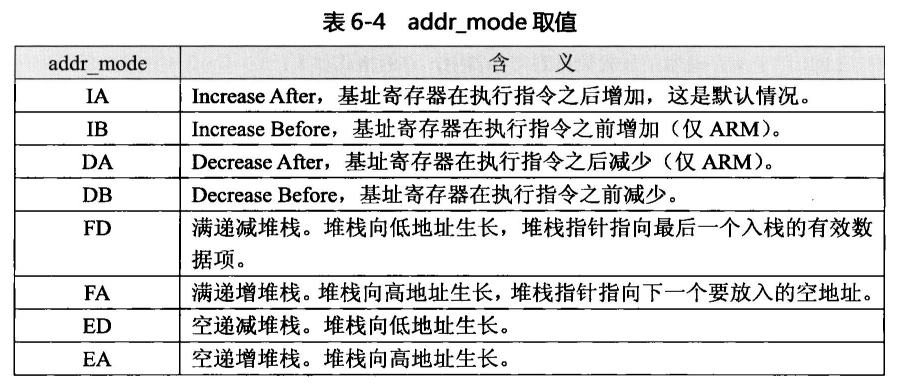

# ARM反汇编

```
#include <stdio.h>

int main(int argc, char* argv[]){

  printf("Hello ARM!\n");

  return 0;

}
```


第一行的 EXPORT main 表明这个main函数是被程序导出的

sub SP,SP,#8的涵义是sp寄存器的值减去8重新赋值给sp

STMFD指令用于把寄存器值压入堆栈，在本例中保护原始寄存器的值，LDMFD指令用于从堆栈中回复寄存器的值，作用与STMFD恰恰相反

STR 与LDR是存储器访问指令，存储器值的就是内存地址，通常被称为内存单元或存储单元，存储器的访问包含从存储器中读数据与写入数据到存储器中，ARM指令中将存储器使用一对中括号[]表示

，STR是写存储器指令，STR,R0,[R11,#VAR_8]就是将R0寄存器的值保存在栈变量VAR_8中

BL为带链接的跳转指令，完成类似其它编程语言中子程序调用的功能，BL puts 就说调用puts函数

## 原生程序生成过程

原生程序采用C/C+ +语言来编写,为什么到了逆向分析的时候却变成了ARM汇编代码呢?
这还得从原生程序的生成过程说起。原生程序的代码是由Android NDK中提供的交叉编
译工具链中的gcc编译器来编译的(所谓交叉编译I具链,指的是能在一种平台. 上编译出另- -
种平台.上运行的程序的工具集合)。在Windows或Linux.上使用Android NDK中的gcc编译的
原生程序可以直接在Android手机中运行,它与本地编译是相对的,本地编译即当前平台编译,
编译所得的程序只能在当前平台上运行，通常，我们也可以将交叉编译称为跨平台编译。
gcc编译原生C代码的步骤分为以下四步(C++代码由g++来编译)。

 ### 1. 预处理

在这个阶段中，编译器将处理C代码中的预处理指令，如“#include"包含的头文件会
全部被编译进来，还有“#define"预定义、“#if”预条件处理等也都会在这里被编译器处理。
详细的输出可以给gcc编译器传递“-E”选项查看。以上一-小节的hello 为例，执行“gcc -E
hello.c -o hello.i"后hello.i文件内容如下(执行以上命令必须确保gcc能搜索到Android NDK
头文件路径，本例实际采用make工具的编译脚本来进行编译，

### 2.编译

在这个阶段中，gcc 编译器首先要检查代码的规范性，以及是否有语法错误等，以确定
代码的实际要做的工作，在检查无误后，gcc 编译器把代码翻译成ARM汇编语言的代码,
可以为gcc编译器传递“-S”选项查看输出。执行“

```
gcc - S hello.i -o hello.s"后会生成hello.s汇编文件
```

### 3.汇编

gcc编译器会调用汇编器将汇编代码汇编成二进制目标文件

```
gcc -c hello.s -0 hello.o
```

### 4.链接

这个阶段编译器会调用链接器将二进制的目标文件链接成Android平台可执行的ARM
原生程序。以上一小节的hello为例，执行“gcc hello.o - o hello"后会生成hello可执行文件
通过.上面4个阶段的分析可以发现,经过第2步编译后C代码就变成了ARM汇编代码。
既然C代码最终都会变成汇编代码，那可以直接编写汇编代码来开发ARM原生程序吗?
答案是肯定的，Android NDK支持直接使用ARM汇编语言编写的以“.s”结尾的文件
作为程序的源文件。另外，开发人员还可以使用C代码与ARM汇编代码混合的方式来编写
原生程序,这与Windows平台或Linux平台的汇编程序开发是相同的，具体的实现细节此处
不再展开。

# 关于arm知识

在开始讲解ARM指令集之前，我们先来看看ARM汇编语言的一-些特点。
首先是ARM汇编语言与Java语言的区别。

ARM汇编语言是一门“低级”语言，它能够与系统的底层打交道，直接访问底层硬件资源，而Java 语言为高级语言，它只存在于框架层面，能访问的资源都是由框架提供;

其次，ARM汇编语言编写的程序运行速度快，占用内存少，缺点是编写的代码难懂，也难以维护，而Java语言开发的程序运行速度相对较慢，占用内存多，好处是编写的代码容易理解，开发效率高;最后，ARM汇编语言编写的程序几乎不需要其它代码的转换就能直接运行，源码与反编译出来的代码基本相似，而Java语言编写的程序需要将其转换成特定的字节码才能在Android虚拟机中运行。
其次是ARM汇编语言能实现什么功能。

ARM汇编语言与C语言共用同- -套原生程序开发的API接口，而且两者都是基于模块化的面向过程的编程思想。因为C语言编写的代码在编译时有一个过程是将其转换成ARM汇编代码

，所以可以这么理解:C语言能实现的功能ARM汇编语言都能实现。最后是ARM汇编语言中特有的寄存器。寄存器是处理器特有的高速存贮部件，它们可用来暂存指令、数据和位址。高级语言中用到的变量、常量、结构体、类等数据到了ARM汇编语言中，就是使用寄存器保存的值或内存地址。寄存器的数量有限，ARM微处理器共有37个32位寄存器，其中31个为通用寄存器，6个为状态寄存器。ARM处理器支持七种
运行模式，它们分别为:

1. 用户模式(usr): ARM处理器正常的程序执行状态。
   2.快速中断模式(fiq):用于高速数据传输或通道处理。
2. 外部中断模式(irq): 用于通用的中断处理。
   4.管理模式 (svc):操作系统使用的保护模式。
   5.数据访 问终止模式(abt): 当数据或指令预取终止时进入该模式，可用于虚拟存储及
   存储保护。
3. 系统模式(sys): 运行具有特权的操作系统任务。
4. 未定义指令中止模式(und): 当未定义的指令执行时进入该模式。

ARM处理器的运行模式可以通过软件改变，也可以通过外部中断或异常处理改变。在
不同模式下，处理器使用的寄存器不尽相同，而且可供访问的资源也不- -样。在这7个模式
中，除了用户模式外，其它六种模式均为“特权”模式，在“特权”模式下，处理器可以任
意访问受保护的系统资源。本书将要讲解的ARM程序逆向分析技术只涉及到用户模式。
在用户模式下,处理器可以访问的寄存器为不分组寄存器R0~R7、分组寄存器R8~R14、
程序计数器R15(PC)以及当前程序状态寄存器CPSR。ARM处理器有两种工作状态:ARM状态与Thumb状态。处理器可以在两种状态之间随意切换。当处理器处于ARM状态时，会执行32位字对齐的ARM指令，当处于Thumb状态时，执行的是16位对齐的Thumb指令。Thumb状态下对寄存器的命名与ARM有部分差异，它们的关系如下:
Thumb状态下的R0~R7与ARM状态下的R0~R7相同。
Thumb状态下的CPSR与ARM状态下的CPSR相同。
Thumb状态下的FP对应于ARM状态下的R11。
Thumb状态下的IP对应于ARM状态下的R12。
Thumb状态下的SP对应于ARM状态下的R13。
Thumb状态下的LR对应于ARM状态下的R14。
Thumb状态下的PC对应于ARM状态下R15。

寄存器可以通俗的理解为存放东西的“储物柜”，并不具备其它的功能，代码能实现什
么功能完全是由处理器的指令来决定的。例如想完成- -则加法运算,让处理器执行ADD加
法指令即可。我们将ARM处理器所有支持的指令统称为ARM指令集，指令集中的每- - 条
指令都有着自己的格式，在编写ARM汇编程序时需要严格的遵守指令规范，

# arm汇编语言程序结构

Android平台的ARM汇编是GNU ARM汇编格式，使用的汇编器(汇编器的功能是将
汇编代码转换为二进制目标文件)为GAS (GNU Assembler, GNU汇编器)，它有着一套自
己的语法结构。读者可以访问如下的网站来查看其在线手册:.本章以下部分提到的ARM汇编均是指GNUARM汇编。

## 例子

拿hello.s汇编文件进行讲解

```
	.arch armv5te    @处理器架构
	.fpu softvfp     @协处理器类型
	.eabi_attribute 20, 1  @接口属性
	.eabi_attribute 21, 1
	.eabi_attribute 23, 3
	.eabi_attribute 24, 1
	.eabi_attribute 25, 1
	.eabi_attribute 26, 2
	.eabi_attribute 30, 6
	.eabi_attribute 18, 4
	.file	"hello.c"    @源文件名
	.section	.rodata  @声明只读数据段
	.align	2           @对齐方式为2^2=4字节
.LC0:                    @标号LC0
	.ascii	"Hello ARM!\000" @声明字符串
	.text                @声明代码段
	.align	2          @对齐方式为2^2=4字节
	.global	main        @全局符号main
	.type	main, %function @main类型为函数
main:            @标号main
	@ args = 0, pretend = 0, frame = 8
	@ frame_needed = 1, uses_anonymous_args = 0
	stmfd	sp!, {fp, lr}        @将fp、lr寄存器压入堆栈
	add	fp, sp, #4               @初始化fp寄存器，设置栈帧，用于访问局部变量
	sub	sp, sp, #8               @开辟栈空间
	str	r0, [fp, #-8]            @保存第一个参数
	str	r1, [fp, #-12]            @ 保存第二个参数
	ldr	r3, .L3               @取标号.l3处的内容，即Hello GAS的偏移地址
.LPIC0:            @标号.LPIC0
	add	r3, pc, r3 @激素按字符串 Hello GAS内存地址
	mov	r0, r3   @设置参数1
	bl	puts(PLT) @调用puts函数
	mov	r3, #0    @设置r3寄存器的值为0
	mov	r0, r3   @程序返回结果为0
	sub	sp, fp, #4    @恢复fp寄存器的值
	ldmfd	sp!, {fp, pc}  @恢复fp寄存器，并将lr寄存器赋值给pc寄存器
.L4:    @标号.L4
	.align	2      @对齐方式为2^2=4字节
.L3:   @标号.L3
	.word	.LC0-(.LPIC0+8)   @保存字符串相对add r3 pc，r3的偏移量
	.size	main, .-main    @main函数的大小为当前 代码行减去main的标号
	.ident	"GCC: (GNU) 4.4.3" @编译器标识
	.section	.note.GNU-stack,"",%progbits  定义.note.GNU-stack段

```

我们分段说明一下

```
.arch armv5te    @处理器架构
	.fpu softvfp     @协处理器类型
	.eabi_attribute 20, 1  @接口属性
	.eabi_attribute 21, 1
	.eabi_attribute 23, 3
	.eabi_attribute 24, 1
	.eabi_attribute 25, 1
	.eabi_attribute 26, 2
	.eabi_attribute 30, 6
	.eabi_attribute 18, 4
```

这些指令指定了程序使用的处理器架构、协处理器类型与接口的一-些属性。.arch指定了ARM处理器架构。armv5te 表示本程序的代码可以在armvSte架构的处理器上运行，除此之外，它还可以是armv6、armv7-a 等，不同的处理器架构支持的指令集不同，如果代码中使用了指定处理器架构不支持的指令，代码在编译时会报错。.fpu指定了协处理器的类型。softvfp 表示使用浮点运算库来模拟协处理器运算，之所以会出现这个选项，是因为很多时候为了节省处理器的生产成本，出厂的ARM处理器中不带协处理器单元，所有的浮点运算只能通过软模拟的形式来完成，在对硬件条件没有要求的情况下，可以使用这个保守选项，另外，还可以给.fpu赋值为vfpv2、vfpv3来指定使用处理器自带的协处理器。.eabi_ attribute 指定了一些接 口属性。EABI ( Embedded Application Binary Interface, 嵌入式应用二进制接口)是ARM制定的一套接口规范，Android 系统实现了它，此处的属性值在编译多数程序时都是固定的,但笔者在相关文档中没有找到其含义描述,故此不再深究。

## 段定义

程序中段的概念大概要追溯到远古的DOS时代了，现在的高级语言很少直接使用到段,这些都是由编译器来自动生成的。像C语言中使用到的全局变量、常量等信息编译器都会将其编译到一个名为“.data”的数据段中，如果细分的话，常量数据会被编译到名为“.rodata”的只读数据段中，这些数据段都是不可执行的，而代码则会编译到名为“.text"的代码段中。ARM汇编使用“.section"指令来定义段(section 原义为区段，有些书籍中解释为节区，它的格式为:

```
.section name [,"flags"[,%type[flag_specific_arguments]]]
```

name为段名，flags 为段的属性如读、写、可执行等，type 指定了段的类型，如progbits
表示段中包含有数据、note 表示段中包含的数据非程序本身使用，flag_ specific_ arguments
指定了一些平台相关的参数。
本实例定义了三个段:
.section .rodata”定义只读数据段，属性采用默认。.
.text”定义了代码段，没有使用.section关键字。
.section .note.GNU-stack," %progbits”定义.note.GNU-stack段，它的作用是禁止生成
可执行堆栈，用来保护代码安全，可执行堆栈常常被用来引发堆栈溢出之类的漏洞，关于这
方面的探讨读者可以阅读软件漏洞研究方面的书籍。

### 注释与标号

为程序编写注释是一一个良好的编程习惯，GNUARM汇编支持两种在代码中添加注释的
方法。

 /**/型注释多用于大批量的注释，

GNU ARM还支持单行代码注释，方法是在代码的最后使用符号“@"开头，6.3.1 小节的代码就采用此种方法进行注释。在ARM汇编代码中，

标号是十分常见的。当在程序中使用跳转指令进行跳转的时候，
可以使用标号作为跳转的目的地，汇编器在编译时会将标号转换为地址。标号的声明方法是:
<标号名>:
如下面的代码就是一个简单的循环。
LOOP :
SUB R0，R0，#1
CMP R0，#0
BNE LOOP

### 汇编器指令

程序中所有以点“.” 开头的指令都是汇编器指令，汇编器指令是与汇编器相关的，它
们不属于ARM指令集，本实例使用到的汇编器指令有:
.file:指定了源文件名。实例hello.s是从hello.c编译得来的，手写汇编代码时可以忽略它。
.align:指定代码对齐方式，后面跟的数值为2的次数方。如“.align4"表示2^4=16字
节对齐。
.ascii:声明字符串。
.global:声明全局符号。全局符号是指在本程序外可以访问的符号。
.type:指定符号的类型。“.type main, %function"表示main符号为函数。
.word:用来存放地址值。“.word .LC0-(.LPIC0+8)”存放的是一个与地址无关的偏移量。
.size:
设置指定符号的大小。“.size main, .-main"中的点“”表示当前地址，减去main
符号的地址即为整个main函数的大小。

.ident:编译器标识，无实际用途，生成可执行程序后它的值被放置到“.comment”段中。

### 子程序与参数传递

子程序在代码中用来完成一个独立的功能，很多时候子程序与函数是相同的概念。ARM
汇编中声明函数的方法如下:
.global函数名
.type 函数名%function
函数名:
< ..函数体..>
例如声明一个实现两个数相加的函数的代码为:.
.global MyAdd
.type MyAdd,%function
MyAdd:
ADD r0，r0，r1 @两个参数相加
MOV pc，lr  @函数返回
既然是函数调用，就肯定存在函数参数传递的问题。ARM汇编中规定: R0-R3 这4个
寄存器用来传递函数调用的第1到第4个参数，超出的参数通过堆栈来传递。R0寄存器同
时用来存放函数调用的返回值。被调用的函数在返回前无须恢复这些寄存器的内容。

# ARM处理器寻址方式

处理器寻址方式是指通过指令中给出的地址码字段来寻找真实操作数地址的方式。尽管
ARM处理器采用的是精简指令集，但指令间的组合灵活度却比x86处理器要高，x86处理
器支持七种寻址方式，而ARM处理器支持九种寻址方式。

## 立即寻址

立即寻址是最简单的一种寻址方式，大多数的处理器都支持这种寻址方式。立即寻址指
令中后面的地址码部分为立即数(即常量或常数)，立即寻址多用于给寄存器赋初值。并且
立即数只能用于源操作数字段，不能用于目的操作数字段。例如:
MOV R0，#1234
指令执行后R0=1234。 立即数以“#” 作为前缀，表示十六进制数值时以“0x” 开头，
如#0x20。

## 寄存器寻址

寄存器寻址中，操作数的值在寄存器中，指令执行时直接从寄存器中取值进行操作。例如:
MOV R0，R1
指令执行后R0=R1。

## 寄存器移位寻址

寄存器移位寻址是ARM指令集特有的寻址方式，寄存器移位寻址与寄存器寻址类似，
只是在操作前需要对源寄存器操作数进行移位操作。
寄存器移位寻址支持以下五种移位操作:
LSL:逻辑左移，移位后寄存器空出的低位补0.
LSR:逻辑右移，移位后寄存器空出的高位补0。
ASR:算术右移，移位过程中符号位保持不变，如果源操作数为正数，则移位后空出的
高位补0，否则补1。
ROR:循环右移，移位后移出的低位填入移位空出的高位。
RRX:带扩展的循环右移，操作数右移- -位， 移位空出的高位用C标志的值填充。
例如:
MOV R0，R1, LSL #2
指令的功能是将R1寄存器左移2位,即“R1 << 2”后赋值给RO寄存器,指令执行后R0=R1*4.

## 寄存器间接寻址

寄存器间接寻址中地址码给出的寄存器是操作数的地址指针,所需的操作数保存在寄存
器指定地址的存储单元中。例如:
LDR RO，[R1]
指令的功能是将R1寄存器的数值作为地址，取出此地址中的值赋给R0寄存器。

## 基址寻址

基址寻址是将地址码给出的基址寄存器与偏移量相加，形成操作数的有效地址，所需的
操作数保存在有效地址所指向的存储单元中。基址寻址多用于查表、数组访问等操作。例如:
LDR R0，[R1,#-4]
指令的功能是将R1寄存器的数值减4作为地址，取出此地址的值赋给R0寄存器。
6.4.6多 寄存器寻址
多寄存器寻址一条指令最多可以完成16个通用寄存器值的传送。例如:

LDR R0，[R1,#-4]
指令的功能是将R1寄存器的数值减4作为地址，取出此地址的值赋给R0寄存器。

## 多寄存器寻址

多寄存器寻址一条指令最多可以完成16个通用寄存器值的传送。例如:

LDMIA R0，{R1， R2，R3，R4}
LDM是数据加载指令，指令的后缀IA表示每次执行完加载操作后RO寄存器的值自增1
个字，ARM指令集中，字表示的是一个32位的数值。这条指令执行后，R1=[R0], R2=[R0+#4],
R3-[R0+#8]，R4 =[R0+#12]。

## 堆栈寻址

堆栈寻址是ARM处理器特有的一种寻址方式，堆栈寻址需要使用特定的指令来完成。
堆栈寻址的指令有LDMFA/STMFA、LDMEASTMEA、LDMFD/STMFD、LDMED/STMED。
LDM和STM为指令前缀，表示多寄存器寻址，即一次可以传送多个寄存器值。FA、
EA、FD、ED为指令后缀，详细的指令介绍请参看6.5.3小节。
堆栈寻址举例:
STMFD sP!，{R1-R7, LR} @将R1~R7， LR入栈。多用于保存子程序“现场”
LDMFD sP!， {R1-R7， LR} @将数据出栈， 放入R1~R7，LR寄存器。多用于恢复子程序“现场”

## 块拷贝寻址

块拷贝寻址可实现连续地址数据从存储器的某--位置拷贝到另一位置。块拷贝寻址的指
令有LDMIA/STMIA、LDMDASTMDA、LDMIB/STMIB、LDMDB/STMDB。
LDM和STM为指令前缀，表示多寄存器寻址，即一次可以传送多个寄存器值。IA、
DA、IB、 DB为指令后缀，详细的指令介绍请参看6.5.3小节。
块拷贝寻址举例:
LDMIA R0!，{R1-R3}
@从RO寄存器指向的存储单元中读取3个字到R1-R3寄存器
STMIA R0!，{R1-R3}
@存储R1-R3寄存器的内容到RO寄存器指向的存储单元

## 相对寻址

相对寻址以程序计数器PC的当前值为基地址，指令中的地址标号作为偏移量，将两者
相加之后得到操作数的有效地址。例如: 
BL NEXT 
.....
NEXT:
.....
BLNEXT是跳到NEXT标号处执行。这里的BL采用的就是相对寻址，标号NEXT就
是偏移量。

# ARM与Thumb指令集

指令集是处理器的核心，随着ARM处理器版本的升级,支持的指令集也在不断的增加，
其中被广泛使用的应属ARM指令集与Thumb指令集了。Thumb指令集可以理解为ARM指
令集的一一个子集，因此，本节将两种指令集放在一起，以内核架构为armv7-a的处理器为蓝
本进行讲解。

## 指令格式

ARM指令的基本格式如下:
<opcode> {<cond> }{S}{.W|.N} <Rd>, <Rn>{,<operand2>}
opcode为指令助记符。如MOV、ADD等。本章主要讲解不同类型的指令助词符及其含义。
cond为执行条件。它的取值如表6-2所示。


S指定指令是否影响CPSR寄存器的值。如ADDS、SUBS等。
.W与.N为指令宽度说明符。在armv6t2及更高版本的Thumb代码中，部分指令的编码
即可以是16位，也可以是32位，正常情况下，这两种方式的代码都是有效的，但默认情况

下会生成16位的代码，如果想要生成32位的编码，则可以为指令加上.W宽度说明符。无
论是ARM代码还是Thumb(armv6t2或更高版本)代码,都可以在其中使用.w宽度说明符,
但它对32位的代码没有影响。如果要将指令汇编为16位编码，则可以为指令加上.N宽度
说明符。
Rd为目的寄存器。
Rn为第一一个操作数寄存器。
operand2为第二个操作数。第二个操作数可以是立即数、寄存器或寄存器移位操作。
指令格式举例如下:
MOV R0，#2
ADD R1, R2， R3
SUB R2，R3，R4，LSL #2

## 跳转指令

跳转指令又称为分支指令，它可以改变指令序列的执行流程。ARM中有两种方式可以
实现程序跳转: -种是使用跳转指令直接跳转;另-种是给PC寄存器直接赋值实现跳转。
跳转指令有以下4条。

### B跳转指令
B{cond} label
B指令属于ARM指令集，是最简单的分支指令。当执行B指令时，如果条件cond满
足，ARM处理器将立即跳转到label 指定的地址处继续执行。例如:“BNE LABEL"表示条
件码Z=0时跳转到LABEL处执行。

### BL带链接的跳转指令
BL{cond} label
当执行BL指令时，如果条件cond满足，会首先将当前指令的下- -条指令的地址拷贝
到R14 (即LR)寄存器中，然后跳转到lable指定的地址处继续执行。这条指令通常用于调
用子程序，在子程序的尾部，可以通过“MOV PC, LR”返回到主程序中。

### BX 带状态切换的跳转指令
BX{cond} Rm 
当执行BX指令时，如果条件cond满足，则处理器会判断Rm的位[0]是否为1,如果
为1则跳转时自动将CPSR寄存器的标志T置位，并将目标地址处的代码解释为Thumb代
码来执行，即处理器会切换至Thumb状态;反之,若Rm的位[0]为0,则跳转时自动将CPSR
寄存器的标志T复位，并将目标地址处的代码解释为ARM代码来执行，即处理器会切换到
ARM状态。例如下面的代码:

```
. code 32
.............
ADR R0，thumbcode+1
BX R0
@跳转到thumbcode处执行，并将处理器切换为Thumb模式。
thumbcode :
.code16
...... 
```

### BL X带链接和状态切换的跳转指令
BLX{cond} Rm
BLX指令集合了BL与BX的功能，当条件满足时，除了设置链接寄存器，还根据Rm
位[0]的值来切换处理器状态。

## 存储器访问指令

存储器访问操作包括从存储器中加载数据、存储数据到存储器、寄存器与存储器间数据
的交换等。
### LDR
LDR用于从存储器中加载数据到寄存器中，它的格式如下:
LDR{type}{cond} Rd, label
LDRD{cond} Rd, Rd2, label
type指明了操作的数据的大小。它的取值如表6-3所示。


cond为执行条件，它的取值如表6-2所示。
Rt为要加载的寄存器。
label为要读取的内存地址。它的表示方法有三种:
1.直接偏移量。如: LDR R8, [R9, #04]、LDR R8, [R9], #04
2.寄存器偏移。如: LDR R8, [R9, R10, #04]
3.相对PC。如: LDR R8, label1
LDRD -次加载双字的数据，将数据加载到Rd与Rd2寄存器中。
LDRD指令举例如下:

LDRD RO，R1，1abel2 @从标号label2指向的内存中加载两个字的数据到R0与R1寄存器中。
### STR
STR用于存储数据到指定地址的存储单元中。它的格式如下:
STR{type}{cond} Rd, label
STRD{cond} Rd, Rd2, label
STR指令与LDR指令的格式相同，只是type中的SB与SH对STR无效。STR指令举
例如下:
STR R0，[R2， #04]
@将R0寄存器的数据存储到R2+4所指向的存储单元。
### LDM
LDM可以从指定的存储单元加载多个数据到一个寄存器列表。它的格式如下:
LDM{addr_ mode}{cond} Rn{!} reglist
addr_ mode取值如表6-4所示。



cond为表6-2所示的执行条件。
Rn为基地寄存器，用于存储初始地址。
!为可选的后缀。如果有!，则最终地址将写回到Rn寄存器中。
reglist为用来存储数据的寄存器列表，用大括号括起来。寄存器列表可以是多个连续的
寄存器，多个寄存器可以用“_” 连接，如R0-R3表示连接的R0至R3寄存器列表，如果多
个寄存器不是连续的，则使用逗号将它们分隔开来，如{R0, R1, R7}。
LDM指令举例如下:
LDMIA RO!，{R1-R3} @依次加载R0指向的存储单元的数据到R1、R2、R3寄存器。

### STM
STM将-一个寄存器列表的数据存储到指定的存储单元。它的格式如下:
STM{addr_ mode} {cond} Rn{!} reglist
STM与LDM的格式是一样的，STM指令举例如下:
STMDB R1!，{R3-R6， R11} @将R3-R6，R11寄 存器的内容存储到R1指向的存储单元。
STMFD SP!，{R3-R7}
@将R3-R7寄存器压入堆栈，功能等价于STMDB SP!，{R3-R7}。
### PUSH
PUSH将寄存器推入满递减堆栈。它的格式如下:
PUSH{cond} reglist
PUSH指令举例如下:
PUSH {r0， r4-r7}
@将R0、R4-R7 寄存器内容压入堆栈。
### POP
POP从满递减堆栈中弹出数据到寄存器。它的格式如下:
POP{cond} reglist
POP指令举例如下:
POP {r0， r4-r7} @将RO、R4 -R7寄存器从堆栈中弹出。

### SWP
SWP用于寄存器与存储器之间的数据交换。它的格式如下:
SWP{B}{cond} Rd, Rm, [Rn]
B是可选的字节，若有B，则交换字节，否则交换32位的字。
cond为表6-2所示的执行条件。
Rd为要从存储器中加载数据的寄存器。
Rm为写入数据到存储器的寄存器。
Rn为需要进行数据交换的存储器地址。Rn不能与Rd和Rm相同。.
如果Rd与Rm相同，可实现单个寄存器与存储器的数据交换。例如:.
SWP R1，R1, [R0]
@将R1寄存器与R0指向的存储单元的内容进行交换。
SWPB R1, R2， [R0] 
@从R0指向的存储单元读取-一个字节存入R1 (高24位清零)，然后将R2寄
存器的字节内容存储到该存储单元。

## 数据处理指令

数据处理指令包括数据传送指令、算术运算指令、逻辑运算指令以及比较指令4类。数
据处理指令主要是对寄存器间的数据进行操作。所有的数据处理指令均可选择使用S后缀,
来决定是否影响状态标志，比较指令不需要S后缀，它们会直接影响状态标志。

数据传送指令主要用于寄存器间的数据传送。

### MOV
MOV为ARM指令集中使用最频繁的指令，它的功能是将8位的立即数或寄存器的内.
容传送到目标寄存器中。指令格式如下:
MOV{cond}{S} Rd, operand2
MOV指令举例如下:
MOV RO，#8
@R0=8
MOV R1，R0
@R1=R0
MOVS R2，R1，LSL #2 @R2=R1*4, 影响状态标志

### MVN
MVN为数据非传送指令。它的功能是将8位的立即数或寄存器按位取反后传送到目标
寄存器中。指令格式如下:
MVN{cond}{S} Rd, operand2
MVN指令举例如下:
MVN RO，#0xFF
@R0=0xFFFFFF00 .
MVN R1, R2
@将R2寄存器数据取反后存入R1寄存器中
算术运算指令主要完成加、减、乘、除等算术运算。

### ADD
ADD为加法指令。它的功能是将Rn寄存器与operand2的值相加，结果保存到Rd寄存
器。指令格式如下:
ADD{cond}{S} Rd, Rn, operand2
ADD指令举例如下:
ADD R0，R1，#2
@R0=R1+2
ADDS R0，R1, R2
@R0=R1+R2,影响标志位
ADD R0,R1，LSL #3
@R0=R1 *8

### ADC
ADC为带进位加法指令。它的功能是将Rn寄存器与operand2的值相加，再加上CPSR
寄存器的C条件标志位的值，最后将结果保存到Rd寄存器。指令格式如下:
ADC{cond}{S} Rd, Rn, operand2
ADC指令举例如下:
ADD R0, R0，R2
ADC R1, R1，R3
@两条指令完成64位加法，(R1, R0) = (R1, R0) + (R3， R2)

### SUB
SUB为减法指令。它的功能是用Rn寄存器减去operand2的值，结果保存到Rd寄存器
中。指令格式如下:
SUB{cond}{S} Rd, Rn, operand2
SUB指令举例如下:
SUB R0，R1, #4
@R0=R1-4
SUBS R0，R1, R2
@R0=R1-R2，影响标志位

### RSB
RSB为逆向减法指令。它的功能是用operand2减去Rn寄存器，结果保存到Rd寄存器
中。指令格式如下:
RSB{cond}{S} Rd, Rn, operand2
RSB指令举例如下:
RSB R0，R1， #0x1234
@R0=0x1234-R1
RSB R0，R1
@R0=-R1

### SBC
SBC为带进位减法指令。它的功能是用Rn寄存器减去operand2的值，再减去CPSR寄
存器的C条件标志位的值，最后将结果保存到Rd寄存器。指令格式如下:
SBC{cond}{S} Rd, Rn, operand2
SBC指令举例如下:
SUBS R0，R0, R2
SBC R1，R1, R3
@两条指令完成64位减法，(R1, R0) = (R1, RO) - (R2, R3)

### RSC
RSC为带进位逆向减法指令。它的功能是用operand2减去Rn寄存器，再减去CPSR寄
存器的C条件标志位的值，最后将结果保存到Rd寄存器。指令格式如下:
RSC{cond}{S} Rd, Rn, operand2
RSC指令举例如下:
RSBS R2，R0， #0
RSC R3，R1，#0 .
@两条指令完成64位数取反。(R3， R2) = -(R1， R0)

### MUL
MUL为32位乘法指令。它的功能是将Rm寄存器与Rn寄存器的值相乘，结果的低32
位保存到Rd寄存器中。指令格式如下:
MUL{cond}{S} Rd, Rm, Rn
MUL指令举例如下:

MUL R0 R1 ,R2
@R0=R1X R2
MULS RO R2 ,R3
@R0=R2XR3，影响CPSR的N位与z位

### MLS

MLS指令将Rm寄存器和Rn寄存器中的值相乘,然后再从Ra寄存器的值中减去乘积，
最后将所得结果的低32位存入Rd寄存器中。指令格式如下:
MLS{cond}{S} Rd, Rm, Rn, Ra
MLS指令举例如下:
MLS RO，R1, R2，R3
@R0的值为R3 - R1 X R2结果的低32位。

### MLA

MLA指令将Rm寄存器和Rn寄存器中的值相乘，然后再将乘积与Ra寄存器中的值相
加，最后将结果的低32位存入Rd寄存器中。指令格式如下:
MLA{cond}{S} Rd, Rm, Rn, Ra
MLA指令举例如下:
MLA RO，R1， R2，R3
@R0的值为R3 + R1 XR2结果的低32位。

### UMULL

UMULL指令将Rm寄存器和Rn寄存器的值作为无符号数相乘,然后将结果的低32位
存入RdLo寄存器，高32位存入RdHi寄存器。指令格式如下:
UMULL{cond}{S} RdLo, RdHi, Rm, Rn
UMULL指令举例如下:
UMULL RO，R1, R2 , R3
@(R1， R0) = R2XR3

### UMLAL

UMLAL指令将Rm寄存器和Rn寄存器的值作为无符号数相乘,然后将64位的结果与
RdHi、RdLo 组成的64位数相加，结果的低32位存入RdLo寄存器，高32 位存入RdHi寄
存器。指令格式如下:
UMLAL{cond}{S} RdLo, RdHi, Rm, Rn
UMLAL指令举例如下:
UMLAL R0，R1, R2 ,R3
@(R1, R0) = R2XR3 + (R1, R0)

### SMULL

SMULL指令将Rm寄存器和Rn寄存器的值作为有符号数相乘，然后将结果的低32位
存入RdLo寄存器，高32位存入RdHi寄存器。指令格式如下:
SMUL{cond}{S} RdLo, RdHi, Rm, Rn
SMULL指令举例如下:

SMULL R0，R1，R2 , R3
@(R1, RO) = R2XR3
### SMLAL
SMLAL指令将Rm寄存器和Rn寄存器的值作为有符号数相乘，然后将64位的结果与
RdHi、RdLo组成的64位数相加，结果的低32位存入RdLo寄存器，高32位存入RdHi寄
存器。指令格式如下:
SMLAL{cond}{S} RdLo, RdHi, Rm, Rn
SMLAL指令举例如下:
SMLAL R0，R1，R2 , R3
@(R1, R0) = R2XR3 + (R1， R0 )
### SMLAD
SMLAD指令将Rm寄存器的低半字和Rn寄存器的低半字相乘，然后将Rm寄存器的
高半字和Rn的高半字相乘，最后将两个乘积与Ra寄存器的值相加并存入Rd寄存器。指令
格式如下:
SMLAD{cond}{S} Rd, Rm, Rn, Ra
### SMLSD
SMLSD指令将Rm寄存器的低半字和Rn寄存器的低半字相乘,然后将Rm寄存器的高
半字和Rn的高半字相乘，接着使用第-一个乘积减去第二个乘积，最后将所得的差值与Ra
寄存器的值相加并存入Rd寄存器。指令格式如下:
SMLSD{cond}{S} Rd, Rm, Rn, Ra
### SDIV
SDIV为有符号数除法指令。它的格式如下:
SDIV{cond} Rd, Rm, Rn
SDIV指令举例如下:
SDIV R0，R1, R2

### UDIV
UDIV为无符号数除法指令。它的格式如下:
UDIV{cond} Rd, Rm, Rn
UDIV指令举例如下:
UDIV R0，R1, R2
@R0=R1/R2
### ASR
ASR为算术右移指令。它的功能是将Rm寄存器算术右移operand2位，并使用符号位
填充空位，移位结果保存到Rd寄存器中。它的指令格式如下:
ASR{cond}{S} Rd, Rm, operand2
ASR指令举例如下:

ASR R0，R1，#2
@将R1寄存器的值作为有符号数右移2位后赋给R0寄存器。
逻辑运算指令主要完成与、或、异或、移位等逻辑运算操作。
### AND
AND为逻辑与指令。它的指令格式如下:
AND{cond}{S} Rd, Rn, operand2
AND指令举例如下:
AND R0，R0，#1
@指令用来测试R0的最低位
### ORR
ORR为逻辑或指令。它的指令格式如下:
ORR{cond}{S} Rd, Rn, operand2
ORR指令举例如下:.
ORR RO，RO，#0x0F @指令 执行后保留R0的低四位，其余位清0
### EOR
EOR为异或指令。它的指令格式如下:
EOR{cond}{S} Rd, Rn, operand2
EOR指令举例如下:
EOR R0，R0，R0
@指令执行后R0的值为0
### BIC 
BIC为位清除指令。它的功能是将operand2的值取反，然后将结果与Rn寄存器的值相
“与”并保存到Rd寄存器中。它的指令格式如下:
BIC{cond}{S} Rd, Rn, operand2
BIC指令举例如下:
BIC R0，R0，#0x0F
@将R0低四位清0，其余位保持不变

### LSL
LSL为逻辑左移指令。它的功能是将Rm寄存器逻辑左移operand2位，并将空位清0,
移位结果保存到Rd寄存器中。它的指令格式如下:
LSL{cond}{S} Rd, Rm, operand2
LSL指令举例如下:
LSL RO，R1, #2
@R0=R1★4
### LSR
LSR为逻辑右移指令。它的功能是将Rm寄存器逻辑右移operand2位，并将空位清0,
移位结果保存到Rd寄存器中。它的指令格式如下:

LSR {cond}{S} Rd, Rm, operand2 .
LSR指令举例如下:
LSR RO，R1，#2
@R0=R1/4
### ROR
ROR为循环右移指令。它的功能是将Rm寄存器循环右移operand2位，寄存器右边移
出的位移回到左边，移位结果保存到Rd寄存器中。它的指令格式如下:
ROR {cond}{S} Rd, Rm, operand2
LSR指令举例如下:
ROR R1, R1， #1
@将R1寄存器的最低位移到最高位
### RRX
RRX为带扩展的循环右移指令。它的功能是将Rm寄存器循环右移1位，寄存器最高
位用标志位的值填充，移位结果保存到Rd寄存器中。它的指令格式如下:
RRX {cond}{S} Rd, Rm
LSR指令举例如下:
RRX R1, R1
@指令执行后R1寄存器右移1位，最高位用标志填充
比较指令用于比较两个操作数之间的值。

### CMP
CMP指令使用Rn寄存器减去operand2的值，这与SUBS指令功能相同，但CMP指令
不保存计算结果，仅根据比较结果设置标志位。指令格式如下:
CMP {cond} Rn, operand2
CMP指令举例如下:
CMP R0，#0
@判断R0寄存器值是否为0

### CMN
CMN指令将operand2的值加到Rn寄存器上，这与ADDS指令功能相同，但CMN指
令不保存计算结果，仅根据计算结果设置标志位。指令格式如下:
CMN {cond} Rn, operand2
CMN指令举例如下:
CMN R0，R1
### TST
TST为位测试指令。它的功能是将Rn寄存器的值和operand2的值进行“与”运算，这
与ANDS指令功能相同，但TST指令不保存计算结果，仅根据计算结果设置标志位。指令
格式如下:

TST {cond} Rn, operand2
TST指令举例如下:
TST R0，#1
@判断R0寄存器最低位是否为1
### TEQ
TEQ的功能是将Rn寄存器的值和operand2的值进行“异或”运算，这与EORS指令功
能相同，但TEQ指令不保存计算结果，仅根据计算结果设置标志位。指令格式如下:
TEQ {cond} Rn, operand2
TEQ指令举例如下:
TEQ RO，R1
@判断R0寄存器与R1寄存器的值是否相等

6.5.5其它指令
除了，上面讲到的指令外，还有- -些不常用或未归类的杂项指令。
### SWI
SWI是软中断指令。该指令用于产生软中断，从而实现从用户模式到管理模式的切换。
如系统功能调用。指令格式如下:
SWI {cond}, immed_ _24
immed_ 24为24 位的中断号，在Android的系统中，系统功能调用为0号中断，使用
R7寄存器存放系统调用号。使用RO-R3寄存器来传递系统调用的前4个参数，对于大于4
个参数的调用，剩余参数采用堆栈来传递。例如调用exit(0)的汇编代码如下:
MOV R0，#0
@参数0
MOV R7，#1
@系统功能号1为exit
SWI #0
@执行exit (0)
### NOP
NOP为空操作指令。该指令仅用于空操作或字节对齐。指令格式只有一个操作码NOP。
### MRS
MRS为读状态寄存器指令。该指令格式如下:
MRS Rd, psr
psr的取值可以是CPSR或SPSR.
MRS指令举例如下:
MRS R0，CPSR
@读取CPSR寄存器到R0寄存器中
### MSR
MSR为写状态寄存器指令。该指令格式如下:
MSR Rd, psr_ fields, operand2

### psr
的取值可以是CPSR或SPSR。.
field指定传送的区域，它的取值如表6-5所示(field 所代表的字母必须为小写)。


MSR指令举例如下:
MRS R0，CPSR
@读取CPSR寄存器到R0寄存器中
BIC R0，R0,
#0x80
@清除R0寄存器第7位
MSR CPSR_ C，RO
@开启IRQ中断
MOV PC，LR
@子程序返回

## 用于多媒体编程与浮点计算的NEON与VFP指令集

NEON与VFP指令集是ARM指令集的扩展,多用于多媒体编程与浮点计算。从Android
原生程序开发包(Android NDK) r3版本开始，加入了对NEON与VFP指令集的支持，如果想
使用NEON指令集，需要在Android.mk文件中加入一-行“LOCAL_ _ARM_ NEON := true”, NEON
是ARMv7才支持的指令集，因此，还需要设置TARGET_ ARCH ABI的值为armeabi-v7a。尽
管如此还不够，NEON与VFP指令集作为处理器的“附加”指令集，在很多手机设备的处理器
中可能不支持,为了解决这个问题，Android NDK提供了-一个“cpufeatures"库来让开发者在运
行时检测处理器的能力。使用“cpufeatures” 库的方法是首先在Android.mk文件中添加“$(call
import- module,android/cpufeatures)”，然后在C/C++代码中包含头文件“cpu-features.h", 该头文
件中定义了一些结构体与枚举常量,并且包含了android getCpuFamily0、 android getCpuFeatures()
与android getCpuCount 0三个函数。
android_ getCpuFamily()函 数用来获取处理器的家族信息。对于ARM架构的处理器来说, .
它始终返回一个常量值ANDROID_ _CPU_ FAMILY_ ARM。
android getCpuFeatures()函 数用来检测处理器支持的指令集，如果处理器支持NEON指
令集，则返回的64位数值中ANDROID_ _CPU_ ARM_ FEATURE_ NEON标志就会被置位，如
果处理器支持VFPv3指令集，则ANDROID_ CPU_ _ARM_ FEATURE VFPv3就会被置位。
android_ getCpuCount ()函数用来获取处理器的核心数。NEON与VFP在分析Android NDK程序时很少见

