# 直接干

直接定位main函数 没有main 有winmain 点过去

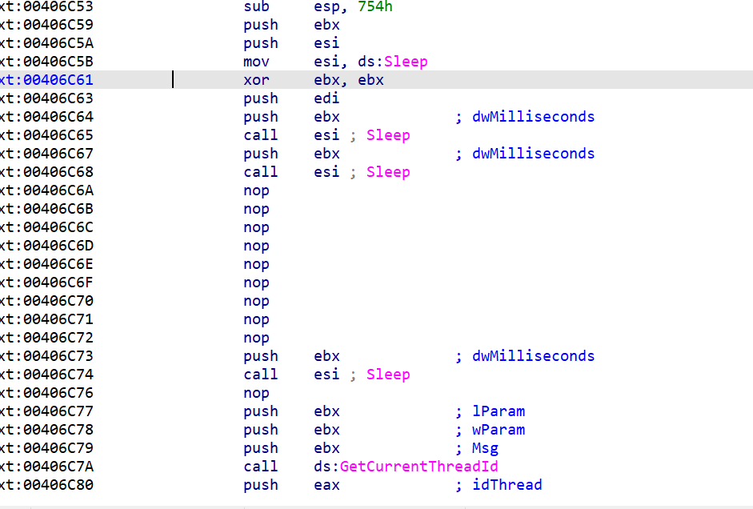

一堆sleep 和nop不慌这是干扰杀软的一种方式

直接定位到00406CBD 的位置 前面的都没用

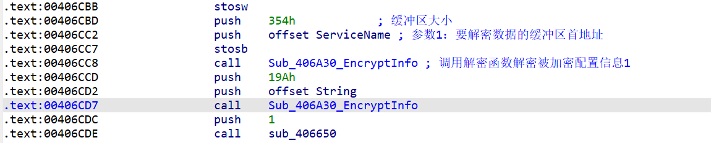

那我怎么知道他是解密呢

进去EncryptInfo 看看

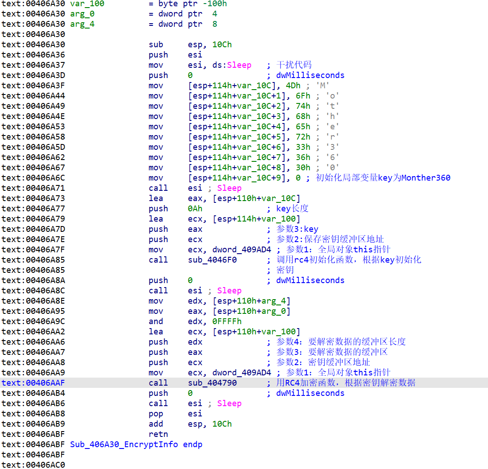

那又为什么是RC4加密函数呢 我百度了一下 发现还真是 RC4的实现


```
主要是将全局数据区的应用程序配置信息通过RC4

加密算法进行解密，解密后的信息如下。
配置信息1：

{
"服务器IP地址",
"服务器通信密码",
2110,
2110,
"Mother360",
"V_130305"
};

配置信息2：

{
"YYYYYYYYYYYY",
"Yugqqu qekcaigu",
"Igaoqa ymusuyukeamucgowws","%ProgramFiles%\\Rumno Qrstuv",
"SB360.exe",
"默认分组",
"Nmbbre hjveaika",
0,
0,
0,
0,
0
};
```

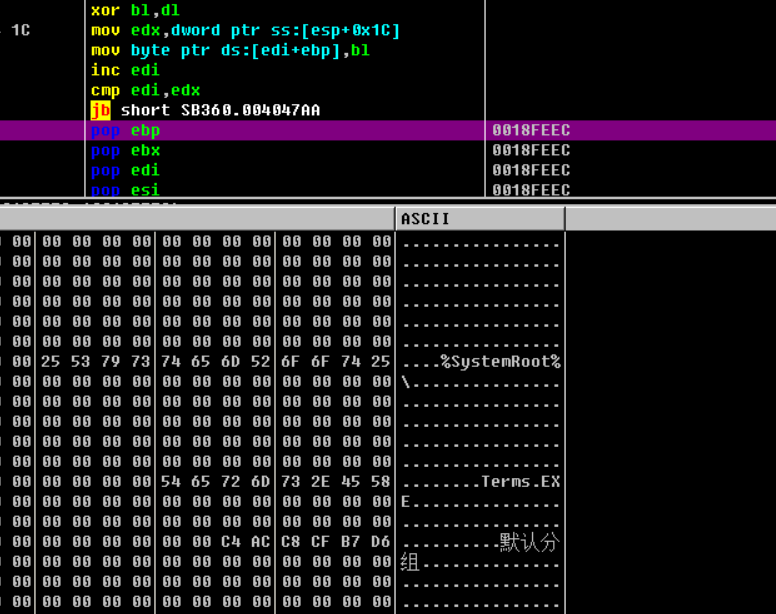

第一段解密 


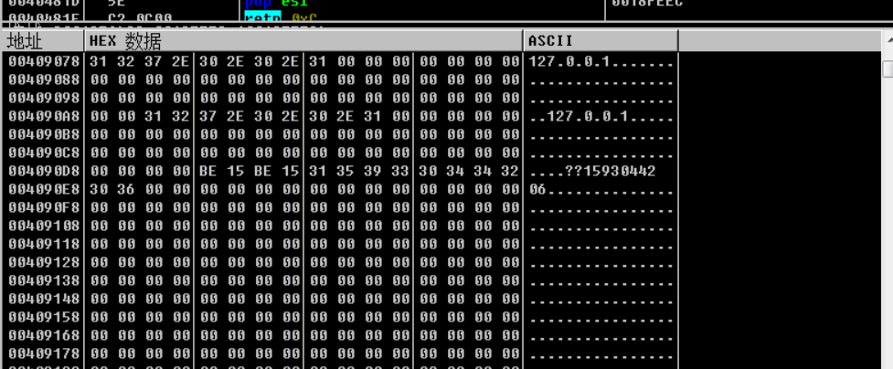

第二段解密


通过两次解密，我们可以看到这是样本将一些自身的配置信息比如分组信息、C2服务器IP等释放到内存中


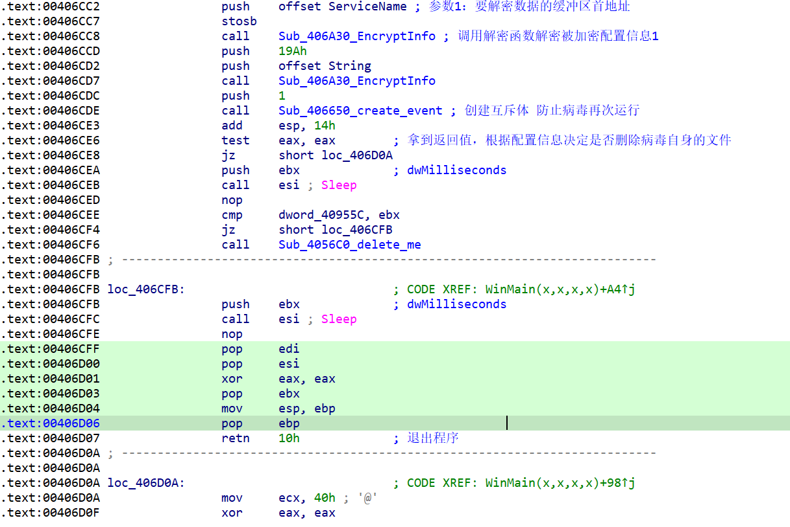


406cF6是delete函数 这个你自己od里面调一下 他会生成vbs文件 

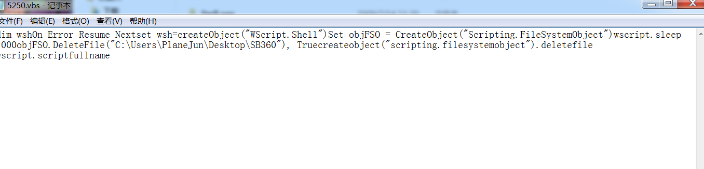


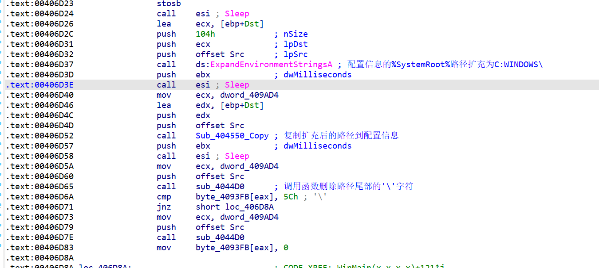


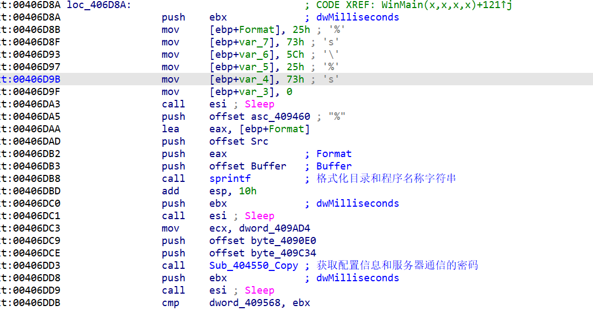


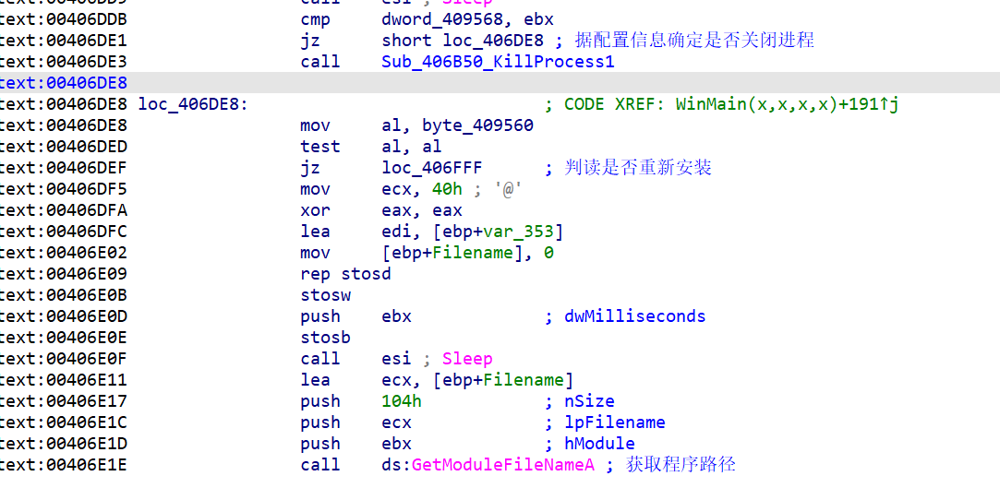


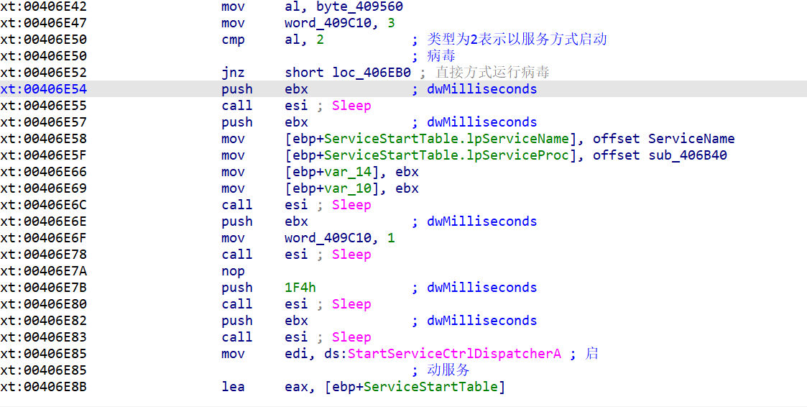


我们看看直接方式运行病毒会怎么样

点进去一看 有两个函数 我们看406290

比较简单 我叙述一下过程

通过AdjustTokenPrivileges提权。 通过OpenProcess打开System进程（PID为4）。 通过CreateFile打开独占大文件句柄。通过DuplicateHandle将文件句柄复制到System进程中。 


我们再看看4066C0  往下走 

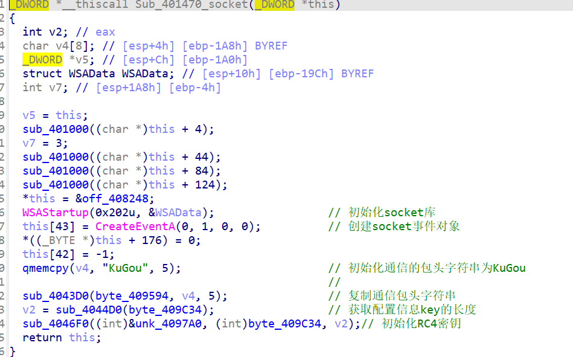


接着走到00401664 的位置也就是连接服务器了

 往下到0401B30的位置

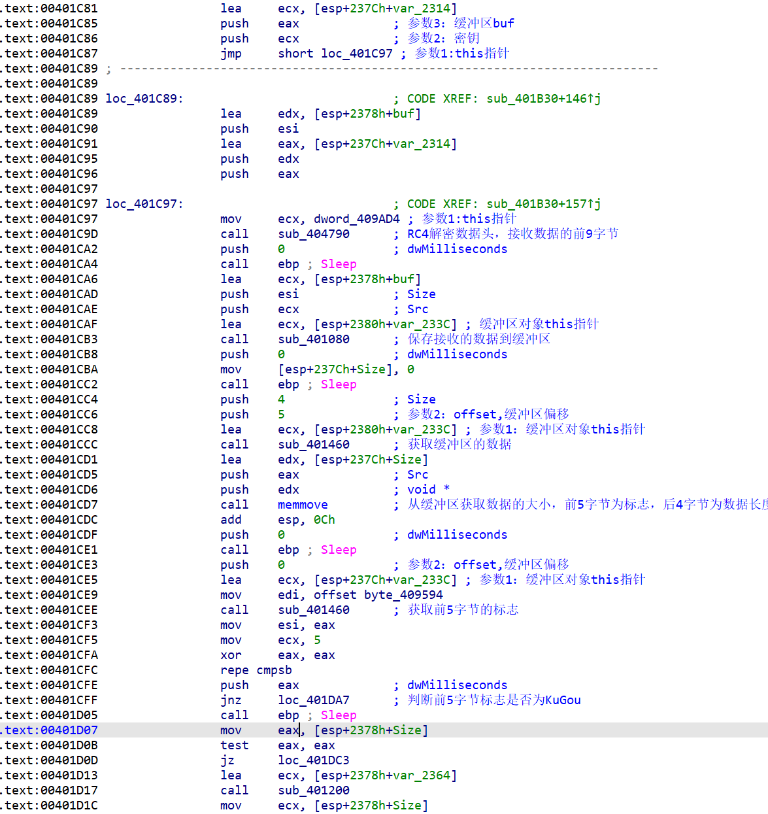


