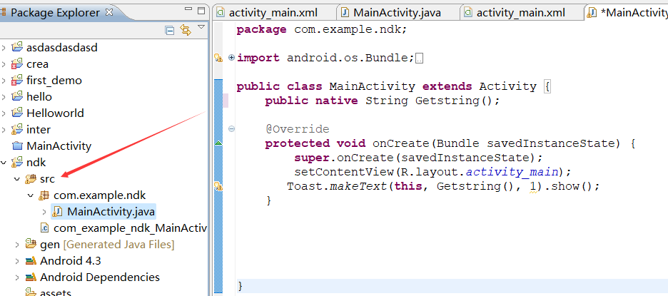
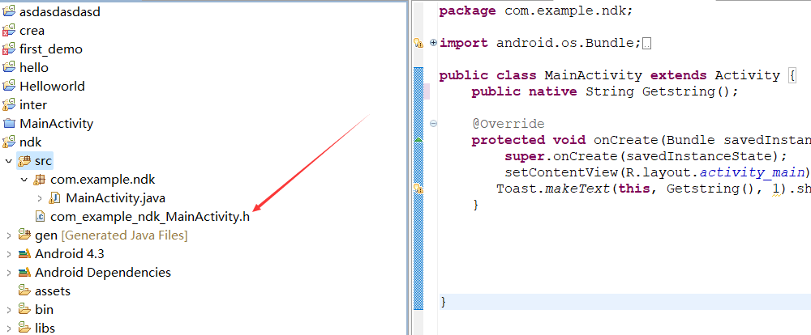
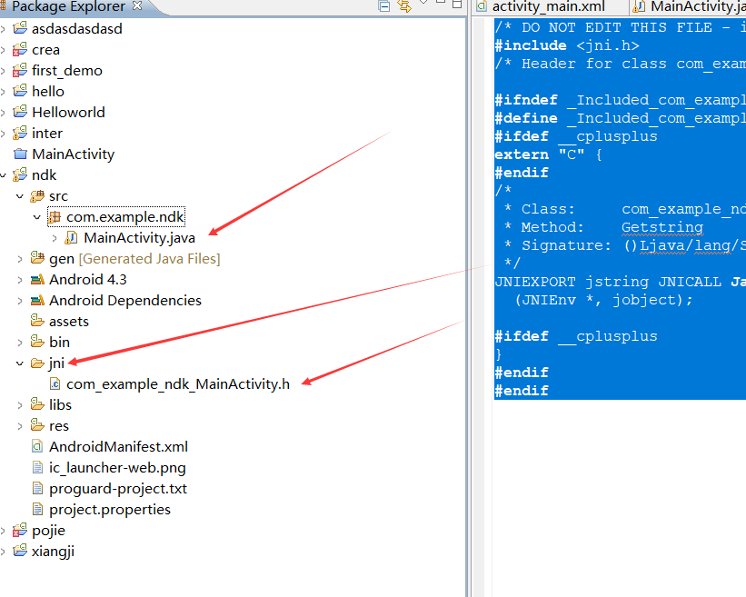
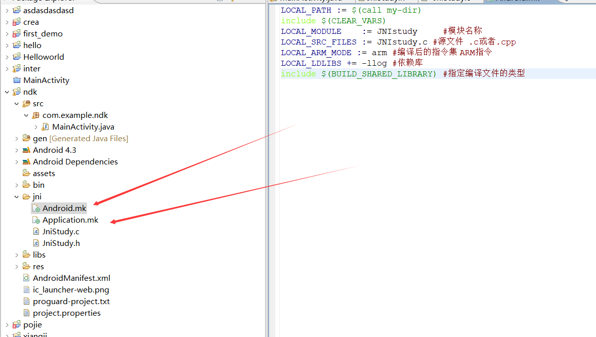
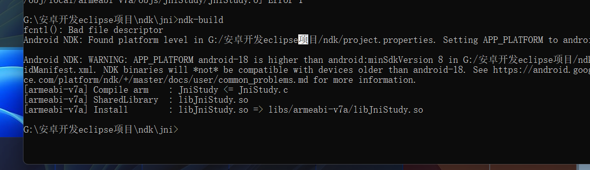

# Android NDK开发

说到NDK，相信大家都不陌生，它是Google为便于Android开发提供的一种原生开发集：Native Development Kit，而且也是一个包含API、构建工具、交叉编译、调试器、文档示例等一系列的工具集，可以帮助开发者快速开发C（或C++）的动态库，并能自动将so和java应用一起打包成APK。

与NDK密切相关的另一个词汇则是JNI，它是NDK开发中的枢纽，Java与底层交互绝大多数都是通过它来完成的，

JNI：Java Native Interface 也就是java本地接口，它是一个协议，这个协议用来沟通java代码和本地代码(c/c++)。通过这个协议，Java类的某些方法可以使用原生实现，同时让它们可以像普通的Java方法一样被调用和使用，而原生方法也可以使用Java对象，调用和使用Java方法。也就是说，使用JNI这种协议可以实现：java代码调用c/c++代码，而c/c++代码也可以调用java代码。

那为什么要使用NDK开发呢？

我们都知道，java是半解释型语言，很容易被反汇编后拿到源代码文件，在开发一些重要协议时，我们为了安全起见，为了解决这些问题，Google凭借Java语言的JNI特性为开发者提供了Android NDK (Native Development Kit)。使用C语言来编写这些重要的部分，来增大系统的安全性。在一些复杂性的计算中，要求高性能的场景中，C/C++更加的有效率，代码也更便于复用。当然还有其他的优点，这些都驱使我们选择相对来说高效和安全的DNK来开发我们的应用程序。其它平台开发的游戏如采用C、C++编写的，则因为涉及到移植而可能面临重写
所有代码;

Android NDK直译为“安卓原生开发套件”。它是一款强大的工具，可以将原生C、C++
代码的强大功能和Android 应用的图形界面结合在一起，解决软件的跨平台问题。通过使
用该工具，一些应用程序能直接通过JNI调用与CPU打交道而使性能得到提升。同时，能
够将程序的核心功能封装进基于“原生开发套件”的模块中，从而大大提高软件的安全性。


先定义一个被native实现的方法

# Java 代码调用本地的 C 程序

**步骤如下：**

①、编写带有 native 声明的方法的java类，生成.java文件；(注意这里出现了 native 声明的方法关键字）

③、使用 javah -jni java类名 生成扩展名为 h 的头文件，也即生成.h文件；

④、使用C/C++（或者其他编程想语言）实现本地方法，创建.h文件的实现，也就是创建.cpp文件实现.h文件中的方法；

⑤、将C/C++编写的文件生成动态连接库，生成dll文件；

我们开始

MainActivity

```java
package com.example.ndk;

import android.os.Bundle;
import android.app.Activity;
import android.view.Menu;
import android.widget.Toast;

public class MainActivity extends Activity {
	public native String Getstring();  

    @Override
    protected void onCreate(Bundle savedInstanceState) {
        super.onCreate(savedInstanceState);
        setContentView(R.layout.activity_main);
       Toast.makeText(this, Getstring(), 1).show();
    } 
}

## native方法
native方法是java与其他语言协作的时候使用的，native并不是java实现的，所以直接调用就好，不需要管他底层实现，java只能调用，不能查看和修改，java是跨平台语言，自然而然会失去对底层的控制，于是想要调用底层方法，就必须使用native方法间接调用底层操作系统的方法(c,c++实现).随着java的不断发展，native方法越来越少，native是一个关键字，其修饰的方法只说明不实现，native方法加载到 本地栈中
```

写好了之后我们进入到src的原目录下



在此文件夹中打开cmd命令行输入以下代码

```
javah -jni com.example.ndk.MainActivity
***********************************************************************************
可以先javah查看一下命令 
-jni                     生成 JNI 样式的标头文件 (默认值)
后面的com.example.ndk.MainActivity是我们的包名
```

此时我们在eplice右键src 然后点击Refresh 就会出现一个头文件



这个头文件里面是这样的

```java
/* DO NOT EDIT THIS FILE - it is machine generated */
#include <jni.h>
/* Header for class com_example_ndk_MainActivity */

#ifndef _Included_com_example_ndk_MainActivity
#define _Included_com_example_ndk_MainActivity
#ifdef __cplusplus
extern "C" {
#endif
/*
 * Class:     com_example_ndk_MainActivity
 * Method:    Getstring
 * Signature: ()Ljava/lang/String;
 */
JNIEXPORT jstring JNICALL Java_com_example_ndk_MainActivity_Getstring
  (JNIEnv *, jobject);

#ifdef __cplusplus
}
#endif
#endif

```



然后我们把这个新生成的文件改名成JniStudy.h

 然后我们在这个新生成的文件夹中新建一个JniStudy.c文件 

这两个文件有了之后就可以在.c文件中写代码了

```c
JniStudy.c文件这样写
#include<JniStudy.c>
JNIEXPORT jstring JNICALL Java_com_example_ndk_MainActivity_Getstring
  (JNIEnv *env, jobject obj){
	jstring str=(*env)->NewStringUtf(env,"hello NDK");
	return "str"; 
	
}


```




再创建这两个文件 你提前写好 然后每次都复制进去就行 内容不变


```
Android.mk

LOCAL_PATH := $(call my-dir)   
include $(CLEAR_VARS)  
LOCAL_MODULE    := JniStudy  	#模块名称  
LOCAL_SRC_FILES := JniStudy.c #源文件  .c或者.cpp
LOCAL_ARM_MODE := arm #编译后的指令集 ARM指令
LOCAL_LDLIBS += -llog #依赖库    
include $(BUILD_SHARED_LIBRARY) #指定编译文件的类型
```


```
Application.mk


APP_ABI := armeabi-v7a
```


好 现在我们cmd到这个文件夹中 运行ndk-build，



# NDK的环境搭建

1. 安装配置NDK

2. 首先下载NDK，这里我使用的是android-ndk-r14b-windows-x86_64，可以自主选择https://blog.csdn.net/u013302168/article/details/120962750。

3. 解压NDK的zip包，注意路径目录不要出现**空格和中文**，这里建议大家把包解压到SDK目录里面，并命名为ndk-bundle，好处是，启动AS的时候会检查它并直接添加到ndk.dir中，减少我们的配置工作；

4. 配置path : 把解压好的路径添加到环境变量path中；

5. ndk-build：cd到解压后NDK的根目录，执行ndk-build命令。

6. 给AS配置关联NDK，这里我使用的是androidstudio，使用Eclipse的会有所不同，请自行查找资料来配置。   在建立的工程中的local.properties中添加如下配置ndk.dir=D:\guanmanman\androidStudio\sdk\ndk-bundle,这里注意下要使用转义字符“”来进行字符转义。如果ndk目录是存放在SDK中，并命名为ndk-bundle，这个配置会自动为添加上去。
    

9. 在工程中gradle.properties中添加对旧版本的NDK支持的配置android.useDeprecatedNdk=true
    

10. OK，到这里我们基本的NDK环境配置已基本完成，那接下来就开始我们的NDK开发旅程吧。


Android Studio JNI编程主要由：1）NDK安装；2）NDK配置；3）配置C/C++环境；4）配置CMakelists.txt编译；5）编写JNI接口程序；6）生成H头文件；7）编写C/C++程序。


# Demo实例之调用本地无参方法直接返回字符串

## 一 layout布局

直接在layout中添加一个按钮Button控件，用于点击调用本地方法：


## 二 在MainActivity中获取该控件并注册它的点击监听器


## 三 创建Java2CJNI类及本地方法

在我们的包下直接创建一个Java2CJNI类，并在类里创建一个java2C的本地方法：


## 四 通过javah命令获取到本地头文件

在项目根目录下，进入main->java目录，全选文件目录栏，直接输入cmd命令并按回车键进入docs命令，在命令中执行javah com.sanhui.ndkdemo.Java2CJNI命令：


执行完javah命令后，会在java当前目录下创建一个.h的头文件

## 五 在main目录下创建一个jni文件夹，并把（四）中的头文件转移到该文件夹下


打开该文件夹可以看到系统为我们创建好的本地方法头文件。

## 六 创建实现头文件的.C源文件

在jni目录下创建一个Java2C.c的源文件，通过#include引入我们的头文件com_sanhui_ndkdemo_Java2CJNI.h，并把在头文件下的声明方法JNIEXPORT jstring JNICALL Java_com_sanhui_ndkdemo_Java2CJNI_java2C(JNIEnv *, jobject);复制到我们的Java2C.c中，补全方法参数，并实现一个C字符串“**I am From Native C .**”的返回：


OK，至此我们的代码已编写完毕，接下来我们需要配置编译后的so名称和支持的cpu类型。

## 七 在该项目下的build.gradle配置生成的so名称和支持的cpu类型

在android->defaultConfig下添加如下代码：

```
ndk{
     moduleName "Java2C" //so文件名
     abiFilters "armeabi", "armeabi-v7a", "x86" //CPU类型
}
```


当然在这里不配置也是可以的，系统会用默认的项目名称作为so文件的名称，并且cpu也将会支持全部类型，只是当我们的项目名称改变的时候，在我们引用加载so文件的地方也需要改变，不改变的话就出现找不到so库的异常，所以，这里配置只是为了便利系统生成我们制定的so文件名，而不是根据项目名称生成。

## 八 加载so库

在我们创建的Java2CJNI类中加载so库，主要是为了在我们调用本地方法之前先编译本地源码。


在使用 System.loadLibrary("Java2C");加载库时，库名一定要与在build.gradle中配置的moduleName 名称一致，否则将找不到库。

## 九 生成so文件

在项目的工具类中选择Build->Rebuild Project，进行重新编译工程，然后AS会为我们生成so文件，so文件所在目录为：NDKDemo\app\build\intermediates\ndk\debug\lib下


注意：so文件命名方式是：lib+moduleName+.so

## 十 执行调用本地方法

在MainActivity中点击Button按钮调用本地方法。并通过Toast打印出来。


OK，到这里已经完成了一个DEMO级别的NDK应用开发了，那么来看看我们的执行结果：


 

首
