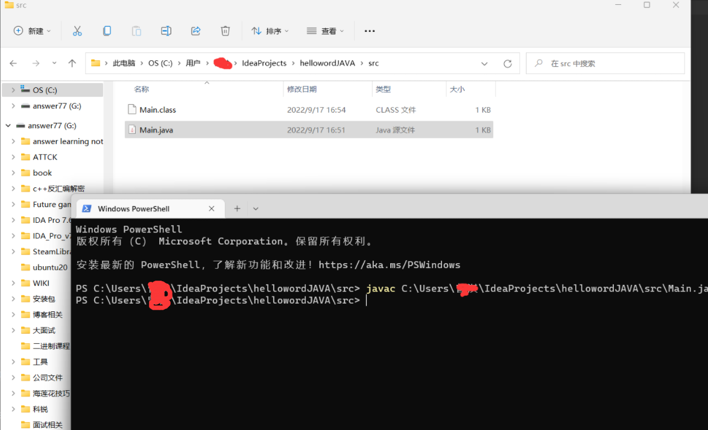
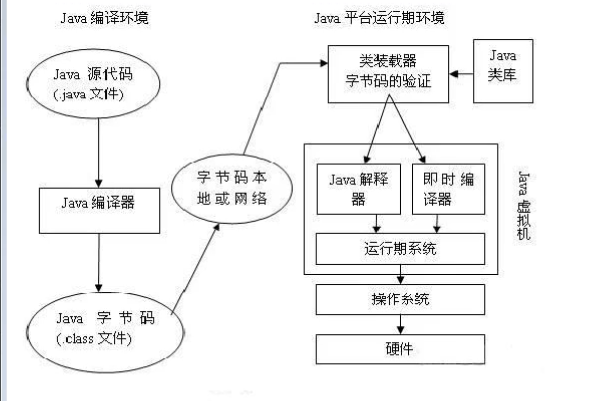
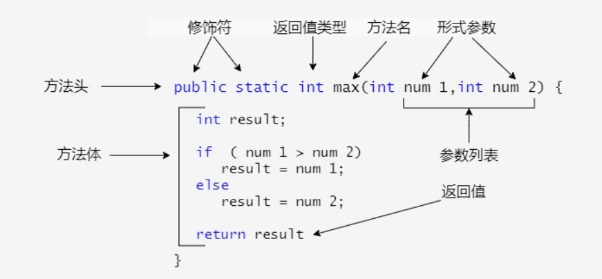

# JAVA环境

https://blog.csdn.net/xhmico/article/details/122390181

这里面很全 我建议下载jdk8 也就是1.8

去官网下载idae 用来写java

*java后缀去编译生成class后缀*







# 方法

方法的命名规则

- 1.方法的名字的第一个单词应以小写字母作为开头，后面的单词则用大写字母开头写，不使用连接符。例如：addPerson。
- 2.下划线可能出现在 JUnit 测试方法名称中用以分隔名称的逻辑组件。一个典型的模式是：test<MethodUnderTest>_<state>，例如 testPop_emptyStack。 

方法的定义




## 静态方法和普通方法区别

静态方法就是static 修饰的 没有static修饰的就是普通方法

普通方法都是需要new进行调用 再 类名.方法名()

静态方法调用方式 类名.方法名()

# 继承

在 Java 中通过 extends 关键字可以申明一个类是从另外一个类继承而来的，一般形式如下：

企鹅：属性（姓名，id），方法（吃，睡，自我介绍）

```java
公共父类：
public class Animal { 
    private String name;  
    private int id; 
    public Animal(String myName, int myid) { 
        name = myName; 
        id = myid;
    } 
    public void eat(){ 
        System.out.println(name+"正在吃"); 
    }
    public void sleep(){
        System.out.println(name+"正在睡");
    }
    public void introduction() { 
        System.out.println("大家好！我是"         + id + "号" + name + "."); 
    } 
}

```

```java
企鹅类：
public class Penguin extends Animal { 
    public Penguin(String myName, int myid) { 
        super(myName, myid); 
    } 
}

```

```java
老鼠类：
public class Mouse extends Animal { 
    public Mouse(String myName, int myid) { 
        super(myName, myid); 
    } 
}

```

需要注意的是 Java 不支持多继承，但支持多重继承。

多重继承就是一个子类有多个父类，多重继承就是一个父类有多个子类

## 继承的特性

- 子类拥有父类非 private 的属性、方法。
- 子类可以拥有自己的属性和方法，即子类可以对父类进行扩展。
- 子类可以用自己的方式实现父类的方法。
- Java 的继承是单继承，但是可以多重继承，单继承就是一个子类只能继承一个父类，多重继承就是，例如 B 类继承 A 类，C 类继承 B  类，所以按照关系就是 B 类是 C 类的父类，A 类是 B 类的父类，这是 Java 继承区别于 C++ 继承的一个特性。
- 提高了类之间的耦合性（继承的缺点，耦合度高就会造成代码之间的联系越紧密，代码独立性越差）。

## 继承关键字

继承可以使用 extends 和 implements 这两个关键字来实现继承，而且所有的类都是继承于 java.lang.Object，当一个类没有继承的两个关键字，则默认继承 Object（这个类在 **java.lang** 包中，所以不需要 **import**）祖先类。

### extends关键字

在 Java 中，类的继承是单一继承，也就是说，一个子类只能拥有一个父类，所以 extends 只能继承一个类。

```java
public class Animal { 
    private String name;   
    private int id; 
    public Animal(String myName, int myid) { 
        //初始化属性值
    } 
    public void eat() {  //吃东西方法的具体实现  } 
    public void sleep() { //睡觉方法的具体实现  } 
} 
 
public class Penguin  extends  Animal{ 
}

```

### implements关键字

使用 implements 关键字可以变相的使java具有多继承的特性，使用范围为类继承接口的情况，可以同时继承多个接口（接口跟接口之间采用逗号分隔）。

```java

public interface A {
    public void eat();
    public void sleep();
}
 
public interface B {
    public void show();
}
 
public class C implements A,B {
}

```

### super 与 this 关键字

super是父类的意思 指向父类的引用

this 指向当前类的引用

```java
class Animal {
  void eat() {
    System.out.println("animal : eat");
  }
}
 
class Dog extends Animal {
  void eat() {
    System.out.println("dog : eat");
  }
  void eatTest() {
    this.eat();   // this 调用自己的方法
    super.eat();  // super 调用父类方法
  }
}
 
public class Test {
  public static void main(String[] args) {
    Animal a = new Animal();
    a.eat();
    Dog d = new Dog();
    d.eatTest();
  }
}

```

### final 关键字

final 可以用来修饰变量（包括类属性、对象属性、局部变量和形参）、方法（包括类方法和对象方法）和类。

用final修饰的变量 是不可变的，所以用final时，必须进行初始化

使用 final 关键字声明类，就是把类定义定义为最终类，*不能被继承*，或者用于修饰方法，该方法不能被子类重写：

- 声明类：

  ```
  final class 类名 {
  //类体
  }
  ```

- 声明方法：

  ```
  修饰符(public/private/default/protected) final 返回值类型 方法名(){//方法体}
  ```

**注：** final 定义的类，其中的属性、方法不是 final 的。

# 重写(Override)

 重写是子类对父类的允许访问的方法的实现过程进行重新编写, 返回值和形参都不能改变。**即外壳不变，核心重写！**

重写的好处在于子类可以根据需要，定义特定于自己的行为。 也就是说子类能够根据需要实现父类的方法。重写方法不能抛出新的检查异常或者比被重写方法申明更加宽泛的异常。例如： 父类的一个方法申明了一个检查异常 IOException，但是在重写这个方法的时候不能抛出 Exception 异常，因为 Exception 是 IOException 的父类，抛出 IOException 异常或者 IOException 的子类异常。

在面向对象原则里，重写意味着可以重写任何现有方法。

```java
class Animal{
   public void move(){
      System.out.println("动物可以移动");
   }
}
class Dog extends Animal{
   public void move(){
      System.out.println("狗可以跑和走");
   }
}
public class TestDog{
   public static void main(String args[]){
      Animal a = new Animal(); // Animal 对象
      Animal b = new Dog(); // Dog 对象
 
      a.move();// 执行 Animal 类的方法
 
      b.move();//执行 Dog 类的方法
   }
}
```

以上实例编译运行结果如下：

```
动物可以移动
狗可以跑和走
```

# 抽象类

面向对象的概念中，所有的对象都是通过类来描绘的，

但是反过来，并不是所有的类都是用来描绘对象的，如果一个类中没有包含足够的信息来描绘一个具体的对象，这样的类就是抽象类。

抽象类除了不能实例化对象之外，类的其它功能依然存在，成员变量、成员方法和构造方法的访问方式和普通类一样。

由于抽象类不能实例化对象，所以抽象类必须被继承，才能被使用。

也是因为这个原因，通常在设计阶段决定要不要设计抽象类。父类包含了子类集合的常见的方法，

但是由于父类本身是抽象的，所以不能使用这些方法。

在 Java 中抽象类表示的是一种继承关系，一个类只能继承一个抽象类，而一个类却可以实现多个接口。

在 Java 语言中使用 abstract class 来定义抽象类

*  类里面如果有抽象方法 ，该类必须定义为抽象类

```
class cat{
     public void text();  /* 此方法为抽象方法，但是该类不是，因此这里报错*/
}
```

抽象方法不能用final进行修饰，抽象方法不能用final进行修饰，抽象类不能用static进行修饰，抽象方法也不能

# 接口

接口，在JAVA编程语言中是一个抽象类型，是抽象方法的集合，接口通常以interface来声明。一个类通过继承接口的方式，从而来继承接口的抽象方法。

接口并不是类，编写接口的方式和类很相似，但是它们属于不同的概念。类描述对象的属性和方法。接口则包含类要实现的方法。

除非实现接口的类是抽象类，否则该类要定义接口中的所有方法。

接口无法被实例化，但是可以被实现。一个实现接口的类，必须实现接口内所描述的所有方法，否则就必须声明为抽象类，  就是需要定义的类被abstract关键词修饰

接口实现时，不能使用extends关键字，只能使用implements关键字

接口里默认你声明的变量、方法都是public的

接口里面可以定义静态方法，但必须要实现，要有花括号

## 接口特性

- 接口中每一个方法也是隐式抽象的,接口中的方法会被隐式的指定为 **public abstract**（只能是  public abstract，其他修饰符都会报错）。
- 接口中可以含有变量，但是接口中的变量会被隐式的指定为 **public static final** 变量（并且只能是 public，用 private 修饰会报编译错误）。
- 接口中的方法是不能在接口中实现的，只能由实现接口的类来实现接口中的方法。

## 抽象类和接口的区别

- 抽象类中的方法可以有方法体，就是能实现方法的具体功能，但是接口中的方法不行。
- 抽象类中的成员变量可以是各种类型的，而接口中的成员变量只能是 **public static final** 类型的。
- 接口中不能含有静态代码块以及静态方法(用 static 修饰的方法)，而抽象类是可以有静态代码块和静态方法。
- 一个类只能继承一个抽象类，而一个类却可以实现多个接口。

## 接口的声明

[可见度] interface 接口名称 [extends 其他的接口名] {        // 声明变量        // 抽象方法 }

Interface关键字用来声明一个接口。下面是接口声明的一个简单例子。

```
interface Animal {
   public void eat();
   public void travel();
}
```

接口有以下特性：

- 接口是隐式抽象的，当声明一个接口的时候，不必使用**abstract**关键字。
- 接口中每一个方法也是隐式抽象的，声明时同样不需要**abstract**关键字。
- 接口中的方法都是公有的。

接口里面可以定义变量，必须进行初始化，但是不能用private修饰，默认是 public final

## 接口的实现

当类实现接口的时候，类要实现接口中所有的方法。否则，类必须声明为抽象的类。

类使用implements关键字实现接口。在类声明中，Implements关键字放在class声明后面。

实现一个接口的语法，可以使用这个公式：

```
...implements 接口名称[, 其他接口名称, 其他接口名称..., ...] .
```

```
## 实现
public class MammalInt implements Animal{
 
   public void eat(){
      System.out.println("Mammal eats");
   }
 
   public void travel(){
      System.out.println("Mammal travels");
   } 
 
   public int noOfLegs(){
      return 0;
   }
 
   public static void main(String args[]){
      MammalInt m = new MammalInt();
      m.eat();
      m.travel();
   }
}

以上实例编译运行结果如下:

Mammal eats
Mammal travels
```

## 接口的继承

一个接口能继承另一个接口，和类之间的继承方式比较相似。接口的继承使用extends关键字，子接口继承父接口的方法。

下面的Sports接口被Hockey和Football接口继承：

```java
// 文件名: Sports.java
public interface Sports
{
   public void setHomeTeam(String name);
   public void setVisitingTeam(String name);
}
 
// 文件名: Football.java
public interface Football extends Sports
{
   public void homeTeamScored(int points);
   public void visitingTeamScored(int points);
   public void endOfQuarter(int quarter);
}
 
// 文件名: Hockey.java
public interface Hockey extends Sports
{
   public void homeGoalScored();
   public void visitingGoalScored();
   public void endOfPeriod(int period);
   public void overtimePeriod(int ot);
}
```

Hockey接口自己声明了四个方法，从Sports接口继承了两个方法，这样，实现Hockey接口的类需要实现六个方法。

相似的，实现Football接口的类需要实现五个方法，其中两个来自于Sports接口。

## 接口的多继承

在Java中，类的多继承是不合法，但接口允许多继承。

在接口的多继承中extends关键字只需要使用一次，在其后跟着继承接口。 如下所示：

```
public interface Hockey extends Sports, Event
```

以上的程序片段是合法定义的子接口，与类不同的是，接口允许多继承，而 Sports及  Event 可以定义或是继承相同的方法

# java包package

为了更好地组织类，Java 提供了包机制，用于区别类名的命名空间。

## 包的作用

    1、把功能相似或相关的类或接口组织在同一个包中，方便类的查找和使用。
    
    2、如同文件夹一样，包也采用了树形目录的存储方式。同一个包中的类名字是不同的，不同的包中的类的名字是可以相同的，当同时调用两个不同包中相同类名的类时，应该加上包名加以区别。因此，包可以避免名字冲突。
    
    3、包也限定了访问权限，拥有包访问权限的类才能访问某个包中的类。


Java 使用包（package）这种机制是为了防止命名冲突，访问控制，提供搜索和定位类（class）、接口、枚举（enumerations）和注释（annotation）等。

包语句的语法格式为：

```
package pkg1[．pkg2[．pkg3…]];
```

例如,一个Something.java 文件它的内容

```
package net.java.util; public class Something{   ... }
```

那么它的路径应该是 **net/java/util/Something.java** 这样保存的。 package(包) 的作用是把不同的 java 程序分类保存，更方便的被其他 java 程序调用。

一个包（package）可以定义为一组相互联系的类型（类、接口、枚举和注释），为这些类型提供访问保护和命名空间管理的功能。

以下是一些 Java 中的包：

- **java.lang**-打包基础的类
- **java.io**-包含输入输出功能的函数

开发者可以自己把一组类和接口等打包，并定义自己的包。而且在实际开发中这样做是值得提倡的，当你自己完成类的实现之后，将相关的类分组，可以让其他的编程者更容易地确定哪些类、接口、枚举和注释等是相关的。

由于包创建了新的命名空间（namespace），所以不会跟其他包中的任何名字产生命名冲突。使用包这种机制，更容易实现访问控制，并且让定位相关类更加简单。

## 创建包

创建包的时候，你需要为这个包取一个合适的名字。之后，如果其他的一个源文件包含了这个包提供的类、接口、枚举或者注释类型的时候，都必须将这个包的声明放在这个源文件的开头。

包声明应该在源文件的第一行，每个源文件只能有一个包声明，这个文件中的每个类型都应用于它。

如果一个源文件中没有使用包声明，那么其中的类，函数，枚举，注释等将被放在一个无名的包（unnamed package）中。

### 例子

让我们来看一个例子，这个例子创建了一个叫做animals的包。通常使用小写的字母来命名避免与类、接口名字的冲突。

在 animals 包中加入一个接口（interface）：

```

/* 文件名: Animal.java */
package animals;
 
interface Animal {
   public void eat();
   public void travel();
}

```


```java
接下来，在同一个包中加入该接口的实现：
MammalInt.java 文件代码：
package animals;
 
/* 文件名 : MammalInt.java */
public class MammalInt implements Animal{
 
   public void eat(){
      System.out.println("Mammal eats");
   }
 
   public void travel(){
      System.out.println("Mammal travels");
   } 
 
   public int noOfLegs(){
      return 0;
   }
 
   public static void main(String args[]){
      MammalInt m = new MammalInt();
      m.eat();
      m.travel();
   }
}

```

然后，编译这两个文件，并把他们放在一个叫做animals的子目录中。 用下面的命令来运行：

```
$ mkdir animals
$ cp Animal.class  MammalInt.class animals
$ java animals/MammalInt
Mammal eats
Mammal travel
```

## import 关键字

为了能够使用某一个包的成员，我们需要在 Java 程序中明确导入该包。使用 "import" 语句可完成此功能。

在 java 源文件中 import 语句应位于 package 语句之后，所有类的定义之前，可以没有，也可以有多条，其语法格式为：

import package1[.package2…].(classname|*);

如果在一个包中，一个类想要使用本包中的另一个类，那么该包名可以省略。

### 例子

下面的 payroll 包已经包含了 Employee 类，接下来向 payroll 包中添加一个 Boss 类。Boss 类引用 Employee 类的时候可以不用使用 payroll 前缀，Boss 类的实例如下。

```
## Boss.java 文件代码：

package payroll;  
public class Boss {  
public void payEmployee(Employee e)  {    
e.mailCheck();   
} 
}
```

如果 Boss 类不在 payroll 包中又会怎样？Boss 类必须使用下面几种方法之一来引用其他包中的类。

使用类全名描述，例如：

payroll.Employee

用 **import** 关键字引入，使用通配符 *：

import payroll.*;

使用 **import** 关键字引入 Employee 类：

import payroll.Employee;

**注意：**

类文件中可以包含任意数量的 import 声明。import 声明必须在包声明之后，类声明之前。

```java
class zeng extends Object{
}
```

object是所有类的根节点，

我们这里创建的每一个类默认继承object

怎么访问其他类  首先在我们这个类开头 import 需要导入的类

比如导入zengqi这个类里面的 z方法

调用就是zengqi.z()

java.lang下的类，默认自动导入

# 内部类

类里面定义类 叫内部类

静态内部类 就是前面加个static关键字

还有一种类叫方法里面定义的类 叫局部类，不能被静态关键字修饰


new一个接口 我们叫做匿名内部类  new就是实例化嘛


 

# 反射机制

https://blog.csdn.net/weixin_52533007/article/details/123312217


http://c.biancheng.net/java/100/


