# 第一个安卓程序

搭建好 eclipse集成开发环境 创建第一个安卓项目

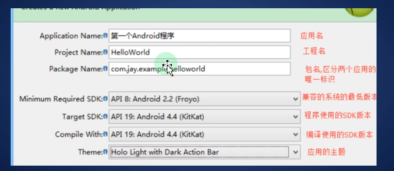


file->新建 安卓alpication 然后起个名字一路新建 发现来到了安卓样式的窗口

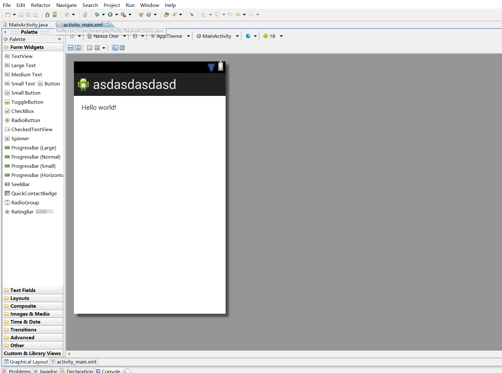

这个界面的左边都是控件 都可以把东西拖过去用 比如第一个textview 就是文本框  可以往里面输入字符串


点一下下面的 activity_main_xml 来到界面对应的代码端 布局的操作就在这里进行


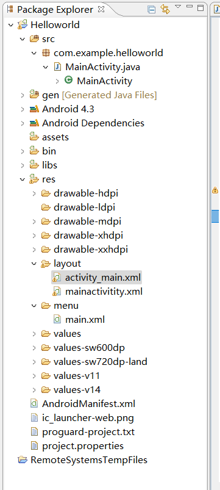

至于上面这张图的文件树寻找的方法在这里https://blog.csdn.net/can3981132/article/details/118245499

避免有人找不到package explorer

mainactivity.java 文件

```java
package com.example.asdasdasdasd; //我们自己的包名

import android.os.Bundle;   //导入的包名
import android.app.Activity;
import android.view.Menu;

public class MainActivity extends Activity {  /*MainActivity继承了activity，activity是系统的，mainactivity是我们自己创建的 这只是一个区分*/

    @Override   /*重写了父类的oncreate方法*/
    protected void onCreate(Bundle savedInstanceState) {
        super.onCreate(savedInstanceState);
        setContentView(R.layout.activity_main);  //绑定了布局界面 这个activity_main就是刚创建文件的时候那个界面，你也可以自己创建一个，绑定的是哪个我们操作的就是哪个界面
    }

```


# Android项目结构

安卓apk文件其实就是压缩文件

src    包含项目中所有的.java源文件，默认情况下，它包括一个 MainActivity.java源文件对应的活动类，当应用程序通过应用图标启动时，将运行它。
gen    这包含由编译器生成的.R文件，引用了所有项目中的资源。该文件不能被修改。
Android4.4
Android Private Libraries 安卓导入的依赖包
assets 资源目录打包一些文件到应用程序里面(数据库文件，网页文件，配置文件)
bin  这个文件夹包含Android由APT构建的.apk包文件，以及运行Android应用程序所需要的其他所有东西。
libs 安卓开发所需要存放的第三方开发包

res 资源目录
drawable 图标
layout 布局文件
menu 菜单配置文件
values 这个目录存放各种各样的包含一系列资源的XML文件，比如字符串和颜色的定义。

dimens   安卓的控件尺寸
strings   存储所有文本
styles  样式文件
colors  颜色文件
ids  存储安卓控件的id的文件
AndroidManifest. xml   这个是应用程序的清单文件，描述了应用程序的基础特性，定义它的各种组件。
project.propertise  工程的配置文件配置安卓版本第三方依赖包的路径
proguard project.txt  配置混淆编译的规则


## Strings 文件

strings.xml文件在res/value文件夹下，它包含应用程序使用到的所有文本。例如，按钮、标签的名称，默认文本，以及其他相似的strings

## R 文件

gen/com.example.helloworld/R.java文件是活动的Java文件，如MainActivity.java的和资源如strings.xml之间的胶水。这是一个自动生成的文件，不要修改R.java文件的内容。下面是一个R.java文件的示例：

## Layout 文件

activity_main.xml是一个在res/layout目录下的layout文件。当应用程序构建它的界面时被引用。你将非常频繁的修改这个文件来改变应用程序的布局。在"Hello World"应用程序中，这个文件具有默认的布局，内容如下：

## Manifest文件

无论你开发什么组件用作应用程序中的一部分，都需要在应用程序项目根目录下的manifest.xml文件中声明所有的组件。这个文件是Android操作系统与你的应用程序之间的接口，因此，如果没有在这个文件中声明你的组件，将无法被操作系统所识别。举个例子，一个默认的清单文件看起来如下：

# Android 资源(Resources)访问

有许多东西用来构建一个优秀的 Android 应用程序。除了应用程序的编码，你需要关注各种各样的资源，诸如你用到的各种静态内容，如位图，颜色，布局定义，用户界面字符串，动画等等。这些资源一般放置在项目的 res/ 下独立子目录中。

## 在eclipse中组织资源

你需要将每种资源放置在项目中 res/ 目录的特定子目录下。例如，这是一个简单项目的文件层级：

```
MyProject/
    src/  
        MyActivity.java  
    res/
        drawable/  
            icon.png  
        layout/  
            activity_main.xml
            info.xml
        values/  
            strings.xml 
```

res/ 目录在各种子目录中包含了所有的资源。这里有一个图片资源，两个布局资源和一个字符串资源文件。下表详细的给出了在项目中 res/ 目录里面支持的资源。

| 目录      | 资源类型                                                     |
| --------- | ------------------------------------------------------------ |
| anim/     | 定义动画属性的XML文件。它们被保存在res/anim/文件夹下，通过R.anim类访问 |
| color/    | 定义颜色状态列表的XML文件。它们被保存在res/color/文件夹下，通过R.color类访问 |
| drawable/ | 图片文件，如.png,.jpg,.gif或者XML文件，被编译为位图、状态列表、形状、动画图片。它们被保存在res/drawable/文件夹下，通过R.drawable类访问 |
| layout/   | 定义用户界面布局的XML文件。它们被保存在res/layout/文件夹下，通过R.layout类访问 |
| menu/     | 定义应用程序菜单的XML文件，如选项菜单，上下文菜单，子菜单等。它们被保存在res/menu/文件夹下，通过R.menu类访问 |
| raw/      | 任意的文件以它们的原始形式保存。需要根据名为R.raw.filename的资源ID，通过调用Resource.openRawResource()来打开raw文件 |
| values/   | 包含简单值(如字符串，整数，颜色等)的XML文件。这里有一些文件夹下的资源命名规范。arrays.xml代表数组资源，通过R.array类访问；integers.xml代表整数资源，通过R.integer类访问；bools.xml代表布尔值资源，通过R.bool类访问；colors.xml代表颜色资源，通过R.color类访问；dimens.xml代表维度值，通过R.dimen类访问；strings.xml代表字符串资源，通过R.string类访问；styles.xml代表样式资源，通过R.style类访问 |
| xml/      | 可以通过调用Resources.getXML()来在运行时读取任意的XML文件。可以在这里保存运行时使用的各种配置文件 |

## 替代资源

你的应用程序需要为特定的设备配置提供替代的资源支持。比如说，你需要为不同的屏幕分辨率提供替代的图片资源，为不同的语言提供替代的字符串资源。在运行时，Android 检测当前设备配置，并为应用程序加载合适的资源。

要为特定的配置的确定一系列替代资源，遵循如下的步骤：

- 在res/ 下创建一个新的目录，以 <resource_name>_<config_qualifier>  的方式命名。这里的 resources_name 是上表中提到的任意资源，如布局、图片等。 qualifier  将确定个性的配置使用哪些资源。你可以查看官方文档来了解不同类型资源的一个完整 qualifier 列表。
- 在这个目录中保存响应的替代资源。这些资源文件必须与下面例子中展示的默认资源文件名一致，然而这些文件将确定的内容进行替代。例如：虽然图片的文件名一样，但是高分辨率的屏幕，图片的分辨率也会高。

下面是一个例子，指定默认屏幕的图片和高分辨率的替代图片。

```
MyProject/
   src/
    main/
    java/
       MyActivity.java  
       res/
          drawable/  
            icon.png
            background.png
        drawable-hdpi/  
            icon.png
            background.png  
        layout/  
            activity_main.xml
            info.xml
        values/  
            strings.xml
```


## 访问资源

在应用程序开发中，需要访问定义好的资源，不论是通过代码还是通过 XML 文件。下面的章节介绍如何分别在这两种场景中访问资源。

### 在代码访问资源

当 Android 应用程序被编译，生成一个 R 类，其中包含了所有 res/ 目录下资源的 ID。你可以使用 R 类，通过子类+资源名或者直接使用资源 ID 来访问资源。

### 实例

访问 res/drawable/myimage.png，并将其设置到 ImageView 上，你将使用以下代码：

```java
ImageView imageView = (ImageView) findViewById(R.id.myimageview); 
imageView.setImageResource(R.drawable.myimage);
```

这里第一行代码用 R.id.myimageview 来在布局文件中获取定义为 myimageview 的 ImageView。第二行用 R.drawable.myimage 来获取在 res/ 的 drawable 子目录下名为 myimage 的图片。

### 实例

考虑下一个例子，其中 res/values/strings.xml 有如下定义：

```
<?xml version="1.0" encoding="utf-8"?>
<resources>
    <string  name="hello">Hello, World!</string>
</resources>
```

现在你可以在 ID 为 msg 的 TextView 对象上使用资源 ID 来设置文本，具体如下：

```
TextView msgTextView = (TextView) findViewById(R.id.msg);
msgTextView.setText(R.string.hello);
```

### 实例

考虑如下定义的布局 res/layout/activity_main.xml

```
<?xml version="1.0" encoding="utf-8"?>
<LinearLayout xmlns:android="http://schemas.android.com/apk/res/android"
   android:layout_width="fill_parent" 
   android:layout_height="fill_parent" 
   android:orientation="vertical" >

   <TextView android:id="@+id/text"
      android:layout_width="wrap_content"
      android:layout_height="wrap_content"
      android:text="Hello, I am a TextView" />

   <Button android:id="@+id/button"
      android:layout_width="wrap_content"
      android:layout_height="wrap_content"
      android:text="Hello, I am a Button" />

</LinearLayout>
```

这个应用程序代码将为 activity 加载这个布局，onCreate() 方法中如下：

```
public void onCreate(Bundle savedInstanceState) {
   super.onCreate(savedInstanceState);
   setContentView(R.layout.main_activity);
}
```

### 在XML中访问

考虑下面的 XML 资源文件 res/values/strings.xml，其中包含一个颜色资源和一个字符串资源 -

```
<?xml version="1.0" encoding="utf-8"?>
<resources>
   <color name="opaque_red">#f00</color>
   <string name="hello">Hello!</string>
</resources>
```

现在，你可以在下面的布局文件中使用这些资源来设置文本颜色和文本内容：

```
<?xml version="1.0" encoding="utf-8"?>
<EditText xmlns:android="http://schemas.android.com/apk/res/android"
    android:layout_width="fill_parent"
    android:layout_height="fill_parent"
    android:textColor="@color/opaque_red"
    android:text="@string/hello" />
```

现在，你如果再次回到上一章节讲解的" Hello World! "实例，我可以确定，你对这节中所有的概念有了更好的理解。所以，我强烈建议回去看看之前的实例，并查看我使用不同资源的基本用法。

在明白什么是Dex文件之前，要先了解一下JVM，Dalvik和ART。

JVM是JAVA虚拟机，使用运行JAVA字节码程序。

Dalvik是Google设计的用于Android平台的运行时环境，适合移动环境ART即Android Runtime，是Google为了替换Dalvik设计的新Android运行时环境，在Android 4.4启动。

ART比Dalvik的性能更好。

Android程序一般使用Java语言开发，但是Dalvik虚拟机并不支持直接执行JAVA字节码，因此要进行编译生成的.class文件进行翻译，解释，压缩等处理，这个处理过程是由dx进行处理，处理完成后生成的生成会以.dex结尾，称为Dex文件。

Dex文件格式是专为Dalvik设计的一种压缩格式。所以可以简单的理解为：Dex文件是很多.class文件处理后的纹理，最终可以在Android运行时环境中执行。
1、什么是dex？

简单说就是优化后的android版.exe。每个apk安装包里都有。
相对于PC上的java虚拟机能运行.class；android上的Davlik虚拟机能运行.dex。
为何要研究dex格式？因为dex里面包含了所有app代码，利用反编译工具可以获取java源码。理解并修改dex文件，就能更好的apk破解和防破解。

2、dex好处

dex文件有个天大的好处：它可以直接用DexClassLoader类加载，这叫动态加载。于是我们只要在dex上加壳，在程序运行时脱壳，就可以规避静态反编译的风险。

3、一般的反编译流程是什么样子的。

    1、下载apk文件，然后解压 ，得到 class.dex 文件
    
    2、用dex2jar 把 class.dex 还原成 classes-dex2jar.jar 文件
    
    3、用 jd-gui.exe 把 classes-dex2jar.jar 文件打开，就可以看到源码了。

4、Android 为什么会出现 65536限制问题？

　　在Android系统中，一个App的所有代码都在一个Dex文件里面。Dex是一个类似Jar的包，存储了很多Java编译字节码的归档文件。因为Android系统使用Dalvik虚拟机，所以需要把使用Java Compiler编译之后的class文件转换成Dalvik能够执行的class文件。这里需要强调的是，Dex和Jar一样是一个归档文件，里面仍然是Java代码对应的字节码文件。当Android系统启动一个应用的时候，有一步是对Dex进行优化，这个过程有一个专门的工具来处理，叫DexOpt。DexOpt的执行过程是在第一次加载Dex文件的时候执行的。这个过程会生成一个ODEX文件，即Optimised Dex。执行ODex的效率会比直接执行Dex文件的效率要高很多。但是在早期的Android系统中，DexOpt有一个问题，也就是这篇文章想要说明并解决的问题。DexOpt会把每一个类的方法id检索起来，存在一个链表结构里面。但是这个链表的长度是用一个short类型来保存的，导致了方法id的数目不能够超过65536个。当一个项目足够大的时候，显然这个方法数的上限是不够的。尽管在新版本的Android系统中，DexOpt修复了这个问题，但是我们仍然需要对老系统做兼容。


# 控件

控件是用来展示一个界面的，Android中 提供了大量的UI控件，就是可以拖的那种

通过这些控件的组合就能
够编写出一个我们想要的界面。比如:按钮、进度条、对话框、编辑栏、显示栏这些都
是组件。常使用的控件:
(1) TextView (用于显示文本信息)
(2) Button (按钮)
(3) EditText (编辑文本) 
(4) AlertDialog (对话框)

​	 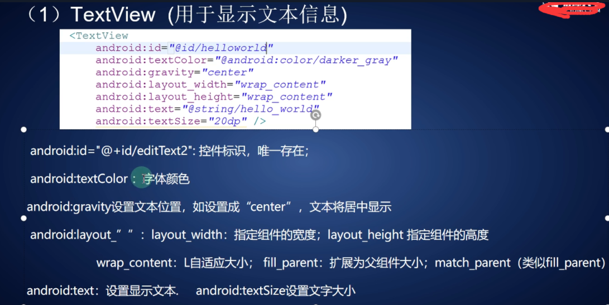

​	 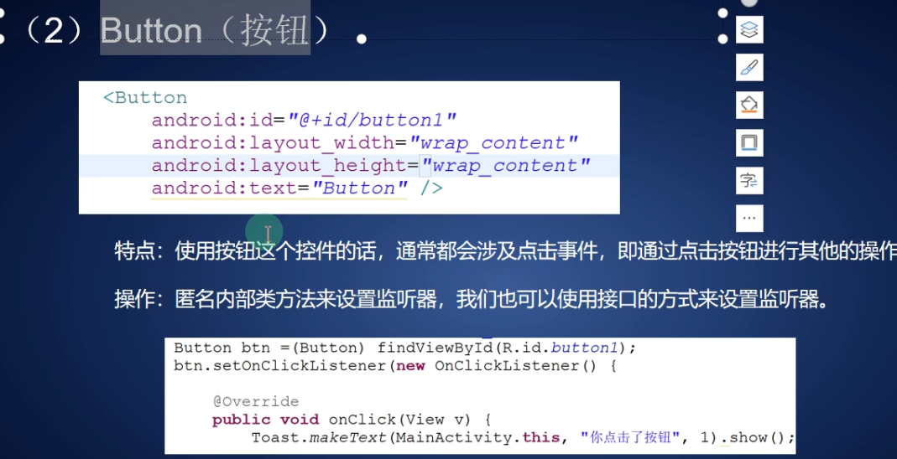

​	 


 


button也是view的子类 

​	 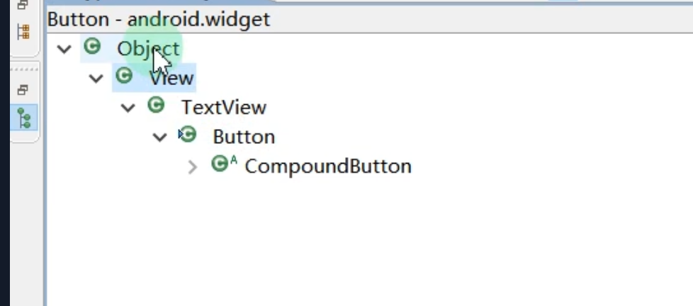


 # 布局

Android布局管理器

Android布局管理器本身是一个界面控件，所有的布局管理器都是ViewGroup类的子类，都是可以当做容器类来使用的

因此一个布局管理器中可以嵌套其他的布局管理器 

​	 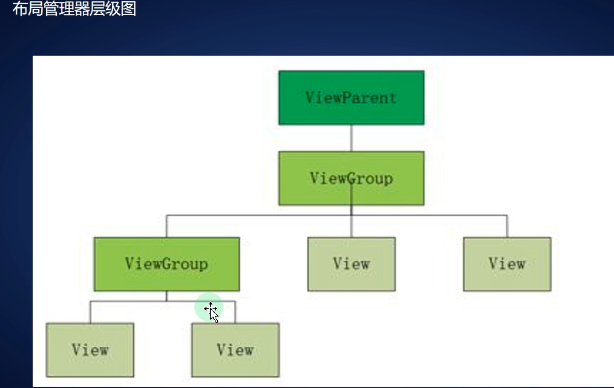
每一个ViewGroup都可以嵌套其他的ViewGroup和View (视图) 。一个ViewGroup的大小是相对的，它即可以是其他ViewGroup的父容器，也可以是其他ViewGroup的子容器。在Android中，ViewGroup指代的是布局管理器，也 就是下面要讲的布局样式，View指代的是布局管理器中的一个个控件。在Android中， 控件可以在XML文件中定义，也可以程序员根据自己的需要去定义一个类。

## 线性布局使用最多

会将容器内所有的控件一个一个挨着的排列

(1) 排列方向

 属性:android:orienation="horizontal/vertical"

水平排列和垂直排列      Android中默认为垂直排列

(2)对齐方式

  控制元素(例如文字)在该控件里的显示位置 可选属性值 可选的值有 top 、bottom等

刚开始是这样 还是相对布局，这个就是相对布局 我们移动控件看一下 所有控件相对不变，但是整体的位置变 了，

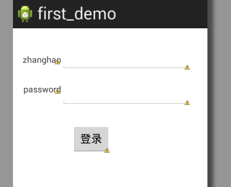

​	将第一行和最后一行的relativelayout改为LinearLayout就是线性布局了，

然后我们在箭头指的位置添加一行 android:orientation="vertical"

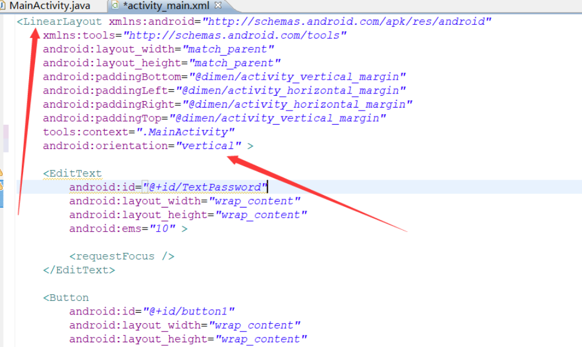

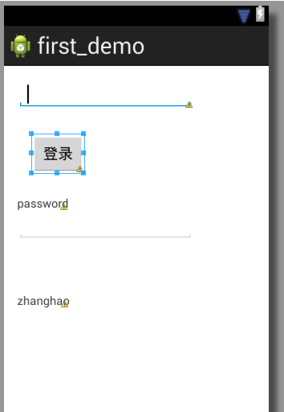

线性布局默认是横向布局，属性为horizontal，我们将他属性修改为vertical之后就变成垂直了，

 android:layout_width ，怎么弹出来这三个属性呢，在双引号里按住alt+/ 

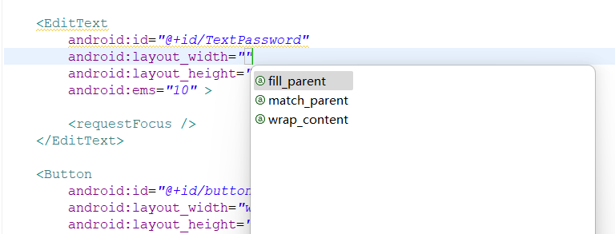

这三个属性自己百度一下

颜色的属性 

android:background=""  //颜色自己查

​	

那么我们现在想要实现这样一幅图

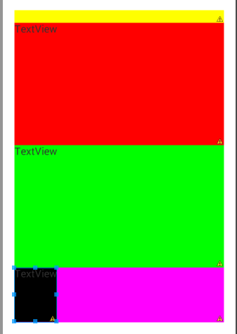

这是源码

```xml
<LinearLayout 
    xmlns:android="http://schemas.android.com/apk/res/android"
    xmlns:tools="http://schemas.android.com/tools"
    android:layout_width="match_parent"
    android:layout_height="match_parent"
    android:orientation="vertical"
    android:paddingBottom="@dimen/activity_vertical_margin"
    android:paddingLeft="@dimen/activity_horizontal_margin"
    android:paddingRight="@dimen/activity_horizontal_margin"
    android:paddingTop="@dimen/activity_vertical_margin"
    tools:context=".MainActivity" >

 

    <TextView
        android:id="@+id/textView3"
        android:layout_width="fill_parent"
        android:layout_height="wrap_content"
        android:background="#FF0"
        android:text=" " />

    <LinearLayout
      
        android:id="@+id/textView2"
        android:layout_width="match_parent"
        android:layout_height="match_parent"
        android:layout_weight="0.38"
        android:background="#FF0F"
        android:orientation="vertical"
        android:text=" " >

        <TextView
            android:id="@+id/textView4"
            android:layout_width="match_parent"
            android:layout_height="wrap_content"
            android:layout_weight="0.99"
            android:background="#FF0000"
            android:text="TextView" />

        <TextView
            android:id="@+id/textView5"
            android:layout_width="match_parent"
            android:layout_height="wrap_content"
            android:layout_weight="0.99"
             android:background="#00FF00"
            android:text="TextView" />

        <TextView
            android:id="@+id/textView6"
            android:layout_width="wrap_content"
            android:layout_height="wrap_content"
            android:layout_weight="0.38"
            android:background="#000000"
            android:text="TextView" />
        
   
        
                
    </LinearLayout>


   
</LinearLayout>
```

练一练 就会了 最好自己在多加点布局 手动 细分一下  每个控件的每个属性都要注意

## 相对布局

相对于父控件 相对于同个等级的控件进行布局

### 相对于父控件的布局

android:layout_alignParentLeft="true" 父容器左边
android:layout_alignParentRight="true" 父容器右边
android:layout_alignParentTop="true" 父容器顶部
android:layout_alignParentBottom="true" 父容器底部
android:layout_centerHorizontal="true" 水平方向居中
android:layout_centerVertical="true" 垂直方向居中
android:layout_centerInParent="true" 水平垂直都居中

### 相对于子控件的布局

android:layout_toLeftOf="@+id/button1" 在button1控件左方

android:layout_toRightOf="@+id/button1" 在button1控件右方

android:layout_above="@+id/button1" 在button1控件上方

android:layout_below="@+id/button1" 在button1控件下方

android:layout_alignLeft="@+id/button1" 与button1控件左边平齐

android:layout_alignRight="@+id/button1" 与button1控件右边平齐

android:layout_alignTop="@+id/button1" 与button1控件上边平齐

android:layout_alignBottom="@+id/button1" 与button1控件下边平齐

自己操作一下

# Android 应用程序组件

应用程序组件是一个Android应用程序的基本构建块。这些组件由应用清单文件松耦合的组织。AndroidManifest.xml描述了应用程序的每个组件，以及他们如何交互。

以下是可以在Android应用程序中使用的四个主要组件。

| 组件                | 描述                                      |
| ------------------- | ----------------------------------------- |
| Activities          | 描述UI，并且处理用户与机器屏幕的交互。    |
| Services            | 处理与应用程序关联的后台操作。            |
| Broadcast Receivers | 处理Android操作系统和应用程序之间的通信。 |
| Content Providers   | 处理数据和数据库管理方面的问题。          |

# Activities

一个活动标识一个具有用户界面的单一屏幕。就是一个活动一个界面

举个例子，一个邮件应用程序可以包含一个活动用于显示新邮件列表，另一个活动用来编写邮件，再一个活动来阅读邮件。当应用程序拥有多于一个活动，其中的一个会被标记为当应用程序启动的时候显示。


一个活动是**Activity**类的一个子类，如下所示：

```
public class MainActivity extends Activity {

}
```

Activity 类定义了下面的回调。你可以不用实现所有的回调方法。但了解其中的每一个非常的重要，实现这些可以保证你的应用行为如用户所期望的那样。

| 回调        | 描述                                                         |
| ----------- | ------------------------------------------------------------ |
| onCreate()  | 这是第一个回调，在活动第一次创建时调用                       |
| onStart()   | 这个回调在活动为用户可见时被调用                             |
| onResume()  | 这个回调在应用程序与用户开始可交互的时候调用                 |
| onPause()   | 被暂停的活动无法接受用户输入，不能执行任何代码。当前活动将要被暂停，上一个活动将要被恢复时调用 |
| onStop()    | 当活动不在可见时调用                                         |
| onDestroy() | 当活动被系统销毁之前调用                                     |
| onRestart() | 当活动被停止以后重新打开时调用                               |

# Services(服务)

服务是运行在后台，执行长时间操作的组件。

举个例子，服务可以是用户在使用不同的程序时在后台播放音乐，或者在活动中通过网络获取数据但不阻塞用户交互。

一个服务是**Service**类的子类，如下所示：

```
public class MyService extends Service {
}
```

| Started | Android的应用程序组件，如活动，通过startService()启动了服务，则服务是Started状态。一旦启动，服务可以在后台无限期运行，即使启动它的组件已经被销毁。 |
| ------- | ------------------------------------------------------------ |
| Bound   | 当Android的应用程序组件通过bindService()绑定了服务，则服务是Bound状态。  Bound状态的服务提供了一个客户服务器接口来允许组件与服务进行交互，如发送请求，获取结果，甚至通过IPC来进行跨进程通信。 |

# Broadcast Receivers

广播接收器简单地响应从其他应用程序或者系统发来的广播消息。举个例子，应用程序可以发起广播来让其他应用程序知道一些数据已经被下载到设备，并且可以供他们使用。因此广播接收器会拦截这些通信并采取适当的行动。

广播接收器是**BroadcastReceiver**类的一个子类，每个消息以**Intent**对象的形式来广播。

```
public class MyReceiver  extends  BroadcastReceiver {

}
```

# Content Providers

内容提供者组件通过请求从一个应用程序到另一个应用程序提供数据。这些请求由**ContentResolver**类的方法来处理。这些数据可以是存储在文件系统、数据库或者其他其他地方。

内容提供者是**ContentProvider**类的子类，并实现一套标准的API，以便其他应用程序来执行事务。

```
public class MyContentProvider extends  ContentProvider {

}
```

# Intent( 意图)

Android 意图(Intent)是一个要执行操作的抽象描述，是 Android 四大组件间之间的枢纽，通信的桥梁，比如可以通过：

    startActivity(Intent)、startActivityForResult(Intent)：启动一个Activity
    startService(Intent)、bindService(Intent)：启动一个Service
    sendBroadcast：发送广播到指定 BroadcastReceiver
假如现在需要在 Android 设备上通过浏览器打开一个 URL 地址，则可以发送 ACTION_WEB_SEARCH 意图到 Android 意图处理器来在浏览器中打开给定的 URL 。

意图处理器通过解析一系列活动，并选择最适合本意图的活动(本例中为 Web 浏览器)，意图处理器将传递设置好的网页地址到 Web 浏览器，并打开 Web 浏览器活动，代码如下所示：

```
String q = "https://www.baidu.com";
Intent intent = new Intent(Intent.ACTION_WEB_SEARCH);
intent.putExtra(SearchManager.QUERY, q);
startActivity(intent);
```


上面几行代码只是一个简单的例子，后面会逐一说明其中的作用，Intent(意图)是 Android 开发至关重要的一个点，必须重点掌握。
public class Intent implements Parcelable, Cloneable{ 位于 android.content 包，常用构造器如下：

```
public Intent()
public Intent(String action) 
public Intent(String action, Uri uri)
```

## intent对象

意图对象是一包的信息，用于组件接收到的意图就像 Android 系统接受到的信息。

意图对象包括如下的组件，具体取决于要通信或者执行什么。

### 动作(Action)

这是意图对象中必须的部分，被表现为一个字符串。在广播的意图中，动作一旦发生，将会被报告。动作将很大程度上决定意图的其他部分如何被组织。Intent 类定义了一系列动作常量对应不同的意图。

意图对象中的动作可以通过 setAction() 方法来设置，通过 getAction() 方法来读取。

### 数据(Data)

添加数据规格到意图过滤器。这个规格可以只是一个数据类型(如元类型属性)，一条 URI ，或者同时包括数据类型和 URI 。 URI 则由不同部分的属性来指定。

这些指定 URL 格式的属性是可选的，但是也相互独立 -

- 如果意图过滤器没有指定模式，所有其他的 URI 属性将被忽略。
- 如果没有为过滤器指定主机，端口属性和所有路径属性将被忽略。

setData() 方法只能以 URI 来指定数据，setType() 只能以元类型指定数据，setDataAndType() 可以同时指定 URI 和元类型。URI 通过 getData() 读取，类型通过 getType() 读取。

以下是动作/数据组的一些实例 

| 序号 | 动作/数据组和描述                                            |
| ---- | ------------------------------------------------------------ |
| 1    | ACTION_VIEW content://contacts/people/1：显示ID为1的用户的信息。 |
| 2    | ACTION_DIAL content://contacts/people/1：显示电话拨号器，并填充用户1的数据。 |
| 3    | ACTION_VIEW tel:123：显示电话拨号器，并填充给定的号码。      |
| 4    | ACTION_DIAL tel:123：显示电话拨号器，并填充给定的号码。      |
| 5    | ACTION_EDIT content://contacts/people/1：编辑ID为1的用户信息。 |
| 6    | ACTION_VIEW content://contacts/people/：显示用户列表，以便查看。 |
| 7    | ACTION_SET_WALLPAPER：显示选择壁纸设置。                     |
| 8    | ACTION_SYNC：同步数据，默认的值为：android.intent.action.SYNC |
| 9    | ACTION_SYSTEM_TUTORIAL：开启平台定义的教程（默认教程或者启动教程） |
| 10   | ACTION_TIMEZONE_CHANGED：当时区被改变时通知                  |
| 11   | ACTION_UNINSTALL_PACKAGE：运行默认的卸载器                   |

### 类别

类别是意图中可选的部分，是一个字符串，包含该类型组件需要处理的意图的附加信息。addCategory()  方法为意图对象添加类别，removeCategory() 方法删除之前添加的类别，getCategories()  获取所有被设置到意图对象中的类别。这里是[Android意图标准类别](https://www.runoob.com/android/android-intents-filters.html)列表。

可以查看下面章节中的意图过滤器来了解我们如何使用类别来通过对应的意图选择合适的活动。

### 附加数据

这是传递给需要处理意图的组件的以键值对描述的附加信息。通过 putExtras() 方法设置，getExtras() 方法读取

### 标记

这些标记是意图的可选部分，说明Android系统如何来启动活动，启动后如何处理等。

| 序号 | 标记和说明                                                   |
| ---- | ------------------------------------------------------------ |
| 1    | FLAG_ACTIVITY_CLEAR_TASK :如果在意图中设置，并通过 Context.startActivity  传递，这个标记将导致与该活动相关联的所有已存在的任务在活动启动前被清空。活动将成为一个空任务的根，所有旧的活动被结束。该标记可以与  FLAG_ACTIVITY_NEW_TASK 结合使用。 |
| 2    | FLAG_ACTIVITY_CLEAR_TOP :如果设置该标记，活动将在当前运行的任务中被启动。这并不会启动一个新的活动实例，所有的在它之上的活动被关闭，这个意图作为一个新的意图被传递到已有的（目前在顶部的）活动。 |
| 3    | FLAG_ACTIVITY_NEW_TASK :这个标记一般用于使得活动用于"启动器"风格的行为：为用户提供一个可以独立完成运行的数据，并启动完整儿独立的活动。 |

### 组件名称

组件名称对象是一个可选的域，代表活动、服务或者广播接收器类。如果设置，则意图对象被传递到实现设计好的类的实例，否则，Android  使用其他意图中的其他信息来定位一个合适的目标。组件名称通过 setComponent()，setClass()或者 setClassName() 来设置，通过 getComponent() 获取。

## Intent种类

### 显式Intent

即直接指定需要打开的activity对应的类。显式Intent通过Component可以直接设置需要调用的Activity类，可以唯一确定一个Activity，意图特别明确，所以是显式的。

设置这个类的方式可以是Class对象，也可以是包名加类名的字符串。

假设你需要连接一个活动到另外一个活动，我们可以通过显示意图，

这些意图通过名称指定目标组件，一般用于应用程序内部信息 - 比如一个活动启动一个下属活动或者启动一个兄弟活动。举个例子：

```
// 通过指定类名的显式意图
Intent i = new Intent(FirstActivity.this, SecondAcitivity.class);

// 启动目标活动
startActivity(i);
```

自己写例子

```java
mainactivity.java
package com.example.inter;

import android.net.Uri;
import android.os.Bundle;
import android.app.Activity;
import android.content.Intent;

import android.view.MenuItem;
import android.view.View;
import android.widget.Button;

public class MainActivity extends Activity {
	 Button b1,b2;

    @Override
    protected void onCreate(Bundle savedInstanceState) {
        super.onCreate(savedInstanceState);
        setContentView(R.layout.activity_main); //绑定界面布局
        
        b1=(Button)findViewById(R.id.button); //绑定控件
        b1.setOnClickListener(new View.OnClickListener() {
        	//并添加代码定义两个监听器来对应两个按钮"启动浏览器"和"启动电话"
            @Override
            public void onClick(View v) {
                // 这里我们使用显式意图 所以指明是哪个组件
                Intent i = new Intent(android.content.Intent.ACTION_VIEW, Uri.parse("https://www.runoob.com"));
                //intent里面第一个是本类，第二个参数是跳转类
                startActivity(i); //使用startActivity去跳转
            }
        });

        b2=(Button)findViewById(R.id.button2);
        b2.setOnClickListener(new View.OnClickListener() {
            @Override
            public void onClick(View v) {
                Intent i = new Intent(android.content.Intent.ACTION_VIEW,Uri.parse("tel:9510300000"));
                startActivity(i);
            }
        });
    }

    @Override
    public boolean onOptionsItemSelected(MenuItem item) {
        // Handle action bar item clicks here. The action bar will
        // automatically handle clicks on the Home/Up button, so long
        // as you specify a parent activity in AndroidManifest.xml.

        int id = item.getItemId();

        
        if (id == R.id.action_settings) {
            return true;
        }
        return super.onOptionsItemSelected(item);
    }
 
    
}


```

```java
activit_main.xml
<RelativeLayout xmlns:android="http://schemas.android.com/apk/res/android"
    xmlns:tools="http://schemas.android.com/tools"
    android:layout_width="match_parent"
    android:layout_height="match_parent"
    android:paddingBottom="@dimen/activity_vertical_margin"
    android:paddingLeft="@dimen/activity_horizontal_margin"
    android:paddingRight="@dimen/activity_horizontal_margin"
    android:paddingTop="@dimen/activity_vertical_margin"
    tools:context=".MainActivity" >

    <TextView
        android:id="@+id/textView1"
        android:layout_width="wrap_content"
        android:layout_height="wrap_content"
        android:layout_alignParentTop="true"
        android:layout_centerHorizontal="true"
        android:text="意图实例"
        android:textSize="30dp" />

    <EditText
        android:id="@+id/editText"
        android:layout_width="wrap_content"
        android:layout_height="wrap_content"
        android:layout_alignEnd="@+id/imageButton"
        android:layout_alignRight="@+id/imageButton"
        android:layout_below="@+id/imageButton" />

    <ImageButton
        android:id="@+id/imageButton"
        android:layout_width="wrap_content"
        android:layout_height="wrap_content"
        android:layout_alignLeft="@+id/textView1"
        android:layout_below="@+id/textView1"
        android:src="@drawable/ic_launcher" />

    <Button
        android:id="@+id/button2"
        android:layout_width="wrap_content"
        android:layout_height="wrap_content"
        android:layout_alignLeft="@+id/button"
        android:layout_alignStart="@+id/button"
        android:layout_centerVertical="true"
        android:text="启动电话" />

    <Button
        android:id="@+id/button"
        android:layout_width="wrap_content"
        android:layout_height="wrap_content"
        android:layout_alignEnd="@+id/textView1"
        android:layout_alignLeft="@+id/imageButton"
        android:layout_alignStart="@+id/imageButton"
        android:layout_alignTop="@+id/editText"
        android:layout_marginTop="15dp"
        android:text="启动浏览器" />

</RelativeLayout>
```


### 隐式Intent

不明确指定启动哪个Activity，而是设置Action、Data、Category，让系统来筛选出合适的Activity。筛选是根据所有的来筛选。

这些意图没有为目标命名，组件名称的域为空。隐式意图经常用于激活其他应用程序的组件。举个例子：

```java
Intent read1=new Intent();
read1.setAction(android.content.Intent.ACTION_VIEW);
read1.setData(ContactsContract.Contacts.CONTENT_URI);
startActivity(read1);
```


两者的使用区别

>  显式意图一般在**应用的内部使用**，因为在应用内部已经知道了组件的名称，直接调用就可以了。
>
> 当一个应用要激活另一个应用中的Activity时，只能使用隐式意图，根据Activity配置的意图过滤器建一个意图，让意图中的各项参数的值都跟过滤器匹配，这样就可以激活其他应用中的Activity。所以，隐式意图是在**应用与应用之间**使用的。


