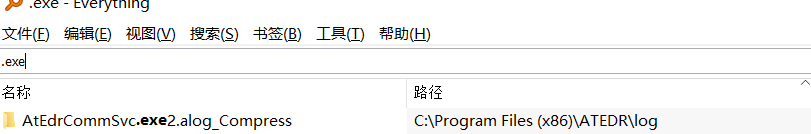
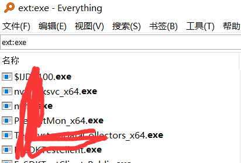
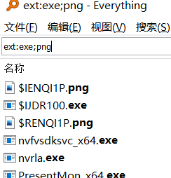
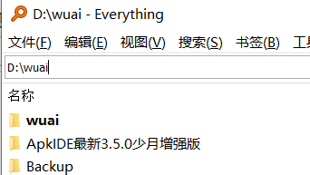
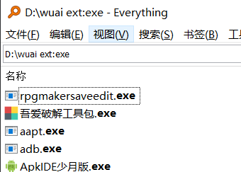
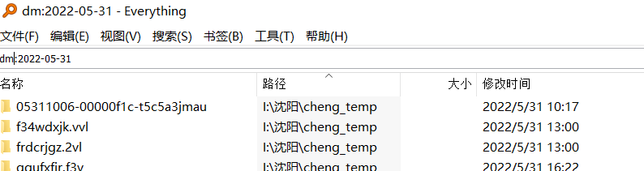
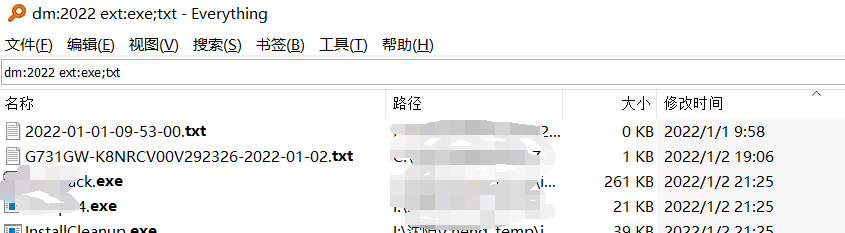

# 简介

平时我们应急的时候，要找到病毒相关的文件，此时everthing就是一个不错的选项，它可以帮助我们准确的命中我们想要的文件

# 目标后缀

我们要想搜exe后缀直接在搜索里输入.exe即可

就像这样,但是你又会发现并不是只有后缀，他把包含的有.exe都输出来了

加入ext:就能定位后缀你也可以同时搜索.exe或者.png后缀就像这样，或者搜更多往后加分号就行了

那么再想一下，搜某一文件夹下的exe呢？

举例：“D:\wuai”即d盘下的某一文件夹里的全部文件

再搜索这里面的exe文件，不要包含exe我们只要exe后缀

也可以不用ext，直接D:\wuai exe:，这里有个空格，这个空格代表的是&&操作，就是与，那问题来了，找寻带有空格的文件怎么弄，那就在你要搜索的文件名两边加双引号，凑成一个整体，这里还有一些操作符

|：或 (OR)

!：非 (NOT)

*：匹配 0 个或多个字符，一个*和多个*效果一样

?：匹配 1 个字符，如“t?”只会搜索第一个字母为“t”，且只有两个字母的文件或文件夹，文件包括尾缀

exe:  不仅仅是exe后缀，他表示的是可执行文件，其他后缀也一样

audio:搜索音频文件

zip:搜索压缩文件

doc:搜索文档文件

pic:搜索图片文件，不包括webp等文件

video:搜索视频文件

再分析病毒的时候直接定位关键目录，当然病毒也不一定是exe，病毒种类与手法也有很多种

# 时间

当我们定位到病毒进入到我们机器前后时间，

​	dm:<date>	搜索指定修改日期的文件和文件夹.

但是我们打开之后就很多，我们先去看看目标时间有没有exe或者txt落地，再点击修改时间，可以看到从2022年开始的所有修改过的exe或者txt都显示出来了

## 命令大全

file:仅匹配文件

folder:	仅匹配文件夹

child:<filename>	搜索包含匹配文件名文件的文件夹

childcount:<count>	搜索包含有指定数目**子文件夹或文件**的文件夹

childfilecount:<count>	搜索包含有指定数目**子文件**（不考虑文件夹）的文件夹

childfoldercount:<n>	搜索包含有指定数目**子文件夹**的文件夹

如搜索空文件夹，使用“childcount:0”，也可直接用“empty:”

size:<size>：搜索指定大小的文件 (以字节为单位).如“size:1024”即1024字节

size:10KB：搜索大小为10KB的文件

size:10MB：搜索大小为10MB的文件

size:10GB：搜索大小为10GB的文件

size:1MB-5MB：搜索大小为1MB至5MB的文件

size:常数

​		常数：

​		empty

​		tiny	0 KB < 大小 <= 10 KB

​		small	10 KB < 大小 <= 100 KB

​		medium	100 KB < 大小 <= 1 MB

​		large	1 MB < 大小 <= 16 MB

​		huge	16 MB < 大小 <= 128 MB

​		gigantic	大小 > 128 MB

​		unknown

filelist:sample1|sample2|sample3：搜索包含任一指定文件名的文件或文件夹，竖线隔开

infolder:path：搜索指定路径下第一层的文件和文件夹，不包括子文件夹里面的内容

parents:数目：搜索有指定层数父路径的文件或文件夹，比如为0的话，就只有CDEFG...盘符

还有一些语法需要查询文件的内容或属性，访问速度很慢：

比如：orientation:<type>：搜索指定方向的图片 (水平或竖直)

content:<text>：搜索文本内容等等

**完整语法如下：**

操作符: 

​	space	与 (AND)

​	|	或 (OR)

​	!	非 (NOT)

​	< >	分组

​	" "	搜索引号内的词组.

通配符: 

​	*	匹配 0 个或多个字符.

​	?	匹配 1 个字符.

宏: 

​	quot:	双引号 (")

​	apos:	单引号 (')

​	amp:	与号 (&)

​	lt:	小于 (<)

​	gt:	大于 (>)

​	audio:	搜索音频文件.

​	zip:	搜索压缩文件.

​	doc:	搜索文档文件.

​	exe:	搜索可执行文件.

​	pic:	搜索图片文件.

​	video:	搜索视频文件.

修饰符: 

​	ascii:	启用快速 ASCII 大小写对比.

​	case:	区分大小写.

​	diacritics:	匹配变音标记.

​	file:	仅匹配文件.

​	folder:	仅匹配文件夹.

​	noascii:	禁用快速 ASCII 大小写对比.

​	nocase:	不区分大小写.

​	nodiacritics:	不匹配变音标记.

​	nofileonly:	仅不允许文件.

​	nofolderonly:	仅不允许文件夹.

​	nopath:	不匹配路径.

​	noregex:	禁用正则表达式.

​	nowfn:	不匹配完整文件名.

​	nowholefilename:	不匹配完整文件名.

​	nowholeword:	仅禁用全字匹配.

​	nowildcards:	禁用通配符.

​	noww:	仅禁用全字匹配.

​	path:	匹配路径和文件名.

​	regex:	启用正则表达式.

​	utf8:	禁用快速 ASCII 大小写对比.

​	wfn:	匹配完整文件名.

​	wholefilename:	匹配完整文件名.

​	wholeword:	仅匹配全字符.

​	wildcards:	启用通配符.

​	ww:	仅全字匹配.

### 日期相关

​	dateaccessed:<date>	搜索指定访问时间的文件和文件夹.

​	datecreated:<date>	搜索指定创建日期的文件和文件夹.

​	datemodified:<date>	搜索指定修改日期的文件和文件夹.

​	daterun:<date>	搜索指定打开时间的文件和文件夹.

​	da:<date>	搜索指定访问时间的文件和文件夹.

​	rc:<date>	搜索指定最近修改日期的文件和文件夹.

 	dc:<date>	搜索指定创建日期的文件和文件夹.

函数: 

​	album:<text>	搜索媒体专辑元数据.

​	ansicontent:<text>	搜索 ANSI 格式文本内容.

​	artist:<text>	搜索媒体艺术家元数据.

​	attrib:<attributes>	搜索指定的文件属性的文件和文件夹.

​	attribdupe:	搜索含有相同属性的文件和文件夹.

​	attributes:<attributes>	搜索指定的文件属性的文件和文件夹.

​	bitdepth:<bitdepth>	搜索指定像素密度的图片.

​	child:<filename>	搜索包含匹配文件名文件的文件夹.

​	childcount:<count>	搜索包含有指定数目子文件夹或文件的文件夹.

​	childfilecount:<count>	搜索包含有指定数目子文件的文件夹.

​	childfoldercount:<n>	搜索包含有指定数目子文件夹的文件夹.

​	comment:<text>	搜索媒体注释元数据.

​	content:<text>	搜索文本内容.

​	count:<max>	指定搜索结果最大值.

​	dadupe:	搜索含有相同访问时间的文件和文件夹.

​	dcdupe:	搜索含有相同创建时间的文件和文件夹.

​	dimensions:<w>X<h>	搜索指定长宽的图片.

​	dmdupe:	搜索含有相同修改时间的文件和文件夹.

​	dr:<date>	搜索指定打开时间的文件和文件夹.

​	dupe:	搜索重复的文件名.

​	empty:	搜索空文件夹.

​	endwith:<text>	搜索以指定文本结尾的文件 (包含扩展名).

​	ext:<ext1;ext2;...>	搜索和列表中指定的扩展名匹配的文件 (扩展名以分号分隔).

​	filelist:<fn1|fn2|...>	搜索文件名列表中的文件.

​	filelistfilename:<name>	搜索文件名列表中的文件和文件夹.

​	frn:<frn>	搜索指定文件索引号的文件和文件夹.

​	fsi:<index>	搜索指定盘符索引中文件或文件夹 (索引 0 表示 C 盘, 以此类推).

​	genre:<text>	搜索媒体流派元数据.

​	height:<height>	搜索指定像素高度的图片.

​	infolder:<path>	搜索指定路径下的文件和文件夹 (不包含子文件夹).

​	len:<length>	搜索和指定的文件名长度相匹配的文件和文件夹.

​	namepartdupe:	搜索含有相同名称部分的文件和文件夹.

​	orientation:<type>	搜索指定方向的图片 (水平或竖直).

​	parent:<path>	搜索指定路径下的文件和文件夹 (不包含子文件夹).

​	parents:<count>	搜索有指定数目父文件夹的文件和文件夹.

​	

​	recentchange:<date>	搜索指定最近修改日期的文件和文件夹.

​	root:	搜索没有父文件夹的文件和文件夹.

​	runcount:<count>	搜索指定打开次数的文件和文件夹.

​	shell:<name>	搜索已知的 Shell 文件夹名称, 包括子目录和文件.

​	size:<size>	搜索指定大小的文件 (以字节为单位).

​	sizedupe:	搜索大小重复的文件.

​	startwith:<text>	搜索指定文本开头的文件.

​	title:<text>	搜索媒体标题元数据.

​	track:<number>	搜索指定音轨号的媒体文件.

​	type:<type>	搜索指定的文件类型的文件和文件夹.

​	utf16content:<text>	搜索 UTF-16 格式文本内容.

​	utf16becontent:<text>	搜索 UTF-16 BE 格式文本内容.

​	utf8content:<text>	搜索 UTF-8 格式文本内容.

​	width:<width>	搜索指定像素宽度的图片.

函数语法: 

​	function:value	等于某设定值.

​	function:<=value	小于等于某设定值.

​	function:<value	小于某设定值.

​	function:=value	等于某设定值.

​	function:>value	大于某设定值.

​	function:>=value	大于等于某设定值.

​	function:start..end	在起始值和终止值的范围内.

​	function:start-end	在起始值和终止值的范围内.

大小语法: 

​	size[kb|mb|gb]

大小常数: 

​	empty

​	tiny	0 KB < 大小 <= 10 KB

​	small	10 KB < 大小 <= 100 KB

​	medium	100 KB < 大小 <= 1 MB

​	large	1 MB < 大小 <= 16 MB

​	huge	16 MB < 大小 <= 128 MB

​	gigantic	大小 > 128 MB

​	unknown

属性常数: 

​	A	存档

​	C	压缩

​	D	目录

​	E	加密

​	H	隐藏

​	I	未索引的内容

​	L	重解析点

​	N	一般

​	O	离线

​	P	稀疏文件

​	R	只读

​	S	系统

​	T	临时

​	V	设备

year

​	month/year 或者 year/month 取决于本地设置

​	day/month/year, month/day/year 或者 year/month/day 取决于本地设置

​	YYYY[-MM[-DD[Thh[:mm[:ss[.sss]]]]]]

​	YYYYMM[DD[Thh[mm[ss[.sss]]]]]

日期常数: 

​	today

​	yesterday

​	tomorrow

​	<last|past|prev|current|this|coming|next><year|month|week>

​	<last|past|prev|coming|next><x><years|months|weeks|days|hours|minutes|mins|seconds|secs>

​	january|february|march|april|may|june|july|august|september|october|november|december

​	jan|feb|mar|apr|may|jun|jul|aug|sep|oct|nov|dec

​	sunday|monday|tuesday|wednesday|thursday|friday|saturday

​	sun|mon|tue|wed|thu|fri|sat

​	unknown

**常用选项：**

区分大小写：搜索 – 区分大小写（Ctrl+I）
