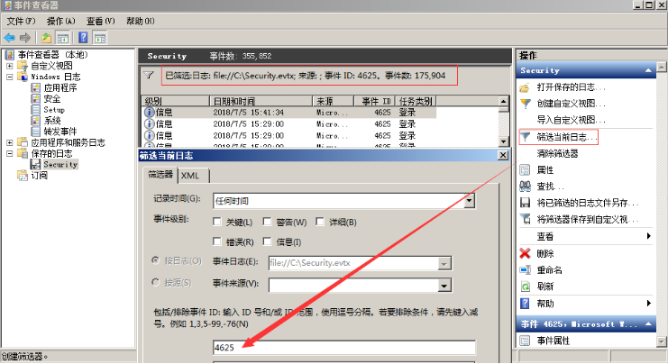

## **0x01 Window事件日志简介**

Windows系统日志是记录系统中硬件、软件和系统问题的信息，同时还可以监视系统中发生的事件。用户可以通过它来检查错误发生的原因，或者寻找受到攻击时攻击者留下的痕迹。

Windows主要有以下三类日志记录系统事件：应用程序日志、系统日志和安全日志。

系统日志 

记录操作系统组件产生的事件，主要包括驱动程序、系统组件和应用软件的崩溃以及数据丢失错误等。系统日志中记录的时间类型由Windows NT/2000操作系统预先定义。

默认位置：%SystemRoot%\System32\Winevt\Logs\System.evtx

应用程序日志

包含由应用程序或系统程序记录的事件，主要记录程序运行方面的事件，例如数据库程序可以在应用程序日志中记录文件错误，程序开发人员可以自行决定监视哪些事件。如果某个应用程序出现崩溃情况，那么我们可以从程序事件日志中找到相应的记录，也许会有助于你解决问题。

默认位置：%SystemRoot%\System32\Winevt\Logs\Application.evtx

安全日志

记录系统的安全审计事件，包含各种类型的登录日志、对象访问日志、进程追踪日志、特权使用、帐号管理、策略变更、系统事件。安全日志也是调查取证中最常用到的日志。默认设置下，安全性日志是关闭的，管理员可以使用组策略来启动安全性日志，或者在注册表中设置审核策略，以便当安全性日志满后使系统停止响应。

默认位置：%SystemRoot%\System32\Winevt\Logs\Security.evtx

系统和应用程序日志存储着故障排除信息，对于系统管理员更为有用。安全日志记录着事件审计信息，包括用户验证（登录、远程访问等）和特定用户在认证后对系统做了什么，对于调查人员而言，更有帮助。

## 0X02 审核策略与事件查看器

Windows Server 2008 R2 系统的审核功能在默认状态下并没有启用 ，建议开启审核策略，若日后系统出现故障、安全事故则可以查看系统的日志文件，排除故障，追查入侵者的信息等。

PS：默认状态下，也会记录一些简单的日志，日志默认大小20M

**设置1**：开始 → 管理工具 → 本地安全策略 → 本地策略 → 审核策略，参考配置操作：

**设置2**：设置合理的日志属性，即日志最大大小、事件覆盖阀值等：

**查看系统日志方法：**

1. 在**“开始”**菜单上，依次指向**“所有程序”**、**“管理工具”**，然后单击**“事件查看器”**
2. 按 "**Window+R**"，输入 ”**eventvwr.msc**“ 也可以直接进入“**事件查看器**”

##  3.事件日志分析

对于Windows事件日志分析，不同的EVENT ID代表了不同的意义，摘录一些常见的安全事件的说明：

| **事件ID** | **说明**                         |
| ---------- | -------------------------------- |
| 4624       | 登录成功                         |
| 4625       | 登录失败                         |
| 4634       | 注销成功                         |
| 4647       | 用户启动的注销                   |
| 4672       | 使用超级用户（如管理员）进行登录 |
| 4720       | 创建用户                         |

每个成功登录的事件都会标记一个登录类型，不同登录类型代表不同的方式：

| **登录类型** | **描述**                        | **说明**                                         |
| ------------ | ------------------------------- | ------------------------------------------------ |
| 2            | 交互式登录（Interactive）       | 用户在本地进行登录。                             |
| 3            | 网络（Network）                 | 最常见的情况就是连接到共享文件夹或共享打印机时。 |
| 4            | 批处理（Batch）                 | 通常表明某计划任务启动。                         |
| 5            | 服务（Service）                 | 每种服务都被配置在某个特定的用户账号下运行。     |
| 7            | 解锁（Unlock）                  | 屏保解锁。                                       |
| 8            | 网络明文（NetworkCleartext）    | 登录的密码在网络上是通过明文传输的，如FTP。      |
| 9            | 新凭证（NewCredentials）        | 使用带/Netonly参数的RUNAS命令运行一个程序。      |
| 10           | 远程交互，（RemoteInteractive） | 通过终端服务、远程桌面或远程协助访问计算机。     |
| 11           | 缓存交互（CachedInteractive）   | 以一个域用户登录而又没有域控制器可用             |

案例1：可以利用eventlog事件来查看系统账号登录情况：

1. 在**“开始”**菜单上，依次指向**“所有程序”**、**“管理工具”**，然后单击**“事件查看器”**；
2. 在事件查看器中，单击**“安全”**，查看安全日志；
3. 在安全日志右侧操作中，点击**“筛选当前日志”**，输入事件ID进行筛选。

4624 --登录成功
4625 --登录失败
4634 -- 注销成功 4647 -- 用户启动的注销
4672 -- 使用超级用户（如管理员）进行登录

我们输入事件ID：4625进行日志筛选，发现事件ID：4625，事件数175904，即用户登录失败了175904次，那么这台服务器管理员账号可能遭遇了暴力猜解。

案例2：可以利用eventlog事件来查看计算机开关机的记录：

1、在**“开始”**菜单上，依次指向**“所有程序”**、**“管理工具”**，然后单击**“事件查看器”**；

2、在事件查看器中，单击**“系统”**，查看系统日志；

3、在系统日志右侧操作中，点击**“筛选当前日志”**，输入事件ID进行筛选。

其中事件ID 6006 ID6005、 ID 6009就表示不同状态的机器的情况（开关机）。

6005 信息 EventLog 事件日志服务已启动。(开机) 6006 信息 EventLog 事件日志服务已停止。(关机) 6009 信息 EventLog 按ctrl、alt、delete键(非正常)关机我们输入事件ID：6005-6006进行日志筛选，发现了两条在2018/7/6 17:53:51左右的记录，也就是我刚才对系统进行重启的时间。

https://www.bilibili.com/video/BV1Z3411x7Qx?from=search&seid=17906058842620930472&spm_id_from=333.337.0.0
https://www.bilibili.com/video/BV1SK411A7EX?spm_id_from=333.999.0.0
https://search.bilibili.com/all?keyword=%E5%BA%94%E6%80%A5%E5%93%8D%E5%BA%94%E6%BA%AF%E6%BA%90&from_source=websuggest_search
