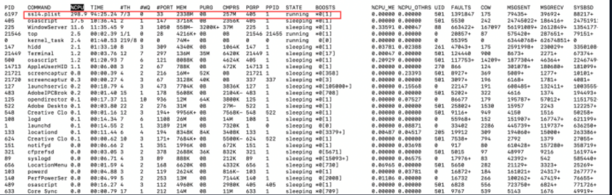
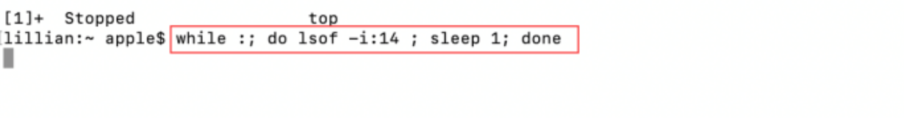
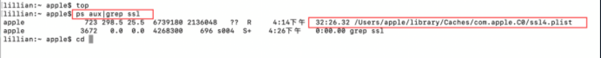
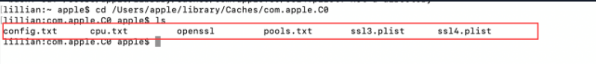
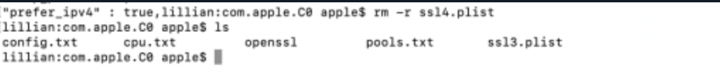
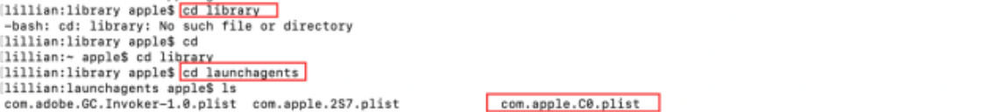
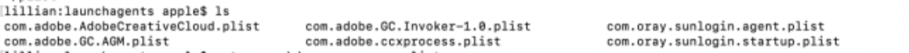
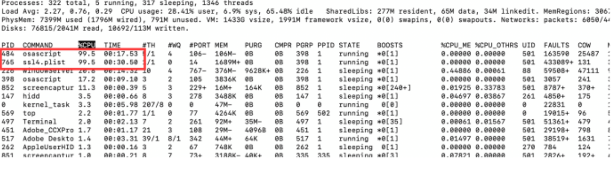

# Mac系统应急响应—ssl4.plist挖矿病毒

和老师进行初步沟通，简单了解了木马病毒的几个信息

1. 这可能是一个OSAMiner家族的挖矿病毒软件
2. 这个病毒软件每次利用本机外连的端口是不一样的
3. 这个木马软件外连时间是不定时的，最快的时候每隔三秒进行外连一次，最慢的时候每隔13分钟外连一次，并且开始时间不固定（可能是每次开机就开始外连一次到数次）

根据以往的经验，windows版本应急可以先使用火绒进行扫描，mac系统可以使用安全趋势大师进行扫描，这里我们看到了扫描出了ssl4.plist这个病毒，这是一个挖矿病毒。

因为这里删除需要会员，并且只是删除这个病毒没法删除干净，病毒重启后会重新下载所以就不使用这个软件删除

使用top命令查看了一下他的系统性能和占用情况，我们可以看到仅仅ssl4.plist这个程序就占用了298%的cpu，现在就能确定这个ssl4.plist就是我们要应急的病毒

感染挖矿病毒的影响：

1. cpu被占用大部分或者被占满

2. 风扇一直响

3. 电脑运行非常的慢

- 4. 无法开启安全软件

- 5. 无法开启一些自带的监控程序

- 我们需要知道ssl4.plist的端口，地址才能进行删除

  

- 尝试开启mac自带的活动监视器，发现无法开启

- 一．确定病毒目录地址

- 

- 

- 使用命令持续监听端口号为14的ssl4.plist程序，如果他进行外连ip的行为，那么就会显示程序的位置和具体信息!

- 

- 但是这个方法没有成功，原因是我们不确定病毒的访问周期是什么，不确定病毒外连是否有特定时间，等待了15分钟左右就直接放弃这种方法

- 直接使用ps aux|grep ssl 查看ssl4.plist这个文件的位置

- 

- 二．删除病毒文件

- 

- Ls目录，发现病毒目录下一共有六个文件

- 

- 查看config.txt文件

- rm -r删除目录下的所有文件，然后使用kill -9 6197强制结束病毒的程序

- 使用top命令再次查看，发现这里已经没有ssl4.plist这个程序，然后进行重启

- 重启后，首先是没有ssl4.plist这个程序，然后osascript这个程序突然占用大量的cpu，然后ssl4.plist这个程序重新出现，这就说明osascript这个程序能自动下载ssl4.plist病毒

  

  三.彻底清除病毒文件

1.首先按照网上的方法，重新清除一遍ssl4.plist病毒的文件，然后kill结束掉 ssl4.plist和osascript这两个进程

2.那就按照经验查找mac的自启动项，删除自启动文件

进入目录/library/launchagents/com.apple.C0.plist(mac自启动项的目录)

使用ls查看所有文件

- 
- 一个个查看了plist自启动文件的内容，其中四个是mac系统的adobe软件的文件，两个是向日葵自启动文件，然后就很奇怪为什么没有找到有关下载ssl4.plist的自启动文件
- 删除ssl4.plist的文件，kill掉ssl4.plist和osascript进程，然后把所有自启动文件夹的plist文件都rm -r进行删除，最后进行重启
- 
- 重启后，果然没有清除干净病毒文件
- 
- 使用ps命令查看osascript进程，osascript进程在下载ssl4.plist病毒的时候会成一个11.png文件（这不是重点）
- 重点是我发现了~/Library/LaunchAgents/com.applc.C0.plist
- 这个~符号是我们需要关注的重点
- 在mac操作系统中/library是所有用户，~/library是当前用户
- 所以我们要进入的是：cd  ~/Library/LaunchAgents/com.applc.C0.plist
- 为了避免再删少，我直接把/LaunchAgent/下的所有plist自启动文件全部进行删除
- 然后删除ssl4.plist的文件，kill掉ssl4.plist和osascript进程进行重启
- （这里忘记把自启动的plist文件逆向分析一下了，应该能找出来ssl4.plis的下载地址）
- 
- 重启后，ssl4.plist进程没有生成，活动监视器也能正常打开，应急到此完成。