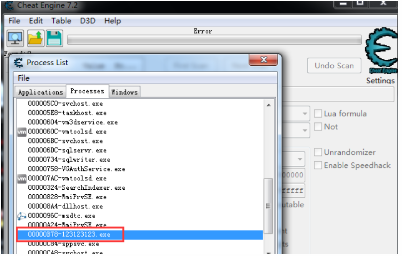
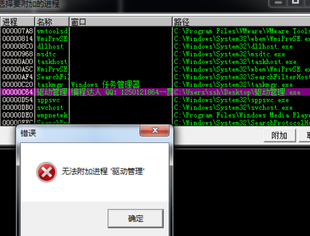
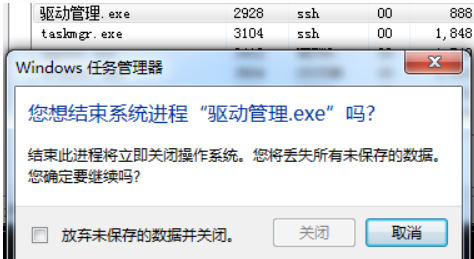
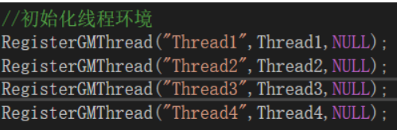
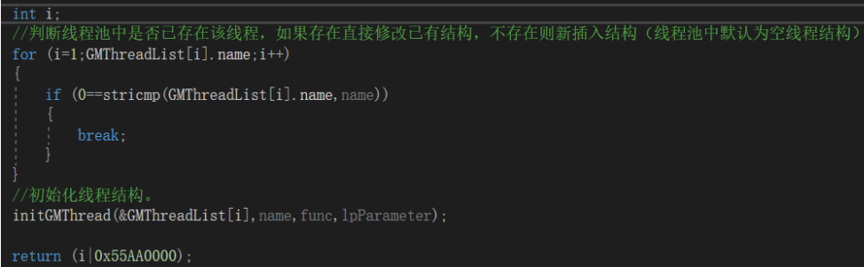
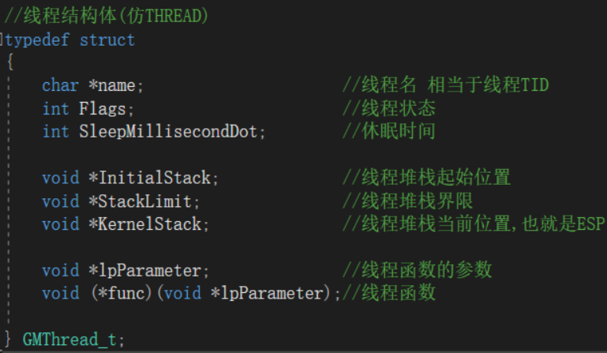
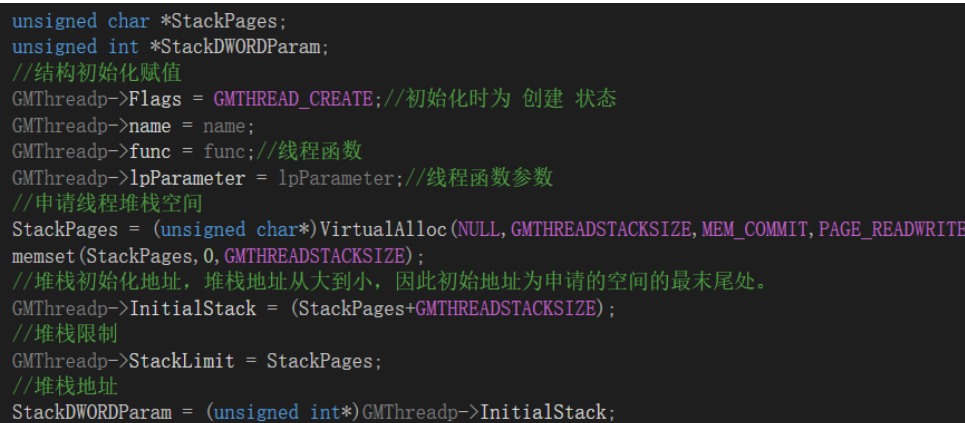

# 1.KPCR结构

CPU控制块结构，每一个逻辑核都有一个KPCR结构描述当前CPU的各种信息。全局变量“KeNumberProcessors”中保存了当前机器的CPU核数。

 

在系统调用章节我们初步了解了KPCR的部分成员。

 

KPCR结构成员列表：

```c
//0x3748 bytes (sizeof)
struct _KPCR
{
    union
    {
        struct _NT_TIB NtTib;                                               //0x0
        struct
        {
            struct _EXCEPTION_REGISTRATION_RECORD* Used_ExceptionList;      //0x0
            VOID* Used_StackBase;                                           //0x4
            VOID* Spare2;                                                   //0x8
            VOID* TssCopy;                                                  //0xc
            ULONG ContextSwitches;                                          //0x10
            ULONG SetMemberCopy;                                            //0x14
            VOID* Used_Self;                                                //0x18
        };
    };
    struct _KPCR* SelfPcr;                                                  //0x1c
    struct _KPRCB* Prcb;                                                    //0x20
    UCHAR Irql;                                                             //0x24
    ULONG IRR;                                                              //0x28
    ULONG IrrActive;                                                        //0x2c
    ULONG IDR;                                                              //0x30
    VOID* KdVersionBlock;                                                   //0x34
    struct _KIDTENTRY* IDT;                                                 //0x38
    struct _KGDTENTRY* GDT;                                                 //0x3c
    struct _KTSS* TSS;                                                      //0x40
    USHORT MajorVersion;                                                    //0x44
    USHORT MinorVersion;                                                    //0x46
    ULONG SetMember;                                                        //0x48
    ULONG StallScaleFactor;                                                 //0x4c
    UCHAR SpareUnused;                                                      //0x50
    UCHAR Number;                                                           //0x51
    UCHAR Spare0;                                                           //0x52
    UCHAR SecondLevelCacheAssociativity;                                    //0x53
    ULONG VdmAlert;                                                         //0x54
    ULONG KernelReserved[14];                                               //0x58
    ULONG SecondLevelCacheSize;                                             //0x90
    ULONG HalReserved[16];                                                  //0x94
    ULONG InterruptMode;                                                    //0xd4
    UCHAR Spare1;                                                           //0xd8
    ULONG KernelReserved2[17];                                              //0xdc
    struct _KPRCB PrcbData;                                                 //0x120
};
```

- +0 NtTib：
  - +0 Used_ExceptionList：异常处理程序链表。
  - +4 Used_StackBase：当前线程的栈底。
  - +8 Spare2/StackLimit：当前线程的堆栈大小。
  - +18 Used_Self：指向NtTib自身，也是KPCR自身（fs:[0x18]）。
- +1C SelfPcr：指向KPCR自身。与UsedSelf不同，SelfPcr必然指向KPCR自身，UsedSelf有时候会指向TEB。
- +20 Prcb：KPRCB结构指针。见后文。
- +38 IDT：当前线程的IDT表地址。
- +3C GDT：当前线程的GDT表地址。
- +40 TSS：指向当前线程的TSS表。
- +48 SetNumber：当前CPU编号。从1开始。
- +51 Number：当前CPU编号。从0开始。
- +120 PrcbData：KPRCB结构，扩展结构，见后文。

## KPRCB结构

CPU控制块扩展块。全局变量“KiProcessorBlock”中保存了KPRCB的地址。

 

KPRCB结构成员列表：

```c
//0x3628 bytes (sizeof)
struct _KPRCB
{
    USHORT MinorVersion;                                                    //0x0
    USHORT MajorVersion;                                                    //0x2
    struct _KTHREAD* CurrentThread;                                         //0x4
    struct _KTHREAD* NextThread;                                            //0x8
    struct _KTHREAD* IdleThread;                                            //0xc
    UCHAR LegacyNumber;                                                     //0x10
    UCHAR NestingLevel;                                                     //0x11
    USHORT BuildType;                                                       //0x12
    CHAR CpuType;                                                           //0x14
    CHAR CpuID;                                                             //0x15
    union
    {
        USHORT CpuStep;                                                     //0x16
        struct
        {
            UCHAR CpuStepping;                                              //0x16
            UCHAR CpuModel;                                                 //0x17
        };
    };
    struct _KPROCESSOR_STATE ProcessorState;                                //0x18
    ULONG KernelReserved[16];                                               //0x338
    ULONG HalReserved[16];                                                  //0x378
    ULONG CFlushSize;                                                       //0x3b8
    UCHAR CoresPerPhysicalProcessor;                                        //0x3bc
    UCHAR LogicalProcessorsPerCore;                                         //0x3bd
    UCHAR PrcbPad0[2];                                                      //0x3be
    ULONG MHz;                                                              //0x3c0
    UCHAR CpuVendor;                                                        //0x3c4
    UCHAR GroupIndex;                                                       //0x3c5
    USHORT Group;                                                           //0x3c6
    ULONG GroupSetMember;                                                   //0x3c8
    ULONG Number;                                                           //0x3cc
    UCHAR PrcbPad1[72];                                                     //0x3d0
    struct _KSPIN_LOCK_QUEUE LockQueue[17];                                 //0x418
    struct _KTHREAD* NpxThread;                                             //0x4a0
    ULONG InterruptCount;                                                   //0x4a4
    ULONG KernelTime;                                                       //0x4a8
    ULONG UserTime;                                                         //0x4ac
    ULONG DpcTime;                                                          //0x4b0
    ULONG DpcTimeCount;                                                     //0x4b4
    ULONG InterruptTime;                                                    //0x4b8
    ULONG AdjustDpcThreshold;                                               //0x4bc
    ULONG PageColor;                                                        //0x4c0
    UCHAR DebuggerSavedIRQL;                                                //0x4c4
    UCHAR NodeColor;                                                        //0x4c5
    UCHAR PrcbPad20[2];                                                     //0x4c6
    ULONG NodeShiftedColor;                                                 //0x4c8
    struct _KNODE* ParentNode;                                              //0x4cc
    ULONG SecondaryColorMask;                                               //0x4d0
    ULONG DpcTimeLimit;                                                     //0x4d4
    ULONG PrcbPad21[2];                                                     //0x4d8
    ULONG CcFastReadNoWait;                                                 //0x4e0
    ULONG CcFastReadWait;                                                   //0x4e4
    ULONG CcFastReadNotPossible;                                            //0x4e8
    ULONG CcCopyReadNoWait;                                                 //0x4ec
    ULONG CcCopyReadWait;                                                   //0x4f0
    ULONG CcCopyReadNoWaitMiss;                                             //0x4f4
    volatile LONG MmSpinLockOrdering;                                       //0x4f8
    volatile LONG IoReadOperationCount;                                     //0x4fc
    volatile LONG IoWriteOperationCount;                                    //0x500
    volatile LONG IoOtherOperationCount;                                    //0x504
    union _LARGE_INTEGER IoReadTransferCount;                               //0x508
    union _LARGE_INTEGER IoWriteTransferCount;                              //0x510
    union _LARGE_INTEGER IoOtherTransferCount;                              //0x518
    ULONG CcFastMdlReadNoWait;                                              //0x520
    ULONG CcFastMdlReadWait;                                                //0x524
    ULONG CcFastMdlReadNotPossible;                                         //0x528
    ULONG CcMapDataNoWait;                                                  //0x52c
    ULONG CcMapDataWait;                                                    //0x530
    ULONG CcPinMappedDataCount;                                             //0x534
    ULONG CcPinReadNoWait;                                                  //0x538
    ULONG CcPinReadWait;                                                    //0x53c
    ULONG CcMdlReadNoWait;                                                  //0x540
    ULONG CcMdlReadWait;                                                    //0x544
    ULONG CcLazyWriteHotSpots;                                              //0x548
    ULONG CcLazyWriteIos;                                                   //0x54c
    ULONG CcLazyWritePages;                                                 //0x550
    ULONG CcDataFlushes;                                                    //0x554
    ULONG CcDataPages;                                                      //0x558
    ULONG CcLostDelayedWrites;                                              //0x55c
    ULONG CcFastReadResourceMiss;                                           //0x560
    ULONG CcCopyReadWaitMiss;                                               //0x564
    ULONG CcFastMdlReadResourceMiss;                                        //0x568
    ULONG CcMapDataNoWaitMiss;                                              //0x56c
    ULONG CcMapDataWaitMiss;                                                //0x570
    ULONG CcPinReadNoWaitMiss;                                              //0x574
    ULONG CcPinReadWaitMiss;                                                //0x578
    ULONG CcMdlReadNoWaitMiss;                                              //0x57c
    ULONG CcMdlReadWaitMiss;                                                //0x580
    ULONG CcReadAheadIos;                                                   //0x584
    ULONG KeAlignmentFixupCount;                                            //0x588
    ULONG KeExceptionDispatchCount;                                         //0x58c
    ULONG KeSystemCalls;                                                    //0x590
    ULONG AvailableTime;                                                    //0x594
    ULONG PrcbPad22[2];                                                     //0x598
    struct _PP_LOOKASIDE_LIST PPLookasideList[16];                          //0x5a0
    struct _GENERAL_LOOKASIDE_POOL PPNPagedLookasideList[32];               //0x620
    struct _GENERAL_LOOKASIDE_POOL PPPagedLookasideList[32];                //0xf20
    volatile ULONG PacketBarrier;                                           //0x1820
    volatile LONG ReverseStall;                                             //0x1824
    VOID* IpiFrame;                                                         //0x1828
    UCHAR PrcbPad3[52];                                                     //0x182c
    VOID* volatile CurrentPacket[3];                                        //0x1860
    volatile ULONG TargetSet;                                               //0x186c
    VOID (* volatileWorkerRoutine)(VOID* arg1, VOID* arg2, VOID* arg3, VOID* arg4); //0x1870
    volatile ULONG IpiFrozen;                                               //0x1874
    UCHAR PrcbPad4[40];                                                     //0x1878
    volatile ULONG RequestSummary;                                          //0x18a0
    struct _KPRCB* volatile SignalDone;                                     //0x18a4
    UCHAR PrcbPad50[56];                                                    //0x18a8
    struct _KDPC_DATA DpcData[2];                                           //0x18e0
    VOID* DpcStack;                                                         //0x1908
    LONG MaximumDpcQueueDepth;                                              //0x190c
    ULONG DpcRequestRate;                                                   //0x1910
    ULONG MinimumDpcRate;                                                   //0x1914
    ULONG DpcLastCount;                                                     //0x1918
    ULONG PrcbLock;                                                         //0x191c
    struct _KGATE DpcGate;                                                  //0x1920
    UCHAR ThreadDpcEnable;                                                  //0x1930
    volatile UCHAR QuantumEnd;                                              //0x1931
    volatile UCHAR DpcRoutineActive;                                        //0x1932
    volatile UCHAR IdleSchedule;                                            //0x1933
    union
    {
        volatile LONG DpcRequestSummary;                                    //0x1934
        SHORT DpcRequestSlot[2];                                            //0x1934
        struct
        {
            SHORT NormalDpcState;                                           //0x1934
            union
            {
                volatile USHORT DpcThreadActive:1;                          //0x1936
                SHORT ThreadDpcState;                                       //0x1936
            };
        };
    };
    volatile ULONG TimerHand;                                               //0x1938
    ULONG LastTick;                                                         //0x193c
    LONG MasterOffset;                                                      //0x1940
    ULONG PrcbPad41[2];                                                     //0x1944
    ULONG PeriodicCount;                                                    //0x194c
    ULONG PeriodicBias;                                                     //0x1950
    ULONGLONG TickOffset;                                                   //0x1958
    struct _KTIMER_TABLE TimerTable;                                        //0x1960
    struct _KDPC CallDpc;                                                   //0x31a0
    LONG ClockKeepAlive;                                                    //0x31c0
    UCHAR ClockCheckSlot;                                                   //0x31c4
    UCHAR ClockPollCycle;                                                   //0x31c5
    UCHAR PrcbPad6[2];                                                      //0x31c6
    LONG DpcWatchdogPeriod;                                                 //0x31c8
    LONG DpcWatchdogCount;                                                  //0x31cc
    LONG ThreadWatchdogPeriod;                                              //0x31d0
    LONG ThreadWatchdogCount;                                               //0x31d4
    volatile LONG KeSpinLockOrdering;                                       //0x31d8
    ULONG PrcbPad70[1];                                                     //0x31dc
    struct _LIST_ENTRY WaitListHead;                                        //0x31e0
    ULONG WaitLock;                                                         //0x31e8
    ULONG ReadySummary;                                                     //0x31ec
    ULONG QueueIndex;                                                       //0x31f0
    struct _SINGLE_LIST_ENTRY DeferredReadyListHead;                        //0x31f4
    ULONGLONG StartCycles;                                                  //0x31f8
    volatile ULONGLONG CycleTime;                                           //0x3200
    volatile ULONG HighCycleTime;                                           //0x3208
    ULONG PrcbPad71;                                                        //0x320c
    ULONGLONG PrcbPad72[2];                                                 //0x3210
    struct _LIST_ENTRY DispatcherReadyListHead[32];                         //0x3220
    VOID* ChainedInterruptList;                                             //0x3320
    LONG LookasideIrpFloat;                                                 //0x3324
    volatile LONG MmPageFaultCount;                                         //0x3328
    volatile LONG MmCopyOnWriteCount;                                       //0x332c
    volatile LONG MmTransitionCount;                                        //0x3330
    volatile LONG MmCacheTransitionCount;                                   //0x3334
    volatile LONG MmDemandZeroCount;                                        //0x3338
    volatile LONG MmPageReadCount;                                          //0x333c
    volatile LONG MmPageReadIoCount;                                        //0x3340
    volatile LONG MmCacheReadCount;                                         //0x3344
    volatile LONG MmCacheIoCount;                                           //0x3348
    volatile LONG MmDirtyPagesWriteCount;                                   //0x334c
    volatile LONG MmDirtyWriteIoCount;                                      //0x3350
    volatile LONG MmMappedPagesWriteCount;                                  //0x3354
    volatile LONG MmMappedWriteIoCount;                                     //0x3358
    volatile ULONG CachedCommit;                                            //0x335c
    volatile ULONG CachedResidentAvailable;                                 //0x3360
    VOID* HyperPte;                                                         //0x3364
    UCHAR PrcbPad8[4];                                                      //0x3368
    UCHAR VendorString[13];                                                 //0x336c
    UCHAR InitialApicId;                                                    //0x3379
    UCHAR LogicalProcessorsPerPhysicalProcessor;                            //0x337a
    UCHAR PrcbPad9[5];                                                      //0x337b
    ULONG FeatureBits;                                                      //0x3380
    union _LARGE_INTEGER UpdateSignature;                                   //0x3388
    volatile ULONGLONG IsrTime;                                             //0x3390
    ULONGLONG RuntimeAccumulation;                                          //0x3398
    struct _PROCESSOR_POWER_STATE PowerState;                               //0x33a0
    struct _KDPC DpcWatchdogDpc;                                            //0x3468
    struct _KTIMER DpcWatchdogTimer;                                        //0x3488
    VOID* WheaInfo;                                                         //0x34b0
    VOID* EtwSupport;                                                       //0x34b4
    union _SLIST_HEADER InterruptObjectPool;                                //0x34b8
    union _SLIST_HEADER HypercallPageList;                                  //0x34c0
    VOID* HypercallPageVirtual;                                             //0x34c8
    VOID* VirtualApicAssist;                                                //0x34cc
    ULONGLONG* StatisticsPage;                                              //0x34d0
    VOID* RateControl;                                                      //0x34d4
    struct _CACHE_DESCRIPTOR Cache[5];                                      //0x34d8
    ULONG CacheCount;                                                       //0x3514
    ULONG CacheProcessorMask[5];                                            //0x3518
    struct _KAFFINITY_EX PackageProcessorSet;                               //0x352c
    ULONG PrcbPad91[1];                                                     //0x3538
    ULONG CoreProcessorSet;                                                 //0x353c
    struct _KDPC TimerExpirationDpc;                                        //0x3540
    ULONG SpinLockAcquireCount;                                             //0x3560
    ULONG SpinLockContentionCount;                                          //0x3564
    ULONG SpinLockSpinCount;                                                //0x3568
    ULONG IpiSendRequestBroadcastCount;                                     //0x356c
    ULONG IpiSendRequestRoutineCount;                                       //0x3570
    ULONG IpiSendSoftwareInterruptCount;                                    //0x3574
    ULONG ExInitializeResourceCount;                                        //0x3578
    ULONG ExReInitializeResourceCount;                                      //0x357c
    ULONG ExDeleteResourceCount;                                            //0x3580
    ULONG ExecutiveResourceAcquiresCount;                                   //0x3584
    ULONG ExecutiveResourceContentionsCount;                                //0x3588
    ULONG ExecutiveResourceReleaseExclusiveCount;                           //0x358c
    ULONG ExecutiveResourceReleaseSharedCount;                              //0x3590
    ULONG ExecutiveResourceConvertsCount;                                   //0x3594
    ULONG ExAcqResExclusiveAttempts;                                        //0x3598
    ULONG ExAcqResExclusiveAcquiresExclusive;                               //0x359c
    ULONG ExAcqResExclusiveAcquiresExclusiveRecursive;                      //0x35a0
    ULONG ExAcqResExclusiveWaits;                                           //0x35a4
    ULONG ExAcqResExclusiveNotAcquires;                                     //0x35a8
    ULONG ExAcqResSharedAttempts;                                           //0x35ac
    ULONG ExAcqResSharedAcquiresExclusive;                                  //0x35b0
    ULONG ExAcqResSharedAcquiresShared;                                     //0x35b4
    ULONG ExAcqResSharedAcquiresSharedRecursive;                            //0x35b8
    ULONG ExAcqResSharedWaits;                                              //0x35bc
    ULONG ExAcqResSharedNotAcquires;                                        //0x35c0
    ULONG ExAcqResSharedStarveExclusiveAttempts;                            //0x35c4
    ULONG ExAcqResSharedStarveExclusiveAcquiresExclusive;                   //0x35c8
    ULONG ExAcqResSharedStarveExclusiveAcquiresShared;                      //0x35cc
    ULONG ExAcqResSharedStarveExclusiveAcquiresSharedRecursive;             //0x35d0
    ULONG ExAcqResSharedStarveExclusiveWaits;                               //0x35d4
    ULONG ExAcqResSharedStarveExclusiveNotAcquires;                         //0x35d8
    ULONG ExAcqResSharedWaitForExclusiveAttempts;                           //0x35dc
    ULONG ExAcqResSharedWaitForExclusiveAcquiresExclusive;                  //0x35e0
    ULONG ExAcqResSharedWaitForExclusiveAcquiresShared;                     //0x35e4
    ULONG ExAcqResSharedWaitForExclusiveAcquiresSharedRecursive;            //0x35e8
    ULONG ExAcqResSharedWaitForExclusiveWaits;                              //0x35ec
    ULONG ExAcqResSharedWaitForExclusiveNotAcquires;                        //0x35f0
    ULONG ExSetResOwnerPointerExclusive;                                    //0x35f4
    ULONG ExSetResOwnerPointerSharedNew;                                    //0x35f8
    ULONG ExSetResOwnerPointerSharedOld;                                    //0x35fc
    ULONG ExTryToAcqExclusiveAttempts;                                      //0x3600
    ULONG ExTryToAcqExclusiveAcquires;                                      //0x3604
    ULONG ExBoostExclusiveOwner;                                            //0x3608
    ULONG ExBoostSharedOwners;                                              //0x360c
    ULONG ExEtwSynchTrackingNotificationsCount;                             //0x3610
    ULONG ExEtwSynchTrackingNotificationsAccountedCount;                    //0x3614
    struct _CONTEXT* Context;                                               //0x3618
    ULONG ContextFlags;                                                     //0x361c
    struct _XSAVE_AREA* ExtendedState;                                      //0x3620
};
```

- +4 CurrentThread：当前CPU正在跑的线程。
- +8 NextThread：将要切换的线程。
- +C IdleThread：如果没有要切换的线程，CPU将要跑的空闲线程。

其余字段在后续分析内核代码时再了解。

# 2.EPROCESS结构

在3环下，每个进程都有一个PEB结构用来描述这个进程的一些信息。这些信息仅是为了3环更好的操作进程。而在0环，每个进程又有一个结构体用于描述该进程的所有信息：EPROCESS。

 

结构体成员列表：

```c
//0x2c0 bytes (sizeof)
struct _EPROCESS
{
    struct _KPROCESS Pcb;                                                   //0x0
    struct _EX_PUSH_LOCK ProcessLock;                                       //0x98
    union _LARGE_INTEGER CreateTime;                                        //0xa0
    union _LARGE_INTEGER ExitTime;                                          //0xa8
    struct _EX_RUNDOWN_REF RundownProtect;                                  //0xb0
    VOID* UniqueProcessId;                                                  //0xb4
    struct _LIST_ENTRY ActiveProcessLinks;                                  //0xb8
    ULONG ProcessQuotaUsage[2];                                             //0xc0
    ULONG ProcessQuotaPeak[2];                                              //0xc8
    volatile ULONG CommitCharge;                                            //0xd0
    struct _EPROCESS_QUOTA_BLOCK* QuotaBlock;                               //0xd4
    struct _PS_CPU_QUOTA_BLOCK* CpuQuotaBlock;                              //0xd8
    ULONG PeakVirtualSize;                                                  //0xdc
    ULONG VirtualSize;                                                      //0xe0
    struct _LIST_ENTRY SessionProcessLinks;                                 //0xe4
    VOID* DebugPort;                                                        //0xec
    union
    {
        VOID* ExceptionPortData;                                            //0xf0
        ULONG ExceptionPortValue;                                           //0xf0
        ULONG ExceptionPortState:3;                                         //0xf0
    };
    struct _HANDLE_TABLE* ObjectTable;                                      //0xf4
    struct _EX_FAST_REF Token;                                              //0xf8
    ULONG WorkingSetPage;                                                   //0xfc
    struct _EX_PUSH_LOCK AddressCreationLock;                               //0x100
    struct _ETHREAD* RotateInProgress;                                      //0x104
    struct _ETHREAD* ForkInProgress;                                        //0x108
    ULONG HardwareTrigger;                                                  //0x10c
    struct _MM_AVL_TABLE* PhysicalVadRoot;                                  //0x110
    VOID* CloneRoot;                                                        //0x114
    volatile ULONG NumberOfPrivatePages;                                    //0x118
    volatile ULONG NumberOfLockedPages;                                     //0x11c
    VOID* Win32Process;                                                     //0x120
    struct _EJOB* volatile Job;                                             //0x124
    VOID* SectionObject;                                                    //0x128
    VOID* SectionBaseAddress;                                               //0x12c
    ULONG Cookie;                                                           //0x130
    ULONG Spare8;                                                           //0x134
    struct _PAGEFAULT_HISTORY* WorkingSetWatch;                             //0x138
    VOID* Win32WindowStation;                                               //0x13c
    VOID* InheritedFromUniqueProcessId;                                     //0x140
    VOID* LdtInformation;                                                   //0x144
    VOID* VdmObjects;                                                       //0x148
    ULONG ConsoleHostProcess;                                               //0x14c
    VOID* DeviceMap;                                                        //0x150
    VOID* EtwDataSource;                                                    //0x154
    VOID* FreeTebHint;                                                      //0x158
    union
    {
        struct _HARDWARE_PTE PageDirectoryPte;                              //0x160
        ULONGLONG Filler;                                                   //0x160
    };
    VOID* Session;                                                          //0x168
    UCHAR ImageFileName[15];                                                //0x16c
    UCHAR PriorityClass;                                                    //0x17b
    struct _LIST_ENTRY JobLinks;                                            //0x17c
    VOID* LockedPagesList;                                                  //0x184
    struct _LIST_ENTRY ThreadListHead;                                      //0x188
    VOID* SecurityPort;                                                     //0x190
    VOID* PaeTop;                                                           //0x194
    volatile ULONG ActiveThreads;                                           //0x198
    ULONG ImagePathHash;                                                    //0x19c
    ULONG DefaultHardErrorProcessing;                                       //0x1a0
    LONG LastThreadExitStatus;                                              //0x1a4
    struct _PEB* Peb;                                                       //0x1a8
    struct _EX_FAST_REF PrefetchTrace;                                      //0x1ac
    union _LARGE_INTEGER ReadOperationCount;                                //0x1b0
    union _LARGE_INTEGER WriteOperationCount;                               //0x1b8
    union _LARGE_INTEGER OtherOperationCount;                               //0x1c0
    union _LARGE_INTEGER ReadTransferCount;                                 //0x1c8
    union _LARGE_INTEGER WriteTransferCount;                                //0x1d0
    union _LARGE_INTEGER OtherTransferCount;                                //0x1d8
    ULONG CommitChargeLimit;                                                //0x1e0
    volatile ULONG CommitChargePeak;                                        //0x1e4
    VOID* AweInfo;                                                          //0x1e8
    struct _SE_AUDIT_PROCESS_CREATION_INFO SeAuditProcessCreationInfo;      //0x1ec
    struct _MMSUPPORT Vm;                                                   //0x1f0
    struct _LIST_ENTRY MmProcessLinks;                                      //0x25c
    VOID* HighestUserAddress;                                               //0x264
    ULONG ModifiedPageCount;                                                //0x268
    union
    {
        ULONG Flags2;                                                       //0x26c
        struct
        {
            ULONG JobNotReallyActive:1;                                     //0x26c
            ULONG AccountingFolded:1;                                       //0x26c
            ULONG NewProcessReported:1;                                     //0x26c
            ULONG ExitProcessReported:1;                                    //0x26c
            ULONG ReportCommitChanges:1;                                    //0x26c
            ULONG LastReportMemory:1;                                       //0x26c
            ULONG ReportPhysicalPageChanges:1;                              //0x26c
            ULONG HandleTableRundown:1;                                     //0x26c
            ULONG NeedsHandleRundown:1;                                     //0x26c
            ULONG RefTraceEnabled:1;                                        //0x26c
            ULONG NumaAware:1;                                              //0x26c
            ULONG ProtectedProcess:1;                                       //0x26c
            ULONG DefaultPagePriority:3;                                    //0x26c
            ULONG PrimaryTokenFrozen:1;                                     //0x26c
            ULONG ProcessVerifierTarget:1;                                  //0x26c
            ULONG StackRandomizationDisabled:1;                             //0x26c
            ULONG AffinityPermanent:1;                                      //0x26c
            ULONG AffinityUpdateEnable:1;                                   //0x26c
            ULONG PropagateNode:1;                                          //0x26c
            ULONG ExplicitAffinity:1;                                       //0x26c
        };
    };
    union
    {
        ULONG Flags;                                                        //0x270
        struct
        {
            ULONG CreateReported:1;                                         //0x270
            ULONG NoDebugInherit:1;                                         //0x270
            ULONG ProcessExiting:1;                                         //0x270
            ULONG ProcessDelete:1;                                          //0x270
            ULONG Wow64SplitPages:1;                                        //0x270
            ULONG VmDeleted:1;                                              //0x270
            ULONG OutswapEnabled:1;                                         //0x270
            ULONG Outswapped:1;                                             //0x270
            ULONG ForkFailed:1;                                             //0x270
            ULONG Wow64VaSpace4Gb:1;                                        //0x270
            ULONG AddressSpaceInitialized:2;                                //0x270
            ULONG SetTimerResolution:1;                                     //0x270
            ULONG BreakOnTermination:1;                                     //0x270
            ULONG DeprioritizeViews:1;                                      //0x270
            ULONG WriteWatch:1;                                             //0x270
            ULONG ProcessInSession:1;                                       //0x270
            ULONG OverrideAddressSpace:1;                                   //0x270
            ULONG HasAddressSpace:1;                                        //0x270
            ULONG LaunchPrefetched:1;                                       //0x270
            ULONG InjectInpageErrors:1;                                     //0x270
            ULONG VmTopDown:1;                                              //0x270
            ULONG ImageNotifyDone:1;                                        //0x270
            ULONG PdeUpdateNeeded:1;                                        //0x270
            ULONG VdmAllowed:1;                                             //0x270
            ULONG CrossSessionCreate:1;                                     //0x270
            ULONG ProcessInserted:1;                                        //0x270
            ULONG DefaultIoPriority:3;                                      //0x270
            ULONG ProcessSelfDelete:1;                                      //0x270
            ULONG SetTimerResolutionLink:1;                                 //0x270
        };
    };
    LONG ExitStatus;                                                        //0x274
    struct _MM_AVL_TABLE VadRoot;                                           //0x278
    struct _ALPC_PROCESS_CONTEXT AlpcContext;                               //0x298
    struct _LIST_ENTRY TimerResolutionLink;                                 //0x2a8
    ULONG RequestedTimerResolution;                                         //0x2b0
    ULONG ActiveThreadsHighWatermark;                                       //0x2b4
    ULONG SmallestTimerResolution;                                          //0x2b8
    struct _PO_DIAG_STACK_RECORD* TimerResolutionStackRecord;               //0x2bc
};
```

- +0 Pcb：Kprocess结构体。参考下文。
- +98 ProcessLock：进程锁。修改EPROCESS结构存放锁结构，防止同时修改。改完了置0.
- +A0 CreateTime：进程的创建时间。
- +A8 ExitTime：进程的退出时间。
- +B0 RundownProtect：进程锁。该字段置值后，进程无法被访问、打开、结束，相当于保护。但是会容易卡死。
- +B4 UniqueProcessId：进程ID。任务管理器中显示的进程ID就是这个。
- +B8 ActiveProcessLinks：双向链表。包括了windows中所有活动的进程。全局变量“PsActiveProcessHead”指向了这个链表的头部。通过该全局变量可以遍历整条链表。
- +C0 ProcessQuotaUsage：进程物理页相关统计信息。
- +C8 ProcessQuotaPeak：进程物理页相关统计信息。
- +D0 CommitCharge：进程虚拟内存相关统计信息。
- +D4 QuotaBlock：进程虚拟内存相关统计信息。
- +D8 CpuQuotaBlock：进程虚拟内存相关统计信息。
- +E4 SessionProcessLinks：会话进程链表。保存了当前登录的用户的所有进程。
- +EC DebugPort：调试相关。如果该进程处于调试状态，这里会有值（一个结构体），该结构体用于进程与调试器之间通信。通过循环清0可以达到反调试效果。
- +F0 ExceptionPortData：调试相关。
- +F4 ObjectTable：进程的句柄表。句柄相关章节再学。
- +F8 Token：进程Token。
- +FC WorkingSetPage：表明当前进程用了多少个物理页。
- +16C ImageFileName：当前进程的进程名。
- +188 ThreadListHead：当前进程内所有线程的链表。
- +198 ActiveThreads：当前进程内活动的线程数量。
- +1A8 Peb。就是3环下该进程的PEB。（PEB结构此处不赘述了，网上有非常多的PEB结构说明。）
- +1EC SeAuditProcessCreationInfo：当前进程完整路径。
- +26C Flags2：一个联合体，每个位影响该进程的一些属性。

ProtectedProcess：进程保护位。该位置1后该进程被保护。CE看不到图片，打不开了进程。OD附加进程列表遍历不到。一个最简单的进程保护。



+270 Flags：一个联合体，每个位影响该进程的一些属性。

- ProcessExiting：进程退出标志位。置1后表明该进程已退出，但实际还在运行。可以达到反调试的效果。同时进程无法使用任务管理器结束。
- ProcessDelete：进程退出标志位。置1后表明该进程已退出，但实际还在运行。可以达到反调试的效果。同时进程无法使用任务管理器结束。



BreakOnTermination：该位置1后，任务管理器结束进程时将提示“是否结束系统进程XXX”。结束后windbg将会断下。




- - VmTopDown：该位置1时，VirtualAlloc一类的申请内存函数将会从大地址开始申请。
  - ProcessInserted：该位置0后，OD附加进程列表找不到该进程。任务管理器结束不掉该进程。CE打不开该进程，无图标。
- +274 ExitStatus：进程退出状态码。进程创建时默认值是250（0x103）。如果不是这个值基本上就是进程退出了。
- +278 VadRoot：标识当前进程用户空间（低2G）中哪些地址没被分配。该成员指向了一个二叉树。

## KPROCESS结构

Eprocess第一个成员是一个Kprocess结构。

 

Kprocess结构成员列表：

```c
//0x98 bytes (sizeof)
struct _KPROCESS
{
    struct _DISPATCHER_HEADER Header;                                       //0x0
    struct _LIST_ENTRY ProfileListHead;                                     //0x10
    ULONG DirectoryTableBase;                                               //0x18
    struct _KGDTENTRY LdtDescriptor;                                        //0x1c
    struct _KIDTENTRY Int21Descriptor;                                      //0x24
    struct _LIST_ENTRY ThreadListHead;                                      //0x2c
    ULONG ProcessLock;                                                      //0x34
    struct _KAFFINITY_EX Affinity;                                          //0x38
    struct _LIST_ENTRY ReadyListHead;                                       //0x44
    struct _SINGLE_LIST_ENTRY SwapListEntry;                                //0x4c
    volatile struct _KAFFINITY_EX ActiveProcessors;                         //0x50
    union
    {
        struct
        {
            volatile LONG AutoAlignment:1;                                  //0x5c
            volatile LONG DisableBoost:1;                                   //0x5c
            volatile LONG DisableQuantum:1;                                 //0x5c
            volatile ULONG ActiveGroupsMask:1;                              //0x5c
            volatile LONG ReservedFlags:28;                                 //0x5c
        };
        volatile LONG ProcessFlags;                                         //0x5c
    };
    CHAR BasePriority;                                                      //0x60
    CHAR QuantumReset;                                                      //0x61
    UCHAR Visited;                                                          //0x62
    UCHAR Unused3;                                                          //0x63
    ULONG ThreadSeed[1];                                                    //0x64
    USHORT IdealNode[1];                                                    //0x68
    USHORT IdealGlobalNode;                                                 //0x6a
    union _KEXECUTE_OPTIONS Flags;                                          //0x6c
    UCHAR Unused1;                                                          //0x6d
    USHORT IopmOffset;                                                      //0x6e
    ULONG Unused4;                                                          //0x70
    union _KSTACK_COUNT StackCount;                                         //0x74
    struct _LIST_ENTRY ProcessListEntry;                                    //0x78
    volatile ULONGLONG CycleTime;                                           //0x80
    ULONG KernelTime;                                                       //0x88
    ULONG UserTime;                                                         //0x8c
    VOID* VdmTrapcHandler;                                                  //0x90
};
```

- +0 Header：可等待对象头部。所有0环结构体只要以_DISPATCHER_HEADER结构开头的，都可以使用WaitForSingleObject等待。如互斥体、事件。

- +10 ProfileListHead：性能分析相关，任务管理器，性能栏那些数据。

- +18 DirectoryTableBase：页目录表基址。物理地址，指向页目录表，CR3中的值就从这里获取。

- +2C ThreadListHead：当前进程的所有线程结构体链表。

- +38 Affinity：亲核性。规定了当前进程内的所有线程可以在哪些CPU上跑，4字节，共32位，每一位对应一个CPU核。如000000A1，转换为二进制为1010 0001，则该进程中的线程只能在0、5、7号CPU上运行。因此32位系统最多支持32核CPU，64位系统支持64核CPU。该值仅为线程结构中的亲核性做初始化赋值使用，没有实际的限制功能。

  如果只有1个CPU，但此处值为2（0010），则该进程为一个“死”了的进程。

- +44 ReadyListHead：当前进程内的就绪线程链表。

- +4C SwapListEntry：交换到文件磁盘上时使用该链表。记录了哪些内存被交换到文件里。

- +50 ActiveProcessors：当前进程内正在运行的线程运行在哪些CPU上。

- +5C AutoAlignment：强制内存对齐。一般为0。

- +5C DisableBoost：置1为关闭当前进程内所有线程的时间碎片。（置1后，不会由于时间中断触发线程切换）

- +60 BasePriority：基础优先级。该进程内所有线程最初的优先级。

- +61 QuantumReset：当前进程内线程的初始时间碎片。每一次时钟中断会将线程中的时间碎片减6，为0时，切换线程。线程从就绪变为运行时，会从这个值中取到初始的时间碎片。改大这个值会让该进程内的线程跑的更久。

- +78 ProcessListEntry：系统内所有进程的链表。win7及以上此处为空，已弃用。

- +80 CycleTime：当前进程执行了多少个指令周期。当进程结束时才会被赋值，指明了该进程存活了多久。

- +88 KernelTime：（统计信息）当前进程在0环的运行时间。当进程结束时才会被赋值，指明了该进程存活了多久。

- +8C UserTime：（统计信息）当前进程在3环的运行时间。当进程结束时才会被赋值，指明了该进程存活了多久。

- +90 VdmTrapcHandler：虚拟8086模式时使用。

# 3.ETHREAD结构

与进程一样， 3环下有TEB描述某个线程。在0环，也有一个ETHREAD描述某个线程的所有信息。

 

ETHREAD结构成员列表：

```c
//0x2b8 bytes (sizeof)
struct _ETHREAD
{
    struct _KTHREAD Tcb;                                                    //0x0
    union _LARGE_INTEGER CreateTime;                                        //0x200
    union
    {
        union _LARGE_INTEGER ExitTime;                                      //0x208
        struct _LIST_ENTRY KeyedWaitChain;                                  //0x208
    };
    LONG ExitStatus;                                                        //0x210
    union
    {
        struct _LIST_ENTRY PostBlockList;                                   //0x214
        struct
        {
            VOID* ForwardLinkShadow;                                        //0x214
            VOID* StartAddress;                                             //0x218
        };
    };
    union
    {
        struct _TERMINATION_PORT* TerminationPort;                          //0x21c
        struct _ETHREAD* ReaperLink;                                        //0x21c
        VOID* KeyedWaitValue;                                               //0x21c
    };
    ULONG ActiveTimerListLock;                                              //0x220
    struct _LIST_ENTRY ActiveTimerListHead;                                 //0x224
    struct _CLIENT_ID Cid;                                                  //0x22c
    union
    {
        struct _KSEMAPHORE KeyedWaitSemaphore;                              //0x234
        struct _KSEMAPHORE AlpcWaitSemaphore;                               //0x234
    };
    union _PS_CLIENT_SECURITY_CONTEXT ClientSecurity;                       //0x248
    struct _LIST_ENTRY IrpList;                                             //0x24c
    ULONG TopLevelIrp;                                                      //0x254
    struct _DEVICE_OBJECT* DeviceToVerify;                                  //0x258
    union _PSP_CPU_QUOTA_APC* CpuQuotaApc;                                  //0x25c
    VOID* Win32StartAddress;                                                //0x260
    VOID* LegacyPowerObject;                                                //0x264
    struct _LIST_ENTRY ThreadListEntry;                                     //0x268
    struct _EX_RUNDOWN_REF RundownProtect;                                  //0x270
    struct _EX_PUSH_LOCK ThreadLock;                                        //0x274
    ULONG ReadClusterSize;                                                  //0x278
    volatile LONG MmLockOrdering;                                           //0x27c
    union
    {
        ULONG CrossThreadFlags;                                             //0x280
        struct
        {
            ULONG Terminated:1;                                             //0x280
            ULONG ThreadInserted:1;                                         //0x280
            ULONG HideFromDebugger:1;                                       //0x280
            ULONG ActiveImpersonationInfo:1;                                //0x280
            ULONG Reserved:1;                                               //0x280
            ULONG HardErrorsAreDisabled:1;                                  //0x280
            ULONG BreakOnTermination:1;                                     //0x280
            ULONG SkipCreationMsg:1;                                        //0x280
            ULONG SkipTerminationMsg:1;                                     //0x280
            ULONG CopyTokenOnOpen:1;                                        //0x280
            ULONG ThreadIoPriority:3;                                       //0x280
            ULONG ThreadPagePriority:3;                                     //0x280
            ULONG RundownFail:1;                                            //0x280
            ULONG NeedsWorkingSetAging:1;                                   //0x280
        };
    };
    union
    {
        ULONG SameThreadPassiveFlags;                                       //0x284
        struct
        {
            ULONG ActiveExWorker:1;                                         //0x284
            ULONG ExWorkerCanWaitUser:1;                                    //0x284
            ULONG MemoryMaker:1;                                            //0x284
            ULONG ClonedThread:1;                                           //0x284
            ULONG KeyedEventInUse:1;                                        //0x284
            ULONG RateApcState:2;                                           //0x284
            ULONG SelfTerminate:1;                                          //0x284
        };
    };
    union
    {
        ULONG SameThreadApcFlags;                                           //0x288
        struct
        {
            UCHAR Spare:1;                                                  //0x288
            volatile UCHAR StartAddressInvalid:1;                           //0x288
            UCHAR EtwPageFaultCalloutActive:1;                              //0x288
            UCHAR OwnsProcessWorkingSetExclusive:1;                         //0x288
            UCHAR OwnsProcessWorkingSetShared:1;                            //0x288
            UCHAR OwnsSystemCacheWorkingSetExclusive:1;                     //0x288
            UCHAR OwnsSystemCacheWorkingSetShared:1;                        //0x288
            UCHAR OwnsSessionWorkingSetExclusive:1;                         //0x288
            UCHAR OwnsSessionWorkingSetShared:1;                            //0x289
            UCHAR OwnsProcessAddressSpaceExclusive:1;                       //0x289
            UCHAR OwnsProcessAddressSpaceShared:1;                          //0x289
            UCHAR SuppressSymbolLoad:1;                                     //0x289
            UCHAR Prefetching:1;                                            //0x289
            UCHAR OwnsDynamicMemoryShared:1;                                //0x289
            UCHAR OwnsChangeControlAreaExclusive:1;                         //0x289
            UCHAR OwnsChangeControlAreaShared:1;                            //0x289
            UCHAR OwnsPagedPoolWorkingSetExclusive:1;                       //0x28a
            UCHAR OwnsPagedPoolWorkingSetShared:1;                          //0x28a
            UCHAR OwnsSystemPtesWorkingSetExclusive:1;                      //0x28a
            UCHAR OwnsSystemPtesWorkingSetShared:1;                         //0x28a
            UCHAR TrimTrigger:2;                                            //0x28a
            UCHAR Spare1:2;                                                 //0x28a
            UCHAR PriorityRegionActive;                                     //0x28b
        };
    };
    UCHAR CacheManagerActive;                                               //0x28c
    UCHAR DisablePageFaultClustering;                                       //0x28d
    UCHAR ActiveFaultCount;                                                 //0x28e
    UCHAR LockOrderState;                                                   //0x28f
    ULONG AlpcMessageId;                                                    //0x290
    union
    {
        VOID* AlpcMessage;                                                  //0x294
        ULONG AlpcReceiveAttributeSet;                                      //0x294
    };
    struct _LIST_ENTRY AlpcWaitListEntry;                                   //0x298
    ULONG CacheManagerCount;                                                //0x2a0
    ULONG IoBoostCount;                                                     //0x2a4
    ULONG IrpListLock;                                                      //0x2a8
    VOID* ReservedForSynchTracking;                                         //0x2ac
    struct _SINGLE_LIST_ENTRY CmCallbackListHead;                           //0x2b0
};
```

- +0 Tcb：KTHREAD成员，见下文。
- +218 StartAddress：线程函数起始地址。
- +22C Cid：当前线程的线程ID。为_CLIENT_ID结构，包含了线程ID和所属的进程ID。
- +268 ThreadListEntry：当前进程内所有线程的双向链表。

## KTHREAD结构

与进程一样，第一个成员为KTHREAD结构。

 

KTHREAD结构成员列表：

```c
//0x200 bytes (sizeof)
struct _KTHREAD
{
    struct _DISPATCHER_HEADER Header;                                       //0x0
    volatile ULONGLONG CycleTime;                                           //0x10
    volatile ULONG HighCycleTime;                                           //0x18
    ULONGLONG QuantumTarget;                                                //0x20
    VOID* InitialStack;                                                     //0x28
    VOID* volatile StackLimit;                                              //0x2c
    VOID* KernelStack;                                                      //0x30
    ULONG ThreadLock;                                                       //0x34
    union _KWAIT_STATUS_REGISTER WaitRegister;                              //0x38
    volatile UCHAR Running;                                                 //0x39
    UCHAR Alerted[2];                                                       //0x3a
    union
    {
        struct
        {
            ULONG KernelStackResident:1;                                    //0x3c
            ULONG ReadyTransition:1;                                        //0x3c
            ULONG ProcessReadyQueue:1;                                      //0x3c
            ULONG WaitNext:1;                                               //0x3c
            ULONG SystemAffinityActive:1;                                   //0x3c
            ULONG Alertable:1;                                              //0x3c
            ULONG GdiFlushActive:1;                                         //0x3c
            ULONG UserStackWalkActive:1;                                    //0x3c
            ULONG ApcInterruptRequest:1;                                    //0x3c
            ULONG ForceDeferSchedule:1;                                     //0x3c
            ULONG QuantumEndMigrate:1;                                      //0x3c
            ULONG UmsDirectedSwitchEnable:1;                                //0x3c
            ULONG TimerActive:1;                                            //0x3c
            ULONG SystemThread:1;                                           //0x3c
            ULONG Reserved:18;                                              //0x3c
        };
        LONG MiscFlags;                                                     //0x3c
    };
    union
    {
        struct _KAPC_STATE ApcState;                                        //0x40
        struct
        {
            UCHAR ApcStateFill[23];                                         //0x40
            CHAR Priority;                                                  //0x57
        };
    };
    volatile ULONG NextProcessor;                                           //0x58
    volatile ULONG DeferredProcessor;                                       //0x5c
    ULONG ApcQueueLock;                                                     //0x60
    ULONG ContextSwitches;                                                  //0x64
    volatile UCHAR State;                                                   //0x68
    CHAR NpxState;                                                          //0x69
    UCHAR WaitIrql;                                                         //0x6a
    CHAR WaitMode;                                                          //0x6b
    volatile LONG WaitStatus;                                               //0x6c
    struct _KWAIT_BLOCK* WaitBlockList;                                     //0x70
    union
    {
        struct _LIST_ENTRY WaitListEntry;                                   //0x74
        struct _SINGLE_LIST_ENTRY SwapListEntry;                            //0x74
    };
    struct _KQUEUE* volatile Queue;                                         //0x7c
    ULONG WaitTime;                                                         //0x80
    union
    {
        struct
        {
            SHORT KernelApcDisable;                                         //0x84
            SHORT SpecialApcDisable;                                        //0x86
        };
        ULONG CombinedApcDisable;                                           //0x84
    };
    VOID* Teb;                                                              //0x88
    struct _KTIMER Timer;                                                   //0x90
    union
    {
        struct
        {
            volatile ULONG AutoAlignment:1;                                 //0xb8
            volatile ULONG DisableBoost:1;                                  //0xb8
            volatile ULONG EtwStackTraceApc1Inserted:1;                     //0xb8
            volatile ULONG EtwStackTraceApc2Inserted:1;                     //0xb8
            volatile ULONG CalloutActive:1;                                 //0xb8
            volatile ULONG ApcQueueable:1;                                  //0xb8
            volatile ULONG EnableStackSwap:1;                               //0xb8
            volatile ULONG GuiThread:1;                                     //0xb8
            volatile ULONG UmsPerformingSyscall:1;                          //0xb8
            volatile ULONG VdmSafe:1;                                       //0xb8
            volatile ULONG UmsDispatched:1;                                 //0xb8
            volatile ULONG ReservedFlags:21;                                //0xb8
        };
        volatile LONG ThreadFlags;                                          //0xb8
    };
    VOID* ServiceTable;                                                     //0xbc
    struct _KWAIT_BLOCK WaitBlock[4];                                       //0xc0
    struct _LIST_ENTRY QueueListEntry;                                      //0x120
    struct _KTRAP_FRAME* TrapFrame;                                         //0x128
    VOID* FirstArgument;                                                    //0x12c
    union
    {
        VOID* CallbackStack;                                                //0x130
        ULONG CallbackDepth;                                                //0x130
    };
    UCHAR ApcStateIndex;                                                    //0x134
    CHAR BasePriority;                                                      //0x135
    union
    {
        CHAR PriorityDecrement;                                             //0x136
        struct
        {
            UCHAR ForegroundBoost:4;                                        //0x136
            UCHAR UnusualBoost:4;                                           //0x136
        };
    };
    UCHAR Preempted;                                                        //0x137
    UCHAR AdjustReason;                                                     //0x138
    CHAR AdjustIncrement;                                                   //0x139
    CHAR PreviousMode;                                                      //0x13a
    CHAR Saturation;                                                        //0x13b
    ULONG SystemCallNumber;                                                 //0x13c
    ULONG FreezeCount;                                                      //0x140
    volatile struct _GROUP_AFFINITY UserAffinity;                           //0x144
    struct _KPROCESS* Process;                                              //0x150
    volatile struct _GROUP_AFFINITY Affinity;                               //0x154
    ULONG IdealProcessor;                                                   //0x160
    ULONG UserIdealProcessor;                                               //0x164
    struct _KAPC_STATE* ApcStatePointer[2];                                 //0x168
    union
    {
        struct _KAPC_STATE SavedApcState;                                   //0x170
        struct
        {
            UCHAR SavedApcStateFill[23];                                    //0x170
            UCHAR WaitReason;                                               //0x187
        };
    };
    CHAR SuspendCount;                                                      //0x188
    CHAR Spare1;                                                            //0x189
    UCHAR OtherPlatformFill;                                                //0x18a
    VOID* volatile Win32Thread;                                             //0x18c
    VOID* StackBase;                                                        //0x190
    union
    {
        struct _KAPC SuspendApc;                                            //0x194
        struct
        {
            UCHAR SuspendApcFill0[1];                                       //0x194
            UCHAR ResourceIndex;                                            //0x195
        };
        struct
        {
            UCHAR SuspendApcFill1[3];                                       //0x194
            UCHAR QuantumReset;                                             //0x197
        };
        struct
        {
            UCHAR SuspendApcFill2[4];                                       //0x194
            ULONG KernelTime;                                               //0x198
        };
        struct
        {
            UCHAR SuspendApcFill3[36];                                      //0x194
            struct _KPRCB* volatile WaitPrcb;                               //0x1b8
        };
        struct
        {
            UCHAR SuspendApcFill4[40];                                      //0x194
            VOID* LegoData;                                                 //0x1bc
        };
        struct
        {
            UCHAR SuspendApcFill5[47];                                      //0x194
            UCHAR LargeStack;                                               //0x1c3
        };
    };
    ULONG UserTime;                                                         //0x1c4
    union
    {
        struct _KSEMAPHORE SuspendSemaphore;                                //0x1c8
        UCHAR SuspendSemaphorefill[20];                                     //0x1c8
    };
    ULONG SListFaultCount;                                                  //0x1dc
    struct _LIST_ENTRY ThreadListEntry;                                     //0x1e0
    struct _LIST_ENTRY MutantListHead;                                      //0x1e8
    VOID* SListFaultAddress;                                                //0x1f0
    struct _KTHREAD_COUNTERS* ThreadCounters;                               //0x1f4
    struct _XSTATE_SAVE* XStateSave;                                        //0x1f8
};
```

- +0 Header：可等待对象头部。
- +28 InitialStack：线程切换相关。当前线程的栈底。栈底-29C是TrapFrame结构首地址。
- +2C StackLimit：线程切换相关。当前线程的最大栈顶。ESP不能小于这个值。
- +30 KernelStack：线程切换相关。线程切换时，存储当前线程切换时的ESP，被切换回来时，从这里恢复ESP。
- +39 Running：线程状态，正在运行中为1，否则为0。
- +3A Alerted：可警惕性。APC相关，后续APC章节学习。
- +3C MiscFlags：
  - KernelStackResident：堆栈可扩展位。为1时，线程内核堆栈可以被扩大。0时无法扩大。
  - SystemThread：为1时，该线程为内核线程，否则为用户线程。
- +40 ApcState：APC相关，后续APC章节学习。
- +57 Priority：当前线程的优先级。如存储11，则优先级为11，当前线程存储在第11个就绪链表中。优先级数字越大，优先级越低。默认线程优先级为8，存储在第8个就绪链表中。
- +60 ApcQueueLock：APC相关，后续APC章节学习。
- +64 ContextSwitches：当前线程切换了多少次。
- +68 State：线程状态。就绪、等待、运行等。
- +88 Teb：3环的TEB。
- +BC ServiceTable：系统服务表地址，系统调用章节已学过。
- +C0 WaitBlock：当前线程正在等待的对象。
- +128 TrapFrame：TrapFrame结构，进0环时保存3环寄存器的值，系统调用章节已学过。
- +135 BasePriority：线程基础优先级。这个值就是所属进程的BasePriority值。
- +13A PreviousMode：先前模式。一些内核函数会判断这个值。
- +150 Process：该线程的父进程（创建该线程的进程）。
- +168 ApcStatePointer：APC相关，后续APC章节学习。
- +170 SavedApcState：APC相关，后续APC章节学习。
- +18C Win32Thread：win32线程，如果该线程是UI图形线程，就会多一个win32线程结构体。
- +1E0 ThreadListEntry：当前进程所有线程的双向链表。

# 4.OBJECT_HEADER

每一个内核对象都有一个OBJECT_HEADER结构，大小为0x18。将某个内核对象地址-0x18就是OBJECT_HEADER结构地址。

 

OBJECT_HEADER结构成员列表：

```
nt!_OBJECT_HEADER
   +0x000 PointerCount     : Int4B
   +0x004 HandleCount      : Int4B
   +0x004 NextToFree       : Ptr32 Void
   +0x008 Lock             : _EX_PUSH_LOCK
   +0x00c TypeIndex        : UChar
   +0x00d TraceFlags       : UChar
   +0x00e InfoMask         : UChar
   +0x00f Flags            : UChar
   +0x010 ObjectCreateInfo : Ptr32 _OBJECT_CREATE_INFORMATION
   +0x010 QuotaBlockCharged : Ptr32 Void
   +0x014 SecurityDescriptor : Ptr32 Void
   +0x018 Body             : _QUAD
```

- PointerCount：对应的内核对象被使用了多少次。如调用ObXXXX函数都会将该值+1。该值为0时，对应的内核对象就会被释放。
- HandleCount：句柄引用。
- TypeIndex：对应的内核对象的类型。
- Flags：详细作用未知。当此处的值被置为4时（对应的对象为进程对象时），对应的进程被保护，无法打开、附加。且不影响进程功能。仅对3环起作用。

# 5.线程链表

线程大体上可分为3种状态：等待、正在运行、就绪。系统上的所有未处于正在运行状态的线程都被存储在两种链表中：等待链表+就绪链表。

## 等待链表

全局变量KiWaitListHead是一个双向链表的头部，里面是所有等待执行的线程的ETHREAD结构，每个核都有一个等待链表。链表中每个节点指向ETHREAD中的KTHREAD->WaitListEntry。

 

当调用Sleep、WaitForSingleObject一类的等待函数时，该线程会被加入到这个链表中。

## 就绪链表（调度链表）

所有就绪的线程都会存储在就绪链表中，共有32个就绪链表（32位），所有核共享这32个链表，每个链表对应一个优先级（0~31）。全局变量KiDispatcherReadyListHead存储了这32个链表的起始位置。

## 扩展：进程、线程遍历

操作系统中所有的线程 = 所有核中等待链表中的所有线程 + 32个就绪链表中所有线程 + 所有核的KPCR中正在运行的线程。

 

而通过遍历线程可以找到每个线程所属的进程。即使断链也无法阻挡这种遍历。

# 6.线程切换-模拟版

在逆向windows线程切换逻辑之前，先自己写一个模拟的线程切换代码，感受下线程切换的大体思路。

 

滴水模拟线程切换源码：https://wwi.lanzoui.com/iKbe0vdd95g

 

首先初始化四个线程。然后观察初始化函数RegisterGMThread。



## RegisterGMThread

代码中定义了一个线程池，是一个全局数组变量，每个元素都是自定义的线程结构体。







initGMThread函数里首先为新线程分配一个堆栈空间。




然后向分配出来的堆栈空间里压入了几个初始值，这些值皆是线程切换时要用到的数值，在创建完第一次被切换时这些值会作为初始值参与线程切换。而其中的push 9作用只是为了占用4个字节。这里需要配合后文线程切换函数才能体会到这4字节的作用。


