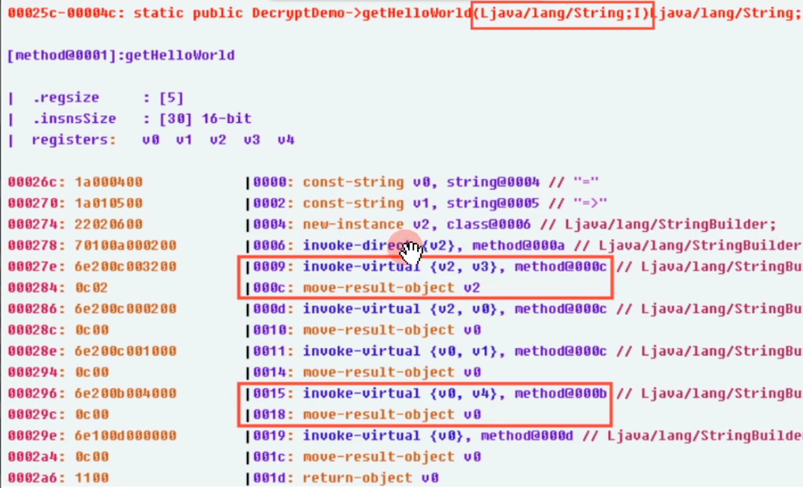
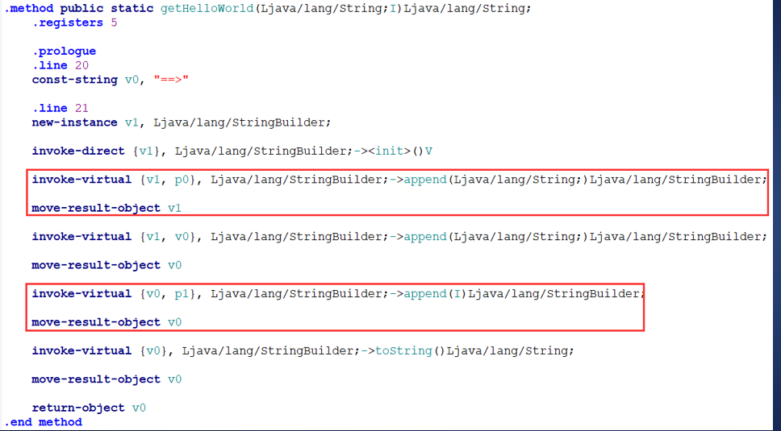
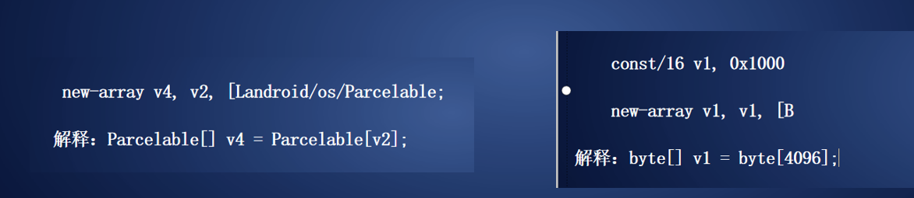
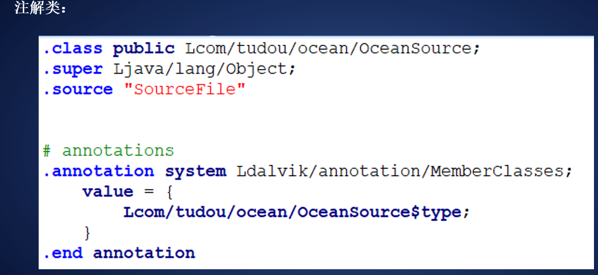
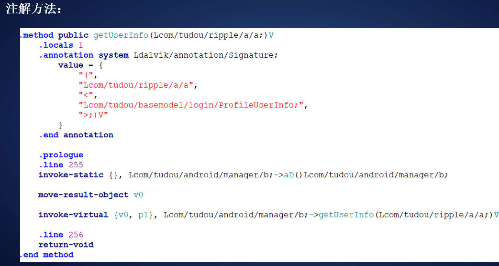
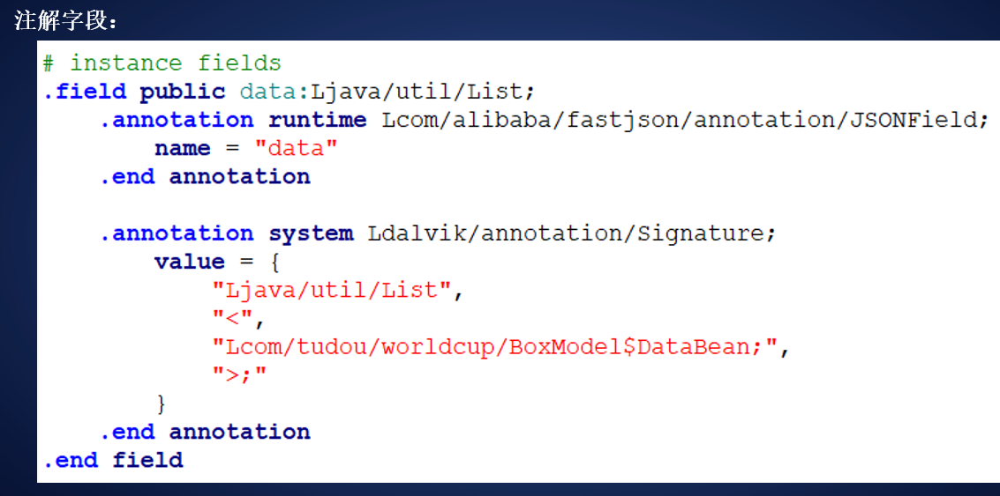
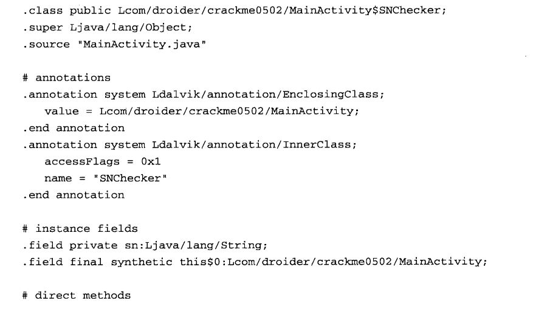
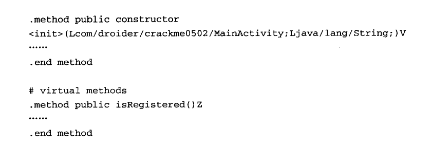
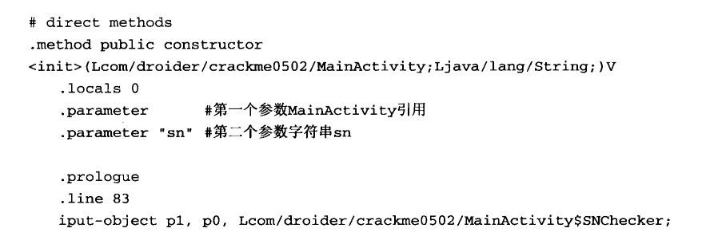
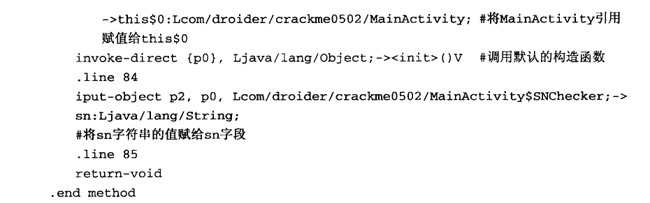

# SMAIL文件格式

使用Apktool反编译apk文件后，会在反编译工程目录下生成一个smali文件夹，里面存放着所有反编译出的smali文件，这些文件会根据程序包的层次结构生成相应的目录，程序中所有的类都会在相应的目录下生成独立的smali 文件。如上一节中程序的主Activity名为com.droider.crackme0502.MainActivity,就会在smali目录下依次生成com\droider\crackme0502目录结构，然后在这个目录下生成MainActivity.smali文件。

无论是普通类、抽象类、接口类或者内部类,在反编译出的代码中,它们都以单独的smali
文件来存放。每个smali文件都由若干条语句组成，所有的语句都遵循着一套语法规范。 ’

## **dalvik寄存器**

dalvik中的寄存器都是32位大小，这个就直接记住，它支持所有类型。对于小于或等于32位类型，使用一个寄存器就够啦，对64位（long和double)类型，可以使用两个相邻的寄存器来

存储

smali语言是Davlik的[寄存器](https://so.csdn.net/so/search?q=寄存器&spm=1001.2101.3001.7020)语言，语法上和汇编语言相似，Dalvik VM与JVM的最大的区别之一就是Dalvik VM是基于寄存器的。基于寄存器的意思是，在smali里的所有操作都必须经过寄存器来进行。

 ## 基本数据类型

**B—byte
 C—char
 D—double
 F—float
 I—int
 S—short
 V—void
 J—long
 Z—boolean**

## **寄存器的命名法**

### v命名法

v命名法是变量 

比如说 现在一个方法 2个参数 有5个变量  v0-v4 那么v0-v2 这三个寄存器就是他的变量 v3 v4是这个方法的参数，就是从变量的个数的减去方法的参数个数 



### p命名法

p命名是参数

getHelloWorld方法，也是有两个参数。通过阅读smali代码可以看到有p开头的寄存器，所以这里采用的是p命名法。图中第一个红色方框里可以看到v1是局部寄存器，p0是参数寄存器。在图中第二个红色方框里可以看到v0是局部寄存器，p1是参数寄存器

## 字段

dalvik表示字段的格式：先看一个例子例如：Lpackage/name/****类名****;->****字段名:Ljava/lang/String;

解释 Lpackage/name/ObjectName;”这部分表示的是当前这个字段所在的类。

 “L”是“java类类型”，“package/name/”是包名，“ObjectName”是类名** 

 “FieldName“是字段名称****，****“Ljava/lang/String;”是字段类型

注意:字段名称和字段类型之间要用“:”隔开。

字段格式：

 类型（包名＋类名）＋字段名称＋字段类型

 例：****(****尝试解释一下****)

 Landroid/content/pm/ActivityInfo;->theme:I** **Lorg/cocos2dx/lua/AppActivity;->handler:Landroid/os/Handler;

## 方法

 例如：Lpackage/name/ObjectName;->MethodName (III) Z

Lpackage/name/ObjectName;这部分表示的是当前这个方法所在的类。

 L是java类类型，package/name/是包名，ObjectName是类名**，

 MethodName这部分表示的是方法名

 (III) Z 这部分表示的是方法的签名信息，由方法参数列表(III)和返回值（Z）构成

　　　　(III)表示三个int型参数；Z表示返回值类型为 boolean。

格式：

 类型（包名＋类名）＋方法名（＋参数类型）＋返回值类型

 Landroid/os/Handler;-><init>()V

 Landroid/app/Activity;->onCreate(Landroid/os/Bundle;)V

## Dalvik指令集

 基础字节码 - 名称后缀/字节码后缀 目的寄存器 源寄存

 “- ”这个连接符号在有的指令里是没有的

 名称后缀是wide，表示数据宽度为64位****、****字节码后缀是from16，表示源寄存器为16位

例如：基础字节码 - 名称后缀/字节码后缀 目的寄存器 源寄存

 move-wide/from16 vAA,VBBBB

 move为基础字节码,即opcode****，****wide为名称后缀,标识指令操作的数据宽度为64位****，

 from16为字节码后缀,标识源为一个16位的寄存器引用变量** **；

 vAA为目的寄存器,它始终在源的前面，取值范围为v0~v255****，

 vBBBB为源寄存器，取值范围为v0~v65535****；

Dalvik 指令集中大多数指令用到了寄存器作为目的操作数或源操作数，其中 A/B/

 /D/E/F/G/H 代表一个4位的数值， AA/BB/.../HH代表一个8位的数值，AAAA/BBBB/

 .../HHHH 代表一个16位的数值****；

 接下来我们学习13种dalvik指令的使用

### 空操作指令

空操作指令的助记符为nop。它的值为00，

通常nop指令被用来对齐代码之用，无实际操作

### 数据操作指令

数据操作指令为move。 move 指令根据字节码大小与类型不同，后面会跟上不同的后缀；

格式：基础字节码 - 名称后缀/字节码后缀 目的寄存器 源寄存

move vA, vB：将vB寄存器的值赋给vA寄存器，源寄存器与目的寄存器都为4位。

move/from16 vAA, vBBBB：将vBBBB寄存器的值赋给vAA寄存器，源寄存器为16位，目的寄存器为8位。

move/16 vAAAA, vBBBB：将vBBBB寄存器的值赋给vAAAA寄存器源寄存器与目的寄存器都为16位。

move-wide vA, vB：为4位的寄存器对赋值。源寄存器与目的寄存器都为4位。

move-object vA, vB：object是对象的意思，那这里就是为对象赋值。源寄存器与目的寄存器都为4位。

move-object/from16 vAA, vBBBB：为对象赋值。源寄存器为16位，目的寄存器为8位。

move-object/16 vAA, vBBBB：为对象赋值。源寄存器与目的寄存器都为16位。

move-result vAA：将上一个invoke类型指令操作的单字非对象结果赋给vAA寄存器。

move-result-wide vAA：将上一个invoke类型指令操作的双字非对象结果赋给vAA寄存器。

move-result-object vAA：将上一个invoke类型指令操作的对象结果赋给vAA寄存器。

move-exception vAA：保存运行时发生的异常到vAA寄存器，

这条指令必须是异常发生时的异常处理器的一条指令。否则的话指令无效。

分析了这么多，总结起来move指令有三种作用：

第一种作用：进行赋值操作、第二种作用：move-result 接收返回值操作、第三种作用：处理异常的操作

### 返回指令

**return就是返回的意思，大家根据这个英文就可以理解**

**return-void：表示函数从一个void方法返回，返回值为空。**

**return vAA：表示函数返回一个32位非对象类型的值，返回值寄存器为8位的寄存器vAA。**

**return-wide vAA：表示函数返回一个64位非对象类型的值，返回值为8位的寄存器对vAA。**

**return-object vAA：这里面出现了object,表示函数返回一个对象类型的值。**

**返回值为8位的寄存器vAA**

### 数据定义指令

**数据定义指令用来定义程序中用到的常量，字符串，类等数据**

**const/4 vA, #+B：将数值符号扩展为32位后赋给寄存器vA。**

**const/16 vAA, #+BBBB”：将数据符号扩展为32位后赋给寄存器vAA。**

**const vAA, #+BBBBBBBB：将数值赋给寄存器vAA。**

**const/high16 vAA, #+BBBB0000：将数值右边零扩展为32位后赋给寄存器vAA。**

**const-wide/16 vAA, #+BBBB：将数值符号扩展为64位后赋给寄存器对vAA。**

**const-wide/32 vAA, #+BBBBBBBB：将数值符号扩展为64位后赋给寄存器vAA。**

**const-wide vAA, #+BBBBBBBBBBBBBBBB：将数值赋给寄存器vAA。**

**const-wide/high16 vAA, #+BBBB000000000000：将数值右边零扩展为64位后赋给寄存器vAA。**

**const-string vAA, string@BBBB：通过字符串索引构造一个字符串并赋给寄存器vAA。**

**const-string/jumbo vAA, string@BBBBBBBB：通过字符串索引（较大）构造一个字符串并赋给寄存器vAA。**

**const-class vAA, type@BBBB：通过类型索引获取一个类引用并赋给寄存器vAA。**

**const-class/jumbo vAAAA, type@BBBBBBBB：通过给定的类型索引获取一个类引用并赋给寄存器vAAAA。**

**这条指令占用两个字节，值为0xooff（Android4.0中新增的指令）。**

### 实例操作指令

**1-** **check-cast vAA, type@BBBB：将vAA寄存器中的对象引用转换成指定的类型。**

**如果失败会报出ClassCastException异常。**

**如果类型B指定的是基本类型，对于非基本类型的A来说，运行时始终会失败。**

**实例：**

 **check-cast v0, Lcom/renren/mobile/android/dao/AccountDAO;**

 **转成****java****：****(AccountDAO)v0;**

 **check-cast v0, Landroid/widget/ImageView;**

 **转成****java****：****(ImageView)v0****；**

**2-****instance-of vA, vB, type@CCCC：判断vB寄存器中的对象引用是否可以转换成指定的类型。**

**如果可以vA寄存器赋值为1，否则vA寄存器赋值为0。**


**实例：**

  **instance-of v1, p1, Landroid/support/v4/util/Pair;**

**（****v1****里面存放的是布尔值：如果****p1****能转换成后面指定类型****Pair****，则****v1****是****1****；否则，****v1****是****0****）**

 **instance-of v1, v0, Landroid/support/v4/view/ViewPager;**

**（****v1****里面存放的是布尔值：如果****v0****能住转换成指定类型****ViewPager****，则****v1****是****1****；否则，为****v1****是****0****）**

**3-****new-instance vAA, type@BBBB：构造一个指定类型对象的新实例，并将对象引用赋值给vAA寄存器。**

**类型符type指定的类型不能是数组类。**

**实例：**

 **new-instance v0, Landroid/support/v4/view/PagerTitleStrip$PagerTitleStripImplIcs;**

 **解释：****PagerTitleStripImplIcs** **v0 =**  **new PagerTitleStripImplIcs();**

 **new-instance v1, Landroid/widget/TextView;**

 **解释：****TextView v1 = new TextView();****3-****new-instance vAA, type@BBBB：构造一个指定类型对象的新实例，并将对象引用赋值给vAA寄存器。**

**类型符type指定的类型不能是数组类。**

**实例：**

 **new-instance v0, Landroid/support/v4/view/PagerTitleStrip$PagerTitleStripImplIcs;**

 **解释：****PagerTitleStripImplIcs** **v0 =**  **new PagerTitleStripImplIcs();**

 **new-instance v1, Landroid/widget/TextView;**

 **解释：****TextView v1 = new TextView();**

### 数组操作指令

**数组操作包括获取数组长度，新建数组，数组赋值，数组元素取值与赋值等操作**

 **array-length vA, vB：**

 **获取给定vB寄存器中数组的长度并将值赋给vA寄存器。数组长度指的是数组的条目个数。**

 **实例：**

**new-array vA, vB, type@CCCC：**

 **构造指定类型（type@CCCC）与大小（vB）的数组，并将值赋给vA寄存器。**

 **实例：（加****new****）**



**filled-new-array {vC, vD, vE, vF, vG},type@BBBB：**

  **构造指定类型（type@BBBB）与大小（vA）的数组并填充数组内容。vA寄存器是隐含使用的，除了指定数组的大小外还指定了参数的个数，vC~vG是使用到的参数寄存序列。**

 **实例：**

 **filled-new-array {v0, v1}, [I**

 **解释：****int[] array = new int[vA]{v0****，****v1};**

**fill-array-data vAA, +BBBBBBBB：**

 **用指定的数据来填充数组，vAA寄存器为数组引用，引用必须为基础类型的数组，在指令后面会紧跟一个数据表。**


 **解释：****float[] v1=new float[]{****数据****1****，数据****2****};**

### 异常指令

**“throw vAA”抛出vAA寄存器中指定类型的异常**

### 跳转指令

**Dalvik指令集中有三种跳转指令：**

 **（1）goto：无条件跳转**

 **（2）switch：分支跳转**

​    **packed-switch：有规律跳转****、****sparse-switch: 无规律跳转**

 **（3）if：条件跳转**   

​      **if-eq：等于/if-ne：不等于****、****if-lt****（****less than****）****：小于/if-le：小于等于**

​    **if-gt****（greater than）****：大于/if-ge：大于等于****、****if-eqz：等于0/if-nez：不等于0**

​    **if-ltz：小于0/if-lez：小于等于0****、****if-gtz：大于0/if-gez：大于等于0**

### 比较指令

**比较指令用于对两个寄存器的值（浮点型或长整型）进行比较。**

 **大于(1)/等于(0)/小于(-1)=>cmpg、cmp****、****大于(-1)/等于(0)/小于(1)=>cmpl**

**例如：cmp-long vAA, vBB, vCC****：****比较两个长整型数。如果vBB大于vCC，则结果为1，相等则为0，小于则结果为-1。**

**例如：cmpg-float vAA, vBB, vCC****：****比较两个单精度浮点数。如果vBB大于vCC，结果为1，相等则为0，小于的话为-1。**

### 字段操作指令

普通字段 => iget读 / iput 写

**实例：**

**iget v2, p0, Landroid/support/design/internal/ForegroundLinearLayout;->mq:I**

 **解释：把****this****指向的****int****类型的****mq****给****v2****；**

**iput v0, p0, Landroid/support/design/internal/ForegroundLinearLayout;->mq:I**

 **解释：把****v0****的值写入****this****指向的****mq****；**

**静态字段 => sget读 / sput 写**

**实例：**

 **sget-object v0, Landroid/support/design/R$styleable;->ForegroundLinearLayout:[I**

 **解释：把****ForegroundLinearLayout****给****v0****；**

 **sput v0, Landroid/support/v4/app/NotificationManagerCompat;->Hp:I**

 **解释：****v0****给****Hp**

### 方法调用指令

**根据方法类型不同，共有5条方法调用指令**

 **invoke-virtual ：调用实例的虚方法**


 **invoke-super ：调用实例的父类/基类方法**

 **invoke-direct ：调用实例的直接方法**

 **invoke-static ：调用实例的静态方法**

 **invoke-interface ：调用实例的接口方法**

### 数据转换指令

**数据转换指令用于将一种类型的数值转换成另一种类型。**

**它的格式为“opcode vA, vB”，vB寄存器存放需要转换的数据，转换后的结果保存在vA寄存器中。**

 **neg-数据类型 => 求补**

 **not-数据类型 => 求反**

 **数据类型1-to-数据类型2 => 将数据类型1转换为数据类型2**

### 数据运算指令

**add/sub/mul/div/rem   加/减/乘/除/模**

 **and/or/xor 与/或/异或**

 **shl/shr/ushr 有符号左移/有符号右移/无符号右移**

## smali文件详解

### **描述类的信息**

**在打开smali文件的时候，它的头三行描述了当前类的一些信息**

　　　**.class < 访问权限> [ 修饰关键字] < 类名>**

  **.super < 父类名>**

  **.source <源文件名>**

**.class指令表示当前的类名，类的访问权限是public，类名为LHelloWorld，类开头的L表示后面跟随的字符串是一个类。**

**.super指定了当前类所继承的父类，后面指的就是这个父类的类名，L表示后面跟的字符串是一个类.**

**在这里同学们会发现，source行代码为空。是原因经过混淆的dex文件，**

**反编译出来的smali代码可能没有源文件信息，因此source行的代码可能为空，这一点大家要注意。**


**method这四行我们先跳过，稍后学习中会讲到。接着往下看，**

**nop,从这里开始是我们上节课讲到的dalvik指令**

### 静态字段

**# static fields**

**.field < 访问权限> static [ 修饰关键字]< 字段名>:< 字段类型>**

**baksmali在生成smali文件时，会在静态字段声明的起始处添加注释”static fields”，注释是以#开头。**

**访问权限包括：private、protected、public修饰关键字为字段其他属性，例如，final字段名和类型就不用解释了**

### **实例字段**

**相比于静态字段就少了一个static的静态声明而已，其他都一样。** 

**# instance fields**

**.field < 访问权限> [ 修饰关键字] < 字段名>:< 字段类型>****例：**

### **直接方法**

**直接方法指的是该类中定义的方法。**

**# direct methods**

**.method <访问权限> [ 修饰关键字] < 方法原型>****、**

**<.registers>****、****<.locals> [.param][.prologue][.line]<代码体>**

 **.end method**

**#direct methods 是注释，是baksmali添加的，访问权限和修饰关键字 跟字段是一样的。方法原型 描述了**

**方法的名称、参数与返回值。**

**.registers 指令指定了方法中寄存器的总数,这个数量是参数和本地变量总和。**

**.param 表明了方法的参数，每个.param指令表示一个参数，方法使用了几个参数就有几个.parameter指令。**

**.prologue 指定了代码的开始处，混淆过的代码可能去掉了该指令。**

**.line 指明了该处代码在源代码中的行号，同样，混淆后的代码可能去掉了行号。**

**.local 使用这个指定表明方法中非参寄存器**

### **虚方法**

**虚方法指的是从父类中继承的方法或者实现的接口的方法，它的声明跟直接方法相同，**

**只是起始的初始为“virtual methods”。**

**# virtual methods**

**.method <访问权限> [ 修饰关键字] < 方法原型>**

**<.registers><.locals> [.param]  [.prologue] [.line] <代码体>**

**.end method**

### **接口**

**如果一个类实现了一个接口，那么会在smali文件中用.implements指令指出。**

**# interfaces**

**.implements < 接口名>**

**#interfaces是注释，**

**.implements 是接口关键字，后面的接口名是 DexClassDef 结构中 interfacesOff 字段指定的内容**

### **注解**

**如果一个类使用了注解，那么sma # annotations**

**.annotation [ 注解属性] < 注解类名>[ 注解字段 = 值]**

 **.end annotation**

**注解的作用范围可以是类、方法或字段。**

**如果注解的作用范围是类，“.annotation” 指令会直接定义在 smali 文件中；**

**如果是方法或字段，“.annotation ”指令则会包含在方法或字段定义中。li中会使用.annotation指令**








## 实战例子

```java
.class public Lcom/droider/crackme0201/MainActivity;              
#指定了当前类的类名为Lcom/droider/crackme0201/MainActivity$1         
.super Landroid/app/Activity;                                 
#指定了父类为 Ljava/lang/Object
.source "MainActivity.java"                                    
    #指定了当前类的类名为"MainActivity.java"


# instance fields  实例字段    field <访问权限> [修饰关键字<字段名>:<字段类型>                                      
.field private btn_register:Landroid/widget/Button;       #表示一个私有字段 btn_register，它的类型为Button

.field private edit_sn:Landroid/widget/EditText;

.field private edit_userName:Landroid/widget/EditText;


# direct methods   直接方法   .method<访问权限> [修饰关键字] <方法原型>
.method public constructor <init>()V     #无参构造函数
    .locals 0     #.locals指定了使用的局部变量的个数
                         #
    .prologue     #.prologue指定了代码的开始处，混淆过的代码可能去掉了该指令。
    .line 17
    invoke-direct {p0}, Landroid/app/Activity;-><init>()V   #这里init()就是定义在Activity中的一个private函数

    return-void        #即无返回值
.end method

.method static synthetic access$0(Lcom/droider/crackme0201/MainActivity;)Landroid/widget/EditText;
    .locals 1

    .prologue
    .line 18       #.method static synthetic access$0
    iget-object v0, p0, Lcom/droider/crackme0201/MainActivity;->edit_userName:Landroid/widget/EditText;

    return-object v0
.end method

.method static synthetic access$1(Lcom/droider/crackme0201/MainActivity;)Landroid/widget/EditText;
    .locals 1

    .prologue           
    .line 19            #private EditText edit_sn;
    iget-object v0, p0, Lcom/droider/crackme0201/MainActivity;->edit_sn:Landroid/widget/EditText;

    return-object v0
.end method

.method static synthetic access$2(Lcom/droider/crackme0201/MainActivity;Ljava/lang/String;Ljava/lang/String;)Z
    .locals 1

    .prologue
    .line 52    
    invoke-direct {p0, p1, p2}, Lcom/droider/crackme0201/MainActivity;->checkSN(Ljava/lang/String;Ljava/lang/String;)Z

    move-result v0

    return v0
.end method

.method static synthetic access$3(Lcom/droider/crackme0201/MainActivity;)Landroid/widget/Button;
    .locals 1

    .prologue
    .line 20        #.line指定了该处指令在源代码中的行号，同样的，混淆过的代码可能去除了行号信息。
    iget-object v0, p0, Lcom/droider/crackme0201/MainActivity;->btn_register:Landroid/widget/Button;
    #从v0寄存器中获取MainActivity类中的btn_register变量，变量类型是Button
    #这里注意一下 Lcom/droider/crackme0201是它的包名，MainActivity是它的类名 btn_register是它的变量名
    return-object v0
.end method

.method private checkSN(Ljava/lang/String;Ljava/lang/String;)Z
    .locals 10
    .param p1, "userName"    # Ljava/lang/String;
    .param p2, "sn"    # Ljava/lang/String;

    .prologue
    const/4 v7, 0x0    #把0x0放到v7

    .line 54
    if-eqz p1, :cond_0          #p1是userName，如果username=null 就跳转  cond_0
     #这里要补充两个smali指令 一个是if-eqz 另一个是if-nez 这两条指令是相对的 
      #(1)if-eqz vA, vB, :cond如果vA等于vB则跳转到:cond
      #(2)if-nez vA, vB, :cond如果vA不等于vB则跳转到:cond

    :try_start_0
    invoke-virtual {p1}, Ljava/lang/String;->length()I

    move-result v8   #length方法返回结果到v8

    if-nez v8, :cond_1     #如果v8不等于null就跳转

    .line 76    
    :cond_0        #如果不跳转 运行 cond_0部分 也就是返回v7
    :goto_0
    return v7

    .line 56    #源代码if ((sn == null) || (sn.length() != 16))
    :cond_1        #如果v8不等于0 就来这里
    if-eqz p2, :cond_0     #如果 sn=null 就跳转  cond_0

    invoke-virtual {p2}, Ljava/lang/String;->length()I

    move-result v8

    const/16 v9, 0x10   #v9=0x10 也就是0x10十进制16

    if-ne v8, v9, :cond_0     #如果v8不等于v9跳 也就是v8等于16程序继续运行

    .line 58       #源码MessageDigest digest = MessageDigest.getInstance("MD5");
    const-string v8, "MD5"

    invoke-static {v8}, Ljava/security/MessageDigest;->getInstance(Ljava/lang/String;)Ljava/security/MessageDigest;

    move-result-object v1

    .line 59
    .local v1, "digest":Ljava/security/MessageDigest;
    invoke-virtual {v1}, Ljava/security/MessageDigest;->reset()V

    .line 60
    invoke-virtual {p1}, Ljava/lang/String;->getBytes()[B

    move-result-object v8

    invoke-virtual {v1, v8}, Ljava/security/MessageDigest;->update([B)V

    .line 61
    invoke-virtual {v1}, Ljava/security/MessageDigest;->digest()[B

    move-result-object v0

    .line 62
    .local v0, "bytes":[B
    const-string v8, ""

    invoke-static {v0, v8}, Lcom/droider/crackme0201/MainActivity;->toHexString([BLjava/lang/String;)Ljava/lang/String;

    move-result-object v3

    .line 63
    .local v3, "hexstr":Ljava/lang/String;
    new-instance v5, Ljava/lang/StringBuilder;

    invoke-direct {v5}, Ljava/lang/StringBuilder;-><init>()V

    .line 64
    .local v5, "sb":Ljava/lang/StringBuilder;
    const/4 v4, 0x0

    .local v4, "i":I
    :goto_1
    invoke-virtual {v3}, Ljava/lang/String;->length()I

    move-result v8

    if-lt v4, v8, :cond_2

    .line 67
    invoke-virtual {v5}, Ljava/lang/StringBuilder;->toString()Ljava/lang/String;

    move-result-object v6

    .line 70
    .local v6, "userSN":Ljava/lang/String;
    invoke-virtual {v6, p2}, Ljava/lang/String;->equalsIgnoreCase(Ljava/lang/String;)Z

    move-result v8

    if-eqz v8, :cond_0

    .line 76
    const/4 v7, 0x1

    goto :goto_0

    .line 65
    .end local v6    # "userSN":Ljava/lang/String;
    :cond_2
    invoke-virtual {v3, v4}, Ljava/lang/String;->charAt(I)C

    move-result v8

    invoke-virtual {v5, v8}, Ljava/lang/StringBuilder;->append(C)Ljava/lang/StringBuilder;
    :try_end_0
    .catch Ljava/security/NoSuchAlgorithmException; {:try_start_0 .. :try_end_0} :catch_0

    .line 64
    add-int/lit8 v4, v4, 0x2

    goto :goto_1

    .line 72
    .end local v0    # "bytes":[B
    .end local v1    # "digest":Ljava/security/MessageDigest;
    .end local v3    # "hexstr":Ljava/lang/String;
    .end local v4    # "i":I
    .end local v5    # "sb":Ljava/lang/StringBuilder;
    :catch_0
    move-exception v2

    .line 73
    .local v2, "e":Ljava/security/NoSuchAlgorithmException;
    invoke-virtual {v2}, Ljava/security/NoSuchAlgorithmException;->printStackTrace()V

    goto :goto_0
.end method

.method private static toHexString([BLjava/lang/String;)Ljava/lang/String;
    .locals 7
    .param p0, "bytes"    # [B
    .param p1, "separator"    # Ljava/lang/String;

    .prologue
    .line 80
    new-instance v2, Ljava/lang/StringBuilder;

    invoke-direct {v2}, Ljava/lang/StringBuilder;-><init>()V

    .line 81
    .local v2, "hexString":Ljava/lang/StringBuilder;
    array-length v4, p0

    const/4 v3, 0x0

    :goto_0
    if-lt v3, v4, :cond_0

    .line 88
    invoke-virtual {v2}, Ljava/lang/StringBuilder;->toString()Ljava/lang/String;

    move-result-object v3

    return-object v3

    .line 81
    :cond_0
    aget-byte v0, p0, v3

    .line 82
    .local v0, "b":B
    and-int/lit16 v5, v0, 0xff

    invoke-static {v5}, Ljava/lang/Integer;->toHexString(I)Ljava/lang/String;

    move-result-object v1

    .line 83
    .local v1, "hex":Ljava/lang/String;
    invoke-virtual {v1}, Ljava/lang/String;->length()I

    move-result v5

    const/4 v6, 0x1

    if-ne v5, v6, :cond_1

    .line 84
    const/16 v5, 0x30

    invoke-virtual {v2, v5}, Ljava/lang/StringBuilder;->append(C)Ljava/lang/StringBuilder;

    .line 86
    :cond_1
    invoke-virtual {v2, v1}, Ljava/lang/StringBuilder;->append(Ljava/lang/String;)Ljava/lang/StringBuilder;

    move-result-object v5

    invoke-virtual {v5, p1}, Ljava/lang/StringBuilder;->append(Ljava/lang/String;)Ljava/lang/StringBuilder;

    .line 81
    add-int/lit8 v3, v3, 0x1

    goto :goto_0
.end method


# virtual methods
.method public onCreate(Landroid/os/Bundle;)V     #一个名为 onCreate 并且有一个参数为 Bundle 类型，参数名为 savedInstanceState。
    .locals 2
    .param p1, "savedInstanceState"    # Landroid/os/Bundle;  

    .prologue
    .line 23
    invoke-super {p0, p1}, Landroid/app/Activity;->onCreate(Landroid/os/Bundle;)V    
    #p0 代表当前，也就是 this，对应类型为 Landroid/support/v7/app/AppCompatActivity；   
    #p1 则对应参数 onCreate(Landroid/os/Bundle;)V，这里参数依旧使用上面的 Bundle –> savedInstanceState

    .line 24
    const/high16 v0, 0x7f030000         #setContentView(R.layout.activity_main);

    invoke-virtual {p0, v0}, Lcom/droider/crackme0201/MainActivity;->setContentView(I)V

    .line 25
    const v0, 0x7f050009        #源码 setTitle(R.string.unregister);  //模拟程序未注册

    invoke-virtual {p0, v0}, Lcom/droider/crackme0201/MainActivity;->setTitle(I)V
    # invoke-virtual用于调用protected或public函数，同样注意修改smali时不要错用invoke-direct或invoke-static
    .line 26
    const v0, 0x7f080001        #源码 edit_userName = (EditText) findViewById(R.id.edit_username);

    invoke-virtual {p0, v0}, Lcom/droider/crackme0201/MainActivity;->findViewById(I)Landroid/view/View;

    move-result-object v0

    check-cast v0, Landroid/widget/EditText;

    iput-object v0, p0, Lcom/droider/crackme0201/MainActivity;->edit_userName:Landroid/widget/EditText;

    .line 27
    const v0, 0x7f080002
                                  #源码edit_sn = (EditText) findViewById(R.id.edit_sn);
    invoke-virtual {p0, v0}, Lcom/droider/crackme0201/MainActivity;->findViewById(I)Landroid/view/View;

    move-result-object v0 # v0保存的就是调用this.findViewById方法返回的view实例。

    check-cast v0, Landroid/widget/EditText;

    iput-object v0, p0, Lcom/droider/crackme0201/MainActivity;->edit_sn:Landroid/widget/EditText;

    .line 28
    const v0, 0x7f080003
                            #源码btn_register = (Button) findViewById(R.id.button_register);
    invoke-virtual {p0, v0}, Lcom/droider/crackme0201/MainActivity;->findViewById(I)Landroid/view/View;

    move-result-object v0

    check-cast v0, Landroid/widget/Button;       #检查类型是否可以转换

    iput-object v0, p0, Lcom/droider/crackme0201/MainActivity;->btn_register:Landroid/widget/Button;
      #MainActivity类里的一个名为btn_register类型为button的属性拿过来，这里是修饰p0，其实也就是this.name
    .line 29
    iget-object v0, p0, Lcom/droider/crackme0201/MainActivity;->btn_register:Landroid/widget/Button;
    #从v0寄存器中获取MainActivity类中的btn_register变量，变量类型是Button 
    
    new-instance v1, Lcom/droider/crackme0201/MainActivity$1;
     #创建一个对象，放入v1寄存器，类型是MainActivity$1
     
    invoke-direct {v1, p0}, Lcom/droider/crackme0201/MainActivity$1;-><init>(Lcom/droider/crackme0201/MainActivity;)V
    #这里init()就是定义在MainActivity$1中的一个private函数
    invoke-virtual {v0, v1}, Landroid/widget/Button;->setOnClickListener(Landroid/view/View$OnClickListener;)V
    #用于调用protected或public函数，同样注意修改smali时不要错用invoke-direct或invoke-static
    .line 44
    return-void
.end method
 
    }
.method public onCreateOptionsMenu(Landroid/view/Menu;)Z
   #源码public boolean onCreateOptionsMenu(Menu menu) {
     #   return true;
    .locals 2         #两个局部变量                                                
    .param p1, "menu"    # Landroid/view/Menu; #参数为menu

    .prologue   #函数开始
    .line 48               #getMenuInflater().inflate(R.menu.activity_main, menu);
    invoke-virtual {p0}, Lcom/droider/crackme0201/MainActivity;->getMenuInflater()Landroid/view/MenuInflater;

    move-result-object v0

    const/high16 v1, 0x7f070000   #把  0x7f070000存到v1中

    invoke-virtual {v0, v1, p1}, Landroid/view/MenuInflater;->inflate(ILandroid/view/Menu;)V

    .line 49
    const/4 v0, 0x1

    return v0
.end method

```


# 安卓程序中的类

## 内部类

Java语言允许在一个类的内部定义另一个类,这种在类中定义的类被称为内部类(Inner
Class)

内部类可分为成员内部类、静态嵌套类、方法内部类、匿名内部类。前面我们曾经
说过，baksmali 在反编译dex文件的时候，会为每个类单独生成了-一个smali文件，内部类
作为一个独立的类，它也拥有自己独立的smali 文件,只是内部类的文件名形式为“[外部
类]$[内部类].smali",例如下面的类

class Outer {
class Inner {}
}

baksmali反编译.上述代码后会生成两个文件: Outer.smali 与Outer$Inner.smali。查看5.2
节生成的smali文件，发现在smalicom)droider\crackme0502目录下有一个MainActivity$
SNChecker.smali文件，这个SNChecker就是MainActivity的一个内部类。打开这个文件，
代码结构如下





发现它有两个注解定义块“Ldalvik/annotation/EnclosingClass;"与“Ldalvik/annotation/
InnerClass;

"两个实例字段sn与this$0一个直接方法init()、一个虚方法isRegistered()。注解定义块我们稍后进行讲解。先看它的实例字段，sn 是字符串类型, this$0 是MainActivity类型，synthetic 关键字表明它是“合成”的，那this$0到底是个什么东西呢?其实this$O是内部类自动保留的一个指向所在外部类的引用。左边的this表示为父类的引用，右边的数值0表示引用的层数。我们看下面的类。

```
public class Outer {
/ / this$0
public class FirstInner {
/ /this$1
public class SecondInner { / / this$2 
public class ThirdInner {
}
}
}
```

每往里一层右边的数值就加一-，如ThirdInner类访问FirstInner 类的引用为this$1.在生
成的反汇编代码中，this$X 型字段都被指定了synthetic 属性，表明它们是被编译器合成的、
虚构的，代码的作者并没有声明该字段。我们再看看MainActivity$SNChecker的构造函数，看它是如何初始化的。代码如下。





细心的读者会发现，这段代码声明时使用“.parameter”指令指定了两个参数，而实际
上却使用了p0~p2共3个寄存器，为什么会出现这种情况呢?

在第3章介绍Dalvik虚拟机时曾经讲过，对于一个非静态的方法而言，会隐含的使用p0寄存器当作类的this引用。因此,这里的确是使用了3个寄存器: p0 表示MainActivity$SNChecker自身的引用,pl 表示
MainActivity的引用,p2表示sn字符串。另外，从MainActivity$SNChecker的构造函数可以看出,

内部类的初始化共有以下3个步骤:首先是保存外部类的引用到本类的一个synthetic字段中，以便内部类的其它方法使用，然后是调用内部类的父类的构造函数来初始化父类，最后是对内部类自身进行初始化。

阅读反编译的smali代码

## 循环语句smail格式

迭代器循环

http://code.newban.cn/172.html

https://blog.csdn.net/CLinuxF/article/details/88319485

